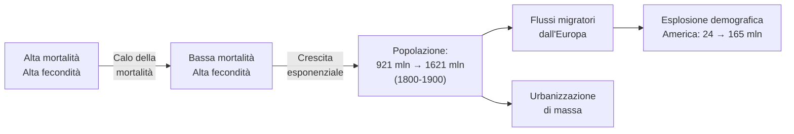
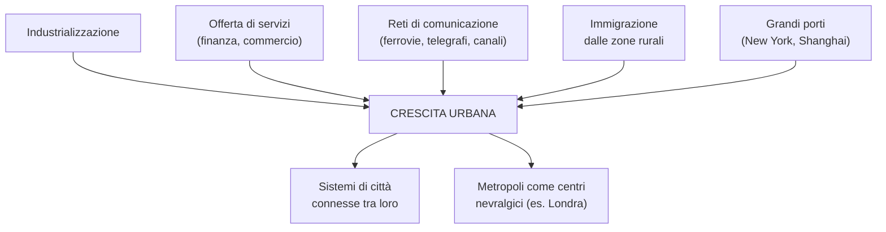
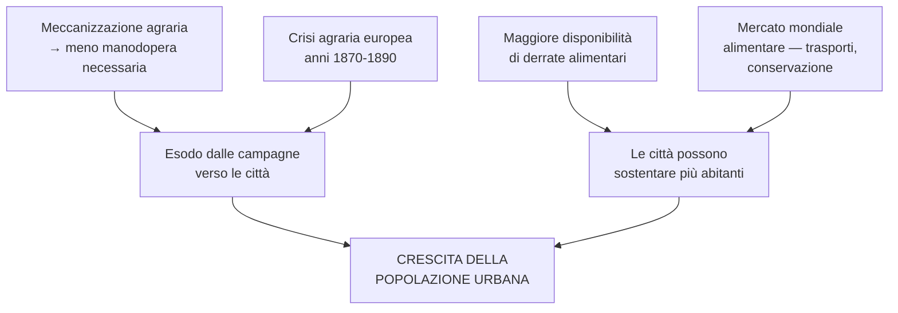
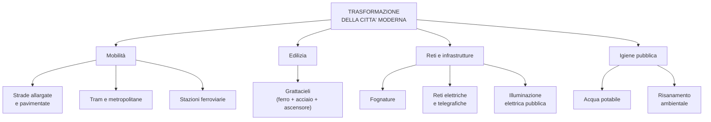
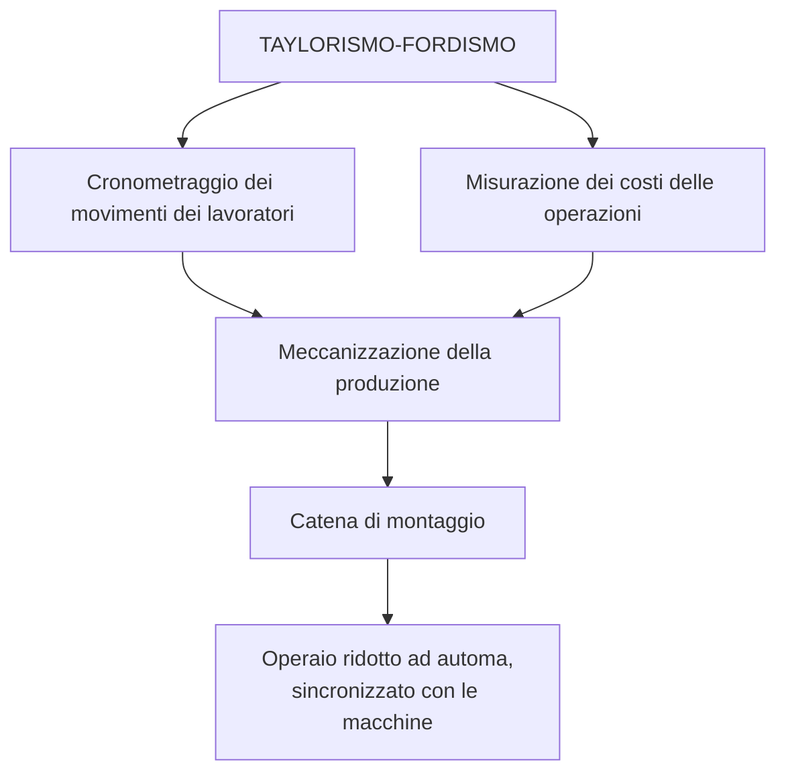
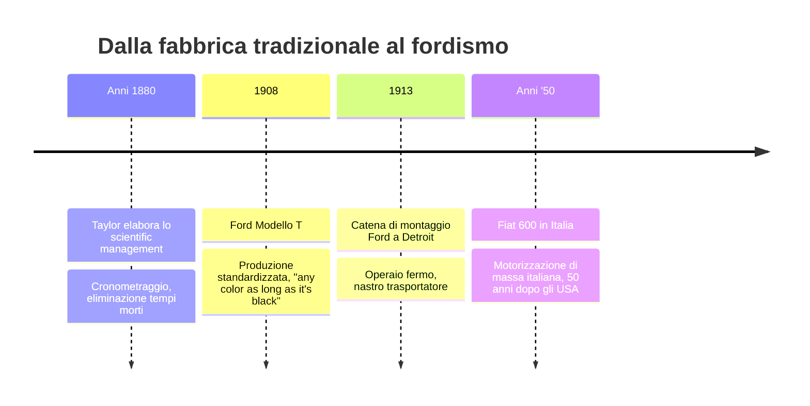
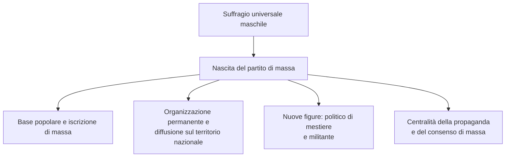
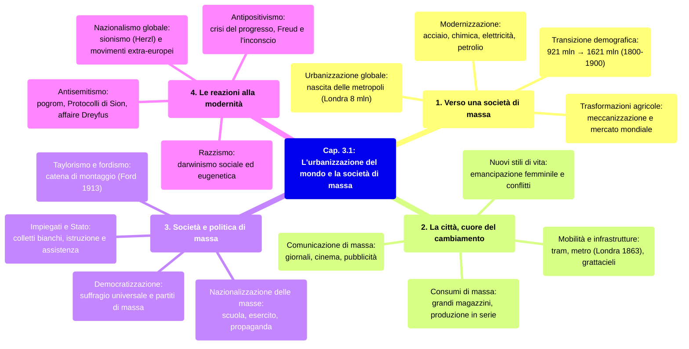

# Schema di Studio - Capitolo 3.1: L'urbanizzazione del mondo e la società di massa

> [!note] Dalla lezione
> Il prof sottolinea che questo è un capitolo **discorsivo**, non basato su date, eventi o personaggi specifici, ma "sintetico e allo stesso tempo ricco e chiaro" su urbanizzazione e società di massa.

---

## Date fondamentali

| Anno                      | Evento                                                                                                                                                                              |
| :------------------------ | :---------------------------------------------------------------------------------------------------------------------------------------------------------------------------------- |
| **1850**                  | **Parigi** raggiunge un milione di abitanti (seconda città dopo Londra)                                                                                                             |
| **1860**                  | A **Londra** iniziano i lavori per la **metropolitana**, primo sistema di trasporto sotterraneo al mondo                                                                            |
| **1865**                  | A **Manchester** viene fondato il primo comitato per il **suffragio femminile**                                                                                                     |
| **1865**                  | Apertura degli **Stock Yards** (macelli industriali) a **Chicago**                                                                                                                  |
| **1871**                  | Chicago devastata da un terribile **incendio**; ricostruita nei due decenni successivi                                                                                              |
| **1875**                  | In **Germania** viene fondato il **Partito socialdemocratico tedesco** (SPD), primo partito di massa                                                                                |
| **1885**                  | Inaugurazione del **primo grattacielo** a Chicago                                                                                                                                   |
| **Anni '80 del XIX sec.** | **Frederick W. Taylor** elabora lo *scientific management*                                                                                                                          |
| **1886**                  | A Chicago, manifestazioni e repressione di maggio: origine della celebrazione del **Primo maggio** come festa internazionale dei lavoratori (ricordata per la prima volta nel 1890) |
| **1894**                  | L'ufficiale ebreo **Alfred Dreyfus** viene condannato con accusa infondata di spionaggio                                                                                            |
| **1897-1898**             | Scrittura dei *Protocolli dei savi di Sion* (falso, svelato dal «Times» nel 1921)                                                                                                   |
| **1900**                  | **Londra** raggiunge **otto milioni di abitanti**                                                                                                                                   |
| **1903**                  | Pubblicazione dei *Protocolli dei savi di Sion*                                                                                                                                     |
| **1906**                  | **Dreyfus** viene pienamente riabilitato                                                                                                                                            |
| **1913**                  | La **catena di montaggio** viene introdotta negli stabilimenti **Ford** a Detroit                                                                                                   |

---

## 1. Verso una società di massa

### Transizione demografica e crescita della popolazione

Tra fine Ottocento e inizio Novecento, un processo di radicale cambiamento sociale investì l'**Occidente europeo** e gli **Stati Uniti**, dove l'**industrializzazione** si era diffusa grazie alla triade **acciaio, chimica, elettricità** (più il petrolio). Già a metà Settecento era iniziata la **transizione demografica**: grazie alla **diminuzione dei tassi di mortalità** — e specificamente del **calo della mortalità infantile** (sotto i 5-10 anni), il vero driver dell'esplosione demografica — la popolazione crebbe in modo esponenziale. Nel **1900** il pianeta contava **1,5 miliardi** di esseri umani, +50% rispetto a un secolo prima. L'**Asia** era il continente più popoloso (~**900 milioni** nel 1900), ma la popolazione europea crebbe a ritmo maggiore: da **160-170 milioni** (metà '700) a **195 milioni** (1800) a oltre **420 milioni** (1900).

Attraverso massicci **flussi migratori** dall'Europa, questa crescita alimentò l'esplosione demografica del **continente americano** (da **24 a 165 milioni** nell'Ottocento). La "massa" della popolazione acquisì un inedito ruolo sociale e politico: nasceva la **società di massa** moderna.

> **Transizione demografica**: passaggio da alti tassi di fecondità e mortalità a una situazione in cui entrambi questi indicatori sono bassi.

### Popolazione dei continenti nel XIX secolo (milioni di persone)

| Continente | 1800 | 1850 | 1900 |
|:---|:---:|:---:|:---:|
| Asia | 600 | 750 | 900 |
| Europa e Impero russo | 195 | 280 | 420 |
| Africa | 100 | 100 | 130 |
| America | 24 | 60 | 165 |
| Oceania | 2 | 2 | 6 |
| **Mondo** | **921** | **1192** | **1621** |

Il maggiore incremento riguardò il **continente americano** (quasi 7x in un secolo), seguito dall'**Oceania** (da 2 a 6 milioni). *(Fonte: M. Livi Bacci, Storia minima della popolazione del mondo, il Mulino, Bologna 2005, p. 45)*

---

### Urbanizzazione, metropoli e cause della crescita urbana

Nel secondo Ottocento iniziò un'**urbanizzazione su scala planetaria**, destinata a far superare la popolazione urbana su quella rurale solo nei primi anni del **XXI secolo**. In **Italia** l'inversione avvenne solo **dopo la Seconda guerra mondiale**. Tuttavia, urbanizzazione, modernizzazione e società di massa furono **fenomeni interconnessi**: la città divenne l'habitat naturale della modernità, generando l'**identificazione tra città e modernità**.

La storia delle **metropoli moderne** iniziò quando **Londra** raggiunse il milione di abitanti (2,5 milioni nel **1850**, 8 milioni nel **1900**). Intorno al **1850** fu **Parigi** a superare il milione, poi **New York** (**1857**) e **Vienna** (**1870**). Tra **1870** e **1900** il tasso di urbanizzazione globale passò dal **12% al 20%**. Tra **1850** e **1910** si registrò il **più alto tasso di crescita urbana** della storia europea.

**Città con oltre un milione di abitanti nel 1900:**
- **Americhe**: Chicago, New York, Filadelfia, Boston, Rio de Janeiro, Buenos Aires
- **Europa**: Glasgow, Londra, Parigi, Berlino, Vienna, San Pietroburgo, Mosca, Istanbul
- **Asia**: Pechino, Shanghai, Tokyo, Bombay, Calcutta

Nel **1913** si aggiunsero **Manchester, Birmingham, Glasgow, Istanbul, Amburgo, Budapest e Liverpool**.

Sebbene l'industrializzazione fosse un fattore, da sola non bastava: crescevano più rapidamente le città capaci di offrire **servizi** e attivare **reti commerciali e di comunicazione**. **Londra** non era una città industriale, ma la **capitale mondiale della finanza e del commercio** — un caso emblematico di metropoli cresciuta grazie ai servizi. Le città portuali (**New York**, **Shanghai**, **Hong Kong**) conobbero crescite rapidissime. Lo sviluppo delle reti di comunicazione (ferrovie, canali, telegrafi, navigazione) creò **sistemi di città connesse**, con una **metropoli come centro nevralgico** (Londra per l'Impero britannico).

> [!note] Dalla lezione
> **Milano come unica vera metropoli italiana.** Il prof nota che nessuna città italiana compare tra le grandi metropoli: l'unica che poteva aspirarvi era **Milano**, sede delle più importanti banche, della **Borsa italiana**, principale snodo ferroviario e autostradale — ma con il **costo della vita più alto d'Italia**. Ciò che Milano è per l'Italia, lo erano Londra, New York, Parigi, Berlino e Vienna per i rispettivi paesi.

### Il caso di Chicago

**Chicago**, fondata nel **1803**, passò da **350 abitanti** (1833) a **30.000** (1850), **334.000** (1871), **1.100.000** (1890) e **1.698.000** (1900). Questo sviluppo derivò dalla sua posizione di **snodo centrale per comunicazioni e commerci**: collegava la costa atlantica, i Grandi Laghi e la pianura del Mississippi tramite canali navigabili, e nel **1850** era già il principale centro ferroviario del Paese.

---

### Trasformazioni agricole e crescita urbana

Quattro fattori agricoli alimentarono l'urbanizzazione:
1. La **meccanizzazione agraria** diminuì la richiesta di manodopera, spingendo i lavoratori verso le città
2. L'**aumentata disponibilità di derrate alimentari** permise alle città di sostentare più abitanti
3. Il **mercato mondiale alimentare** (trasporti, conservazione) superò la dipendenza dalle campagne vicine
4. La **crisi agraria europea** (anni 1870-1890) incentivò l'emigrazione rurale verso le città

> **Produttività**: rapporto tra risorse impiegate nella produzione e risultato finale. Più alta la produttività, minori le risorse usate per una data quantità di produzione.

### La popolazione urbana in Europa nel XIX e XX secolo (% rispetto al totale)

| Paese | 1800 | 1850 | 1910 | 1950 | 1980 |
|:---|:---:|:---:|:---:|:---:|:---:|
| Europa | 12 | 19 | 41 | 51 | 66 |
| Regno Unito | 23 | 45 | 75 | 83 | 79 |
| Francia | 12 | 19 | 38 | 48 | 69 |
| Germania | 9 | 15 | 49 | 53 | 75 |
| Olanda | 37 | 39 | 53 | 75 | 82 |
| Spagna | 18 | 18 | 38 | 55 | 73 |
| Russia/URSS | 6 | 7 | 14 | 34 | 61 |
| Italia | 18 | 23 | 40 | 56 | 65 |

*Nota: calcolata sulla popolazione residente in centri con più di 5000 abitanti. (Fonte: C. Zimmermann, L'era delle metropoli, il Mulino, Bologna 2004, p. 13)*

---

### Che cosa rende moderna una società? La modernizzazione

Lo storico **Norman Davies** (1939) ha descritto la modernizzazione come una **catena di mutamenti** dalla sfera economica a quella sociale: macchinari agricoli, abolizione della servitù, nuove fonti di energia, trasporti, investimenti di capitale, mercati interni, commercio estero — fino alla nascita di nuove classi sociali, partiti politici e nuove forme di informazione e svago. Davies sottolinea che la modernizzazione non è la somma di questi mutamenti, ma il **motore** che li ha innescati.

**Silvio Lanaro** (1942-2013) ha rilevato una contraddizione: se la modernizzazione innerva l'età contemporanea, perché questa viene collocata dopo un'età "moderna"? Ogni **periodizzazione** è frutto di un'interpretazione e resta un arbitrio; dividere "moderno" da "contemporaneo" è un problema sempre aperto per gli storici.

---

## 2. La città, cuore del cambiamento

### Mobilità, trasporti e trasformazione urbanistica

La città moderna dovette sviluppare **reti di trasporti pubblici** per il movimento di massa: **tram** (a cavallo o elettrici) e **metropolitane**. La prima fu quella di **Londra** (lavori dal **1860**):

| Città | Anno di inaugurazione della metropolitana |
|:---|:---:|
| Londra | 1863 (lavori dal 1860) |
| Budapest | 1896 |
| Glasgow | 1896 |
| Boston | 1897 |
| Parigi | 1900 |
| New York | 1904 |
| Buenos Aires | 1913 |

Velocità e mobilità modificarono la **struttura delle città**: strade allargate e pavimentate, ferrovie che aprivano brecce nelle mura, gallerie sotterranee, grandi stazioni come riferimenti urbanistici. Le città si innervarono di **reti e condotti** (fognature, reti elettriche e telegrafiche). A partire da **Chicago** nacque il **grattacielo**, reso possibile da **ferro**, **acciaio** e **ascensore**. L'**illuminazione elettrica** dilatò il tempo della vita cittadina. La crescita urbana sollevò questioni **sanitarie**, portando a politiche di **risanamento ambientale** con **acqua potabile** e **fognature** come requisiti minimi.

### Stratificazione sociale, etnica e quartieri

La **progettazione funzionale dello spazio urbano** differenziò le zone per **funzioni** (residenziali, verdi, affari) e per **composizione sociale**: ogni ceto aveva un'area con specifici standard edilizi. Alla **stratificazione sociale** si sovrapponeva una **etnica**: nella **Ruhr** i **polacchi** passarono da **30.000 a 400.000** (1890-1913); nelle città USA la popolazione immigrata raggiungeva il **50%** del totale, con quartieri per tedeschi, irlandesi, italiani, polacchi; a **Manchester** esisteva una *Little Ireland*.

> [!note] Dalla lezione
> **Ravenna come esempio locale.** Il liceo si trova in un quartiere anni '20-'30 per la buona borghesia (**Via Cesare Battisti**, **Via Nazario Sauro**), mentre i quartieri operai sorgevano lungo **Via Fiume Montone Abbandonato** vicino all'industria **Callegari**. Oggi a questa stratificazione sociale se ne sovrappone una **etnica**, con gli immigrati concentrati in determinate zone.

---

### Consumi di massa, produzione seriale e comunicazione

**Giorgio Mortara** (1885-1967) nel **1908** analizzò le città come "centri di consumo": **Milano** divorava **3,5 milioni di capi di pollame**/anno; **Firenze** assorbiva **23 milioni di uova**; **Roma** consumava **80 miliardi di litri d'acqua**. A Milano, l'illuminazione richiedeva **55 milioni di m³ di gas**/anno; le tramvie urbane si estendevano per oltre **80 km** con **121 milioni di biglietti** nel 1906 (**223 per abitante**).

La **produzione in serie** (fabbricazione standardizzata con macchinari) abbassò i prezzi, permettendo consumi di massa. I **grandi magazzini** promuovevano stili di vita e stimolavano i consumi. **Strategie promozionali pianificate** (cartelloni, manifesti, insegne luminose, inserzioni) forgiavano l'immaginario del pubblico: nasceva il **consumismo**.

> **Standardizzazione**: replica meccanica di uno stesso modello, base della produzione di massa. Oggi ha accezione negativa (uniformare privando di tratti originali).

> **Consumismo**: propensione all'acquisto oltre la soglia della necessità, tipico delle società di massa industrializzate. Termine entrato in uso in italiano negli **anni Sessanta del XX secolo**.

### La diffusione dei grandi magazzini tra XIX e XX secolo

| Anno | Grande magazzino | Città/Paese |
|:---|:---|:---|
| 1834 | Harrods | Londra, Regno Unito |

> [Lezione] **Nota su Harrods**: il prof indica la fondazione intorno al **1861**, il libro riporta **1834**. La data 1834 corrisponde al primo negozio di Charles Henry Harrod; la trasformazione in grande magazzino avvenne successivamente.

| 1852 | Le Bon Marché | Parigi, Francia |
| 1852 | Marshall Field | Chicago, USA |
| 1853 | Delaney's New Mart | Dublino, Irlanda |
| 1857 | Hudson's Bay Company | Fort Langley, Canada |
| 1858 | Macy's | New York, USA |
| 1861 | Illum | Danimarca |
| 1868 | Magasin | Danimarca |
| 1874 | Fair Store | Chicago, USA |
| 1877 | Aux Villes d'Italie | Milano, Italia |
| 1877 | Hoskyn and Co | Iloilo, Filippine |
| 1881 | Karstadt | Wismar, Germania |
| 1888 | Oechsle | Peru |
| 1889 | Falabella | Santiago del Cile |
| 1891 | Armazéns Grandella | Portogallo |
| 1891 | El Palacio de Hierro | Città del Messico |
| 1900 | Myer | Australia |
| 1905 | Gath&Chaves | Buenos Aires, Argentina |
| 1934 | Sociedad Espanola de Precios Unicos | Barcellona, Spagna |

La **comunicazione di massa** si sviluppò su più fronti: **giornali** con tirature sempre più alte, poi la **radio**; **musei**, **teatro** e **cinema** divennero accessibili a un pubblico ampio. Le **innovazioni tecnologiche** (macchina da scrivere, telegrafo, illuminazione) crearono nuove figure di **professionisti della comunicazione**. Lo scrittore **Egisto Roggero** (1867-1930) nel **1920** descrisse la potenza del cartello pubblicitario che "obbliga a vederlo", "vi accompagna nelle strade", "vi martella un nome".

---

### Emancipazione femminile, conflitti sociali e razzismo negli USA

Nelle città cresceva il livello di **istruzione femminile**, alcune studentesse furono ammesse nelle **università**, le donne iniziavano ad accedere alle **professioni** e lottavano per **diritti civili e politici**, in primis il **diritto di voto**. Le grandi città divennero sede di proteste e manifestazioni, ma anche teatro di tensioni legate ai **conflitti sociali e del lavoro** e alla massiccia immigrazione, che provocava reazioni **xenofobe**.

Negli **Stati Uniti** la **discriminazione razziale verso gli afro-americani** era sancita da **leggi locali** negli Stati del Sud; al Nord, pur senza base legislativa, la discriminazione esisteva nella realtà quotidiana con la nascita di **ghetti neri** fatiscenti e privi di servizi, futuri focolai di protesta nel XX secolo. Nel **1865** il Congresso aveva abolito la schiavitù e introdotto il **suffragio universale maschile**, ma gli ex-Stati confederati ristabilirono un sistema di **segregazione razziale** a livello locale.

> **Segregazione**: politiche che separano e trattano diversamente gruppi della popolazione per razza, sesso o religione.

> **Ghetto**: storicamente, quartieri chiusi per le comunità ebraiche; per estensione, quartieri in cui sono concentrate minoranze escluse dal resto della comunità urbana.

---

## 3. Società e politica di massa

### Taylorismo, catena di montaggio e gestione delle organizzazioni

Nella società di massa l'**aspetto gestionale** divenne fondamentale: in ambito urbano si sviluppò l'**urbanistica**; in ambito economico, la pianificazione per migliorare l'**organizzazione della produzione** e abbassare i **costi di produzione**.

Negli **anni Ottanta del XIX secolo**, **Frederick W. Taylor** (1856-1915) elaborò lo *scientific management* (**taylorismo**): aumentare l'efficienza attraverso l'**analisi e il cronometraggio dei movimenti** dei lavoratori e la **misurazione dei costi** di ogni operazione. L'uomo veniva trasformato in una sorta di **automa**, sincronizzato con le macchine.

> [!note] Dalla lezione
> **I "tempi morti" di Taylor.** Il prof spiega con un'analogia: come gli studenti in DAD perdono tempo a spostarsi, nelle fabbriche pre-Taylor si perdevano enormi quantità di tempo. Taylor andava in giro con un cronometro. Ford ebbe l'intuizione ulteriore: un **nastro trasportatore** avrebbe eliminato ancora più tempi morti.

La **catena di montaggio**, introdotta da **Henry Ford** (1863-1947), prevedeva componenti che scorrevano su un nastro mentre l'operaio ripeteva sempre lo stesso gesto. Il **taylorismo-fordismo** caratterizzò le grandi fabbriche per buona parte del XX secolo. Il prodotto simbolo fu la **Ford Modello T** (dal 1908, ~20 anni), con lo slogan *"You can have it in any color, as long as it's black"*: la standardizzazione del colore abbatteva i costi. La Ford T "meccanizzò l'America" anticipando di **cinquant'anni** l'equivalente italiano: la **Fiat 600** degli anni '50.

---

### Impiegati, intervento pubblico e suffragio universale

L'ampliamento degli apparati gestionali portò a un **aumento massiccio degli impiegati** sia nel **settore privato** (imprese, banche, assicurazioni) sia nel **settore pubblico** (ministeri, municipi, eserciti di massa basati sulla coscrizione obbligatoria). Gli impiegati — "**colletti bianchi**" (vs. "**tute blu**" operai) — formarono un segmento intermedio del **mondo borghese**, a metà tra classe borghese e lavoratori.

La modernizzazione richiese un **intervento pianificatore e finanziario** delle istituzioni pubbliche per acquedotti, fognature, ferrovie, reti elettriche, servizi postali e telegrafici. Lo Stato assunse funzioni prima religiose:
- **Attività assistenziali**: ospizi, ospedali (ora luoghi di cura)
- **Istruzione**: scuola pubblica per alfabetizzazione di massa
- **Legislazione sociale**: regolazione di orari, infortuni, previdenza pensionistica, riconoscimento dei **sindacati**

Le trasformazioni sociali spingevano verso l'**allargamento della partecipazione politica** — un movimento di **democratizzazione** inesorabile. In **Francia** il suffragio universale maschile fu introdotto dopo la rivoluzione del **1848** (ma esercitato fittiziamente sotto **Napoleone III** fino al 1870). Il **voto delle donne** dovette superare resistenze ancora più forti: il primo comitato fu fondato a **Manchester** nel **1865** (da cui il termine spregiativo "**suffragette**"). In gran parte dei Paesi il successo arrivò solo **dopo la Prima guerra mondiale** (GB, USA) o **dopo la Seconda** (Italia, Francia).

### L'anno di introduzione del suffragio universale in alcuni Paesi europei

| Paese | Uomini | Donne |
|:---|:---:|:---:|
| Austria | 1907 | 1918 |
| Belgio | 1893 | 1948 |
| Danimarca | 1849 | 1915 |
| Finlandia | 1906 | 1907 |
| Francia | 1848 | 1945 |
| Germania | 1871 | 1919 |
| Regno Unito | 1918 | 1918 |
| Irlanda | 1918 | 1922 |
| Italia | 1912 | 1945 |
| Norvegia | 1898 | 1913 |
| Olanda | 1917 | 1919 |
| Russia | 1917 | 1917 |
| Spagna | 1890 | 1930 |
| Svezia | 1909 | 1920 |

---

### Il partito di massa e la nazionalizzazione delle masse

L'allargamento del suffragio creò il **moderno partito di massa**: **base popolare**, iscrizione di massa, **organizzazione permanente** articolata in **sezioni** territoriali con organi eletti a livello locale, provinciale e nazionale dai **congressi**. Il **Partito socialdemocratico tedesco** (SPD, **1875**) ne fu la prima espressione. I primi partiti nacquero nel **movimento operaio**, escluso dalle istituzioni dello Stato liberale.

Due nuove figure emersero: il **politico di mestiere** (quadro dirigente qualificato e stabile) e il **militante politico** (chi dedicava tempo libero all'azione del partito).

> [!note] Dalla lezione
> **Il "politico di mestiere"**: il prof porta esempi locali (**Bartoloni**, **De Pascale** a Ravenna), persone che non hanno mai lavorato fuori dalle strutture di partito — il partito ha sempre garantito loro uno stipendio. Un fenomeno persistente della politica italiana, già insito nella nascita dei moderni partiti di massa.

Il partito divenne riferimento culturale e sociale per la classe operaia, elaborando **culture alternative** con linguaggi e simboli specifici (mutuo soccorso, attività ricreative). Anche i **sindacati** ("rossi" e "**bianchi**", cioè cattolici) crebbero in complessità. La **propaganda** acquisì centralità crescente: giornali, tipografie, volantini, manifesti, **comizi di piazza**.

> **Sindacato bianco**: organizzazione di matrice cattolica (il bianco della purezza si contrapponeva al rosso del movimento operaio socialista).

Di fronte all'allargamento della partecipazione, Stati e classi dirigenti dovevano **inserire le masse nel "sistema"**: renderle partecipi della **nazione**. Questo processo, la "**nazionalizzazione delle masse**" (storico **George L. Mosse**, 1918-99), usava **scuola** ed **esercito** come strumenti principali, attingendo al **repertorio delle culture religiose** (miti, simboli, feste, riti di massa). Tutte le forze politiche cercarono di smuovere le **emozioni** delle masse con monumenti, arti visive, **slogan** sul modello pubblicitario.

---

## 4. Le reazioni alla modernità

### Antipositivismo, darwinismo sociale e pensiero razzista

Dagli **anni Quaranta dell'Ottocento** il **positivismo** aveva orientato il pensiero europeo con la **fiducia nel progresso scientifico-tecnologico**. A fine secolo, questa fede cedette: la scienza non aveva spiegato i fenomeni della coscienza. Nacque il **pensiero antipositivista**, con esiti come la **psicoanalisi** di **Sigmund Freud** (1856-1939) — che introdusse l'**inconscio**, livello della personalità che condiziona il comportamento al di fuori del pensiero razionale — e la moda dello **spiritualismo e dell'occulto**.

Si diffuse una concezione pessimista, in parte dalla **distorta interpretazione** di **Charles Darwin**. Il **darwinismo sociale** deformò le idee di **lotta per l'esistenza**, **selezione naturale** e **sopravvivenza del più adatto**, raffigurando la vita associata come **competizione tra individui, gruppi, nazioni**. I concetti di **degenerazione** e **decadenza** (mutuati dalla biologia) divennero chiave interpretativa della società di massa: le società europee venivano paragonate a organismi biologici in declino. Questo apparato pseudoscientifico **esasperava i nazionalismi** e **fomentava il pensiero razzista**.

Le teorie razziste sostenevano che la specie umana fosse suddivisa in "**razze**" **ordinate gerarchicamente** (la "razza bianca" al vertice). Si trattava di un'**invenzione**: la genetica ha provato che le **"razze" non esistono in natura**. Il razzismo condizionò ogni ambito del sapere e nelle colonie si tradusse in **azioni di sterminio** (come nelle colonie tedesche dell'**Africa del Sud-Ovest** contro **herero** e **nama**). Si diffuse l'**eugenetica**: la proposta di **sterilizzare** coloro ritenuti "elementi degenerati" per evitarne la riproduzione.

> **Eugenetica**: disciplina medica di fine Ottocento con l'obiettivo di migliorare la specie umana tramite selezione delle caratteristiche geneticamente ereditarie.

> **Antigitanismo**: pregiudizio contro i popoli rom e sinti. Deriva da "gitano" (corruzione di "egiziano"). Sinonimo di "antiziganismo".

---

### Antisemitismo, affaire Dreyfus e pogrom

Negli **USA** i bersagli del razzismo furono **afro-americani** e **immigrati** non anglosassoni (tra cui **irlandesi** e **italiani**). In **Europa** il principale terreno fu l'**antisemitismo**, più l'**antigitanismo**. Nel secondo Ottocento, mentre le **politiche di emancipazione** facevano cadere antiche discriminazioni, sorse una nuova ostilità che rielaborava **pregiudizi stratificati** (culturali, religiosi, sociali) nel quadro razzista.

L'antisemitismo di fine Ottocento condensava: l'ossessione della **degenerazione** e della **purezza**; le tradizionali **accuse di deicidio e usura** aggiornate alla grande finanza; il rifiuto dell'alterità nell'**omogeneità nazionale**; **teorie cospirative** di potere occulto ebraico. L'ebreo diventava il **prototipo del "nemico interno"**. Prodotto emblematico: ***I protocolli dei savi di Sion***, **falso** (svelato dal "Times" nel **1921**) scritto a Parigi (**1897-1898**) su commissione della **polizia segreta zarista**, pubblicato nel **1903**, con larghissima diffusione. L'antisemitismo si saldò alla **destra estrema** ma si manifestò anche in ambienti della **sinistra rivoluzionaria**. **Partiti antisemiti** nacquero in **Germania** e **Austria**.

In **Francia** l'**affaire Dreyfus**: l'ufficiale ebreo **Alfred Dreyfus** (1859-1935) fu accusato infondatamente di spionaggio e condannato all'**ergastolo** nel **1894**. L'opinione pubblica si divise tra **dreyfusardi** (uguaglianza, trasparenza) e **antidreyfusardi** (monarchici, antisemiti, cattolici reazionari). Lo scrittore **Emile Zola** nel **1898** pubblicò ***J'accuse***. **Bernard Lazare** (1865-1903) fu il primo intellettuale a difendere Dreyfus, con un pamphlet nel **novembre 1896** che individuava il vero motivo: l'**origine ebraica** e il **pregiudizio antisemita**. Nel **1906** Dreyfus fu pienamente riabilitato. Nell'**Impero russo** i **pogrom** ("distruzione") erano episodi di violenze antisemite di massa, spesso con l'appoggio delle **autorità zariste**.

---

### Nazionalismo aggressivo, sionismo e nazionalismo globale

Si affermò un **nazionalismo aggressivo fondato su basi etniche**: la coesione nazionale come **legame di sangue**, la nazione come "organismo" in **competizione** con le altre (darwinismo sociale). L'**idea di nazione** era **escludente**: le minoranze diventavano nemiche dell'"unità del corpo della nazione". Negli imperi **asburgico, russo e ottomano**, movimenti nazionali con base di massa entrarono **in competizione tra loro**, data la composizione etnica eterogenea.

In tale contesto nacque il **sionismo**: movimento fondato da **Theodor Herzl** (1860-1904), intellettuale ebreo di Budapest influenzato dall'affaire Dreyfus, che proponeva la **fondazione di uno Stato ebraico in Palestina**. Il primo flusso migratorio ebraico in Palestina (dall'**Est europeo**) risale agli **anni Ottanta del XIX secolo**.

Tra fine XIX secolo e **1914** il nazionalismo divenne **ideologia politica globale**: in **Egitto** e **India** movimenti chiedevano l'indipendenza (con frange di **violenza terroristica**); fenomeni analoghi nell'**Indocina francese**; separatismo boero in **Sud Africa**; la **rivoluzione dei Giovani turchi** (**1908**) e quella **cinese** (**1911**) avvennero come reazione all'influenza europea e americana.

---

## Approfondimento: Chicago, snodo di connessioni tra Est e Ovest

Chicago (**Illinois**) fu una capitale della modernità e trampolino della **potenza globale degli USA**. Grazie alla posizione al centro di **ferrovie e canali navigabili**, divenne il più grande **mercato di prodotti agricoli** del Paese.

### Industria alimentare e macelli

Gli **Stock Yards** (aperti **1865**) già nel **1868** ospitavano simultaneamente **21.000 manzi, 75.000 maiali e 22.000 ovini**; nel **1910** si estendevano per **200 ettari**. Trasporti, **refrigerazione** e **inscatolamento** lanciarono la carne su mercati internazionali. Negli impianti nacque la "**catena di montaggio**" — o meglio "**catena di smontaggio**" degli animali — che divenne modello per le fabbriche **Ford** a Detroit. Il prof sottolinea la **priorità temporale** di Chicago rispetto a Ford.

### Manodopera, proteste e rinascita

Nel **1910** oltre **due terzi** della popolazione di Chicago era costituita da **immigrati di prima o seconda generazione**. Le manifestazioni del **maggio 1886** e la loro repressione originarono la celebrazione del **Primo maggio** (ricordato dal **1890**). Nel **1871** un terribile **incendio** devastò la città, che rinacque tra **1880** e **1893**: il primo **grattacielo** nel **1885**, altri **ventuno** nel decennio successivo, e la **rete tramviaria più estesa e moderna al mondo**.

---

## Mappa concettuale di sintesi

