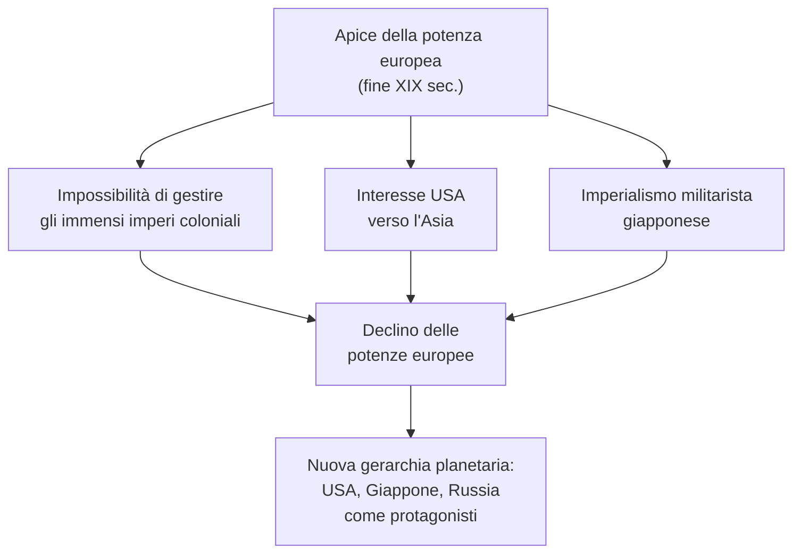
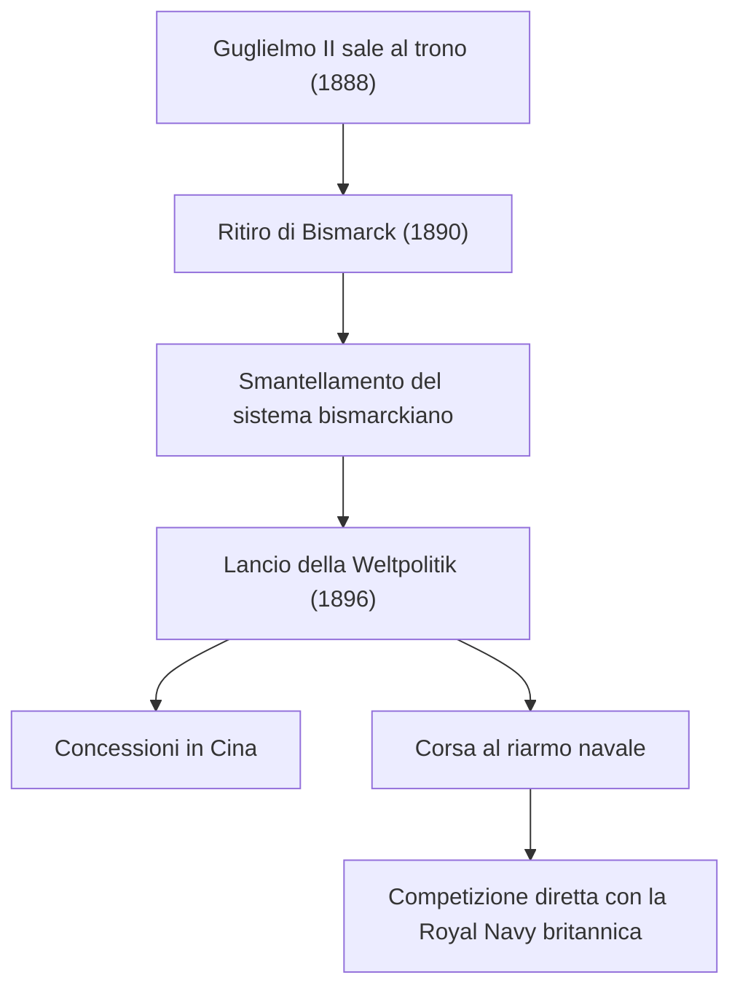
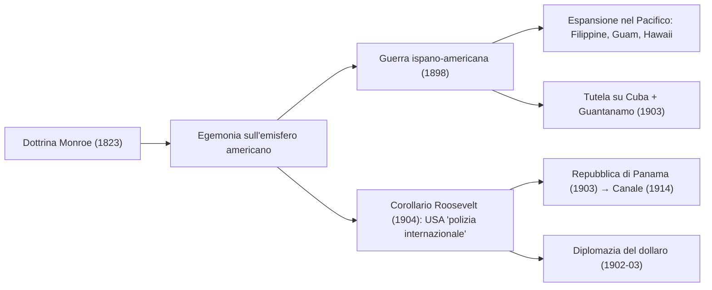
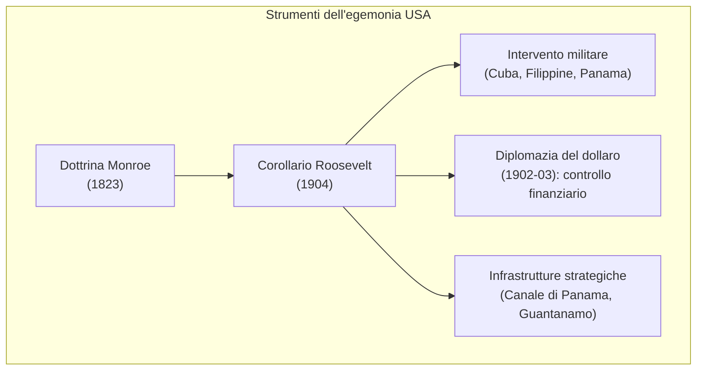
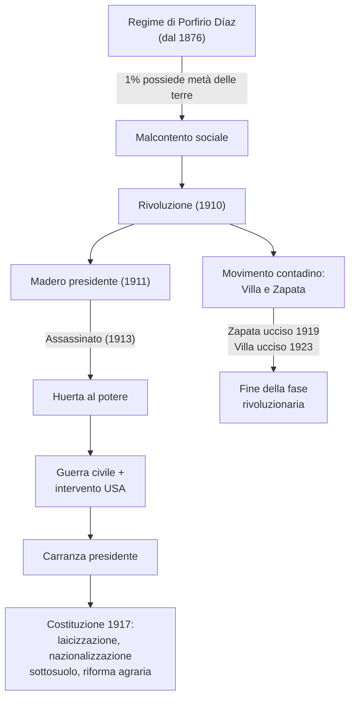
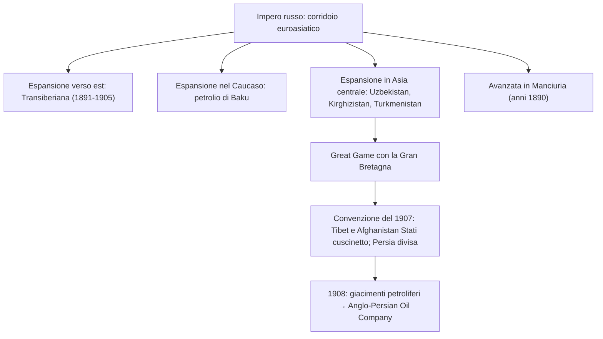
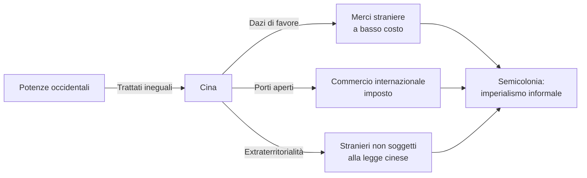
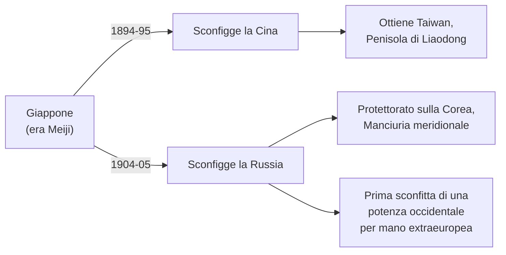
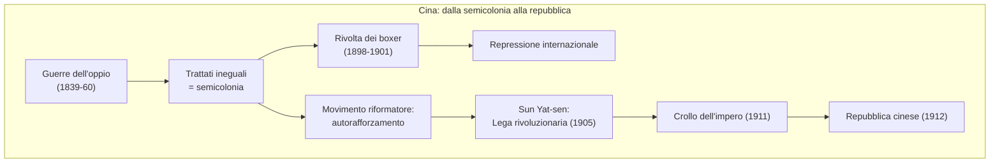
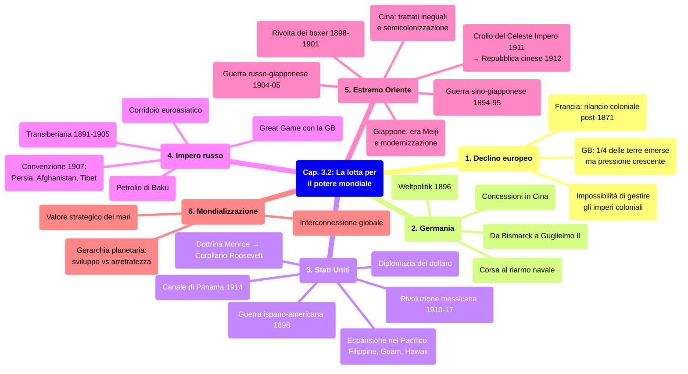

# Ripasso Veloce - Cap. 3.2: La lotta per il potere mondiale

---

## Cronologia essenziale

| Data | Evento |
|------|--------|
| **1823** | Dottrina Monroe ("l'America agli americani") |
| **1871** | Nascita del Reich tedesco |
| **1896** | Guglielmo II lancia la *Weltpolitik* |
| **1898** | Guerra ispano-americana; Filippine, Guam, Portorico agli USA; Hawaii annesse |
| **1904-05** | Guerra russo-giapponese: prima sconfitta di una potenza occidentale per mano extraeuropea |
| **1907** | Convenzione anglo-russa su Tibet, Afghanistan e Persia |
| **1910-17** | Rivoluzione messicana; Costituzione del 1917 |
| **1911-12** | Crollo dell'Impero cinese e proclamazione della Repubblica |
| **1914** | Inaugurazione del Canale di Panama |

---

## 1. Nuovi e vecchi protagonisti sulla scena mondiale

Fine XIX sec.: l'Europa sembra il centro del mondo grazie agli **imperi coloniali**. Questo fenomeno = **imperialismo** (intreccio di fattori economici, tecnologici, politici, culturali).

> **Imperialismo:** tendenza di uno Stato ad acquisire il controllo diretto o indiretto su un altro Stato.

Inizio XX sec.: l'asse geopolitico si sposta. **Declino europeo**, ascesa di nuovi protagonisti. Tre fattori:
- Impossibilita per il **Regno Unito** di gestire gli immensi spazi conquistati
- Interesse **USA** verso l'Asia
- **Imperialismo militarista giapponese** (Pacifico, Cina, Indocina)

Protagonisti coloniali principali: **Gran Bretagna** (+10 mln km², 1/4 delle terre emerse, 400 mln di sudditi) e **Francia** (+9 mln km², Nord Africa e Indocina). Accanto: Germania, Italia, Belgio, Olanda.

Contesto = **mondializzazione**: scala di misura planetaria, gerarchia basata su sviluppo/arretratezza.

---

## 2. La Germania come potenza globale

- **1888**: Guglielmo II al trono. **1890**: ritiro di Bismarck.
- Bismarck aveva fatto della Germania il perno degli equilibri europei con due pilastri: **isolamento della Francia** e **rete di alleanze bilaterali**. Guglielmo II smantella il sistema.
- **1896 - *Weltpolitik***: obiettivo = Germania **potenza globale**. Si manifesta con concessioni in Cina e **potenziamento della flotta navale**.
- Paradosso: la Germania **non aveva interessi vitali fuori dall'Europa** — espansione per motivi di prestigio, che finisce per allarmare le altre potenze.
- La mondializzazione accresce il valore strategico dei mari → **corsa al riarmo navale** globale.

> ***Weltpolitik*:** "politica mondiale", dottrina di Guglielmo II (1896) per trasformare la Germania in potenza globale.

---

## 3. Il nuovo profilo mondiale degli Stati Uniti

### Sviluppo economico e svolta imperialista

Dopo la Guerra di secessione (1861-65), gli USA crescono rapidamente:
- Consolidamento dell'unita (ferrovie, esercito)
- **1890**: tutto il Paese colonizzato fino al Pacifico
- Sviluppo industriale accelerato
- Penetrazione economica nelle Americhe, in Europa e in Asia

Dagli anni 1890: alla tradizionale egemonia sull'America centro-meridionale (**dottrina Monroe**, 1823) si affiancano **direttrici intercontinentali**.

### Guerra con la Spagna (1898) e Pacifico

- **1895**: insurrezione indipendentista a **Cuba** (Jose Marti). Spagnoli usano campi di concentramento per civili.
- **1898**: USA dichiarano guerra alla Spagna (presidente McKinley).
- **Pace di Parigi**: Filippine, Guam, Portorico agli USA; indipendenza di Cuba sotto tutela USA. Annesse le **Hawaii**.
- **1903**: base navale di **Guantanamo** + diritto di intervento a Cuba.

### Politica estera di Theodore Roosevelt

- **1901**: T. Roosevelt presidente (dopo assassinio McKinley).
- **Corollario Roosevelt (1904)**: USA = "polizia internazionale" nel continente americano.
- **1903**: USA appoggiano l'indipendenza di **Panama** dalla Colombia → **protettorato USA**. **Canale di Panama** inaugurato nel **1914**.
- **Diplomazia del dollaro (1902-03)**: prestiti bancari USA ai governi latinoamericani in cambio di esperti statunitensi nei loro apparati finanziari → **controllo senza forza militare**.

### La Rivoluzione messicana (1910-1917)

Scoppia nel **1910** contro **Porfirio Diaz** (1% della popolazione possedeva meta delle terre). Due fronti:
- **Moderati** (Francisco Madero): riforme politiche, democrazia
- **Contadini** (Emiliano Zapata, Pancho Villa): riforma agraria radicale

Sequenza: Diaz rovesciato (1911) → Madero presidente → assassinato (1913) → colpo di stato di **Huerta** → guerra civile → **Costituzione 1917** (Carranza): laicizzazione, nazionalizzazione risorse minerarie, riforma agraria. Zapata ucciso 1919, Villa 1923.

---

## 4. L'Impero russo e il corridoio euroasiatico

L'Impero russo = **corridoio euroasiatico** senza soluzione di continuita. Collegamento rafforzato dalla **ferrovia transiberiana (1891-1905)**, Mosca-Vladivostok.

Espansione russa in Asia:
- **Vladivostok** fondata 1859 (Mar del Giappone)
- Occupazione dei territori a nord del fiume **Amur** fino alla Corea
- Avanzata in **Manciuria** (anni 1890)
- Conquista del **Caucaso** (petrolio di **Baku**)
- Conquista dell'**Asia centrale**: Uzbekistan, Kirghizistan, Turkmenistan

Tensioni con la GB → **Great Game**: competizione anglo-russa per il controllo di Persia e Afghanistan.

- **1907**: convenzione anglo-russa — Tibet e Afghanistan = Stati cuscinetto; Persia divisa in sfere d'influenza (nord russa, sud britannica)
- **1908**: giacimenti petroliferi nella zona britannica → **Anglo-Persian Oil Company**

---

## 5. L'Estremo Oriente

### Cina: semicolonizzazione

Dopo le **guerre dell'oppio** (1839-42, 1856-60), la Cina si apre forzatamente. Francia in **Indocina**, GB domina Oceano Indiano e Pacifico.

La Cina subisce i **trattati ineguali**: dazi di favore, porti aperti, extraterritorialita → ridotta a **semicolonia** (imperialismo informale).

### Giappone: era Meiji

Riforma radicale: **"spirito giapponese, sapere occidentale"** → industrializzazione e modernizzazione.
- **1879**: annessione isole Ryukyu
- **Guerra sino-giapponese (1894-95)**: Giappone sconfigge la Cina → ottiene Taiwan, Penisola di Liaodong, indennita di guerra

### Rivolta dei boxer e Guerra russo-giapponese

- **Rivolta dei boxer (1898-1901)**: movimento xenofobo contadino contro potenze straniere e missionari. Repressa da corpo di spedizione internazionale (16.000 uomini, agosto 1900).
- **Guerra russo-giapponese (1904-05)**: Giappone attacca la flotta russa a Port Arthur. Vittoria giapponese a Tsushima → **prima sconfitta di una potenza occidentale per mano extraeuropea**. Pace di Portsmouth: protettorato giapponese sulla Corea, Manciuria meridionale.

### Dalla dissoluzione imperiale alla Repubblica cinese

- **1905**: **Sun Yat-sen** fonda la Lega rivoluzionaria
- **1911**: crollo dell'Impero
- **1912**: proclamazione della **Repubblica cinese** (capitale Nanchino)

---

## Mappa concettuale del capitolo

