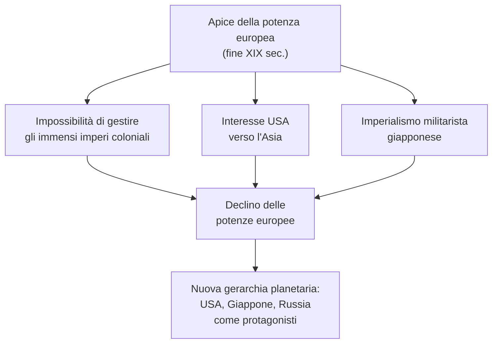
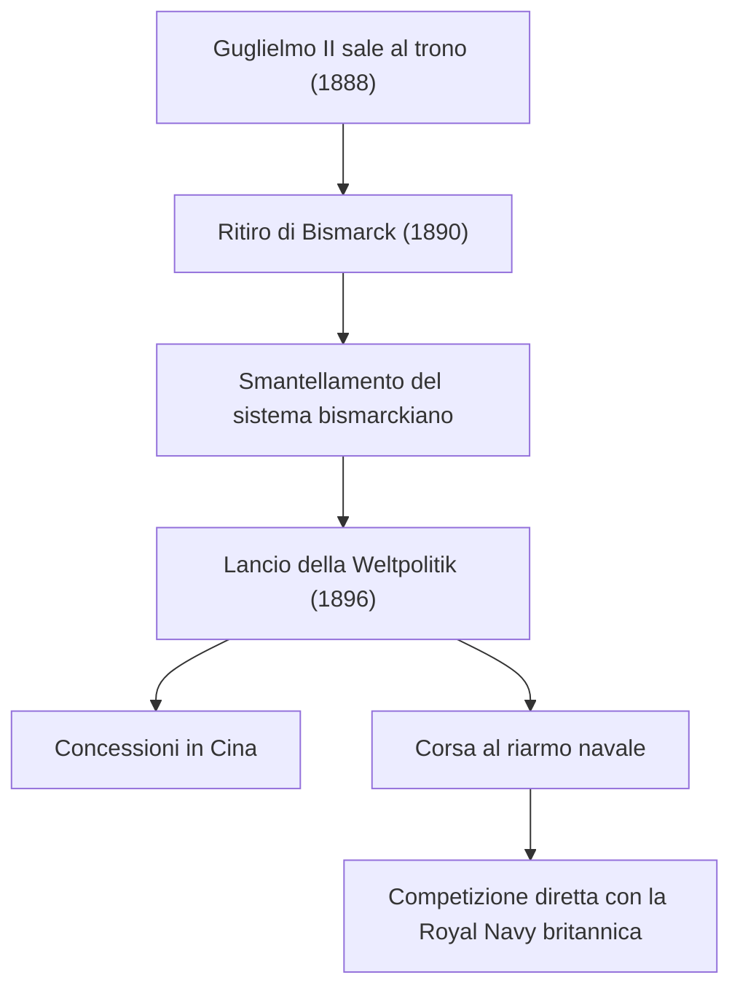
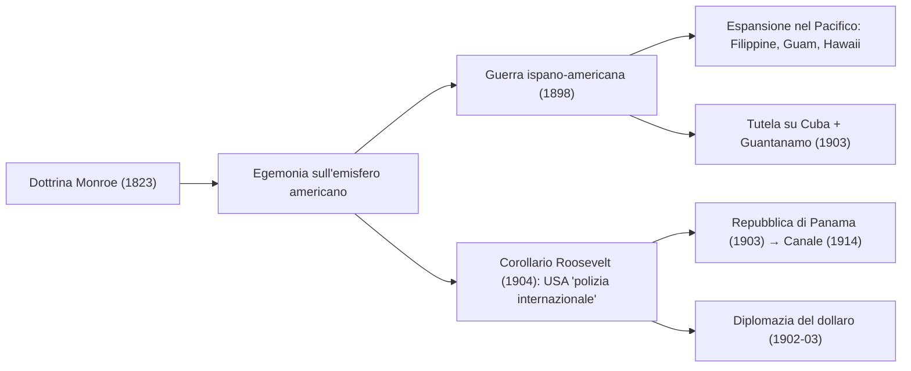
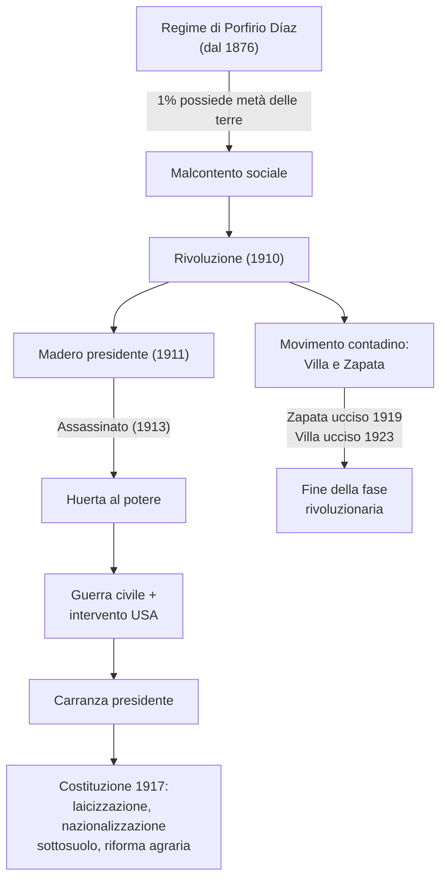
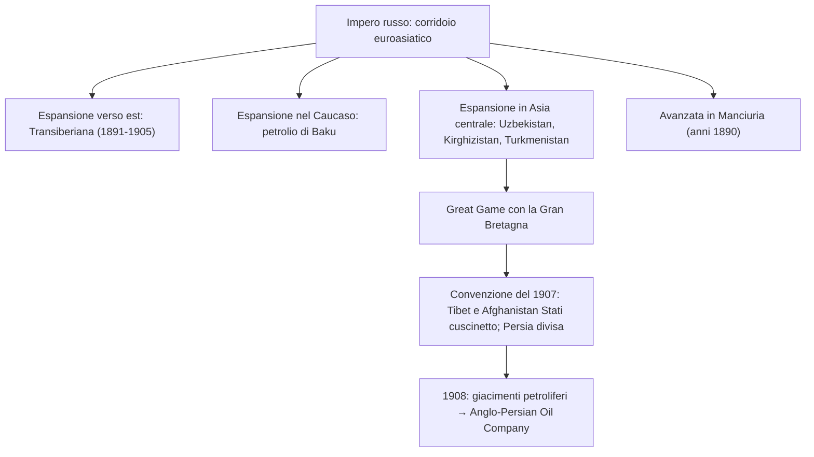
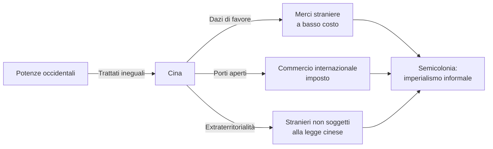
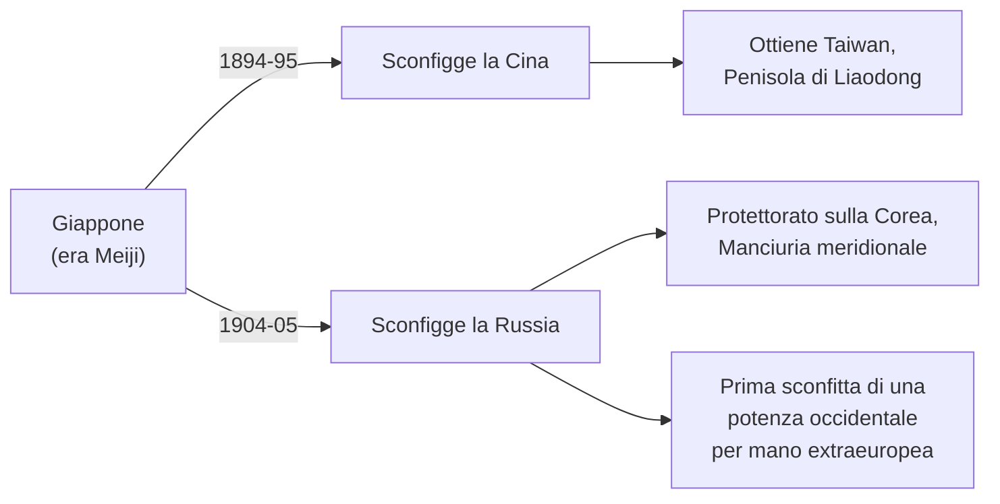
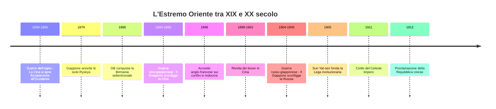
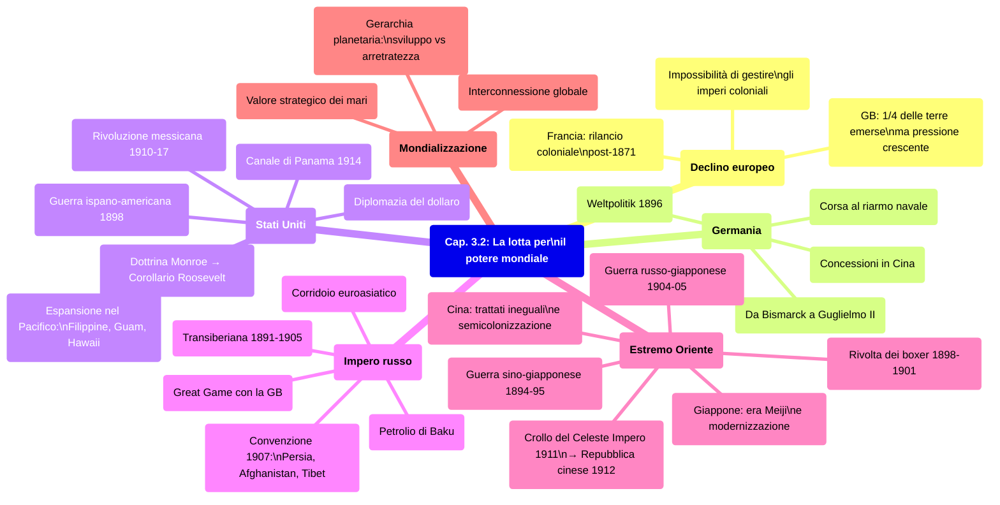

# Schema di Studio - Capitolo 3.2: La lotta per il potere mondiale

---

## Cronologia essenziale

| Data                  | Evento                                                                                                                                |
| --------------------- | ------------------------------------------------------------------------------------------------------------------------------------- |
| **1823**              | Il presidente **James Monroe** formula la dottrina Monroe («l'America agli americani»)                                                |
| **1839-42 / 1856-60** | Due **guerre dell'oppio** contro la Cina                                                                                              |
| **1859**              | Fondazione di **Vladivostok** sulla costa del Mar del Giappone                                                                        |
| **1861-65**           | **Guerra di secessione** americana                                                                                                    |
| **1869**              | Istituzione del bagno penale zarista nell'isola di **Sachalin**                                                                       |
| **1870-71**           | Sconfitta della Francia nella guerra con la **Prussia**                                                                               |
| **1871**              | Nascita del **Reich** tedesco                                                                                                         |
| **1876**              | Inizio del regime autoritario di **Porfirio Díaz** in Messico                                                                         |
| **1879**              | Il Giappone annette le **isole Ryūkyū**                                                                                               |
| **1886**              | La Gran Bretagna conquista la **Birmania settentrionale**                                                                             |
| **1888**              | **Guglielmo II** sale al trono imperiale tedesco                                                                                      |
| **1890**              | Ritiro di **Bismarck** dalla scena politica; l'Ufficio del Censimento USA dichiara tutto il Paese colonizzato fino al Pacifico        |
| **1891-1905**         | Costruzione della **ferrovia transiberiana** (Mosca–Vladivostok)                                                                      |
| **1894-95**           | **Guerra sino-giapponese**: il Giappone sconfigge la Cina                                                                             |
| **1895**              | Scoppio dell'**insurrezione indipendentista** a Cuba, guidata da **José Martí**                                                       |
| **1896**              | Guglielmo II lancia la ***Weltpolitik***; accordo anglo-francese sui confini tra Birmania e Indocina                                  |
| **1898**              | **Guerra ispano-americana**; pace di Parigi (Filippine, Guam e Portorico agli USA; indipendenza di Cuba); annessione delle **Hawaii** |
| **1898-1901**         | **Rivolta dei boxer** in Cina                                                                                                         |
| **1899-1902**         | **Guerra anglo-boera** (primo uso dei campi di concentramento per civili)                                                             |
| **1900**              | Corpo di spedizione internazionale di **16 000 uomini** seda la rivolta dei boxer                                                     |
| **1901**              | Assassinio di McKinley; **Theodore Roosevelt** presidente                                                                             |
| **1902-03**           | Roosevelt inaugura la **«diplomazia del dollaro»**                                                                                    |
| **1903**              | Accordo USA-Cuba per la base navale di **Guantanamo**; nascita della **Repubblica di Panama** (protettorato USA)                      |
| **1904**              | Roosevelt enuncia il **«corollario Roosevelt»** alla dottrina Monroe                                                                  |
| **1904-05**           | **Guerra russo-giapponese**; pace di **Portsmouth**                                                                                   |
| **1905**              | **Sun Yat-sen** fonda la Lega rivoluzionaria cinese                                                                                   |
| **1907**              | Convenzione anglo-russa su Tibet, Afghanistan e Persia                                                                                |
| **1908**              | Scoperta di **giacimenti petroliferi** nella Persia meridionale → fondazione della **Anglo-Persian Oil Company**                      |
| **1910**              | Inizio della **Rivoluzione messicana**                                                                                                |
| **1911**              | Díaz lascia il Messico; Madero presidente; processo rivoluzionario in Cina porta al **crollo dell'impero**                            |
| **1912**              | Proclamazione della **Repubblica cinese** (capitale Nanchino)                                                                         |
| **1913**              | Assassinio di **Madero**; il generale **Victoriano Huerta** prende il potere in Messico                                               |
| **1914**              | Inaugurazione del **Canale di Panama**                                                                                                |
| **1917**              | **Costituzione messicana** progressista (sotto la presidenza di **Venustiano Carranza**)                                              |
| **1919**              | Assassinio di **Emiliano Zapata**                                                                                                     |
| **1923**              | Assassinio di **Francisco «Pancho» Villa**                                                                                            |

---

## 1. Nuovi e vecchi protagonisti sulla scena mondiale

### L'apice della potenza europea e l'inizio del declino

Alla fine del XIX secolo l'Europa sembrava essere il centro del mondo: le potenze del Vecchio Continente avevano costruito **imperi coloniali** che si estendevano dall'Africa all'Asia, fino alle isole dell'Oceano Pacifico. I contemporanei definirono questo fenomeno **«imperialismo»**, distinguendo le ondate di espansione avvenute in età moderna da quella in corso da metà Ottocento, che era il frutto di un peculiare intreccio di fattori economici, tecnologici, politici e culturali.

> **Imperialismo:** termine affermatosi tra XIX e XX secolo per indicare le forme di espansione avviate dalle potenze europee e poi da USA e Giappone. Nel suo senso più ampio, designa la tendenza di uno Stato ad acquisire il controllo diretto o indiretto su un altro Stato.

Eppure, all'inizio del XX secolo l'asse geopolitico cominciò a spostarsi, segnando l'avvio del lento **declino delle potenze europee** e l'ascesa parallela di **nuovi protagonisti della competizione internazionale**. Tre fattori convergenti provocarono questo spostamento:
- l'impossibilità per i Paesi europei — e in particolare per il **Regno Unito** — di gestire gli immensi spazi conquistati nei secoli precedenti;
- l'interesse verso l'Asia da parte degli **Stati Uniti**;
- l'avvento dell'**imperialismo militarista giapponese**, che puntava alla conquista di immensi spazi nel Pacifico, in Cina e in Indocina, approfittando del declino cinese e delle difficoltà europee.

### Nuovi e vecchi colonizzatori

Protagonisti dell'imperialismo coloniale furono soprattutto la **Gran Bretagna** e la **Francia**, che aumentarono i propri territori rispettivamente di **10** e di circa **9 milioni di chilometri quadrati**.

L'**Impero britannico** rappresentava il vero baricentro dell'espansione europea. Nel **1900** Londra controllava **un quarto delle terre emerse** — fra cui il subcontinente indiano, considerato la **«perla» dell'impero** — ed esercitava il dominio su **400 milioni di persone**. La sua superiorità planetaria si basava sull'egemonia della flotta, sia commerciale sia militare, che garantiva il **controllo dei mari**.

La **Francia** aveva scelto di rilanciare la propria politica coloniale in **Nord Africa** (dove aveva messo piede sin dagli anni Trenta dell'Ottocento) e in **Asia** (in particolare in Indocina), anche per compensare la debolezza patita in Europa dopo la sconfitta nella guerra con la Prussia del **1870-71**.

Accanto a queste due potenze principali si collocavano altri Paesi capaci di mettere le mani su lembi di Asia e di Africa: i giovani Stati di **Germania, Italia e Belgio** e un colonizzatore di vecchia data come l'**Olanda**. I due grandi protagonisti della prima espansione europea in età moderna erano invece relegati ai margini: il **Portogallo** manteneva poche colonie in Africa, mentre la **Spagna** perse le ultime colonie alla fine del XIX secolo.

### Un mondo sempre più interconnesso: la mondializzazione

Questi fenomeni possono essere indicati con il termine di **mondializzazione**: la scala di misura era ormai il mondo intero, e non solo sul piano politico e geopolitico. La crescente **connessione delle dinamiche mondiali** avveniva in ogni ambito, stimolata dall'industrializzazione e dalle innovazioni tecnologiche nel campo dei trasporti e delle comunicazioni.

La modernizzazione fece sì che le varie parti del mondo iniziassero a essere classificate in base ai concetti di **sviluppo** e **arretratezza**, definiti dagli standard dei Paesi industrializzati. Il pianeta si suddivideva ora tra **aree sviluppate** (più ricche e potenti) e **aree arretrate** (più povere e deboli). Poiché ciò avveniva in una fase di crescente connessione, per la prima volta nella storia si costituì una **gerarchia planetaria**, al cui vertice — provvisoriamente — si collocavano le potenze europee.

---

## 2. La Germania come potenza globale

### Il passaggio da Bismarck a Guglielmo II

Tra il **1888** e il **1890** si chiuse la fase della storia tedesca segnata dall'unificazione e dalla nascita del **Reich (1871)** e se ne aprì un'altra. Questo passaggio corrispose a due eventi ravvicinati: l'ascesa al trono del giovane imperatore **Guglielmo II** (regnante dal **1888 al 1918**) e il ritiro dalle scene del vecchio Cancelliere **Otto von Bismarck** nel **1890**, grande protagonista del primo ventennio del Reich.

> **Reich:** parola tedesca che indica genericamente l'organizzazione politica e può significare «impero», «regno» o «Stato». In italiano designa lo Stato tedesco nato nel 1871, la Germania nazista (il Terzo Reich) e talvolta anche l'Impero germanico di origine medievale.

Bismarck aveva impostato una politica estera tesa a fare della Germania il **perno degli equilibri europei**, una posizione che naturalmente avrebbe dovuto consentire di manovrare a vantaggio tedesco. Il suo orizzonte restava quello del Vecchio Continente, e il suo sistema di relazioni internazionali poggiava su **due pilastri**:
- l'**isolamento della Francia**, evitando in particolare un suo accordo con la Russia;
- una **rete di alleanze e intese bilaterali** che legassero le potenze alla Germania.

Il Kaiser salì al trono con la ferma volontà di **governare in proprio**, non all'ombra di un energico Primo ministro — che riuscì a liquidare rapidamente — e con grandi ambizioni in politica estera. Le sue scelte smantellarono nel giro di pochi anni il sistema bismarckiano.

### La *Weltpolitik*: una politica da potenza globale

Nel **1896** Guglielmo II lanciò la dottrina della ***Weltpolitik*** («politica mondiale»), che mirava a rendere la Germania una **potenza globale** al pari di Gran Bretagna, USA e Russia, facendola competere per la supremazia planetaria.

Una delle manifestazioni della *Weltpolitik* fu l'intervento in **Estremo Oriente** in seguito alla Guerra sino-giapponese, grazie al quale la Germania ottenne alcune **concessioni** in Cina.

> **Concessione:** in diritto internazionale, territorio su cui uno Stato concede temporaneamente il controllo a un altro Stato, mantenendo la sovranità su di esso. Al termine dell'accordo, lo Stato concedente recupera le sue piene prerogative.

Tuttavia — a differenza di Gran Bretagna, Russia, e in parte Francia e Stati Uniti — la Germania **non aveva interessi vitali fuori dall'Europa**, né interessi geopolitici decisivi per la sua collocazione nel mondo. La sua azione su scala mondiale era dovuta piuttosto a **motivi di prestigio** e alla necessità di non essere esclusa dalle dinamiche che coinvolgevano le grandi potenze europee. Il suo orizzonte prioritario restava quello della **sicurezza in Europa**: erano gli equilibri sul Vecchio Continente a dettare le scelte compiute su scenari più ampi.

### La corsa al riarmo navale

Un tassello cruciale della *Weltpolitik* fu il **potenziamento della flotta navale da guerra**. La mondializzazione dell'economia e della politica aveva accresciuto il **valore strategico dei mari**, attraverso i quali passavano il grande traffico commerciale e le connessioni cruciali tra le diverse parti del mondo. Era dunque aumentata la consapevolezza dell'**importanza del dominio marittimo**, come ben dimostrava l'Impero britannico, la cui superiorità mondiale poggiava in larga misura sull'egemonia navale.

Non fu solo la Germania a seguire questa strada: anche le altre potenze decisero di investire risorse per la marina militare in misura superiore a quanto veniva speso per gli eserciti. Tra fine Ottocento e inizio Novecento si assistette a una vera e propria **corsa al riarmo navale** su scala globale.

---

## 3. Il nuovo profilo mondiale degli Stati Uniti

### Lo sviluppo economico e la svolta imperialista

La mondializzazione della politica non era solo il risultato dell'allargamento della sfera d'azione europea, ma anche della comparsa di **nuovi protagonisti extraeuropei**. Tra questi spiccavano gli **Stati Uniti**, che dopo la Guerra di secessione (**1861-65**) avevano conosciuto una fase di avanzamento caratterizzata da diversi fattori:
- il **consolidamento dell'unità del Paese**, con investimenti in opere infrastrutturali (come la rete ferroviaria) e un rafforzamento dell'esercito e della marina militare;
- un impegno di sviluppo e di integrazione dell'**Ovest**, verso cui vennero indirizzati importanti flussi di migrazione interna: nel **1890** l'Ufficio del Censimento dichiarò che tutto il Paese era ormai colonizzato, fino alla costa del Pacifico;
- un accelerato **sviluppo industriale**;
- l'avvio di una **penetrazione economica e commerciale** nel resto del continente americano, in Europa e in Asia, con il sostegno del governo.

Tali condizioni orientarono Washington verso una politica estera più decisa. Dagli anni Novanta del XIX secolo, al tradizionale obiettivo di egemonia sul continente — rivolto all'**America centro-meridionale** e in linea con la **dottrina Monroe** — gli USA iniziarono a percorrere **direttrici di espansione intercontinentali**.

> **Dottrina Monroe:** indirizzo politico formulato nel **1823** dal presidente **James Monroe**, il quale affermò che le potenze europee non dovevano più interferire negli affari interni degli Stati americani. La posizione era riassunta nello slogan **«l'America agli americani»**.

### La guerra con la Spagna (1898) e l'espansione verso il Pacifico

A **Cuba**, uno degli ultimi lembi dell'impero coloniale spagnolo, nel **1895** era scoppiata un'**insurrezione indipendentista** guidata dal rivoluzionario **José Martí**, che si trasformò presto in un brutale scontro con le autorità militari spagnole. Per isolare i guerriglieri, gli spagnoli introdussero i **campi di concentramento** per la popolazione civile — una nuova tecnica di controllo e repressione che era stata sperimentata nella **Guerra anglo-boera (1899-1902)**.

Gli USA, che da tempo consideravano Cuba un'area di interesse primario, si prepararono a un intervento militare nell'isola, spinti da due forze convergenti: le pressioni degli **imprenditori** che avevano investito nelle piantagioni di canna da zucchero cubane e una **campagna di stampa** che amplificava le atrocità della repressione spagnola. Così, quando a inizio **1898** venne affondata una nave da guerra statunitense inviata a L'Avana, il presidente **William McKinley dichiarò guerra alla Spagna**.

Le azioni militari furono condotte non solo a Cuba ma anche nelle **Filippine** (colonia spagnola dove era in corso una rivolta indipendentista), mentre soldati americani occupavano altri due possedimenti spagnoli: l'isola di **Guam** nel Pacifico e quella di **Portorico** nei Caraibi.

Nell'**agosto 1898** fu siglato un armistizio, seguito dalla **pace di Parigi**, che sanciva:
- il **passaggio di Filippine, Guam e Portorico agli Stati Uniti** come colonie;
- l'**indipendenza di Cuba**, che restava sotto tutela di Washington.

Nello stesso anno gli USA avevano annesso le **Hawaii**, rafforzando così lo slancio verso il **Pacifico** e l'**Asia orientale**. Nel **1903** un accordo tra Cuba e Stati Uniti stabilì la costruzione di una base navale statunitense nella baia di **Guantanamo** e riconobbe il diritto di Washington di intervenire militarmente per preservare l'indipendenza dell'isola.

### La politica estera di Theodore Roosevelt

Nel settembre **1901**, in seguito all'assassinio del presidente McKinley, salì alla Casa Bianca **Theodore Roosevelt** (1858-1919). La sua presidenza, durata fino al **1908**, fu caratterizzata da una politica estera aggressiva mirante a rinsaldare la presa di Washington sull'**America Latina**.

#### Il «corollario Roosevelt» (1904)

Nel solco della dottrina Monroe, Roosevelt formalizzò nel **1904** la dichiarazione detta **«corollario Roosevelt»**: affermò il diritto degli USA, «nazione civilizzata», di intervenire in qualità di **«polizia internazionale»** nel continente americano di fronte a «comportamenti sbagliati». Si trattava di un'evoluzione sostanziale della dottrina Monroe: non più soltanto impedire le ingerenze europee, ma arrogarsi il diritto di intervenire direttamente negli affari interni dei Paesi latinoamericani.

#### Il Canale di Panama (1903-1914)

Nel **1903** gli USA chiesero alla **Colombia** la cessione in affitto di una fascia di territorio nell'istmo di **Panama** per costruirvi un canale che collegasse l'oceano Atlantico al Pacifico. Di fronte alle resistenze colombiane, Washington appoggiò il **movimento indipendentista** che proclamò la nascita della **Repubblica di Panama**, di fatto un **protettorato** degli Stati Uniti. Il canale, inaugurato nel **1914**, era destinato a diventare una delle grandi rotte dei traffici mondiali.

> **Protettorato:** istituto giuridico internazionale in cui uno Stato (tutore/garante) controllava la politica interna ed estera di un altro, senza governarlo direttamente o annetterlo.

#### La «diplomazia del dollaro» (1902-03)

Il consolidamento dell'egemonia statunitense sul Sudamerica passò anche attraverso misure economiche. Per evitare che l'instabilità finanziaria dei vicini sudamericani aprisse la strada ai Paesi europei che vantavano crediti nei loro confronti, nel **1902-03** Roosevelt inaugurò la cosiddetta **«diplomazia del dollaro»**. Si trattava di un meccanismo che prevedeva **prestiti da parte delle banche americane** ai governi dell'America Latina, i quali in cambio dovevano accettare l'inserimento di **esperti statunitensi nei loro organismi finanziari e fiscali**. In questo modo Washington otteneva uno **strumento di controllo diretto** sulla vita di quei Paesi, senza ricorrere necessariamente alla forza militare.

### La Rivoluzione messicana (1910-1917)

La Rivoluzione messicana scoppiò nel **1910**, sotto la spinta di un duplice fronte: un gruppo di **proprietari terrieri liberali** guidati da **Francisco Madero** e un vasto **movimento contadino** con leader carismatici come **Francisco «Pancho» Villa** ed **Emiliano Zapata**.

Il contesto era quello di un Messico governato dal **1876** dal regime autoritario di **Porfirio Díaz**. Nonostante una certa crescita economica, la società era profondamente polarizzata: l'**1% della popolazione** possedeva **oltre metà delle terre coltivabili**, mentre l'**80%** era composto da braccianti senza terra.

Nel **1911** Díaz lasciò il Messico e Madero divenne presidente, ma non riuscì a varare la **riforma agraria** promessa. La lotta armata continuò. Nel **1913** Madero fu assassinato e il potere passò al generale **Victoriano Huerta**, ostile ai rivoluzionari. Il Messico precipitò nella **guerra civile**, nella quale si inserirono anche gli **Stati Uniti**.

Huerta fu infine esiliato e la presidenza passò a **Venustiano Carranza**. Nel **1917** fu promulgata una **Costituzione progressista** che prevedeva:
- la **laicizzazione** dello Stato;
- la **nazionalizzazione del sottosuolo**;
- la **riforma agraria**.

Tuttavia le violenze proseguirono fino agli anni Venti: **Zapata** fu ucciso nel **1919** e **Villa** nel **1923**.

---

## 4. L'Impero russo e il corridoio euroasiatico

### Un gigante tra due continenti

Benché dal Settecento l'Impero russo fosse a tutti gli effetti una **potenza europea**, l'estensione del suo territorio lo rendeva anche una potenza asiatica. L'enorme spazio si configurava come un **corridoio euroasiatico** che univa i due continenti. Questo collegamento fu rafforzato materialmente dalla costruzione della **linea ferroviaria transiberiana (1891-1905)**, che da **Mosca** arrivava a **Vladivostok**.

Il porto di **Vladivostok**, sul Mar del Giappone, era il simbolo del rinnovato attivismo russo in Asia. Approfittando dell'indebolimento degli **Imperi ottomano, persiano e cinese**, la Russia si era ulteriormente espansa: aveva occupato i territori a nord del fiume **Amur** e la costa sul Mar del Giappone a sud del fiume, fino alla **Corea**, e lì nel **1859** era stata fondata Vladivostok. Negli anni Novanta del XIX secolo i russi avanzarono in **Manciuria**. Questi possedimenti non erano colonie d'oltremare, ma il terminale di un **impero senza soluzione di continuità** territoriale.

> Sulle condizioni nei territori più remoti dell'Impero zarista, lo scrittore **Anton Čechov** lasciò una testimonianza impressionante dopo aver visitato nel **1890** il bagno penale di **Sachalin** (istituito nel **1869**): *«Ogni giorno vengono inviati in miniera 350-400 detenuti… Il problema non è la fatica in quanto tale, ma l'ambiente, la malafede dimostrata da impiegatucci d'ogni risma, e il fatto di subire in continuazione prepotenze, ingiustizie e arbitri»*.

### L'espansione nel Caucaso e in Asia centrale

I russi avevano conquistato il **Caucaso**, regione cerniera tra **Mar Nero** e **Mar Caspio**, che acquisì ulteriore importanza strategica ed economica in seguito alla scoperta dei **bacini petroliferi di Baku**. Anche in **Asia centrale**, tra gli anni Sessanta e Settanta dell'Ottocento, i confini dell'Impero zarista si ampliarono con la conquista di territori corrispondenti agli attuali **Uzbekistan, Kirghizistan e Turkmenistan**.

### Il *Great Game*: la competizione anglo-russa in Asia centrale

L'espansione russa in Asia centrale provocò tensioni crescenti con la **Gran Bretagna**, soprattutto quando i russi mostrarono interesse verso l'**Afghanistan**. Londra temeva che la Russia potesse muovere verso l'**India**, la «perla» dell'impero. La competizione anglo-russa per il controllo dell'Asia centrale è nota come **Great Game** («Grande gioco»): una partita giocata a colpi di pressioni politiche, penetrazioni commerciali, azioni militari e missioni di spie. La posta in gioco era il **controllo diretto o indiretto dello Stato persiano e del Regno afghano**.

### La convenzione del 1907 e la questione petrolifera

Nel **1907** venne firmata una **convenzione tra Gran Bretagna e Russia** per stabilizzare la situazione nell'area. Le due potenze convennero di fare del **Tibet** e dell'**Afghanistan** degli **«Stati cuscinetto»**, cioè territori neutrali che avrebbero separato le rispettive sfere di influenza. La convenzione stabilì inoltre che la **Persia** fosse ripartita in due aree di influenza: a nord quella **russa**, a sud quella **britannica**.

Nel **1908**, la scoperta di **giacimenti petroliferi** nella zona britannica della Persia portò alla fondazione della **Anglo-Persian Oil Company**, compagnia destinata ad avere un ruolo cruciale nel XX secolo.

---

## 5. L'Estremo Oriente: una questione mondiale

### Francesi e inglesi in Asia

Dopo le sconfitte nelle due **guerre dell'oppio** (**1839-42** e **1856-60**), la **Cina** aveva dovuto aprirsi all'influenza commerciale e politica delle potenze occidentali: **Gran Bretagna, Stati Uniti, Francia, Russia, Prussia e Portogallo**.

La **Francia** si era espansa nella **Penisola Indocinese**, conquistando il **Tonchino**, l'**Annam**, la **Cocincina** e il **Laos**. La **Gran Bretagna** deteneva il controllo sull'**Oceano Indiano** e sul **Pacifico occidentale**; temendo che la «perla» dell'impero (l'India) fosse insidiata via terra, i britannici intervennero e conquistarono la **Birmania settentrionale** nel **1886**.

Nel **1896** un accordo anglo-francese stabilì i confini tra **Birmania** e **Indocina francese**. A quel punto l'unico Paese indipendente della penisola restava il **Regno del Siam** (l'attuale **Thailandia**).

### I «trattati ineguali» e la semicolonizzazione della Cina

L'obiettivo asiatico principale delle potenze europee restava la **Cina**, ma l'impero era troppo vasto per essere conquistato militarmente; era però abbastanza indebolito perché le potenze potessero imporgli una **perdita di sovranità**. Questa condizione fu formalizzata attraverso quelli che i cinesi definivano **«trattati ineguali»**, i quali prevedevano:
- **dazi di favore** per le merci straniere;
- **porti aperti** al commercio internazionale;
- **extraterritorialità** (i cittadini stranieri non erano soggetti alla legge cinese).

La Cina fu così ridotta al rango di **semicolonia**, in uno scenario definito **«imperialismo informale»**: le potenze non governavano direttamente il territorio cinese, ma ne controllavano l'economia e ne condizionavano la politica.

### Il movimento riformatore cinese

Di fronte all'umiliazione, emerse in Cina un **movimento riformatore** la cui idea portante era l'**autorafforzamento** attraverso l'acquisizione delle conoscenze tecniche dell'Occidente, mantenendo però il sapere cinese come fondamento spirituale e culturale. Questo principio era sintetizzato nella formula: **«il sapere occidentale come mezzo, il sapere cinese come fondamento»**.

### Il Giappone dell'«era Meiji»

Negli ultimi decenni dell'Ottocento l'**Impero del Sol Levante** divenne un protagonista di primo piano nelle vicende dell'Asia orientale. Il Giappone intraprese una **radicale riforma interna** nota come **«era Meiji»** («governo illuminato»), aprendosi all'Occidente per acquisire la tecnologia e le conoscenze necessarie all'**industrializzazione** e alla **modernizzazione**. Lo slogan che guidava questa trasformazione era **«spirito giapponese, sapere occidentale»** — un'impostazione per certi versi simile a quella dei riformatori cinesi, ma realizzata con ben maggiore efficacia e coerenza.

### L'espansionismo giapponese e la Guerra sino-giapponese (1894-95)

La nuova potenza del Giappone si tradusse rapidamente in **mire espansionistiche**. Nel **1879** il Giappone annetté le **isole Ryūkyū**. Nel **1894** dichiarò guerra alla Cina per l'influenza sulla **Corea**. La **Guerra sino-giapponese** si concluse nel **1895** con la sconfitta della Cina, sancita da un trattato di pace che imponeva a Pechino:
- il riconoscimento dell'**indipendenza della Corea**;
- la cessione di **Taiwan** e della **Penisola di Liaodong**;
- il pagamento di un'**ingente indennità di guerra**.

### La rivolta dei boxer (1898-1901)

Ad attestare il grado di resistenza della popolazione cinese al dominio straniero fu la **rivolta dei boxer (1898-1901)**. Il movimento dei «boxer» (*Yihequan*, cioè **«pugno per la giustizia e la concordia»**) si faceva interprete del **disagio del mondo contadino** e attribuiva la responsabilità della situazione alle **potenze straniere** e ai **missionari cristiani**.

L'orientamento **xenofobo** spinse i boxer ad azioni violente contro gli stranieri. Le potenze reagirono organizzando un **corpo di spedizione internazionale di 16 000 uomini** che nell'**agosto 1900** entrò in Cina e sedò la rivolta. Nonostante la repressione, l'impero cinese rimase formalmente al suo posto, ma il suo prestigio era ormai irrimediabilmente compromesso.

### La Guerra russo-giapponese (1904-05)

La presenza russa in **Manciuria** era apertamente contrastata dal Giappone. Nel **1904**, senza dichiarazione di guerra, il **Giappone attaccò la flotta russa a Port Arthur**. L'Impero zarista subì una doppia sconfitta: nella **battaglia terrestre a Port Arthur** e in quella navale di **Tsushima**. L'evento ebbe una portata storica enorme: **per la prima volta una potenza occidentale era stata sconfitta da un Paese extraeuropeo**.

L'**accordo di pace** fu siglato a **Portsmouth** (USA) nel **1905**. Il Giappone ottenne:
- il **protettorato sulla Corea**;
- il controllo della **Manciuria meridionale**.

### La fine del Celeste Impero e la nascita della Repubblica cinese

La Guerra russo-giapponese rappresentò un'altra tappa del processo di dissoluzione del **Celeste Impero**. Nel **1905** il rivoluzionario **Sun Yat-sen** fondò una **Lega** che promosse diverse insurrezioni, tutte fallimentari. Tuttavia il destino dell'impero era ormai segnato: nell'**ottobre 1911** un processo rivoluzionario portò al **crollo dell'impero** e alla proclamazione, nel **1912**, della **Repubblica cinese**, con capitale **Nanchino**.

---

## Quadro di sintesi: i nuovi protagonisti mondiali

| Potenza | Area di espansione | Strumenti | Risultati principali |
|---|---|---|---|
| **Stati Uniti** | America Latina, Pacifico, Asia orientale | Dottrina Monroe, corollario Roosevelt, diplomazia del dollaro, guerra | Controllo di Cuba, Filippine, Guam, Portorico, Hawaii, Panama; egemonia sull'emisfero occidentale |
| **Germania** | Europa (prioritario), concessioni in Cina | *Weltpolitik*, riarmo navale | Competizione con la Gran Bretagna; presenza in Estremo Oriente per motivi di prestigio |
| **Russia** | Corridoio euroasiatico, Caucaso, Asia centrale, Manciuria | Ferrovia transiberiana, espansione territoriale continua | Controllo del Caucaso (petrolio di Baku), Asia centrale, sconfitta contro il Giappone |
| **Giappone** | Corea, Cina, Pacifico | Modernizzazione Meiji, forza militare | Vittoria sulla Cina (1895) e sulla Russia (1905); protettorato sulla Corea; Manciuria meridionale |
| **Gran Bretagna** | Dominio globale: India, Oceano Indiano, Pacifico, Africa, Persia | Egemonia navale, *Great Game*, accordi diplomatici | Un quarto delle terre emerse; 400 milioni di sudditi; Anglo-Persian Oil Company |
| **Francia** | Nord Africa, Indocina | Politica coloniale di rilancio post-1871 | +9 milioni di km²; Tonchino, Annam, Cocincina, Laos |

---

## Concetti chiave e definizioni

> **Imperialismo:** tendenza di uno Stato ad acquisire il controllo diretto o indiretto su un altro Stato. Termine affermatosi tra XIX e XX secolo per distinguere la nuova ondata espansionistica da quelle dell'età moderna.

> **Reich:** parola tedesca per «impero/regno/Stato». Designa lo Stato tedesco nato nel 1871, la Germania nazista (Terzo Reich) e l'Impero germanico medievale.

> ***Weltpolitik*:** «politica mondiale» lanciata da Guglielmo II nel 1896 per proiettare la Germania sulla scena globale.

> **Concessione:** territorio su cui uno Stato concede temporaneamente il controllo a un altro, mantenendo la propria sovranità formale.

> **Dottrina Monroe (1823):** «l'America agli americani» — divieto di ingerenza europea nelle Americhe.

> **Corollario Roosevelt (1904):** gli USA si arrogano il diritto di intervenire come «polizia internazionale» nel continente americano.

> **Diplomazia del dollaro:** prestiti USA ai Paesi latinoamericani in cambio dell'inserimento di esperti statunitensi nei loro apparati finanziari.

> **Protettorato:** istituto giuridico in cui uno Stato tutore controlla la politica interna ed estera di un altro senza governarlo direttamente o annetterlo.

> **Great Game:** competizione anglo-russa per il controllo dell'Asia centrale (Persia, Afghanistan).

> **Trattati ineguali:** accordi imposti alla Cina dalle potenze (dazi di favore, porti aperti, extraterritorialità), che la ridussero a semicolonia.

> **Imperialismo informale:** controllo economico e politico di un territorio senza dominio diretto.

> **Mondializzazione:** interconnessione crescente delle dinamiche mondiali in ambito politico, economico e tecnologico, che porta alla formazione di una gerarchia planetaria.

> **Era Meiji:** «governo illuminato» — fase di radicale modernizzazione del Giappone, improntata al principio «spirito giapponese, sapere occidentale».

> **PIL (Prodotto Interno Lordo):** misura il valore di beni e servizi prodotti all'interno di un Paese in un anno.

---

## Mappa concettuale del capitolo

