# Schema di Studio - Capitolo 3.2: La lotta per il potere mondiale (Riassunto)

---

## Cronologia essenziale

| Data | Evento |
|------|--------|
| **1823** | Il presidente **James Monroe** formula la dottrina Monroe («l'America agli americani») |
| **1839-42 / 1856-60** | Due **guerre dell'oppio** contro la Cina |
| **1859** | Fondazione di **Vladivostok** sulla costa del Mar del Giappone |
| **1861-65** | **Guerra di secessione** americana |
| **1869** | Istituzione del bagno penale zarista nell'isola di **Sachalin** |
| **1870-71** | Sconfitta della Francia nella guerra con la **Prussia** |
| **1871** | Nascita del **Reich** tedesco |
| **1876** | Inizio del regime autoritario di **Porfirio Díaz** in Messico |
| **1879** | Il Giappone annette le **isole Ryūkyū** |
| **1886** | La Gran Bretagna conquista la **Birmania settentrionale** |
| **1888** | **Guglielmo II** sale al trono imperiale tedesco |
| **1890** | Ritiro di **Bismarck** dalla scena politica; l'Ufficio del Censimento USA dichiara tutto il Paese colonizzato fino al Pacifico |
| **1891-1905** | Costruzione della **ferrovia transiberiana** (Mosca–Vladivostok) |
| **1894-95** | **Guerra sino-giapponese**: il Giappone sconfigge la Cina |
| **1895** | Scoppio dell'**insurrezione indipendentista** a Cuba, guidata da **José Martí** |
| **1896** | Guglielmo II lancia la ***Weltpolitik***; accordo anglo-francese sui confini tra Birmania e Indocina |
| **1898** | **Guerra ispano-americana**; pace di Parigi (Filippine, Guam e Portorico agli USA; indipendenza di Cuba); annessione delle **Hawaii** |
| **1898-1901** | **Rivolta dei boxer** in Cina |
| **1899-1902** | **Guerra anglo-boera** (primo uso dei campi di concentramento per civili) |
| **1900** | Corpo di spedizione internazionale di **16 000 uomini** seda la rivolta dei boxer |
| **1901** | Assassinio di McKinley; **Theodore Roosevelt** presidente |
| **1902-03** | Roosevelt inaugura la **«diplomazia del dollaro»** |
| **1903** | Accordo USA-Cuba per la base navale di **Guantanamo**; nascita della **Repubblica di Panama** (protettorato USA) |
| **1904** | Roosevelt enuncia il **«corollario Roosevelt»** alla dottrina Monroe |
| **1904-05** | **Guerra russo-giapponese**; pace di **Portsmouth** |
| **1905** | **Sun Yat-sen** fonda la Lega rivoluzionaria cinese |
| **1907** | Convenzione anglo-russa su Tibet, Afghanistan e Persia |
| **1908** | Scoperta di **giacimenti petroliferi** nella Persia meridionale → fondazione della **Anglo-Persian Oil Company** |
| **1910** | Inizio della **Rivoluzione messicana** |
| **1911** | Díaz lascia il Messico; Madero presidente; processo rivoluzionario in Cina porta al **crollo dell'impero** |
| **1912** | Proclamazione della **Repubblica cinese** (capitale Nanchino) |
| **1913** | Assassinio di **Madero**; il generale **Victoriano Huerta** prende il potere in Messico |
| **1914** | Inaugurazione del **Canale di Panama** |
| **1917** | **Costituzione messicana** progressista (sotto la presidenza di **Venustiano Carranza**) |
| **1919** | Assassinio di **Emiliano Zapata** |
| **1923** | Assassinio di **Francisco «Pancho» Villa** |

---

## 1. Nuovi e vecchi protagonisti sulla scena mondiale

Alla fine del XIX secolo l'Europa sembrava il centro del mondo grazie a **imperi coloniali** che dall'Africa si estendevano all'Asia e al Pacifico. I contemporanei chiamarono questo fenomeno **«imperialismo»**, distinguendolo dalle espansioni dell'età moderna per il suo peculiare intreccio di fattori economici, tecnologici, politici e culturali.

> **Imperialismo:** termine affermatosi tra XIX e XX secolo per indicare le forme di espansione avviate dalle potenze europee e poi da USA e Giappone. Nel suo senso più ampio, designa la tendenza di uno Stato ad acquisire il controllo diretto o indiretto su un altro Stato.

Eppure all'inizio del XX secolo l'asse geopolitico cominciò a spostarsi, segnando il lento **declino delle potenze europee** e l'ascesa di **nuovi protagonisti**.

> [!note] Dalla lezione
> La competizione globale 1890-1914 ricorda quella odierna: molti osservatori notano che "sembra di essere tornati a cent'anni fa". La differenza è che oggi l'Europa è fuori dai giochi — Francia e Germania non reggono neppure un ruolo di grande potenza regionale, a differenza di Turchia, India, Cina e USA. La Russia resta in piedi ma con enormi problemi demografici ed economici, come testimonia la guerra in Ucraina, dove la diplomazia russa considera gli europei interlocutori "di secondo livello".

Tre fattori convergenti provocarono questo spostamento: l'impossibilità per i Paesi europei (in particolare il **Regno Unito**) di gestire gli immensi spazi conquistati; l'interesse degli **Stati Uniti** verso l'Asia; l'avvento dell'**imperialismo militarista giapponese**, che puntava alla conquista di spazi nel Pacifico, in Cina e in Indocina.

Protagonisti dell'imperialismo coloniale furono soprattutto **Gran Bretagna** e **Francia**, che aumentarono i propri territori rispettivamente di **10** e circa **9 milioni di km²**. L'**Impero britannico** nel **1900** controllava **un quarto delle terre emerse** — compreso il subcontinente indiano, la **«perla» dell'impero** — dominando su **400 milioni di persone** grazie alla supremazia della flotta, che garantiva il **controllo dei mari**. La **Francia** aveva rilanciato la politica coloniale in **Nord Africa** e in **Asia** (Indocina), anche per compensare la debolezza patita dopo la sconfitta del **1870-71**. Accanto a esse operavano **Germania, Italia, Belgio** e l'**Olanda**, mentre **Portogallo** e **Spagna** erano ormai ai margini.

Questi fenomeni si inquadrano nel concetto di **mondializzazione**: la scala di misura era il mondo intero, e la crescente connessione delle dinamiche mondiali — stimolata dall'industrializzazione e dalle innovazioni nei trasporti e nelle comunicazioni — portava a classificare le aree del pianeta in base a **sviluppo** e **arretratezza**. Per la prima volta si costituì una **gerarchia planetaria**, al cui vertice — provvisoriamente — sedevano le potenze europee.

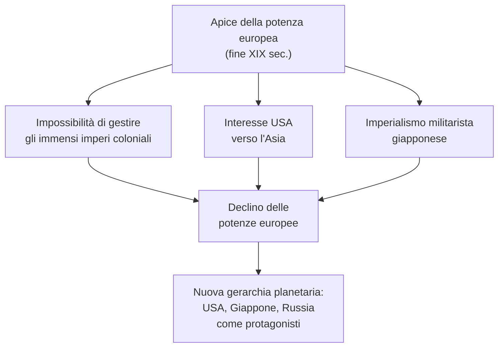

---

## 2. La Germania come potenza globale

Tra il **1888** e il **1890** si chiuse la fase dell'unificazione tedesca e della nascita del **Reich (1871)** e se ne aprì un'altra, con l'ascesa al trono di **Guglielmo II** (regnante **1888-1918**) e il ritiro del Cancelliere **Otto von Bismarck** nel **1890**.

> **Reich:** parola tedesca che indica genericamente l'organizzazione politica e può significare «impero», «regno» o «Stato». In italiano designa lo Stato tedesco nato nel 1871, la Germania nazista (il Terzo Reich) e talvolta l'Impero germanico medievale.

Bismarck aveva fatto della Germania il **perno degli equilibri europei**, poggiando su **due pilastri**: l'**isolamento della Francia** (evitando un suo accordo con la Russia) e una **rete di alleanze bilaterali** che legassero le potenze alla Germania. Guglielmo II volle **governare in proprio** e smantellò rapidamente il sistema bismarckiano.

Nel **1896** Guglielmo II lanciò la ***Weltpolitik*** («politica mondiale»), il **concetto cardine** della nuova strategia tedesca: l'obiettivo era rendere la Germania una **potenza globale** al pari di Gran Bretagna, USA e Russia.

> [!important] L'importanza della *Weltpolitik*
> La *Weltpolitik* non è solo espansione, è una **sfida per la supremazia planetaria**. Si manifestò con l'ottenimento di **concessioni** in Cina e, soprattutto, con il **potenziamento della flotta navale** per competere con il dominio britannico.

Tuttavia la Germania **non aveva interessi vitali fuori dall'Europa**: la sua proiezione globale rispondeva a **motivi di prestigio**. Paradossalmente, proprio questa ricerca di prestigio mondiale finì per minare la sicurezza tedesca sul continente, allarmando le altre potenze.

Un tassello cruciale fu il **potenziamento della flotta navale**. La mondializzazione aveva accresciuto il **valore strategico dei mari**, e la consapevolezza dell'**importanza del dominio marittimo** — dimostrata dall'egemonia navale britannica — spinse non solo la Germania ma tutte le potenze a investire nella marina, dando vita a una vera **corsa al riarmo navale** globale.

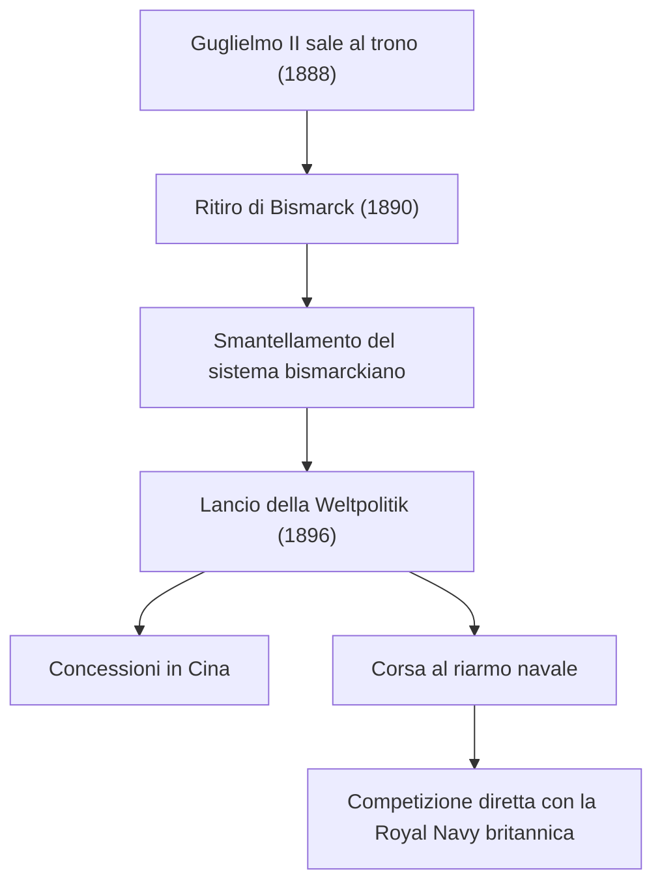

---

## 3. Il nuovo profilo mondiale degli Stati Uniti

### Sviluppo economico e svolta imperialista

La mondializzazione della politica non derivava solo dall'azione europea, ma anche dalla comparsa di **nuovi protagonisti extraeuropei**. Gli **Stati Uniti**, dopo la Guerra di secessione (**1861-65**), conobbero un'avanzata caratterizzata da: **consolidamento dell'unità** (infrastrutture ferroviarie, rafforzamento militare); sviluppo e integrazione dell'**Ovest** (nel **1890** tutto il Paese era colonizzato fino al Pacifico); accelerato **sviluppo industriale**; **penetrazione economica e commerciale** nel continente americano, in Europa e in Asia.

La California, prima di diventare uno Stato dell'Unione (c. 1846-1850), era un insieme di **missioni francescane** spagnole — da cui i nomi San Diego, Los Angeles, Santa Monica, Santa Barbara, Sacramento, San Francisco. Dopo una breve indipendenza dal Messico nacque la *Bear Republic*, con l'orso come simbolo.

> [!note] Dalla lezione
> La proiezione americana verso il Pacifico era legata alla **caccia alle balene**: l'**olio di balena** era risorsa strategica per **illuminazione** e **lubrificazione industriale** — paragonabile alle terre rare di oggi. Non a caso **Moby Dick** di Herman Melville, emblema della cultura baleniera, è il romanzo più importante della letteratura americana.

Dagli anni Novanta dell'Ottocento, al tradizionale obiettivo di egemonia sull'**America centro-meridionale** (in linea con la **dottrina Monroe**) gli USA affiancarono **direttrici di espansione intercontinentali**.

> **Dottrina Monroe:** indirizzo politico formulato nel **1823** dal presidente **James Monroe**: le potenze europee non dovevano interferire negli affari degli Stati americani. Slogan: **«l'America agli americani»**.

Il contesto della Dottrina è cruciale: tra 1810 e 1822 la maggior parte dei paesi centro-sudamericani si era resa indipendente dalla Spagna. La **Santa Alleanza** (1822-23) aveva represso i moti liberali in Europa e si temeva ristabilisse l'ordine coloniale anche in America. Si aggiungeva la **minaccia russa dall'Alaska**: la Russia si era estesa oltre lo stretto di Bering con il progetto di avanzare verso l'Oregon e la California. Monroe dichiarò: gli USA non si immischiano negli affari europei, ma gli europei restino fuori dalle giovani repubbliche americane.

> [!note] Dalla lezione
> La Dottrina Monroe viene oggi "rispolverata" a proposito del Venezuela contemporaneo (caso Alex Saab/Maduro), spesso da commentatori che non ne conoscono il contesto storico originario.

### Guerra con la Spagna (1898) e espansione nel Pacifico

A **Cuba**, ultimo lembo dell'impero spagnolo, nel **1895** scoppiò un'**insurrezione indipendentista** guidata da **José Martí**. Per isolare i guerriglieri, gli spagnoli introdussero **campi di concentramento** per civili — tecnica sperimentata nella **Guerra anglo-boera (1899-1902)**. Gli USA, spinti dalle pressioni degli **imprenditori** delle piantagioni di canna da zucchero cubane e da una **campagna di stampa** sulle atrocità spagnole, dichiararono guerra alla Spagna quando nel **1898** fu affondata una nave da guerra a L'Avana (presidente **William McKinley**).

Le azioni si svolsero a Cuba, nelle **Filippine** (dove era in corso una rivolta indipendentista), e a **Guam** e **Portorico**. La **pace di Parigi** sancì: **Filippine, Guam e Portorico agli USA**; **indipendenza di Cuba** sotto tutela di Washington. Nello stesso anno furono annesse le **Hawaii**. Gli USA avevano anche acquisito l'**Alaska** nel **1867** dalla Russia, fondamentale per il Nord del Pacifico e le **rotte artiche** — oggi sempre più praticabili per il cambiamento climatico.

> [!note] Dalla lezione
> Il **Passaggio a Nord-Ovest** fu un'epopea drammatica. Le navi **HMS Terror** e **HMS Erebus** scomparvero nel **1847** con **130 marinai** a bordo. La vicenda ha ispirato la serie *The Terror*. Consigliato: *I ragazzi di Barrow* (Adelphi).

Nel **1903** un accordo USA-Cuba stabilì la base navale di **Guantanamo** e il diritto americano di intervento militare.

### Politica estera di Theodore Roosevelt

Nel **1901**, dopo l'assassinio di McKinley, salì alla presidenza **Theodore Roosevelt** (1858-1919, in carica fino al **1908**), con una politica estera aggressiva verso l'**America Latina**.

Nel **1904** formulò il **«corollario Roosevelt»**: gli USA, «nazione civilizzata», potevano intervenire come **«polizia internazionale»** nel continente americano — un'evoluzione dalla difesa contro le ingerenze europee all'intervento diretto negli affari latinoamericani.

Nel **1903** gli USA, di fronte alle resistenze della **Colombia**, appoggiarono il **movimento indipendentista** di Panama, creando la **Repubblica di Panama** (di fatto un **protettorato**). Il **Canale di Panama**, inaugurato nel **1914**, divenne una grande rotta dei traffici mondiali.

> **Protettorato:** istituto giuridico in cui uno Stato tutore controlla la politica interna ed estera di un altro senza governarlo direttamente o annetterlo.

La **«diplomazia del dollaro»** (**1902-03**) prevedeva **prestiti delle banche americane** ai governi latinoamericani, che in cambio accettavano **esperti statunitensi nei loro organismi finanziari**, dando a Washington uno **strumento di controllo diretto** senza ricorrere alla forza militare.

> [!note] Dalla lezione
> Nella politica estera americana agiscono **molteplici forze** — economiche, politiche, sentimentali, religiose. Verso la Cina, accanto agli interessi commerciali, milioni di missionari protestanti sognavano di trasformarla in un paese democratico e cristiano. Questa complessità è chiave per comprendere l'azione internazionale USA.

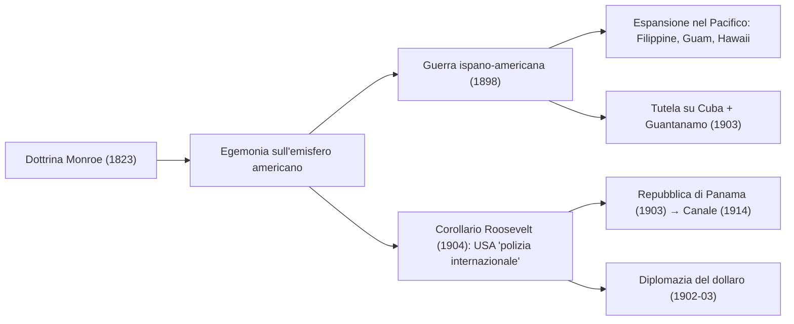

> [!note] Dalla lezione
> L'**instabilità politica** è tratto ricorrente dell'America Latina dal 1810: continui cambi di regime tra governi civili e militari. Due parole spagnole sono entrate nel lessico internazionale: **"golpe"** e **"guerriglia"**. Esempi: l'**Argentina** ha avuto due regimi militari (1966 e 1976-83, gen. Videla); il **Brasile** un lungo regime militare nel dopoguerra; il **Venezuela** odierno è un regime sostanzialmente militare che controlla l'economia e il petrolio.

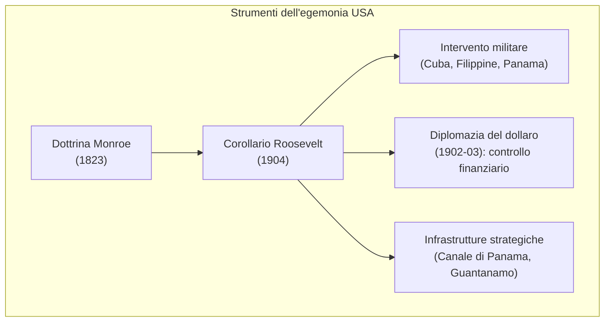

### La Rivoluzione messicana (1910-1917)

La Rivoluzione scoppiò nel **1910** contro il regime di **Porfirio Díaz**, che favoriva i grandi latifondisti (l'1% della popolazione possedeva metà delle terre). L'opposizione era divisa in due fronti con obiettivi divergenti:
*   **I moderati/liberali** (guidati da **Francisco Madero**): puntavano a riforme politiche e alla democrazia parlamentare.
*   **I movimenti contadini** (guidati da **Emiliano Zapata** e **Pancho Villa**): esigevano una radicale riforma agraria ("terra e libertà").

Nel **1911** Díaz fu rovesciato e Madero divenne presidente, ma deluse i contadini non attuando la redistribuzione delle terre. Dopo l'assassinio di Madero (**1913**) e il colpo di stato del generale **Huerta**, il Messico precipitò in una violenta **guerra civile** tra le diverse fazioni rivoluzionarie. Il conflitto portò alla **Costituzione del 1917** (presidenza **Carranza**), molto avanzata per l'epoca: prevedeva laicizzazione dello Stato, nazionalizzazione delle risorse minerarie e riforma agraria. Le ostilità terminarono solo negli anni '20, dopo l'uccisione di **Zapata** (1919) e **Villa** (1923).

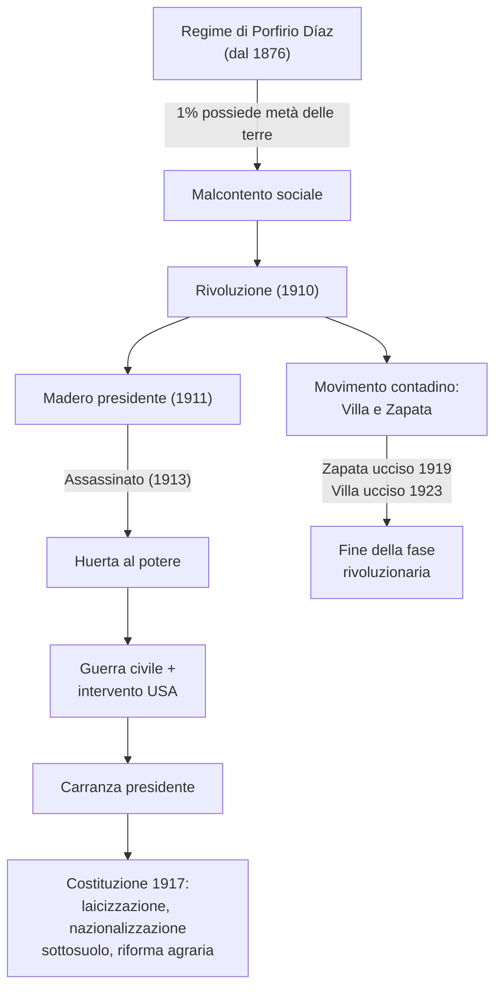

---

## 4. L'Impero russo e il corridoio euroasiatico

L'Impero russo, potenza europea dal Settecento, era per estensione anche una potenza asiatica: il suo territorio si configurava come un **corridoio euroasiatico**. Questo collegamento fu rafforzato dalla **ferrovia transiberiana (1891-1905)**, da **Mosca** a **Vladivostok**. Il porto di Vladivostok, sul Mar del Giappone, simboleggiava il rinnovato attivismo russo in Asia: approfittando dell'indebolimento degli **Imperi ottomano, persiano e cinese**, la Russia aveva occupato i territori a nord del fiume **Amur** e la costa fino alla **Corea**, fondando Vladivostok nel **1859**. Negli anni Novanta avanzò in **Manciuria**. Questi non erano colonie d'oltremare, ma il terminale di un **impero senza soluzione di continuità**.

> Sulle condizioni nei territori remoti, **Anton Čechov** visitò nel **1890** il bagno penale di **Sachalin** (istituito **1869**): *«Ogni giorno vengono inviati in miniera 350-400 detenuti… il problema non è la fatica in quanto tale, ma l'ambiente, la malafede, le prepotenze, le ingiustizie e gli arbitri»*.

I russi avevano conquistato il **Caucaso** (cerniera tra **Mar Nero** e **Mar Caspio**), strategicamente importante per i **bacini petroliferi di Baku**. In **Asia centrale**, tra gli anni Sessanta e Settanta, conquistarono **Uzbekistan, Kirghizistan e Turkmenistan**.

L'espansione russa provocò tensioni con la **Gran Bretagna**, che temeva una minaccia verso l'**India** via **Afghanistan**. Questa competizione anglo-russa è nota come **Great Game**: pressioni politiche, penetrazioni commerciali, azioni militari e missioni di spie per il **controllo dello Stato persiano e del Regno afghano**.

Nel **1907** una **convenzione anglo-russa** stabilì **Tibet** e **Afghanistan** come **«Stati cuscinetto»** e divise la **Persia** in due sfere d'influenza: a nord **russa**, a sud **britannica**. Nel **1908** la scoperta di **giacimenti petroliferi** nella zona britannica portò alla fondazione della **Anglo-Persian Oil Company**.

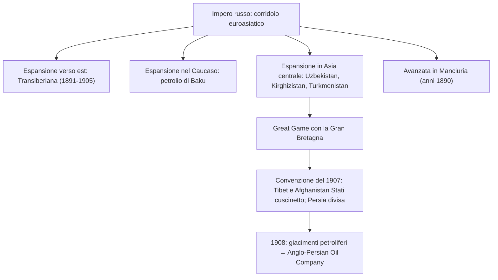

---

## 5. L'Estremo Oriente: una questione mondiale

### Penetrazione occidentale e semicolonizzazione della Cina

Dopo le **guerre dell'oppio** (**1839-42** e **1856-60**), la **Cina** dovette aprirsi all'influenza di **Gran Bretagna, USA, Francia, Russia, Prussia e Portogallo**. La **Francia** si espanse nella **Penisola Indocinese** (**Tonchino, Annam, Cocincina, Laos**); la **Gran Bretagna** dominava l'**Oceano Indiano** e il **Pacifico occidentale** e nel **1886** conquistò la **Birmania settentrionale**. Nel **1896** un accordo anglo-francese fissò i confini tra **Birmania** e **Indocina francese**; l'unico Paese indipendente restava il **Regno del Siam** (attuale **Thailandia**).

L'obiettivo principale restava la **Cina**: troppo vasta per essere conquistata, ma abbastanza indebolita per subire una **perdita di sovranità** tramite i **«trattati ineguali»**: **dazi di favore** per le merci straniere; **porti aperti**; **extraterritorialità** (stranieri non soggetti alla legge cinese). La Cina fu ridotta a **semicolonia** in un regime di **«imperialismo informale»**.

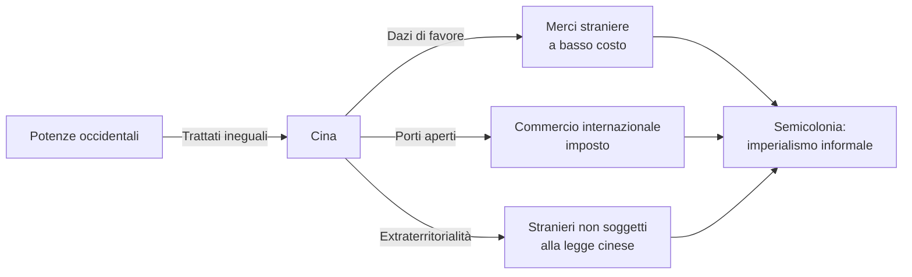

Emerse un **movimento riformatore** basato sull'**autorafforzamento**: **«il sapere occidentale come mezzo, il sapere cinese come fondamento»**.

### Il Giappone Meiji e l'espansionismo

L'**Impero del Sol Levante** intraprese la radicale riforma dell'**«era Meiji»** («governo illuminato»), aprendosi all'Occidente per **industrializzazione** e **modernizzazione** sotto lo slogan **«spirito giapponese, sapere occidentale»** — simile alla formula cinese, ma realizzata con maggiore efficacia.

Nel **1879** il Giappone annetté le **isole Ryūkyū**. La **Guerra sino-giapponese (1894-95)**, per l'influenza sulla **Corea**, si concluse con la sconfitta cinese: riconoscimento dell'**indipendenza della Corea**; cessione di **Taiwan** e della **Penisola di Liaodong**; **ingente indennità di guerra**.

### Rivolta dei boxer e Guerra russo-giapponese

La **rivolta dei boxer (1898-1901)** — il movimento *Yihequan* (**«pugno per la giustizia e la concordia»**) — esprimeva il **disagio contadino** attribuendo la crisi alle **potenze straniere** e ai **missionari cristiani**. L'orientamento **xenofobo** portò a violenze contro gli stranieri; le potenze reagirono con un **corpo di spedizione di 16 000 uomini** che nell'**agosto 1900** sedò la rivolta. Gli **USA** furono l'**unica potenza che si oppose alle richieste europee di indennità**, coerentemente con la politica della Porta Aperta.

La presenza russa in **Manciuria** portò nel **1904** all'attacco giapponese — senza dichiarazione di guerra — alla **flotta russa a Port Arthur**. La Russia subì sconfitte nella **battaglia di Port Arthur** e a **Tsushima**: **per la prima volta una potenza occidentale era sconfitta da un Paese extraeuropeo**. La pace di **Portsmouth** (USA, **1905**) assegnò al Giappone il **protettorato sulla Corea** e il controllo della **Manciuria meridionale**.

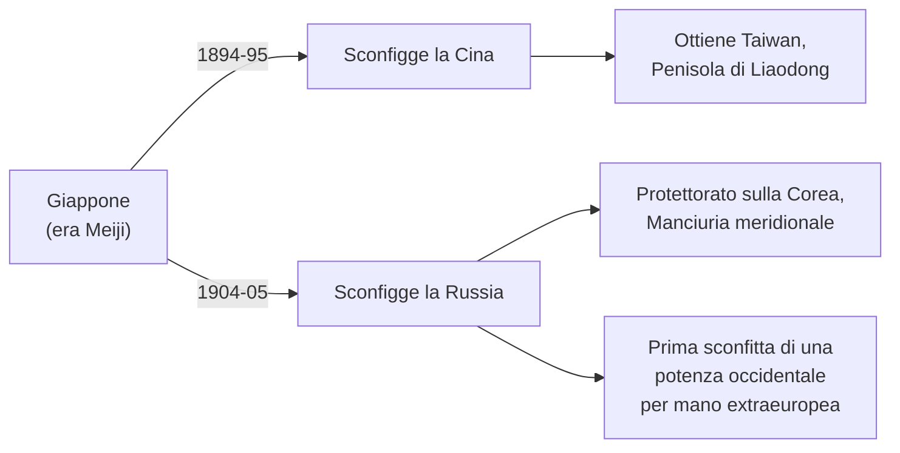

### Dalla dissoluzione imperiale alla Repubblica cinese

Nel **1905** **Sun Yat-sen** fondò una **Lega** che promosse insurrezioni fallimentari, ma nell'**ottobre 1911** un processo rivoluzionario portò al **crollo dell'impero** e nel **1912** alla proclamazione della **Repubblica cinese** (capitale **Nanchino**). Sun Yat-sen, primo presidente, era **medico di medicina occidentale**, **cristiano convertito**, formatosi nelle scuole dei **missionari americani** in Cina, alle **Hawaii** e a **San Francisco**.

> [!note] Dalla lezione
> **Missionari protestanti americani** avevano fondato scuole e college in tutta la Cina, sognando di trasformarla in una repubblica democratica e cristiana. La politica della **Porta Aperta** (*Open Door*) esprimeva questo orientamento: uguali possibilità commerciali senza sfere d'influenza rigide. Sun Yat-sen sembrava la realizzazione di quel sogno, ma la Cina piombò in una lunga guerra civile e nel 1949 divenne una repubblica comunista.

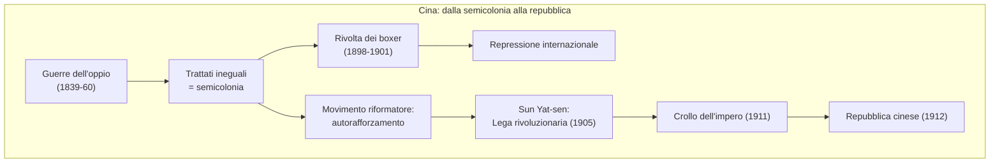

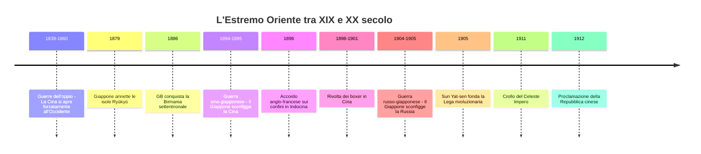

---

## Quadro di sintesi: i nuovi protagonisti mondiali

| Potenza | Area di espansione | Strumenti | Risultati principali |
|---|---|---|---|
| **Stati Uniti** | America Latina, Pacifico, Asia orientale | Dottrina Monroe, corollario Roosevelt, diplomazia del dollaro, guerra | Controllo di Cuba, Filippine, Guam, Portorico, Hawaii, Panama; egemonia sull'emisfero occidentale |
| **Germania** | Europa (prioritario), concessioni in Cina | *Weltpolitik*, riarmo navale | Competizione con la Gran Bretagna; presenza in Estremo Oriente per motivi di prestigio |
| **Russia** | Corridoio euroasiatico, Caucaso, Asia centrale, Manciuria | Ferrovia transiberiana, espansione territoriale continua | Controllo del Caucaso (petrolio di Baku), Asia centrale, sconfitta contro il Giappone |
| **Giappone** | Corea, Cina, Pacifico | Modernizzazione Meiji, forza militare | Vittoria sulla Cina (1895) e sulla Russia (1905); protettorato sulla Corea; Manciuria meridionale |
| **Gran Bretagna** | Dominio globale: India, Oceano Indiano, Pacifico, Africa, Persia | Egemonia navale, *Great Game*, accordi diplomatici | Un quarto delle terre emerse; 400 milioni di sudditi; Anglo-Persian Oil Company |
| **Francia** | Nord Africa, Indocina | Politica coloniale di rilancio post-1871 | +9 milioni di km²; Tonchino, Annam, Cocincina, Laos |

---

## Concetti chiave e definizioni

> **Imperialismo:** tendenza di uno Stato ad acquisire il controllo diretto o indiretto su un altro Stato. Termine affermatosi tra XIX e XX secolo per distinguere la nuova ondata espansionistica da quelle dell'età moderna.

> **Reich:** parola tedesca per «impero/regno/Stato». Designa lo Stato tedesco nato nel 1871, la Germania nazista (Terzo Reich) e l'Impero germanico medievale.

> ***Weltpolitik*:** «politica mondiale». È la dottrina lanciata da Guglielmo II nel 1896 per trasformare la Germania in una potenza globale. Rappresenta il **perno del cambiamento geopolitico** che porterà alla fine dell'equilibrio bismarckiano.

> **Concessione:** territorio su cui uno Stato concede temporaneamente il controllo a un altro, mantenendo la propria sovranità formale.

> **Dottrina Monroe (1823):** «l'America agli americani» — divieto di ingerenza europea nelle Americhe.

> **Corollario Roosevelt (1904):** gli USA si arrogano il diritto di intervenire come «polizia internazionale» nel continente americano.

> **Diplomazia del dollaro:** prestiti USA ai Paesi latinoamericani in cambio dell'inserimento di esperti statunitensi nei loro apparati finanziari.

> **Protettorato:** istituto giuridico in cui uno Stato tutore controlla la politica interna ed estera di un altro senza governarlo direttamente o annetterlo.

> **Great Game:** competizione anglo-russa per il controllo dell'Asia centrale (Persia, Afghanistan).

> **Trattati ineguali:** accordi imposti alla Cina dalle potenze (dazi di favore, porti aperti, extraterritorialità), che la ridussero a semicolonia.

> **Imperialismo informale:** controllo economico e politico di un territorio senza dominio diretto.

> **Mondializzazione:** interconnessione crescente delle dinamiche mondiali in ambito politico, economico e tecnologico, che porta alla formazione di una gerarchia planetaria.

> **Era Meiji:** «governo illuminato» — fase di radicale modernizzazione del Giappone, improntata al principio «spirito giapponese, sapere occidentale».

> **PIL (Prodotto Interno Lordo):** misura il valore di beni e servizi prodotti all'interno di un Paese in un anno.

---

## Mappa concettuale del capitolo

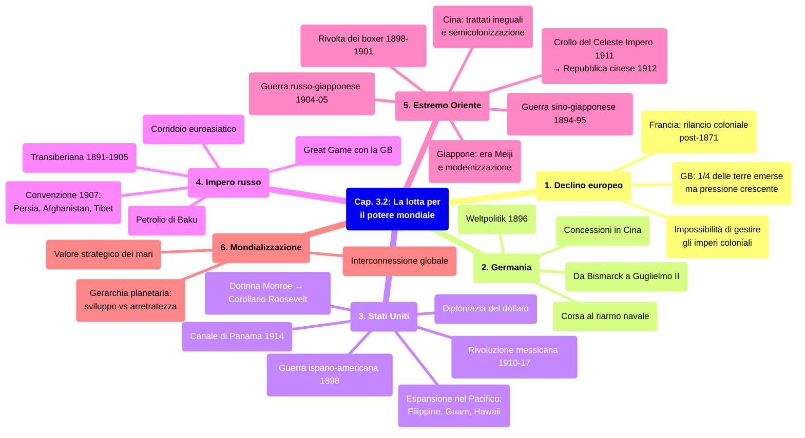
