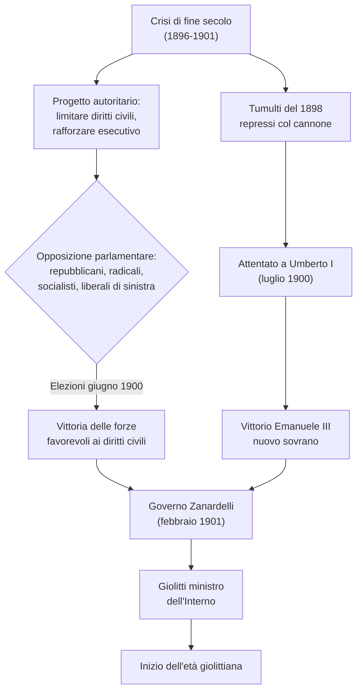
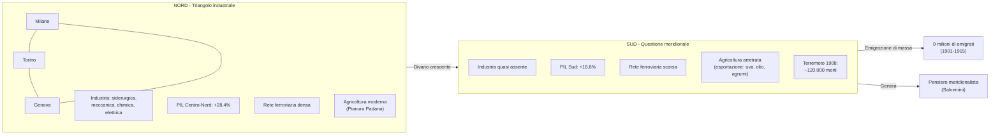
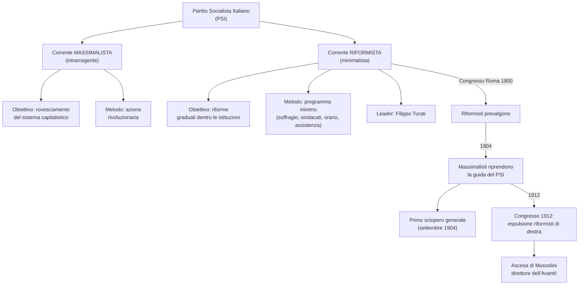
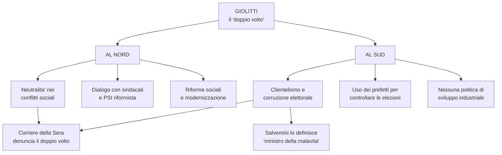
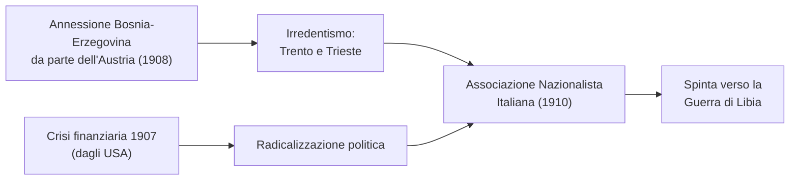
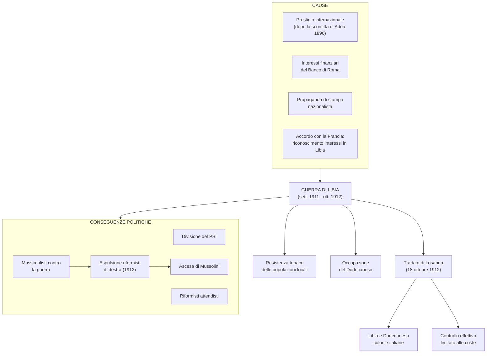
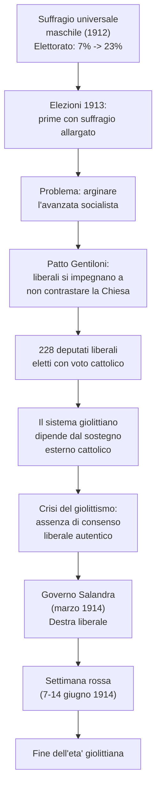
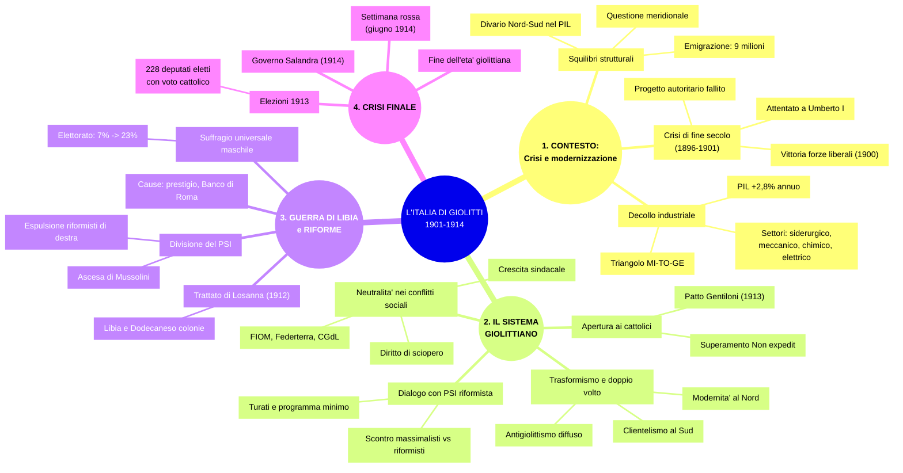

# Ripasso Veloce - Capitolo 3.3: L'Italia di Giolitti

---

## Cronologia essenziale

| Data | Evento |
|:-----|:-------|
| **1898** | Tumulti per il caro-pane, repressi a cannonate |
| **1900** | Elezioni: vittoria forze liberali; assassinio Umberto I (Bresci) |
| **1901** | Governo Zanardelli-Giolitti; nascita FIOM e Federterra |
| **1904** | Primo sciopero generale in Italia |
| **1906** | Nascita CGdL |
| **1911** | L'Italia dichiara guerra all'Impero ottomano (Libia) |
| **1912** | Trattato di Losanna; suffragio universale maschile; ascesa Mussolini |
| **1913** | Patto Gentiloni; 228 deputati liberali eletti con voto cattolico |
| **1914** | Governo Salandra; Settimana rossa; fine dell'età giolittiana |

---

## 1. La via italiana alla modernità

### Dalla crisi di fine secolo al governo Zanardelli-Giolitti

- **Crisi di fine secolo** (1896-1901): tumulti del 1898, tentativi autoritari (limitare diritti civili dello Statuto albertino, rafforzare esecutivo)
- Svolta per via istituzionale: repubblicani, radicali, socialisti e liberali di sinistra fecero decadere i progetti autoritari
- Elezioni **giugno 1900**: vittoria delle forze liberali (elettorato ristretto al ~7%)
- **Attentato a Umberto I** (29 luglio 1900) da parte di Bresci → Vittorio Emanuele III re
- **Febbraio 1901**: governo Zanardelli (premier) + Giolitti (ministro dell'Interno)

### La sfida giolittiana

Giolitti dominò la politica fino al **1914** (**«età giolittiana»**). Obiettivo: adeguare lo Stato liberale alla **società di massa** senza abbandonarne i principi. Tre criticità strutturali italiane:
- **Classe dirigente ristretta** e timorosa
- Notevole **ritardo economico-sociale**
- Fortissimi **squilibri regionali** Nord-Sud

### Crescita economica

Crescita sulla scia del ciclo positivo mondiale (dal 1896):
- **PIL**: crescita media annua **2,8%** (1896-1913)
- **Industria**: crescita **6,7%** (1896-1907), la più alta d'Europa
- **Energia idroelettrica**: da 66 a 2.000 milioni kWh
- Settori trainanti: **siderurgico, meccanico, chimico, elettrico**
- Imprenditori: Falck, Agnelli (FIAT 1899), Olivetti, Pirelli

### Paese ancora rurale

- Agricoltura pesava nel PIL il **doppio** dell'industria (1901-1910)
- Stato cruciale: **politiche protezioniste** + **committente diretto** (nazionalizzazione ferrovie 1905)
- Sistema bancario favorì modernizzazione ma alimentò **cartelli e monopoli**

### Questione meridionale

- Sviluppo concentrato nel **triangolo industriale Milano-Torino-Genova**; Sud quasi privo di industria
- Rete ferroviaria: da 6.000 km (1870) a 18.000 km (1914), molto più densa al Nord
- PIL 1891-1911: Centro-Nord **+28,4%** vs Sud **+18,8%** → nasce il filone **meridionalista**
- **Terremoto 1908** (Messina e Reggio Calabria): ~120.000 morti

### Emigrazione

- **1901-1915**: oltre **9 milioni** di emigrati (~600.000/anno)
- Prima dal Nord verso l'Europa, poi dal Sud (Basilicata, Calabria, Campania, Sicilia) verso gli USA
- Funzione di **valvola di sfogo** sociale; **rimesse** importanti per la bilancia dei pagamenti

---

## 2. Il sistema giolittiano e i suoi avversari

### Il progetto: includere le masse nello Stato

- Giolitti voleva allargare le basi sociali dello Stato liberale
- Stato **neutrale** nei conflitti sociali: libertà sindacale, diritto di sciopero
- Logica: reprimere le richieste economiche avrebbe solo radicalizzato le proteste

### Il PSI e le correnti

- **Massimalisti/intransigenti**: azione rivoluzionaria, rovesciamento del capitalismo
- **Riformisti/minimalisti** (leader: **Filippo Turati**): azione gradualista nelle istituzioni
- **Congresso di Roma 1900**: prevalgono i riformisti con un **«programma minimo»** (suffragio universale, libertà sindacale, riduzione orario, assistenza)
- **Anna Kuliscioff**: esponente riformista, impegno per l'emancipazione femminile

### Sviluppo sindacale e primo sciopero generale

- Camere del lavoro: da 17 (1900) a 76 (1902); nel 1901 nascono **FIOM** e **Federterra**
- **1904**: massimalisti riconquistano il PSI → **primo sciopero generale** (16-21 settembre). Giolitti attese che si esaurisse da solo
- **1906**: nascita della **CGdL**

### Apertura cattolica e limiti del sistema

- **Pio X** (1903-1914): cattolici autorizzati a sostenere candidati liberali contro i socialisti → superamento graduale del **Non expedit** di Pio IX (1874)
- Sistema fondato su **mediazione parlamentare** e gestione elezioni tramite **prefetti** → accusato di **clientelismo, corruzione, trasformismo**

> **Trasformismo**: pratica che ricerca maggioranze parlamentari con accordi e concessioni a gruppi ideologicamente eterogenei.

### Antigiolittismo

- **«Corriere della Sera»** (Albertini): denuncia il **«doppio volto»** — moderno al Nord, clientelare al Sud
- **Gaetano Salvemini**: lo definì **«ministro della malavita»**
- Reazione antipositivista: riviste «Leonardo», «Il Regno», «La Voce»

- **1909**: **movimento futurista** di Marinetti — esaltazione di modernità, velocità e guerra

### Crisi 1907 e irredentismo

- **1907**: crisi finanziaria (dagli USA) → radicalizzazione politica
- **1908**: Austria annette la Bosnia-Erzegovina → rinasce l'**irredentismo** (Trento e Trieste)
- **1910**: nasce l'**Associazione Nazionalista Italiana**

---

## 3. Guerra di Libia e suffragio

### Guerra di Libia (settembre 1911 - ottobre 1912)

Cause: prestigio post-Adua (1896), interessi del **Banco di Roma**, propaganda nazionalista, accordo con la Francia sugli interessi in Libia.

- **29 settembre 1911**: dichiarazione di guerra all'Impero ottomano
- Resistenza locale tenace; occupazione anche del **Dodecaneso**
- **18 ottobre 1912**: **trattato di Losanna** → Libia e Dodecaneso colonie italiane, ma controllo effettivo **limitato alle coste**
- Esecuzioni di militari arabo-ottomani e deportazioni di civili

### Divisione PSI e ascesa Mussolini

- Massimalisti **contro** la guerra, riformisti **attendisti**
- **Congresso 1912**: espulsione riformisti di destra (Bissolati, Bonomi)
- **Mussolini** diventa direttore dell'«Avanti!»

### Suffragio universale maschile (giugno 1912)

- Voto a tutti i maschi dai **30 anni**, o dai **21** se alfabeti/reduci militari
- Elettori: dal **7%** a oltre il **23%** della popolazione
- Altra riforma: monopolio statale assicurazioni sulla vita → nascita dell'**INA**

---

## 4. La crisi del giolittismo

### Elezioni 1913 e patto Gentiloni

- **Patto Gentiloni**: candidati liberali si impegnano a non sostenere leggi contrarie alla Chiesa (divorzio, istruzione religiosa) in cambio del voto cattolico
- Risultato: **228 deputati liberali** eletti grazie al voto cattolico → il sistema dipendeva da un sostegno esterno, non da autentico consenso liberale

### Fine dell'età giolittiana

- **Marzo 1914**: Giolitti lascia → governo **Salandra** (destra liberale)
- **Settimana rossa** (7-14 giugno 1914): repressione di una manifestazione antimilitarista ad Ancona → sciopero generale della CGdL, scontri in tutta Italia
- Il sistema giolittiano non reggeva più la complessità della società di massa

---

## Giudizio degli storici

- **Salvadori**: grande statista, ma a scapito del Sud
- **Salvemini**: «ministro della malavita» per i metodi elettorali nel Meridione
- **Aquarone**: riforme = «saggia amministrazione ordinaria», non cambiamento strutturale
- **Gentile**: la politica giolittiana favorì il decadimento dell'autorità dello Stato, aprendo la strada al fascismo

---

## Mappa concettuale complessiva

