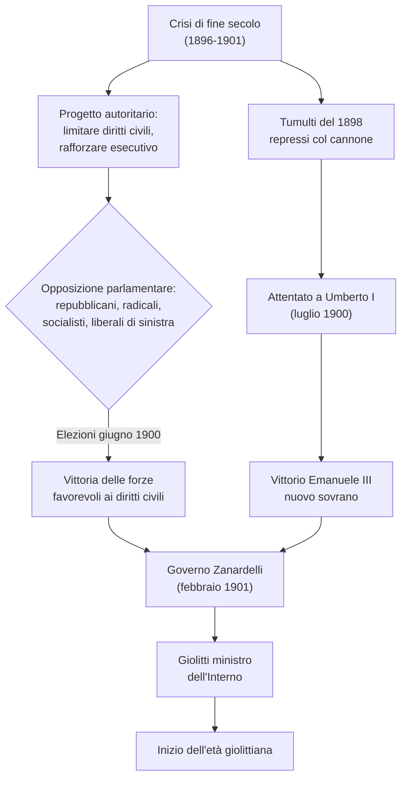
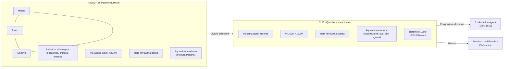
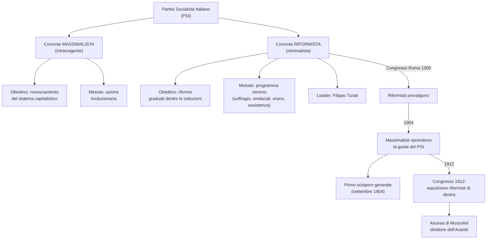
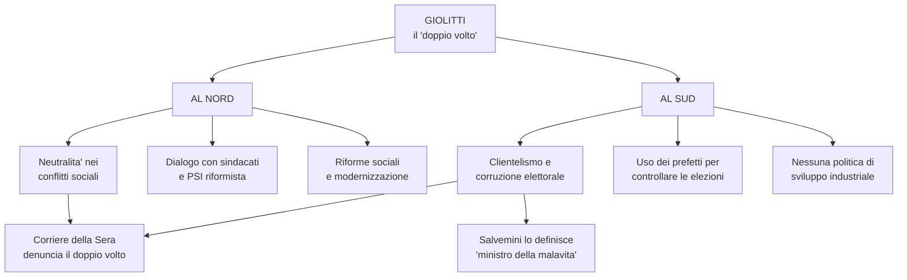
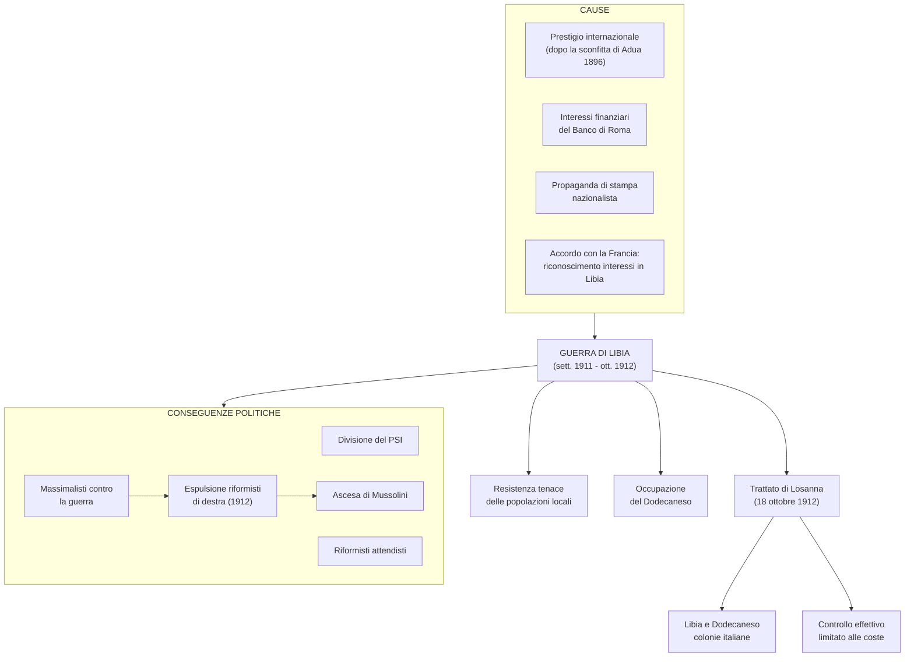
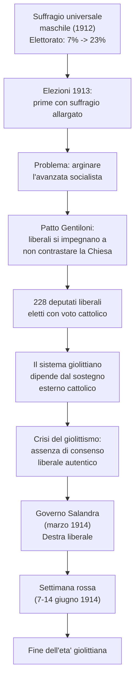
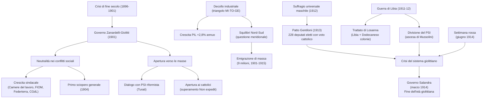
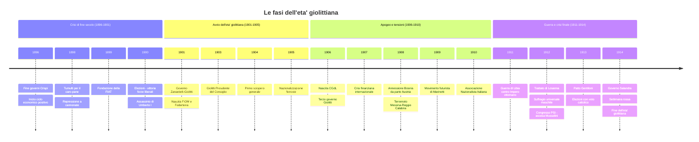
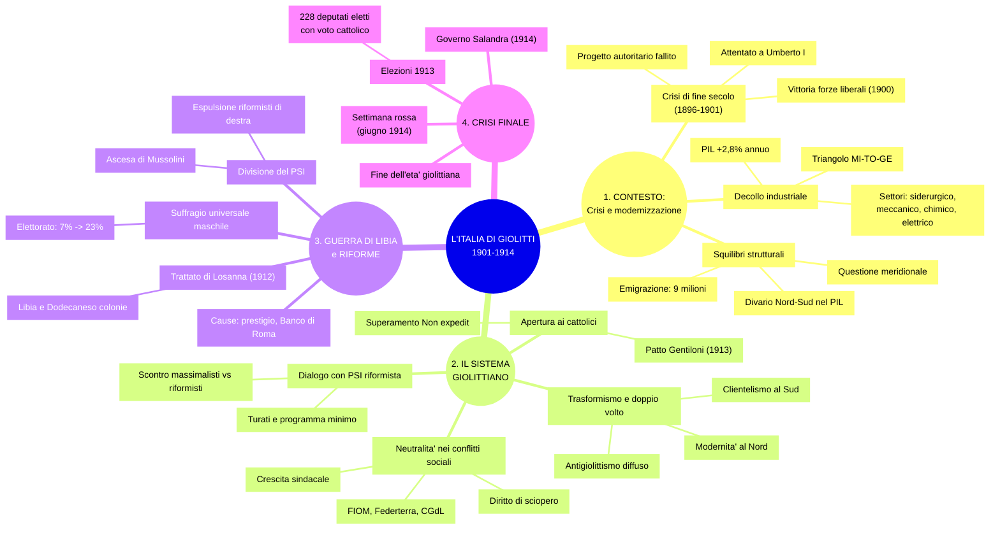

# Schema di Studio - Capitolo 3.3: L'Italia di Giolitti

---

## Cronologia essenziale

| Data | Evento |
|:-----|:-------|
| **1896** | Fine dei governi Crispi; inizio del ciclo positivo dell'economia mondiale |
| **Maggio 1898** | Tumulti popolari per il caro-pane, repressi a colpi di cannone |
| **1899** | Fondazione della FIAT (Giovanni Agnelli) |
| **Giugno 1900** | Elezioni: vittoria delle forze favorevoli alla difesa dei diritti civili |
| **29 luglio 1900** | Assassinio di re Umberto I da parte dell'anarchico Gaetano Bresci |
| **Febbraio 1901** | Governo Zanardelli con Giolitti ministro dell'Interno |
| **1901** | Nascita della FIOM e della Federterra |
| **1903** | Giolitti diventa Presidente del Consiglio |
| **16-21 settembre 1904** | Primo sciopero generale in Italia |
| **1905** | Nazionalizzazione delle ferrovie |
| **1906** | Nascita della Confederazione Generale del Lavoro (CGdL); Esposizione di Milano |
| **Giugno 1906 – Dicembre 1909** | Terzo governo Giolitti |
| **1907** | Crisi finanziaria internazionale (partita dagli USA) |
| **1908** | Annessione della Bosnia-Erzegovina da parte dell'Austria |
| **28 dicembre 1908** | Terremoto di Messina e Reggio Calabria (~120.000 morti) |
| **1909** | Nascita del movimento futurista (Marinetti) |
| **1910** | Fondazione dell'Associazione Nazionalista Italiana |
| **29 settembre 1911** | L'Italia dichiara guerra all'Impero ottomano (Guerra di Libia) |
| **18 ottobre 1912** | Trattato di Losanna: Libia e Dodecaneso diventano colonie italiane |
| **Giugno 1912** | Riforma elettorale: suffragio universale maschile |
| **1912** | Congresso del PSI: espulsione dei riformisti di destra; Mussolini direttore dell'«Avanti!» |
| **1913** | Patto Gentiloni; elezioni con 228 deputati liberali eletti grazie al voto cattolico |
| **Marzo 1914** | Governo Salandra (destra liberale) |
| **7-14 giugno 1914** | «Settimana rossa»: scioperi e scontri in tutta Italia |

---

## 1. La via italiana alla modernità

### Oltre la crisi di fine secolo: il tramonto dell'opzione autoritaria

Tra il **1900** e il **1901** il giovane Regno d'Italia entrò in una nuova fase della sua storia, chiudendo la cosiddetta **crisi di fine secolo**. Questa crisi era cominciata dopo la fine dei governi Crispi nel **1896**, era esplosa nel **maggio 1898** — quando i tumulti popolari scoppiati per l'alto costo del pane furono repressi a colpi di cannone — e si era protratta con tentativi di imporre un indirizzo di governo autoritario. Il progetto autoritario prevedeva tre elementi fondamentali:
- leggi speciali per limitare i diritti civili costituzionali garantiti dallo **Statuto albertino** (libertà di stampa e di associazione)
- il rafforzamento dell'esecutivo (monarchia e governo)
- il ridimensionamento del ruolo del Parlamento

La crisi fu risolta attraverso la **via istituzionale** che si era consolidata nei primi decenni di vita del Regno. In Parlamento i progetti di legge governativi decaddero grazie all'opposizione convergente di **repubblicani e radicali** (eredi delle correnti democratiche del Risorgimento) e dei **socialisti** (il Partito socialista era nato nel **1892**), spalleggiati dai liberali di sinistra guidati da **Giuseppe Zanardelli** e **Giovanni Giolitti**. Alle elezioni del **giugno 1900** una parte significativa dell'elettorato — ancora piuttosto ristretto, con circa il **7% della popolazione** avente diritto di voto, naturalmente solo uomini — votò queste forze, dimostrando il proprio consenso per la battaglia a difesa dei diritti civili.

La svolta autoritaria divenne un'opzione definitivamente impraticabile, persino dopo l'**attentato mortale a re Umberto I**, compiuto il **29 luglio 1900** dall'anarchico **Gaetano Bresci**, che intendeva vendicare le vittime della repressione del 1898. Nel **febbraio 1901** il nuovo sovrano **Vittorio Emanuele III** affidò la guida del governo ai liberali di sinistra: **Zanardelli** fu designato Primo ministro, mentre **Giolitti** assunse il ruolo di ministro dell'Interno.

### Giolitti: una risposta alle trasformazioni del Paese

Le vicende del 1900-01 dimostrarono che le istituzioni dello Stato liberale erano ancora vitali. Giolitti, che avrebbe dominato la scena politica fino al **1914** (da cui l'espressione **«età giolittiana»**), tentò di realizzare riforme capaci di adeguare lo Stato liberale alle profonde trasformazioni dell'epoca, senza abbandonarne i principi basilari.

La sfida consisteva nel far fronte ai cambiamenti provocati dal **balzo industriale**, dall'accelerazione del processo di **modernizzazione** e dalla nascita di una **società più complessa**, nella quale le classi popolari — le «masse» — assumevano e rivendicavano un ruolo sempre più significativo. Si trattava delle stesse sfide che si ponevano a tutti i Paesi avanzati d'Europa, ma l'Italia versava in condizioni particolarmente arretrate, caratterizzate da tre criticità strutturali:
- uno Stato giovane con una **classe dirigente ristretta**, poco propensa ad aprirsi alle nuove forze e timorosa che le acquisizioni del Risorgimento potessero essere perdute
- un notevole **ritardo economico e sociale** rispetto alle altre potenze
- fortissimi **squilibri regionali** fra Nord e Sud

---

### Crescita economica e trasformazioni sociali

La crescita italiana avvenne sulla scia del ciclo positivo dell'economia mondiale iniziato nel **1896**. I dati economici mostrano una trasformazione imponente:

| Indicatore | Dati |
|:-----------|:-----|
| **PIL** (crescita media annua 1896-1913) | **2,8%** |
| **Industria** (tasso di crescita 1896-1907) | **6,7%** — il più elevato d'Europa |
| **Addetti all'industria** (1903 → 1911) | Da **1.275.000** a **2.304.000** |
| **Energia idroelettrica** (1898 → 1913) | Da **66 milioni kWh** a **2.000 milioni kWh** |

I settori trainanti del decollo industriale furono quattro:
- il **siderurgico**
- il **meccanico** (dove si sviluppò l'industria automobilistica)
- il **chimico**
- l'**elettrico**

Sebbene la maggior parte dell'energia fosse ancora prodotta tramite **carbone importato**, si intraprese un consistente sfruttamento delle acque attraverso **impianti idroelettrici**, il cui sviluppo fu straordinario (da 66 a 2.000 milioni di kWh in quindici anni).

Di riflesso, l'articolazione sociale divenne più complessa: cresceva la **classe operaia**, si rafforzavano gruppi professionali legati alle attività moderne ed emergeva un **ceto imprenditoriale dinamico**. Fra i nomi più rappresentativi di questo nuovo capitalismo industriale figuravano **Giorgio Enrico Falck** (siderurgia), **Giovanni Agnelli** (la FIAT nacque nel **1899**), **Camillo Olivetti** (macchine per scrivere) e **Giovanni Battista Pirelli** (gomma).

> **Protezionismo**: indirizzo di politica economica che prevede l'intervento dello Stato per tutelare determinate attività produttive nazionali dalla concorrenza straniera, per esempio con l'imposizione di **tariffe doganali** sui prodotti provenienti dall'estero (scoraggiandone l'importazione) o di **dazi sulle materie prime nazionali** (scoraggiandone l'esportazione).

---

### Un Paese ancora rurale, ma aperto alla modernità

Nonostante il balzo industriale, il Paese restava **prevalentemente rurale**: il peso dell'agricoltura nel PIL, tra il 1901 e il 1910, fu **doppio** rispetto a quello dell'industria, e l'Italia rimaneva piuttosto **arretrata** rispetto alle principali potenze industriali. Proprio il ritardo iniziale contribuì a determinare la fisionomia peculiare del sistema economico italiano.

Nel decollo industriale fu cruciale l'**intervento dello Stato**, che agì in due direzioni principali: da un lato promosse **politiche protezioniste**, dall'altro assunse il ruolo di **committente diretto** dell'industria (un esempio paradigmatico fu la **nazionalizzazione delle ferrovie nel 1905**).

Anche il **sistema bancario** favorì la modernizzazione, facendo affluire investimenti nell'industria. Tuttavia, questa dinamica alimentò anche la tendenza a costituire gruppi sempre più grandi e ramificati, con interessi nei più svariati settori, che si trasformavano in **cartelli** — capaci di imporre prezzi a loro vantaggio — o in veri e propri **monopoli**.

> **Cartelli**: accordo tra più imprese indipendenti, finalizzato a limitare la concorrenza sul proprio mercato.

> **Monopoli**: condizione del mercato per cui la totalità dell'offerta di un prodotto o di un servizio è detenuta da una sola impresa o organizzazione.

---

### Alle origini della «questione meridionale»

Lo sviluppo industriale aveva accentuato gli **squilibri interni** al Paese, in quanto si concentrò nel cosiddetto **«triangolo industriale»** compreso fra **Milano, Torino e Genova**, mentre altrove — soprattutto al **Sud** — non vi fu una crescita analoga. Lo sviluppo industriale nel Meridione era quasi del tutto assente. A testimonianza della concentrazione geografica dello sviluppo, anche la **rete ferroviaria** mostra una disparità netta: dai **6.000 chilometri del 1870** si passò ai **18.000 del 1914**, ma la densità restava molto maggiore al Nord che al Sud.

### Il risveglio dell'agricoltura e il divario Nord-Sud

Il risveglio dell'**agricoltura** dopo la grande depressione di fine Ottocento interessò prevalentemente la **Pianura Padana**. In **Puglia** e in **Sicilia** le coltivazioni orientate all'esportazione (uva, olio, agrumi) conobbero una ripresa, ma il divario complessivo tra Nord e Sud si ampliò comunque. Anche il Mezzogiorno, tuttavia, conobbe una crescita, seppure più modesta:

| Area | Crescita del PIL (1891-1911) |
|:-----|:----------------------------|
| **Centro-Nord** | **+28,4%** |
| **Sud** | **+18,8%** |

Questa differenza di quasi dieci punti percentuali generò il filone di pensiero **meridionalista**, che poneva al centro del dibattito politico e intellettuale la cosiddetta «questione meridionale». Un duro colpo alla situazione già fragile del Meridione fu il **terremoto del 28 dicembre 1908** che colpì **Messina e Reggio Calabria**, causando circa **80.000 morti in Sicilia** e **40.000 in Calabria** — una delle più gravi catastrofi naturali della storia italiana.

---

### I progressi sociali e culturali

Lo sviluppo economico si tradusse anche in un significativo progresso sociale. L'**analfabetismo** conobbe una riduzione progressiva ma ancora insufficiente:

| Anno | Tasso di analfabetismo |
|:-----|:----------------------|
| **1881** | **67,3%** |
| **1901** | **56%** |
| **1911** | **46,2%** |

L'espansione del **sistema scolastico** fu cruciale in questa dinamica. In questi anni fu anche **innalzato l'obbligo scolastico** fino all'età di **12 anni**, una riforma che contribuì ad allargare la base alfabetizzata della popolazione.

---

### L'emigrazione

Un segno evidente e drammatico degli squilibri persistenti nel Paese fu la massiccia **emigrazione**: tra il **1901** e il **1915** oltre **9 milioni di persone** lasciarono l'Italia, in media circa **600.000 l'anno**. Si trattò di un fenomeno di proporzioni enormi, che cambiò la composizione geografica dei flussi migratori nel tempo.

Se a fine Ottocento le partenze avvenivano soprattutto dalle **regioni settentrionali** verso **Paesi europei**, all'inizio del Novecento le partenze più numerose si verificarono nelle **regioni meridionali** — Basilicata, Calabria, Campania, Sicilia — e la destinazione privilegiata divennero gli **Stati Uniti**.

| Periodo | Espatri dal Nord | Espatri dal Sud | Regione con più espatri |
|:--------|:----------------|:----------------|:------------------------|
| **1876-1900** | 3.723.672 | 1.534.239 | **Veneto** (940.711) |
| **1901-1915** | 4.621.057 | 4.148.728 | **Sicilia** (1.126.513) |

L'emigrazione svolse una duplice funzione: da un lato rappresentò una **valvola di sfogo** per le tensioni sociali interne, dall'altro le **rimesse** — il denaro che gli emigrati inviavano alle famiglie rimaste in Italia — rappresentarono una voce importante nella **bilancia dei pagamenti** italiana.

> **Bilancia dei pagamenti**: è il conto in cui vengono registrate tutte le operazioni svolte dall'economia di un Paese verso l'esterno in un dato periodo. Include i movimenti di capitali, importazioni ed esportazioni, viaggi e trasferimenti unilaterali.

---

## 2. L'età giolittiana: il «sistema» e i suoi avversari

### Il progetto di Giolitti: includere nello Stato le masse popolari

Il governo **Zanardelli** (**1901**) inaugurò una politica liberale incline a un'**apertura verso le classi lavoratrici**. Lo scopo era far sostenere il governo da alleanze politiche non solo con radicali e socialisti, ma anche con i cattolici. **Giolitti**, nel suo ruolo di ministro dell'Interno, intendeva consolidare lo Stato liberale **allargando le basi sociali del sistema**.

Il nucleo della visione giolittiana era che lo Stato dovesse rimanere **neutrale** nei conflitti sociali, riconoscendo pienamente la libertà di organizzazione sindacale e il diritto di sciopero. Giolitti era convinto che rispondere con la forza alle legittime richieste economiche dei lavoratori avrebbe solo **radicalizzato le proteste**, producendo l'effetto opposto a quello desiderato.

---

### Il Partito socialista e l'attività riformistica

Giolitti guardava soprattutto al **Partito socialista (PSI)**, all'interno del quale si contrapponevano due correnti:
- una **corrente intransigente o massimalista**, che reclamava un'azione rivoluzionaria e il rovesciamento del sistema capitalistico
- una **corrente riformista o minimalista**, favorevole a un'azione gradualista dentro le istituzioni, guidata da **Filippo Turati**

Al **congresso di Roma del 1900** i riformisti prevalsero e proposero un **«programma minimo»** di riforme democratiche che comprendeva:
- il suffragio universale
- la libertà sindacale
- la riduzione dell'orario di lavoro
- miglioramenti assistenziali ed educativi

> **Municipalizzazione**: l'assunzione e la gestione di pubblici servizi (gas, elettricità, acqua, trasporti) da parte dei Comuni, attraverso aziende dette **municipalizzate**.

### Anna Kuliscioff e il «monopolio dell'uomo»

La russa **Anna Kuliscioff** (**1855-1925**) fu un'esponente di spicco del socialismo riformista italiano. Cercò di introdurre nel PSI le idee per l'**emancipazione delle donne**, denunciando il «privilegio dell'uomo di fronte alla donna» come un fenomeno che la società dell'epoca considerava purtroppo «naturale». La sua azione rappresentò un primo tentativo di porre la questione femminile all'interno del dibattito politico socialista.

---

### Lo sviluppo del movimento sindacale

Gli anni **1903-1905** segnarono un cambio di rotta significativo. La scelta di Giolitti di **non reprimere le proteste** portò a due risultati importanti: da un lato, significativi **miglioramenti salariali** per i lavoratori; dall'altro, uno sviluppo impetuoso delle organizzazioni sindacali. I dati sulla crescita del sindacalismo italiano sono eloquenti:
- le **Camere del lavoro** passarono da **17** nel 1900 a **76** nel 1902
- nel **1901** nacque la **Federazione nazionale degli operai metallurgici (FIOM)**
- nel **1901** nacque la **Federazione dei lavoratori agricoli (Federterra)**

> **Camera del lavoro**: nate nell'ultimo decennio del XIX secolo per riunire le organizzazioni sindacali a livello territoriale, le Camere del lavoro assunsero funzioni di collocamento e un ruolo di mediazione nei conflitti di lavoro.

Nel **1904** i massimalisti riconquistarono la guida del PSI e proclamarono il **primo sciopero generale in Italia**, che si svolse dal **16 al 21 settembre 1904**. Giolitti, coerente con la sua linea politica, evitò nuovi scontri e **attese che l'agitazione si esaurisse da sola**, confermando la strategia della neutralità statale nei conflitti sociali.

---

### Le divisioni dei socialisti e il nuovo ruolo dei cattolici

Nel **1906** nacque la **Confederazione Generale del Lavoro (CGdL)**, che riuniva le organizzazioni sindacali di tutti i settori professionali su base nazionale, rappresentando il coronamento del processo di strutturazione del movimento operaio italiano.

Parallelamente, si verificò un cambiamento importante nel mondo cattolico. Il **Vaticano** aprì alla **partecipazione dei cattolici** alla vita politica italiana. **Papa Pio X** (pontificato **1903-1914**) stabilì che i cattolici potessero sostenere candidati liberali nei collegi elettorali in cui i socialisti rischiavano di vincere, superando gradualmente il **Non expedit** del **1874**.

> **Non expedit**: all'indomani dell'annessione di Roma al Regno d'Italia, **papa Pio IX** aveva sancito con il decreto *Non expedit* (**1874**) il divieto per i cattolici italiani di partecipare alle elezioni e alla vita politica del Paese.

### I limiti del disegno giolittiano

Il governo giolittiano poggiava sulla capacità di **mediazione** del Presidente del Consiglio e sulla sua abilità nel **gestire le competizioni elettorali**, facendo in modo che i **prefetti** intervenissero a livello locale a favore dei candidati ministeriali. Questa strategia fu aspramente criticata perché appariva legata a **meccanismi di potere tradizionali** — clientelismo, pressioni locali, corruzione — ed era ritenuta incapace di promuovere la nascita di un moderno partito liberale di massa.

> **Trasformismo**: pratica politica che ricerca maggioranze parlamentari con accordi e concessioni a gruppi politici o singoli esponenti ideologicamente eterogenei.

---

### L'antigiolittismo

Dal **giugno 1906** al **dicembre 1909** Giolitti guidò il suo **terzo governo**. In questi anni emerse un diffuso **antigiolittismo**, che attraversava trasversalmente lo spettro politico: dai socialisti ai liberali conservatori.

Il quotidiano milanese **«Corriere della Sera»** denunciava il **«doppio volto»** della politica giolittiana: aperta e moderna al Nord, ma ricorrente a **clientelismo e corruzione** al Sud. Il socialista **Gaetano Salvemini**, meridionalista convinto, coniò una definizione rimasta celebre: definì Giolitti **«il ministro della malavita»**, accusandolo di utilizzare i metodi peggiori per controllare le elezioni nel Meridione.

### Il ruolo degli intellettuali e il Futurismo

L'antigiolittismo ebbe anche una rilevante declinazione intellettuale, caratterizzata da una reazione **antipositivista** che rifiutava il pragmatismo grigio e prosaico della politica giolittiana. Emersero riviste culturali e politiche come **«Leonardo»**, **«Il Regno»** e **«La Voce»**, che esprimevano una critica radicale alla mediocrità dell'Italia liberale.

Nel **1909** nacque il **movimento futurista**, guidato da **Filippo Tommaso Marinetti**, che pubblicò il celebre *Manifesto del Futurismo*. I futuristi esaltavano la **modernità**, la **velocità** e la **guerra** — definita «sola igiene del mondo» — in una visione che mescolava avanguardia artistica e nazionalismo aggressivo.

---

### La crisi del 1907 e l'irredentismo

Nel **1907** una **crisi finanziaria** partita dagli **Stati Uniti** provocò un brusco arresto nello sviluppo economico italiano. Questo evento accelerò la crisi del sistema liberale e portò a una **radicalizzazione delle posizioni** politiche.

In politica estera, l'**annessione della Bosnia-Erzegovina** da parte dell'**Austria** nel **1908** rianimò l'**irredentismo** e il **nazionalismo italiano**, dando nuovo slancio a chi chiedeva una politica estera più valorosa. Nel **1910** nacque l'**Associazione Nazionalista Italiana**, che divenne il punto di riferimento organizzativo delle correnti nazionaliste e imperialiste.

> **Irredentismo**: movimento d'opinione che reclamava le **«terre irredente»** (non ancora liberate), ritenute italiane per ragioni geografiche e culturali ma ancora sotto il controllo austriaco. Le principali terre irredente erano **Trento** e **Trieste**.

---

## 3. La Guerra di Libia e l'allargamento del suffragio

### La ripresa della politica coloniale italiana

La politica coloniale italiana, dopo il trauma della **sconfitta di Adua** nel **1896**, appariva come un **segno di modernità** e una questione di prestigio internazionale. L'Italia si era riavvicinata alla **Francia**, ottenendo il riconoscimento degli interessi italiani in **Libia** (le regioni della **Tripolitania** e della **Cirenaica**).

La campagna a favore della guerra fu alimentata da due forze convergenti: da un lato il **Banco di Roma**, che aveva consistenti interessi finanziari in Libia; dall'altro un'intensa **propaganda di stampa** che presentava l'impresa coloniale come una necessità nazionale.

### La Guerra di Libia (settembre 1911 – ottobre 1912)

Il **29 settembre 1911** l'Italia dichiarò guerra all'**Impero ottomano**, dando inizio alla **Guerra di Libia**. L'invasione, che la propaganda presentava come una passeggiata militare, incontrò in realtà una **tenace resistenza delle popolazioni locali**. Nel corso delle operazioni, l'Italia occupò anche le isole del **Dodecaneso** nel **Mar Egeo**, ampliando il fronte del conflitto.

Il **18 ottobre 1912** fu firmato il **trattato di Losanna**, che sancì formalmente la fine della guerra: la **Libia** divenne colonia italiana, così come le isole del Dodecaneso. Tuttavia, il **controllo effettivo** del territorio libico restò **limitato alle zone costiere**, mentre l'entroterra rimase sostanzialmente fuori dalla portata dell'amministrazione italiana. Durante il conflitto si verificarono anche **esecuzioni di membri dell'esercito arabo-ottomano** da parte delle autorità italiane e **deportazioni di civili** verso le isole Tremiti, Ustica e Ponza.

---

### La divisione del PSI

La guerra libica ebbe profonde ripercussioni sulla politica interna italiana, dividendo in particolare il **PSI**. L'**ala massimalista** si schierò decisamente **contro la guerra**, denunciandola come un'impresa imperialista. I **riformisti**, invece, rimasero in una posizione **attendista**, non volendo rompere definitivamente con il governo.

Al **congresso del 1912** i massimalisti ripresero la guida del partito e **espulsero i riformisti di destra**, tra cui figure di primo piano come **Bissolati** e **Bonomi**. In questo contesto di radicalizzazione emerse la figura di **Benito Mussolini**, che conquistò la ribalta politica e divenne **direttore dell'«Avanti!»**, il quotidiano ufficiale del PSI.

---

### L'allargamento del suffragio (giugno 1912)

Giolitti rilanciò l'azione riformatrice concentrandosi su due temi fondamentali:

**1. Il monopolio statale delle assicurazioni sulla vita**, che portò alla nascita dell'**INA (Istituto Nazionale delle Assicurazioni)**, sottraendo un settore strategico all'iniziativa privata.

**2. Il suffragio universale maschile**, la riforma più significativa dell'intero periodo giolittiano. Il diritto di voto fu esteso a **tutti i cittadini maschi dai 30 anni**, oppure **dai 21 anni** a condizione di essere alfabeti o di aver prestato servizio militare. L'impatto fu enorme: gli elettori passarono dal **7%** a oltre il **23% della popolazione**, trasformando radicalmente la base elettorale del Paese.

---

## 4. La crisi del giolittismo

### Le elezioni del 1913 e il nuovo peso dei cattolici

Le elezioni del **1913** — le prime con il suffragio allargato — segnarono la **consacrazione dei cattolici** come forza politica determinante. Per arginare l'avanzata dei socialisti, fu stipulato il **patto Gentiloni**: l'**Unione elettorale cattolica italiana**, presieduta dal conte **Vincenzo Ottorino Gentiloni**, siglò un accordo con i candidati liberali, i quali si impegnavano a **non sostenere leggi contrarie al magistero della Chiesa** (ad esempio, sul divorzio o sull'istruzione religiosa). Il risultato fu clamoroso: ben **228 deputati liberali** — la grande maggioranza — furono eletti grazie al **voto cattolico**, dimostrando che il sistema giolittiano dipendeva ormai da un sostegno esterno e non da un autentico consenso liberale.

### Il governo Salandra e la fine dell'età giolittiana

Nel **marzo 1914** Giolitti dovette lasciare la guida del governo ad **Antonio Salandra**, esponente della **destra liberale**, segnando un chiaro spostamento dell'asse politico. Il clima sociale si radicalizzò rapidamente.

Nel **giugno 1914**, la repressione di una **manifestazione antimilitarista ad Ancona** provocò una reazione a catena: la CGdL proclamò lo sciopero generale e dal **7 al 14 giugno** si svolse la cosiddetta **«settimana rossa»**, una serie di scioperi e scontri violenti che investirono tutta l'Italia. Il sistema giolittiano, pensato per una società relativamente semplice, mostrava ormai tutti i suoi limiti di fronte a una **società di massa** sempre più complessa, conflittuale e attraversata da spinte centrifughe che la mediazione parlamentare non riusciva più a contenere.

---

## Sintesi: la politica giolittiana

| Obiettivo | Strumenti e azioni |
|:----------|:-------------------|
| **Integrazione politica e sociale delle masse** | Suffragio universale maschile (1912); obbligo scolastico fino a 12 anni |
| **Intervento dello Stato nell'economia** | Nazionalizzazione delle ferrovie (1905); politiche protezioniste; INA |
| **Neutralità nei conflitti sul lavoro** | Libero corso alle proteste; riconoscimento del diritto di sciopero; miglioramenti salariali |
| **«Trasformismo politico»** | Dialogo con il PSI (corrente riformista di Turati) e con i cattolici (patto Gentiloni) |
| **Ripresa della politica coloniale** | Guerra di Libia (1911-12); occupazione del Dodecaneso |

---

## Il giudizio degli storici sull'età giolittiana

La valutazione dell'operato di Giolitti ha diviso a lungo gli storici italiani, oscillando tra l'interpretazione del «buongoverno» e quella del «malgoverno».

**Massimo L. Salvadori** (nato nel 1936) vede in Giolitti un **grande statista** che seppe evocare un periodo di prosperità parlamentare e proteggere gli interessi del Nord evoluto, anche se a scapito del Sud agrario.

**Gaetano Salvemini**, dall'opposta prospettiva meridionalista, lo definì **«ministro della malavita»** per i metodi elettorali spregiudicati impiegati nel Meridione, giudicando la sua politica come una perpetuazione del dominio del Nord sul Sud.

**Alberto Aquarone** (1930-1985) sostiene una tesi intermedia: le riforme di Giolitti rientravano in una **«saggia amministrazione ordinaria»** che, pur positiva, non riuscì a innescare un vero **cambiamento strutturale** del Paese.

**Emilio Gentile** (nato nel 1946) offre l'interpretazione più critica in prospettiva di lungo periodo: la politica giolittiana favorì inconsapevolmente il **decadimento dell'autorità dello Stato**, aprendo la strada — seppure in modo non intenzionale — al **fascismo**.

---

## Diagramma: cause ed effetti dell'età giolittiana

---

## Timeline dell'età giolittiana (1896-1914)

---

## Mappa concettuale complessiva del capitolo

