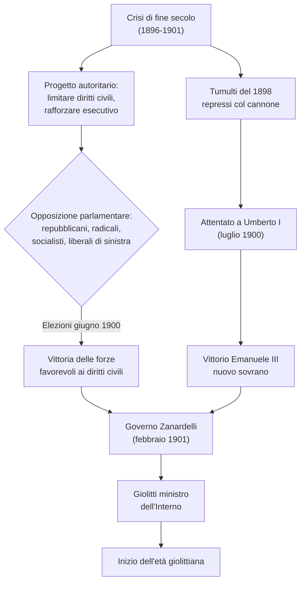
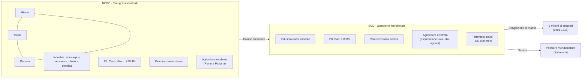
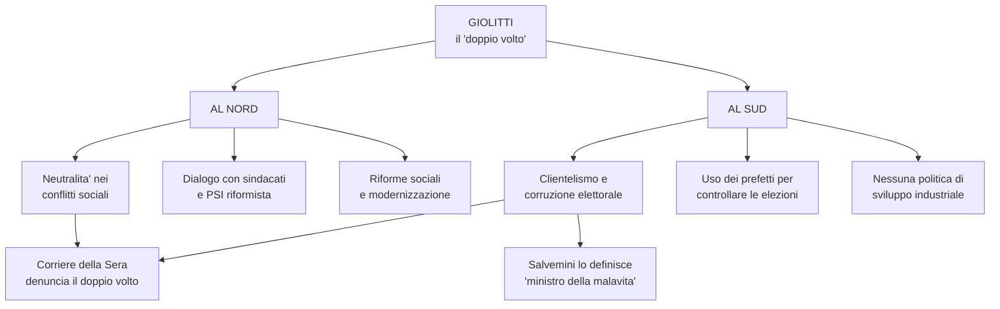
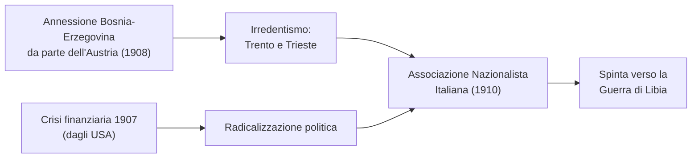
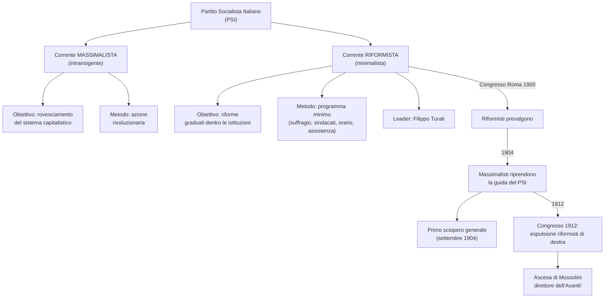
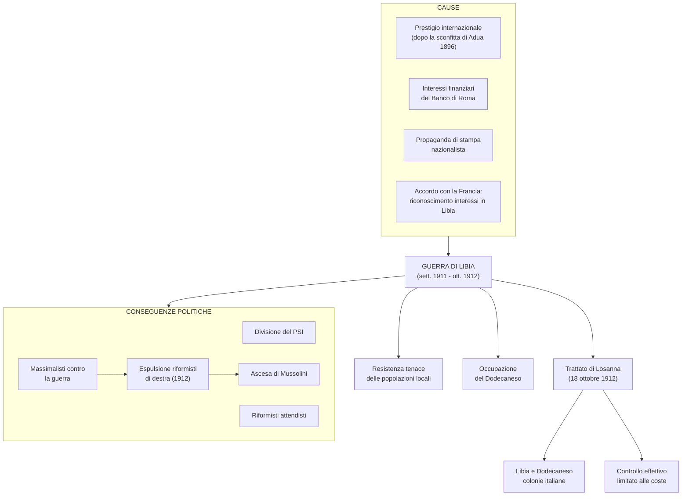
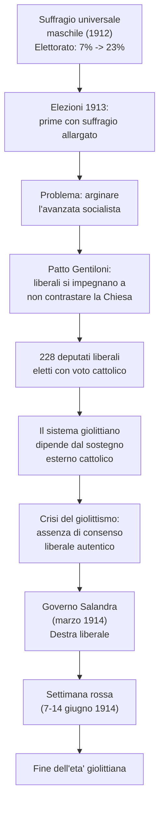
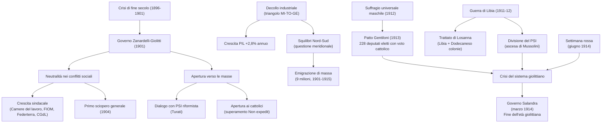
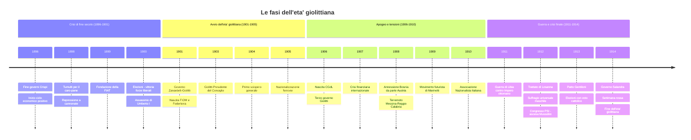
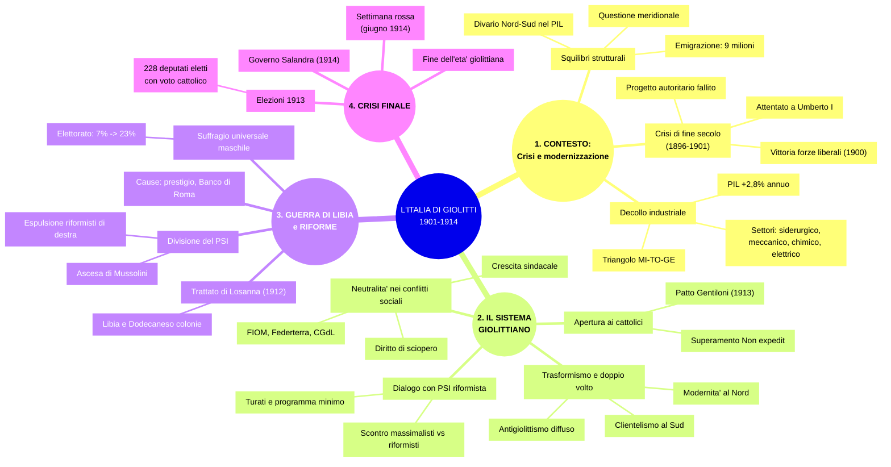

# Schema di Studio - Capitolo 3.3: L'Italia di Giolitti (Riassunto)

---

## Cronologia essenziale

| Data | Evento |
|:-----|:-------|
| **1896** | Fine dei governi Crispi; inizio del ciclo positivo dell'economia mondiale |
| **Maggio 1898** | Tumulti popolari per il caro-pane, repressi a colpi di cannone |
| **1899** | Fondazione della FIAT (Giovanni Agnelli) |
| **Giugno 1900** | Elezioni: vittoria delle forze favorevoli alla difesa dei diritti civili |
| **29 luglio 1900** | Assassinio di re Umberto I da parte dell'anarchico Gaetano Bresci |
| **Febbraio 1901** | Governo Zanardelli con Giolitti ministro dell'Interno |
| **1901** | Nascita della FIOM e della Federterra |
| **1903** | Giolitti diventa Presidente del Consiglio |
| **16-21 settembre 1904** | Primo sciopero generale in Italia |
| **1905** | Nazionalizzazione delle ferrovie |
| **1906** | Nascita della Confederazione Generale del Lavoro (CGdL); Esposizione di Milano |
| **Giugno 1906 – Dicembre 1909** | Terzo governo Giolitti |
| **1907** | Crisi finanziaria internazionale (partita dagli USA) |
| **1908** | Annessione della Bosnia-Erzegovina da parte dell'Austria |
| **28 dicembre 1908** | Terremoto di Messina e Reggio Calabria (~120.000 morti) |
| **1909** | Nascita del movimento futurista (Marinetti) |
| **1910** | Fondazione dell'Associazione Nazionalista Italiana |
| **29 settembre 1911** | L'Italia dichiara guerra all'Impero ottomano (Guerra di Libia) |
| **18 ottobre 1912** | Trattato di Losanna: Libia e Dodecaneso diventano colonie italiane |
| **Giugno 1912** | Riforma elettorale: suffragio universale maschile |
| **1912** | Congresso del PSI: espulsione dei riformisti di destra; Mussolini direttore dell'«Avanti!» |
| **1913** | Patto Gentiloni; elezioni con 228 deputati liberali eletti grazie al voto cattolico |
| **Marzo 1914** | Governo Salandra (destra liberale) |
| **7-14 giugno 1914** | «Settimana rossa»: scioperi e scontri in tutta Italia |

---

## 1. La via italiana alla modernità

### Dalla crisi di fine secolo al governo Zanardelli-Giolitti

Tra il **1900** e il **1901** l'Italia chiuse la **crisi di fine secolo**, iniziata con la fine dei governi Crispi (**1896**), esplosa nel **maggio 1898** con i tumulti per il caro-pane repressi a cannonate, e proseguita con tentativi autoritari fondati su: leggi speciali per limitare i diritti civili garantiti dallo **Statuto albertino** (libertà di stampa e associazione), rafforzamento dell'esecutivo e ridimensionamento del Parlamento.

La svolta avvenne per **via istituzionale**: in Parlamento, **repubblicani, radicali, socialisti** (il PSI era nato nel **1892**) e **liberali di sinistra** guidati da **Zanardelli** e **Giolitti** fecero decadere i progetti autoritari. Alle elezioni del **giugno 1900** l'elettorato — ancora ristretto, circa il **7% della popolazione**, solo uomini — votò queste forze.

L'opzione autoritaria divenne definitivamente impraticabile anche dopo l'**attentato mortale a re Umberto I** (**29 luglio 1900**) da parte dell'anarchico **Gaetano Bresci**, che intendeva vendicare le vittime del 1898. Nel **febbraio 1901** il nuovo sovrano **Vittorio Emanuele III** affidò il governo a **Zanardelli** come Primo ministro e a **Giolitti** come ministro dell'Interno.

### La sfida giolittiana: modernizzare lo Stato liberale

Giolitti dominò la scena politica fino al **1914** (da cui l'espressione **«età giolittiana»**), tentando di adeguare lo Stato liberale alle trasformazioni dell'epoca senza abbandonarne i principi. La sfida consisteva nel far fronte al **balzo industriale**, alla **modernizzazione** e alla nascita di una **società di massa** in cui le classi popolari rivendicavano un ruolo crescente. Rispetto agli altri Paesi europei, l'Italia presentava tre criticità strutturali: una **classe dirigente ristretta** e timorosa di perdere le acquisizioni risorgimentali, un notevole **ritardo economico-sociale** e fortissimi **squilibri regionali** fra Nord e Sud.

### Crescita economica e trasformazioni sociali

La crescita avvenne sulla scia del ciclo positivo mondiale iniziato nel **1896**:

| Indicatore | Dati |
|:-----------|:-----|
| **PIL** (crescita media annua 1896-1913) | **2,8%** |
| **Industria** (tasso di crescita 1896-1907) | **6,7%** — il più elevato d'Europa |
| **Addetti all'industria** (1903 → 1911) | Da **1.275.000** a **2.304.000** |
| **Energia idroelettrica** (1898 → 1913) | Da **66 milioni kWh** a **2.000 milioni kWh** |

I quattro settori trainanti furono: **siderurgico**, **meccanico** (con l'industria automobilistica), **chimico** ed **elettrico**. Sebbene la maggior parte dell'energia provenisse ancora dal **carbone importato**, lo sfruttamento dell'energia **idroelettrica** crebbe enormemente (da 66 a 2.000 milioni di kWh in quindici anni). L'articolazione sociale si fece più complessa: cresceva la **classe operaia**, emergeva un **ceto imprenditoriale dinamico** — **Falck** (siderurgia), **Agnelli** (FIAT, **1899**), **Olivetti** (macchine per scrivere), **Pirelli** (gomma e pneumatici). Giolitti favorì inoltre l'aggiornamento delle azioni della **Pirelli**, azienda leader nel settore dei pneumatici, a sostegno dello sviluppo dell'industria automobilistica.

> **Protezionismo**: politica economica che prevede l'intervento statale per tutelare le attività produttive nazionali dalla concorrenza straniera, tramite **tariffe doganali** sulle importazioni o **dazi sulle materie prime** per scoraggiarne l'esportazione.

### Un Paese ancora rurale: Stato, banche e monopoli

Il Paese restava **prevalentemente rurale**: il peso dell'agricoltura nel PIL (1901-1910) era **doppio** rispetto all'industria. Nel decollo industriale fu cruciale l'**intervento dello Stato** tramite **politiche protezioniste** e come **committente diretto** (paradigmatica la **nazionalizzazione delle ferrovie nel 1905**). Anche il **sistema bancario** favorì la modernizzazione, ma alimentò la formazione di **cartelli** e **monopoli**.

> **Cartelli**: accordo tra più imprese indipendenti per limitare la concorrenza. — **Monopoli**: condizione di mercato in cui l'offerta di un prodotto è detenuta da una sola impresa.

### Questione meridionale e divario Nord-Sud

Lo sviluppo si concentrò nel **«triangolo industriale» Milano-Torino-Genova**, mentre al **Sud** l'industria era quasi del tutto assente. La **rete ferroviaria** passò da **6.000 km** (1870) a **18.000 km** (1914), ma con densità molto maggiore al Nord. Il risveglio dell'**agricoltura** dopo la grande depressione interessò soprattutto la **Pianura Padana**; in **Puglia** e **Sicilia** le colture d'esportazione (uva, olio, agrumi) si ripresero, ma il divario complessivo si ampliò:

| Area | Crescita del PIL (1891-1911) |
|:-----|:----------------------------|
| **Centro-Nord** | **+28,4%** |
| **Sud** | **+18,8%** |

Questa differenza di quasi dieci punti generò il filone **meridionalista**. Un duro colpo fu il **terremoto del 28 dicembre 1908** a **Messina e Reggio Calabria**: circa **80.000 morti in Sicilia** e **40.000 in Calabria**.

### Progressi sociali e analfabetismo

| Anno | Tasso di analfabetismo |
|:-----|:----------------------|
| **1881** | **67,3%** |
| **1901** | **56%** |
| **1911** | **46,2%** |

L'espansione del **sistema scolastico** e l'innalzamento dell'**obbligo scolastico fino a 12 anni** contribuirono alla riduzione dell'analfabetismo, ancora però insufficiente.

### L'emigrazione

Tra il **1901** e il **1915** oltre **9 milioni di persone** lasciarono l'Italia (media ~**600.000 l'anno**). A fine Ottocento i flussi partivano dal **Nord** verso l'**Europa**; dal Novecento le partenze più numerose venivano dalle **regioni meridionali** (Basilicata, Calabria, Campania, Sicilia) verso gli **Stati Uniti**.

| Periodo | Espatri dal Nord | Espatri dal Sud | Regione con più espatri |
|:--------|:----------------|:----------------|:------------------------|
| **1876-1900** | 3.723.672 | 1.534.239 | **Veneto** (940.711) |
| **1901-1915** | 4.621.057 | 4.148.728 | **Sicilia** (1.126.513) |

L'emigrazione funse da **valvola di sfogo** per le tensioni sociali, e le **rimesse** degli emigrati rappresentarono una voce importante nella **bilancia dei pagamenti**.

> **Bilancia dei pagamenti**: conto che registra tutte le operazioni dell'economia di un Paese verso l'esterno (capitali, import/export, trasferimenti).

---

## 2. L'età giolittiana: il «sistema» e i suoi avversari

### Il progetto di Giolitti: includere nello Stato le masse popolari

Il governo **Zanardelli** (**1901**) inaugurò un'apertura verso le classi lavoratrici, con alleanze che abbracciavano radicali, socialisti e cattolici. **Giolitti**, come ministro dell'Interno, intendeva consolidare lo Stato liberale **allargandone le basi sociali**: lo Stato doveva restare **neutrale** nei conflitti sociali, riconoscendo libertà sindacale e diritto di sciopero. Reprimere le richieste economiche avrebbe solo **radicalizzato le proteste**.

> [!note] Dalla lezione
> Il prof sottolinea la **tensione strutturale** del progetto giolittiano: ambizione di allargare il consenso alle classi popolari e **limiti** legati al bifrontismo e ai meccanismi tradizionali di potere sono due facce inscindibili dello stesso disegno politico.

### Il Partito socialista, le correnti e l'attività riformistica

Giolitti guardava soprattutto al **PSI**, diviso tra una corrente **massimalista/intransigente** (azione rivoluzionaria, rovesciamento del capitalismo) e una corrente **riformista/minimalista** guidata da **Filippo Turati** (azione gradualista nelle istituzioni). Al **congresso di Roma del 1900** i riformisti prevalsero proponendo un **«programma minimo»**: suffragio universale, libertà sindacale, riduzione dell'orario di lavoro, miglioramenti assistenziali ed educativi.

> **Municipalizzazione**: gestione di servizi pubblici (gas, elettricità, acqua, trasporti) da parte dei Comuni tramite aziende **municipalizzate**.

La russa **Anna Kuliscioff** (**1855-1925**), esponente del socialismo riformista, cercò di introdurre nel PSI le idee per l'**emancipazione femminile**, denunciando il «privilegio dell'uomo» come fenomeno ritenuto all'epoca «naturale».

### Sviluppo sindacale e primo sciopero generale

Negli anni **1903-1905** la non-repressione giolittiana portò **miglioramenti salariali** e uno sviluppo impetuoso del sindacalismo: le **Camere del lavoro** passarono da **17** (1900) a **76** (1902); nel **1901** nacquero la **FIOM** e la **Federterra**.

> **Camera del lavoro**: nate nell'ultimo decennio del XIX secolo per riunire le organizzazioni sindacali a livello territoriale, con funzioni di collocamento e mediazione nei conflitti.

Nel **1904** i massimalisti riconquistarono la guida del PSI e proclamarono il **primo sciopero generale** (**16-21 settembre 1904**). Giolitti **attese che si esaurisse da solo**, confermando la sua neutralità. Nel **1906** nacque la **CGdL**, coronamento della strutturazione del movimento operaio.

### L'apertura cattolica e i limiti del sistema giolittiano

**Papa Pio X** (pontificato **1903-1914**) consentì ai cattolici di sostenere candidati liberali dove i socialisti rischiavano di vincere, superando gradualmente il **Non expedit** del **1874** (con cui **Pio IX** aveva vietato ai cattolici la partecipazione politica dopo l'annessione di Roma).

Il governo giolittiano poggiava sulla **mediazione** parlamentare e sulla gestione delle elezioni tramite i **prefetti** a favore dei candidati ministeriali — meccanismi criticati come **clientelismo** e **corruzione**, incapaci di promuovere un moderno partito liberale di massa.

> **Trasformismo**: pratica che ricerca maggioranze parlamentari con accordi e concessioni a gruppi ideologicamente eterogenei.

### Antigiolittismo: critici, intellettuali e Futurismo

Dal **giugno 1906** al **dicembre 1909** (terzo governo Giolitti) emerse un diffuso **antigiolittismo** trasversale. Il **«Corriere della Sera»** di **Luigi Albertini** denunciava il **«doppio volto»** giolittiano: moderno al Nord, clientelare al Sud. Il torinese **«La Stampa»** di **Alfredo Frassati** attaccava Giolitti da posizione **liberale risorgimentale**. Il meridionalista **Gaetano Salvemini** lo definì **«il ministro della malavita»**.

> [!note] Dalla lezione
> La rivista satirica **«L'Asino»** raffigurò Giolitti come **figura bifronte tra Nord e Sud**, immagine iconica del «doppio volto».

Sul piano intellettuale, una reazione **antipositivista** rifiutava il pragmatismo giolittiano: riviste come **«Leonardo»**, **«Il Regno»** e **«La Voce»** esprimevano una critica radicale alla mediocrità dell'Italia liberale.

> [!note] Dalla lezione
> Il prof caratterizza Albertini, Frassati, **D'Annunzio** e **Pascoli** come **«liberali puri, risorgimentali»** che accusavano Giolitti di portare nello Stato forze **«antirisorgimentali»** (socialisti e cattolici).

Nel **1909** nacque il **movimento futurista** di **Filippo Tommaso Marinetti** (*Manifesto del Futurismo*): esaltazione della **modernità**, della **velocità** e della **guerra** («sola igiene del mondo»), in una miscela di avanguardia artistica e nazionalismo aggressivo.

### La crisi del 1907 e l'irredentismo

Nel **1907** una **crisi finanziaria** partita dagli **USA** arrestò lo sviluppo e radicalizzò le posizioni politiche. L'**annessione della Bosnia-Erzegovina** da parte dell'**Austria** (**1908**) rianimò l'**irredentismo** e il **nazionalismo**: nel **1910** nacque l'**Associazione Nazionalista Italiana**.

> **Irredentismo**: movimento che reclamava le **«terre irredente»** (soprattutto **Trento** e **Trieste**), ritenute italiane per ragioni geografiche e culturali ma ancora sotto l'Austria.

---

## 3. La Guerra di Libia e l'allargamento del suffragio

### La Guerra di Libia (settembre 1911 – ottobre 1912)

Dopo il trauma della **sconfitta di Adua** (**1896**), la politica coloniale era un segno di prestigio. L'Italia si era riavvicinata alla **Francia**, ottenendo il riconoscimento degli interessi in **Libia** (**Tripolitania** e **Cirenaica**). La campagna bellicista fu alimentata dal **Banco di Roma** (interessi finanziari in Libia) e da un'intensa **propaganda di stampa**.

Il **29 settembre 1911** l'Italia dichiarò guerra all'**Impero ottomano**. L'invasione incontrò una **tenace resistenza locale** e l'Italia occupò anche il **Dodecaneso** nel **Mar Egeo**. Il **18 ottobre 1912** il **trattato di Losanna** sancì che **Libia e Dodecaneso** divenivano colonie italiane, ma il **controllo effettivo** restò **limitato alle zone costiere**. Si verificarono anche **esecuzioni di militari arabo-ottomani** e **deportazioni di civili** verso le isole Tremiti, Ustica e Ponza.

### La divisione del PSI e l'ascesa di Mussolini

La guerra divise il PSI: l'**ala massimalista** si schierò **contro** (imperialismo), i **riformisti** restarono **attendisti**. Al **congresso del 1912** i massimalisti **espulsero i riformisti di destra** (**Bissolati**, **Bonomi**). In questo contesto emerse **Benito Mussolini**, che divenne **direttore dell'«Avanti!»**.

> [!note] Dalla lezione
> Il prof inquadra Mussolini come **prodotto diretto della frattura interna del PSI**: appartenente alla corrente rivoluzionaria-massimalista, la sua ascesa è collegata a una lacerazione strutturale presente fin dall'inizio, non solo al congresso del 1912.

### L'allargamento del suffragio (giugno 1912)

Giolitti varò due riforme fondamentali: il **monopolio statale delle assicurazioni sulla vita** con la nascita dell'**INA**, e soprattutto il **suffragio universale maschile** — voto a **tutti i maschi dai 30 anni**, oppure **dai 21 anni** se alfabeti o reduci dal servizio militare. Gli elettori passarono dal **7%** a oltre il **23% della popolazione**.

---

## 4. La crisi del giolittismo

### Elezioni 1913, patto Gentiloni e fine dell'età giolittiana

Le elezioni del **1913** — le prime con suffragio allargato — consacrarono i cattolici come forza decisiva. Il **patto Gentiloni** (dal conte **Vincenzo Ottorino Gentiloni**, presidente dell'**Unione elettorale cattolica**) impegnò i candidati liberali a **non sostenere leggi contrarie al magistero della Chiesa** (divorzio, istruzione religiosa). Risultato: **228 deputati liberali** eletti grazie al **voto cattolico** — il sistema giolittiano dipendeva da un sostegno esterno, non da un autentico consenso liberale.

Nel **marzo 1914** Giolitti lasciò il governo ad **Antonio Salandra** (**destra liberale**). Nel **giugno 1914** la repressione di una **manifestazione antimilitarista ad Ancona** scatenò la **«settimana rossa»** (**7-14 giugno**): la CGdL proclamò lo sciopero generale, scioperi e scontri investirono tutta l'Italia. Il sistema giolittiano mostrava tutti i suoi limiti di fronte a una **società di massa** sempre più complessa e conflittuale.

---

## Sintesi: la politica giolittiana

| Obiettivo | Strumenti e azioni |
|:----------|:-------------------|
| **Integrazione politica e sociale delle masse** | Suffragio universale maschile (1912); obbligo scolastico fino a 12 anni |
| **Intervento dello Stato nell'economia** | Nazionalizzazione delle ferrovie (1905); politiche protezioniste; INA |
| **Neutralità nei conflitti sul lavoro** | Libero corso alle proteste; riconoscimento del diritto di sciopero; miglioramenti salariali |
| **«Trasformismo politico»** | Dialogo con il PSI (corrente riformista di Turati) e con i cattolici (patto Gentiloni) |
| **Ripresa della politica coloniale** | Guerra di Libia (1911-12); occupazione del Dodecaneso |

---

## Il giudizio degli storici sull'età giolittiana

**Massimo L. Salvadori** (1936-) vede in Giolitti un **grande statista** che seppe evocare prosperità parlamentare e proteggere il Nord evoluto, a scapito del Sud agrario. **Gaetano Salvemini**, meridionalista, lo definì **«ministro della malavita»** per i metodi elettorali spregiudicati nel Meridione. **Alberto Aquarone** (1930-1985) sostiene una tesi intermedia: le riforme furono una **«saggia amministrazione ordinaria»** che non riuscì a innescare un vero **cambiamento strutturale**. **Emilio Gentile** (1946-) offre la lettura più critica: la politica giolittiana favorì inconsapevolmente il **decadimento dell'autorità dello Stato**, aprendo la strada al **fascismo**.

---

## Diagramma: cause ed effetti dell'età giolittiana

---

## Timeline dell'età giolittiana (1896-1914)

---

## Mappa concettuale complessiva del capitolo

