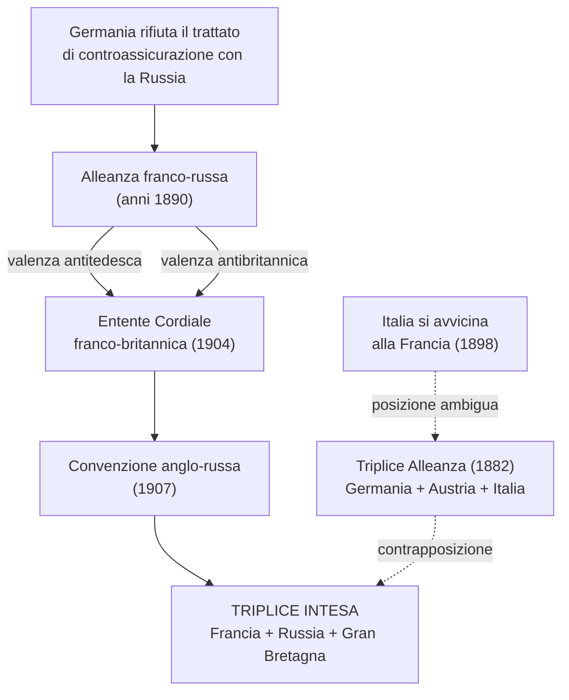
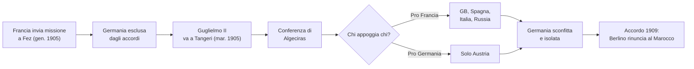
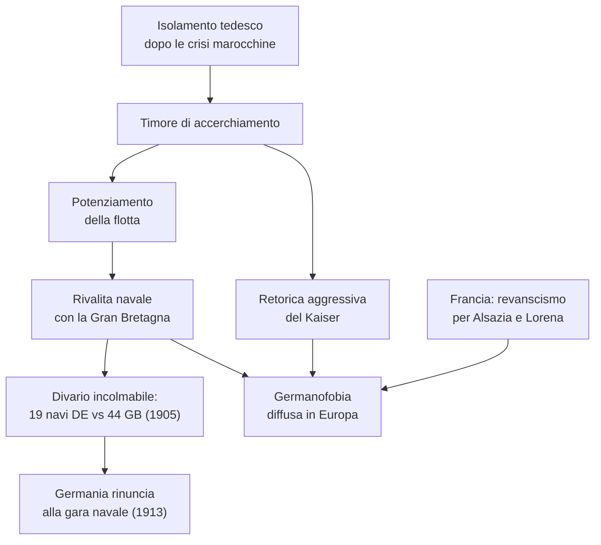
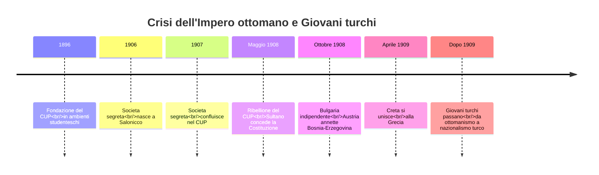
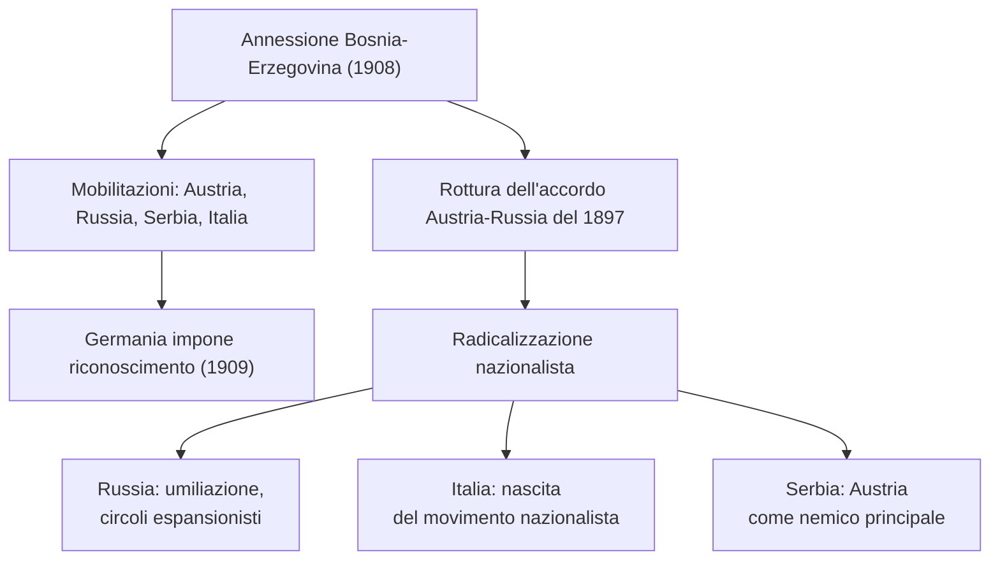
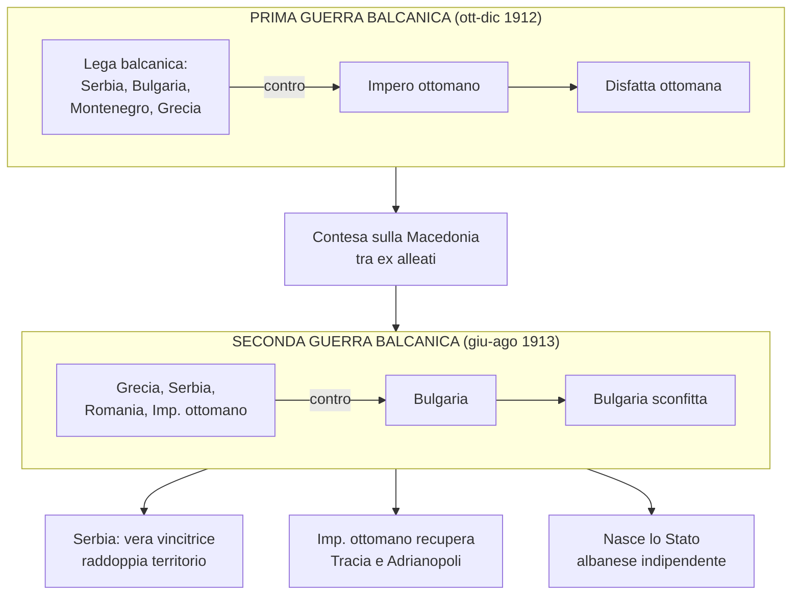
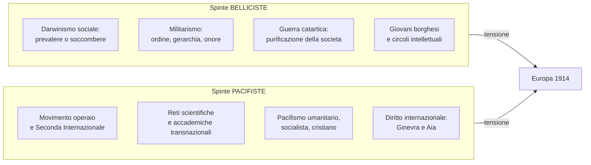
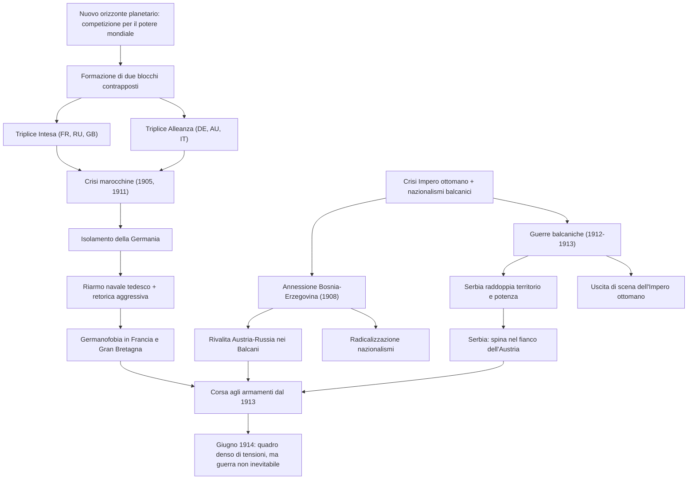
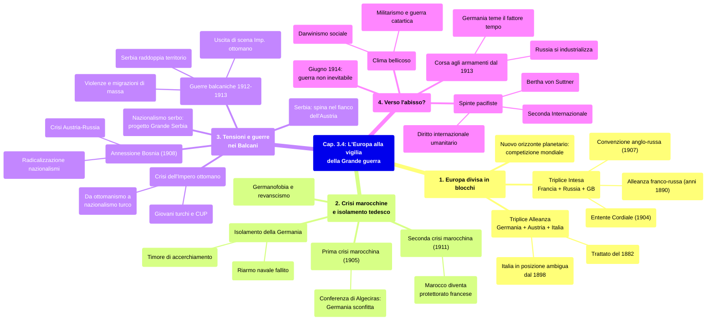

# Ripasso Veloce - Cap. 3.4: L'Europa alla vigilia della Grande guerra

---

## Date fondamentali

| Anno | Evento |
|------|--------|
| **1870** | Francia perde **Alsazia e Lorena** nella guerra franco-prussiana |
| **1882** | **Triplice Alleanza** (Germania, Austria-Ungheria, Italia) |
| **1904** | ***Entente Cordiale*** franco-britannica |
| **1907** | **Convenzione anglo-russa** → nasce la **Triplice Intesa** |
| **1908** | Giovani turchi ottengono Costituzione; Austria annette **Bosnia-Erzegovina**; Bulgaria indipendente |
| **1911** | **Seconda crisi marocchina**; guerra italo-turca in Libia |
| **1912** | **Prima guerra balcanica**: Lega balcanica vs Impero ottomano |
| **1913** | **Seconda guerra balcanica**: Serbia raddoppia il territorio; Germania rinuncia alla gara navale |

---

## 1. L'Europa divisa in blocchi

Tra fine '800 e inizio '900 la competizione tra potenze diventa **mondiale**: non più equilibrio europeo, ma **potere planetario** con logica di scontro finale.

Due blocchi si formano in un quindicennio:
- **Triplice Intesa** (Francia, Russia, Gran Bretagna): alleanza franco-russa (anni 1890) + *Entente Cordiale* (1904) + convenzione anglo-russa (1907)
- **Triplice Alleanza** (Germania, Austria-Ungheria, Italia): trattato 1882, ma l'Italia si avvicina alla Francia dal 1898

**Aree di tensione** nel 1914: Alsazia-Lorena, Trentino-Trieste, Bosnia, Transilvania, Macedonia, Bosforo.

---

## 2. Crisi marocchine e isolamento tedesco

### Prima crisi marocchina (1905)
- Francia invia missione a Fez col consenso di GB, Italia → Germania esclusa
- Guglielmo II va a Tangeri per sfidare Parigi
- **Conferenza di Algeciras**: Germania isolata (solo Vienna la appoggia), sconfitta diplomatica

### Seconda crisi marocchina (1911)
- Francia invia truppe a Fez; incrociatore tedesco ad Agadir
- Esito: Marocco diventa **protettorato francese**, Germania riceve territori nel Congo

### Isolamento e questione navale
- Germania teme **accerchiamento**, reagisce con retorica aggressiva
- Francia: **revanscismo** per Alsazia-Lorena; GB: Reich come minaccia navale
- Riarmo navale tedesco fallimentare (19 navi DE vs 44 GB nel 1905) → rinuncia nel 1913

---

## 3. Tensioni e guerre nei Balcani

### Nazionalismo serbo
La Serbia aspirava a una **"grande Serbia"** estesa su territori con forte presenza slava. Programma destabilizzante: i serbi erano minoranza in Bosnia, Voivodina, Croazia, Kosovo, Macedonia.

### Giovani turchi e crisi dell'Impero ottomano
- **1896**: nasce il **CUP** (Comitato unione e progresso) → militanti detti "Giovani turchi"
- Duplice natura: formazione occidentale-liberale + sentimento antieuropeo
- **Maggio 1908**: ribellione del CUP, sultano concede la Costituzione
- Le potenze ne approfittano: Bulgaria indipendente (5 ott.), Austria annette Bosnia (6 ott.)
- Ideologia passa da **ottomanismo** (Stato inclusivo) a **nazionalismo turco**

### Annessione della Bosnia (1908) - Conseguenze
- Crisi diplomatica risolta solo con la Grande guerra
- 1909: Germania impone a Russia e Serbia di riconoscere l'annessione
- Rottura dell'accordo Austria-Russia del 1897
- **Radicalizzazione nazionalista** in Russia, Italia e Serbia

### Guerre balcaniche
- **Guerra in Libia** (1911-12): conferma che le potenze non proteggono più l'Impero ottomano
- **Prima guerra balcanica** (ott-dic 1912): Lega balcanica (Serbia, Bulgaria, Montenegro, Grecia) sconfigge l'Impero ottomano
- **Seconda guerra balcanica** (giu-ago 1913): Grecia, Serbia, Romania e Imp. ottomano contro Bulgaria → Bulgaria sconfitta
- **Serbia vera vincitrice**: raddoppia superficie e popolazione
- Nasce lo **Stato albanese** (Valona nov. 1912, sancito maggio 1913)

### Conseguenze
- Violenze sui civili (massacri in Macedonia), ~330.000 musulmani in fuga verso l'Impero ottomano
- Prima convenzione internazionale per **scambio di popolazione** (Adrianopoli, 1913)
- Russia si avvicina a Serbia e Romania; Bulgaria si accosta all'Austria
- Francia rafforza l'alleanza con la Russia, finanzia ferrovie strategiche anti-tedesche
- **Serbia = spina nel fianco dell'Austria**: alleata della Russia, Stato più potente dei Balcani, minaccia l'unità dell'Impero con il progetto di unire gli slavi del sud

---

## 4. Verso l'abisso?

### Corsa agli armamenti e clima bellicoso
- Dal 1913: vera **corsa agli armamenti**
- L'industrializzazione russa impensierisce Austria e Germania → idea di **guerra preventiva** (il fattore tempo è sfavorevole)
- Clima culturale pro-guerra: **darwinismo sociale**, **militarismo**, guerra come **funzione catartica**
- Queste idee diffuse tra giovani borghesi e intellettuali (in Italia: i "vociani" della rivista *La Voce*, 1908)

### Spinte pacifiste
- Internazionalismo nel movimento operaio (**Seconda Internazionale**) e in ambienti scientifici
- Tre correnti pacifiste: umanitario-borghese, socialista, cristiana
- **Bertha von Suttner** (Nobel pace 1905): disarmo e arbitrato internazionale
- **Diritto internazionale**: conferenze di Ginevra (Croce Rossa, 1864) e dell'Aia (1899, 1907)

### Guerra non inevitabile
- Dal 1871 nessuna guerra diretta tra grandi potenze (40 anni di pace)
- Dal 1815 nessuna guerra generale europea (100 anni)
- Nel giugno 1914 gli storici ritengono che la diplomazia avrebbe potuto evitare il conflitto

---

## Schema riassuntivo dei nessi

---

## Mappa concettuale

