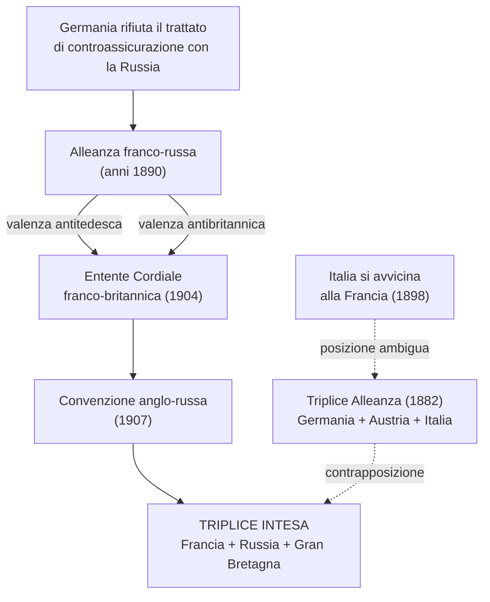
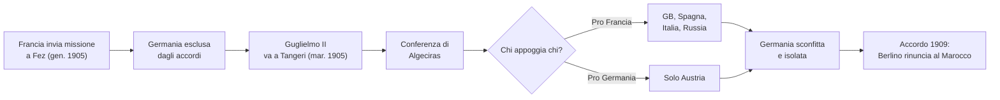
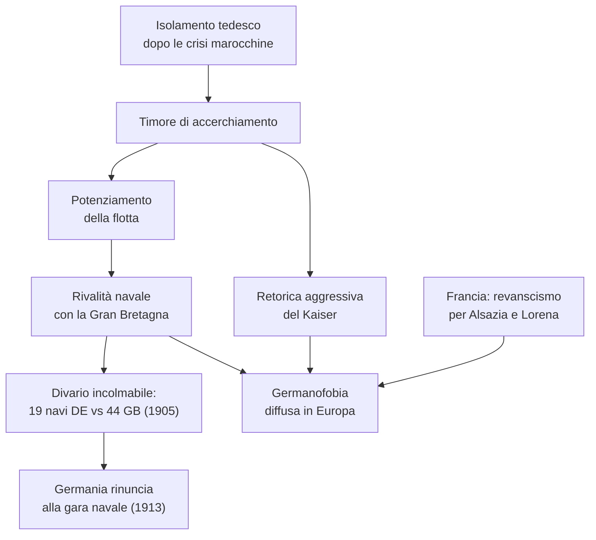
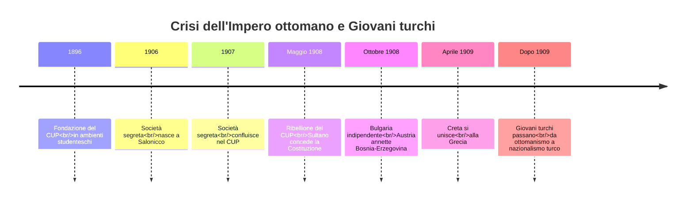
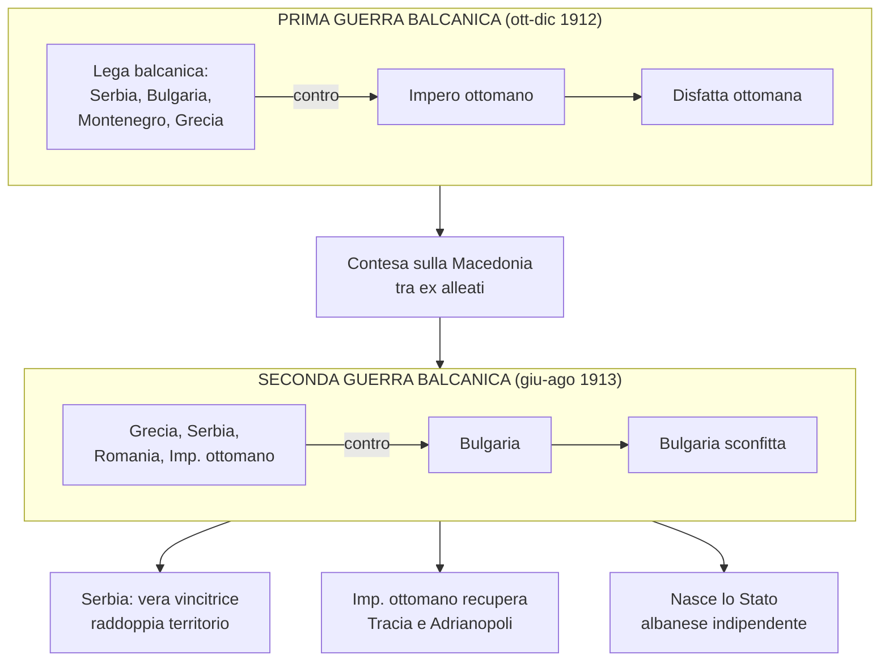
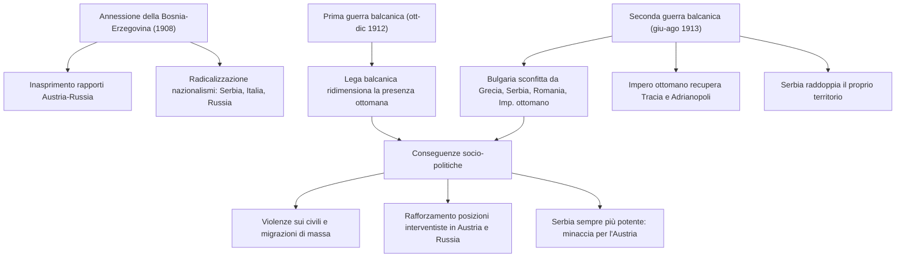
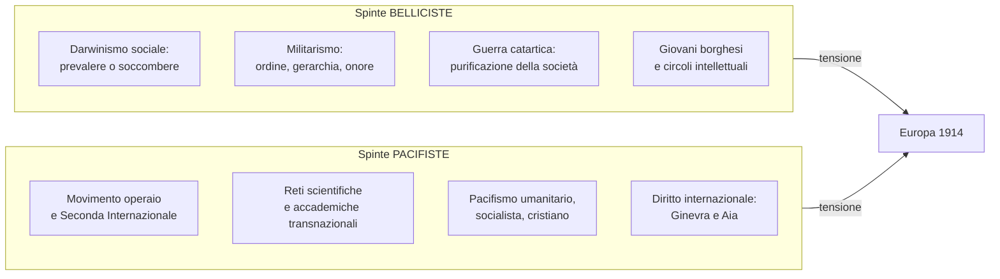
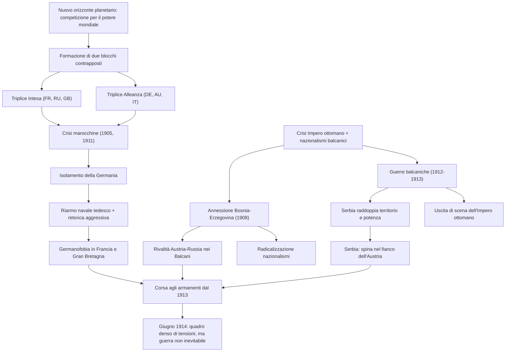
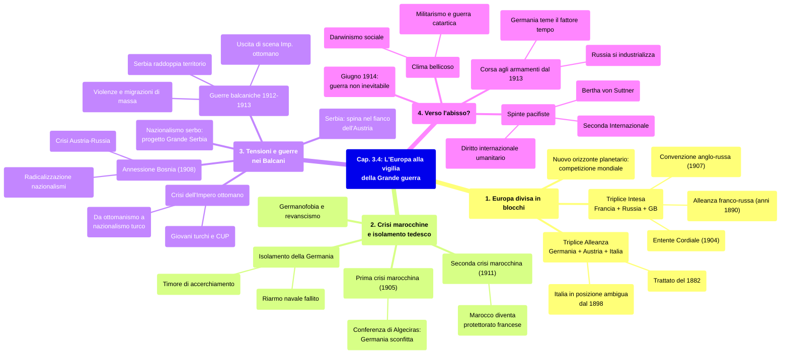

# Schema di Studio - Capitolo 3.4: L'Europa alla vigilia della Grande guerra

---

## Date fondamentali del capitolo

| Anno | Evento |
|------|--------|
| **1864** | Fondazione del Comitato internazionale della **Croce Rossa** a Ginevra |
| **1870** | Guerra franco-prussiana: la Francia perde **Alsazia e Lorena** |
| **1878** | L'Austria-Ungheria ottiene il controllo sulla **Bosnia-Erzegovina**; la Serbia si rende indipendente dall'Impero ottomano |
| **1882** | Stipula della **Triplice Alleanza** (Germania, Austria-Ungheria, Italia) |
| **1896** | Fondazione del **Comitato unione e progresso (CUP)** in ambienti studenteschi |
| **1897** | Accordo tra Austria e Russia per non modificare la carta dei Balcani |
| **1898** | L'Italia si avvicina alla Francia, distaccandosi dai partner della Triplice Alleanza |
| **1899** | Intesa franco-britannica sul Sudan; Prima conferenza dell'Aia (iniziativa di Nicola II) |
| **1904** | ***Entente Cordiale*** franco-britannica |
| **1905** | **Prima crisi marocchina**; premio Nobel per la pace a Bertha von Suttner |
| **1906** | Nasce a Salonicco la società segreta che confluirà nel CUP |
| **1907** | **Convenzione anglo-russa** sull'Asia centrale; Seconda conferenza dell'Aia; la società segreta di Salonicco confluisce nel CUP |
| **1908** | Ribellione del CUP a Salonicco e in Macedonia; il sultano concede la **Costituzione**; la Bulgaria si dichiara indipendente (5 ottobre); l'Austria annette la **Bosnia-Erzegovina** (6 ottobre) |
| **1909** | Atene annuncia l'**unione di Creta alla Grecia** (aprile); accordo franco-tedesco in cui Berlino rinuncia al Marocco; la Germania impone a Russia e Serbia di riconoscere l'annessione della Bosnia |
| **1911** | **Seconda crisi marocchina**; guerra italo-turca in Libia (1911-12) |
| **1912** | **Prima guerra balcanica** (ottobre-dicembre); proclamazione dello Stato albanese indipendente a Valona (novembre) |
| **1913** | **Seconda guerra balcanica** (giugno-agosto); convenzione bulgaro-ottomana sullo scambio di popolazione ad Adrianopoli; il comando navale tedesco rinuncia alla gara per il riarmo navale con il Regno Unito; indipendenza albanese sancita dal trattato di pace (maggio) |
| **1914** | Giugno: la guerra globale **non appare inevitabile**, ma il quadro è denso di tensioni |

---

## 1. L'Europa divisa in blocchi

### 1.1 Un nuovo orizzonte planetario

Tra la fine dell'Ottocento e l'inizio del Novecento, le dinamiche tra le grandi potenze si spostarono da un contesto puramente europeo a un contesto **mondiale**. L'obiettivo dello scontro imperialista non era più semplicemente esercitare un ruolo nell'equilibrio continentale, ma conquistare il **potere mondiale**: il pianeta intero era diventato l'arena in cui si riteneva si decidessero le sorti di un Paese e la sua stessa sopravvivenza come soggetto geopolitico.

In parallelo, al vecchio principio dell'**equilibrio tra le potenze** si era sostituita una logica nuova e più pericolosa, che presupponeva uno **scontro finale** destinato a comportare l'eliminazione di uno dei competitori. Questo cambiamento di mentalità fu decisivo nel preparare il terreno alla Grande guerra.

### 1.2 La formazione dei due blocchi di alleanze

In circa un quindicennio, il nuovo orizzonte planetario ridisegnò lo scenario europeo attorno a **due blocchi di alleanze** contrapposti.

**L'alleanza franco-russa e il suo doppio significato.** Nei primi anni Novanta dell'Ottocento, il rifiuto della Germania di rinnovare il trattato di controassicurazione con la Russia portò all'**alleanza franco-russa**. Questo accordo aveva un doppio valore: in prospettiva eurocentrica era chiaramente **antitedesco**, ma sul piano internazionale assumeva anche una valenza **antibritannica**, poiché la Francia (in Africa) e la Russia (in Asia) erano i principali concorrenti dell'imperialismo britannico.

**L'avvicinamento anglo-franco-russo.** Tuttavia, mentre la Germania contava relativamente poco a livello planetario, Londra era sempre più sensibile agli **obiettivi imperiali su scala globale**. Maturò così un avvicinamento tra britannici, francesi e russi, che si realizzò attraverso due tappe fondamentali:

- L'***Entente Cordiale*** (**1904**): una nuova intesa franco-britannica stipulata in ambito coloniale (dopo quella del 1899 sul Sudan). La Francia riconosceva il controllo britannico sull'**Egitto**, mentre Londra appoggiava gli interessi francesi in **Marocco**.
- La **convenzione anglo-russa del 1907**: regolò i contenziosi in **Asia centrale** tra i due imperi.

Entrambi gli accordi avevano una forte valenza **antitedesca**, perché andavano contro le mire della Germania sul Marocco e sulla Persia. Ma soprattutto, determinarono la nascita di un polo europeo costituito da **Francia, Russia e Gran Bretagna**: la compagine dei tre Paesi era legata da tre accordi (i due recenti e la precedente alleanza franco-russa) e venne perciò denominata **Triplice Intesa**.

### 1.3 La Triplice Alleanza e la posizione ambigua dell'Italia

La Triplice Intesa si contrapponeva alla **Triplice Alleanza**, formata da **Germania, Impero austro-ungarico e Italia**, unite da un trattato stipulato nel **1882** e poi regolarmente rinnovato. Tuttavia, sin dal **1898** l'Italia si era avvicinata alla Francia, distaccandosi sempre più dai suoi partner ufficiali. La posizione italiana all'interno dell'Alleanza era dunque sempre più ambigua e instabile.

### 1.4 L'Europa nel 1914: il quadro delle alleanze

Nel **1914** le potenze europee erano schierate su due fronti opposti:

| Blocco | Membri | Origine |
|--------|--------|---------|
| **Triplice Intesa** | Francia, Russia, Gran Bretagna | *Entente Cordiale* (1904) + convenzione anglo-russa (1907) + alleanza franco-russa |
| **Triplice Alleanza** | Germania, Impero austro-ungarico, Italia | Trattato del 1882, rinnovato periodicamente |

Le **aree di tensione** principali nel 1914 erano: **Alsazia e Lorena** (tra Francia e Germania), **Trentino e Trieste** (tra Italia e Austria), **Bosnia** (Sarajevo), **Transilvania**, **Macedonia** e il **Bosforo**.

---

## 2. Le crisi marocchine e l'isolamento tedesco

### 2.1 La prima crisi marocchina (1905)

In un quadro di crescente rivalità tra i due blocchi, alcune tensioni relative a **questioni extraeuropee** acquisirono i connotati di un confronto diretto tra le alleanze. L'epicentro di due crisi internazionali fu il **Regno del Marocco**, sul quale sia la Francia sia la Germania ambivano a esercitare la propria influenza.

Nel **gennaio 1905** Parigi inviò una missione diplomatica a **Fez** per rafforzare il controllo sul Paese, indebolito da una grave **crisi finanziaria** e da una serie di **rivolte interne** contro il sultano. La Francia si muoveva con il consenso del **Regno Unito** e l'appoggio dell'**Italia** (che in cambio vedeva riconosciuti i diritti sulla **Libia**). Solo la **Germania** era stata esclusa da questi accordi.

Nel **marzo 1905** il *Kaiser* **Guglielmo II** si recò personalmente a **Tangeri**, esprimendo di fatto il suo sostegno al sovrano del Marocco che resisteva alle pressioni francesi, e sfidando apertamente Parigi. Il gesto del Kaiser condusse alla convocazione di una **conferenza internazionale ad Algeciras** (Spagna), dove la Germania -- che chiedeva un controllo internazionale sul Marocco ed era appoggiata solo da **Vienna** -- fu sconfitta dalla convergenza di **Gran Bretagna, Spagna, Italia e Russia** a sostegno degli interessi francesi.

Nel **febbraio 1909** fu stipulato un **accordo tra Germania e Francia**: Berlino rinunciava a ogni azione politica in Marocco.

### 2.2 La seconda crisi marocchina (1911)

Nell'**aprile 1911** la Francia inviò un contingente militare a **Fez** per reprimere un'insurrezione contro il sultano. L'azione militare provocò la reazione degli **spagnoli** -- che da metà Ottocento occupavano una striscia costiera sul Mediterraneo e sull'Atlantico -- i quali schierarono le loro truppe. Contemporaneamente, un **incrociatore tedesco** gettò le ancore al largo di **Agadir**, sulle coste marocchine, in un atto di chiara provocazione.

Il conflitto fu evitato grazie a un nuovo **accordo franco-tedesco** raggiunto nel **novembre 1911**: il **Marocco** diventava un **protettorato francese**, mentre la Germania riceveva in compenso alcuni **territori nel Congo francese**.

### 2.3 L'isolamento della Germania e la questione navale

Le due crisi avevano messo in evidenza l'**isolamento della Germania** sulla scena internazionale. I gruppi dirigenti tedeschi temevano un **accerchiamento** e le loro iniziative politiche cominciarono a essere dettate dal senso di esclusione dalla competizione per il potere mondiale, accompagnate dai discorsi pubblici in cui l'imperatore sfoggiava una **retorica aggressiva**.

**Le posizioni germanofobe in Francia e Gran Bretagna.** A Parigi e a Londra prevalevano nel frattempo posizioni apertamente anti-tedesche:

- In **Francia**: un diffuso sentimento **revanscista** (da *revanche*, "rivincita") mirava a riconquistare **Alsazia e Lorena**, perse con la sconfitta di **Sedan** nella guerra franco-prussiana del **1870**.
- In **Gran Bretagna**: l'Impero tedesco era percepito come un pericolo per la stabilità generale e per l'egemonia britannica sui mari.

**Il riarmo navale tedesco.** Per dare credibilità alla sua ambizione di svolgere una politica mondiale, la Germania aveva **potenziato la flotta**. Benché tale piano avesse un'evidente valenza antibritannica, esso costituì una minaccia solo relativa per la Gran Bretagna, che a sua volta stava elaborando una strategia navale globale. I numeri parlano chiaro:

| Periodo | Navi tedesche | Navi britanniche |
|---------|---------------|------------------|
| **1898** | 16 | 29 |
| **1905** | 19 | 44 |

Il divario si allargò a favore dei britannici. Nel **1913** il comando navale tedesco rinunciò formalmente alla **gara per il riarmo navale** con il Regno Unito.

---

## 3. Tensioni e guerre nei Balcani

### 3.1 Il nazionalismo serbo e il tessuto etnico balcanico

In Europa, le maggiori tensioni si concentrarono nei **Balcani**, dove cresceva l'**agitazione nazionalista**. In Serbia si era rafforzato il nazionalismo più radicale, ispirato alla visione di una **"grande Serbia"** estesa su un territorio vastissimo, corrispondente agli attuali territori della Serbia e dell'Albania, alla maggior parte della Macedonia e alla Grecia centrale e settentrionale. L'obiettivo era l'**unificazione di tutti i serbi** in un unico Stato: il principale manifesto patriottico recitava **"là dove un serbo dimora, quella è la Serbia"**.

Si trattava di un programma profondamente **destabilizzante** in un'area dal **tessuto etnico estremamente variegato** come i Balcani, dove non erano poche le regioni in cui i serbi costituivano una minoranza -- dalla **Bosnia** alla **Voivodina** ungherese, dalla **Croazia** al **Kosovo** alla **Macedonia**. Inoltre, altri Stati già formati come la **Grecia** e la **Bulgaria** (quest'ultima ancora tributaria dell'Impero ottomano) potevano avanzare pretese su basi irredentistiche.

### 3.2 La crisi dell'Impero ottomano e i Giovani turchi

La situazione nei Balcani era aggravata dalla **crisi dell'Impero ottomano**. Alla fine dell'Ottocento erano sorti alcuni movimenti di opposizione alla modernizzazione voluta dal sultano **Abdulhamit II**. Nel **1896**, in ambienti studenteschi, fu costituito il **Comitato unione e progresso (CUP)**, che ebbe una sua voce nel giornale ***"Le Jeune Turquie"***, fondato da alcuni suoi esponenti in esilio a Parigi. Da questa pubblicazione derivò l'appellativo **"Giovani turchi"** con il quale fu denominato il movimento.

Nel **1907** confluì nel CUP una **società segreta** nata l'anno prima a **Salonicco**, centro urbano dinamico e cosmopolita. I suoi militanti erano **funzionari civili** e soprattutto **giovani ufficiali dell'esercito** -- tra cui **Mustafa Kemal**, futuro fondatore della Repubblica di Turchia -- tutti musulmani turchi provenienti dalla borghesia istruita.

I Giovani turchi presentavano una **duplice natura** apparentemente contraddittoria: da un lato, formatisi in scuole occidentali, esprimevano una visione del mondo ispirata al **positivismo** e alla **cultura politica liberale**; dall'altro incarnavano un **movimento politicamente antieuropeo**, poiché intendeva reagire alle interferenze delle potenze occidentali nella vita dello Stato ottomano.

### 3.3 Il 1908: l'apice della crisi ottomana

Nel **maggio 1908**, una **ribellione** avviata dal CUP a Salonicco e in Macedonia obbligò il sultano a concedere la **Costituzione**, che i Giovani turchi ritenevano lo strumento per salvare l'impero e avviarlo al progresso. Le potenze europee e balcaniche approfittarono immediatamente di questa crisi interna:

- **5 ottobre 1908**: la **Bulgaria** si dichiarò **indipendente**.
- **6 ottobre 1908**: l'Impero austro-ungarico proclamò l'**annessione della Bosnia-Erzegovina**, su cui esercitava il controllo sin dal 1878.
- **Aprile 1909**: Atene annunciò l'**unione di Creta alla Grecia**.

Le conseguenze furono profonde, sia all'interno dell'impero sia sullo scenario balcanico ed europeo. A Istanbul iniziò un periodo di **turbolenza politica** e l'ideologia dei Giovani turchi si trasformò radicalmente: la loro visione dell'identità dell'impero -- inizialmente vicina all'**ottomanismo**, cioè all'idea di uno Stato moderno che desse cittadinanza a tutte le componenti storiche (musulmani e non musulmani, comprese le minoranze etniche) -- passò a comprendere soltanto l'**elemento turco**. Il nazionalismo turco avrebbe conosciuto ulteriori e tragiche evoluzioni dopo il 1913.

### 3.4 I risvolti diplomatici dell'annessione della Bosnia-Erzegovina

Sul piano internazionale, fu soprattutto l'annessione della Bosnia-Erzegovina da parte di Vienna a innescare una **crisi diplomatico-politica** che si concluse solo allo scoppio della Prima guerra mondiale.

All'annessione fecero seguito **mobilitazioni e contromobilitazioni** nell'Impero asburgico, nell'Impero zarista (rivale di Vienna nella conquista dell'egemonia sui Balcani) e in Serbia (timorosa dell'Austria e sostenuta dalla Russia). Anche il governo **italiano**, sensibile alle mosse austriache nei Balcani e nelle regioni adriatiche, mostrò il suo malcontento e richiese un **compenso**. La crisi fu arginata nel **1909**, quando la **Germania** impose a Russia e Serbia di riconoscere l'annessione.

Al contempo, però, si riaccese la **competizione tra Vienna e San Pietroburgo nei Balcani**: l'Austria aveva rotto l'**accordo siglato con la Russia nel 1897**, in cui i due imperi si erano impegnati a non modificare la carta della regione.

Le conseguenze della crisi bosniaca furono molteplici e gravi:

- Aumentò la **diffidenza di Vienna nei confronti di Roma**.
- Rivelò l'inesorabile **contrapposizione nei Balcani tra il blocco austro-tedesco e la Russia** (con la sua alleata Francia).
- Provocò una **radicalizzazione delle posizioni nazionaliste** in diversi Paesi:
  - In **Russia**, dove la crisi divenne emblema di un'umiliazione -- inflitta dall'Austria con il sostegno tedesco -- che non si sarebbe dovuta ripetere, e dove acquisirono rilevanza i circoli che consideravano i Balcani uno spazio di espansione.
  - In **Italia**, dove sorse un movimento politico nazionalista.
  - In **Serbia**, dove i nazionalisti assunsero l'Impero asburgico come principale avversario, coinvolgendo la popolazione nelle rivendicazioni irredentiste.

### 3.5 L'Impero ottomano abbandonato da Londra

La conflittualità nei Balcani fu ulteriormente favorita dalla **guerra in Libia** (1911-12), che inferse un'umiliazione alla **Sublime Porta** e confermò che le potenze europee non erano più interessate a mantenere in vita l'impero, definito ormai da un secolo il **"grande malato d'Europa"**.

Il caso più significativo fu quello della **Gran Bretagna**: una volta stabilito il controllo sull'**Egitto** (e quindi sul **canale di Suez**) e siglata la convenzione con la Russia per l'Asia centrale nel 1907, Londra non aveva più interesse a sostenere l'Impero ottomano affinché questo contenesse la Russia nel **Mar Nero** e vigilasse sulle vie di terra verso l'**India**. Veniva meno così l'ultimo grande protettore internazionale dell'impero.

### 3.6 La Prima guerra balcanica (1912)

Sulla scia del colpo inferto dall'Italia all'Impero ottomano, **Serbia, Bulgaria, Montenegro e Grecia** formarono una **Lega balcanica**, sostenuta dalla Russia, con l'obiettivo di espellere definitivamente gli ottomani dai Balcani.

Nell'**ottobre 1912** la Lega balcanica diede inizio alla guerra. Le operazioni militari furono rapide e devastanti per l'Impero ottomano:

- I **bulgari** arrivarono a **trenta chilometri da Istanbul**.
- I **serbi** avanzarono insieme ai **montenegrini** in **Macedonia** e in **Albania settentrionale**.
- I **greci** puntarono alla conquista di **Salonicco**.

Già in **dicembre** la Prima guerra balcanica era finita, con un armistizio che sanciva la **disfatta degli ottomani**, la cui presenza nei Balcani si era ridotta a tre città sotto assedio: **Adrianopoli** in Tracia, **Scutari** in Albania e **Giannina** in Epiro.

### 3.7 La Seconda guerra balcanica (1913)

Le mire degli alleati della Lega erano però in conflitto tra loro, in particolare nel caso della **Macedonia**, contesa da Bulgaria, Serbia e Grecia. Così, dopo la firma del trattato di pace nel **maggio 1913**, già a **giugno** scoppiava un'altra guerra. Questa volta le alleanze si riconfigurarono completamente: **Grecia, Serbia, Romania e Impero ottomano** si unirono **contro la Bulgaria**, che finì travolta.

Il conflitto si concluse in **agosto**: **Sofia** dovette cedere gran parte di quanto conquistato nel primo conflitto, mentre l'**Impero ottomano** riprese la **Tracia orientale** con la città di **Adrianopoli**.

La **vera vincitrice** dei conflitti fu la **Serbia**, che conseguì i maggiori benefici territoriali, quasi **raddoppiando superficie e popolazione**. Belgrado tentò inoltre di assicurarsi uno sbocco sull'**Adriatico**, ma le fu impedito dalla nascita di uno **Stato albanese indipendente**, proclamato da un'Assemblea nazionale a **Valona** nel **novembre 1912** e sancito -- con l'appoggio di **Vienna e Roma** -- nel **maggio 1913** dal trattato che aveva messo fine alla Prima guerra balcanica.

### 3.8 Le conseguenze dei conflitti balcanici

Gli Stati balcanici uscirono prostrati dai due conflitti, anche a causa della **violenza sterminatrice** che li caratterizzò. Alle migliaia di soldati vittime delle azioni belliche si aggiunsero le violenze praticate dalle truppe sui **civili**: stupri, massacri e saccheggi, in particolare in **Macedonia**, dove l'esercito serbo si distinse per le atrocità commesse nei confronti dei bulgari.

Tali violenze provocarono **migrazioni di massa** tra i vari Stati balcanici e un **esodo di quasi 330.000 musulmani balcanici** verso il territorio ottomano, tra il 1912 e il 1915. Nel **1913**, ad Adrianopoli, Bulgaria e Impero ottomano firmarono la **prima convenzione internazionale** che prevedeva uno **scambio di popolazione**: quasi **50.000 musulmani** avrebbero dovuto lasciare la Bulgaria, mentre un numero quasi analogo di **cristiani bulgari** sarebbe stato costretto ad abbandonare i territori ottomani.

### 3.9 L'impatto geopolitico delle guerre balcaniche

Le guerre contribuirono ulteriormente a deteriorare i **rapporti tra Austria e Russia**. In entrambi i Paesi cresceva il ruolo degli **apparati militari** nei processi decisionali, mentre politici influenti sposavano le posizioni dei rispettivi **"partiti della guerra"**.

La **Russia**, che aveva appoggiato la coalizione antibulgara nella Seconda guerra balcanica, si era ancor più avvicinata alla **Serbia** e allacciava nuovi rapporti con la **Romania**, mentre la **Bulgaria** si era accostata all'Impero austro-ungarico. Si delineava così un nuovo sistema di alleanze regionali che rispecchiava la divisione tra i due grandi blocchi europei.

Anche il carattere dell'**alleanza franco-russa** fu modificato dalle crisi balcaniche. La politica estera francese si era fatta più aggressiva con la seconda crisi marocchina e la crescita dei sentimenti antitedeschi. In occasione delle guerre balcaniche, la Francia **rafforzò l'alleanza con la Russia**: contemplò la possibilità di intervenire al suo fianco nel conflitto e **supportò finanziariamente** la costruzione di **linee ferroviarie strategiche** nell'Impero russo, funzionali a dirigere rapidamente le truppe contro la Germania in caso di guerra.

### 3.10 La Serbia, spina nel fianco dell'Austria

Nel nuovo scenario balcanico, la Serbia diventava una terribile **spina nel fianco** per l'Impero austro-ungarico, per diversi motivi convergenti:

- La sua **alleanza con San Pietroburgo** avvantaggiava l'Impero russo, poiché Vienna non disponeva di un alleato altrettanto insidioso nei confronti della Russia.
- Era diventata lo **Stato più potente dei Balcani** e la sua ambizione di unire gli **slavi del sud** sotto la sua egemonia minacciava direttamente la stabilità dell'Impero austro-ungarico, che comprendeva minoranze **serbe, slovene e croate**.
- Gli ambienti militari di **Belgrado** sostenevano le **associazioni irredentiste** nei territori asburgici.

La **crescita dei nazionalismi** nei Balcani scuoteva profondamente il multietnico Impero asburgico, per il quale il confine tra **politica interna e politica estera** diventava sempre più labile: le scelte diplomatiche si ripercuotevano sugli equilibri interni tra le nazionalità, e le scelte relative alla gestione delle nazionalità avevano conseguenze sulla politica internazionale.

Infine, la sostanziale **uscita di scena dell'Impero ottomano** dall'area balcanica metteva a repentaglio la stessa **identità dell'Impero austro-ungarico**, che storicamente aveva rivestito il ruolo di **baluardo cristiano** dell'Europa meridionale. Con la scomparsa del "nemico" ottomano, il senso stesso dell'esistenza dell'Impero asburgico veniva messo in discussione.

---

## 4. Verso l'abisso?

### 4.1 La corsa agli armamenti

I fenomeni e i processi verificatisi in Europa tra il **1908** e il **1914** provocarono un **accumulo di tensioni**, una maggiore aggressività nelle politiche dei diversi Paesi e una **crescita di conflittualità** generalizzata. Tutto ciò fu accompagnato da un **incremento delle spese militari** volto al potenziamento di eserciti e apparati bellici, che dal **1913** divenne una vera e propria **corsa agli armamenti**.

L'imponente programma di preparazione bellica avviato dall'**Impero russo** e i segnali di dinamismo provenienti dalla sua economia -- in fase di iniziale **industrializzazione** -- impressionavano gli osservatori e impensierivano i gruppi dirigenti austriaci e tedeschi. In **Germania** i comandi militari ritenevano addirittura che nel giro di pochi anni la forza militare della Russia sarebbe stata tale da rendere inutili i piani strategici messi a punto. Poiché il **fattore tempo** era considerato sfavorevole, si riteneva che la soluzione alle esigenze del *Reich* fosse una **guerra preventiva**. Gli austro-ungarici condividevano la stessa opinione.

### 4.2 Un clima bellicoso nelle società europee

Al di là delle scelte di politici e militari, esisteva un **clima culturale propizio alla guerra**. L'Europa era attraversata da correnti di pensiero che proponevano un nazionalismo sempre più intransigente ed esprimevano un sentimento di **attesa della guerra**.

Il conflitto era un elemento chiave della visione del mondo improntata al **darwinismo sociale**: prevalere sugli altri era considerato necessario per non soccombere. Il **militarismo** riportava la società ai principi tradizionali di **ordine, gerarchia, onore**. In quest'ottica, la guerra aveva una funzione **catartica**, cioè di purificazione e rigenerazione delle società europee, ritenute corrotte dalla modernizzazione e dalla democratizzazione dilagante.

Queste posizioni ebbero fortuna soprattutto tra le **giovani generazioni borghesi** e i **circoli intellettuali**: ambienti minoritari ma influenti, in grado di determinare il clima della società. In Italia, tra gli intellettuali che alimentarono queste tendenze bellicose, ci furono i cosiddetti **"vociani"**, animatori della rivista ***"La Voce"***, fondata nel **1908** da **Giuseppe Prezzolini**. Tra i vociani vi erano gli scrittori **Piero Jahier** (1884-1966) e **Scipio Slataper** (1888-1915), che nel 1915 sostennero l'intervento dell'Italia in guerra.

### 4.3 Le spinte internazionaliste e pacifiste

Esistevano però anche sensibilità molto diverse da quelle belliciste. Tra fine Ottocento e inizio Novecento si era diffuso un **sentimento internazionalista**, non solo nell'ambito del **movimento operaio** -- dove era attiva la **Seconda Internazionale** (l'organizzazione che riuniva i partiti socialisti di tutto il mondo) -- ma anche in ambienti **scientifici, accademici, giuridici e culturali**, dove associazioni e congressi avevano favorito la nascita di **reti transnazionali** e la maturazione di una cultura universalista.

L'intensificazione delle connessioni planetarie e gli sviluppi tecnologici avevano fatto sì che nuovi incontri e istituzioni collaborassero a **unificare il mondo**: c'erano state conferenze per organizzare la **misura del tempo**, altre per determinare **standard universali** per misure di lunghezza e massa. Era lo sforzo di trovare un **linguaggio universale unificante**.

Si erano sviluppati un pensiero e un **movimento pacifista** che si articolava in tre correnti principali:

- Di stampo **umanitario e borghese**.
- Sorto nel **mondo socialista** (legato alla Seconda Internazionale).
- Di **tradizione cristiana**, sia cattolica sia protestante.

> **Bertha von Suttner** (1843-1914), insignita del **premio Nobel per la pace nel 1905**, fu una delle voci più autorevoli del pacifismo. Nel 1909 sostenne che i pacifisti dovevano continuare a chiedere il **disarmo** come unica strada per scongiurare la guerra e dar vita a istituzioni di **arbitrato internazionale**. Secondo la von Suttner, gli armamenti stessi contenevano il pericolo della guerra, perché nutrivano il sospetto e l'inimicizia, e alla fine avrebbero inevitabilmente portato alla rovina tutti gli Stati.

### 4.4 Le origini del diritto internazionale umanitario

Tra i due secoli iniziò anche a essere codificato il **diritto internazionale convenzionale**, cioè fondato su accordi sottoscritti dagli Stati. Il processo si sviluppò attraverso due filoni paralleli:

**Le conferenze di Ginevra.** Due conferenze a Ginevra elaborarono convenzioni sul trattamento di malati e feriti di guerra, dando origine al **diritto internazionale umanitario**:

- Nel **1864**: fu fondato il Comitato internazionale della **Croce Rossa**.
- Nel **1906**: furono aggiornate le convenzioni sulla protezione dei feriti.

**Le conferenze dell'Aia.** Due conferenze internazionali -- convocate all'**Aia** su iniziativa dello zar **Nicola II** nel **1899** e nel **1907** -- adottarono diverse convenzioni, sottoscritte da quasi tutti gli Stati, che regolavano la conduzione della **guerra di terra e di mare** con l'obiettivo di bandire comportamenti particolarmente inumani.

### 4.5 Una guerra non inevitabile

Era dal **1871** che in Europa due grandi potenze non combattevano direttamente: **quarant'anni di relativa pace** alimentavano l'opinione che il corso della storia procedesse verso una stagione di **pace permanente**. Del resto, i segnali erano ambivalenti: per quanto forti fossero le pressioni dei comandi militari e dei ministeri della Guerra, le politiche estere dei governi non erano appiattite su posizioni belliciste. La **diplomazia** conservava ancora margini per la distensione o la ridefinizione delle alleanze.

Nel **giugno 1914** il futuro era incerto e una guerra globale **non appariva inevitabile**, sebbene il quadro fosse denso di tensioni. Gli storici sono oggi propensi a ritenere che, grazie alla complessa rete diplomatica esistente tra gli Stati europei, questi ultimi sarebbero stati in grado di evitare lo scoppio della guerra, se ne avessero avuto la volontà.

---

## Concetti chiave e definizioni

> **Imperialismo**: fenomeno per cui le potenze europee costruirono vasti imperi coloniali tra fine Ottocento e inizio Novecento, distinguendosi dalle ondate espansionistiche dell'età moderna.

> ***Entente Cordiale*** ("Intesa cordiale"): accordo franco-britannico del 1904 in ambito coloniale. La Francia riconosceva il controllo britannico sull'Egitto; Londra appoggiava gli interessi francesi in Marocco.

> **Triplice Intesa**: blocco di alleanze formato da Francia, Russia e Gran Bretagna, nato dalla convergenza dell'alleanza franco-russa, dell'*Entente Cordiale* (1904) e della convenzione anglo-russa (1907).

> **Triplice Alleanza**: blocco formato da Germania, Impero austro-ungarico e Italia, nato dal trattato del 1882 e rinnovato periodicamente.

> **Revanscismo** (da *revanche*, "rivincita"): sentimento diffuso in Francia che mirava alla riconquista di Alsazia e Lorena, perse con la guerra franco-prussiana del 1870.

> **Germanofobia**: atteggiamento ostile verso la Germania, diffuso sia in Francia (legato al revanscismo) sia in Gran Bretagna (dove il Reich era percepito come una minaccia).

> **Giovani turchi**: movimento politico nato dal Comitato unione e progresso (CUP, 1896), formato da funzionari e ufficiali dell'esercito ottomano. Inizialmente liberale e ottomanista, evolse poi verso un nazionalismo esclusivamente turco.

> **Ottomanismo**: idea di uno Stato moderno che desse cittadinanza a tutte le componenti storiche dell'impero (musulmani e non musulmani, comprese le minoranze etniche).

> **Darwinismo sociale**: visione del mondo che applicava i principi della selezione naturale alle società umane, giustificando la competizione e il conflitto tra nazioni.

> **Funzione catartica della guerra**: idea secondo cui la guerra avrebbe purificato e rigenerato le società europee, corrotte dalla modernizzazione e dalla democratizzazione.

> **Sublime Porta**: denominazione tradizionale del governo dell'Impero ottomano.

> **"Grande malato d'Europa"**: espressione usata da circa un secolo per definire l'Impero ottomano in declino.

> **Diritto internazionale umanitario**: corpo di norme convenzionali elaborate tra Ginevra e l'Aia per regolamentare il trattamento dei feriti di guerra e la conduzione delle ostilità.

---

## Schema riassuntivo dei nessi causa-effetto

---

## Mappa concettuale dell'intero capitolo

