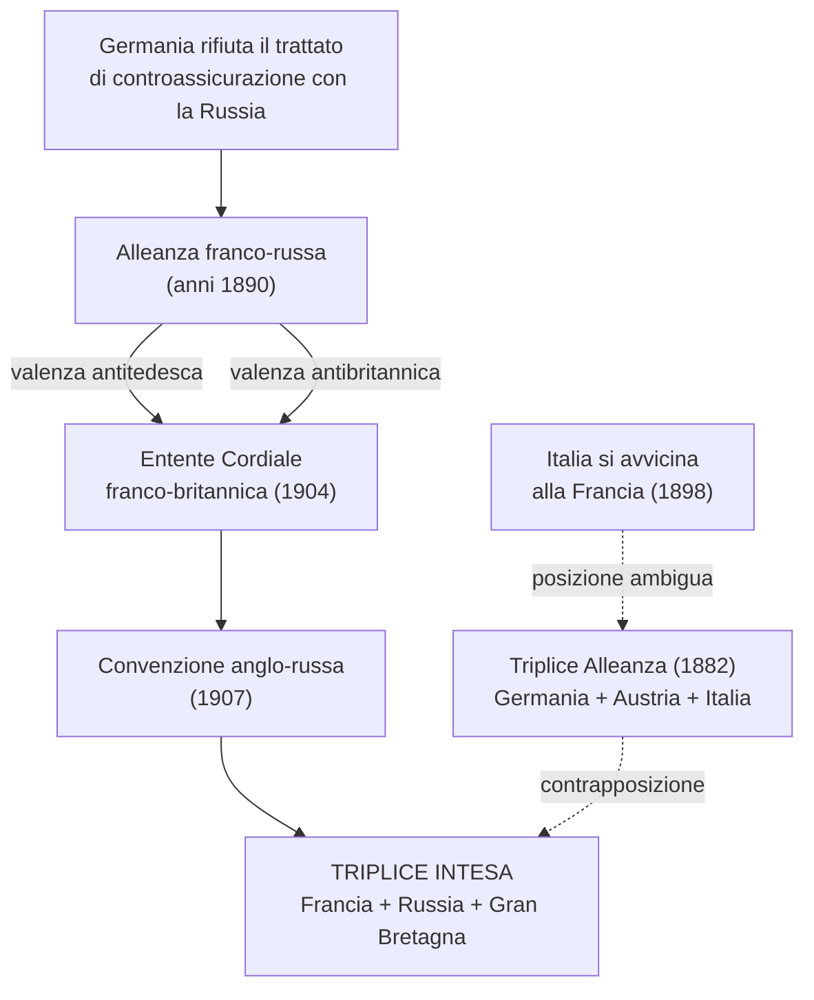
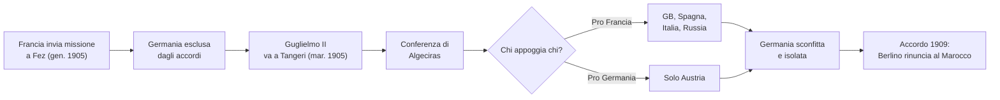
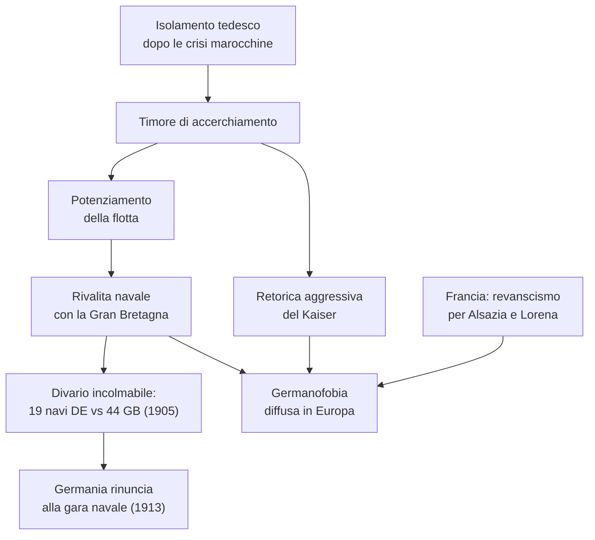
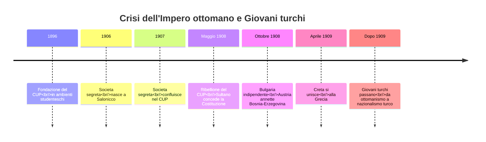
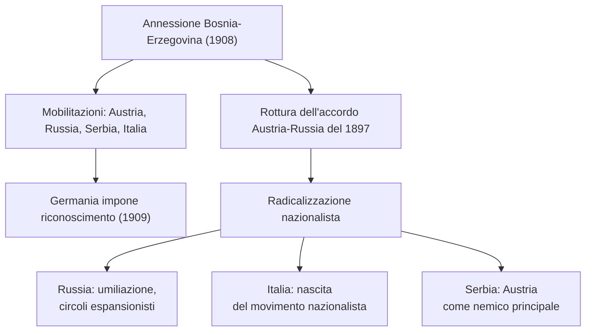
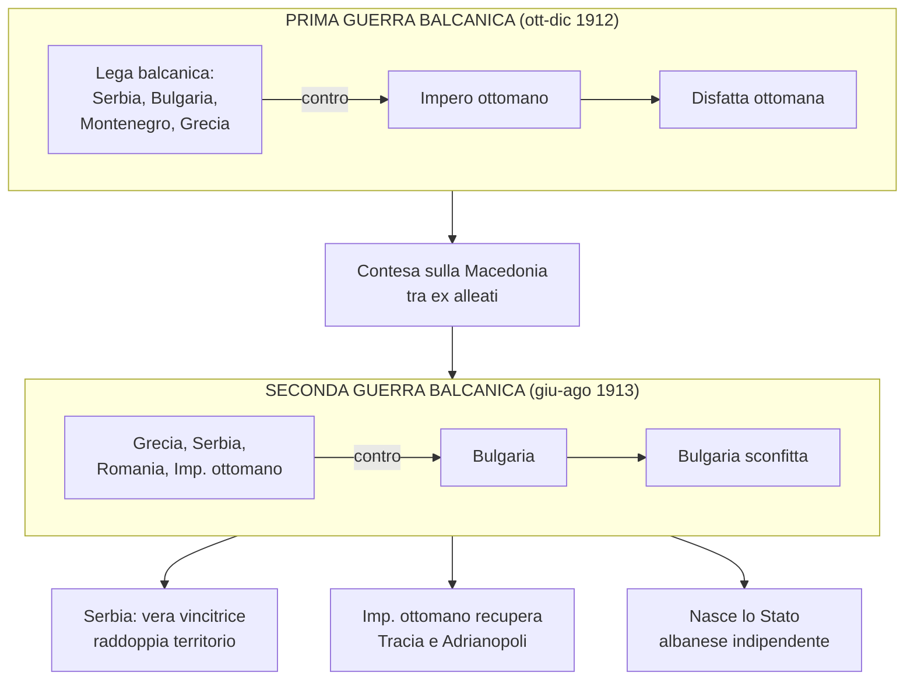
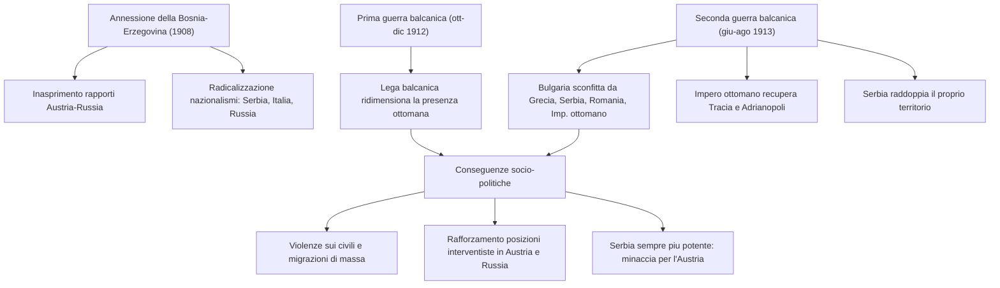
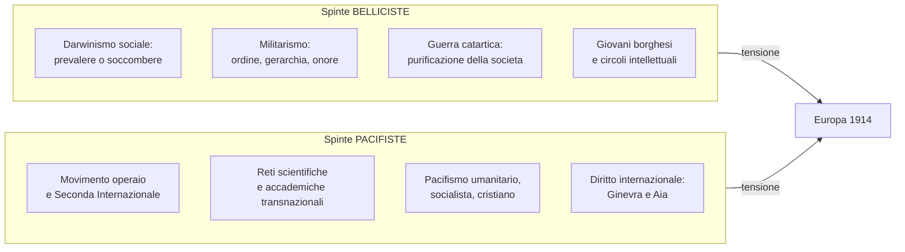
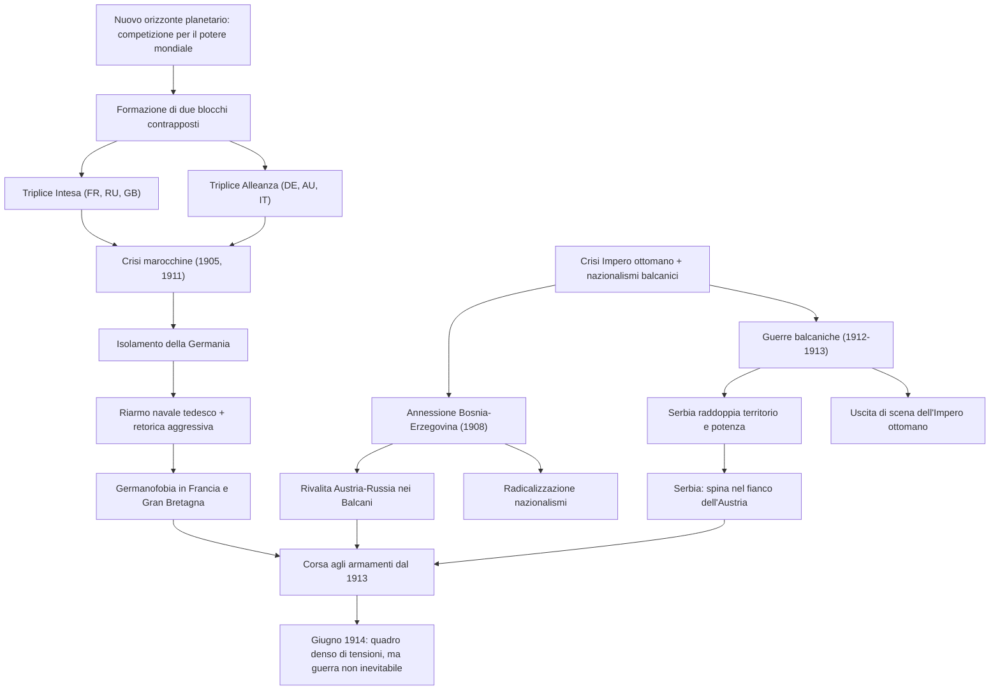
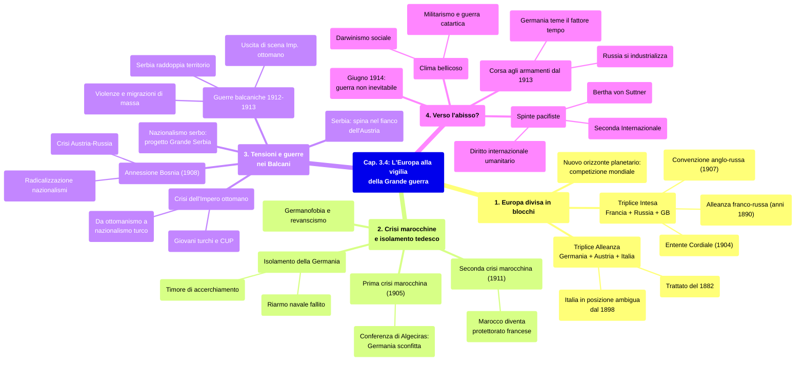

# Schema di Studio - Capitolo 3.4: L'Europa alla vigilia della Grande guerra

> [!note] Dalla lezione
> Il professore rifiuta il termine "cause della Prima guerra mondiale" come **terminologicamente scorretto**: in storia non esistono rapporti di causa-effetto lineari come in fisica. Le rivalità geopolitiche e le crisi diplomatiche si **rinforzano circolarmente**, e il capitolo va letto tenendo presente questa circolarità.

---

## Date fondamentali del capitolo

| Anno | Evento |
|------|--------|
| **1864** | Fondazione del Comitato internazionale della **Croce Rossa** a Ginevra |
| **1870** | Guerra franco-prussiana: la Francia perde **Alsazia e Lorena** |
| **1878** | L'Austria-Ungheria ottiene il controllo sulla **Bosnia-Erzegovina**; la Serbia si rende indipendente dall'Impero ottomano |
| **1882** | Stipula della **Triplice Alleanza** (Germania, Austria-Ungheria, Italia) |
| **1896** | Fondazione del **Comitato unione e progresso (CUP)** in ambienti studenteschi |
| **1897** | Accordo tra Austria e Russia per non modificare la carta dei Balcani |
| **1898** | L'Italia si avvicina alla Francia, distaccandosi dai partner della Triplice Alleanza |
| **1899** | Intesa franco-britannica sul Sudan; Prima conferenza dell'Aia (iniziativa di Nicola II) |
| **1904** | ***Entente Cordiale*** franco-britannica |
| **1905** | **Prima crisi marocchina**; premio Nobel per la pace a Bertha von Suttner |
| **1906** | Nasce a Salonicco la società segreta che confluirà nel CUP |
| **1907** | **Convenzione anglo-russa** sull'Asia centrale; Seconda conferenza dell'Aia; la società segreta di Salonicco confluisce nel CUP |
| **1908** | Ribellione del CUP a Salonicco e in Macedonia; il sultano concede la **Costituzione**; la Bulgaria si dichiara indipendente (5 ottobre); l'Austria annette la **Bosnia-Erzegovina** (6 ottobre) |
| **1909** | Atene annuncia l'**unione di Creta alla Grecia** (aprile); accordo franco-tedesco in cui Berlino rinuncia al Marocco; la Germania impone a Russia e Serbia di riconoscere l'annessione della Bosnia |
| **1911** | **Seconda crisi marocchina**; guerra italo-turca in Libia (1911-12) |
| **1912** | **Prima guerra balcanica** (ottobre-dicembre); proclamazione dello Stato albanese indipendente a Valona (novembre) |
| **1913** | **Seconda guerra balcanica** (giugno-agosto); convenzione bulgaro-ottomana sullo scambio di popolazione ad Adrianopoli; il comando navale tedesco rinuncia alla gara per il riarmo navale con il Regno Unito; indipendenza albanese sancita dal trattato di pace (maggio) |
| **1914** | Giugno: la guerra globale **non appare inevitabile**, ma il quadro è denso di tensioni |

---

## 1. L'Europa divisa in blocchi

### Nuovo orizzonte planetario e formazione dei due blocchi

Tra fine Ottocento e inizio Novecento le dinamiche tra grandi potenze si spostarono dal contesto europeo a quello **mondiale**: l'obiettivo non era più l'equilibrio continentale, ma il **potere mondiale**. Al vecchio principio dell'equilibrio si sostituì una logica di **scontro finale** con eliminazione di uno dei competitori — un cambiamento di mentalità decisivo nel preparare il terreno alla Grande guerra.

In un quindicennio, questo nuovo orizzonte ridisegnò lo scenario europeo attorno a **due blocchi di alleanze**. Il rifiuto tedesco di rinnovare il trattato di controassicurazione con la Russia portò all'**alleanza franco-russa** (anni 1890), con un doppio valore: **antitedesco** in prospettiva eurocentrica e **antibritannico** sul piano globale, poiché Francia (Africa) e Russia (Asia) erano i principali rivali dell'imperialismo britannico. Tuttavia, mentre la Germania contava poco a livello planetario, Londra era sempre più attenta agli **obiettivi imperiali su scala globale**, e maturò un avvicinamento con francesi e russi attraverso due tappe:

- L'***Entente Cordiale*** (**1904**): la Francia riconosceva il controllo britannico sull'**Egitto**, Londra appoggiava gli interessi francesi in **Marocco**.
- La **convenzione anglo-russa del 1907**: regolò i contenziosi in **Asia centrale**.

Entrambi gli accordi avevano valenza **antitedesca** (contro le mire tedesche su Marocco e Persia) e determinarono la nascita della **Triplice Intesa** (Francia, Russia, Gran Bretagna).

### La Triplice Alleanza e il quadro del 1914

La Triplice Intesa si contrapponeva alla **Triplice Alleanza** (**Germania, Impero austro-ungarico, Italia**, trattato del **1882**), ma dal **1898** l'Italia si era avvicinata alla Francia, rendendo la sua posizione sempre più ambigua.

| Blocco | Membri | Origine |
|--------|--------|---------|
| **Triplice Intesa** | Francia, Russia, Gran Bretagna | *Entente Cordiale* (1904) + convenzione anglo-russa (1907) + alleanza franco-russa |
| **Triplice Alleanza** | Germania, Impero austro-ungarico, Italia | Trattato del 1882, rinnovato periodicamente |

Le **aree di tensione** principali nel 1914: **Alsazia e Lorena** (Francia-Germania), **Trentino e Trieste** (Italia-Austria), **Bosnia** (Sarajevo), **Transilvania**, **Macedonia**, **Bosforo**.

---

## 2. Le crisi marocchine e l'isolamento tedesco

### La prima crisi marocchina (1905)

Nel **gennaio 1905** Parigi inviò una missione a **Fez** per rafforzare il controllo sul Marocco, indebolito da crisi finanziaria e rivolte interne, con il consenso di **Regno Unito** e **Italia** (che vedeva riconosciuti i diritti sulla **Libia**). Solo la **Germania** era esclusa. Nel **marzo 1905** il *Kaiser* **Guglielmo II** si recò a **Tangeri** sfidando Parigi. Alla **conferenza di Algeciras** la Germania — appoggiata solo da **Vienna** — fu sconfitta dalla convergenza di **Gran Bretagna, Spagna, Italia e Russia** a sostegno francese. Nel **febbraio 1909** un accordo sancì la rinuncia di Berlino a ogni azione politica in Marocco.

### La seconda crisi marocchina (1911)

Nell'**aprile 1911** la Francia inviò truppe a **Fez** per reprimere un'insurrezione. Gli **spagnoli** (che da metà Ottocento occupavano una striscia costiera) schierarono le loro truppe, e un **incrociatore tedesco** gettò le ancore ad **Agadir** in atto provocatorio. Il conflitto fu evitato con un accordo (**novembre 1911**): il **Marocco** diventò **protettorato francese**, la Germania ricevette **territori nel Congo francese**.

### Isolamento tedesco e questione navale

Le crisi evidenziarono l'**isolamento della Germania**. I dirigenti tedeschi temevano un **accerchiamento** e reagivano con **retorica aggressiva**. In **Francia** il sentimento **revanscista** mirava a riconquistare **Alsazia e Lorena** (perse a **Sedan**, **1870**); in **Gran Bretagna** il Reich era percepito come minaccia all'egemonia sui mari.

Per la sua ambizione mondiale, la Germania aveva **potenziato la flotta**, ma il divario con Londra restò incolmabile:

| Periodo | Navi tedesche | Navi britanniche |
|---------|---------------|------------------|
| **1898** | 16 | 29 |
| **1905** | 19 | 44 |

Nel **1913** il comando navale tedesco rinunciò alla **gara per il riarmo navale**.

---

## 3. Tensioni e guerre nei Balcani

### Nazionalismo serbo e tessuto etnico balcanico

Le maggiori tensioni europee si concentrarono nei **Balcani**. In Serbia il nazionalismo radicale aspirava a una **"grande Serbia"** estesa sui territori attuali di Serbia e Albania, gran parte della Macedonia e Grecia centro-settentrionale — il motto era **"la dove un serbo dimora, quella è la Serbia"**. Un programma profondamente **destabilizzante** in un'area dal tessuto etnico variegato: i serbi erano minoranza in **Bosnia**, **Voivodina**, **Croazia**, **Kosovo** e **Macedonia**, e altri Stati (**Grecia**, **Bulgaria**) avanzavano pretese irredentistiche.

### La crisi dell'Impero ottomano e i Giovani turchi

La situazione era aggravata dalla **crisi dell'Impero ottomano**. Nel **1896** nacque il **Comitato unione e progresso (CUP)**, il cui giornale parigino ***"Le Jeune Turquie"*** diede ai militanti il nome di **"Giovani turchi"**. Nel **1907** confluì nel CUP una **società segreta** nata a **Salonicco** nel 1906, composta da funzionari civili e giovani ufficiali — tra cui **Mustafa Kemal** — tutti musulmani turchi della borghesia istruita. I Giovani turchi avevano una **duplice natura**: formati in scuole occidentali con visione **positivista** e **liberale**, erano al contempo un movimento **antieuropeo** contro le interferenze delle potenze nella vita ottomana.

### Il 1908: apice della crisi e conseguenze

Nel **maggio 1908** una ribellione del CUP obbligò il sultano a concedere la **Costituzione**. Le potenze ne approfittarono: il **5 ottobre** la **Bulgaria** si dichiarò indipendente, il **6 ottobre** l'Austria annesse la **Bosnia-Erzegovina** (controllata dal 1878), nell'**aprile 1909** Atene annunciò l'**unione di Creta alla Grecia**. A Istanbul iniziò un periodo di turbolenza: l'ideologia dei Giovani turchi passò dall'**ottomanismo** (Stato moderno inclusivo di tutte le componenti) a un nazionalismo rivolto al solo **elemento turco**, con tragiche evoluzioni dopo il 1913.

### L'annessione della Bosnia e la crisi diplomatica

L'annessione della Bosnia-Erzegovina innescò una **crisi diplomatico-politica** risolta solo con la Grande guerra. Seguirono **mobilitazioni e contromobilitazioni** tra Impero asburgico, Impero zarista (rivale di Vienna nei Balcani) e Serbia (sostenuta dalla Russia). Anche l'**Italia** mostrò malcontento e richiese un **compenso**. Nel **1909** la **Germania** impose a Russia e Serbia di riconoscere l'annessione, ma la **competizione Vienna-San Pietroburgo** si riaccese: l'Austria aveva rotto l'**accordo del 1897** sulla carta balcanica.

Le conseguenze furono gravi: acuì la **diffidenza di Vienna verso Roma**, rivelò la **contrapposizione nei Balcani tra blocco austro-tedesco e Russia** (con la Francia), e provocò una **radicalizzazione nazionalista** — in **Russia** (umiliazione da non ripetere, espansione balcanica), in **Italia** (nascita del movimento nazionalista), in **Serbia** (l'Impero asburgico come nemico principale).

### Dall'Impero ottomano abbandonato alle guerre balcaniche

La **guerra in Libia** (1911-12) confermò che le potenze non erano più interessate a mantenere in vita il **"grande malato d'Europa"**. Il caso più significativo fu la **Gran Bretagna**: ottenuto il controllo sull'**Egitto** (canale di **Suez**) e siglata la convenzione con la Russia (1907), Londra non aveva più bisogno dell'Impero ottomano per contenere la Russia nel **Mar Nero** e proteggere le vie verso l'**India**.

Sulla scia del colpo italiano, **Serbia, Bulgaria, Montenegro e Grecia** formarono una **Lega balcanica** (sostenuta dalla Russia). Nell'**ottobre 1912** iniziò la **Prima guerra balcanica**: i **bulgari** giunsero a trenta chilometri da Istanbul, i **serbi** avanzarono con i montenegrini in Macedonia e Albania settentrionale, i **greci** puntarono a Salonicco. In **dicembre** l'armistizio sancì la **disfatta ottomana**, ridotta a tre città assediate: **Adrianopoli**, **Scutari**, **Giannina**.

Ma le mire degli alleati confliggevano, specialmente sulla **Macedonia**. Dopo il trattato di pace (**maggio 1913**), già a **giugno** scoppiò la **Seconda guerra balcanica**: **Grecia, Serbia, Romania e Impero ottomano** si unirono **contro la Bulgaria**, che fu travolta. In **agosto** Sofia cedette gran parte delle conquiste, mentre l'Impero ottomano riprese la **Tracia orientale** con **Adrianopoli**. La **vera vincitrice** fu la **Serbia**, che quasi **raddoppiò superficie e popolazione**. Belgrado tentò uno sbocco sull'**Adriatico**, ma fu bloccata dalla nascita dello **Stato albanese indipendente**, proclamato a **Valona** nel **novembre 1912** e sancito (con l'appoggio di **Vienna e Roma**) nel **maggio 1913**.

### Conseguenze e impatto geopolitico

I conflitti furono segnati da **violenza sterminatrice**: ai caduti militari si aggiunsero stupri, massacri e saccheggi sui **civili**, specie in **Macedonia** (atrocità dell'esercito serbo sui bulgari). Ne risultarono **migrazioni di massa** e un **esodo di quasi 330.000 musulmani balcanici** verso l'Impero ottomano (1912-15). Nel **1913**, ad Adrianopoli, fu firmata la **prima convenzione internazionale** per uno **scambio di popolazione**: quasi **50.000 musulmani** dalla Bulgaria e un numero analogo di **cristiani bulgari** dai territori ottomani.

Le guerre deteriorarono i **rapporti Austria-Russia**: in entrambi cresceva il peso degli **apparati militari** e dei **"partiti della guerra"**. La Russia si avvicinò alla **Serbia** e alla **Romania**, mentre la **Bulgaria** si accostò all'Austria — un nuovo sistema di alleanze regionali che rispecchiava i due blocchi europei. L'**alleanza franco-russa** si rafforzò: la Francia contemplò l'intervento al fianco russo e **finanziò linee ferroviarie strategiche** nell'Impero russo, funzionali a dirigere truppe contro la Germania.

### La Serbia, spina nel fianco dell'Austria

La Serbia diventò una terribile **spina nel fianco** per Vienna: la sua **alleanza con San Pietroburgo** avvantaggiava la Russia senza che l'Austria disponesse di un alleato altrettanto insidioso; era lo **Stato più potente dei Balcani** e la sua ambizione di unire gli **slavi del sud** minacciava un impero comprendente minoranze **serbe, slovene e croate**; i militari di **Belgrado** sostenevano le **associazioni irredentiste** nei territori asburgici.

> [!note] Dalla lezione
> Dietro l'assassinio di Francesco Ferdinando a Sarajevo c'era lo scontro tra due progetti incompatibili: il **trialismo** dell'arciduca (un terzo polo slavo con centro a **Zagabria** accanto a Vienna e Budapest) e la **Grande Serbia** (unire gli slavi del sud sotto Belgrado). Il trialismo avrebbe sottratto alla Serbia la base del suo progetto nazionale: ecco perché i servizi segreti serbi armarono Gavrilo Princip. Il contesto risale all'***Ausgleich*** del **1867**: **Francesco Giuseppe**, dopo le sconfitte in Italia e contro la Prussia, trasformò l'Impero in **Duplice Monarchia**. Francesco Ferdinando vedeva la riforma trialista come il passo successivo necessario per evitare lo sfaldamento.

La **crescita dei nazionalismi** balcanici rendeva sempre più labile il confine tra **politica interna e politica estera** dell'Impero asburgico: le scelte diplomatiche si ripercuotevano sugli equilibri interni tra nazionalità e viceversa. Inoltre, l'**uscita di scena dell'Impero ottomano** metteva in discussione l'identità stessa dell'Impero asburgico, che storicamente era **baluardo cristiano** dell'Europa meridionale.

---

## 4. Verso l'abisso?

> [!note] Dalla lezione
> Il 1914 è il punto di innesco di una **"tragedia trentennale"** (1914-1945): fascismo, nazionalsocialismo, gulag, campi di sterminio, bombe atomiche. In trent'anni l'Europa passa dall'egemonia planetaria alla subordinazione a USA e URSS. Il 1914 è la chiave interpretativa dell'intero arco.

### Corsa agli armamenti e clima bellicoso

I processi verificatisi tra **1908** e **1914** provocarono un **accumulo di tensioni** e una **crescita di conflittualità**, accompagnati da un **incremento delle spese militari** che dal **1913** divenne una vera **corsa agli armamenti**. L'imponente programma bellico dell'**Impero russo** e la sua iniziale **industrializzazione** impensierivano i dirigenti austro-tedeschi: in **Germania** i comandi militari ritenevano che nel giro di pochi anni la forza russa avrebbe reso inutili i piani strategici. Poiché il **fattore tempo** era sfavorevole, si propugnava una **guerra preventiva**; gli austro-ungarici condividevano questa opinione.

Oltre alle scelte di politici e militari, esisteva un **clima culturale propizio alla guerra**: il **darwinismo sociale** (prevalere per non soccombere), il **militarismo** (ordine, gerarchia, onore) e l'idea della guerra come funzione **catartica** di purificazione delle società europee corrotte dalla modernizzazione. Queste posizioni ebbero fortuna tra **giovani generazioni borghesi** e **circoli intellettuali**. In Italia, i **"vociani"** della rivista ***"La Voce"*** (fondata nel **1908** da **Giuseppe Prezzolini**) — tra cui **Piero Jahier** (1884-1966) e **Scipio Slataper** (1888-1915) — nel 1915 sostennero l'intervento in guerra.

### Spinte pacifiste e diritto internazionale

Esistevano anche sensibilità opposte. Un **sentimento internazionalista** si diffondeva nel **movimento operaio** (con la **Seconda Internazionale**) e in ambienti scientifici, accademici e giuridici, dove reti transnazionali e conferenze per standard universali (misura del tempo, lunghezza, massa) alimentavano una cultura universalista. Il **movimento pacifista** si articolava in tre correnti: **umanitario-borghese**, **socialista** e di **tradizione cristiana** (cattolica e protestante).

> **Bertha von Suttner** (1843-1914), **Nobel per la pace nel 1905**, sosteneva che i pacifisti dovevano chiedere il **disarmo** come unica strada per scongiurare la guerra e creare istituzioni di **arbitrato internazionale**: gli armamenti stessi nutrivano il sospetto e l'inimicizia.

Il **diritto internazionale convenzionale** si sviluppò su due filoni: le **conferenze di Ginevra** (fondazione della **Croce Rossa** nel **1864**, aggiornamento delle convenzioni nel **1906**) diedero origine al **diritto internazionale umanitario**; le **conferenze dell'Aia** (**1899** e **1907**, su iniziativa di **Nicola II**) adottarono convenzioni sulla **guerra di terra e di mare** per bandire comportamenti inumani.

### Una guerra non inevitabile

Dal **1871** due grandi potenze europee non combattevano direttamente: **quarant'anni di pace** alimentavano l'idea di una **pace permanente**. In realtà, come sottolinea il professore, dal **1815** (età napoleonica) non si era combattuta una guerra generale europea — **cento anni interi**. Le guerre intermedie (Crimea, indipendenza greca, unificazioni) erano state limitate; per questo a Vienna nessuno immaginava che punire la Serbia potesse innescare una guerra mondiale [Lezione]. Nel **giugno 1914** una guerra globale **non appariva inevitabile**: gli storici ritengono che la complessa rete diplomatica avrebbe potuto evitarla, se i governi ne avessero avuto la volontà.

---

## Concetti chiave e definizioni

> **Imperialismo**: fenomeno per cui le potenze europee costruirono vasti imperi coloniali tra fine Ottocento e inizio Novecento, distinguendosi dalle ondate espansionistiche dell'età moderna.

> ***Entente Cordiale*** ("Intesa cordiale"): accordo franco-britannico del 1904 in ambito coloniale. La Francia riconosceva il controllo britannico sull'Egitto; Londra appoggiava gli interessi francesi in Marocco.

> **Triplice Intesa**: blocco formato da Francia, Russia e Gran Bretagna (alleanza franco-russa + *Entente Cordiale* 1904 + convenzione anglo-russa 1907).

> **Triplice Alleanza**: blocco formato da Germania, Impero austro-ungarico e Italia (trattato del 1882, rinnovato periodicamente).

> **Revanscismo** (da *revanche*, "rivincita"): sentimento francese volto alla riconquista di Alsazia e Lorena, perse nella guerra franco-prussiana del 1870.

> **Germanofobia**: atteggiamento ostile verso la Germania, diffuso in Francia (revanscismo) e Gran Bretagna (Reich percepito come minaccia).

> **Giovani turchi**: movimento dal CUP (1896), formato da funzionari e ufficiali ottomani. Inizialmente liberale e ottomanista, evolse verso un nazionalismo esclusivamente turco.

> **Ottomanismo**: idea di uno Stato moderno inclusivo di tutte le componenti storiche dell'impero (musulmani e non, comprese le minoranze etniche).

> **Darwinismo sociale**: visione che applicava la selezione naturale alle società umane, giustificando competizione e conflitto tra nazioni.

> **Funzione catartica della guerra**: idea che la guerra avrebbe purificato e rigenerato le società europee, corrotte dalla modernizzazione e dalla democratizzazione.

> **Sublime Porta**: denominazione tradizionale del governo dell'Impero ottomano.

> **"Grande malato d'Europa"**: espressione usata da circa un secolo per l'Impero ottomano in declino.

> **Diritto internazionale umanitario**: norme convenzionali elaborate tra Ginevra e l'Aia per regolamentare il trattamento dei feriti e la conduzione delle ostilità.

---

## Schema riassuntivo dei nessi causa-effetto

---

## Mappa concettuale dell'intero capitolo

