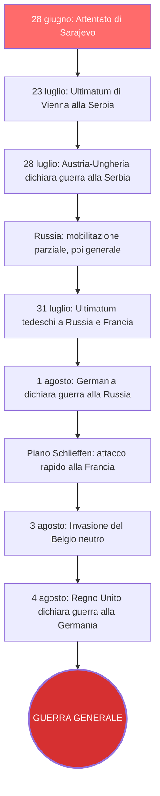
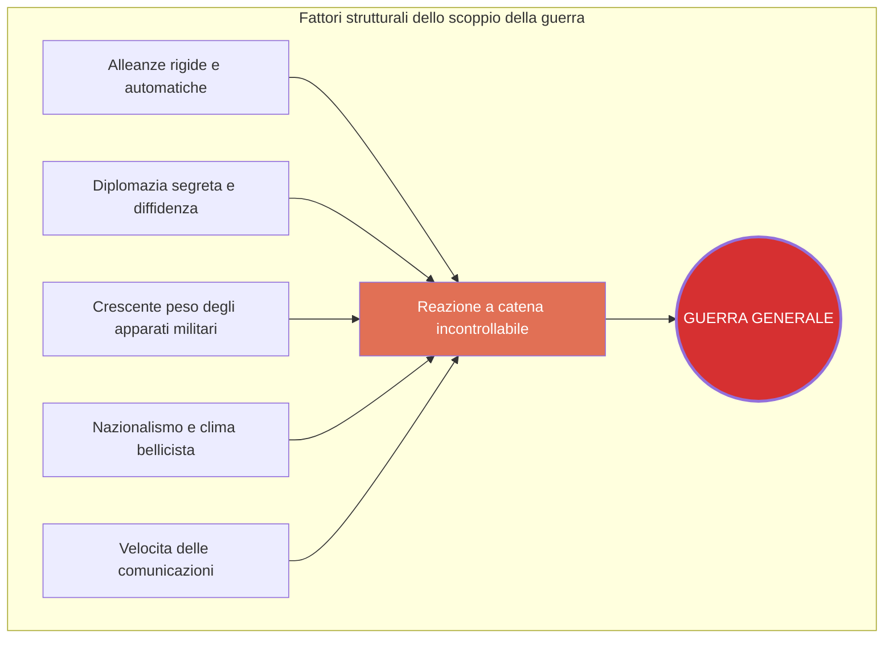
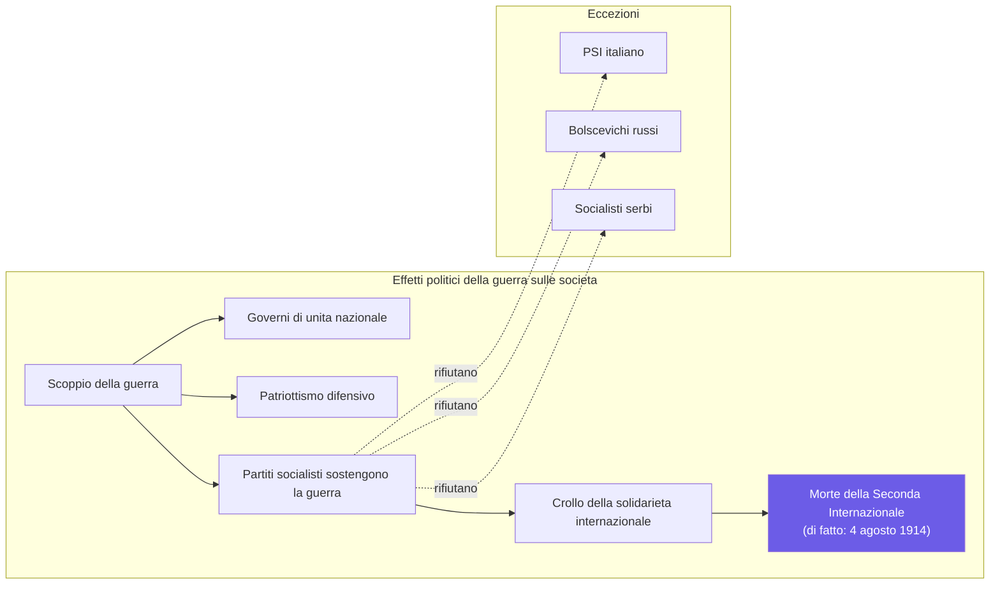
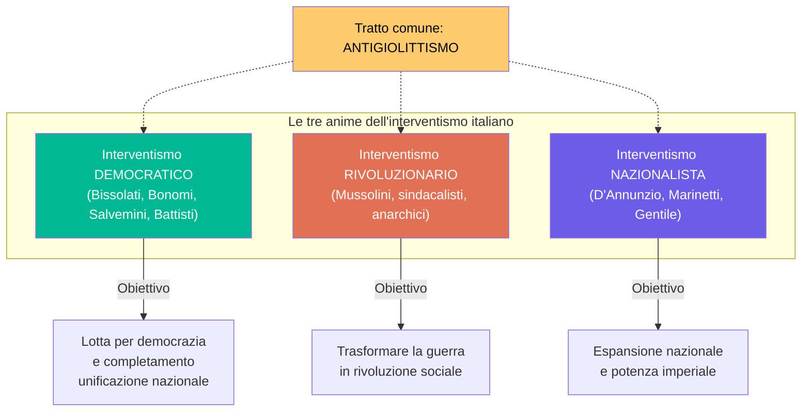
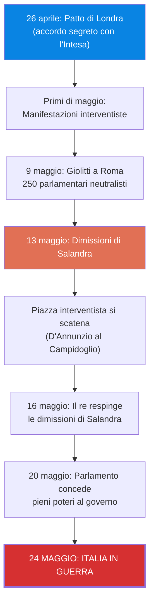
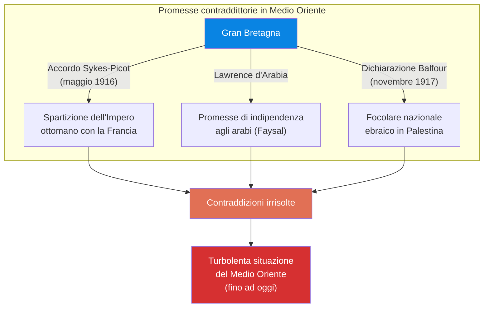
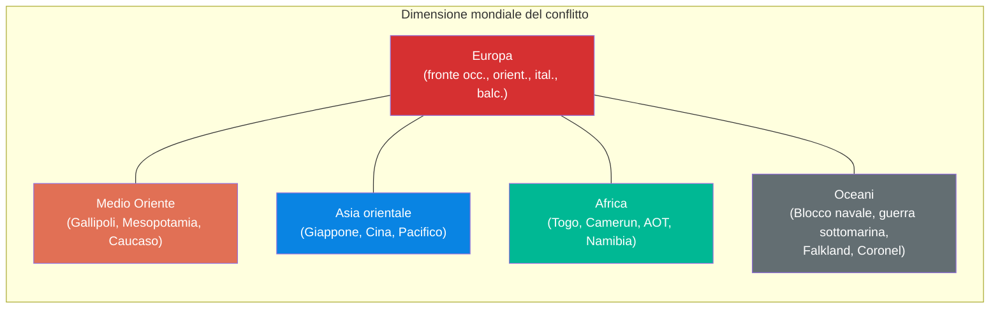
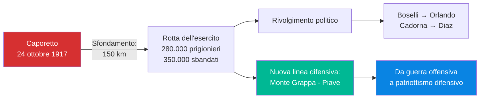
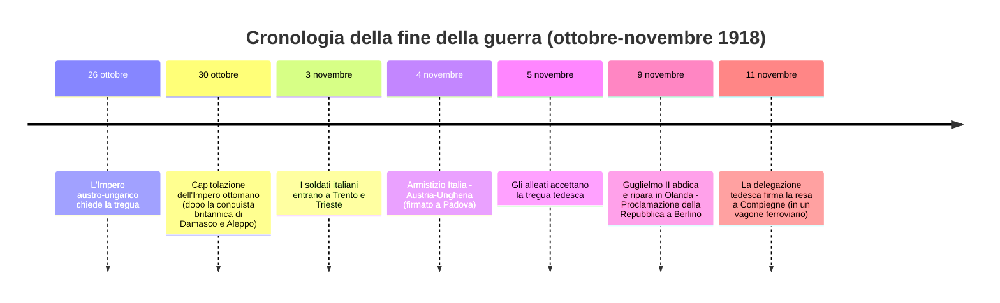
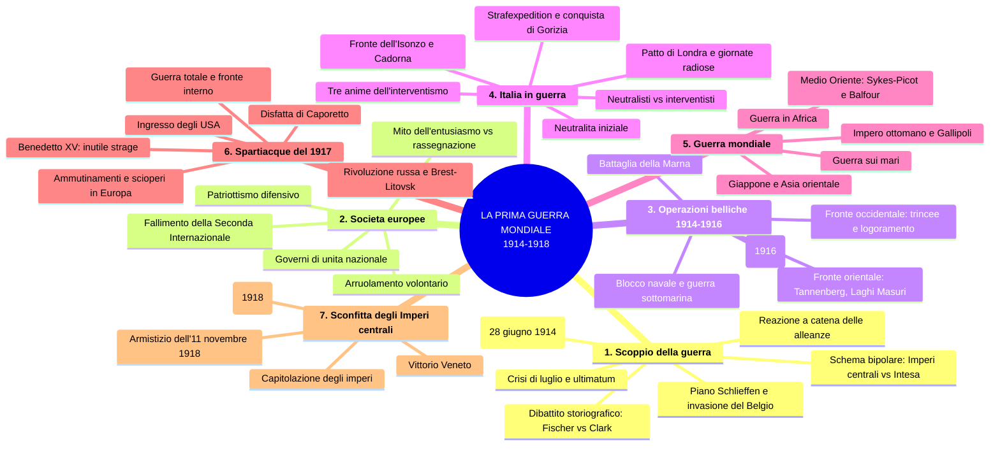

# Ripasso Veloce - Capitolo 3.5: La Prima guerra mondiale

---

## 1. Come scoppia una guerra?

### 1.1 La scintilla di Sarajevo e la crisi di luglio

- **28 giugno 1914**, Sarajevo: lo studente serbo **Gavrilo Princip** assassina l'**arciduca Francesco Ferdinando** e la moglie Sofia
- Organizzato dalla **Mano Nera** (*Ujedinjenje ili smrt!*), per far naufragare il progetto di monarchia **trialistica** (terzo polo slavo con Zagabria) che avrebbe indebolito il nazionalismo serbo
- Vienna sceglie la **linea dura**: i Balcani sono cruciali per la partita geopolitica con la Russia e per la solidarietà interna dell'impero
- **Germania** garantisce sostegno all'Austria (unico alleato affidabile, Italia considerata di "secondo rango")
- **23 luglio**: **ultimatum** alla Serbia (48 ore), clausole che ledono la sovranità serba — scritto per essere rifiutato
- **25 luglio**: Vienna rompe le relazioni
- **28 luglio**: **Austria-Ungheria dichiara guerra alla Serbia**; la Russia avvia la mobilitazione parziale

### 1.2 Nel precipizio della guerra generale

- Russia passa a **mobilitazione generale** → **31 luglio** Berlino invia ultimatum a Russia (revocare) e Francia (neutralità), entrambi respinti
- **Piano Schlieffen** (1905): offensiva rapida contro la Francia via Belgio/Lussemburgo, poi trasferimento a est via ferrovia

| Data | Evento |
|------|--------|
| **1 agosto** | La Germania dichiara guerra alla **Russia** |
| **3 agosto** | La Germania dichiara guerra alla **Francia** e invade il **Belgio** neutro |
| **4 agosto** | Il **Regno Unito** dichiara guerra all'Impero tedesco |

La violazione della neutralità belga e la minaccia ai porti del Mare del Nord spinsero il Regno Unito a entrare in guerra.

### 1.3 Un esito preparato ma non previsto

La guerra non fu voluta da nessuno ma il terreno era infiammabile. Fattori strutturali:
- **Alleanze irrigidite** con clausole segrete e scatto automatico
- **Diplomazia** che aveva incrementato diffidenza e imprevedibilità
- **Crescente peso degli apparati militari**
- **Clima nazionalista e bellicista**
- **Velocità delle comunicazioni** (telegrafi/treni) che spiazzava i tempi diplomatici

### 1.4 Il dibattito storiografico

- **Art. 231 Trattato di Versailles** (1919): responsabilità attribuita alla Germania (*Vae victis* — narrativa dei vincitori)
- **Fritz Fischer** (*Assalto al potere mondiale*, 1961): guerra programmata dalle élite guglielmina
- **Christopher Clark**: collasso del sistema per calcoli, azzardi, errori e circostanze casuali
- Oggi la domanda sul **«come»** ha sostituito «chi» e «perché»

---

## 2. Le società europee di fronte alla guerra

- L'**entusiasmo collettivo** è stato in parte **mitizzato**: ambienti acculturati e nazionalisti erano entusiasti, la **maggioranza era rassegnata**
- Dal **1 agosto**, con le mobilitazioni, si diffuse un **patriottismo difensivo**: ogni governo presentò il proprio Paese come vittima
- **Governi di unità nazionale**: in Francia *Union sacrée*, in Germania *Burgfrieden*; poteri del governo ampliati, tratti autoritari
- I **principali partiti socialisti** sostennero la guerra → la **Seconda Internazionale** morì di fatto il **4 agosto 1914** (sciolta formalmente nel 1916)
- Eccezioni: **PSI italiano**, **bolscevichi** russi, **socialisti serbi**

---

## 3. Operazioni belliche in Europa (1914-1916)

### 3.1 Fronte occidentale e guerra di trincea

- Solo il **22 agosto** l'esercito francese contò **27.000 vittime**
- **Battaglia della Marna** (5-11 settembre): **fallimento del piano Schlieffen**, fine della guerra rapida
- Fronte stabilizzato su **720 km di trincee**: fango, ratti, parassiti, epidemie, tensione costante

### 3.2 Fronte orientale, Balcani e guerra navale

- **Balcani**: Serbia cade nell'**autunno 1915** (ingresso della Bulgaria con gli Imperi centrali)
- **Fronte orientale**: tedeschi vincono a **Tannenberg** e **Laghi Masuri** (ago-set 1914); russi prevalgono in **Galizia**
- Esercito asburgico in crisi: diverse nazionalità, aspirazioni all'indipendenza
- Avanzata austro-tedesca in Polonia russa e territori baltici, ma anche a est → **guerra di logoramento**
- **Blocco navale britannico** nel Mare del Nord; dal **febbraio 1915** tedeschi rispondono con **sommergibili**
- Affondamento del **Lusitania** (maggio 1915, 1198 vittime, 129 statunitensi) → indignazione USA → campagna sospesa in settembre

### 3.3 Verdun, la Somme e fine 1916

- Imperi centrali isolati: dal **gennaio 1915** la Germania introduce i **razionamenti**
- **Verdun** (febbraio-dicembre 1916): ~2.300.000 soldati, **~700.000 vittime totali**, 10 milioni di proiettili; 6 villaggi rasi al suolo mai ricostruiti → **«capitale della guerra totale»**
- **Somme** (luglio-novembre): oltre **un milione di perdite**
- A fine 1916: austriaci perdono l'autonomia militare; **Russia** ha perso un milione di soldati; **Romania** entrata con l'Intesa (agosto 1916) ma invasa; **Turchia** con Imperi centrali dal novembre 1914
- Gli Imperi centrali apparivano **in vantaggio** territoriale

---

## 4. L'Italia in guerra (1915-1916)

### 4.1 Neutralità: neutralisti e interventisti

- Italia nella **Triplice Alleanza** (dal 1882), ma tensioni con Vienna per **terre irredente** (Trento e Trieste) e Adriatico
- Alleanza **difensiva** → **2 agosto** governo **Salandra** dichiara **neutralità**
- **10 mesi** di scontro neutralisti vs interventisti

**Neutralisti**: **PSI** (fedeltà all'Internazionale), **cattolici** e **Benedetto XV** (no guerra tra cattolici), **Giolitti** e liberali giolittiani (Italia non pronta). La **maggioranza della popolazione** non voleva la guerra.

### 4.2 Le tre anime dell'interventismo

Tutti a fianco dell'Intesa, uniti dall'**antigiolittismo**:

- **Democratico** (Bissolati, Bonomi, Salvemini, Battisti): guerra per democrazia e completamento dell'unificazione. Battisti catturato e **giustiziato come traditore** (maggio 1916)
- **Rivoluzionario** (Mussolini, sindacalisti, anarchici): trasformare la guerra in rivoluzione. Mussolini ruppe col PSI, fondò *Il Popolo d'Italia*
- **Nazionalista** (D'Annunzio, Marinetti/futuristi, Gentile): guerra come espansione e potenza

Interventismo **minoritario** ma dettò l'agenda pubblica.

### 4.3 Patto di Londra e maggio 1915

- **26 aprile 1915**: **Patto di Londra** (segreto) — Italia entra in guerra entro un mese. In cambio: Trentino fino al Brennero, Trieste e Istria, Dalmazia, protettorato Albania, compensi coloniali
- **9 maggio**: Giolitti a Roma, 250 parlamentari neutralisti
- **13 maggio**: Salandra si dimette → manifestazioni interventiste, D'Annunzio al Campidoglio
- **16 maggio**: il re respinge le dimissioni
- **20 maggio**: Parlamento concede **pieni poteri** (contrari solo socialisti: *«né aderire né sabotare»*)
- Le **«giornate radiose»**: esautorazione del Parlamento mediante piazza e intimidazione — precedente del **fascismo**

### 4.4 Fronte italiano e Strafexpedition

- **24 maggio 1915**: guerra contro Austria-Ungheria (contro Germania solo agosto 1916)
- ~1.100.000 soldati iniziali, quasi 6 milioni mobilitati alla fine; inadeguati per artiglieria
- **Guerra di posizione in montagna** (fino a 2000+ m: la **«Guerra Bianca»**)
- **Cadorna**: attacchi massicci sull'**Isonzo**. Giugno-dicembre 1915: 4 battaglie, **180.000 perdite italiane**, 140.000 austriache, guadagni minimi
- **15 maggio 1916**: ***Strafexpedition*** (spedizione punitiva), avanzata di 20 km in Valsugana e altopiano di Asiago
- **16 giugno**: offensiva interrotta (logoramento + offensiva russa in Galizia). Salandra → **Boselli** (governo unità nazionale)
- **6 agosto**: **sesta battaglia dell'Isonzo** → **conquista di Gorizia**, ma perdite enormi senza risultati strategici

---

## 5. Una guerra mondiale

### 5.1 Impero ottomano e Gallipoli

- **29 ottobre 1914**: Impero ottomano entra con gli Imperi centrali (legame con Germania anche per la ferrovia Berlino-Costantinopoli-Baghdad)
- Turchi attaccano Russia sul **Caucaso**; 1915-16 russi penetrano fino a Trebisonda, Erzerum, lago di Van → contesto del **genocidio armeno**
- **Aprile 1915**: sbarco alleato a **Gallipoli** (Dardanelli), 8 mesi sanguinosi poi ritiro. Perdite ottomane: 251.000 (87.000 morti); Intesa: 141.000. Eroe turco: **Mustafa Kemal**

### 5.2 Medio Oriente: promesse contraddittorie

- **Lawrence d'Arabia** guida la rivolta araba con **Faysal**. Nel 1917: conquista di Baghdad (marzo) e Gerusalemme (dicembre)
- **Maggio 1916**: accordo segreto **Sykes-Picot** (spartizione Impero ottomano tra Francia e Gran Bretagna)
- **2 novembre 1917**: **dichiarazione Balfour** → «focolare nazionale ebraico» in Palestina (movimento sionista di Herzl)
- Promesse contraddittorie → **turbolenta situazione del Medio Oriente** fino ad oggi

### 5.3 Asia, mari e Africa

- **Giappone** (alleato britannico dal 1902): dichiara guerra alla Germania il 23 agosto 1914, occupa isole del Pacifico e Shandong → proiezione verso **egemonia in Asia** e potenziale conflitto con USA
- Cina invia **150.000 operai** in Europa pur restando neutrale
- Squadra navale tedesca del Pacifico: vince a Coronel (Cile) ma **annientata** alle **Falkland** (dicembre 1914)
- **Africa**: Togo (agosto 1914), Camerun (febbraio 1916), Namibia (maggio 1915) conquistati. Africa orientale tedesca: resistenza fino al novembre 1918
- Le colonie italiane non furono coinvolte direttamente

---

## 6. Lo spartiacque del 1917

### 6.1 Guerra totale e fronte interno

- L'economia diventa **economia di guerra**: più di **70 milioni di uomini** mobilitati

> **Economia di guerra**: misure straordinarie per potenziare la produzione bellica e controllare la distribuzione di rifornimenti e beni di prima necessità.

- Governi usano **propaganda** e **promesse** (terre, sussidi, pensioni); il **«fronte interno»** è decisivo
- Dal **1916** i fronti interni cedono per **carenza di approvvigionamenti**

### 6.2 Rivoluzione russa e Brest-Litovsk

- Germania e Austria-Ungheria: scioperi, proteste, spinte centrifughe delle nazionalità
- **Febbraio 1917**: rivoluzione in Russia, scioperi e ammutinamenti abbattono lo zarismo
- **Ottobre 1917**: i **bolscevichi** prendono il potere
- **3 marzo 1918**: **pace di Brest-Litovsk** → Russia esce dalla guerra con pesanti cessioni (Polonia, Finlandia, Paesi baltici, Ucraina, Bessarabia, Crimea)

### 6.3 Crisi in Europa

- Esercito francese: almeno **250 ammutinamenti** (maggio-luglio 1917). Nivelle sostituito da **Pétain**
- Novembre 1917: fine dell'*Union sacrée*; **Clemenceau** al governo
- In Germania viene meno la *Burgfrieden*; **scissione pacifista** nella SPD
- **Agosto 1917**: papa **Benedetto XV** definisce la guerra **«inutile strage»**

### 6.4 Italia: Torino e Caporetto

- **Agosto 1917**, Torino: mancanza di pane → rivolta di donne e operai, repressione con decine di morti
- **24 ottobre 1917**: attacco austriaco a **Caporetto** → il fronte cede, avanzata di **150 km**

| Dato | Cifra |
|------|-------|
| **Prigionieri** | 280.000 |
| **Militari sbandati** | 350.000 |
| **Morti** | 11.000 |
| **Feriti** | 29.000 |
| **Civili in fuga** | 400.000 |

- Nuova linea difensiva: **monte Grappa e Piave**
- Boselli → **Orlando**; Cadorna → **Diaz** (motto: *«resistere, resistere, resistere»*; istituito il «servizio P» di propaganda)

**Disciplina nell'esercito italiano**: oltre 1.000 condanne a morte comminate, 750 eseguite, almeno 300 fucilazioni sommarie, più la decimazione — numeri molto superiori agli altri eserciti dell'Intesa. La storiografia interpreta Caporetto come **sconfitta militare** (Cadorna non aveva approntato difese adeguate, fronte sbilanciato all'offensiva).

### 6.5 Il fattore Stati Uniti

- USA rifornivano l'Intesa di capitali, armi, alimenti tramite imprese private (Colt, JP Morgan)
- **Wilson** mantenne la neutralità nel 1914 (calcoli elettorali, comunità ostili all'Intesa). La guerra **raddoppiò le esportazioni** USA
- Inizio **1917**: Germania riprende la **guerra sottomarina** → viola la **libertà di navigazione** (invariante della politica estera USA)
- Affondamento di 3 mercantili USA + **telegramma tedesco al Messico**
- **6 aprile 1917**: USA entrano come **potenza associata** all'Intesa. Wilson: democrazia vs militarismo
- **8 gennaio 1918**: **«Quattordici punti»** (punti chiave: autodeterminazione dei popoli coloniali; Società delle Nazioni)

---

## 7. La sconfitta degli Imperi centrali

- **Primavera-estate 1918**: tedeschi lanciano offensive su Francia, bloccate dall'afflusso americano
- **Metà luglio - primi agosto**: **contrattacchi** dell'Intesa, tedeschi ripiegano. **3 ottobre**: cancelliere Max von Baden chiede trattative
- Fronte italiano: offensiva austriaca del **giugno 1918** (la «battaglia del solstizio d'estate») fallisce
- **Fine ottobre**: attacco italiano verso **Vittorio Veneto** → sfondamento delle linee austriache

La vittoria fu possibile per il **logoramento del nemico** e gli **approvvigionamenti garantiti dagli USA**.

---

## Mappa concettuale dell'intero capitolo

