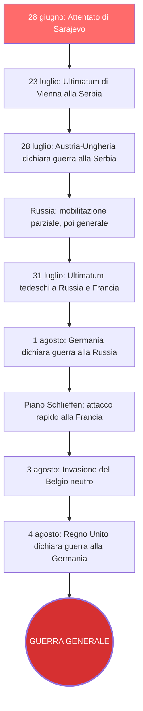
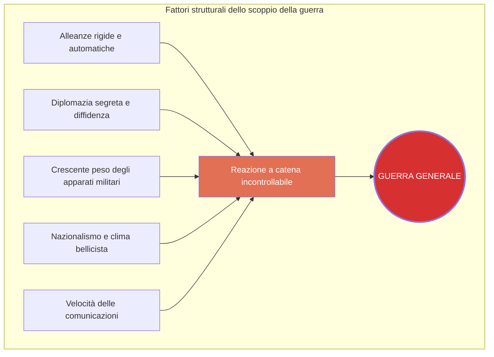
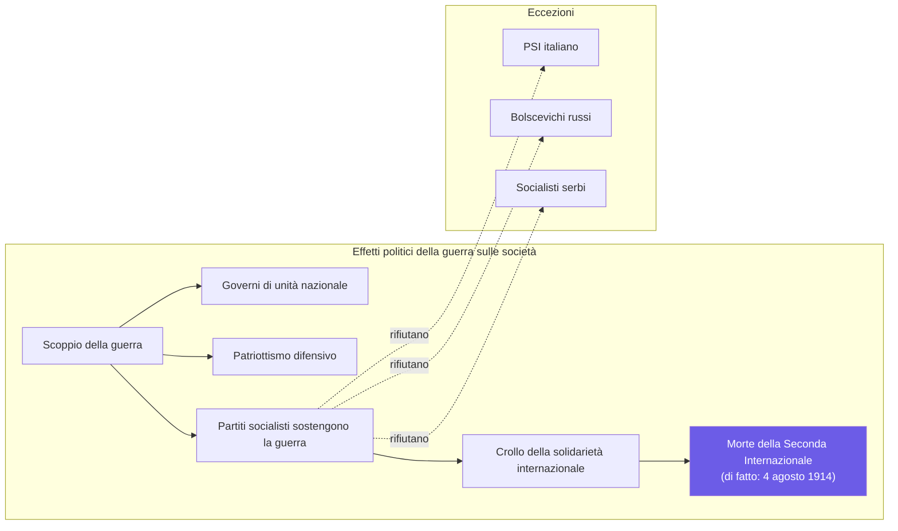
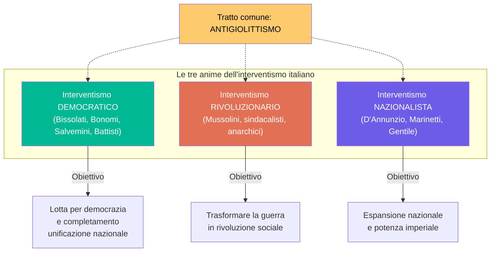
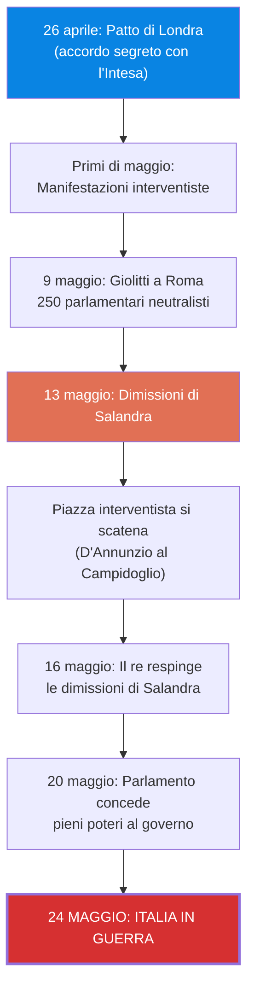
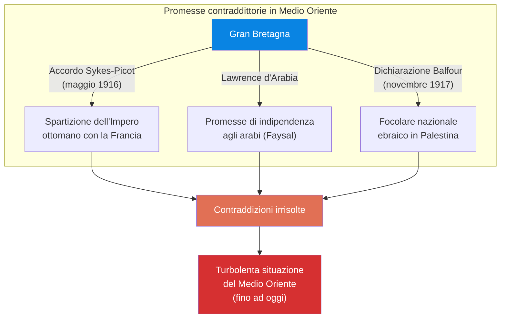
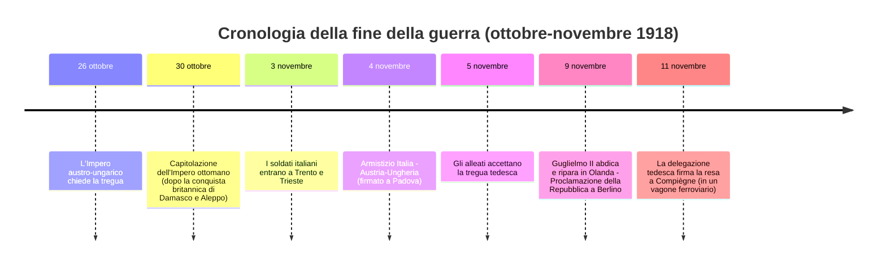
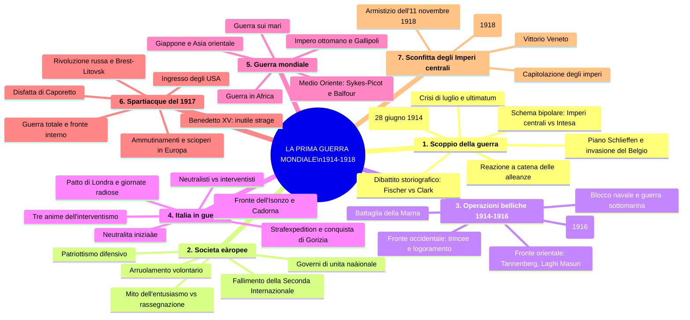

# Schema di Studio - Capitolo 3.5: La Prima guerra mondiale

---

## 1. Come scoppia una guerra?

### 1.1 La scintilla di Sarajevo

Il **28 giugno 1914**, a **Sarajevo**, capitale della Bosnia-Erzegovina (annessa all'Impero austro-ungarico nel **1908**), lo studente serbo **Gavrilo Princip** assassinò l'**arciduca Francesco Ferdinando**, erede designato della monarchia asburgica, e sua moglie **Sofia**. L'attentato era stato organizzato da un commando della **Ujedinjenje ili smrt!** (*«Unione o morte!»*), associazione segreta irredentista serba nota anche come **Mano Nera**, con l'appoggio di circoli militari estremisti.

L'obiettivo degli attentatori non era solo eliminare l'arciduca, ma soprattutto far naufragare il suo progetto politico: trasformare l'Impero «duale» (centrato su Austria e Ungheria) in una **monarchia «trialistica»**, dove il terzo polo sarebbe stato costituito dagli slavi con Zagabria in uno status analogo a quello di Budapest. Un simile assetto avrebbe minato il progetto del **nazionalismo serbo**, che aspirava a creare un autonomo «regno degli slavi» guidato da Belgrado.

Princip fu arrestato e condannato a **vent'anni di carcere**. Il colpo di pistola di Sarajevo fu il primo sparo di una guerra che, poco più di un mese dopo, contrappose i due blocchi delineatisi negli ultimi decenni in Europa:
- gli **Imperi centrali**: Germania e Austria-Ungheria
- la **Triplice Intesa**: Francia, Inghilterra e Russia

Il conflitto avrebbe assunto **dimensioni mondiali** (con l'ingresso di Giappone e Stati Uniti), tanto che i contemporanei cominciarono a parlare di **«Grande guerra»**, una guerra grande per spazio, quantità (milioni di uomini mobilitati, un esorbitante numero di vittime) e durata.

### 1.2 Vienna al crocevia balcanico

Vienna scelse una **linea dura** nei confronti di Belgrado: il nazionalismo serbo doveva essere umiliato e ridimensionato. La **Penisola Balcanica** era cruciale per gli Asburgo per due ragioni: vi si giocava la **partita geopolitica con la Russia** e anche quella della **solidarietà interna dell'impero**, poiché la crescita dei nazionalismi balcanici si ripercuoteva sul mosaico di nazionalità che componevano lo Stato asburgico.

La **Germania** garantì il suo **sostegno all'Austria** in caso di attacco alla Serbia e la spingeva a lanciare un ultimatum. Per i tedeschi era necessario che Vienna conservasse il ruolo di grande potenza, essendo l'unico alleato di peso capace di evitare l'isolamento internazionale tedesco. L'Italia, legata a Germania e Austria-Ungheria nella Triplice Alleanza, era considerata una potenza di **«secondo rango»**, poco autorevole nelle conferenze che regolavano gli ordini europei e mondiali.

La Germania accettava **rischi calcolati**, che prevedevano scenari di guerre limitate come nel caso dei Balcani: i tedeschi pensavano che la Gran Bretagna non sarebbe intervenuta, anche perché impegnata con la lotta irlandese per l'indipendenza. Ciò avrebbe escluso l'ampliamento del conflitto.

### 1.3 La crisi di luglio

Dopo alcune settimane in cui l'episodio di Sarajevo sembrava destinato a non avere gravi conseguenze, si aprì la cosiddetta **crisi di luglio**. Il **23 luglio** Vienna presentò alla Serbia un **ultimatum**, accusandola di aver tollerato le organizzazioni segrete responsabili della morte dell'arciduca e intimandole di smantellarle. In più, gli austro-ungarici pretendevano di **partecipare alla repressione**, ledendo così la sovranità serba. Belgrado aveva **48 ore** per rispondere. Più che un passo verso una ricomposizione diplomatica, l'ultimatum era un pugno battuto sul tavolo.

La Serbia accondiscese alle richieste, **eccetto quelle che minavano la sua sovranità**, ma gli austriaci si ritennero insoddisfatti e il **25 luglio** ruppero le relazioni diplomatiche. Tre giorni dopo, il **28 luglio**, l'**Impero austro-ungarico dichiarò guerra alla Serbia**. La Russia, alleata di Belgrado, avviò una **mobilitazione parziale** dell'esercito. Era il segnale che non sarebbe stata solo una guerra bilaterale, anche se in quel momento il conflitto sembrava potersi limitare all'area balcanica.

> **Mobilitazione**: insieme delle operazioni con cui l'organizzazione militare passa dall'assetto di pace a quello di guerra (chiamata alle armi, predisposizione delle unità combattenti e degli equipaggiamenti ecc.). È **«generale»** quando comprende tutte le forze armate, **«parziale»** se riguarda solo alcune classi di leva o alcune unità militari.

### 1.4 Nel precipizio della guerra generale

Quando la Russia passò alla **mobilitazione generale**, Berlino cercò di persuadere l'opinione pubblica nazionale e le forze politiche -- soprattutto i socialdemocratici -- che la Germania era minacciata e occorreva prendere l'iniziativa. Il **31 luglio** il governo tedesco inviò due **ultimatum**: alla **Russia**, perché revocasse la mobilitazione; alla **Francia**, perché si dichiarasse neutrale in caso di guerra tra Germania e Russia.

Berlino e Vienna annunciarono la mobilitazione generale; San Pietroburgo e Parigi respinsero gli ultimatum: era in gioco il loro status di potenza e la tenuta della loro alleanza. Il **meccanismo di reazione a catena** era ormai attivato.

A imprimere un'accelerazione fu il **piano Schlieffen**, adottato già nel **1905**: in caso di guerra su due fronti, prevedeva un'offensiva rapida contro la Francia, per anticipare la mobilitazione dell'esercito russo (che richiedeva alcune settimane). I tedeschi contavano di sconfiggere i francesi e poi trasferire le truppe con le ferrovie sul fronte orientale.

| Data | Evento |
|------|--------|
| **1 agosto** | La Germania dichiara guerra alla **Russia** |
| **3 agosto** | La Germania dichiara guerra alla **Francia** e invade il **Belgio** neutro |
| **4 agosto** | Il **Regno Unito** dichiara guerra all'Impero tedesco |

L'invasione del neutrale Belgio era necessaria per la rapida manovra a tenaglia prevista dal piano Schlieffen, attraverso Lussemburgo e Belgio. Di fronte alla violazione della neutralità belga e alla prospettiva che la Germania si impadronisse dei porti sul Mare del Nord, il Regno Unito -- fino ad allora titubante -- entrò in guerra. Era la **guerra generale**.



### 1.5 Un esito preparato ma non previsto

La Grande guerra non era ciò che avrebbero voluto le potenze europee, nemmeno Austria e Germania (alle quali, al termine del conflitto, venne attribuita tutta la **responsabilità**). Tuttavia, la scintilla di Sarajevo fece divampare l'incendio perché il terreno era infiammabile, alimentato da tensioni e contrapposizioni prodotte negli ultimi quarant'anni di «pace europea».

L'assetto geopolitico dell'Europa era fondato su uno **schema bipolare** -- Imperi centrali contro Triplice Intesa -- in **forte competizione** su scenari sempre più vasti. I fattori strutturali che resero possibile l'esplosione del conflitto furono:
- le **alleanze** si erano **irrigidite**, mentre cresceva l'incomunicabilità tra gli schieramenti
- la **diplomazia** aveva tessuto alleanze con scatto automatico e clausole segrete, incrementando diffidenza e imprevedibilità
- i vincoli interni alle alleanze potevano innescare, in caso di crisi, una **catena di reazioni** capace di condurre a una guerra generale
- la politica di potenza attribuiva sempre **più influenza agli apparati militari**

I governi preparavano un **clima propizio alla guerra**, enfatizzando il nazionalismo e il dovere di fedeltà alla nazione per ragioni di coesione interna, fondando la solidarietà sui miti della forza e della potenza. A tutto ciò si aggiungeva la **nuova velocità delle comunicazioni**: telegrafi e treni avevano spiazzato l'esperienza dei diplomatici (fatta di tempi lunghi) e reso ancora più inesorabili le macchine belliche -- una volta lanciate, non era più possibile fermarle.



### 1.6 Il dibattito storiografico sulle responsabilità

Lo scoppio della Prima guerra mondiale non si comprende attraverso la ricerca di un colpevole, ma con l'analisi dei fattori che portarono al conflitto.

**La tesi della responsabilità tedesca.** Il tentativo di individuare un «colpevole» fu un motivo ricorrente nella propaganda durante la guerra, diventando nel dopoguerra il pilastro ideologico dell'architettura che i vincitori vollero dare all'Europa in pace. La **responsabilità della Germania** fu iscritta nell'**articolo 231 del Trattato di Versailles** (1919): *«I Governi Alleati e Associati dichiarano e la Germania riconosce che la Germania e i suoi alleati sono responsabili, per esserne stati la causa, di tutte le perdite e di tutti i danni subiti»*. Il più fermo sostenitore di questa tesi fu lo storico tedesco **Fritz Fischer** (1908-1999), che nel volume **Assalto al potere mondiale. La Germania nella guerra 1914-1918** (1961) argomentò che la guerra era stata programmata dalle élite della Germania guglielmina per affermarsi nella lotta per il potere mondiale. Il suo lavoro risentiva peraltro anche dell'ulteriore catastrofe della Seconda guerra mondiale.

**La tesi della molteplicità di cause.** Lo storico australiano **Christopher Clark** (1960) ha indagato minuziosamente su come si giunse alla guerra, sottolineando che il collasso del sistema internazionale fu un insieme di calcoli, azzardi, errori, circostanze casuali, fraintendimenti, modelli culturali, sentimenti in voga e disponibilità tecniche. Progressivamente, alle domande correlate sul «chi» e sul «perché» si è sostituita quella sul **«come»**: comprendere il processo che condusse al conflitto e gli elementi che vi agirono è oggi la via più indicata per affrontare la questione.

> **Stefan Zweig** e la commozione creata ad arte: lo scrittore austriaco, presente a Baden (nei pressi di Vienna) quando giunse la notizia dell'assassinio, notò che non si leggeva sui volti particolare sdegno, che la coppia era «circondata da un'aria di gelo» e che poche ore dopo la gente chiacchierava e rideva. Solo dopo una settimana affiorarono nei giornali accenni polemici troppo all'unisono per essere casuali: si accusava il governo serbo di complicità e si diceva che l'Austria non poteva lasciare impunito l'assassinio.

---

## 2. Le società europee di fronte alla guerra

### 2.1 Tra entusiasmo e rassegnazione

Sin dall'agosto 1914 -- e poi nella memoria pubblica ufficiale -- si è radicata l'immagine di un **entusiasmo collettivo per la guerra**: cortei festanti, fanfare militari, donne che salutano i soldati infilando fiori nei fucili. La ricerca più recente ha messo in dubbio questa ricostruzione, rivelando la **mitizzazione** che ne fu fatta.

Le reazioni delle società alla crisi di luglio furono variegate. Alcuni ambienti acculturati, soprattutto nelle città, erano effettivamente entusiasti, e non mancarono **manifestazioni a favore della guerra** a opera di associazioni nazionaliste e circoli studenteschi. La **maggioranza degli europei**, però, era piuttosto **rassegnata** di fronte a un'evoluzione degli eventi che appariva inesorabile. Fino a poche ore prima delle ostilità, in Germania, Francia e Regno Unito si levarono chiare voci di opposizione: il movimento operaio in primo luogo, ma nell'articolata società civile britannica si mobilitarono anche il movimento femminista, settori consistenti delle Chiese protestanti, dell'opinione pubblica liberale e del mondo degli affari.

Le cose cambiarono dal **1 agosto**, con le mobilitazioni e le dichiarazioni di guerra. Accanto alle manifestazioni nazionaliste aggressive, si diffuse un atteggiamento di adesione al conflitto ispirato a un **patriottismo difensivo**: ogni governo presentò il proprio Paese come **vittima di un'aggressione**, orientando lo spirito pubblico sull'idea di difendere la propria patria da un'invasione, al fine di ottenere un consenso di massa.

### 2.2 L'arruolamento volontario

Un indicatore dell'adesione alla guerra fu il fenomeno dell'**arruolamento volontario**. Nella gran parte dei Paesi vigeva la **coscrizione obbligatoria**, quindi si offriva volontario chi non aveva ancora l'età della leva o chi apparteneva a classi più anziane.

| Paese | Volontari (agosto 1914) | Note |
|-------|------------------------|------|
| **Francia** | 150.000 - 200.000 | ~300.000 a fine 1914 |
| **Germania** | 150.000 - 200.000 | ~300.000 a fine 1914 |
| **Gran Bretagna** | Il più alto numero | Non vigeva l'obbligo di leva (introdotto nel **1916**) |

Molti **giovani borghesi**, studenti e intellettuali si arruolarono spinti dall'**idealizzazione della guerra** diffusa in Europa nel decennio precedente: esaltazione dell'eroismo, dell'onore, del cameratismo virile. In questo immaginario la guerra avrebbe permesso di superare gli angusti limiti della mentalità e della società borghese: era un'«esperienza» e un appuntamento storico da non mancare. La realtà della guerra «moderna» avrebbe fatto ricredere molti.

Per contro, **operai e contadini**, ben lungi dall'aderire all'ideale bellico, erano pervasi da sgomento e rassegnazione di fronte a una situazione alla quale non potevano sottrarsi.

### 2.3 I governi di «unità nazionale» e il fallimento della socialdemocrazia

Allo scoppio della guerra, la classe dirigente chiamò la nazione a raccolta: tutti dovevano essere solidali nello sforzo bellico. Sul piano politico, in molti Paesi questa prospettiva si concretizzò nei **governi di «unità nazionale»**, sostenuti da tutte le forze rappresentate in Parlamento. In Francia si parlò di ***Union sacrée*** («unione sacra»), in Germania di ***Burgfrieden*** («tregua politica»).

In tutti gli Stati si ampliarono i **poteri del governo** a scapito di quelli del Parlamento, e le **prerogative del potere militare**; lo Stato accentuò i suoi **tratti autoritari** e aumentò la sua presenza in tutti i settori, compreso quello economico.

Malgrado condannassero la guerra, anche i **principali partiti socialisti** e i sindacati sostennero l'impegno bellico, sia sposando l'ideale del patriottismo difensivo, sia temendo l'isolamento politico e l'accusa di essere nemici della nazione. La socialdemocrazia **fallì la decisiva prova della guerra**: la solidarietà internazionale, vanto del movimento operaio, si sgretolò insieme alla sua organizzazione. La **Seconda Internazionale** si sciolse formalmente nel **1916**, ma di fatto morì il **4 agosto 1914**.

Tra le poche eccezioni:
- il **Partito socialista italiano**
- i **bolscevichi** in Russia
- i **socialisti serbi**



---

## 3. Le operazioni belliche in Europa (1914-1916)

### 3.1 Il fronte occidentale

Ai primi d'agosto milioni di soldati furono schierati grazie a imponenti apparati logistici e a **reti ferroviarie** estese ed efficienti. Il conflitto si configurava come **guerra di massa**: solo nella giornata del **22 agosto** l'esercito francese contò **27.000 vittime**.

L'avanzata tedesca verso Parigi fu fermata tra il **5 e l'11 settembre** dalle truppe francesi e britanniche nella **battaglia della Marna**. Fu il **fallimento del piano Schlieffen** e la fine della guerra rapida immaginata dagli Stati maggiori. Nessuna delle due parti poteva prevalere in breve tempo: iniziava una **guerra di logoramento**, in cui il vincitore sarebbe stato quello in grado di resistere più a lungo.

Alla fine del 1914, il **fronte occidentale si stabilizzò**: i tedeschi occupavano quasi interamente il Belgio e una porzione della Francia nord-orientale. Tra le truppe del Reich e quelle anglo-francesi era in corso una **guerra di posizione**, lungo una linea che attraversava l'Europa per **720 chilometri**, su cui i due eserciti predisposero sistematicamente **trincee**.


### 3.2 Vivere e morire in trincea

La trincea è diventata uno dei tragici simboli della Prima guerra mondiale. Se ne ebbero su tutti i fronti, ma fu caratteristica soprattutto di quello occidentale, dove un articolato sistema di fossati e ripari si sviluppò per **migliaia e migliaia di chilometri**. Le trincee seguivano percorsi tortuosi, sia per sfuggire ai colpi nemici sia per la conformazione dei terreni; esistevano molteplici linee, dal primo avamposto alle retrovie.

Le **condizioni di vita erano terribili**: i soldati erano costretti ad accalcarsi nel fango o circondati da polvere, a convivere con moltitudini di ratti e parassiti di ogni tipo, in un ambiente permeato da odori pungenti provocati da feci, urina e cadaveri in decomposizione nella cosiddetta **terra di nessuno**. Le **epidemie** non erano rare: si poteva morire di tifo o di colera. Nelle linee più avanzate il vitto arrivava a intermittenza, la sete era un problema urgente, riposare era quasi impossibile. A tutto ciò si aggiungeva la tensione costante per il **pericolo della vita**, che diventava spasmodica sotto attacco o durante gli assalti, sapendo che si sarebbe finiti contro il fuoco di sbarramento, il filo spinato e gli ostacoli difensivi della trincea nemica.

> **Terra di nessuno** (*No man's land*): espressione inglese entrata nell'uso nel primo anno di guerra per indicare l'area tra due trincee nemiche, tenuta sgombra dal fuoco delle rispettive mitragliatrici e artiglierie.

### 3.3 Il fronte balcanico e il fronte orientale

Nei **Balcani** le truppe austro-ungariche vinsero la resistenza serba nell'**autunno 1915**, dopo l'ingresso nel conflitto della **Bulgaria** al fianco degli Imperi centrali.

Sul **fronte orientale**, le armate dello zar attaccarono la Prussia ma i tedeschi, tra agosto e settembre 1914, ne sventarono l'iniziativa vincendo le battaglie di **Tannenberg** e dei **Laghi Masuri**. Parallelamente, i russi prevalsero sugli austro-ungarici nella **Galizia** asburgica. Sin dalla primavera del 1915, nell'esercito asburgico si manifestarono delle crepe: la presenza di **diverse nazionalità** creava problemi di comunicazione e soprattutto le **aspirazioni all'indipendenza** minavano la fedeltà alla corona.

Il primo anno di guerra si concluse con un'avanzata austro-tedesca nella **Polonia russa** e nei **territori baltici**, mentre l'esercito zarista doveva arretrare. Pur restando una guerra di movimento, anche sul fronte orientale il conflitto era diventato una **guerra di logoramento**.

### 3.4 Il blocco navale britannico e la guerra sottomarina tedesca

Gli Imperi centrali non disponevano né degli uomini né delle risorse per prevalere sugli alleati dell'Intesa nel lungo periodo. Forte della sua superiorità navale, il **Regno Unito** stabilì un **blocco nel Mare del Nord** per impedire le importazioni in Germania.

Per contrastarlo, dal **febbraio 1915** i tedeschi ricorsero ai **sommergibili**, che dovevano attaccare i mercantili britannici nelle acque intorno alla Gran Bretagna e all'Irlanda. Nemmeno alle navi dei Paesi neutrali era garantita l'incolumità su quelle rotte.

I risultati della guerra sottomarina tedesca furono però modesti, se non **controproducenti**: l'affondamento di navi neutrali o passeggeri indignava l'opinione pubblica internazionale. Il caso più celebre e drammatico fu quello del transatlantico **«Lusitania»**, silurato nel **maggio 1915** al largo dell'Irlanda: tra le **1198 vittime**, **129** erano cittadini statunitensi. Washington fece pressioni perché i tedeschi fermassero la campagna sottomarina, cosa che avvenne in **settembre**.

### 3.5 Gli Imperi centrali in lotta contro il tempo

Gli Imperi centrali restarono isolati dai mercati mondiali, con conseguente **penuria di materie prime e beni necessari**. La scarsità di cibo fu il problema principale: la Germania dal **gennaio 1915** introdusse i **razionamenti**, a partire dal pane.

> **Razionamento**: limitazione degli acquisti e dei consumi tramite una distribuzione controllata dei generi di prima necessità, imposta in tempo di guerra o in situazioni di emergenza.

Consapevoli di questa situazione, nel **1916** i vertici militari cercarono di forzare l'andamento del conflitto, ma **senza un piano comune**: i tedeschi puntavano a sferrare un attacco sul fronte occidentale per piegare definitivamente la Francia; gli austriaci, lasciando sguarnito il fronte orientale, lanciarono un'offensiva sul fronte italiano.

### 3.6 Le battaglie di Verdun e della Somme (febbraio-dicembre 1916)

A **febbraio 1916** i tedeschi attaccarono la piazzaforte di **Verdun**, in Lorena. Iniziava così una delle più lunghe e sanguinose battaglie del conflitto: **dieci mesi** di combattimenti con almeno **300.000 morti** e **400.000 feriti**, **10 milioni di proiettili** di artiglieria scagliati su un'area di poche decine di chilometri quadrati. Complessivamente, tra francesi e tedeschi furono dispiegati circa **2.300.000 soldati** e le vittime totali (morti, feriti, dispersi, prigionieri) ammontarono a circa **700.000**.

Le truppe francesi furono salvate da un'efficace tattica difensiva e soprattutto dal **coordinamento delle azioni degli eserciti alleati**: le offensive lanciate dai **russi sul fronte orientale** in giugno e dai **britannici sulla Somme** nel nord della Francia in luglio impedirono ai tedeschi di impiegare tutte le truppe preventivate per Verdun. Anche la **battaglia della Somme** si trascinò fino a novembre, con oltre **un milione di perdite**.

Verdun divenne una **«capitale della guerra totale»**: il luogo a cui l'opinione mondiale guardava per comprendere l'esito del conflitto. Il «lavoro» dell'artiglieria si inscrisse nel paesaggio in modi visibili ancora oggi: i bombardamenti distrussero una decina di borghi, **sei villaggi** furono interamente **rasi al suolo** e non vennero mai ricostruiti. La battaglia fu anche una **catastrofe ambientale**. A Verdun, nel **1920**, venne scelto il corpo del **«milite ignoto»** e si cominciò la costruzione dell'immenso **ossario di Douaumont** (con 15.000 tombe nel cimitero antistante).

### 3.7 La situazione militare alla fine del 1916

I tedeschi dovettero aiutare gli austro-ungarici sul fronte orientale per contenere l'avanzata russa. Gli austriaci persero del tutto la propria **autonomia militare**: l'iniziativa strategica era ormai in mani tedesche.

La **Russia**, che aveva già **perso un milione di soldati**, fu chiamata a un ulteriore sforzo in seguito all'**invasione austro-ungarica della Romania** (entrata in guerra a fianco dell'Intesa nell'**agosto 1916**). L'esercito zarista dovette estendere il fronte di **320 chilometri**, tra i Carpazi e il Mar Nero, per impedire che gli Imperi centrali invadessero l'Ucraina dalla Romania occupata. A ciò si aggiungeva l'impegno sul fronte meridionale con la **Turchia**, schierata con gli Imperi centrali dal **novembre 1914**.

Alla fine del 1916, **gli Imperi centrali apparivano in vantaggio**, occupando:
- gran parte di Romania, Belgio, Serbia e Lettonia
- l'intero Montenegro
- la Francia nord-orientale
- la Polonia russa e la Lituania

Le potenze dell'Intesa avevano conquistato solo piccole porzioni dell'Impero austro-ungarico: Gorizia sul fronte italiano, Bucovina e Galizia orientale sul fronte russo.

---

## 4. L'Italia in guerra (1915-1916)

### 4.1 L'Italia neutrale

L'Italia entrò in guerra nel **maggio 1915**. Allo scoppio del conflitto il Paese era legato a Germania e Impero austro-ungarico nella **Triplice Alleanza**, stipulata nel **1882**. Tali relazioni sussistevano anche per i legami economici con la Germania, nonostante le **crescenti tensioni con Vienna**, dovute sia a motivi storici legati al Risorgimento sia alla questione delle **terre irredente** (**Trento e Trieste**). La crisi bosniaca del **1908** aveva alimentato l'antagonismo tra Roma e Vienna per l'**egemonia sull'Adriatico** e per l'influenza sui **Balcani**.

Poiché la Triplice Alleanza aveva **carattere difensivo** (obbligava i contraenti a intervenire solo in caso di aggressione a uno dei membri), il **2 agosto** il governo **Salandra** dichiarò la **neutralità**. Fu un atto pragmatico volto a prendere tempo, non un preludio all'ingresso a fianco dell'Intesa: in quel momento nulla era deciso.

### 4.2 Neutralisti e interventisti

Per l'Italia iniziarono **dieci mesi** di travagliato confronto diplomatico, politico e culturale, durante i quali si scontrarono **neutralisti** e **interventisti**. A differenza degli altri Paesi, dove il conflitto portò a un ricompattamento in nome dell'unità nazionale, in Italia esso provocò una **frattura**.

**I neutralisti** comprendevano le principali forze politiche e sociali dell'età giolittiana:

| Componente | Motivazione |
|------------|-------------|
| **Socialisti (PSI)** | Fedeltà agli orientamenti dell'Internazionale; incongruenza tra guerra e valori socialisti |
| **Cattolici** e **Santa Sede** | Papa **Benedetto XV** (eletto settembre 1914) vedeva con favore la neutralità italiana; rifiuto del conflitto tra popolazioni cattoliche; non si doveva combattere il cattolicissimo Impero austro-ungarico |
| **Giolitti e i liberali giolittiani** | L'Italia non era pronta; il percorso di sviluppo economico e sociale sarebbe stato compromesso |

La **maggioranza della popolazione**, in particolare le classi popolari, non voleva la guerra.

**Gli interventisti** manifestarono subito l'intenzione di spingere l'Italia nel conflitto **a fianco dell'Intesa**, motivati dalle contese territoriali e geopolitiche con l'Austria. Lo schieramento era composto da **forze eterogenee**, dall'estrema sinistra all'estrema destra. L'unica caratteristica trasversale fu probabilmente l'**antigiolittismo** maturato nell'ultimo decennio.

### 4.3 Le tre anime dell'interventismo

**Interventismo «democratico».** Vi appartenevano i **repubblicani** e alcuni socialisti: **Leonida Bissolati** e **Ivanoe Bonomi** (che avevano lasciato il PSI nel 1912 perché favorevoli alla campagna di Libia) e **Gaetano Salvemini** (strenuo oppositore della guerra coloniale). Per loro la guerra era una lotta contro l'autoritarismo degli Imperi centrali, nel nome dei principi di libertà, uguaglianza e fraternità della Rivoluzione francese, per il trionfo della democrazia e per compiere l'**unificazione nazionale nel rispetto dei diritti delle altre nazionalità**. Queste spinte trovarono incarnazione nel geografo trentino **Cesare Battisti**, irredentista e socialista, suddito asburgico, che si arruolò volontario nell'esercito italiano; catturato dagli austriaci durante l'offensiva del **maggio 1916**, fu **giustiziato come traditore** nel castello di Trento.

**Interventismo «rivoluzionario».** Si pronunciarono a favore dell'intervento anche esponenti di correnti estremiste del socialismo: rappresentanti dell'anarchismo e del **sindacalismo rivoluzionario**, e persino uno dei leader più in vista del PSI, **Benito Mussolini**, schierato con l'ala massimalista e direttore del quotidiano «Avanti!». Mussolini, che era stato contro la guerra di Libia e ancora pacifista durante la crisi di luglio, cambiò idea dopo lo scoppio del conflitto. **Ruppe con il PSI** (fu formalmente espulso) e fondò un nuovo giornale, **«Il Popolo d'Italia»**, che divenne voce influente dell'arcipelago interventista. Per i rivoluzionari interventisti, bisognava partecipare per trasformare la guerra capitalista e imperialista in **guerra rivoluzionaria**.

**Interventismo «nazionalista».** All'altro capo del panorama politico, i **nazionalisti** -- inizialmente propensi a restare nella Triplice Alleanza -- passarono in breve a sogno dell'Intesa. Per loro la guerra era un'aspirazione intrinseca alla visione ideologica. La base intellettuale era ampia: dai **futuristi** di **Filippo Tommaso Marinetti** al poeta **Gabriele D'Annunzio**, dai circoli della rivista fiorentina **«La Voce»** al filosofo **Giovanni Gentile**.

Sebbene l'interventismo fosse **minoritario** nella società e nella politica italiane, riuscì a dettare l'agenda del confronto pubblico, mentre i neutralisti non elaborarono una strategia vincente. Gli interventisti ebbero il sostegno di intellettuali, giornalisti e del principale quotidiano italiano, il **«Corriere della Sera»**, ma ottennero anche quello della **piazza**, sempre più decisivo nella società di massa.



### 4.4 La strategia del governo e il Patto di Londra

Il presidente del Consiglio **Salandra** e il ministro degli Esteri **Sidney Sonnino** conducevano una complessa partita diplomatica, di cui erano a conoscenza il re **Vittorio Emanuele III**, gli ambasciatori e i vertici militari.

Dopo il tentativo tedesco di convincere l'Italia a rimanere neutrale in cambio di compensi, il governo concluse le trattative con le potenze dell'Intesa. Il **26 aprile 1915** fu stipulato il **Patto di Londra**, un **accordo segreto** in base al quale l'Italia si impegnava a entrare in guerra entro un mese a fianco di Gran Bretagna, Francia e Russia. In cambio della vittoria, all'Italia erano garantiti:
- il **Trentino** con il Sud Tirolo fino al **Brennero**
- **Trieste** e l'**Istria** (senza Fiume)
- la **Dalmazia**
- una sorta di **protettorato sull'Albania**
- compensi indefiniti in caso di dissoluzione dell'Impero ottomano e spartizione delle colonie tedesche

La corte e il governo avevano voluto una guerra di conquista; ora dovevano farla accettare al Parlamento e al Paese.

### 4.5 Le giornate del maggio 1915

Le manifestazioni interventiste ai primi di maggio crearono un **clima di esaltazione patriottica**. La situazione sembrò capovolgersi quando, il **9 maggio**, **Giolitti** tornò a Roma e oltre **250 parlamentari** gli recapitarono il loro biglietto da visita: un segnale di fedeltà al leader neutralista e di sfiducia verso il governo.

Il **13 maggio** Salandra si dimise. La notizia scatenò manifestazioni interventiste in molte città; la sera stessa, a Roma, **D'Annunzio** pronunciò in piazza del Campidoglio un discorso che incitava alla violenza per impedire che «la Patria si perda». Nei giorni seguenti occorreva **imporre con la forza la «volontà della nazione»**, delegittimando apertamente il Parlamento.

Gli atti decisivi:
- **16 maggio**: il re **respinse le dimissioni** di Salandra
- **20 maggio**: il Parlamento, pressato dalle dimostrazioni interventiste, concesse **pieni poteri al governo** in caso di guerra. Votarono contro solo i socialisti, che ripiegarono sulla posizione fragile e ambigua: **«né aderire né sabotare»**

Nelle giornate di maggio -- definite **«radiose»** dagli interventisti -- si raggiunse l'apice della **strategia extraistituzionale**, che esautorava il Parlamento mediante l'agitazione di piazza. Non si ricorreva solo a metodi innovativi di propaganda, ma anche all'**intimidazione e alla violenza**: qualcosa che si sarebbe ripresentato, in forme ancora più estreme, con l'**ascesa del fascismo**.



### 4.6 L'entrata in guerra e il primo anno sul fronte

Il **24 maggio 1915** l'Italia entrò in guerra contro l'Impero austro-ungarico (la dichiarazione di guerra alla Germania sarebbe stata inviata solo nell'**agosto 1916**). Fu allestito un esercito di quasi **un milione e centomila soldati** (alla fine del conflitto gli italiani mobilitati sarebbero stati quasi **6 milioni**, oltre 4 dei quali mandati al fronte), ma **inadeguato** rispetto ad artiglieria e munizioni. La preparazione era stata maldestra e lenta: gli austriaci avevano capito da tempo le intenzioni di Roma e avevano preso contromisure.

Il fronte si aprì lungo il **confine nord-orientale**, dal Trentino all'Adriatico. Fu una **guerra di posizione e di trincea** in terreno prevalentemente di **montagna**, con caratteristiche peculiari: trincee scavate nella roccia, difficoltà logistiche, uso di truppe alpine, condizioni climatiche estreme in alta quota.

Gli **austriaci**, pur in inferiorità numerica, sfruttarono la disponibilità di **armi migliori** e le **postazioni difensive** che costringevano gli italiani ad attaccare in salita, sotto il fuoco delle artiglierie. Il capo di Stato maggiore **Luigi Cadorna** (1850-1928) non aveva fatto tesoro di quanto accaduto sugli altri fronti e aveva predisposto una strategia già superata: attacchi massicci concentrati **sull'Isonzo**, da Tolmino all'Adriatico, sognando uno sfondamento verso Lubiana e Vienna.

Tra giugno e dicembre 1915 si contarono **quattro battaglie** in cui gli italiani persero oltre **180.000 uomini**, gli austriaci circa **140.000**, a fronte di **guadagni territoriali insignificanti**.

### 4.7 La Strafexpedition (maggio 1916)

Il **15 maggio 1916** gli austriaci lanciarono un attacco in **Trentino**, passato alla storia come ***Strafexpedition***.

> ***Strafexpedition***: in tedesco «spedizione punitiva». La definizione, coniata in ambito italiano, indicava la «punizione» inflitta dall'Austria all'Italia per aver tradito la Triplice Alleanza.

L'attacco colse di sorpresa il comando italiano, concentrato su una propria offensiva su Gorizia. L'iniziale successo austriaco fu travolgente: a inizio giugno le truppe asburgiche erano avanzate di una **ventina di chilometri** in Valsugana, sull'**altopiano di Asiago** e in **val d'Astico**. Tuttavia lo sforzo logorò le truppe austro-ungariche, mentre la contemporanea offensiva russa in Galizia obligò gli austriaci a spostare divisioni dal Trentino al fronte orientale. Il **16 giugno** l'offensiva fu interrotta, anche per la resistenza italiana.

A pagare il prezzo fu **Salandra**, che dovette dimettersi. Il suo sostituto, **Paolo Boselli**, formò un **governo di «unità nazionale»** che -- a differenza del precedente -- comprendeva esponenti dell'interventismo democratico (**Bissolati**, **Bonomi**) e il cattolico interventista **Filippo Meda**. Tuttavia il **Partito socialista** continuava a esserne escluso.

### 4.8 La conquista di Gorizia

Nonostante la Strafexpedition, Cadorna decise di lanciare ugualmente l'offensiva per Gorizia. Il **6 agosto** ebbe inizio la **sesta battaglia dell'Isonzo** (la quinta era stata combattuta all'inizio di marzo), che sfruttò l'effetto sorpresa: gli austriaci non si aspettavano attacchi così ravvicinati. L'esercito italiano si era dotato di artiglieria adeguata, mentre il contingente austriaco era stato indebolito dal trasferimento di soldati in Trentino. L'offensiva si concluse con la **conquista di Gorizia**, ancora a prezzo di **perdite enormi**.

Era una vittoria che poteva galvanizzare l'opinione pubblica, ma sul piano strategico la situazione restava sostanzialmente immutata. Gli ulteriori tentativi di attacco, sino alla fine del 1916, si conclusero con ingenti perdite da entrambe le parti, senza significative modifiche territoriali.

> **«Gorizia tu sei maledetta»**: uno dei canti di protesta più significativi della Prima guerra mondiale, racconto collettivo -- dal punto di vista dei soldati -- del massacro causato dalla strategia del comando italiano sull'Isonzo. Cantata al fronte e nell'Italia settentrionale, fu consacrata nel **1964** al Festival dei Due Mondi di Spoleto come una delle più note canzoni antimilitariste italiane.

---

## 5. Una guerra mondiale

### 5.1 Dall'Europa al mondo

La guerra acquisì presto un profilo mondiale, riflesso dei processi geopolitici dei decenni precedenti. Fin dall'inizio parteciparono i **due Imperi euroasiatici** (russo e ottomano); poi si aggiunsero due **potenze extraeuropee**: Giappone e Stati Uniti. I Paesi europei a capo di **imperi coloniali** coinvolsero le società coloniali come **parte costitutiva dei sistemi economici** e come **riserva di reclute**.

I combattimenti si svolsero prevalentemente in Europa, ma non mancarono fronti in Medio Oriente, Cina, Pacifico, acque dell'America del Sud e Africa subsahariana.

### 5.2 La guerra dell'Impero ottomano

Il **29 ottobre 1914** l'Impero ottomano entrò in guerra **a fianco degli Imperi centrali**. A dicembre i turchi attaccarono la Russia sul **Caucaso**, ma tra 1915 e 1916 i russi penetrarono nel territorio ottomano fino a **Trebisonda** sul Mar Nero, a **Erzerum** e al **lago di Van**. In questo contesto maturò il **genocidio della minoranza armena**.

Riguardo alla secolare **questione degli Stretti** (i bracci di mare che permettono il passaggio dal Mar Nero all'Egeo attraverso il Mar di Marmara e quindi al Mediterraneo), il governo russo convinse britannici e francesi a compiere una spedizione per togliere il controllo di Bosforo e Dardanelli agli ottomani.

Nell'**aprile 1915**, **75.000 soldati** britannici e francesi sbarcarono sulla **Penisola di Gallipoli** per neutralizzare le difese turche sui Dardanelli. Nel corso di una sanguinosa campagna (durata otto mesi) furono respinti e costretti a ritirarsi tra **settembre 1915** e **gennaio 1916**. Le perdite furono enormi: gli ottomani ebbero **251.000 perdite** (con **87.000 morti**), l'Intesa **141.000 perdite**.

Per i turchi, Gallipoli divenne il simbolo di una resistenza vittoriosa, il cui eroe fu il colonnello **Mustafa Kemal**, futuro fondatore della Repubblica turca.

### 5.3 Francesi e britannici in Medio Oriente

Un altro fronte si aprì in **Mesopotamia** (Iraq), dove truppe britanniche composte perlopiù da soldati indiani entrarono nel **settembre 1915** puntando su Baghdad. I britannici fomentarono la rivolta delle popolazioni arabe contro il potere ottomano. L'ufficiale britannico **Thomas Edward Lawrence** (**Lawrence d'Arabia**) conquistò il favore delle tribù della Penisola Arabica guidate da **Faysal**, figlio dell'emiro della Mecca.

Nel corso del **1917** gli ottomani cedettero: i britannici conquistarono prima **Baghdad** (marzo), poi **Gerusalemme** (dicembre).

Intanto, britannici e francesi pianificavano la futura sistemazione dell'area mediorientale. Nel **maggio 1916**, con l'**accordo segreto Sykes-Picot** (dal nome dei negoziatori **Mark Sykes** e **François Georges-Picot**), stabilirono come spartirsi l'Impero ottomano.

Il **2 novembre 1917** il ministro degli Esteri britannico, lord **Arthur James Balfour**, pronunciò una **dichiarazione unilaterale** con cui il governo britannico si impegnava a favorire la realizzazione di un **«focolare nazionale ebraico»** in Palestina. La dichiarazione di Balfour è considerata un momento importante per il riconoscimento del **movimento sionista**, fondato da **Theodor Herzl** a fine Ottocento, e contribuì a dare spessore al progetto di uno Stato ebraico in Palestina.

La Prima guerra mondiale diede un contributo decisivo all'avvio della **turbolenta situazione del Medio Oriente** che perdura fino ai nostri giorni.



### 5.4 La guerra in Asia: il protagonismo del Giappone

Gli obiettivi britannici in Asia orientale erano la tutela degli interessi economici e commerciali in Cina e la difesa delle linee di collegamento navale con l'India e il Mar della Cina. Londra, alleata di Tokyo fin dal **1902**, richiese il sostegno nipponico contro la squadra navale tedesca nel Pacifico.

Il Giappone colse l'occasione per **estendere la propria influenza**: il **23 agosto 1914** dichiarò guerra alla Germania e in ottobre occupò i possedimenti tedeschi delle isole **Marianne**, **Caroline** e **Marshall**. Un corpo di spedizione giapponese sbarco nella penisola di **Shandong** (concessione tedesca), ottenendo la resa del contingente germanico nel **novembre 1914**.

Negli anni seguenti la politica giapponese mirò ad **affermare l'egemonia sulla Cina**: accaparramento dei diritti sullo Shandong, allargamento delle zone di influenza, partecipazione allo sfruttamento delle miniere di ferro; inoltre si stabilì che future concessioni di porti e isole sarebbero state fatte solo al Giappone.

Fino al 1917 Tokyo bloccò i tentativi della Repubblica cinese di entrare in guerra a fianco dell'Intesa. Pur **formalmente neutrale**, la Cina cercò di accrescere il proprio credito vendendo armi a Francia, Gran Bretagna e Russia e inviando in Europa **150.000 operai cinesi**.

Il Giappone iniziò a proiettare i suoi **interessi espansionistici** verso il **Pacifico**, ponendosi potenzialmente in conflitto con gli USA. La Grande guerra contribuì allo sviluppo delle dinamiche che in Asia orientale avevano portato la politica internazionale a **superare l'eurocentrismo**.

### 5.5 La guerra globale sui mari

La squadra navale tedesca dell'Asia orientale, dopo l'ingresso del Giappone e la perdita delle basi nel Pacifico, fece rotta verso il **Cile** (il cui governo era favorevole alla Germania). A **Coronel**, al largo delle coste cilene, la squadra tedesca vinse contro navi britanniche, ma nel **dicembre 1914** fu **annientata** da una più potente flotta britannica alle **isole Falkland**, al largo dell'Argentina.

La guerra marittima era cruciale per **garantire le vie commerciali dalle colonie all'Europa**. Sin dal **gennaio 1915**, grazie alla superiorità navale britannica, il pericolo tedesco in superficie era debellato, ma la Germania intensificò l'uso dei sommergibili contro navi commerciali e passeggeri dell'Intesa.

### 5.6 La guerra in Africa

In Africa la Grande guerra si estese alle **colonie di Gran Bretagna, Francia e Germania**, su tre fronti principali: Africa centrale, Africa sud-occidentale e Africa orientale.

**Africa occidentale.** La colonia tedesca del **Togo** fu rapidamente conquistata da truppe britanniche e francesi (**agosto 1914**), mentre il **Camerun** tedesco resistette fino al **febbraio 1916**.

**Africa meridionale.** La colonia britannica dell'**Unione Sudafricana** dichiarò guerra al Reich nel **settembre 1914**, attaccando la colonia tedesca dell'**Africa sud-occidentale** (odierna Namibia), conquistandone la capitale nel **maggio 1915**.

**Africa orientale.** Il fronte più importante: l'**Africa orientale tedesca** (AOT, corrispondente a Tanzania continentale, Ruanda, Burundi) fu teatro del conflitto più duraturo. Il contingente tedesco era di **14.000 uomini** (con un cospicuo numero di soldati indigeni), contro un esercito britannico di **160.000 uomini** (truppe coloniali africane e unità dall'India). Si aggiunsero truppe belghe dal Congo (che conquistarono Ruanda e Burundi nel 1916) e dal **1916** anche **30.000 soldati** del Sudafrica. Unità portoghesi (il Portogallo entrò in guerra nel 1916) furono coinvolte quando le truppe tedesche cercarono riparo nel nord del Mozambico. Il contingente tedesco dell'AOT resistette fino al **novembre 1918**, arrendendosi in Zambia a guerra già finita in Europa.

I numeri della guerra in Africa orientale furono paragonabili a quelli europei:

| Dato | Cifra |
|------|-------|
| Soldati coinvolti | ~200.000 |
| Morti britannici (gran parte indigeni/indiani) | 10.000 |
| Morti sudafricani bianchi | 1.600 |
| Morti truppe tedesche (in larga parte ascari) | 11.500 |
| Portatori britannici reclutati | ~1.000.000 |
| Portatori belgi reclutati | 250.000 |
| Portatori britannici morti | ~100.000 |
| Vittime civili AOT durante la guerra | ~650.000 (quasi 1/10 della popolazione) |

I portatori indigeni sostituivano gli animali da soma e morivano per malattie. Requisizioni e saccheggi accompagnarono gli spostamenti delle truppe, colpendo la popolazione civile.

Le **colonie italiane** non furono coinvolte direttamente: non erano a contatto con i territori africani tedeschi. L'impegno nella guerra europea coincise con un indebolimento del controllo italiano sulle colonie, sia in Somalia sia in Libia, dove la conquista del 1911 non si era ancora consolidata.

---

## 6. Lo spartiacque del 1917

### 6.1 Una «guerra totale»

In Europa la guerra proseguiva, coinvolgendo soldati e civili. Gli apparati industriali erano stati convertiti alle esigenze di un conflitto che chiedeva sempre più armi, munizioni e equipaggiamenti. L'economia era diventata un'**economia di guerra**; l'intera nazione era chiamata a sostenere lo sforzo con tutte le energie possibili. In altre parole, era una **guerra totale**.

> **Economia di guerra**: insieme delle misure economiche straordinarie adottate da uno Stato per sostenere la guerra. Gli obiettivi sono potenziare la produzione bellica e controllare la distribuzione dei rifornimenti e dei beni di prima necessità.

Nei Paesi belligeranti fu chiaro che l'esito si sarebbe deciso non solo sui campi di battaglia, ma anche nelle **società mobilitate**, per cui fu coniata l'espressione **«fronte interno»**. Per ottenere la mobilitazione, i governi ricorsero sia agli **apparati coercitivi** sia agli strumenti di **creazione del consenso**: una **propaganda** che alimentasse il patriottismo. Occorreva anche offrire compensazioni o almeno **promesse per il futuro**: terre per i contadini, sussidi, pensioni per i soldati o le loro vedove e i loro orfani.

A dispetto di tutti gli sforzi, dal **1916** i fronti interni diedero segni di cedimento, soprattutto a causa della generale **carenza di approvvigionamenti**.

### 6.2 Crepe e scricchiolii negli Imperi centrali

La situazione era particolarmente critica in Germania e nell'Impero austro-ungarico, dove gli operai erano spinti alla **protesta** e allo **sciopero**. Nella monarchia asburgica la situazione era aggravata dall'atteggiamento dell'**Ungheria**, che aveva diminuito le derrate agricole inviate all'Austria. A questo si collegava la principale questione per la tenuta del fronte interno: le sempre più evidenti **spinte centrifughe delle diverse nazionalità**, alimentate dalle élite in esilio a Parigi, Londra e Roma, che puntavano alla formazione di **Stati nazionali indipendenti** attraverso la dissoluzione dell'impero multinazionale.

### 6.3 La rivoluzione in Russia e le sue conseguenze

Il primo e più clamoroso cedimento del fronte interno si verificò in Russia nel **febbraio 1917**: il sistema zarista crollò sotto i colpi degli **scioperi** nelle città industriali e delle **diserzioni e ammutinamenti** nell'esercito. Dopo l'abdicazione dello zar, il governo provvisorio tentò di proseguire la guerra, ma gli insuccessi militari dell'estate diedero il colpo di grazia. In **ottobre** i **bolscevichi** presero il potere.

Poiché la pace era una priorità del loro leader **Lenin**, il **3 dicembre** iniziarono a **Brest-Litovsk** (oggi Brest, in Bielorussia) le trattative fra governo bolscevico e Imperi centrali, che si conclusero il **3 marzo 1918**. La **pace di Brest-Litovsk** prevedeva l'**uscita dalla guerra della Russia** con pesanti cessioni territoriali: Polonia, Finlandia, Paesi baltici, buona parte dell'Ucraina, Bessarabia, Crimea. Mosca doveva riconoscere alla Germania **danni di guerra** da ripianare con forniture ingenti di petrolio, cereali, macchinari e armi.

### 6.4 Riverberi in Francia e Germania

Gli eventi russi riecheggiarono nel resto d'Europa. Nell'esercito francese tra **maggio e luglio 1917** si registrarono almeno **250 casi di ammutinamento**: per alcuni era un tentativo rivoluzionario sulla scia della Russia, per altri era stanchezza per la guerra e rifiuto della strategia offensiva. La protesta si placò quando il capo di Stato maggiore **Robert Nivelle** fu sostituito da **Philippe Pétain**, che introdusse maggiore attenzione alle condizioni di vita dei soldati e abbandonò l'impostazione offensivistica.

Intanto **aumentavano gli scioperi**; nel **novembre 1917** terminò l'esperienza dell'*Union sacrée* e nacque un esecutivo di centro-destra presieduto dal radicale **Georges Clemenceau**, in nome dell'intransigenza bellica, mentre una parte dei socialisti spingeva per un accordo di pace.

Anche in Germania veniva meno la *Burgfrieden*: socialisti, liberali progressisti e cattolici erano favorevoli a un accordo di pace. Nella **SPD** si consumò la **scissione** di una componente che si schierò su posizioni pacifiste e rivoluzionarie.

### 6.5 Papa Benedetto XV contro l'«inutile strage»

Nell'**agosto 1917** papa **Benedetto XV** pubblicò una *Nota alle potenze belligeranti* in cui invitava alla pace e definiva la guerra una **«inutile strage»**. L'appello cadde nel vuoto, ma questa presa di posizione a favore di una pace «senza vincitori né vinti» avviò l'elaborazione di un pensiero e di un'azione sulla pace della Santa Sede, che nel corso del Novecento avrebbe modificato la posizione della Chiesa cattolica sul tema della guerra, generando un **movimento di idee e iniziative per la pace** nel cattolicesimo.

### 6.6 L'Italia: una situazione critica su entrambi i fronti

L'insofferenza per la guerra si manifestò anche in Italia. L'episodio più clamoroso ebbe luogo nell'**agosto 1917** a **Torino**, il centro industriale nevralgico per la produzione bellica. La **mancanza di pane** scatenò una protesta animata da numerose **donne**, a cui si unirono gli **operai** (su 500.000 abitanti, i lavoratori di fabbrica erano **100.000**), vicini all'ala massimalista del PSI. Per alcuni giorni la città fu scossa dalla rivolta: barricate per le strade, saccheggi. Il governo sedò la ribellione con l'esercito, provocando **diverse decine di morti** tra la popolazione.

### 6.7 La disfatta di Caporetto (24 ottobre 1917)

Pochi mesi dopo, il fronte italiano fu teatro del **più grande cedimento** registrato nell'Europa occidentale durante tutto il conflitto. Le offensive volute da Cadorna in primavera e in estate si erano concluse senza successi significativi e con ingenti perdite. Il **24 ottobre** gli austriaci passarono all'offensiva sull'Isonzo, a **Caporetto** (oggi in Slovenia), per alleggerire la pressione: il comando austriaco temeva di non riuscire a respingere un altro attacco. Inaspettatamente, **il fronte italiano cedette di schianto**.

L'esercito austro-ungarico sfondò le linee avanzando per **150 chilometri**, dopo che per due anni e mezzo il fronte aveva conosciuto solo minimi spostamenti. Il bilancio fu catastrofico:

| Dato | Cifra |
|------|-------|
| **Prigionieri** | 280.000 |
| **Militari sbandati** | 350.000 |
| **Morti** | 11.000 |
| **Feriti** | 29.000 |
| **Civili in fuga** | 400.000 |

Ci vollero due settimane perché l'esercito italiano riuscisse ad attestarsi, ai primi di novembre, sulla **linea del monte Grappa e del fiume Piave**, fermando l'avanzata nemica. «Caporetto» è diventato in italiano sinonimo di **«tracollo»**.

```mermaid
flowchart LR
    A["Caporetto\n24 ottobreò a un **rivolgimento politico e militare**: **Boselli** fu sostituito alla presidenza del Consiglio da **Vittorio Emanuele Orlando**; **Cadorna** -- che aveva attribuito la responsabilità  B --> E["Nuova linea difensiva:\nMonte Grappa - Piave"]
    E --> F["Da guerra offensiva\na patriottismo difensivo"]

    style A fill:#d63031,color:#fff
    style E fill:#00b894,color:#fff
    style F fill:#0984e3,color:#fff
```

### 6.8 Dopo la réfaitisme*): termine coniato nel **1915** per indicare polemicamente l'attività **Boselli** fu sostituito alla presidenza del Consiglio da **Vittorio Emanuele Orlando**; **Cadorna** -- che aveva attribuito la responsabilita della sconfitta alla codardia dei soldati, alla debolezza del fronte interno, al sabotaggio e al **disfattismo** di socialisti e neutralisti -- venne rimosso e sostituito dal generale **Armando Diaz** (1861-1928).

> **Disfattismo** (dal francese *defaitisme*): termine coniato nel **1915** per indicare ò di segno: da offensiva divenne **difensiva**. Così, anche in Italia il paradigma del **patriottismo difensivo** motivò una piùo diffondendo pessimismo e sfiducia.

I nuovi vertici militari introdussero **maggiore attenzione per le condizioni di vita dei soldati** e per il loro morale. Fu istituito un **servizio di propaganda** (il **«servizio P»**) per risollevare il morale delle truppe e riconquistarle alla causa patriottica.

Dopo Caporetto la guerra italiana cambio di segno: da offensiva divenne **difensiva**. Cosi, anche in Italia il paradigma del **patriottismo difensivo** motivo una piu larga adesione ideale alla guerra.

### 6.9 Il dibattito storiografico su Caporetto

Cadorna si scagionò agitando lo spettro del **«nemico interno»**, della codardia e del disfattismo. Egli aveva diffidato sin dall'inizio dei propri soldati, di un esercito di massa che considerava carente sul piano morale e governabile solo con il pugno di ferro. Nell'esercito italiano vigeva una **disciplina particolarmente rigida e vessatoria**:

| Dato | Cifra |
|------|-------|
| Condanne a morte comminate | Oltre **1.000** |
| Condanne a morte eseguite | **750** |
| Fucilazioni sommarie appurate | Almeno **300** |

A queste si aggiungeva la pratica della **decimazione**: la fucilazione «esemplare» di un soldato ogni dieci, considerando la truppa corresponsabile di comportamenti illeciti. In proporzione, i numeri italiani erano di gran lunga maggiori rispetto agli altri eserciti dell'Intesa.

Alcuni storici hanno interpretato Caporetto come un tentativo rivoluzionario, altri come una protesta contro la guerra o contro i metodi di Cadorna. Oggi la storiografia mette in luce soprattutto il carattere di autentica **sconfitta militare**: Cadorna non aveva approntato adeguate strategie di difesa, sottovalutando il pericolo di un attacco; il fronte era sbilanciato all'offensiva e privo di coperture. Alle prime difficoltà saltò l'intero sistema di comando. Caporetto non fu la conseguenza di una ribellione sociale o politica (gli stessi reparti sbandati pochi giorni dopo combatterono per fermare l'invasione), ma è indubbio che il **logoramento delle truppe** e l'**estraneità dei soldati** alle ragioni della guerra contribuirono alle dimensioni della rotta.

### 6.10 Il fattore Stati Uniti

Anche se la situazione militare sembrava favorevole agli Imperi centrali, i membri dell'Intesa potevano contare sull'appoggio esterno degli **Stati Uniti**, che li rifornivano di capitali, armi e generi alimentari.

La posizione di Washington si era evoluta lentamente. Nel **1914**, la neutralità era stata scelta a dispetto delle simpatie dei vertici politici americani -- a partire dal presidente **Woodrow Wilson** (democratico, in carica dal **1913**) -- verso la Gran Bretagna. La società americana era formata da grandi comunità di immigrati che sostenevano gli Imperi centrali: tedeschi, ebrei e svedesi (ostili alla Russia) e irlandesi (con sentimenti anti-inglesi). Calcoli elettorali, esigenze di coesione interna e la distanza dall'Europa motivavano la neutralità.

Intanto, la guerra era diventata un **affare per l'economia USA**, che durante la neutralità **raddoppiò le proprie esportazioni**. Gli USA sostenevano soprattutto Francia e Gran Bretagna, e i rapporti economici divennero così stretti che una sconfitta anglo-francese avrebbe messo in seria difficoltà Washington.

### 6.11 Gli Stati Uniti in guerra per un nuovo ordine mondiale

Nel **novembre 1916** Wilson fu rieletto anche grazie alla scelta della neutralità. Quando però, all'inizio del **1917**, la Germania annunciò la **ripresa della guerra sottomarina** contro tutte le navi dirette verso Gran Bretagna e Francia, Washington ruppe i rapporti diplomatici con Berlino. La situazione precipitò: i tedeschi affondarono **tre mercantili statunitensi**, e gli USA intercettarono e resero pubblico un **telegramma** del ministro degli Esteri tedesco all'ambasciatore in **Messico**, volto a convincere quel Paese a dichiarare guerra agli USA.

Congresso e Senato, con il sostegno dell'opinione pubblica, approvarono la richiesta di Wilson. Il **6 aprile 1917** gli USA entrarono in guerra, come **potenza associata all'Intesa** (non come membro formale).

Wilson presentò l'intervento come uno scontro per la **democrazia contro il militarismo** degli Imperi centrali; la guerra era interpretata come una **rigenerazione** dell'ordine mondiale. Due tratti tipici della storia statunitense si univano in questo intervento:
- l'**universalismo**: l'enunciazione di principi ritenuti validi per tutti
- l'**eccezionalismo**: l'idea che gli USA siano qualitativamente diversi dagli altri Paesi e investiti di una missione storica

L'interdipendenza tra Paesi imponeva che gli USA si assumessero una **responsabilità globale**: la lotta per i «principi americani» diventava la lotta per i «principi dell'umanità». La proclamazione davanti al Congresso, l'**8 gennaio 1918**, dei **«quattordici punti»** con cui Wilson dettava i principi della futura sistemazione del mondo fu l'espressione più marcata di questo approccio.

---

## 7. La sconfitta degli Imperi centrali

### 7.1 Le ultime battaglie sul fronte occidentale

La mondializzazione del conflitto fece un ulteriore passo avanti: dopo gli USA si associarono all'Intesa diversi Paesi:
- **Latinoamerica**: Brasile, Costarica, Cuba, Guatemala, Haiti, Honduras, Nicaragua, Panama
- **Africa**: Liberia
- **Asia**: Cina, Siam (Thailandia)

Il primo battaglione americano raggiunse la Francia nel **giugno 1917**. Il dispiegamento delle truppe statunitensi fu **determinante**: l'Intesa compensava la defezione della Russia con una potenza che rimpinguava di uomini e materiali le quasi esaurite riserve. Nella **primavera-estate 1918** i tedeschi, liberati dal fronte orientale, lanciarono massicce offensive contro la Francia -- verso i porti del Nord, sulla Somme e verso Parigi -- ma furono bloccati dalla resistenza anglo-francese, forte del crescente afflusso di truppe americane.

Tra la **metà di luglio** e i **primi di agosto**, le forze dell'Intesa sferrarono una serie di **contrattacchi** che costrinsero i tedeschi prima ad arretrare sulla linea di partenza, quindi a ripiegare verso il Belgio. Gli Imperi centrali erano esausti e privi di risorse, il fronte interno ridotto alla fame; la superiorità dell'Intesa in termini di soldati e materiali era evidente. Gli alleati avevano vinto la **guerra degli approvvigionamenti** sia per le truppe sia per i civili: su questo punto si erano giocate le sorti del conflitto.

Il **3 ottobre** il nuovo cancelliere tedesco **Max von Baden** si rivolse ai Paesi dell'Intesa con una **richiesta di trattative**.

### 7.2 Il fronte italiano: da Caporetto a Vittorio Veneto

Sul fronte italiano gli austriaci avevano lanciato una grande offensiva in **giugno 1918**, con l'intento di risolvere le vicende prima che fosse troppo tardi: aumentavano i segnali di **disgregazione dell'impero**, con episodi di diserzione. Gli italiani reagirono e il piano austriaco fallì.

A **fine ottobre** fu l'esercito italiano a passare all'offensiva lungo il Piave, in direzione di **Vittorio Veneto**. Dopo alcuni giorni di combattimenti le truppe italiane sfondarono le linee austriache, favorite anche dallo sbandamento dell'esercito asburgico, dove solo i veterani continuavano a combattere mentre i reparti di riserva si rifiutavano di raggiungere il fronte. A un anno da Caporetto, le parti si erano invertite.

### 7.3 La capitolazione degli imperi



Come sul fronte occidentale, anche su quello italiano uno dei due contendenti aveva prevalso per il **logoramento del nemico**. La vittoria alleata era stata possibile grazie agli **approvvigionamenti garantiti dagli alleati** e in particolare dagli **Stati Uniti**.

---

## Cronologia riassuntiva

| Data | Evento |
|------|--------|
| **28 giugno 1914** | Attentato di Sarajevo: Gavrilo Princip assassina l'arciduca Francesco Ferdinando |
| **23 luglio 1914** | Ultimatum di Vienna alla Serbia |
| **28 luglio 1914** | L'Austria-Ungheria dichiara guerra alla Serbia |
| **1 agosto 1914** | La Germania dichiara guerra alla Russia |
| **3 agosto 1914** | La Germania dichiara guerra alla Francia, invade il Belgio |
| **4 agosto 1914** | Il Regno Unito dichiara guerra alla Germania |
| **23 agosto 1914** | Il Giappone dichiara guerra alla Germania |
| **Agosto-settembre 1914** | Battaglie di Tannenberg e dei Laghi Masuri (vittoria tedesca) |
| **5-11 settembre 1914** | Battaglia della Marna: fallimento del piano Schlieffen |
| **Settembre 1914** | Inizio del blocco navale britannico nel Mare del Nord |
| **29 ottobre 1914** | L'Impero ottomano entra in guerra con gli Imperi centrali |
| **Dicembre 1914** | Battaglia delle isole Falkland: distruzione della squadra navale tedesca |
| **Gennaio 1915** | La Germania introduce i razionamenti alimentari |
| **Febbraio 1915** | Inizio della guerra sottomarina tedesca |
| **Aprile 1915** | Sbarco alleato a Gallipoli |
| **26 aprile 1915** | Patto di Londra (accordo segreto Italia-Intesa) |
| **Maggio 1915** | Affondamento del transatlantico Lusitania (1198 vittime) |
| **13-20 maggio 1915** | «Giornate radiose»: crisi politica e pieni poteri al governo |
| **24 maggio 1915** | L'Italia entra in guerra contro l'Austria-Ungheria |
| **Autunno 1915** | Capitolazione della Serbia (con l'aiuto della Bulgaria) |
| **Settembre 1915 - Gennaio 1916** | Ritiro alleato da Gallipoli |
| **Febbraio-dicembre 1916** | Battaglia di Verdun (~700.000 vittime totali) |
| **Maggio 1916** | Strafexpedition austriaca in Trentino |
| **Maggio 1916** | Accordo segreto Sykes-Picot |
| **Giugno 1916** | Offensiva russa in Galizia |
| **Luglio-novembre 1916** | Battaglia della Somme (oltre 1 milione di perdite) |
| **6 agosto 1916** | Sesta battaglia dell'Isonzo: conquista italiana di Gorizia |
| **Agosto 1916** | La Romania entra in guerra con l'Intesa; dichiarazione di guerra italiana alla Germania |
| **Febbraio 1917** | Rivoluzione in Russia, abdicazione dello zar |
| **Marzo 1917** | Conquista britannica di Baghdad |
| **6 aprile 1917** | Gli USA entrano in guerra |
| **Maggio-luglio 1917** | 250 ammutinamenti nell'esercito francese |
| **Giugno 1917** | Primo battaglione americano in Francia |
| **Agosto 1917** | Rivolta di Torino per la mancanza di pane |
| **Agosto 1917** | Benedetto XV definisce la guerra «inutile strage» |
| **Ottobre 1917** | I bolscevichi prendono il potere in Russia |
| **24 ottobre 1917** | Disfatta di Caporetto: sfondamento austro-ungarico |
| **Novembre 1917** | Fine dell'Union sacrée in Francia; governo Clemenceau |
| **2 novembre 1917** | Dichiarazione Balfour sul «focolare nazionale ebraico» |
| **Dicembre 1917** | Conquista britannica di Gerusalemme |
| **8 gennaio 1918** | Wilson proclama i «Quattordici punti» |
| **3 marzo 1918** | Pace di Brest-Litovsk: la Russia esce dalla guerra |
| **Primavera-estate 1918** | Ultime offensive tedesche sul fronte occidentale |
| **Giugno 1918** | Offensiva austriaca in Italia: fallimento |
| **Luglio-agosto 1918** | Contrattacco dell'Intesa sul fronte occidentale |
| **3 ottobre 1918** | Il cancelliere Max von Baden chiede trattative |
| **Fine ottobre 1918** | Battaglia di Vittorio Veneto: sfondamento italiano |
| **30 ottobre 1918** | Capitolazione dell'Impero ottomano |
| **3 novembre 1918** | Soldati italiani a Trento e Trieste |
| **4 novembre 1918** | Armistizio Italia - Austria-Ungheria |
| **9 novembre 1918** | Abdicazione di Guglielmo II; proclamazione della Repubblica tedesca |
| **11 novembre 1918** | Resa della Germania a Compiègne: fine della Prima guerra mondiale |

---

## Mappa concettuale dell'intero capitolo


