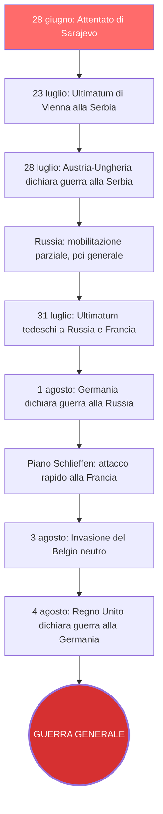
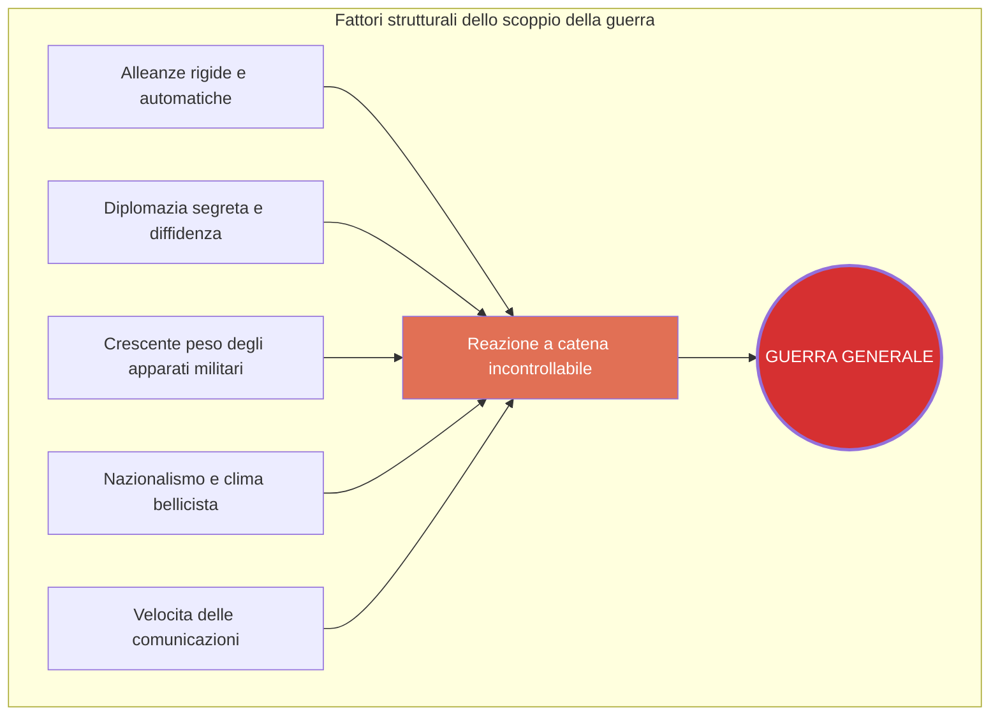
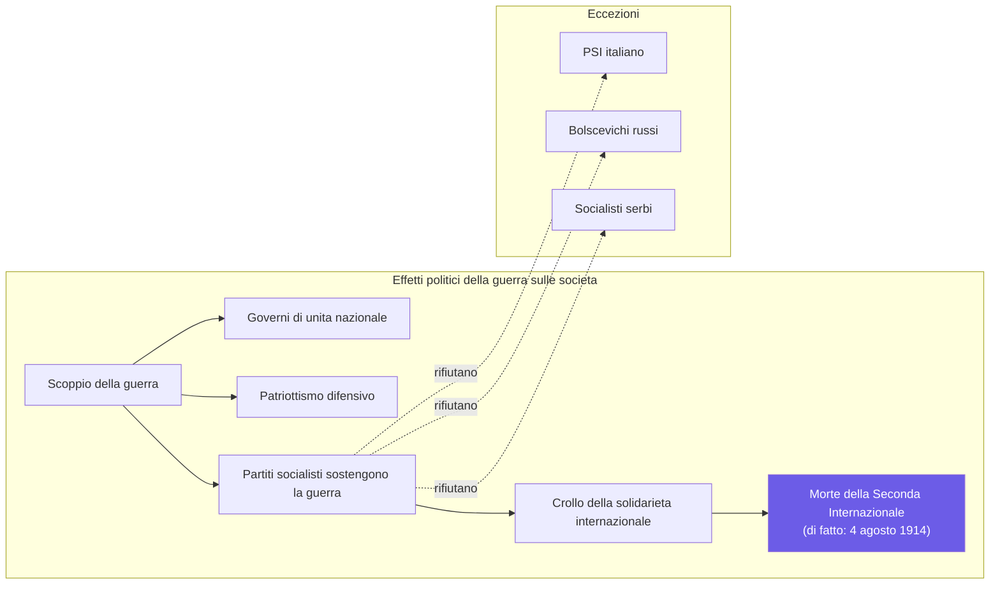
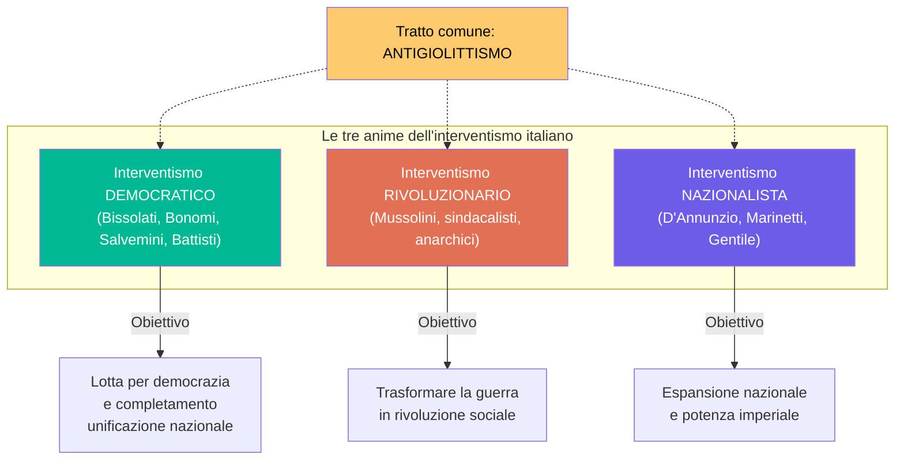
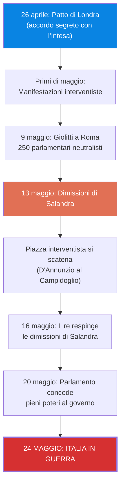
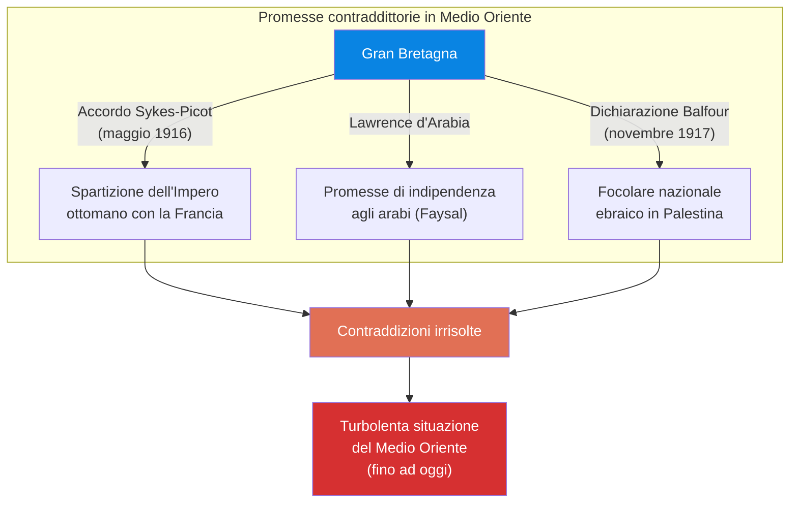
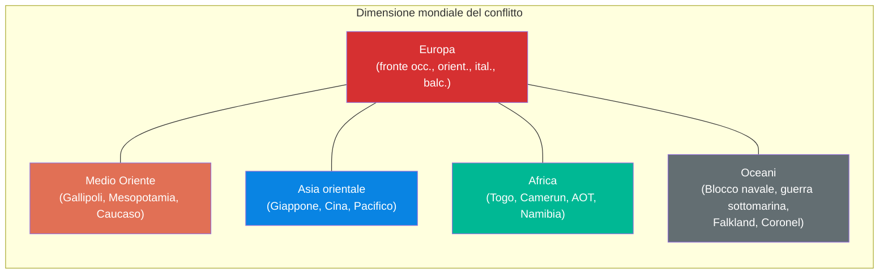
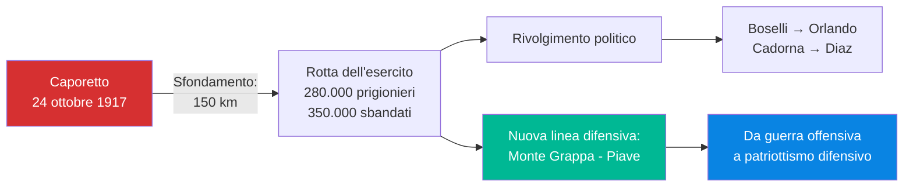
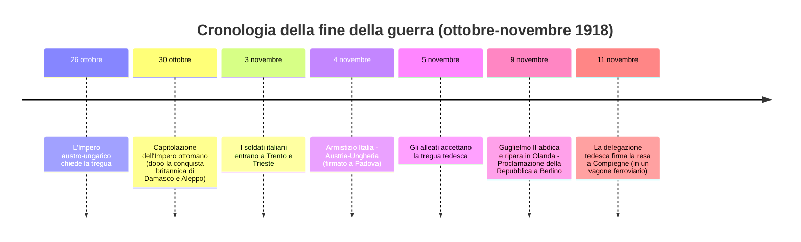
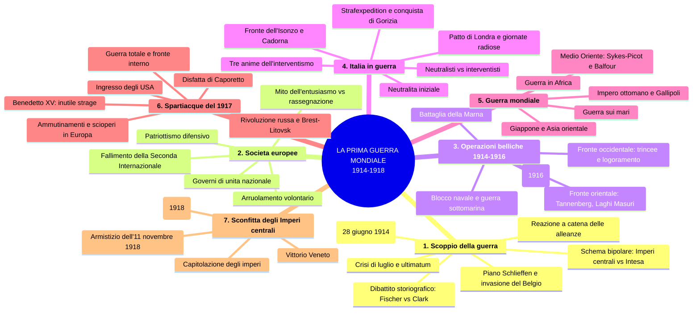

# Schema di Studio - Capitolo 3.5: La Prima guerra mondiale (Condensato)

---

## 1. Come scoppia una guerra?

### 1.1 La scintilla di Sarajevo e la crisi di luglio

Il **28 giugno 1914**, a **Sarajevo** (Bosnia-Erzegovina, annessa dall'Austria-Ungheria nel **1908**), lo studente serbo **Gavrilo Princip** assassinò l'**arciduca Francesco Ferdinando** e la moglie **Sofia**. L'attentato fu organizzato dalla **Ujedinjenje ili smrt!** (*«Unione o morte!»*), associazione segreta irredentista nota come **Mano Nera**, con l'appoggio di circoli militari estremisti. L'obiettivo era far naufragare il progetto di una **monarchia «trialistica»** (un terzo polo slavo con Zagabria), che avrebbe minato l'aspirazione del **nazionalismo serbo** a un «regno degli slavi» guidato da Belgrado. Princip fu condannato a **vent'anni di carcere**.

Vienna scelse una **linea dura**: il nazionalismo serbo andava umiliato. La **Penisola Balcanica** era cruciale per la **partita geopolitica con la Russia** e per la **solidarietà interna dell'impero** asburgico, minacciata dai nazionalismi. La **Germania** garantì il **sostegno all'Austria**, essendo Vienna l'unico alleato capace di evitare l'isolamento tedesco (l'Italia era considerata potenza di **«secondo rango»**). Berlino accettava **rischi calcolati**, pensando che la Gran Bretagna — impegnata con la questione irlandese — non sarebbe intervenuta.

Il **23 luglio** Vienna presentò un **ultimatum** alla Serbia con **48 ore** di tempo, pretendendo di **partecipare alla repressione** delle organizzazioni segrete — ledendo la sovranità serba. Più che un passo diplomatico, era un pugno battuto sul tavolo.

> [!note] Dalla lezione
> L'ultimatum era deliberatamente scritto perché i serbi lo rifiutassero: come se l'Italia pretendesse di inviare proprie equipe investigative in un altro Stato sovrano. L'Austria, forte dell'appoggio tedesco, voleva un pretesto per la guerra.

La Serbia accondiscese **eccetto sulle clausole che minavano la sovranità**, ma il **25 luglio** Vienna ruppe le relazioni. Il **28 luglio** l'**Austria-Ungheria dichiarò guerra alla Serbia**. La Russia avviò una **mobilitazione parziale**.

> **Mobilitazione**: operazioni con cui l'organizzazione militare passa dall'assetto di pace a quello di guerra. È **«generale»** quando comprende tutte le forze armate, **«parziale»** se riguarda solo alcune unità.

### 1.2 Nel precipizio della guerra generale

Quando la Russia passò alla **mobilitazione generale**, il **31 luglio** Berlino inviò due **ultimatum**: alla **Russia** (revocare la mobilitazione) e alla **Francia** (dichiararsi neutrale). Entrambi respinti: era in gioco lo status di potenza e la tenuta dell'alleanza. Il **meccanismo di reazione a catena** era attivato.

L'accelerazione venne dal **piano Schlieffen** (adottato nel **1905**): offensiva rapida contro la Francia attraverso Belgio e Lussemburgo, prima che la Russia completasse la mobilitazione, per poi trasferire le truppe a est via ferrovia.

| Data | Evento |
|------|--------|
| **1 agosto** | La Germania dichiara guerra alla **Russia** |
| **3 agosto** | La Germania dichiara guerra alla **Francia** e invade il **Belgio** neutro |
| **4 agosto** | Il **Regno Unito** dichiara guerra all'Impero tedesco |

La violazione della neutralità belga e la minaccia ai porti del Mare del Nord spinsero il Regno Unito — fino ad allora titubante — a entrare in guerra. Il legame britannico con il Belgio era anche dinastico: la regina **Vittoria** aveva trascorso anni in esilio in Belgio [Lezione].

> [!note] Dalla lezione
> Il primo a violare la neutralità di un paese in età moderna fu **Cavour** nel **1859**, invadendo i piccoli ducati dell'Italia centrale. La Germania seguiva una logica analoga.

### 1.3 Un esito preparato ma non previsto

La guerra non era voluta nemmeno da Austria e Germania (cui fu attribuita tutta la **responsabilità**), ma la scintilla di Sarajevo fece divampare l'incendio perché il terreno era infiammabile — alimentato da quarant'anni di tensioni. Lo **schema bipolare** — Imperi centrali contro Triplice Intesa — si fondava su **alleanze irrigidite** con clausole segrete e scatto automatico, una **diplomazia** che aveva incrementato diffidenza e imprevedibilità, il **crescente peso degli apparati militari**, un **clima nazionalista e bellicista** alimentato dai governi, e la **nuova velocità delle comunicazioni** (telegrafi e treni) che aveva spiazzato i tempi della diplomazia rendendo inesorabili le macchine belliche.

### 1.4 Il dibattito storiografico sulle responsabilità

La **responsabilità della Germania** fu iscritta nell'**articolo 231 del Trattato di Versailles** (1919): ***«Vae victis»*** — l'attribuzione della colpa fu anzitutto una narrativa dei vincitori [Lezione]. Lo storico tedesco **Fritz Fischer** (1908-1999) in **Assalto al potere mondiale** (1961) sostenne che la guerra era stata programmata dalle élite guglielmina per il potere mondiale. Lo storico australiano **Christopher Clark** (1960) ha sottolineato invece che il collasso del sistema fu un insieme di calcoli, azzardi, errori e circostanze casuali. Oggi la domanda sul **«come»** ha sostituito quelle sul «chi» e sul «perché».

**Stefan Zweig**, presente a Baden quando giunse la notizia, notò che non vi era particolare sdegno; solo dopo una settimana affiorarono nei giornali accenni polemici troppo all'unisono per essere casuali.

---

## 2. Le società europee di fronte alla guerra

### 2.1 Tra entusiasmo, rassegnazione e governi di unità nazionale

L'immagine di un **entusiasmo collettivo** (cortei festanti, fiori nei fucili) è stata in parte **mitizzata**. Ambienti acculturati e associazioni nazionaliste erano entusiasti, ma la **maggioranza degli europei** era **rassegnata**. Fino a poche ore dalle ostilità, si levarono voci di opposizione: movimento operaio, femministe, Chiese protestanti, liberali e mondo degli affari in Gran Bretagna. Dal **1 agosto**, con le mobilitazioni, si diffuse un **patriottismo difensivo**: ogni governo presentò il proprio Paese come **vittima di un'aggressione**.

L'**arruolamento volontario** fu un indicatore dell'adesione:

| Paese | Volontari (agosto 1914) | Note |
|-------|------------------------|------|
| **Francia** | 150.000 - 200.000 | ~300.000 a fine 1914 |
| **Germania** | 150.000 - 200.000 | ~300.000 a fine 1914 |
| **Gran Bretagna** | Il più alto numero | Non vigeva l'obbligo di leva (introdotto nel **1916**) |

Molti **giovani borghesi** e intellettuali si arruolarono spinti dall'**idealizzazione della guerra** (eroismo, cameratismo virile, rifiuto dell'angustia borghese). **Operai e contadini**, invece, erano pervasi da sgomento e rassegnazione.

Sul piano politico si formarono **governi di «unità nazionale»**: in Francia ***Union sacrée***, in Germania ***Burgfrieden***. I **poteri del governo** si ampliarono a scapito del Parlamento, lo Stato accentuò i **tratti autoritari**. Anche i **principali partiti socialisti** sostennero la guerra (patriottismo difensivo e timore dell'isolamento): la **Seconda Internazionale** si sciolse formalmente nel **1916**, ma di fatto morì il **4 agosto 1914**. Eccezioni: **PSI italiano**, **bolscevichi** russi, **socialisti serbi**.

---

## 3. Le operazioni belliche in Europa (1914-1916)

### 3.1 Il fronte occidentale e la guerra di trincea

Ai primi d'agosto milioni di soldati furono schierati grazie a **reti ferroviarie** efficienti. Solo il **22 agosto** l'esercito francese contò **27.000 vittime**. L'avanzata tedesca verso Parigi fu fermata nella **battaglia della Marna** (**5-11 settembre**): **fallimento del piano Schlieffen** e fine della guerra rapida. Iniziava la **guerra di logoramento**. Il fronte si stabilizzò su **720 chilometri** di **trincee**.

Le **condizioni in trincea erano terribili**: fango, ratti, parassiti, odori di feci e cadaveri nella **terra di nessuno**, epidemie di tifo e colera, vitto intermittente, tensione costante. Il sistema di fossati si estendeva per migliaia di chilometri con molteplici linee, dal primo avamposto alle retrovie.

> **Terra di nessuno** (*No man's land*): l'area tra due trincee nemiche, tenuta sgombra dal fuoco delle mitragliatrici e artiglierie.

> [!note] Dalla lezione
> La trincea generò capolavori letterari: *Niente di nuovo sul fronte occidentale* di **Erich Maria Remarque** (pacifista), *Addio alle armi* di **Ernest Hemingway** (umanitario), *Nelle tempeste d'acciaio* di **Ernst Jünger** (estetizzante). Tre voci diverse della stessa tragedia.

> [!note] Dalla lezione
> Con quale coraggio i soldati uscivano dalla trincea sapendo cosa li attendeva? Come potevano i generali ordinare **assalti insensati** per tre anni e mezzo — Verdun, Somme, Isonzo — accumulando un milione e mezzo di morti nel solo 1916? Disciplina e obbedienza rendevano possibile l'impossibile.

### 3.2 Fronte balcanico, fronte orientale e guerra navale

Nei **Balcani** la Serbia cadde nell'**autunno 1915**, dopo l'ingresso della **Bulgaria** con gli Imperi centrali. Sul **fronte orientale**, i tedeschi sventarono l'attacco russo vincendo a **Tannenberg** e ai **Laghi Masuri** (agosto-settembre 1914); i russi prevalsero sugli austriaci in **Galizia**. Dalla primavera 1915 l'esercito asburgico mostrò crepe: **diverse nazionalità** e **aspirazioni all'indipendenza** minavano la coesione. Il primo anno si chiuse con un'avanzata austro-tedesca in **Polonia russa** e **territori baltici**, ma anche a est il conflitto era diventato **guerra di logoramento**.

Il **Regno Unito** stabilì un **blocco nel Mare del Nord**. Dal **febbraio 1915** i tedeschi risposero con i **sommergibili** contro i mercantili britannici.

> [!note] Dalla lezione
> La guerra sottomarina era la **versione degradata e disperata** della *Weltpolitik*: fallito il progetto di una grande flotta oceanica, il sommergibile diventava l'unico mezzo per proiettare potenza navale nell'Atlantico.

I risultati furono **controproducenti**: l'affondamento del **«Lusitania»** (**maggio 1915**, **1198 vittime**, **129** statunitensi) indignò l'opinione pubblica. Washington fece pressioni e i tedeschi fermarono la campagna in **settembre**.

### 3.3 Verdun, la Somme e la situazione a fine 1916

Gli Imperi centrali, isolati dai mercati mondiali, soffrivano **penuria di risorse**. Dal **gennaio 1915** la Germania introdusse i **razionamenti** (a partire dal pane).

> **Razionamento**: distribuzione controllata dei generi di prima necessità, imposta in tempo di guerra.

Nel **1916** i vertici militari cercarono di forzare il conflitto **senza un piano comune**: i tedeschi puntavano sulla Francia, gli austriaci sull'Italia.

A **febbraio 1916** i tedeschi attaccarono **Verdun** (Lorena): **dieci mesi** di combattimenti, **~2.300.000 soldati** impiegati, almeno **300.000 morti**, **400.000 feriti**, **~700.000 vittime totali**, **10 milioni di proiettili**. Le offensive russe a est e britanniche sulla **Somme** (luglio-novembre, oltre **un milione di perdite**) impedirono ai tedeschi di concentrare tutte le truppe. Verdun divenne **«capitale della guerra totale»**: **sei villaggi rasi al suolo** mai ricostruiti, una **catastrofe ambientale**. Nel **1920** vi fu scelto il **milite ignoto** e iniziò la costruzione dell'**ossario di Douaumont** (15.000 tombe).

A fine 1916 gli austriaci persero l'**autonomia militare** (iniziativa in mani tedesche). La **Russia** aveva perso **un milione di soldati** e dovette estendere il fronte di **320 chilometri** dopo l'**invasione della Romania** (entrata in guerra con l'Intesa nell'**agosto 1916**). La **Turchia** era con gli Imperi centrali dal **novembre 1914**. Gli Imperi centrali apparivano **in vantaggio**, occupando gran parte di Romania, Belgio, Serbia, Lettonia, l'intero Montenegro, la Francia nord-orientale, la Polonia russa e la Lituania.

---

## 4. L'Italia in guerra (1915-1916)

### 4.1 L'Italia neutrale: neutralisti e interventisti

L'Italia era legata a Germania e Austria-Ungheria nella **Triplice Alleanza** (dal **1882**), con legami economici con Berlino ma **tensioni crescenti con Vienna** per il Risorgimento, le **terre irredente** (**Trento e Trieste**) e l'**egemonia sull'Adriatico** dopo la crisi bosniaca del **1908**. Poiché l'alleanza aveva **carattere difensivo**, il **2 agosto** il governo **Salandra** dichiarò la **neutralità** — atto pragmatico, non preludio all'intervento.

Seguirono **dieci mesi** di scontro tra **neutralisti** e **interventisti** — una **frattura** unica rispetto agli altri Paesi.

| Componente neutralista | Motivazione |
|------------|-------------|
| **Socialisti (PSI)** | Fedeltà all'Internazionale; incongruenza tra guerra e valori socialisti |
| **Cattolici** e **Santa Sede** | Papa **Benedetto XV** (settembre 1914) favoriva la neutralità; no al conflitto tra popolazioni cattoliche |
| **Giolitti e liberali giolittiani** | L'Italia non era pronta; lo sviluppo economico sarebbe stato compromesso |

Giolitti sostenne che restando neutrale l'Italia avrebbe ottenuto **«parecchio»** — parola che gli attirò critiche feroci come simbolo di un'*Italietta* provinciale [Lezione]. La **maggioranza della popolazione** non voleva la guerra.

> [!note] Dalla lezione
> Giolitti prevedeva correttamente una guerra lunga, ma la neutralità economica era un'illusione strutturale: l'industria italiana dipendeva da **materie prime importate** — **carbone** da Gran Bretagna e Germania, **ferro** dalla Francia, **lana** dalla Gran Bretagna. Una guerra totale avrebbe tagliato gli approvvigionamenti.

### 4.2 Le tre anime dell'interventismo

Gli interventisti volevano la guerra **a fianco dell'Intesa**, uniti dall'**antigiolittismo**.

**Interventismo «democratico»** (**Bissolati**, **Bonomi**, **Salvemini**, **Battisti**): guerra come lotta contro l'autoritarismo per democrazia e **completamento dell'unificazione nazionale** nel rispetto dei diritti delle altre nazionalità. Questo *framing* sarebbe stato ripreso da **Wilson** nel 1917 [Lezione]. Il geografo trentino **Cesare Battisti**, irredentista e socialista suddito asburgico, si arruolò volontario; catturato nel **maggio 1916**, fu **giustiziato come traditore** a Trento.

**Interventismo «rivoluzionario»** (anarchici, **sindacalismo rivoluzionario**, **Benito Mussolini**): trasformare la guerra capitalista in **guerra rivoluzionaria**. Mussolini — massimalista, direttore dell'«Avanti!», pacifista fino alla crisi di luglio — **ruppe con il PSI** e fondò **«Il Popolo d'Italia»**.

**Interventismo «nazionalista»** (**D'Annunzio**, **Marinetti** e i futuristi, **Gentile**, rivista **«La Voce»**): la guerra come aspirazione intrinseca alla visione ideologica, espansione e potenza.

Sebbene **minoritario**, l'interventismo dettò l'agenda pubblica, con l'appoggio di intellettuali, del **«Corriere della Sera»** e della **piazza**.

### 4.3 Il Patto di Londra e le giornate del maggio 1915

**Salandra** e il ministro degli Esteri **Sidney Sonnino**, con il re **Vittorio Emanuele III**, conclusero le trattative con l'Intesa. Il **26 aprile 1915** fu stipulato il **Patto di Londra** (accordo segreto): l'Italia entrava in guerra entro un mese. In cambio: **Trentino** fino al **Brennero**, **Trieste** e **Istria** (senza Fiume), **Dalmazia**, protettorato sull'**Albania**, compensi coloniali.

Il **9 maggio** **Giolitti** tornò a Roma: **250 parlamentari** gli recapitarono biglietti da visita (fedeltà neutralista). Il **13 maggio** Salandra si dimise, scatenando manifestazioni interventiste; **D'Annunzio** al Campidoglio incitava alla violenza per impedire che «la Patria si perda». Il **16 maggio** il re **respinse le dimissioni**; il **20 maggio** il Parlamento concesse **pieni poteri** (contrari solo i socialisti: **«né aderire né sabotare»**). Le **«giornate radiose»** furono l'apice della **strategia extraistituzionale**: esautorazione del Parlamento mediante piazza, intimidazione e violenza — qualcosa che si sarebbe ripresentato con il **fascismo**.

### 4.4 Il fronte italiano e la Strafexpedition

Il **24 maggio 1915** l'Italia entrò in guerra contro l'Austria-Ungheria (contro la Germania solo nell'**agosto 1916**). Quasi **un milione e centomila soldati** iniziali (alla fine quasi **6 milioni** mobilitati, oltre 4 al fronte), ma **inadeguati** per artiglieria e munizioni. Il fronte si aprì lungo il **confine nord-orientale**, dal Trentino all'Adriatico: **guerra di posizione in montagna**, con trincee nella roccia, condizioni climatiche estreme. In Trentino e sulle Dolomiti i combattimenti superavano i **2000 metri**: la **«Guerra Bianca»**, di cui restano gallerie e rifugi ancora oggi percorribili [Lezione].

Gli **austriaci**, in inferiorità numerica, sfruttavano **armi migliori** e **postazioni difensive**. Il capo di Stato maggiore **Luigi Cadorna** (1850-1928) predispose attacchi massicci **sull'Isonzo** verso Lubiana e Vienna. Tra giugno e dicembre 1915: **quattro battaglie**, **180.000 perdite italiane**, **140.000 austriache**, guadagni insignificanti.

Il **15 maggio 1916** gli austriaci lanciarono la ***Strafexpedition*** («spedizione punitiva» per il «tradimento» della Triplice Alleanza). Avanzarono di **venti chilometri** in Valsugana, sull'**altopiano di Asiago** e in **val d'Astico**, ma lo sforzo li logorò e l'offensiva russa in Galizia li obbligò a spostare divisioni. Il **16 giugno** l'offensiva fu interrotta. **Salandra** si dimise; **Paolo Boselli** formò un **governo di unità nazionale** con **Bissolati**, **Bonomi** e il cattolico **Filippo Meda** (escluso il PSI).

Il **6 agosto** la **sesta battaglia dell'Isonzo** portò alla **conquista di Gorizia** (effetto sorpresa, artiglieria adeguata, contingente austriaco indebolito) — ma a **perdite enormi** e senza reali cambiamenti strategici.

> **«Gorizia tu sei maledetta»**: canto di protesta dei soldati contro la strategia del comando sull'Isonzo, consacrato nel **1964** al Festival dei Due Mondi di Spoleto come una delle più note canzoni antimilitariste italiane.

---

## 5. Una guerra mondiale

### 5.1 Dall'Europa al mondo: l'Impero ottomano e Gallipoli

La guerra assunse un profilo mondiale: **due Imperi euroasiatici** (russo e ottomano), due **potenze extraeuropee** (Giappone, USA), e le **colonie** come parte costitutiva dei sistemi economici e riserva di reclute.

Il **29 ottobre 1914** l'Impero ottomano entrò con gli **Imperi centrali**, legato alla Germania anche dal progetto della **ferrovia Berlino-Costantinopoli-Baghdad** (il tratto fino a Costantinopoli fu realizzato, il resto incompiuto). Per i **britannici**, la presenza tedesca nel Golfo Persico era un'enorme ansia strategica [Lezione]. I turchi attaccarono la Russia sul **Caucaso**; tra 1915-1916 i russi penetrarono fino a **Trebisonda**, **Erzerum** e al **lago di Van**. In questo contesto maturò il **genocidio della minoranza armena**.

Nell'**aprile 1915**, **75.000 soldati** alleati sbarcarono sulla **Penisola di Gallipoli** per i Dardanelli: otto mesi sanguinosi, poi il ritiro (**settembre 1915 - gennaio 1916**). Perdite ottomane: **251.000** (con **87.000 morti**); Intesa: **141.000**. Per i turchi, l'eroe fu il colonnello **Mustafa Kemal**, futuro fondatore della Repubblica turca.

### 5.2 Il Medio Oriente: promesse contraddittorie

In **Mesopotamia** truppe britanniche (perlopiù indiane) puntarono su Baghdad (**settembre 1915**). L'ufficiale **Thomas Edward Lawrence** (**Lawrence d'Arabia**) guidò la rivolta araba con **Faysal**, figlio dell'emiro della Mecca (film di **David Lean** nel **1962** [Lezione]). Nel **1917**: **Baghdad** (marzo) e **Gerusalemme** (dicembre) conquistate.

Nel **maggio 1916** l'**accordo segreto Sykes-Picot** (negoziatori **Mark Sykes** e **François Georges-Picot**) stabilì la spartizione dell'Impero ottomano tra Francia e Gran Bretagna. Il **2 novembre 1917** la **dichiarazione Balfour** impegnava la Gran Bretagna a favorire un **«focolare nazionale ebraico»** in Palestina — momento chiave per il **movimento sionista** di **Theodor Herzl**. Queste promesse contraddittorie avviarono la **turbolenta situazione del Medio Oriente** che perdura fino ad oggi.

### 5.3 Asia, mari e Africa

Il **Giappone**, alleato britannico dal **1902**, il **23 agosto 1914** dichiarò guerra alla Germania, occupando le isole **Marianne**, **Caroline**, **Marshall** e la penisola di **Shandong**. Mirò poi all'**egemonia sulla Cina**. Fino al 1917 bloccò l'ingresso cinese in guerra; la Cina, pur neutrale, inviò **150.000 operai** in Europa. Il Giappone proiettò i suoi **interessi verso il Pacifico**, in potenziale conflitto con gli USA — superando l'**eurocentrismo** della politica internazionale.

La squadra navale tedesca del Pacifico vinse a **Coronel** (Cile) ma fu **annientata** alle **isole Falkland** (**dicembre 1914**). Dal **gennaio 1915** il pericolo tedesco in superficie era debellato.

In **Africa** la guerra si estese su tre fronti. **Togo** conquistato nell'**agosto 1914**, **Camerun** nel **febbraio 1916**. L'**Unione Sudafricana** conquistò l'**Africa sud-occidentale** tedesca (Namibia) nel **maggio 1915**. Il fronte più importante fu l'**Africa orientale tedesca** (Tanzania, Ruanda, Burundi): **14.000 tedeschi** contro **160.000 britannici**, più truppe belghe e sudafricane (**30.000** dal 1916). Il contingente tedesco resistette fino al **novembre 1918**.

| Dato (Africa orientale)                        | Cifra                                   |
| ---------------------------------------------- | --------------------------------------- |
| Soldati coinvolti                              | ~200.000                                |
| Morti britannici (gran parte indigeni/indiani) | 10.000                                  |
| Morti sudafricani bianchi                      | 1.600                                   |
| Morti truppe tedesche (in larga parte ascari)  | 11.500                                  |
| Portatori britannici reclutati                 | ~1.000.000                              |
| Portatori belgi reclutati                      | 250.000                                 |
| Portatori britannici morti                     | ~100.000                                |
| Vittime civili AOT durante la guerra           | ~650.000 (quasi 1/10 della popolazione) |
|                                                |                                         |

Le **colonie italiane** non furono coinvolte direttamente; la guerra europea indebolì il controllo su Somalia e Libia.

---

## 6. Lo spartiacque del 1917

### 6.1 Una «guerra totale» e il fronte interno

L'economia era diventata **economia di guerra**; l'intera nazione sosteneva lo sforzo bellico: era una **guerra totale**. Più di **70 milioni di uomini** mobilitati — la **«produzione in serie»** taylorista-fordista trovava il suo correlato bellico [Lezione].

> [!note] Dalla lezione
> Nasce l'**«uomo massa»** del XX secolo. **Kafka** nelle *Metamorfosi* (1915) rappresenta l'individuo trasformato in insetto: metafora della spersonalizzazione che la Grande Guerra accelerò, facendo di milioni di uomini entità intercambiabili.

> **Economia di guerra**: misure straordinarie per potenziare la produzione bellica e controllare la distribuzione di rifornimenti e beni di prima necessità.

I governi usarono **apparati coercitivi** e **propaganda** (patriottismo), offrendo **promesse** (terre, sussidi, pensioni). L'espressione **«fronte interno»** riconosceva il ruolo decisivo delle società mobilitate. Dal **1916** i fronti interni cedevano per **carenza di approvvigionamenti**.

### 6.2 Crepe negli Imperi centrali e la rivoluzione russa

In Germania e Austria-Ungheria: **scioperi** e proteste operaie. L'**Ungheria** aveva ridotto le derrate agricole all'Austria; le **spinte centrifughe delle nazionalità** puntavano alla dissoluzione dell'impero multinazionale.

Il primo cedimento del fronte interno fu in Russia nel **febbraio 1917**: **scioperi** e **ammutinamenti** abbatterono il sistema zarista. Il governo provvisorio tentò di proseguire la guerra, ma in **ottobre** i **bolscevichi** presero il potere. Il **3 dicembre** iniziarono le trattative a **Brest-Litovsk**, concluse il **3 marzo 1918**: la **pace di Brest-Litovsk** comportava l'**uscita dalla guerra** con pesanti cessioni (Polonia, Finlandia, Paesi baltici, Ucraina, Bessarabia, Crimea) e danni di guerra in petrolio, cereali, macchinari e armi.

> [!note] Dalla lezione
> I territori persi a Brest-Litovsk sono sovrapponibili a quelli persi dall'URSS nel **1991**. Parte di essi — Ucraina orientale, Crimea — è oggi oggetto dell'**espansionismo putiniano**. La fascia dalla Finlandia al Caucaso resta la zona di maggiore instabilità dell'Europa.

### 6.3 Riverberi in Europa e l'«inutile strage»

Nell'esercito francese: almeno **250 ammutinamenti** (maggio-luglio 1917). **Robert Nivelle** fu sostituito da **Philippe Pétain**, che migliorò le condizioni e abbandonò l'offensivismo. Nel **novembre 1917** finì l'*Union sacrée*; **Georges Clemenceau** formò un esecutivo di intransigenza bellica. In Germania veniva meno la *Burgfrieden*; nella **SPD** si consumò la **scissione** pacifista.

Nell'**agosto 1917** papa **Benedetto XV** definì la guerra una **«inutile strage»**. L'appello cadde nel vuoto, ma avviò l'elaborazione di un pensiero sulla pace della Santa Sede, generando nel corso del Novecento un **movimento per la pace** nel cattolicesimo.

### 6.4 L'Italia: Torino, Caporetto e la svolta

Nell'**agosto 1917** a **Torino** (500.000 abitanti, **100.000** operai) la **mancanza di pane** scatenò una rivolta di **donne** e operai: barricate, saccheggi, repressione dell'esercito con **diverse decine di morti**.

Il **24 ottobre** gli austriaci attaccarono a **Caporetto** (oggi in Slovenia): **il fronte cedette di schianto**, un'avanzata di **150 chilometri** dopo due anni e mezzo di minimi spostamenti.

| Dato | Cifra |
|------|-------|
| **Prigionieri** | 280.000 |
| **Militari sbandati** | 350.000 |
| **Morti** | 11.000 |
| **Feriti** | 29.000 |
| **Civili in fuga** | 400.000 |

In due settimane l'esercito si attestò sulla **linea del monte Grappa e del Piave**. «Caporetto» divenne sinonimo di **«tracollo»**.

**Boselli** fu sostituito da **Vittorio Emanuele Orlando**; **Cadorna** — che accusava i soldati di codardia e i socialisti di **disfattismo** — fu rimosso per il generale **Armando Diaz** (1861-1928).

> **Disfattismo** (dal francese *défaitisme*): termine coniato nel **1915** per indicare chi ostacola la vittoria del proprio Paese.

Diaz introdusse attenzione per le condizioni dei soldati e il motto **«resistere, resistere, resistere»** [Lezione]. Fu istituito il **«servizio P»** di propaganda per risollevare il morale.

> [!note] Dalla lezione
> Il motto di Diaz richiama il **«imposte, imposte, null'altro che imposte»** di **Quintino Sella** dopo il 1866: ossessiva ripetizione che traduce drammaticità e necessità di disciplina assoluta.

**Il dibattito su Caporetto.** L'esercito italiano aveva una **disciplina vessatoria**:

| Dato | Cifra |
|------|-------|
| Condanne a morte comminate | Oltre **1.000** |
| Condanne a morte eseguite | **750** |
| Fucilazioni sommarie appurate | Almeno **300** |

Più la **decimazione** (fucilazione «esemplare» di un soldato ogni dieci) — numeri proporzionalmente molto superiori agli altri eserciti dell'Intesa. Oggi la storiografia interpreta Caporetto come autentica **sconfitta militare**: Cadorna non aveva approntato difese adeguate; il fronte era sbilanciato all'offensiva. Non fu ribellione sociale (gli stessi reparti sbandati combatterono pochi giorni dopo), ma il **logoramento** e l'**estraneità dei soldati** alle ragioni della guerra contribuirono alle dimensioni della rotta.

### 6.5 Il fattore Stati Uniti

Gli USA rifornivano l'Intesa di capitali, armi e alimenti.

> [!note] Dalla lezione
> Non era il **governo federale** a commerciare, ma le **imprese private**: armi dalla **Colt**, grano dalle società agricole, capitali tramite la banca **JP Morgan** di New York. Se Francia e Gran Bretagna avessero perso, quei dollari sarebbero andati perduti — la vittoria dell'Intesa era un interesse vitale per la finanza americana.

**Wilson** (democratico, presidente dal **1913**) mantenne la neutralità nel **1914** per calcoli elettorali (grandi comunità tedesche, irlandesi, ebree, svedesi ostili all'Intesa) e per la distanza dall'Europa. La guerra divenne un **affare per l'economia USA**, che **raddoppiò le esportazioni**.

> [!note] Dalla lezione
> Francia e Gran Bretagna, avendo abbandonato il *Gold Standard*, dovevano pagare in **dollari** o **oro**, producendo un **flusso massiccio di oro** verso gli USA — base della futura supremazia finanziaria americana.

### 6.6 Gli Stati Uniti in guerra

Rieletto nel **novembre 1916**, Wilson ruppe con Berlino quando a inizio **1917** la Germania annunciò la **ripresa della guerra sottomarina**. La **libertà di navigazione** è un'**«invariante» permanente** della politica estera americana [Lezione].

> [!note] Dalla lezione
> I vertici tedeschi sapevano che la guerra sottomarina avrebbe provocato l'intervento USA, ma scommettevano su **12-18 mesi** per strangolare il commercio britannico prima dell'arrivo delle truppe americane. La scommessa fallì.

I tedeschi affondarono **tre mercantili statunitensi** e gli USA intercettarono un **telegramma** tedesco al **Messico** per convincerlo a dichiarare guerra agli USA. Il **6 aprile 1917** gli USA entrarono in guerra come **potenza associata all'Intesa**. Wilson presentò l'intervento come **democrazia contro militarismo**, fondandolo su **universalismo** ed **eccezionalismo** americano. L'**8 gennaio 1918** proclamò i **«quattordici punti»**.

> [!note] Dalla lezione
> Due punti erano esplosivi: il **Punto 5** sull'**autodeterminazione dei popoli coloniali** (attacco diretto a Francia e Gran Bretagna, che volevano espandere i loro imperi); il **Punto 14** sulla **Società delle Nazioni**, che nacque ma fallì, lasciando il posto all'ONU dopo il 1945.

---

## 7. La sconfitta degli Imperi centrali

### 7.1 Le ultime battaglie e la capitolazione

Dopo gli USA si associarono all'Intesa: **Brasile, Costarica, Cuba, Guatemala, Haiti, Honduras, Nicaragua, Panama** (Latinoamerica); **Liberia** (Africa); **Cina, Siam** (Asia). Il primo battaglione americano raggiunse la Francia nel **giugno 1917**.

Nella **primavera-estate 1918** i tedeschi, liberati dal fronte orientale, lanciarono offensive su Francia — verso i porti del Nord, sulla Somme, verso Parigi — bloccate dal crescente afflusso americano. Tra **metà luglio** e **primi d'agosto** l'Intesa sferrò **contrattacchi** che costrinsero i tedeschi a ripiegare verso il Belgio. Il **3 ottobre** il cancelliere **Max von Baden** chiese trattative.

Sul fronte italiano, l'offensiva austriaca del **giugno 1918** — la **«battaglia del solstizio d'estate»** secondo **D'Annunzio** [Lezione] — fallì. A **fine ottobre** l'esercito italiano attaccò lungo il Piave verso **Vittorio Veneto**: sfondamento delle linee austriache, favorito dallo sbandamento dell'esercito asburgico. A un anno da Caporetto, le parti si erano invertite.

La vittoria fu possibile per il **logoramento del nemico** e gli **approvvigionamenti garantiti dagli alleati**, in particolare dagli **Stati Uniti**.

---

## Cronologia riassuntiva

| Data | Evento |
|------|--------|
| **28 giugno 1914** | Attentato di Sarajevo: Gavrilo Princip assassina l'arciduca Francesco Ferdinando |
| **23 luglio 1914** | Ultimatum di Vienna alla Serbia |
| **28 luglio 1914** | L'Austria-Ungheria dichiara guerra alla Serbia |
| **1 agosto 1914** | La Germania dichiara guerra alla Russia |
| **3 agosto 1914** | La Germania dichiara guerra alla Francia, invade il Belgio |
| **4 agosto 1914** | Il Regno Unito dichiara guerra alla Germania |
| **23 agosto 1914** | Il Giappone dichiara guerra alla Germania |
| **Agosto-settembre 1914** | Battaglie di Tannenberg e dei Laghi Masuri (vittoria tedesca) |
| **5-11 settembre 1914** | Battaglia della Marna: fallimento del piano Schlieffen |
| **Settembre 1914** | Inizio del blocco navale britannico nel Mare del Nord |
| **29 ottobre 1914** | L'Impero ottomano entra in guerra con gli Imperi centrali |
| **Dicembre 1914** | Battaglia delle isole Falkland: distruzione della squadra navale tedesca |
| **Gennaio 1915** | La Germania introduce i razionamenti alimentari |
| **Febbraio 1915** | Inizio della guerra sottomarina tedesca |
| **Aprile 1915** | Sbarco alleato a Gallipoli |
| **26 aprile 1915** | Patto di Londra (accordo segreto Italia-Intesa) |
| **Maggio 1915** | Affondamento del transatlantico Lusitania (1198 vittime) |
| **13-20 maggio 1915** | «Giornate radiose»: crisi politica e pieni poteri al governo |
| **24 maggio 1915** | L'Italia entra in guerra contro l'Austria-Ungheria |
| **Autunno 1915** | Capitolazione della Serbia (con l'aiuto della Bulgaria) |
| **Settembre 1915 - Gennaio 1916** | Ritiro alleato da Gallipoli |
| **Febbraio-dicembre 1916** | Battaglia di Verdun (~700.000 vittime totali) |
| **Maggio 1916** | Strafexpedition austriaca in Trentino |
| **Maggio 1916** | Accordo segreto Sykes-Picot |
| **Giugno 1916** | Offensiva russa in Galizia |
| **Luglio-novembre 1916** | Battaglia della Somme (oltre 1 milione di perdite) |
| **6 agosto 1916** | Sesta battaglia dell'Isonzo: conquista italiana di Gorizia |
| **Agosto 1916** | La Romania entra in guerra con l'Intesa; dichiarazione di guerra italiana alla Germania |
| **Febbraio 1917** | Rivoluzione in Russia, abdicazione dello zar |
| **Marzo 1917** | Conquista britannica di Baghdad |
| **6 aprile 1917** | Gli USA entrano in guerra |
| **Maggio-luglio 1917** | 250 ammutinamenti nell'esercito francese |
| **Giugno 1917** | Primo battaglione americano in Francia |
| **Agosto 1917** | Rivolta di Torino per la mancanza di pane |
| **Agosto 1917** | Benedetto XV definisce la guerra «inutile strage» |
| **Ottobre 1917** | I bolscevichi prendono il potere in Russia |
| **24 ottobre 1917** | Disfatta di Caporetto: sfondamento austro-ungarico |
| **Novembre 1917** | Fine dell'Union sacrée in Francia; governo Clemenceau |
| **2 novembre 1917** | Dichiarazione Balfour sul «focolare nazionale ebraico» |
| **Dicembre 1917** | Conquista britannica di Gerusalemme |
| **8 gennaio 1918** | Wilson proclama i «Quattordici punti» |
| **3 marzo 1918** | Pace di Brest-Litovsk: la Russia esce dalla guerra |
| **Primavera-estate 1918** | Ultime offensive tedesche sul fronte occidentale |
| **Giugno 1918** | Offensiva austriaca in Italia: fallimento |
| **Luglio-agosto 1918** | Contrattacco dell'Intesa sul fronte occidentale |
| **3 ottobre 1918** | Il cancelliere Max von Baden chiede trattative |
| **Fine ottobre 1918** | Battaglia di Vittorio Veneto: sfondamento italiano |
| **30 ottobre 1918** | Capitolazione dell'Impero ottomano |
| **3 novembre 1918** | Soldati italiani a Trento e Trieste |
| **4 novembre 1918** | Armistizio Italia - Austria-Ungheria |
| **9 novembre 1918** | Abdicazione di Guglielmo II; proclamazione della Repubblica tedesca |
| **11 novembre 1918** | Resa della Germania a Compiègne: fine della Prima guerra mondiale |

---

## Mappa concettuale dell'intero capitolo

