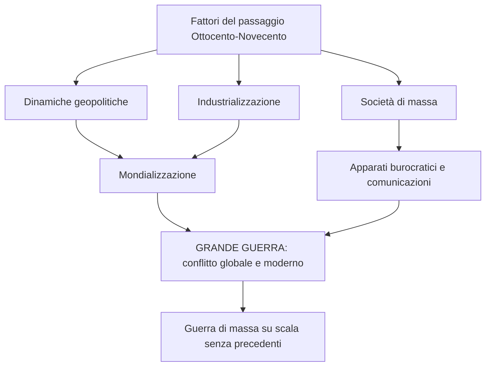
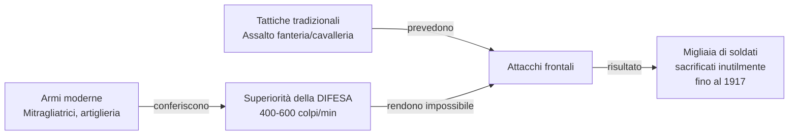
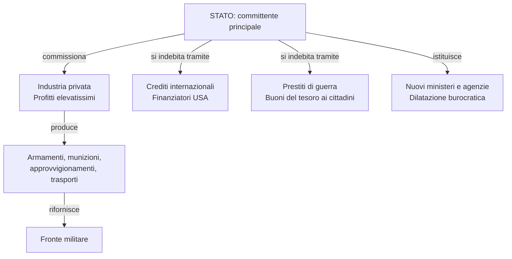
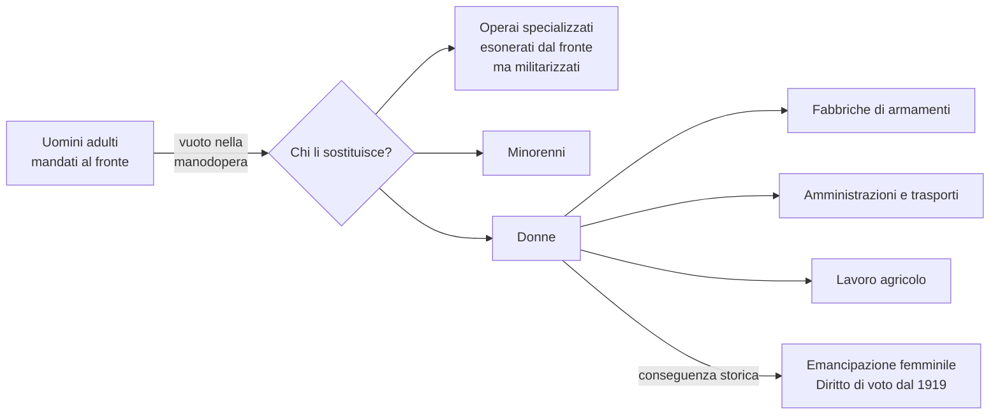
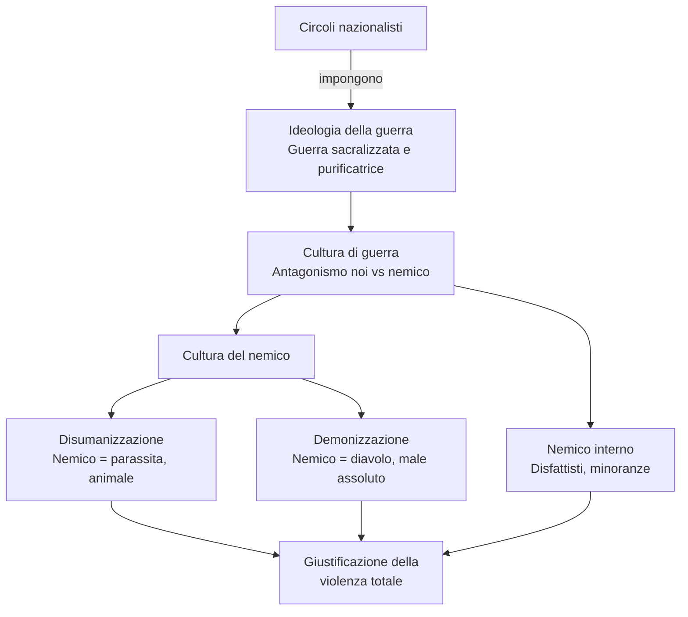
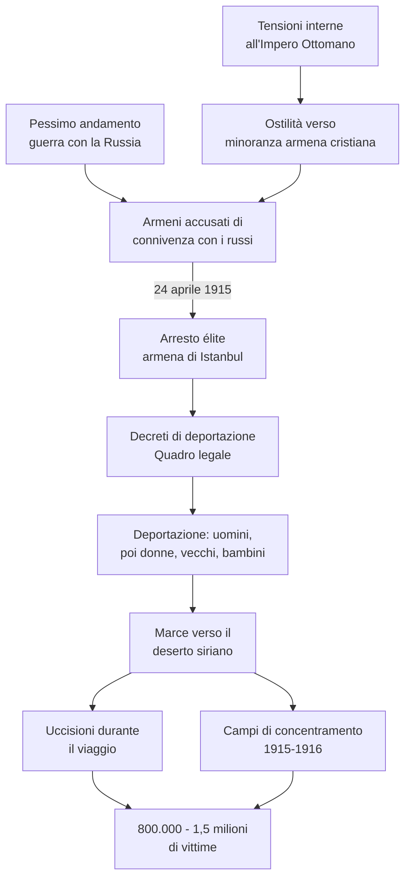
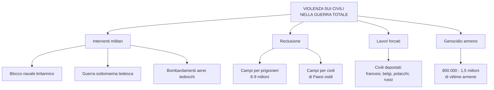
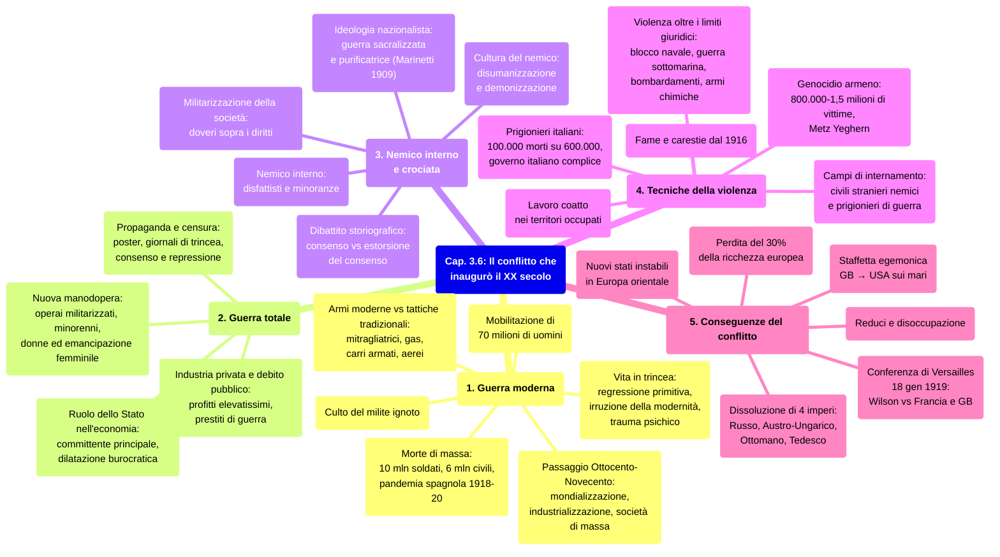

# Ripasso Veloce - Cap. 3.6: Il conflitto che inaugurò il XX secolo

---

## 1. La guerra «moderna»

### Mobilitazione di massa

- La WWI condensò il passaggio Ottocento→Novecento: mondializzazione, industrializzazione, società di massa, burocrazia
- Precedente: **guerra di secessione americana (1861-65)**, ma nella WWI tutto avvenne su scala incomparabilmente maggiore
- **70 milioni di uomini** mobilitati → soldati come ingranaggi, standardizzazione → accelerazione dell'**omologazione culturale**

### La vita in trincea

- **Trincee**: luogo principale di combattimento su fronte occidentale e italiano
- **Otto Dix** (pittore tedesco, volontario): «Pidocchi, ratti, granate, bombe, cadaveri, sangue, gas, cannoni, sporco, questa è la guerra»
- Duplice volto: **regressione primitiva** (vita semi-interrata, sporcizia, morte) + **irruzione della modernità** tecnologica
- Per milioni di soldati (soprattutto contadini) fu una formazione alla modernità industriale, ma distorta e distruttiva
- Conseguenze psichiche gravissime: incubi, flashback, impossibilità di ritorno alla normalità

### Armi moderne, tattiche tradizionali

- Armi con capacità distruttiva straordinaria → illusione di **guerra rapida**, ma in realtà superiorità strutturale della **difesa**
- Mitragliatrice: **400-600 colpi/min** → fanteria impossibilitata ad avanzare
- Fino al **1917**: attacchi frontali insensati con migliaia di sacrificati

- **Gas tossici (iprite)**: introdotti dai tedeschi a **Ypres**, poi adottati da tutti
- **Carri armati** (1916), **sommergibili**, **dirigibili Zeppelin**, **aerei** (ricognizione → bombardamenti)

### Morte di massa e milite ignoto

- **Oltre 10 milioni di soldati morti**, milioni di mutilati, **~6 milioni di civili**
- Morte anonima e seriale, non più eroica
- **1918-1920**: pandemia **«spagnola»** (nome dovuto alla censura di guerra: solo dalla Spagna neutrale arrivavano notizie)
- **Culto del milite ignoto**: salma non identificata sepolta in luogo simbolico — Parigi (Arco di Trionfo), Londra (Westminster), Roma (Vittoriano), Washington (Arlington)
- Italia: **Maria Bergamas** scelse un sarcofago ad **Aquileia**

---

## 2. La guerra «totale»

### Mobilitazione economica

- Stato = **committente principale** dell'apparato produttivo, intervento diretto
- Nuovi ministeri (armamenti, munizioni), agenzie per materie prime
- **Imprese private** convertite alla guerra → **profitti elevatissimi** (in Italia detti **"pescecani"**)
- Indebitamento enorme: **crediti internazionali** (Banca Morgan, garanzia britannica) + **prestiti di guerra** (buoni del tesoro ai cittadini)
- I ceti medi investirono in buoni del tesoro, rimborsati in moneta inflazionata → devastazione economica → **radicalizzazione politica** del dopoguerra

### Manodopera: minorenni e donne

- Operai specializzati esonerati dal fronte ma **militarizzati** (scioperare = ammutinamento)
- Mobilitati **minorenni** e soprattutto **donne**: fabbriche, amministrazioni, trasporti, campagne
- **National Filling Factory No. 6, Chilwell**: operaie produssero **19 milioni di proiettili**
- Conseguenza storica: **emancipazione femminile** → diritto di voto dal **1919** (Regno Unito)

### Propaganda e censura

- **Censura**: notizie filtrate, lettere dei soldati censurate
- **Propaganda**: poster, cartoline, cinema da campo, giornali di trincea, conferenze di intellettuali

---

## 3. Il «nemico interno» e la guerra come crociata

### Militarizzazione e ideologia

- L'esercito divenne modello del rapporto Stato-cittadini: **doveri, disciplina, obbedienza** sopra i diritti
- **Ideologia della guerra** dei circoli nazionalisti: guerra **sacralizzata e purificatrice**
- Marinetti, *Manifesto del futurismo* (**1909**): «guerra sola igiene del mondo»

### Cultura di guerra e del nemico

- Radicalizzazione: **«noi» vs «il nemico»**, civiltà vs barbarie, spirito da **crociata**
- Nemico **disumanizzato e demonizzato**: definito come parassita, animale, non umano
- **Nemico interno**: disfattisti, minoranze etniche/politiche → «corpi estranei»
- Meccanismo che giustificava la violenza totale: la causa presentata come **assoluta**

### Perché i soldati continuarono a combattere?

- **Audoin-Rouzeau e Becker**: consenso sostanziale e attivo, soldati e civili abbracciarono la «cultura di guerra»
- Critiche: sottovalutata la **repressione del rifiuto** («estorsione del consenso»); diari di soldati popolari attestano rifiuto e orrore
- **Bianchi**: forme di sottrazione (fraternizzazioni, autolesionismo, «fuga» nella follia) → «estraneità morale»
- **Procacci**: giustizia militare italiana più aspra degli altri eserciti
- **Isnenghi e Rochat**: resistenze contenute; la guerra fu combattuta fino in fondo

---

## 4. Tecniche della violenza

### Violenza senza limiti

- **Blocco navale britannico**: colpiva civili tedeschi (cibo e farmaci bloccati)
- **Guerra sottomarina tedesca**
- **Bombardamenti tedeschi** su coste inglesi, Londra, Parigi (1918)
- **Gas e armi chimiche**: trauma tale che non vennero replicate nella WWII

### Campi, prigionieri e fame

- Primi **campi di internamento** in Europa (precedenti: Cuba, Sudafrica)
- Due forme: campi per **civili stranieri nemici** + campi per **prigionieri di guerra** (8-9 milioni)
- Dal **1916**: grave penuria alimentare → carestie in Serbia, Montenegro, Albania, parte dell'Impero Russo

### Prigionieri italiani

- **100.000 morti su 600.000** prigionieri italiani in mano austro-ungarica (denutrizione, freddo)
- Governo e Comando supremo italiani **non inviarono cibo né indumenti**, bloccarono i pacchi delle famiglie
- Catturati (soprattutto a **Caporetto**) considerati disertori/traditori → non si voleva incentivare la diserzione

### Genocidio degli armeni

- Ostilità turca verso minoranza armena (**cristiana**) acuita nell'Ottocento
- Pessimo andamento della guerra con la Russia → armeni accusati di connivenza
- **Primavera 1915**: deportazione e sterminio coordinati dal governo (omogeneizzazione etnica)
- **24 aprile 1915**: arresto dell'élite armena di Istanbul
- Deportazioni estese a donne, vecchi, bambini → marce verso il **deserto siriano**
- Campi di concentramento **1915-1916**
- Vittime: **800.000-1,5 milioni** — ***Metz Yeghern*** («Grande Male»)
- Massacrate anche altre minoranze cristiane: siro-ortodossi, caldei, armeno-cattolici

> **«Genocidio»:** Atti commessi per distruggere un gruppo nazionale, etnico o religioso. Coniato nel **1944** da **Raphael Lemkin**; crimine ONU dal **1946**, *Convenzione* del **1948**.

---

## 5. Le conseguenze del conflitto

### Dissoluzione degli imperi

- Crollano **4 imperi**: Russo, Austro-Ungarico, Ottomano, Tedesco (Secondo Reich)
- Nuovi stati: Finlandia, repubbliche baltiche, Polonia, Cecoslovacchia, Regno dei Serbi/Croati/Sloveni (Jugoslavia)
- Austria e Ungheria ridotte a piccole repubbliche
- Confini impossibili da tracciare nettamente → minoranze ovunque (tedeschi in Cecoslovacchia → crisi 1938; ungheresi in Romania; germanofoni in Alto Adige)
- Seguì una serie di **piccole guerre alla fine della guerra grande**

### Declino europeo e Conferenza di Versailles

- Perdita del **30% della ricchezza** europea
- **Staffetta egemonica** Gran Bretagna → Stati Uniti (egemonia sui mari)
- **18 gennaio 1919**: Conferenza di Versailles (data scelta come rivincita: il 18 gennaio 1871 fu proclamato il Secondo Reich a Versailles)
- **Wilson e i 14 punti**: il punto 5 (autodeterminazione dei popoli coloniali) opposto agli interessi di Francia e Gran Bretagna
- Wilson si scontrò con la **Francia** (smembrare la Germania) e il **Regno Unito** (ampliare l'impero)

---

## Mappa concettuale d'insieme

