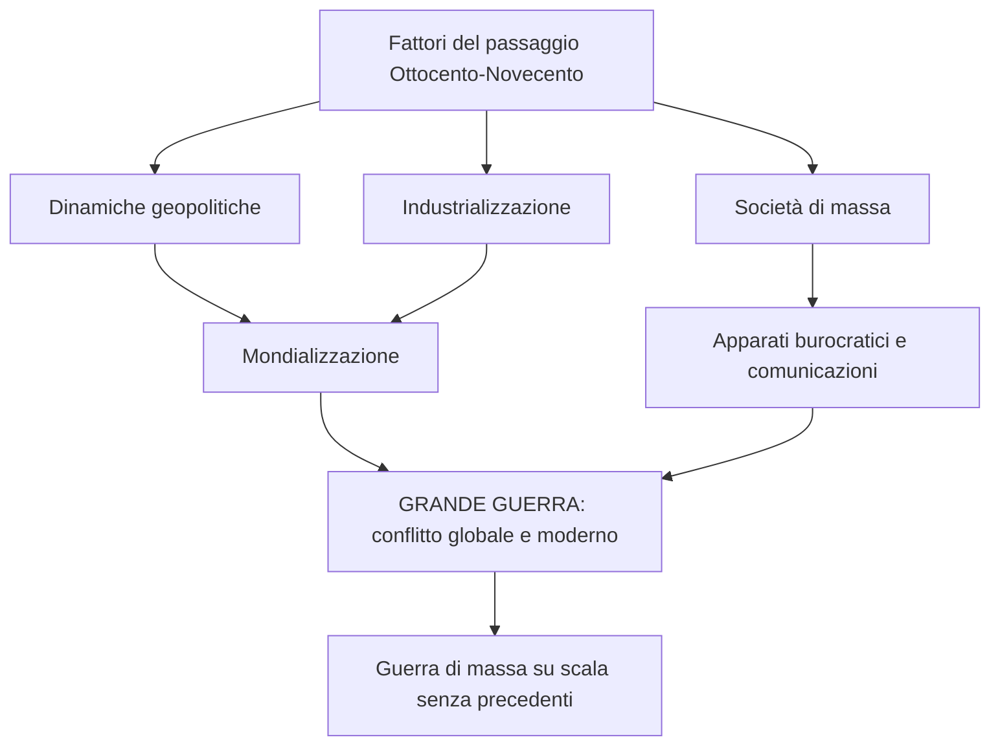
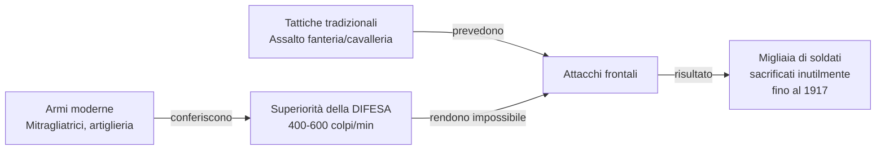
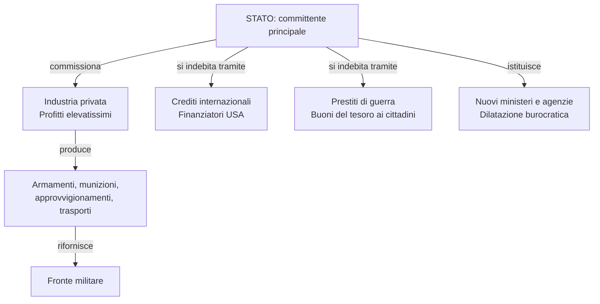
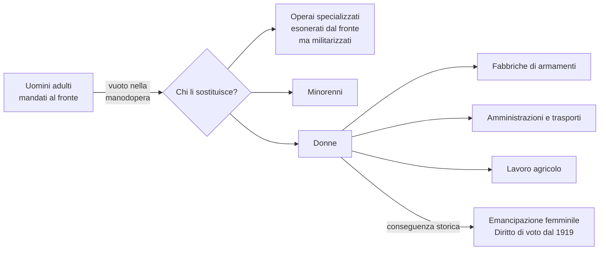
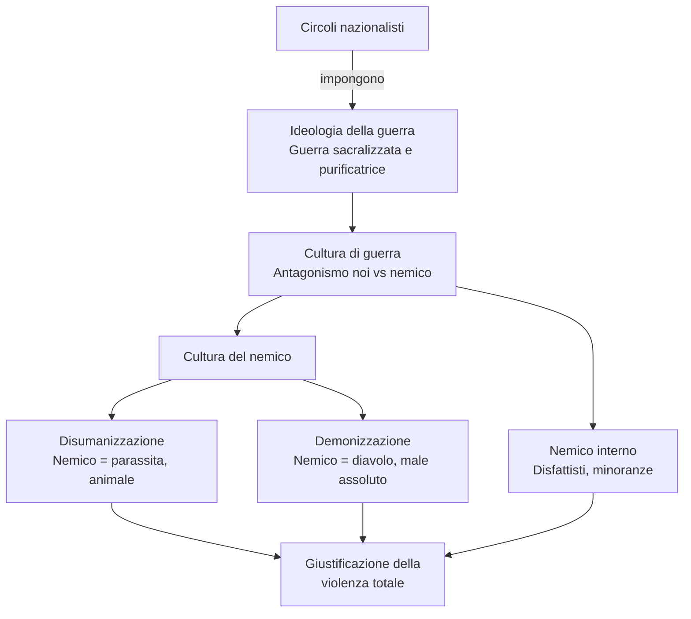
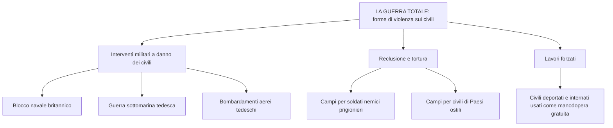
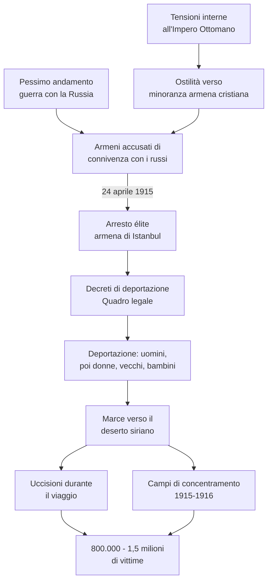
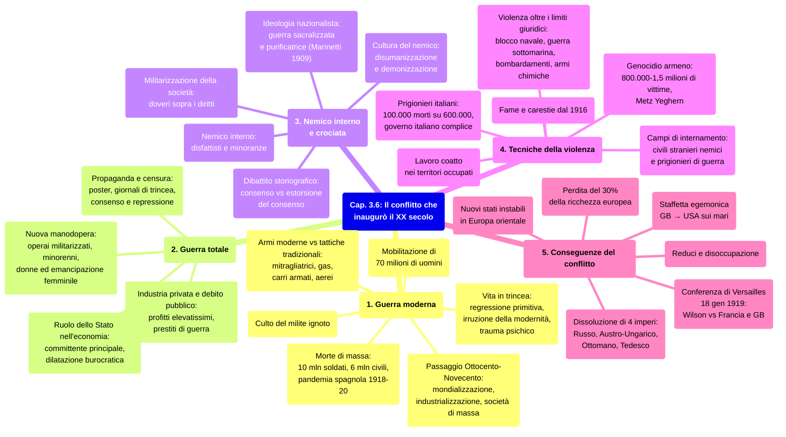

# Schema di Studio - Capitolo 3.6: Il conflitto che inaugurò il XX secolo

---

## 1. La guerra «moderna»

### 1.1 La Grande guerra come passaggio epocale

La Prima guerra mondiale rappresenta l'evento in cui si condensarono e trovarono ulteriore impulso molti processi che avevano segnato il **passaggio dall'Ottocento al Novecento**. La **dimensione globale del conflitto** fu il risultato delle dinamiche geopolitiche, economiche e tecnologiche che, sullo scorcio del XIX secolo, avevano innescato un processo di mondializzazione. A questo si aggiunsero l'industrializzazione e i fenomeni della nascente società di massa: dalla crescita degli apparati burocratici allo sviluppo delle comunicazioni.

> [!note] Dalla lezione
> Il prof sottolinea un'interpretazione forte: tutti gli orrori del XX secolo — guerre mondiali, sterminio di massa, spostamenti forzati di popolazioni, campi di concentramento, guerra ideologica, la scienza come arma (Fritz Haber e i gas, le bombe atomiche) — sono **già presenti in nuce nella Prima guerra mondiale**. La WWI non è solo un "passaggio epocale": è il laboratorio in cui viene sperimentato l'intero repertorio della violenza novecentesca.

Già in guerre precedenti, a partire dalla **guerra di secessione americana (1861-65)**, era stato possibile scorgere alcuni segnali di «modernità», ma nel Primo conflitto mondiale questi si manifestarono **simultaneamente e su scala incomparabilmente maggiore**. La Grande guerra fu dunque una **guerra di massa**, riflesso di società sempre più caratterizzate dal fenomeno delle masse.

> [!note] Dalla lezione
> **Approccio cartografico:** il prof propone di attraversare la guerra cronologicamente seguendo le mappe del libro — pp. 125 e 127 (fulminea avanzata tedesca e stallo sulla Marna, 1914), p. 129 (entrata in guerra di Ottomano/Bulgaria e Italia/Grecia/Romania; collasso della Serbia nel 1915; Russia sull'orlo del collasso nel 1916), p. 135 (fronte italiano e Guerra Bianca oltre i 2000 m), p. 145 (Caporetto, resistenza sul Piave, Vittorio Veneto), p. 149 (situazione fine 1917, favorevole agli Imperi Centrali, con arrivo decisivo degli americani). Questo percorso cartografico rende visibile la differenza strutturale tra **fronte occidentale** (guerra di posizione/trincea) e **fronte orientale** (guerra di movimento).

### 1.2 La mobilitazione di massa

Gli Stati belligeranti mobilitarono complessivamente più di **70 milioni di uomini**, prevalentemente europei. Questi soldati si ritrovarono a essere ingranaggi di un meccanismo impersonale, regolato dalla **burocrazia** e dalla **standardizzazione** (uniformi, dotazioni, oggetti d'uso quotidiano, vitto, comunicazioni), accanto a milioni di altri soldati. Questa esperienza condivisa contribuì all'**accelerazione dei processi di omologazione** della cultura e della mentalità. Il prof osserva che i soldati erano "prodotti in serie" come in una catena di montaggio industriale, e che in questa guerra nasce l'**uomo massa** del XX secolo — quell'uomo massa che Kafka nelle *Metamorfosi* rappresenta come un insetto. [Lezione]

### 1.3 Barbarie e modernità: la vita in trincea

Le **trincee** furono il luogo dove la maggior parte dei soldati combatté, almeno sul **fronte occidentale** e su quello **italiano**. Il pittore tedesco **Otto Dix**, arruolatosi volontario, descrisse la guerra così: «Pidocchi, ratti, reticoli, pulci, granate, bombe, fossi, cadaveri, sangue, grappa, topi, gatti, gas, cannoni, sporco, pallottole, mortai, fuoco, acciaio, questa è la guerra». La vita in trincea aveva un **duplice volto**:

- da un lato, una **regressione quasi primitiva**: vita semi-interrata, promiscuità con animali, insetti, sporcizia e morte;
- dall'altro, l'**irruzione della modernità**, fatta di armi micidiali e tecnologia.

Per milioni di soldati, soprattutto **contadini** che forse non erano mai nemmeno saliti su un treno, la guerra fu come essere **catapultati in un altro mondo**, tecnologizzato e costellato da innovazioni — la luce elettrica, il telegrafo, la bicicletta, il telefono, gli autoveicoli — che da rarità divenivano presenze familiari. La guerra fu, per questi soldati, una vera e propria **formazione alla modernità industriale** — ma una formazione avvenuta, come nota il prof, "in modo distorto e distruttivo". [Lezione]

L'impatto era traumatico soprattutto in prima linea. Insieme alla **paura**, alla violenza e alla morte, erano le **esperienze visive e sonore** a sbalordire i soldati: il rumore assordante delle artiglierie di grosso calibro, le notti illuminate a giorno dalle esplosioni, il paesaggio sovvertito e reso irriconoscibile. Tutte le percezioni sensoriali venivano stravolte: il fantastico si faceva familiare e l'orrore diventava normale.

La guerra ebbe conseguenze drammatiche anche sulla **psiche dei soldati**, protrattesi ben dopo la fine del conflitto. Come testimoniato da un giovane ufficiale americano colpito da «psiconevrosi insorta in servizio», incubi ricorrenti, flashback di volti nemici colpiti a baionetta, il terrore di suoni e odori della guerra erano esperienze comuni che rendevano impossibile il ritorno alla normalità.

### 1.4 Armi moderne, tattiche tradizionali

Le battaglie si combattevano con armi frutto dell'**innovazione tecnologica** e della **produzione in serie**, dotate di una **capacità distruttiva straordinaria** rispetto al passato, soprattutto in merito a potenza, gittata e precisione di tiro. Questo potenziale bellico aveva illuso gli Stati maggiori sulla possibilità di una **guerra rapida**, ma nella realtà esso conferiva alla **difesa** una **superiorità strutturale**: una mitragliatrice poteva sparare dai **400 ai 600 colpi al minuto**, creando un muro di proiettili che rendeva **impossibile l'avanzata della fanteria**.

A lungo il conflitto si basò sulle classiche dottrine di strategia militare, che attribuivano un ruolo centrale all'assalto dei fanti o della cavalleria. Per questo, almeno fino al **1917**, migliaia di soldati furono sacrificati in **attacchi insensati**.

Le principali innovazioni belliche furono:

| Arma / Mezzo | Caratteristiche e impiego |
|---|---|
| **Gas tossici (iprite)** | Introdotti dai tedeschi a **Ypres** (Belgio), poi adottati da tutti gli eserciti. L'inalazione poteva causare cecità e morte |
| **Carri armati** | Comparvero nel **1916**, ma non erano ancora sufficientemente affidabili e numerosi da risultare decisivi |
| **Sommergibili** | Nuovo spauracchio sui mari, usati nella guerra sottomarina |
| **Dirigibili Zeppelin** | Usati per bombardamenti dall'alto |
| **Aerei** | Impiegati soprattutto per **ricognizione** e individuazione delle postazioni di artiglieria nemiche, per battaglie aeree, e sul finire del conflitto anche per **bombardare** |

### 1.5 La «morte di massa» e il bilancio umano

La combinazione di guerra di massa e potenziale distruttivo degli eserciti produsse **oltre dieci milioni di morti** tra i soldati, a cui si aggiungono milioni di feriti, molti rimasti **mutilati**, e una stima di circa **6 milioni di vittime civili**. Per i più, fu una **«morte di massa»**: anonima e seriale, spesso giunta sotto forma di proiettile d'artiglieria, ben lontana dal modello dell'eroe martire, retaggio di un'ideologia guerresca romantica che non aveva più posto nel contesto di una guerra diventata industriale.

Tra il **1918** e il **1920**, a causare milioni di ulteriori vittime fu l'epidemia di influenza **«spagnola»**, la cui diffusione globale (fu dunque una **pandemia**) e virulenza vennero favorite dalla guerra.

> **Parola della storia — «Spagnola»:** La denominazione è frutto della **censura di guerra**. Nei Paesi belligeranti, le autorità imposero ai giornali di ignorare o minimizzare la diffusione e la mortalità della malattia. Tuttavia la stampa poteva riferire le notizie dalla **Spagna**, Paese neutrale dove i rapporti sull'epidemia erano pubblici. Ciò produsse l'erronea impressione che l'influenza fosse un fenomeno proprio del Paese iberico.

#### Bilancio delle vittime per Paese

| Paese | Soldati morti | Civili morti |
|---|---|---|
| **Germania** | 2.037.000 | 426.000 |
| **Impero Russo** | 1.997.500 | 1.500.000 |
| **Impero Austro-Ungarico** | 1.513.500 | 300.000 |
| **Francia** | 1.400.000 | 300.000 |
| **Impero Ottomano** | 772.000 | 2.000.000 |
| **Regno Unito** | 761.000 | 100.000 |
| **Italia** | 600.000 | 500.000 |
| **Serbia** | 278.000 | 300.000 |
| **Romania** | 250.700 | 275.000 |
| **Bulgaria** | 87.500 | 100.000 |
| **Belgio** | 38.000 | 50.000 |
| **Grecia** | 26.000 | 132.000 |
| **Portogallo** | 7.200 | — |
| **Montenegro** | 3.000 | — |

### 1.6 Il culto del milite ignoto

Le società coinvolte nel conflitto portarono a lungo i segni di profondi traumi, di un **lutto di massa** che aveva decimato una generazione di giovani uomini. Negli anni seguenti, gli Stati dovettero dare un significato alle morti che essi stessi avevano richiesto: cerimonie, monumenti e varie forme di **memoria pubblica** svolsero una funzione fondamentale di **«sacralizzazione»** della nazione e dei regimi politici.

In quasi tutti i Paesi fu inventato il **culto del milite ignoto**: la salma non identificata di un soldato morto in guerra fu scelta per rappresentare tutti i caduti e, in modo solenne, fu sepolta in un luogo di particolare significato simbolico nella capitale del Paese:

- **Parigi** — Arco di Trionfo
- **Londra** — cattedrale di Westminster
- **Roma** — Vittoriano
- **Washington** — cimitero nazionale di Arlington

In Italia la cerimonia ebbe una ritualità particolarmente elaborata: **Maria Bergamas**, una madre il cui figlio era caduto in guerra senza che il corpo fosse mai ritrovato, fu posta nella cattedrale di **Aquileia** (Friuli) davanti ai sarcofagi di diversi soldati ignoti. Ne scelse uno, che fu caricato su un treno speciale con carrozza scoperta; il convoglio attraversò tutte le città dell'Italia centro-settentrionale, fermandosi nelle stazioni per ricevere gli omaggi della cittadinanza, fino a giungere a Roma dove la salma fu tumulata al Vittoriano. [Lezione]

> [!note] Dalla lezione
> **"Le divinità sono le nazioni"** — Il prof propone un'interpretazione teologica della sacralizzazione: i caduti sono "cari e sacri agli dei", ma gli dei in questione sono le **nazioni stesse**, che hanno preteso questo sacrificio, questo "bagno di sangue". La nazione diventa la divinità davanti alla quale — anche nella sconfitta — si giustifica il sacrificio di tanti giovani. Nei Paesi vincitori la giustificazione era più facile ("quantomeno abbiamo vinto"); nei Paesi sconfitti si rendeva ancora più necessaria una sacralizzazione che elevasse i caduti al rango di martiri ed eroi.

---

## 2. La guerra «totale»

### 2.1 La mobilitazione generale e il ruolo dello Stato

In ogni Paese le risorse furono dirottate a fini bellici e lo Stato divenne il **principale committente** dell'apparato produttivo, **intervenendo direttamente** per regolarlo. Dall'estensione del ruolo statale nell'economia derivò la **dilatazione dell'apparato burocratico**: furono istituiti ministeri responsabili di armamenti e munizioni, ed enti o agenzie statali per reperire e distribuire le materie prime.

Dall'efficienza del sistema industriale dipendevano anche gli **approvvigionamenti alimentari** e di indumenti per milioni di soldati, i materiali per costruire e fortificare le trincee, i mezzi di trasporto (camion, biciclette, carri), e il funzionamento delle **reti ferroviarie** per consentire il rapido spostamento di truppe e armamenti.

### 2.2 Industria privata, profitti e debito pubblico

In generale furono le **imprese private** a convertirsi alle necessità della guerra, che garantiva loro **profitti elevatissimi**. Gli Stati, invece, si **indebitarono enormemente** per far fronte ai costi bellici. I governi ricorsero a:

- **crediti sui mercati internazionali**: i Paesi dell'Intesa attinsero soprattutto a finanziatori statunitensi (in particolare la Banca Morgan di New York) attraverso la garanzia britannica;
- **prestiti di guerra**: campagne per recuperare il risparmio dei cittadini; comprare **buoni del tesoro** era presentato come un gesto patriottico — c'era chi faceva il proprio dovere imbracciando il fucile, e chi mettendo mano al portafoglio.

> [!note] Dalla lezione
> **I "pescecani" e la truffa dei ceti medi.** Gli industriali che si arricchirono con le forniture belliche furono chiamati in Italia **"pescecani"**. Ma la vera beffa colpì i **ceti medi**: quei risparmi investiti in buoni del tesoro — espressi in moneta forte pre-bellica — furono restituiti alla fine della guerra in una moneta talmente inflazionata e svalutata da non valere più nulla. Il prof nota l'ironia crudele della situazione: i ceti medi erano i più **patriottici** (piccola e media borghesia), quindi i più propensi ad aver comprato i titoli di guerra; e l'inflazione rovina i **creditori**, non i debitori — rendendo la "fregatura" ancora più beffarda. Questa devastazione economica del ceto medio sarà un fattore decisivo per la radicalizzazione politica del dopoguerra.

> **Parola della storia — «Buoni del tesoro»:** Titoli di debito emessi dallo Stato per finanziare il proprio bilancio (ordinario o straordinario). Ai soggetti che li acquistano, lo Stato garantisce — a una scadenza prefissata — il rimborso del capitale con l'aggiunta di un certo interesse.

Il sindacalista **Vittorio Foa** (1910-2008), in un libro autobiografico del 1991, ricordò la guerra vista con i suoi occhi di bambino borghese: la paura quotidiana che il padre venisse chiamato (si chiamavano nuove classi, si era scesi ai ragazzi del '99 e risaliti al 1873), il pianto delle donne alla partenza degli uomini, le notizie di morte, il razionamento alimentare vissuto come patriottismo e solidarietà.

### 2.3 Manodopera «militarizzata», minorenni e donne

La disponibilità di **manodopera** divenne fondamentale. Poiché una grande quantità di uomini adulti venne mandata al fronte, furono coinvolti nel sistema produttivo altri soggetti.

Gli **operai specializzati** necessari alle industrie belliche, esonerati dal fronte, vennero equiparati a soldati e sottoposti alla **disciplina militare**: non potevano scioperare, perché la protesta sarebbe stata considerata un **ammutinamento** o un **sabotaggio**.

Furono perciò mobilitati i **minorenni** e, soprattutto, le **donne**. La presenza femminile crebbe in modo considerevole nelle **fabbriche di armamenti**, nelle **amministrazioni**, nelle **aziende di trasporto pubblico** urbano e anche nelle **campagne**, dove le donne sostituirono i mariti nella conduzione dei campi. Un esempio: nella fabbrica di munizioni **National Filling Factory No. 6** a **Chilwell** (Inghilterra), operaie produssero durante la guerra **19 milioni di proiettili**.

La possibilità di lavorare — svolgendo professioni fino a quel momento appannaggio esclusivo degli uomini — rappresentò un passaggio importante nella storia dell'**emancipazione femminile**. Non a caso, subito dopo la guerra, le donne cominciarono a ottenere il **diritto di voto** in molti Stati, a partire dal **Regno Unito (1919)**.

### 2.4 Repressione e consenso: la propaganda di guerra

Un impiego massiccio e prolungato di risorse umane ed economiche richiedeva organizzazione, disciplina e, se necessario, **repressione**. Furono rafforzati i tradizionali strumenti di sorveglianza e coercizione, a partire dalla **censura**: le notizie venivano filtrate, edulcorando la realtà della guerra per non demoralizzare il fronte interno; le voci critiche erano fatte tacere; si censurava il colossale flusso di **lettere e cartoline** che i soldati al fronte inviavano ai loro cari.

Per suscitare adesione alla causa bellica, lo Stato ricorse alla **propaganda** e a moderne strategie di comunicazione, fino ad allora appannaggio della pubblicità commerciale e della propaganda elettorale: **poster e cartoline** dovevano incitare, richiamare al dovere, alla sottoscrizione dei prestiti di guerra.

La propaganda fu usata anche in ambito **militare**. La coesione di un esercito di massa non poteva dipendere solo da lealtà e disciplina garantite dalla coercizione: era necessario **alimentare il consenso** verso la guerra e **tenere alto il morale**. Perciò furono organizzate varie attività nelle retrovie:

- cinema da campo
- programmi teatrali e musicali
- **giornali di trincea**
- conferenze di propaganda tenute da intellettuali e giornalisti

> **Parola della storia — «Giornali di trincea»:** Pubblicazioni periodiche confezionate da personale militare e destinate ai soldati. Nacquero come iniziative spontanee, ma in seguito le autorità ne assunsero il controllo, facendone uno strumento di «pedagogia» e propaganda e diffondendole con ampie tirature.

---

## 3. Il «nemico interno» e la guerra come crociata

### 3.1 La militarizzazione totale della società

La mobilitazione totale fece tracimare la guerra nelle società. Lo stato di guerra accentuò la **militarizzazione**: in diversi Paesi i militari assunsero funzioni che in tempo di pace spettavano ad autorità civili e l'esercito divenne una sorta di **modello organizzativo**, segnando il rapporto tra Stato e cittadini. Anziché in termini di **diritti**, si ragionava in termini di **doveri, disciplina, obbedienza**.

### 3.2 L'ideologia della guerra e la sacralizzazione del conflitto

Divenne pervasiva l'**ideologia della guerra** coltivata dai **circoli nazionalisti**, che si imposero come voce autentica e unica della nazione, mettendo a tacere le altre. La guerra fu **mitizzata e sacralizzata**. Uno dei temi ricorrenti era quello della **«guerra purificatrice»**, che avrebbe liberato la nazione dai germi delle infezioni morali. Questa posizione era stata fissata sin dal **1909** da **Filippo Tommaso Marinetti** nel suo *Manifesto del futurismo*, con la celebre espressione **«guerra sola igiene del mondo»**.

### 3.3 La cultura di guerra e la cultura del nemico

L'egemonia culturale e politica esercitata dai nazionalisti portò a una **radicalizzazione** del confronto. Sin dall'inizio, la guerra venne interpretata nei termini di un **antagonismo tra «noi» e «il nemico»**, tra civiltà e barbarie, tra bene e male, con uno spirito da **crociata** che animava la mobilitazione dei vari Paesi.

Questa **cultura di guerra** — il modo di pensare la guerra e i suoi scopi — prevedeva anche una **cultura del nemico** intrisa di odio: l'avversario era unicamente un **condensato di valori negativi**. Da questa deformazione derivò un crescendo di immagini **disumanizzate e demonizzate** dei popoli antagonisti. Il nemico, spesso definito con nomi di **parassiti o animali repellenti** (pulci, ratti ecc.), era indicato come non umano e fonte di contaminazione: pertanto era necessario e legittimo sbarazzarsene.

La propaganda visiva esemplificava questa demonizzazione: in un manifesto russo del **1915**, il Kaiser **Guglielmo II** è denominato «il nemico del genere umano» e rappresentato come un diavolo, con l'elmo chiodato che nasconde a malapena orecchie a punta e teschi umani in mano. Un manifesto della **British Empire Union** del **1919** raffigurava la brutalità tedesca con il monito: «Mai più! Ricorda! Ogni tedesco impiegato significa un lavoratore britannico inattivo».

### 3.4 Il «nemico interno»

Analogamente, anche sul **fronte interno** si delineò un nemico: il **disfattista o il traditore**. La sua individuazione poteva essere difficile, perché si mescolava agli altri alimentando tensioni e sospetti, oppure sin troppo facile, perché lo si cercava nelle **minoranze etniche o politiche**, stigmatizzate come **«corpi estranei»** alla nazione. Su entrambi i fronti si inventò il **nemico assoluto**, che doveva essere annientato.

Questo meccanismo permetteva di **giustificare il conflitto**: il suo spropositato numero di vittime, l'enorme utilizzo di risorse, le pesanti conseguenze sulla vita quotidiana. Tale sforzo era ammissibile perché il valore della causa — la rigenerazione della nazione, la crociata contro il male — era presentato come **assoluto**.

### 3.5 Il dibattito storiografico: perché i soldati continuarono a combattere?

Come fu possibile che i soldati continuassero a combattere per anni una guerra così orrenda? Gli storici si interrogano sulla misura in cui il consenso fu diffuso e su come fu ottenuto.

#### Sul fronte occidentale

In Francia, gli storici **Stéphane Audoin-Rouzeau** e **Annette Becker** hanno contestato la tesi di un crescente rifiuto del conflitto tra i soldati. Concentrandosi soprattutto sul fronte franco-tedesco, hanno sostenuto che la guerra si combatté con un **consenso sostanziale e attivo** di soldati e civili: senza tale consenso, la guerra non avrebbe potuto proseguire sino alla fine. La grande maggioranza dei combattenti avrebbe abbracciato una **«cultura di guerra»**, odiando il nemico e rendendosi disponibile a esercitare violenza e a uccidere.

Secondo altri storici, tuttavia, questa tesi sottovaluterebbe la **repressione del rifiuto** — e quindi l'**«estorsione» del consenso** — e sopravvaluterebbe il punto di vista di soldati appartenenti alle classi medie e superiori, più disponibili verso la guerra. **Diari e lettere di soldati di estrazione popolare** attestano sentimenti ben diversi: rifiuto, orrore, disperazione. Queste posizioni ebbero poche occasioni di manifestarsi pubblicamente perché controllate da un apparato repressivo formidabile.

#### Il dibattito italiano

| Storico/a | Tesi principale |
|---|---|
| **Bruna Bianchi** | Ha valorizzato le diverse forme di sottrazione alla violenza: collettive (fraternizzazioni, tregue informali) e individuali (insubordinazione, autolesionismo, «fuga» nella follia). Parla di **«estraneità morale» alla guerra** |
| **Giovanna Procacci** | Ha indagato i processi della giustizia militare italiana, di gran lunga più numerosi che negli altri eserciti. I fanti italiani furono sottoposti a una disciplina particolarmente aspra, che moltiplicò episodi di **«rivolta morale»** |
| **Mario Isnenghi** e **Giorgio Rochat** | Insistono sul numero statisticamente contenuto dei casi di «resistenza» documentati, legati a circostanze precise (inclusa la disciplina eccessivamente rigida dell'esercito italiano) e non a principi generali di rifiuto. Sottolineano la constatazione fondamentale: **la guerra fu combattuta fino in fondo** |

---

## 4. Tecniche della violenza

### 4.1 Violenza senza limiti

La miscela di nuove tecnologie e meccanismi mentali, culturali e politici di moltiplicazione dell'odio generò una violenza che superò ogni **limite giuridico ed etico**. Rispetto al passato, la novità erano soprattutto la **dimensione degli eventi** e il numero di vittime e carnefici coinvolti.

Si assottigliò il confine tra lecito e illecito, che spesso passava sul crinale tra il rispetto formale delle norme internazionali e la loro violazione sostanziale:

- Il **blocco navale britannico** impediva le importazioni in Germania, bloccando cibo e farmaci: si colpiva così la **popolazione civile**, violando le norme del diritto internazionale su cui gli Stati si erano accordati nei decenni precedenti.
- La **guerra sottomarina tedesca** sollevava analoghe considerazioni.
- I **bombardamenti tedeschi** sulle città della costa inglese, su Londra e, nel **1918**, anche su Parigi, aprirono la strada a un nuovo sconfinamento della violenza di guerra, gravido di conseguenze per il futuro.

L'**uso di gas e altre armi chimiche** provocò un trauma così duraturo che tali armi non vennero replicate nel corso della Seconda guerra mondiale (che però non fece economia di atrocità vecchie e nuove).

### 4.2 I campi di concentramento e internamento

L'Europa sperimentò per la prima volta i **campi di internamento** (o concentramento), già usati nella **guerra ispano-americana a Cuba** e in quella **anglo-boera in Sudafrica**.

I campi assunsero due forme principali:

**Campi per civili «stranieri nemici»:** allestiti quasi ovunque per la reclusione di cittadini di Stati nemici che vivevano in un altro Paese, talvolta da molto tempo. In Italia, ad esempio, ne furono creati per austriaci e tedeschi.

**Campi per prigionieri di guerra:** il numero di soldati prigionieri fu senza precedenti, **tra gli 8 e i 9 milioni**, la gran parte catturati sul **fronte orientale**, dove il carattere di guerra di movimento ne favoriva la cattura. Nel trattamento dei prigionieri si verificarono violazioni del diritto internazionale, in parte anche per ragioni oggettive: la **penuria di generi alimentari** si rifletteva inevitabilmente sul loro vitto.

### 4.3 Fame e carestie nella Grande guerra

Il grave problema dell'**approvvigionamento di generi alimentari** riguardò gran parte dei Paesi europei belligeranti. A partire dal **1916**, la **penuria di cibo** ebbe conseguenze sui fronti interni, che iniziarono a mostrare segni di cedimento.

| Condizione | Paesi |
|---|---|
| **Carestia** | Serbia, Montenegro, Albania, parte dell'Impero Russo |
| **Quasi carestia** | Parte dell'Impero Russo |
| **Grave carenza di cibo** | Belgio, Germania, Impero Austro-Ungarico, Bulgaria, Impero Ottomano, Romania |
| **Approvvigionamento sufficiente** | Regno Unito, Francia, Italia, Portogallo, Grecia, Spagna, Svizzera, Paesi scandinavi |

### 4.4 Il caso dei prigionieri di guerra italiani

Tra i prigionieri italiani dell'esercito austro-ungarico si registrò una mortalità **incomparabilmente più alta** rispetto a quella degli altri contingenti nazionali: morirono **100.000 su 600.000**, in gran parte a causa di malattie contratte per **denutrizione** e mancanza di indumenti adatti alle temperature rigide dei luoghi di prigionia.

A questa ecatombe contribuirono il **governo** e il **Comando supremo italiani**, che — a differenza degli altri Paesi — **non inviarono cibo o indumenti** e **bloccarono i pacchi spediti dalle famiglie**. Era una tragica declinazione del principio del «nemico interno»: i soldati catturati, per la maggior parte durante la **rotta di Caporetto**, furono considerati **disertori o traditori**. Inoltre, non si voleva diffondere l'idea che in prigionia fossero assicurate buone condizioni di vita, perché ciò avrebbe potuto causare fenomeni di **diserzione di massa**.

### 4.5 Occupazioni e lavoro coatto

I regimi instaurati dagli **Imperi centrali** nei territori occupati militarmente coinvolsero la popolazione civile nelle vicende belliche. Gli scopi dei **regimi di occupazione** erano:

- assicurare l'ordine in regioni spesso a ridosso del fronte
- garantire la continuazione dell'attività economica
- fornire cibo, materie prime e manodopera all'esercito e alla madrepatria

A partire dal **1916**, la Germania utilizzò **civili deportati** dalle zone di occupazione e internati nei campi — francesi, belgi, polacchi e russi — per far fronte al bisogno di manodopera. Di frequente lo si spacciava come lavoro volontario, ma in realtà era **lavoro coatto**.

### 4.6 Il genocidio degli armeni

La **deportazione e lo sterminio degli armeni** nell'Impero ottomano fu il più grave episodio di uso della violenza verso la popolazione civile nella Prima guerra mondiale.

**Le premesse.** L'ostilità turca nei confronti della minoranza armena (**cristiana**) si era acuita negli ultimi decenni dell'Ottocento, mentre crescevano le tensioni interne all'Impero e le **rivendicazioni indipendentiste** degli armeni. Il pessimo andamento della guerra con la Russia fece precipitare la situazione: gli armeni furono individuati dal governo ottomano come il **«nemico interno»** e accusati di **connivenza con i russi**.

**Lo sterminio.** Nella **primavera del 1915** cominciò un'operazione di deportazione e sterminio coordinata dal governo ai fini dell'**omogeneizzazione etnica** dell'Impero. Essa venne annunciata il **24 aprile**, con l'arresto dell'**élite armena di Istanbul**. Quindi una serie di decreti fornì il quadro «legale» per dare avvio alla deportazione, autorizzando «a trasferire e reinsediare le popolazioni di villaggi e città, sia individualmente sia collettivamente, per esigenze militari o in risposta a qualsiasi indizio di ribellione o tradimento».

Le deportazioni, iniziate con uomini adulti, si estesero a **donne, vecchi e bambini**. La destinazione finale erano alcune località del **deserto siriano**, ma in molti morirono prima di arrivarvi: uccisi immediatamente o nel corso del viaggio, che si svolgeva in condizioni terribili. I sopravvissuti furono rinchiusi nei **campi di concentramento** istituiti tra il **1915** e il **1916**.

Le stime delle vittime del genocidio — ***Metz Yeghern***, il **«Grande Male»**, come lo hanno denominato gli armeni — oscillano tra **800.000 e 1,5 milioni**.

A essere massacrati non furono solamente gli armeni ortodossi, ma anche altre **minoranze cristiane** presenti in Anatolia: **siro-ortodossi**, **siro-cattolici**, **caldei**, **armeno-cattolici**.

> **Parola della storia — «Genocidio»:** Insieme di atti commessi al fine di distruggere un gruppo nazionale, etnico o religioso. Il termine fu coniato nel **1944** dal giurista ebreo polacco **Raphael Lemkin** e fu definito come crimine nell'ambito del diritto internazionale dall'Assemblea Generale delle **Nazioni Unite** nel **1946** e poi nel **1948**, nella *Convenzione per la prevenzione e la repressione del delitto di genocidio*. È stato poi utilizzato anche per indicare precedenti avvenimenti storici ascrivibili a questa categoria.

---

## 5. Le conseguenze del conflitto: dalla guerra alla pace impossibile [Lezione]

### 5.1 Il bilancio geopolitico: dissoluzione degli imperi e nuova instabilità

La guerra determinò la dissoluzione di **quattro imperi**, di cui tre plurisecolari — l'**Impero russo**, l'**Impero austro-ungarico** e l'**Impero ottomano** — più il più recente **Impero tedesco** (Secondo Reich). Al loro posto nacquero numerosi nuovi stati in Europa orientale: **Finlandia**, le tre **repubbliche baltiche**, la **Polonia** (rinata dopo oltre un secolo), la **Cecoslovacchia**, il **Regno dei Serbi, Croati e Sloveni** (Jugoslavia), mentre Austria e Ungheria si ridussero a due piccole repubbliche. [Lezione]

Questa dissoluzione non portò pace: la scomparsa di imperi vecchi di secoli produsse conseguenze geopolitiche che si protrassero per anni e decenni, con una lunga appendice di **piccole guerre alla fine della guerra grande**. [Lezione]

#### L'impossibilità dei confini nazionali a est dell'Adriatico

Una differenza fondamentale separava l'Europa occidentale da quella orientale: mentre in Spagna, Francia, Regno Unito, Italia e Germania le linee di nazionalità erano relativamente facili da tracciare (pur con eccezioni: catalani, baschi), **dall'Adriatico in avanti** — Austria, Ungheria, Jugoslavia, Romania, Polonia, Ucraina, Russia — era **difficilissimo se non impossibile** tracciare confini che coincidessero con le nazionalità. [Lezione]

Esempi concreti: in **Cecoslovacchia** vivevano milioni di tedeschi (vent'anni dopo Hitler se li vorrà "riprendere" — sarà la crisi del 1938, anticamera della Seconda guerra mondiale); in **Romania** una fortissima minoranza ungherese (ancora oggi presente); l'Italia stessa si prese minoranze germanofone spostando il confine fino a **San Candido**, che geograficamente fa parte del bacino idrografico del Danubio e non di quello adriatico, e che è terra di tirolesi. [Lezione]

> [!note] Dalla lezione
> **Paralleli geopolitici contemporanei.** Il prof osserva che quella fascia di instabilità nata dalla dissoluzione degli imperi (dalla Finlandia fino al Caucaso) è **ancora oggi la fascia più problematica dell'intera Europa**: "Sembra che siamo ancora alla fine della Prima Guerra Mondiale." La Finlandia si è riarmata ed è entrata nella NATO temendo la Russia; i Paesi Baltici idem; la Polonia si sta riarmando; l'**Ucraina** è "il campo di battaglia principale" della tensione russo-europea; nel Caucaso persistono le tensioni tra Georgia, Azerbaigian e Armenia. In mezzo ci sono state l'URSS, la Seconda guerra mondiale, il 1991, ma la struttura di fondo dell'instabilità risale proprio alla fine della WWI.

### 5.2 La perdita di ricchezza e il declino europeo

Gli Stati europei persero il **30% della loro ricchezza** a causa della guerra. Il conflitto rese evidente la crisi dell'egemonia mondiale dell'Impero britannico e il drastico indebolimento di tutte le potenze coloniali europee. [Lezione]

Si concretizzò a partire dal 1917-18 una **"staffetta"** (cambio di testimone) — pacifica — dalla **Gran Bretagna** agli **Stati Uniti** come massima potenza; il prof precisa: "più che egemonia mondiale io parlerei di un'**egemonia sui mari**", un'egemonia navale e marittima. [Lezione]

### 5.3 La Conferenza di pace e i conflitti tra i vincitori

Il **18 gennaio 1919** si aprì la **Conferenza di pace** a Versailles. La data fu scelta deliberatamente dai francesi: il 18 gennaio **1871** era stato proclamato il Secondo Reich tedesco proprio a Versailles, sulle ceneri del Secondo Impero francese di Napoleone III — aprire la conferenza di pace in quella data era la **rivincita** della Francia. [Lezione]

Le speranze di un nuovo ordine mondiale si concentravano sul presidente americano **Wilson** e sui suoi **14 punti**. Ma tra questi, il più problematico risultò il **punto 5**: il **diritto all'autodeterminazione dei popoli coloniali**, enunciato in maniera vaga, ma direttamente opposto agli interessi di Francia e Gran Bretagna. [Lezione]

La trattativa fu dunque difficilissima: Wilson si scontrò con la **Francia**, che voleva smembrare la Germania e conquistare l'egemonia continentale, e con il **Regno Unito**, che non voleva rinunciare al proprio impero ma anzi ampliarlo. Le ambizioni wilsoniane collidevano frontalmente con quelle dei grandi vincitori europei. [Lezione]

### 5.4 Reduci e disoccupazione

> [!note] Dalla lezione
> **Il "dole" — sussidio per i reduci.** Il prof mostra un poster politico britannico del dopoguerra raffigurante ex soldati disoccupati che chiedono sussidi ("dole"). Ne approfitta per una mini-lezione di vocabolario inglese: "dole" significa sussidio di disoccupazione. L'immagine sintetizza il dramma del ritorno: milioni di uomini smobilitati che non trovano lavoro, con lo slogan "ancora guerra in tempo di pace".

---

## Date fondamentali — Riepilogo cronologico

| Data | Evento |
|---|---|
| **1861-65** | Guerra di secessione americana: primi segnali di «modernità» bellica |
| **1909** | Marinetti pubblica il *Manifesto del futurismo* («guerra sola igiene del mondo») |
| **Aprile 1915** | Inizio della deportazione e sterminio degli armeni nell'Impero ottomano |
| **24 aprile 1915** | Arresto dell'élite armena di Istanbul: data simbolo del genocidio |
| **1915-16** | Istituzione di campi di concentramento per armeni; vittime stimate: 800.000-1,5 milioni |
| **1916** | La penuria alimentare incide profondamente sui fronti interni; compaiono i primi carri armati; la Germania inizia a usare civili deportati come lavoro coatto |
| **1917** | Fino a questa data, migliaia di soldati sacrificati in attacchi frontali insensati |
| **1918** | Fine della Prima guerra mondiale; bombardamenti tedeschi anche su Parigi; bilancio: oltre 10 milioni di soldati morti, circa 6 milioni di civili; gli Stati europei perdono il **30% della loro ricchezza** [Lezione] |
| **1918-20** | Pandemia di influenza «spagnola»: milioni di vittime in tutto il mondo |
| **18 gennaio 1919** | Apertura della **Conferenza di pace** a Versailles — data scelta dai francesi come rivincita sul 18 gennaio 1871 (nascita del Secondo Reich) [Lezione] |
| **1919** | Le donne ottengono il diritto di voto nel Regno Unito |
| **1944** | Raphael Lemkin conia il termine «genocidio» |
| **1946-48** | L'ONU definisce il genocidio come crimine nel diritto internazionale |

---

## Mappa concettuale — Visione d'insieme del capitolo

