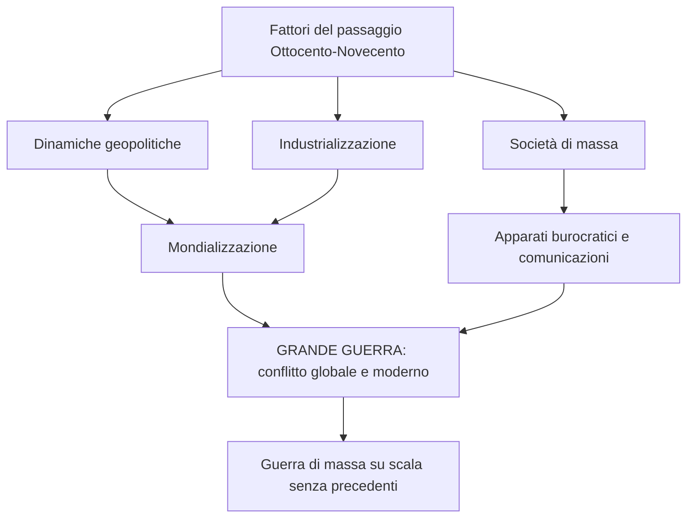
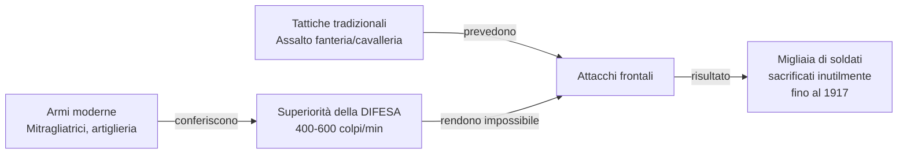
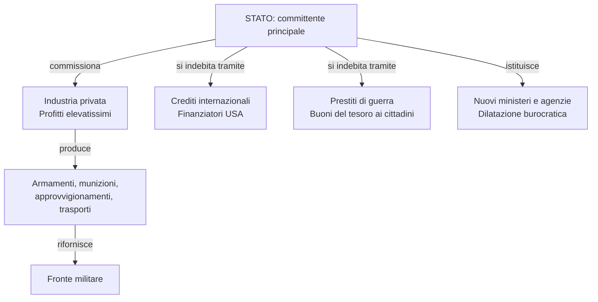
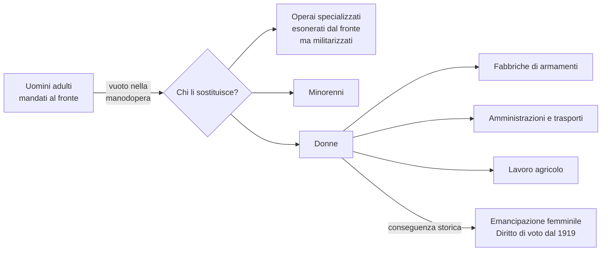
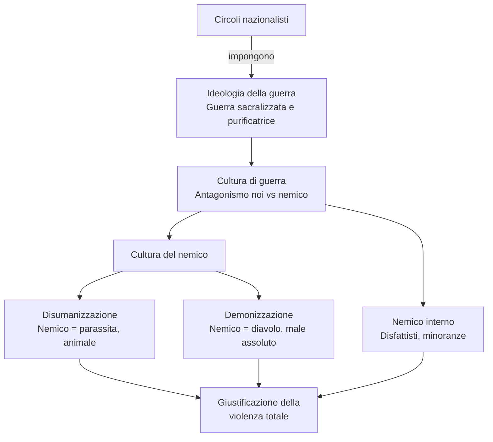
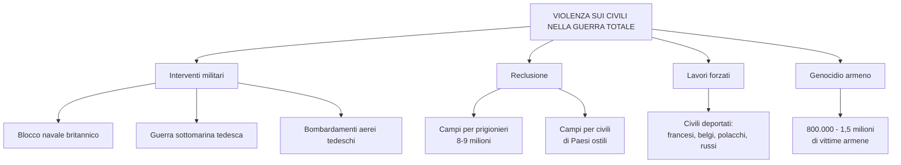
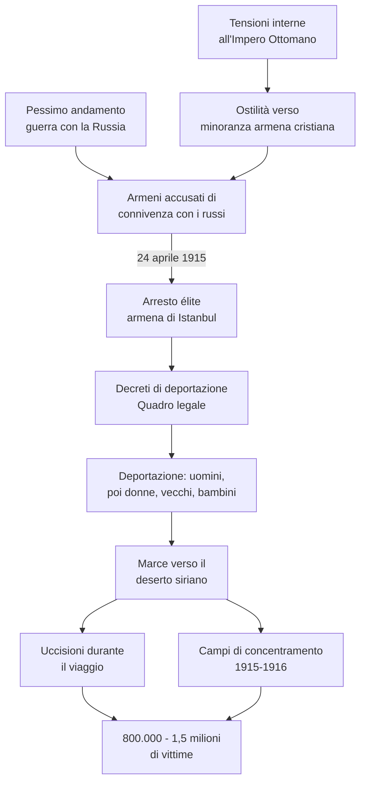
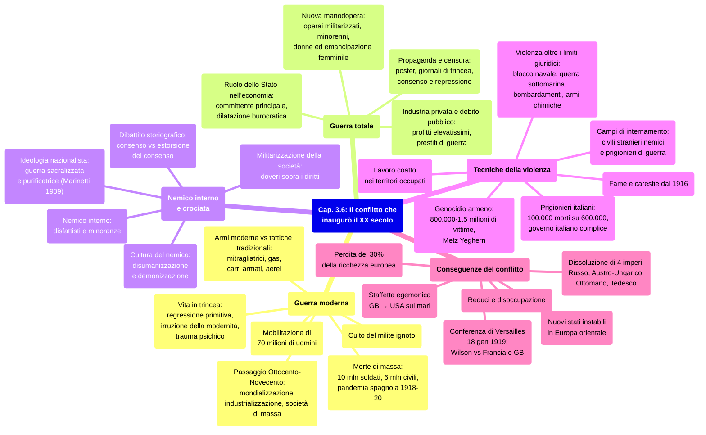

# Schema di Studio - Capitolo 3.6: Il conflitto che inaugurò il XX secolo (Riassunto)

---

## 1. La guerra «moderna»

### La Grande guerra come passaggio epocale e mobilitazione di massa

La Prima guerra mondiale condensò i processi del **passaggio dall'Ottocento al Novecento**: mondializzazione, industrializzazione, società di massa, crescita degli apparati burocratici e sviluppo delle comunicazioni. Già nella **guerra di secessione americana (1861-65)** si erano visti segnali di «modernità» bellica, ma nel Primo conflitto mondiale questi si manifestarono **simultaneamente e su scala incomparabilmente maggiore**. Fu una **guerra di massa**: gli Stati mobilitarono oltre **70 milioni di uomini**, trasformati in ingranaggi di un meccanismo impersonale regolato dalla **burocrazia** e dalla **standardizzazione**. Questa esperienza condivisa accelerò i processi di **omologazione culturale**.

> [!note] Dalla lezione
> Tutti gli orrori del XX secolo — sterminio, spostamenti forzati, campi di concentramento, guerra ideologica, scienza come arma (Fritz Haber e i gas, bombe atomiche) — sono **già presenti in nuce nella WWI**: essa fu il laboratorio della violenza novecentesca. I soldati erano "prodotti in serie" come in una catena di montaggio; nasce qui l'**uomo massa** del XX secolo, quello che Kafka nelle *Metamorfosi* rappresenta come un insetto.

> [!note] Dalla lezione
> **Approccio cartografico:** il prof propone di seguire la guerra sulle mappe del libro — pp. 125/127 (avanzata tedesca e stallo sulla Marna, 1914), p. 129 (entrata di Ottomano/Bulgaria/Italia/Grecia/Romania; collasso Serbia 1915; Russia sull'orlo del collasso 1916), p. 135 (fronte italiano e Guerra Bianca oltre 2000 m), p. 145 (Caporetto, Piave, Vittorio Veneto), p. 149 (fine 1917, favorevole agli Imperi Centrali, arrivo decisivo americano). Si evidenzia la differenza strutturale tra **fronte occidentale** (posizione/trincea) e **fronte orientale** (movimento).

### Barbarie e modernità: la vita in trincea

Le **trincee** furono il principale luogo di combattimento sul **fronte occidentale** e **italiano**. Il pittore tedesco **Otto Dix**, arruolatosi volontario, le descrisse così: «Pidocchi, ratti, reticoli, pulci, granate, bombe, fossi, cadaveri, sangue, grappa, topi, gatti, gas, cannoni, sporco, pallottole, mortai, fuoco, acciaio, questa è la guerra». La trincea aveva un **duplice volto**: da un lato una **regressione quasi primitiva** (vita semi-interrata, promiscuità con animali, sporcizia e morte); dall'altro l'**irruzione della modernità** tecnologica. Per milioni di soldati, soprattutto **contadini** mai saliti su un treno, la guerra fu una **formazione alla modernità industriale** — ma avvenuta, come nota il prof, "in modo distorto e distruttivo".

L'impatto era traumatico: **esperienze visive e sonore** sbalordivano (artiglierie assordanti, notti illuminate dalle esplosioni, paesaggio sovvertito). La guerra produsse conseguenze drammatiche sulla **psiche dei soldati**: incubi ricorrenti, flashback, terrore di suoni e odori che rendevano impossibile il ritorno alla normalità, come testimoniato da un giovane ufficiale americano colpito da «psiconevrosi insorta in servizio».

### Armi moderne, tattiche tradizionali

Le armi — frutto di **innovazione tecnologica** e **produzione in serie** — avevano una **capacità distruttiva straordinaria** in potenza, gittata e precisione. Questo aveva illuso gli Stati maggiori sulla possibilità di una **guerra rapida**, ma in realtà conferiva alla **difesa** una **superiorità strutturale**: una mitragliatrice sparava **400-600 colpi al minuto**, rendendo impossibile l'avanzata della fanteria. Eppure, fino al **1917**, migliaia di soldati furono sacrificati in **attacchi frontali insensati** basati su dottrine tattiche tradizionali.

| Arma / Mezzo | Caratteristiche e impiego |
|---|---|
| **Gas tossici (iprite)** | Introdotti dai tedeschi a **Ypres** (Belgio), poi adottati da tutti. Inalazione: cecità e morte |
| **Carri armati** | Comparvero nel **1916**, non ancora affidabili e numerosi abbastanza da essere decisivi |
| **Sommergibili** | Nuovo spauracchio dei mari, guerra sottomarina |
| **Dirigibili Zeppelin** | Bombardamenti dall'alto |
| **Aerei** | Ricognizione, battaglie aeree, e verso la fine del conflitto anche bombardamenti |

### La «morte di massa» e il culto del milite ignoto

La combinazione di guerra di massa e potenziale distruttivo produsse **oltre 10 milioni di soldati morti**, milioni di **mutilati**, e circa **6 milioni di vittime civili**. Fu una **«morte di massa»** anonima e seriale, lontana dal modello dell'eroe romantico. Tra il **1918** e il **1920**, la **pandemia** di influenza **«spagnola»** causò milioni di ulteriori vittime, la cui diffusione fu favorita dalla guerra.

> **Parola della storia — «Spagnola»:** Il nome deriva dalla **censura di guerra**: nei Paesi belligeranti le notizie sulla pandemia erano censurate, ma dalla **Spagna** neutrale i rapporti erano pubblici, creando l'erronea impressione di un fenomeno iberico.

#### Bilancio delle vittime per Paese

| Paese | Soldati morti | Civili morti |
|---|---|---|
| **Germania** | 2.037.000 | 426.000 |
| **Impero Russo** | 1.997.500 | 1.500.000 |
| **Impero Austro-Ungarico** | 1.513.500 | 300.000 |
| **Francia** | 1.400.000 | 300.000 |
| **Impero Ottomano** | 772.000 | 2.000.000 |
| **Regno Unito** | 761.000 | 100.000 |
| **Italia** | 600.000 | 500.000 |
| **Serbia** | 278.000 | 300.000 |
| **Romania** | 250.700 | 275.000 |
| **Bulgaria** | 87.500 | 100.000 |
| **Belgio** | 38.000 | 50.000 |
| **Grecia** | 26.000 | 132.000 |
| **Portogallo** | 7.200 | — |
| **Montenegro** | 3.000 | — |

Le società portarono a lungo i segni di un **lutto di massa**. Cerimonie, monumenti e **memoria pubblica** servirono a **«sacralizzare»** la nazione. In quasi tutti i Paesi fu inventato il **culto del milite ignoto**: la salma non identificata di un soldato sepolta in un luogo simbolico — **Parigi** (Arco di Trionfo), **Londra** (Westminster), **Roma** (Vittoriano), **Washington** (Arlington). In Italia, **Maria Bergamas**, madre di un caduto mai ritrovato, scelse nella cattedrale di **Aquileia** un sarcofago tra quelli di soldati ignoti; la salma attraversò in treno le città italiane fino alla tumulazione al Vittoriano.

> [!note] Dalla lezione
> **"Le divinità sono le nazioni"** — I caduti sono "sacri agli dei", ma gli dei sono le **nazioni stesse** che hanno preteso il sacrificio. Nei Paesi vincitori la giustificazione era più facile; nei Paesi sconfitti si rendeva ancora più necessaria una sacralizzazione che elevasse i caduti a martiri ed eroi.

---

## 2. La guerra «totale»

### Mobilitazione economica e ruolo dello Stato

Le risorse furono dirottate a fini bellici: lo Stato divenne il **principale committente** dell'apparato produttivo, **intervenendo direttamente** per regolarlo. La **dilatazione burocratica** si concretizzò in nuovi ministeri (armamenti, munizioni) e agenzie statali per materie prime. Dal sistema industriale dipendevano gli **approvvigionamenti** di cibo, indumenti, materiali per trincee, trasporti e **reti ferroviarie**.

Le **imprese private** si convertirono alla guerra ottenendo **profitti elevatissimi**. Gli Stati si **indebitarono enormemente** tramite **crediti internazionali** (i Paesi dell'Intesa attinsero soprattutto dalla **Banca Morgan** di New York con garanzia britannica) e **prestiti di guerra** (campagne patriottiche per vendere **buoni del tesoro** ai cittadini).

> [!note] Dalla lezione
> **I "pescecani" e la truffa dei ceti medi.** Gli industriali arricchitisi con le forniture belliche furono detti in Italia **"pescecani"**. I **ceti medi**, i più patriottici, investirono i risparmi in buoni del tesoro in moneta forte pre-bellica, ma vennero rimborsati in moneta talmente inflazionata e svalutata da non valere più nulla. L'inflazione rovina i **creditori**, non i debitori: la devastazione economica del ceto medio sarà un fattore decisivo per la **radicalizzazione politica** del dopoguerra.

> **Parola della storia — «Buoni del tesoro»:** Titoli di debito emessi dallo Stato; ai soggetti acquirenti lo Stato garantisce, a scadenza prefissata, il rimborso del capitale più un certo interesse.

Il sindacalista **Vittorio Foa** (1910-2008) ricordò la guerra con gli occhi di bambino borghese: la paura che il padre venisse chiamato (si scese ai ragazzi del '99 e si risalì al 1873), il pianto delle donne, le notizie di morte, il razionamento alimentare vissuto come patriottismo.

### Manodopera «militarizzata», minorenni e donne

Con gli uomini adulti al fronte, servirono altri soggetti. Gli **operai specializzati** esonerati dal fronte furono equiparati a soldati e sottoposti a **disciplina militare**: scioperare equivaleva ad **ammutinamento** o **sabotaggio**. Vennero mobilitati **minorenni** e soprattutto **donne**: nelle **fabbriche di armamenti**, nelle **amministrazioni**, nei **trasporti** e nelle **campagne**. Alla **National Filling Factory No. 6** di **Chilwell** (Inghilterra), operaie produssero **19 milioni di proiettili**. La possibilità di svolgere professioni maschili fu un passaggio decisivo per l'**emancipazione femminile**: dopo la guerra le donne ottennero il **diritto di voto** in molti Stati, a partire dal **Regno Unito (1919)**.

### Repressione e consenso: la propaganda di guerra

Lo Stato rafforzò **censura** e coercizione: notizie filtrate ed edulcorate, voci critiche messe a tacere, **lettere e cartoline** dei soldati censurate. Per suscitare adesione, si ricorse alla **propaganda** con strumenti mutuati dalla pubblicità commerciale ed elettorale: **poster e cartoline** per incitare, richiamare al dovere e alla sottoscrizione dei prestiti. Nelle retrovie si organizzarono cinema da campo, programmi teatrali e musicali, **giornali di trincea** e conferenze di propaganda tenute da intellettuali.

> **Parola della storia — «Giornali di trincea»:** Pubblicazioni periodiche per i soldati, nate come iniziative spontanee poi controllate dalle autorità come strumento di propaganda e «pedagogia», diffuse con ampie tirature.

---

## 3. Il «nemico interno» e la guerra come crociata

### Militarizzazione della società e ideologia della guerra

La mobilitazione totale fece tracimare la guerra nelle società. In diversi Paesi i militari assunsero funzioni civili; l'esercito divenne **modello organizzativo** del rapporto Stato-cittadini: anziché in termini di **diritti**, si ragionava in termini di **doveri, disciplina, obbedienza**.

Divenne pervasiva l'**ideologia della guerra** dei **circoli nazionalisti**, impostisi come voce unica della nazione. La guerra fu **mitizzata e sacralizzata** attorno al tema della **«guerra purificatrice»**, fissato dal **1909** da **Filippo Tommaso Marinetti** nel *Manifesto del futurismo*: **«guerra sola igiene del mondo»**.

### Cultura di guerra, cultura del nemico e «nemico interno»

I nazionalisti imposero una **radicalizzazione**: la guerra letta come antagonismo tra **«noi» e «il nemico»**, civiltà e barbarie, bene e male, con spirito da **crociata**. Questa **cultura di guerra** comprendeva una **cultura del nemico** intrisa di odio: l'avversario come **condensato di valori negativi**, rappresentato con immagini **disumanizzate e demonizzate** — nemico definito con nomi di **parassiti o animali repellenti**, indicato come non umano e fonte di contaminazione. Esempi: nel manifesto russo del **1915**, il Kaiser **Guglielmo II** è il «nemico del genere umano» raffigurato come diavolo; un manifesto della **British Empire Union** del **1919** raffigurava la brutalità tedesca con il monito «Mai più! Ricorda!».

Anche sul **fronte interno** si delineò un nemico: il **disfattista o traditore**, cercato nelle **minoranze etniche o politiche** stigmatizzate come **«corpi estranei»**. Su entrambi i fronti si inventò il **nemico assoluto** da annientare. Questo meccanismo **giustificava il conflitto**: lo sforzo era ammissibile perché il valore della causa — rigenerazione della nazione, crociata contro il male — era presentato come **assoluto**.

### Il dibattito storiografico: perché i soldati continuarono a combattere?

**Sul fronte occidentale:** **Stéphane Audoin-Rouzeau** e **Annette Becker** sostengono che la guerra fu combattuta con **consenso sostanziale e attivo** di soldati e civili, i quali abbracciarono una **«cultura di guerra»**. Altri storici obiettano che questa tesi sottovaluta la **repressione del rifiuto** (l'**«estorsione» del consenso**) e sopravvaluta il punto di vista delle classi medie/superiori: **diari e lettere di soldati di estrazione popolare** attestano rifiuto, orrore, disperazione.

| Storico/a | Tesi principale |
|---|---|
| **Bruna Bianchi** | Forme di sottrazione alla violenza: fraternizzazioni, tregue, insubordinazione, autolesionismo, «fuga» nella follia. Parla di **«estraneità morale» alla guerra** |
| **Giovanna Procacci** | Giustizia militare italiana assai più aspra che negli altri eserciti, con moltiplicazione di episodi di **«rivolta morale»** |
| **Mario Isnenghi** e **Giorgio Rochat** | Casi di resistenza statisticamente contenuti, legati a circostanze precise. Constatazione: **la guerra fu combattuta fino in fondo** |

---

## 4. Tecniche della violenza

### Violenza senza limiti

La combinazione di nuove tecnologie e meccanismi di moltiplicazione dell'odio generò violenza oltre ogni **limite giuridico ed etico**. Il confine tra lecito e illecito si assottigliò: il **blocco navale britannico** colpiva la **popolazione civile** tedesca bloccando cibo e farmaci; la **guerra sottomarina tedesca** sollevava analoghe questioni; i **bombardamenti tedeschi** sulle coste inglesi, su Londra e nel **1918** su Parigi aprirono un nuovo sconfinamento della violenza. L'**uso di gas e armi chimiche** provocò un trauma così duraturo che non vennero replicate nella Seconda guerra mondiale.

### Campi di concentramento, prigionieri e fame

L'Europa sperimentò per la prima volta i **campi di internamento**, già usati nella **guerra ispano-americana a Cuba** e nella **guerra anglo-boera in Sudafrica**. I campi assunsero due forme: **campi per civili «stranieri nemici»** (in Italia per austriaci e tedeschi) e **campi per prigionieri di guerra** (**8-9 milioni**, gran parte catturati sul **fronte orientale** per il carattere di guerra di movimento).

Dal **1916** la **penuria di cibo** ebbe conseguenze gravi sui fronti interni:

| Condizione | Paesi |
|---|---|
| **Carestia** | Serbia, Montenegro, Albania, parte dell'Impero Russo |
| **Quasi carestia** | Parte dell'Impero Russo |
| **Grave carenza di cibo** | Belgio, Germania, Impero Austro-Ungarico, Bulgaria, Impero Ottomano, Romania |
| **Approvvigionamento sufficiente** | Regno Unito, Francia, Italia, Portogallo, Grecia, Spagna, Svizzera, Paesi scandinavi |

### Il caso dei prigionieri italiani e il lavoro coatto

Tra i prigionieri italiani dell'esercito austro-ungarico morirono **100.000 su 600.000**, per denutrizione e freddo. A questa ecatombe contribuirono il **governo** e il **Comando supremo italiani**: a differenza degli altri Paesi, **non inviarono cibo né indumenti** e **bloccarono i pacchi delle famiglie**. I soldati catturati, soprattutto durante la **rotta di Caporetto**, furono considerati **disertori o traditori** («nemico interno»), e non si voleva incentivare la **diserzione di massa** facendo sembrare la prigionia accettabile.

Dal **1916** la Germania utilizzò **civili deportati** dalle zone di occupazione — francesi, belgi, polacchi, russi — come **lavoro coatto**, spacciato per volontario. I **regimi di occupazione** degli Imperi centrali miravano a: mantenere l'ordine, garantire l'attività economica, fornire cibo/materie prime/manodopera all'esercito.

### Il genocidio degli armeni

L'ostilità turca verso la minoranza armena (**cristiana**) si era acuita nell'Ottocento, con le **rivendicazioni indipendentiste** e le tensioni interne all'Impero. Il pessimo andamento della guerra con la Russia fece precipitare la situazione: gli armeni furono individuati come **«nemico interno»**, accusati di **connivenza con i russi**.

Nella **primavera del 1915** cominciò la deportazione e lo sterminio, coordinati dal governo ai fini dell'**omogeneizzazione etnica**. Il **24 aprile** fu arrestata l'**élite armena di Istanbul**; decreti fornirono il quadro «legale» per le deportazioni, estese da uomini adulti a **donne, vecchi e bambini**. La destinazione: il **deserto siriano**; molti morirono prima di arrivarvi. I sopravvissuti furono rinchiusi in **campi di concentramento** (**1915-1916**). Vittime stimate: **800.000-1,5 milioni** — il ***Metz Yeghern***, il **«Grande Male»**. Furono massacrate anche altre **minoranze cristiane** anatoliche: **siro-ortodossi**, **siro-cattolici**, **caldei**, **armeno-cattolici**.

> **Parola della storia — «Genocidio»:** Insieme di atti commessi per distruggere un gruppo nazionale, etnico o religioso. Coniato nel **1944** da **Raphael Lemkin** (giurista ebreo polacco); definito crimine dall'ONU nel **1946** e nella *Convenzione* del **1948**. Poi esteso a eventi storici anteriori.

---

## 5. Le conseguenze del conflitto: dalla guerra alla pace impossibile [Lezione]

### Dissoluzione degli imperi e nuova instabilità

La guerra determinò la dissoluzione di **quattro imperi**: **Impero russo**, **Impero austro-ungarico**, **Impero ottomano** (plurisecolari) e **Impero tedesco** (Secondo Reich). Al loro posto nacquero nuovi stati: **Finlandia**, tre **repubbliche baltiche**, **Polonia** (rinata dopo oltre un secolo), **Cecoslovacchia**, **Regno dei Serbi, Croati e Sloveni** (Jugoslavia); Austria e Ungheria si ridussero a piccole repubbliche. La dissoluzione non portò pace: seguì una lunga serie di **piccole guerre alla fine della guerra grande**.

**Dall'Adriatico in avanti** era **impossibile** tracciare confini nazionali netti. Esempi: in **Cecoslovacchia** vivevano milioni di tedeschi (Hitler se li vorrà "riprendere" — crisi del 1938, anticamera della WWII); in **Romania** una forte minoranza ungherese; l'Italia si prese minoranze germanofone spostando il confine fino a **San Candido**, terra tirolese nel bacino del Danubio.

> [!note] Dalla lezione
> Quella fascia d'instabilità (dalla Finlandia al Caucaso) è **ancora oggi la più problematica d'Europa**: Finlandia e Baltici riarmati nella NATO, Polonia in riarmo, **Ucraina** campo di battaglia della tensione russo-europea, Caucaso con tensioni tra Georgia, Azerbaigian e Armenia. La struttura di fondo dell'instabilità risale alla fine della WWI.

### Declino europeo e Conferenza di pace

Gli Stati europei persero il **30% della loro ricchezza**. Si concretizzò una **"staffetta"** dalla **Gran Bretagna** agli **Stati Uniti** come massima potenza — più precisamente un'**egemonia sui mari**.

Il **18 gennaio 1919** si aprì la **Conferenza di pace** a Versailles. Data scelta dai francesi come rivincita: il 18 gennaio **1871** era stato proclamato il Secondo Reich tedesco proprio a Versailles. Le speranze si concentravano su **Wilson** e i suoi **14 punti**, ma il **punto 5** — **diritto all'autodeterminazione dei popoli coloniali** — era direttamente opposto agli interessi di Francia e Gran Bretagna. Wilson si scontrò con la **Francia** (che voleva smembrare la Germania) e il **Regno Unito** (che voleva ampliare l'impero).

> [!note] Dalla lezione
> **Il "dole" — sussidio per i reduci.** Un poster britannico del dopoguerra mostra ex soldati disoccupati che chiedono sussidi ("dole" = sussidio di disoccupazione), con lo slogan "ancora guerra in tempo di pace": il dramma di milioni di uomini smobilitati senza lavoro.

---

## Date fondamentali — Riepilogo cronologico

| Data | Evento |
|---|---|
| **1861-65** | Guerra di secessione americana: primi segnali di «modernità» bellica |
| **1909** | Marinetti pubblica il *Manifesto del futurismo* («guerra sola igiene del mondo») |
| **Aprile 1915** | Inizio della deportazione e sterminio degli armeni nell'Impero ottomano |
| **24 aprile 1915** | Arresto dell'élite armena di Istanbul: data simbolo del genocidio |
| **1915-16** | Campi di concentramento per armeni; vittime stimate: 800.000-1,5 milioni |
| **1916** | Penuria alimentare sui fronti interni; primi carri armati; Germania usa civili deportati come lavoro coatto |
| **1917** | Fino a questa data, attacchi frontali insensati con migliaia di vittime |
| **1918** | Fine della WWI; bombardamenti tedeschi su Parigi; bilancio: oltre 10 mln soldati morti, ~6 mln civili; perdita del **30% della ricchezza** europea |
| **1918-20** | Pandemia «spagnola»: milioni di vittime globali |
| **18 gennaio 1919** | **Conferenza di pace** a Versailles — rivincita francese sul 18 gennaio 1871 |
| **1919** | Donne ottengono il voto nel Regno Unito |
| **1944** | Raphael Lemkin conia «genocidio» |
| **1946-48** | L'ONU definisce il genocidio come crimine internazionale |

---

## Mappa concettuale — Visione d'insieme del capitolo

