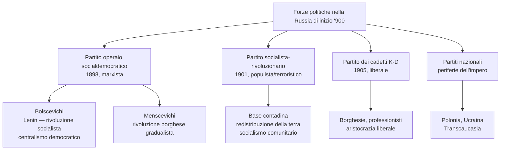
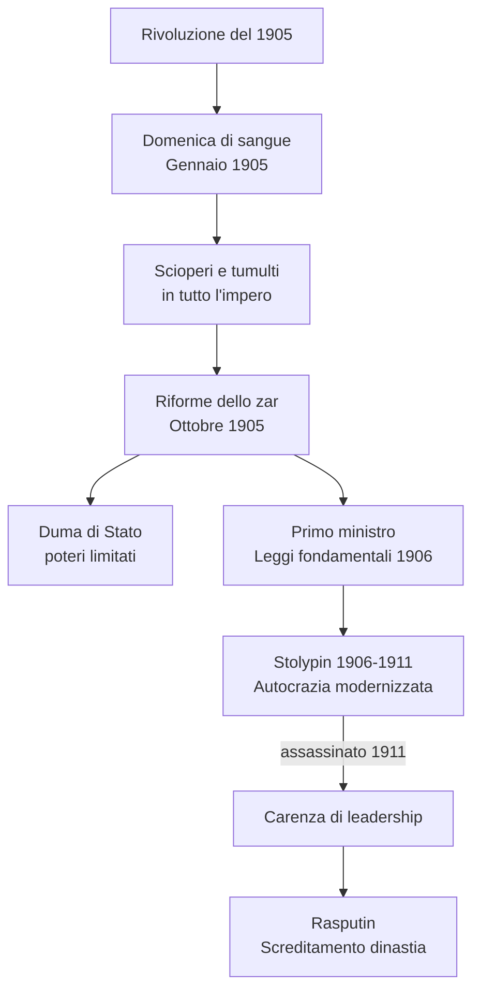
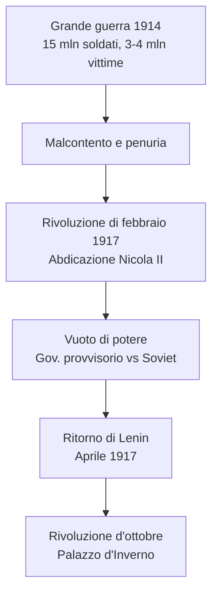
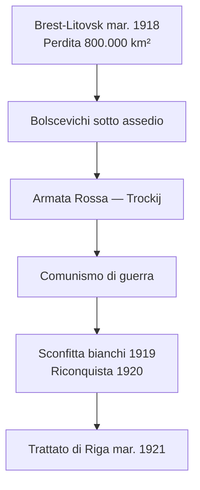
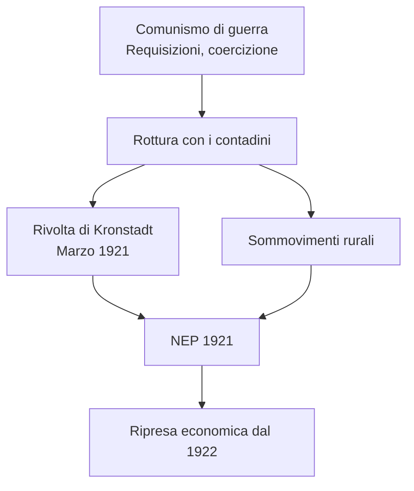
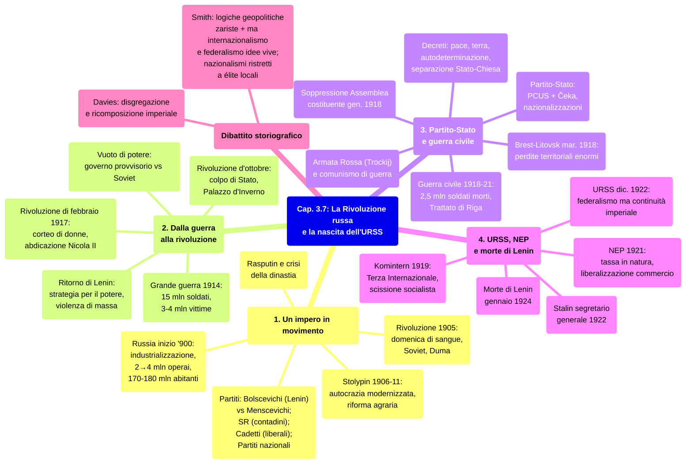

# Ripasso Veloce - Cap. 3.7: La Rivoluzione russa e la nascita dell'Unione Sovietica

---

## 1. Un impero in movimento

### La Russia a inizio '900

- Impero russo: combinazione di **dinamismo** (industrializzazione) e **fragilità** (arretratezza strutturale)
- Classe operaia: da **2 mln (1900)** a **4 mln (1913)**, su 170-180 mln di abitanti (130-140 mln contadini)
- **Industria fortemente concentrata**: oltre metà delle fabbriche con 500+ operai, concentrate a **San Pietroburgo**
- La concentrazione degli operai a Mosca/Pietroburgo li rendeva politicamente potentissimi: «importante per capire la strategia di Lenin» [Lezione]
- Oggi la Russia ha 130-140 mln di abitanti ma la maggioranza vive nelle città: conseguenza dell'urbanizzazione/industrializzazione dell'età comunista [Lezione]
- La Russia come «grande **corridoio euroasiatico**» fino a **Vladivostok**, terminale della **Transiberiana** [Lezione]

### I partiti politici

- **Partito operaio socialdemocratico** (1898, marxista) → scissione 1903:
  - **Bolscevichi** (Lenin): «partito elitario, di pochi rivoluzionari militanti pronti a tutto» (modello **marxista-leninista**), rivoluzione socialista immediata [Lezione]
  - **Menscevichi**: partito di massa (come PSI/SPD), rivoluzione borghese gradualista [Lezione]
- Etimologia: «Lenin» dal **fiume Lena** (Siberia, dove fu prigioniero); «Bolscevichi» = maggioranza (stessa radice di **Bolshoj**) [Lezione]
- **Soviet**: definiti come **consigli formati da operai e soldati** [Lezione]
- **Partito socialista-rivoluzionario** (1901): base contadina, terrorismo, redistribuzione della terra «in base al numero di bocche da sfamare» — non abolire la proprietà privata ma **più proprietà per tutti**, socialismo comunitario (*mir*) [Lezione]
- **Partito dei cadetti** K-D (1905): liberale, borghesie e professionisti
- **Partiti nazionali**: periferie non russe (Polonia, Ucraina, Transcaucasia)

### Rivoluzione del 1905

- Causa: sconfitta contro il **Giappone** → esplosione delle fragilità: autocrazia, nazionalità, questione contadina, questione operaia
- La sconfitta come «limite estremo dell'espansionismo europeo e primo ritorno delle potenze asiatiche» — «cento anni dopo possiamo cogliere ancora meglio quella interpretazione» (allusione alla Cina) [Lezione]
- Sulle nazionalità: «Oggi chi va a morire in Ucraina? I russi di Mosca? Ci vanno i jakuti, i siberiani, quelli delle periferie non russe» [Lezione]
- **«Domenica di sangue»** (gennaio): corteo **pacifico** di operai si dirige al Palazzo d'Inverno innalzando **effigi dello zar** (andavano come sudditi fedeli a chiedere riforme) → i soldati **aprono il fuoco**, massacro. Punto di non ritorno: se lo zar fa sparare anche su chi gli porta i ritratti, non c'è più nulla da aspettarsi dalla monarchia
- Scioperi, tumulti, agitazioni nelle **periferie non russe** (Baltico, Ucraina, Polonia, Caucaso: rivendicazioni nazionali + sociali); al centro dell'impero richieste **politiche**: suffragio universale, Assemblea costituente, libertà individuali
- Nascita dei **Soviet** (consigli di delegati operai) → emerge **Trockij**
- **17 ottobre 1905**: zar concede diritti civili + **Duma di Stato** (poteri limitati)
- Bilancio: ~**15.000 vittime**; monarchia resta **semi-costituzionale**
- Esito principale: **politicizzazione della società russa** — in concreto: **abolizione della censura** (fioritura di giornali), nascita di organizzazioni nazionali nelle periferie, nuovi partiti liberali e conservatori, elezioni alla Duma come motore politico
- Trockij: teoria della **«rivoluzione permanente»** (rivoluzione = processo di lunga durata); Lenin (1906): «Nascondere alle masse la necessità di una guerra accanita, sanguinosa, distruttiva (...) vuol dire ingannare sé stessi e il popolo» — la strategia violenta del 1917 era già programma dal 1906
- **Nazionalismo russo** radicalizzato: «La Russia ai russi!», propaganda xenofoba, **antisemitismo virulento**, ~**600 pogrom** in Ucraina nell'autunno 1905, con **complicità delle autorità locali** (stereotipo: ebreo = rivoluzionario)

### Stolypin e Rasputin

- **Stolypin** (PM 1906-11): «autocrazia modernizzata», riforma agraria, mercato interno → assassinato 1911
- **Rasputin**: mistico a corte, scredita la dinastia
- Russia alla vigilia della guerra: Paese più dinamico d'Europa ma indebolito dalla classe dirigente

---

## 2. Dalla guerra alla rivoluzione

### Grande guerra e rivoluzione di febbraio

- Agosto **1914**: Russia in guerra → stato di guerra ininterrotto fino a marzo 1921
- **15 milioni** di soldati mobilitati; **3-4 milioni** di vittime (il più alto tra i belligeranti)
- Conflitto = **scuola di violenza** per milioni di contadini → ostilità verso ufficiali e classe dirigente
- Limiti: base industriale ristretta, rete ferroviaria inadeguata → **penuria di risorse**
- Alla Russia mancava il «carattere di Stato moderno e industriale» di Germania/Francia/GB; mancavano ferrovie, ufficiali formati [Lezione]
- **L'vov alla Duma**: «È **idiozia**, incapacità totale o tradimento?» — la zarina era tedesca [Lezione]
- Per la Russia «**la guerra in realtà dura dal 1914 al 1921**» — sette anni ininterrotti [Lezione]

> [!note] Dalla lezione
> Il professore cita la frase del principe L'vov come una delle più folgoranti dell'intera vicenda: si alza alla Duma e chiede se quello che sta succedendo al fronte da due anni sia «idiozia o tradimento». Cos'è peggio? Ammettere che lo zar è un incapace totale, o ammettere che è un traditore che ha venduto la Russia alla Germania? E la zarina era tedesca — il sospetto era nell'aria. Siamo a poche settimane dall'abdicazione.
- Settembre **1915**: Nicola II prende il comando → abbandona Pietrogrado → scommessa perdente
- Dicembre **1916**: Rasputin ucciso
- **Febbraio 1917**: **donne lavoratrici tessili** (il settore più oppresso, molte mogli di soldati) stanche di fare la fila per il pane scatenano sciopero spontaneo a Pietrogrado → ~**90.000 scioperanti** il primo giorno; parola d'ordine da «Pane» a «**Abbasso l'autocrazia! Abbasso la guerra!**»; il giorno dopo il movimento raddoppia → **rivoluzione** (23-27 feb. giuliano = 8-12 mar. gregoriano)
- **Abdicazione di Nicola II**: dinastia abbandonata da tutti, incluso l'esercito
- Tre rivoluzioni simultanee: **nazionalità** (indipendenza), **contadini** (occupano terre), **operai** (creano soviet) [Lezione]
- «**Abdicazione** non vuol dire repubblica»: il governo provvisorio avrebbe indetto elezioni per un'Assemblea Costituente per decidere «Impero o Repubblica» [Lezione]
- Sfasamento calendario: Russia ortodossa, «antipapista», non adottò la riforma di Gregorio XIII (1582) — lo fece Lenin; le date del 1917 sono sfalsate di 13 giorni (l'«ottobre» rosso per noi è già novembre) [Lezione]

### Il vuoto di potere

- **Governo provvisorio** (L'vov, liberali/cadetti) vs **Soviet** (menscevichi, SR, sindacati)
- Realtà: **vuoto di potere** — tre questioni irrisolte: **pace**, **terra**, **nazionalità**

### Da Lenin alla Rivoluzione d'ottobre

- **Aprile 1917**: crisi politica (ministro degli Esteri pro-guerra vs Soviet pro-pace) → **governo di coalizione** liberali+socialisti; nello stesso mese Lenin torna dall'esilio (viaggio favorito dalla Germania) → rivoluzione socialista, violenza di massa
- **«Per lui è TUTTA TATTICA»**: pace, terra, libertà alle nazionalità = mosse verso l'unico obiettivo: **conquista del potere** [Lezione]
- Contadini volevano **redistribuzione** (proprietà per tutti); Lenin voleva **collettivizzazione** — ma tatticamente appoggiò la redistribuzione [Lezione]
- Lettera di Lenin: «Dobbiamo trovare gente per cui sparare in testa alla gente non è un grosso problema» — paragone con i **Pasdaran iraniani** [Lezione]
- Trockij: «ebreo russo, il suo nome era Lev Bronštejn»; Stalin: «l'uomo d'acciaio», giovane georgiano, «uno dei peggiori dittatori della storia» [Lezione]
- Pietrogrado: «Burg» (tedesco) → «Grad» (russo) per la furia nazionalista anti-tedesca; Caterina II era tedesca, tanti ministri e generali erano tedeschi [Lezione]
- L'Ucraina va riconquistata per il **grano**, il Caucaso per il **petrolio** [Lezione]

> [!note] Dalla lezione
> Due dettagli del professore vale la pena fissare. Primo: il calendario. Il motivo per cui la rivoluzione si chiama «d'ottobre» ma cade a novembre è che la Russia ortodossa non aveva mai accettato la riforma del calendario gregoriano di papa Gregorio XIII (1582) — per principio antipapista. Così nel 1917 era ancora indietro di 13 giorni. La riforma la fece Lenin subito dopo aver preso il potere. Secondo: il nome Pietrogrado. «Burg» è tedesco, «grad» è russo — stessa parola, diversa lingua. In piena guerra anti-tedesca non si poteva tenere un nome tedesco. Ma il punto più interessante è il contesto: tra russi e tedeschi c'erano stati legami strettissimi per tutto il Settecento-Ottocento — Caterina II era tedesca, molti generali e nobili baltici erano tedeschi, persino Nicola II aveva sangue tedesco. La furia nazionalista della guerra ha cancellato in pochi mesi secoli di osmosi culturale.

- **Luglio**: «tutto il potere ai Soviet» — repressione, Lenin fugge in Finlandia
- **Agosto**: colpo di **Kornilov** sventato dai bolscevichi → rafforzamento: Trockij presiede il Soviet, **20-30.000 armati**
- Lenin adotta programma contadino: **pace + terra**
- **24-25 ottobre** (giuliano = 6-7 nov. gregoriano): bolscevichi armati conquistano Pietrogrado e il **Palazzo d'Inverno** → **colpo di Stato** di Lenin = l'**«ottobre rosso»** [Lezione]

---

## 3. Il partito-Stato dei bolscevichi e la guerra civile

### Primi provvedimenti

- **Decreto sulla pace** (subito), **sulla terra** (giorno dopo), sull'**autodeterminazione** (con Stalin)
- Tutti provvedimenti **tattici**: «pace subito» = accettare le durissime condizioni tedesche; la terra i contadini «se la stanno già prendendo»; autodeterminazione = «quasi tutta tattica, mai far capire al nemico il vero obiettivo» [Lezione]
- **Gennaio 1918**: separazione **Stato-Chiesa** (Chiesa estromessa dalle scuole, privata di proprietà; uccisioni di clero)
- Assalto alla Chiesa: chiese minate e fatte esplodere (Piazza Rossa, Stalin), decine di migliaia nei Gulag; il comunismo come quasi-religione: «Marx il profeta, *Il Capitale* il libro sacro, la società comunista la terra promessa» [Lezione]

> [!note] Dalla lezione
> Il professore spiega il motivo strutturale per cui il comunismo non poteva convivere con la fede: il comunismo è esso stesso una religione laica, con il suo profeta (Marx), il suo libro sacro (*Il Capitale*), il suo verbo (la filosofia marxista) e la sua promessa di salvezza (la futura società comunista). Non si può servire due padroni. I bolscevichi lo sapevano bene, e l'assalto alla Chiesa ortodossa fu sistematico: chiese chiuse, monasteri soppressi, vescovi fucilati o nei gulag, e le chiese sulla Piazza Rossa fatte saltare con la dinamite da Stalin negli anni successivi.

### Soppressione della Costituente e partito-Stato

- Elezioni Assemblea costituente: bolscevichi **24%** (170 seggi), SR **400+ seggi**
- Lenin **sopprime la Costituente** (gennaio 1918) — sciolta con la violenza «dopo appena una seduta sola»; «tutto il potere ai soviet = tutto il potere a noi»; poi elimina gli avversari: «o con noi oppure eliminati fisicamente» [Lezione]
- Costruzione del **«partito-Stato»**: PCUS + **Čeka** (polizia politica, dic. 1917) — **dittatura monopartitica** [Lezione]
- Struttura: **Politbjuro** + segreteria Comitato centrale; duplicazione organismi → **burocrazia elefantiaca**
- Čeka: polizia politica con **200.000 effettivi**, reclutati fra criminali; Armata Rossa l'altro pilastro — «due istituzioni tipiche del regime» per mantenere il potere con la violenza [Lezione]
- Il partito bolscevico divenne **Partito Comunista** (come la Lega di Spartaco in Germania); p. 197: «costruzione di un nuovo **embrione di stato**» [Lezione]
- **Nazionalizzazione** di banche, industrie, commercio

### Brest-Litovsk e guerra civile

- Dic. **1917**: invasione dell'Ucraina (prima manifestazione di **propensione imperiale**)
- **3 marzo 1918**: **Trattato di Brest-Litovsk** → perdita di **800.000 km²** (Ucraina, Polonia, Finlandia, Baltici), 1/3 della popolazione
- Capitale spostata a **Mosca**
- La questione ucraina ha «almeno cento anni»: tra 1918 e 1920 l'Ucraina tentò l'indipendenza, prima aiutata dalla Germania, poi riconquistata dai bolscevichi — mostra una profonda **continuità storica** nelle mire imperiali di Mosca [Lezione]
- Bolscevichi circondati da: nazionalisti, **bianchi** (bianco = colore dei Romanov, nostalgici dell'impero zarista) [Lezione], eserciti contadini (reduci dal fronte, armati, fino a **50.000 uomini**) [Lezione], **potenze straniere** (tedeschi, britannici, giapponesi, americani, romeni) — invasione «da nord e da sud, dal Mar Nero e dal Mar Bianco» [Lezione]
- **Armata Rossa** (Trockij): coscrizione obbligatoria, disciplina ferrea, ex ufficiali zaristi + commissari politici
- **«Comunismo di guerra»**: mobilitazione permanente, violenza, lavoro forzato
- La guerra civile come **«fase eroica»** fondativa dell'URSS, «frammista a violenze e atrocità di ogni tipo» [Lezione]
- **Militarizzazione dell'azione politica**: «l'avversario lo spari, lo arresti, lo torturi» — vita politica post-bellica «brutale» per assuefazione alla violenza [Lezione]
- «Dalla guerra al fronte in trincea alla guerra civile nelle strade» — vale per la **rivoluzione rossa** e per quella **nera (fascismo)** [Lezione]
- **Militarizzazione della vita economica**: operai in turni massacranti «senza la domenica» (assenza = fucilazione); contadini costretti a consegnare tutto alla Čeka (anche bestiame da riproduzione e grano per la semina) [Lezione]

> [!note] Dalla lezione
> Il professore aggiunge un elemento che chiarisce molto la dinamica dei rapporti tra bolscevichi e contadini: quei contadini che si armano sono **reduci di guerra**, milioni di uomini che erano stati al fronte e erano tornati con le armi in mano. Non sono contadini inermi — sono soldati. Gli eserciti contadini arrivano a 50.000 uomini. Per questo Lenin all'inizio dice sì alla redistribuzione delle terre: aprire un fronte anche con loro sarebbe stato suicida. Prima si vince la guerra civile contro i bianchi e le potenze straniere, poi si pensa ai contadini. E quando arriva quel momento, lo strumento usato è la carestia: nel 1921-22 non si distribuisce il grano alle regioni in difficoltà, si lascia che la fame «pieghi la resistenza». Inizia lì quella che il professore chiama «una lunghissima guerra tra i bolscevichi e i contadini, anche attraverso la fame» — che avrà il suo epilogo catastrofico con Stalin.

> [!note] Dalla lezione
> Il professore insiste su un punto storiograficamente importante: per la generazione dei vecchi bolscevichi, **non è la Rivoluzione d'Ottobre il momento fondante dell'URSS, è la guerra civile**. È lì che hanno piegato l'esercito zarista, riconquistato l'Ucraina e la Georgia, sconfitto gli eserciti contadini armati (fino a 50.000 uomini), dimostrato che erano pronti a tutto. La Rivoluzione d'Ottobre è un colpo di Stato; la guerra civile è la nascita vera dello Stato. Il prezzo sommato — Grande Guerra + guerra civile + repressioni Čeka + carestia — è catastrofico: tra il 1914 e il 1922 la Russia è in guerra praticamente ininterrottamente per otto anni.

### Conclusione della guerra civile

- **1919**: sconfitta dei bianchi
- **1920**: riconquista Transcaucasia e Ucraina
- **Marzo 1921**: **Trattato di Riga** con la Polonia
- Bilancio: **2,5 mln soldati morti** + 500.000 per repressioni + 2-5 mln di morti di fame [Lezione]; la **carestia del 1921-22** usata per «piegare la resistenza dei contadini» — «iniziava una lunghissima guerra attraverso la fame» [Lezione]
- Arretramento delle frontiere occidentali (perdita di Polonia, Finlandia, Baltici, Bessarabia)

---

## 4. L'Unione Sovietica, la NEP e la morte di Lenin

### Nascita dell'URSS

- **Dicembre 1922**: nasce l'**URSS** — Stato plurinazionale federale (senza «russo» nel nome)
- Repubbliche su **base linguistica**: Russia, Ucraina, Bielorussia, Transcaucasia
- **Continuità imperiale**: forte potere centrale, ruolo della cultura russa, espansionismo, Mosca capitale imperiale, proiezione universale del comunismo
- **«Mosca terza Roma»**: continuità messianica dallo zarismo (guida del cristianesimo ortodosso) al comunismo (faro del proletariato mondiale e «luce per l'umanità») [Lezione]
- URSS «federale per modo di dire» — governa il Partito Comunista; Stalin nel 1939-40 invase i **Baltici** e tentò la Finlandia (senza successo — «dovette mollare l'osso»); repubbliche centroasiatiche nate «per partenogenesi» dalla Russia [Lezione]
- **«Mosca terza Roma»**: continuità messianica dallo zarismo (guida del cristianesimo ortodosso) al comunismo (faro del proletariato mondiale) [Lezione]
- Manuale p. 201: «**significative continuità** con la dimensione imperiale» — lo Stato bolscevico «erede del grande spazio euro-asiatico» [Lezione]

### Komintern (Terza Internazionale)

- Fondato a Mosca **marzo 1919** — singolarità: **connesso organicamente all'URSS**
- Doppio strumento: diplomazia statale + promozione della rivoluzione (subordinata agli interessi sovietici)
- **II congresso (1920)**: condizioni drastiche → **rottura con la socialdemocrazia**, scissione dei partiti socialisti europei
- Nascita di partiti comunisti nazionali (anche Italia) → **divisione duratura** del socialismo
- **1928** (Stalin): «È rivoluzionario chi difende l'URSS senza riserve»
- «Progetto di sovversione globale»: Mosca con **doppio strumento** — diplomazia e Komintern («da una parte intrattieni relazioni, dall'altra vuoi sovvertire quei paesi») [Lezione]
- Dal PSI nacque il **PCI** per scissione; accusa di «doppiezza» ai comunisti: «A chi siete fedeli? All'Italia o all'URSS?» [Lezione]
- Stalin 1928: frase «lapidaria» — i comunisti accusati di essere «traditori, sovversivi o spie» per fedeltà a Mosca [Lezione]

### NEP (1921)

- Guerra civile → **rottura con i contadini** (requisizioni, coercizione, tortura) → insurrezioni dal 1818 («grande guerra contadina» — Graziosi)
- **Rivolta di Kronstadt** (marzo 1921): marinai chiedono primato dei soviet, libertà
- **NEP**: tassa in natura (non requisizioni), commercializzazione autonoma delle eccedenze, parziale liberalizzazione del commercio
- **NEP come tatticismo**: per Lenin è una «ritirata strategica» (tacticismo puro) per riprendere il consenso dopo le devastazioni del comunismo di guerra [Lezione]
- Antefatto: la **riforma agraria di Stolypin** (dal 1907) aveva tentato di creare piccoli proprietari contadini, ma era andata a metà — qualche proprietario e molti indebitati sul lastrico; nel 1917 questi contadini delusi colgono l'occasione e prendono le terre; Lenin lascia fare (tatticismo: il vero obiettivo comunista è la collettivizzazione, non la redistribuzione, ma non puoi dirlo nel '17) [Lezione]
- **Carestia 1921-22**: ~**1,5 milioni** di vittime (Volga, Caucaso, Ucraina orientale)
- Primo atto della «**grande guerra contadina**» — «**uno Stato contro il suo popolo**»; la Čeka requisì anche il bestiame da riproduzione e il grano per la semina → carestia; nel 1922 nessuno aveva la forza di togliere le terre ai contadini, ma poi **Stalin** scatenò la carestia del 1931-33 (**6 milioni di morti**) per spezzare definitivamente la resistenza [Lezione]
- Ripresa economica dal raccolto 1922; politica di «**indigenizzazione**»; vivacità culturale

### Irrigidimento e morte di Lenin

- **X congresso (1921)**: divieto di «frazioni»
- **XI congresso (1922)**: **Stalin** segretario generale; Čeka → **GPU**
- **Maggio 1922**: Lenin colpito da ictus; condizioni peggiorano
- **Gennaio 1924**: **morte di Lenin** (53 anni) → lotta per la successione tra **Trockij** (numero due, creatore dell'Armata Rossa) e **Stalin** — «l'avrebbe spuntata con ogni mezzo Stalin» [Lezione]
- **Assassinio di Trockij**: ucciso nel 1940 in Messico da **Ramón Mercader** (ziastro di Christian De Sica), sicario di Stalin [Lezione]

---

## Mappa concettuale d'insieme

