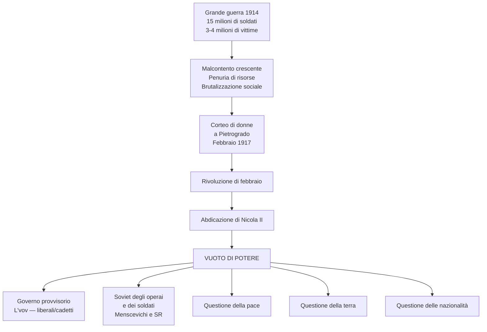
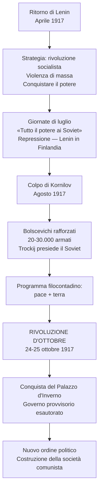
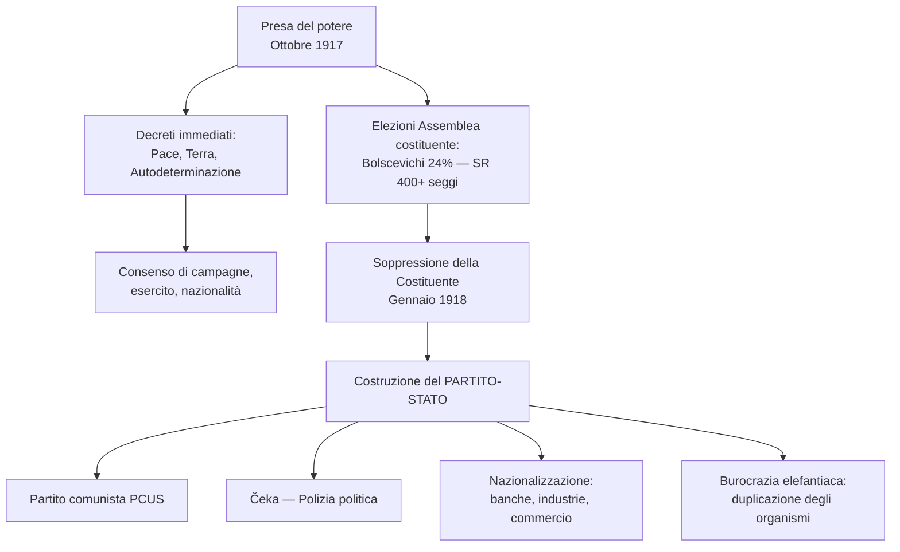
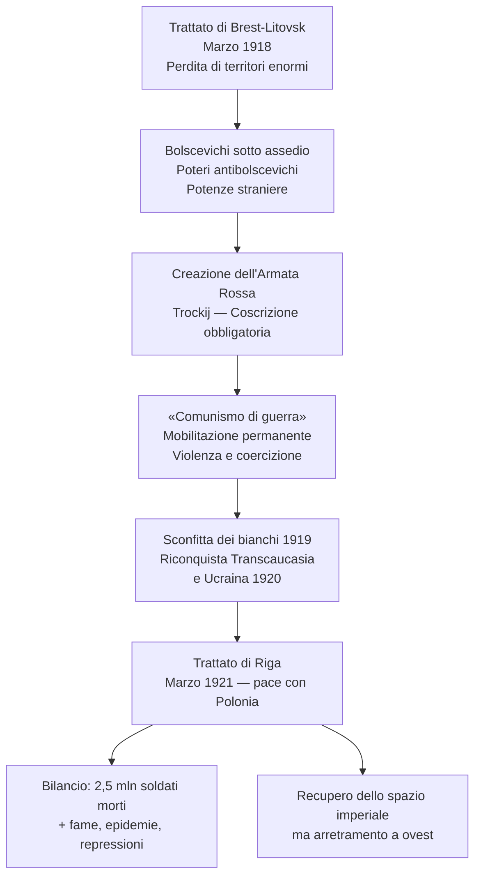
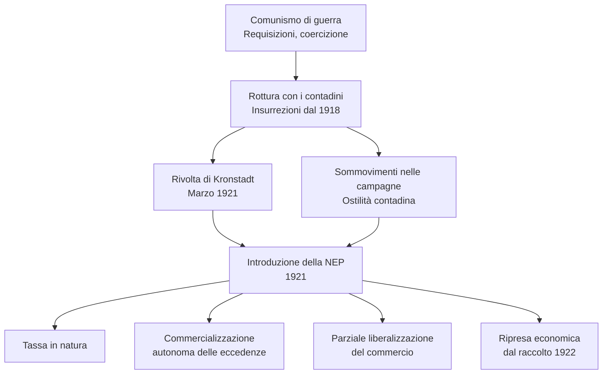

# Schema di Studio - Capitolo 3.7: La Rivoluzione russa e la nascita dell'Unione Sovietica

---

## 1. Un impero in movimento

### 1.1 La Russia all'inizio del XX secolo

Alla vigilia della Grande guerra, l'Impero russo presentava una combinazione di **dinamismo e fragilità**. Le riforme attuate nel secondo Ottocento avevano messo in luce le risorse dello Stato, ma anche la sua arretratezza strutturale. Dal processo di **industrializzazione** era sorta una **classe operaia** in rapida crescita: secondo stime attendibili, gli operai passarono da circa **2 milioni nel 1900** a circa **4 milioni nel 1913**, su una popolazione complessiva di **170-180 milioni di abitanti**, composta per più di tre quarti da contadini.

I lavoratori dell'industria occupavano una posizione strategicamente decisiva: si concentravano nei **luoghi nevralgici** dell'impero, a partire dalla capitale **San Pietroburgo**, e lo sviluppo russo aveva determinato un'**industria fortemente concentrata** — oltre la metà delle fabbriche erano grandi stabilimenti con più di **500 operai**. Questo significava che la classe operaia, pur numericamente ridotta rispetto alla massa contadina, aveva un peso politico ed economico sproporzionato.

> [!note] Dalla lezione
> Il professore insiste sul perché questa concentrazione sia fondamentale per capire Lenin: quegli operai non erano sparsi nelle campagne, erano tutti insieme nelle fabbriche giganti di Mosca e Pietroburgo. Quattro milioni su centottanta, certo — ma erano nei posti che contano. E poi ci fa notare una cosa interessante: la Russia oggi ha 130-140 milioni di abitanti, meno di allora, anche perché non ci sono più le repubbliche centroasiatiche né l'Ucraina né la Polonia. Ma la differenza davvero grande è che oggi la stragrande maggioranza di questi russi vive nelle città, non nelle campagne. Quella trasformazione è il frutto diretto dell'industrializzazione forzata del periodo comunista — un paradosso: il regime che voleva liberare il contadino lo ha urbanizzato in un secolo.
>
> Vale anche la pena ricordare dove si trova questa Russia: è il «grande corridoio euroasiatico» che dalla Russia europea si allarga verso la Persia, l'Asia centrale, la Cina, fino ad arrivare sul Mar del Giappone, a Vladivostok, il terminale della Transiberiana. Un impero enorme, tenuto insieme più dalla ferrovia che dalla politica.

### 1.2 L'organizzazione delle forze politiche

A fine Ottocento in Russia agivano diverse formazioni politiche **in clandestinità**, dato che il regime autocratico non permetteva partiti o parlamenti:

*   **Partito operaio socialdemocratico russo** (fondato nel 1898): si rifaceva alla dottrina marxista. Nel **1903** si spaccò in due correnti:
    *   **Bolscevichi** (massimalisti rivoluzionari, "maggioranza"): guidati da **Lenin**. Volevano un partito di "rivoluzionari di professione" (regolato dal *centralismo democratico*) per realizzare una **rivoluzione socialista** immediata, forzando le tappe storiche nonostante l'arretratezza russa.
    *   **Menscevichi** (riformisti, "minoranza"): ritenevano che la Russia non fosse pronta per il socialismo e che si dovesse passare prima per una rivoluzione borghese e liberale, come nel resto d'Europa.
*   **Partito socialista-rivoluzionario** (fondato nel 1901): eredi della tradizione **populista**. Rappresentavano i **contadini** e chiedevano la redistribuzione di tutta la terra. Volevano costruire il socialismo a partire dalle strutture comunitarie dei villaggi russi (*mir*), e praticavano spesso azioni terroristiche.
*   **Partito dei cadetti** (K-D, Partito democratico-costituzionale, 1905): di orientamento liberale, rappresentava la borghesia, i professionisti e l'imprenditoria. Chiedeva una Costituzione e libertà civili.
*   **Partiti "nazionali"**: nati nelle periferie non russe (Polonia, Ucraina, Caucaso) per rivendicare l'autonomia.

### 1.3 La rivoluzione del 1905 e le sue conseguenze

Il fermento sociale, aggravato dall'umiliante **sconfitta contro il Giappone** (1904-1905), esplose nel **1905**, mettendo in luce le fragilità dell'impero: sistema autocratico inadeguato, questione contadina irrisolta, tensioni operaie e spinte nazionaliste.

La scintilla si accese a San Pietroburgo in una **domenica di gennaio del 1905**, passata alla storia come la **«domenica di sangue»**. Un corteo di operai si avvicinò al Palazzo d'Inverno (la reggia degli zar) in modo **pacifico**, innalzando **effigi del sovrano** — non bandiere rosse, non slogan rivoluzionari: andavano dallo zar come **sudditi fedeli** che chiedevano riforme. I soldati schierati davanti alla reggia **aprirono il fuoco sulla folla**, provocando un massacro. L'evento fu un punto di non ritorno: se lo zar faceva sparare persino su chi gli portava i ritratti, non c'era più nulla da aspettarsi dalla monarchia.

Seguirono **scioperi** nelle città con massicce partecipazioni operaie, **tumulti contadini** repressi dai militari, e agitazioni violente soprattutto nelle **periferie non russe** (dal Baltico all'Ucraina, dalla Polonia al Caucaso), dove si intrecciavano **rivendicazioni nazionali e sociali**. Al centro dell'impero la richiesta era invece **politica e istituzionale**: trasformazione del sistema in senso liberal-costituzionale, suffragio universale, Assemblea costituente, libertà individuali. Nelle fabbriche nacquero per la prima volta i **Soviet** (in russo *sovet*, "consiglio" — Consigli di delegati operai), nei quali emerse la figura del menscevico **Lev Trockij**.

**Le riforme e il loro fallimento**
Il 17 ottobre 1905 lo **zar Nicola II** fu costretto a cedere: promulgò un manifesto concedendo le libertà civili e istituendo una **Duma di Stato** (Parlamento elettivo), trasformando l'impero in una **monarchia assoluta semi-costituzionale**. La sinistra rivoluzionaria continuò però le lotte (a Mosca a dicembre un'insurrezione bolscevica fu repressa nel sangue con 15.000 morti).

**La politicizzazione della società russa** fu l'esito principale del 1905. L'**abolizione della censura** portò a una fioritura di giornali di ogni orientamento; nacquero **organizzazioni di carattere nazionale** nelle periferie; si formarono **nuovi partiti liberali e conservatori**; le elezioni alla Duma e l'attività parlamentare animarono l'iniziativa delle formazioni politiche. L'esperienza rivoluzionaria stimolò anche approfondimenti teorici decisivi: **Trockij** elaborò la teoria della **«rivoluzione permanente»** (la rivoluzione come processo di lunga durata, con tappe e fasi diverse), mentre **Lenin** nel 1906 scriveva: «Nascondere alle masse la necessità di una guerra accanita, sanguinosa, distruttiva, come obiettivo immediato dell'azione futura, vuol dire ingannare sé stessi e il popolo.»

Il 1905 spinse anche il **nazionalismo russo** a radicalizzarsi: «La Russia ai russi!» era lo slogan delle organizzazioni nazionaliste, che si segnalarono per **propaganda xenofoba** e **virulenta militanza antisemita**. Nell'autunno 1905 la violenza verso gli ebrei — nei quali lo stereotipo antisemita individuava la figura del rivoluzionario — dilagò, con circa **600 pogrom in Ucraina**, realizzati con la **complicità delle autorità locali**.

Dal 1906 il Primo ministro conservatore **Pëtr Stolypin** tentò una "riforma dall'alto": rinnovare la classe dirigente e creare un ceto di contadini proprietari benestanti tramite una riforma agraria, per allargare la base sociale del regime. Stolypin represse duramente le opposizioni ma fu assassinato nel 1911. La sua morte lasciò un vuoto di potere a corte, colmato in parte dall'influenza della controversa figura del monaco mistico **Grigorij Rasputin**, sintomo del degrado e della debolezza della dinastia Romanov.

---

## 2. Dalla guerra alla rivoluzione

### 2.1 La Russia nella Grande Guerra

L'ingresso della Russia nella **Prima guerra mondiale (1914)**, con la chiamata alle armi di 15 milioni di uomini, si rivelò disastroso. L'economia di guerra si scontrò con i limiti dell'arretratezza del Paese (infrastrutture inadeguate, scarsità di mezzi e risorse). La guerra provocò il numero più alto di vittime in assoluto tra i paesi belligeranti (3-4 milioni di russi), diventando una formidabile "scuola di violenza" che abituò le masse all'uso delle armi.

La brutalizzazione sociale, la scarsità di beni primari e i rovesci militari generarono un malcontento esplosivo, minando definitivamente il prestigio dello zar Nicola II, che aveva assunto personalmente il comando delle truppe nel 1915 allontanandosi dalla capitale.

### 2.2 La rivoluzione di febbraio 1917 e l'abdicazione dello zar

Il malcontento esplose a Pietrogrado (nuovo nome di San Pietroburgo dal 1914) nel **febbraio 1917** (23-27 febbraio giuliano = 8-12 marzo gregoriano). La scintilla venne dal basso: un corteo di **donne lavoratrici tessili** — il settore più oppresso del proletariato, tra cui molte **mogli di soldati** — stanche di fare la fila per il pane, scatenò uno sciopero spontaneo. Il primo giorno contò circa **90.000 scioperanti** tra uomini e donne. La parola d'ordine passò rapidamente da **«Pane»** a **«Abbasso l'autocrazia! Abbasso la guerra!»**. L'indomani il movimento raddoppiò: circa metà degli operai industriali di Pietrogrado era in sciopero. Le truppe inviate a reprimere la protesta si ammutinarono e si unirono ai manifestanti. Questa fu la **Rivoluzione di febbraio**, che portò all'**abdicazione dello zar Nicola II** e alla fine secolare dell'Impero russo.

### 2.3 Il crollo dello zarismo e il doppio potere

Si aprì una fase di **effervescenza rivoluzionaria e confusione**, destinata a durare finché non si fosse ricostituito un centro di potere. Nella capitale si confrontarono due centri di iniziativa:

| Centro di potere | Composizione | Base |
|---|---|---|
| **Governo provvisorio** | Guidato dal principe **L'vov**, formato da esponenti liberali (cadetti) | Collegato alla **Duma** |
| **Soviet degli operai e dei soldati** | Sorto a Pietrogrado per iniziativa dei partiti socialisti (menscevichi, socialisti-rivoluzionari) e sindacati | Base popolare operaia e militare |

La realtà fu un **vuoto di potere**: governo dalle basi deboli e Soviet paralizzato dalle divisioni interne e dalla posizione attendista dei socialisti (che aspettavano una rivoluzione «borghese» dei liberali). Tre questioni irrisolte:
1. La **pace** (la guerra era ancora in corso);
2. La **distribuzione della terra** ai contadini;
3. La **questione delle nazionalità** (nelle periferie la rivoluzione assumeva tratti di moto nazionale indipendentista: Ucraina, Transcaucasia).

### 2.4 Il ritorno di Lenin: una lucida strategia per il potere

In **aprile 1917**, una crisi politica (contrasto tra il ministro degli Esteri, favorevole alla guerra, e il Soviet di Pietrogrado, che chiedeva la pace) sfociò in un **governo di coalizione** con un aumento dei ministri socialisti accanto alla maggioranza liberale.

Nello stesso mese **Lenin**, fino ad allora in esilio, fece ritorno in Russia grazie ad **accordi con il governo tedesco**, che ne favorì il viaggio convinto che il suo intervento avrebbe destabilizzato ulteriormente la Russia, a vantaggio degli interessi bellici della Germania.

Al suo rientro, Lenin si distinse per **strategia e lucidità**: sostenne che era giunto il momento della **rivoluzione socialista**, superando l'orizzonte della rivoluzione borghese. La sua capacità di leadership gli permise di portare la maggioranza del partito sulle sue posizioni. Trovò un importante alleato in **Trockij**, sostenitore di un'azione politica decisa e violenta.

> [!note] Dalla lezione
> Il professore chiarisce con una certa brutalità in cosa consistesse la «lucidità» di Lenin: tutto — la pace, la terra ai contadini, il diritto all'autodeterminazione delle nazionalità — era **tutta tattica**. Non è un giudizio storiografico: è quello che Lenin stesso diceva ai suoi collaboratori più stretti. La pace? Serve per prendere il potere adesso, poi l'Ucraina la riconquistiamo (serve il grano) e il Caucaso lo riconquistiamo (serve il petrolio). La terra ai contadini? I comunisti vogliono la collettivizzazione, non la redistribuzione — ma dirlo nel 1917 sarebbe stato suicida, quindi per ora si lascia fare. Le nazionalità? Stessa cosa: si finge di appoggiare la Finlandia indipendente, l'Ucraina indipendente, e poi si riprende tutto. «L'obiettivo vero è uno solo: la conquista del potere».
>
> Quanto a Trockij, il professore precisa che il suo vero nome era **Lev Bronštejn**, era un ebreo russo. Anche Lenin non si chiama Lenin: era **Vladimir Uljanov**, e «Lenin» è il soprannome che si era guadagnato dopo anni di prigione zarista in Siberia, sul fiume Lena. Come dire: quello di San Vittore, quello di Rebibbia — quello del fiume Lena. Stalin invece viene dal georgiano: «l'uomo d'acciaio». Tre soprannomi rivoluzionari, tre personaggi che avrebbero cambiato il mondo.

L'obiettivo di Lenin era **conquistare il potere** attraverso la **violenza di massa**: i bolscevichi, dotati di milizie armate, erano i più preparati, grazie anche alla loro penetrazione tra i **soldati della guarnigione di Pietrogrado** e gli **operai** delle fabbriche.

### 2.5 «Tutto il potere ai Soviet»

> [!note] Dalla lezione
> Il professore fa una piccola digressione su Pietrogrado che vale la pena ricordare: perché la città cambia nome nel 1914 da San Pietroburgo a Pietrogrado? Perché «Burg» in tedesco vuol dire «città», e in piena guerra contro la Germania tenere un nome tedesco era politicamente insostenibile. Allora si traduce: «Grad» in russo vuol dire «città», e nasce Pietrogrado. Oggi la città ha ripreso il nome di San Pietroburgo. Il cambio di nome era il segnale di qualcosa di più profondo: tra russi e tedeschi nel Settecento e Ottocento c'erano stati legami strettissimi — Caterina II era tedesca, molti generali e ministri zaristi erano tedeschi, tanti nobili balto-tedeschi avevano grandi proprietà nell'impero. La furia nazionalista della guerra aveva cancellato tutto questo in pochi mesi.

Ai primi di **luglio 1917**, Pietrogrado fu scossa da **manifestazioni operaie** e dalla mobilitazione di **soldati** ostili all'offensiva contro gli Imperi centrali, voluta dal ministro della Guerra **Kerenskij** (socialista-rivoluzionario).

Il **4 luglio**, un corteo armato guidato da reparti militari ribelli e milizie bolsceviche assediò la sede del Soviet per forzare la dirigenza menscevica ad assumere la linea rivoluzionaria: **«tutto il potere ai Soviet»**. Il governo represse l'iniziativa militarmente: Trockij e altri furono arrestati, Lenin fuggì in **Finlandia**, ormai convinto che la rivoluzione non potesse più passare per i Soviet (in mano a menscevichi e socialisti-rivoluzionari). Doveva essere il **partito bolscevico** a conquistare tutto il potere.

### 2.6 La crescente forza dei bolscevichi

Alla fine di **agosto**, il generale **Kornilov** ordinò a un corpo di cavalleria di marciare su Pietrogrado per un **colpo di Stato militare**. **Kerenskij** (diventato Primo ministro il 20 luglio dopo le dimissioni di L'vov) dovette fare appello al Soviet e ai bolscevichi. L'intervento delle **milizie bolsceviche** fu decisivo per sconfiggere Kornilov, ma mise a nudo l'estrema debolezza del governo e dell'esercito (disertori quasi un milione).

I bolscevichi, grazie alla loro ostilità alla guerra e al ruolo nella sconfitta di Kornilov, videro ingrossare le loro file. **Trockij**, presidente del Soviet di Pietrogrado (dove avevano messo in minoranza la dirigenza menscevica), aveva ai suoi ordini tra i **20.000 e i 30.000 armati**.

Nelle campagne i contadini assaltavano le proprietà terriere. Lenin fece suo il programma del **Congresso dei deputati contadini**: **pace** e **distribuzione egualitaria della terra**. Un passo fondamentale verso la conquista del potere.

### 2.7 La Rivoluzione d'ottobre

La notte del **24 ottobre** (calendario giuliano = 6 novembre gregoriano) alcune migliaia di **bolscevichi armati** presero il controllo dei centri strategici di Pietrogrado. La notte successiva **conquistarono il Palazzo d'Inverno**, esautorando il governo provvisorio.

La Rivoluzione d'ottobre fu un **colpo di Stato** preparato da Lenin — una realtà che non ne ridimensiona l'importanza storica né il sostegno ricevuto da una parte significativa del Paese. Al rombo dei cannoni iniziava la vicenda storica «grandiosa e tragica» di un nuovo ordine politico, il cui fine era la costruzione della **società comunista**.

> [!note] Dalla lezione
> Il professore spiega subito il motivo della doppia datazione che troviamo spesso per gli eventi del 1917 — «febbraio/marzo», «ottobre/novembre». La Russia ortodossa non aveva mai accettato la riforma del calendario gregoriano voluta da Gregorio XIII nel 1582 (la trovavano roba papista, «quasi peggio degli inglesi»), e così nel 1917 il calendario russo era ancora indietro di tredici giorni rispetto al resto d'Europa. La riforma la fece poi Lenin, una volta preso il potere. Quindi: l'abdicazione dello zar avviene in «febbraio» per i russi ma è già marzo per noi; la presa del potere bolscevica è «l'ottobre rosso» ma per noi è già novembre. Poi le cose si sono riallineate.

**Schema riassuntivo: La rivoluzione in Russia nel 1917**

| | Rivoluzione di febbraio | Rivoluzione d'ottobre |
|---|---|---|
| **Causa scatenante** | Corteo di donne per il pane | Colpo di Stato pianificato da Lenin |
| **Esito immediato** | Abdicazione di Nicola II, fine zarismo | Presa del potere dei bolscevichi |
| **Risultato politico** | Governo provvisorio + Soviet → vuoto di potere | Conquista del Palazzo d'Inverno → nascita della società comunista |

---

## 3. Il partito-Stato dei bolscevichi e la guerra civile

### 3.1 I primi provvedimenti di Lenin

Le prime mosse dopo la presa del potere furono fulminee e decisive:

| Provvedimento | Tempistica | Contenuto |
|---|---|---|
| **Decreto sulla pace** | Due ore dopo la presa del potere | Proposta immediata di pace |
| **Decreto sulla terra** | Il giorno successivo | Distribuzione della terra ai contadini |
| **Decreto sull'autodeterminazione** | Subito dopo | Diritto dei popoli dell'impero all'autodeterminazione (elaborato da Lenin insieme a **Stalin**) |
| **Separazione Stato-Chiesa** | Gennaio 1918 | Rottura dell'unità secolare; Chiesa estromessa dalle scuole, privata della personalità giuridica e della proprietà |

L'impatto fu di vasta portata: Lenin ottenne l'appoggio delle **campagne**, dell'**esercito** e delle **minoranze nazionali**.

L'**assalto alla Chiesa ortodossa** ebbe motivazioni multiple: la Chiesa era storico pilastro del potere zarista, istituzione radicata nel mondo rurale (quindi competitiva col nuovo potere), e l'ideologia bolscevica aveva un **orientamento antireligioso**. Al decreto seguì una lunga serie di **uccisioni** di vescovi, preti, monaci e laici, oltre a una campagna per la chiusura dei monasteri culminata nei primi anni Venti.

> [!note] Dalla lezione
> Il professore spiega perché il comunismo non poteva tollerare la Chiesa: non è solo questione di potere politico, è strutturale. Il comunismo si configura esso stesso come un'ideologia con i tratti del religioso — c'è il profeta (Marx), c'è il libro sacro (*Il Capitale*), c'è il verbo (la filosofia marxista), c'è la promessa di una terra promessa (la futura società comunista). Non si può essere fedeli al comunismo e a Dio insieme: essere comunisti vuol dire essere materialisti e atei. E le chiese sulla Piazza Rossa? Stalin le fece saltare con la dinamite negli anni successivi. Decine di migliaia di preti, monaci e vescovi finirono nei gulag.

### 3.2 Il secondo colpo di mano: la soppressione della Costituente

L'obiettivo prioritario di Lenin era **consolidare il potere**. I bolscevichi, nonostante le parole d'ordine filocontadine e nazionaliste, erano il **partito dello Stato forte**, paradossalmente il più in linea con la tradizione russa di lungo periodo: al centro di un impero il potere doveva essere forte, pena il collasso.

Le **elezioni per l'Assemblea costituente**, indette dal precedente governo, assegnarono ai bolscevichi solo il **24% dei consensi** (170 deputati su 700), mentre il **Partito socialista-rivoluzionario** conquistò oltre **400 seggi**. La Russia profonda, contadina, si era espressa per un'opzione socialista diversa.

La risposta di Lenin fu **sopprimere la Costituente** nel **gennaio 1918**: il secondo colpo di mano dopo l'ottobre.

> [!note] Dalla lezione
> Il professore lo dice in modo molto diretto: quando Lenin vede quei risultati — i bolscevichi al 24%, i socialisti-rivoluzionari (il partito contadino) con oltre 400 seggi su 700 — capisce che la Russia profonda, quella contadina, non lo vuole. E allora scioglie l'assemblea. «Tutto il potere ai soviet» si rivela per quello che era sempre stato: tutto il potere a noi, che lo abbiamo preso. Niente costituzione, niente elezioni, niente rappresentanza politica vera. E in questi mesi Lenin dice esplicitamente ai collaboratori più stretti: «I russi devono capire una cosa sola — abbiamo il potere e abbiamo tutta l'intenzione di usare la violenza di massa per tenerlo».

### 3.3 Il partito si fa Stato: nascita del «partito-Stato»

Cominciò la costruzione di un nuovo Stato fondato sul **Partito bolscevico** (che nel 1919 prese il nome di **Partito comunista**, acronimo **PCUS** dal 1952). La **polizia politica** — la **Čeka**, istituita nel **dicembre 1917** — giocava un ruolo costitutivo nell'esercizio del potere.

> [!note] Dalla lezione
> Il professore è molto diretto sul reclutamento della Čeka: Lenin non si faceva scrupoli. Quando scrive che occorre trovare «gente per cui non è un grosso problema sparare in testa alla gente», sta dicendo che si arruolano criminali. La polizia politica arriverà ad avere fino a **200.000 effettivi**. E il professor lo dice a chiare lettere: «Criminali. In testa.»

Si creò un **doppio legame**: la causa dello Stato divenne la causa del partito, e il partito divenne il fondamento del nuovo Stato. Nasceva una nuova tipologia: il **«partito-Stato»**.

> **Parola della storia — «Nazionalizzazione»:** Acquisizione da parte dello Stato della proprietà o del controllo di beni e attività economiche fino a quel momento in mani private.

Struttura del potere:

- Al vertice del partito: **Politbjuro** (ufficio politico) e **segreteria del Comitato centrale**;
- Le strutture del partito avocarono a sé il **potere decisionale e di controllo** sugli organismi statali;
- **Duplicazione degli organismi**: a ogni apparato statale ne corrispondeva uno preminente nel partito;
- Risultato: una **burocrazia elefantiaca** destinata a soffocare Stato e società;
- **Nazionalizzazione** di banche, industrie e commercio nei primi mesi di governo.

### 3.4 Dalla guerra civile in Ucraina al Trattato di Brest-Litovsk

> [!note] Dalla lezione
> Il professore ricorda che la questione ucraina non è una faccenda degli ultimi dieci anni: ha più di cento anni. Già nel 1917-18 gli ucraini tentano l'indipendenza, aiutati dai tedeschi che vedono l'occasione per indebolire la Russia. I bolscevichi — che avevano promesso l'autodeterminazione a tutte le nazionalità — invadono subito. Tattica, appunto: il grano ucraino è fondamentale, non si può lasciarlo andare. E il Trattato di Brest-Litovsk impone condizioni durissime — la cartina a pagina 198 del manuale lo mostra chiaramente: la Russia perde enormi fette di territorio, compresa l'Ucraina che passa formalmente sotto tutela tedesca. Ma Lenin accetta perché ha bisogno di pace per consolidare il potere interno. L'obiettivo successivo è riprenderselo tutto.

Già nel **dicembre 1917** il governo di Lenin contrastò le spinte disgregatrici. All'indomani della rivoluzione, i **nazionalisti ucraini** avevano proclamato l'indipendenza: i comunisti ucraini non la riconobbero e i bolscevichi russi invasero. Per l'**Ucraina** si aprì una fase tumultuosa e una terribile **guerra civile** — la prima manifestazione della **propensione imperiale del potere bolscevico**.

Il **3 marzo 1918** fu firmato il **Trattato di Brest-Litovsk** con la Germania. Le clausole furono durissime: rispetto al 1914, la Russia perdeva:
- l'**Ucraina** (indipendenza sotto tutela tedesca);
- la **Polonia**;
- la **Finlandia**;
- i **Paesi baltici**.

Complessivamente: **800.000 km²** di territorio, circa **un terzo della popolazione**, quasi tutta la produzione di carbone, metà degli impianti industriali e dei bacini agrari.

Due giorni dopo la firma, Lenin spostò la capitale a **Mosca**: il nuovo governo mostrava di avere un centro e di poterlo spostare. Da qui doveva partire la **riconquista dello spazio imperiale**. I socialisti-rivoluzionari di sinistra uscirono dal governo, lasciando il potere nelle mani del solo Partito bolscevico.

### 3.5 I bolscevichi sotto assedio

> [!note] Dalla lezione
> Il professore aggiunge un dettaglio importante sulla natura degli eserciti contadini: quei contadini erano **reduci**. Milioni di loro avevano combattuto in trincea nella Grande Guerra, erano stati addestrati, e soprattutto erano **armati**. Quando tornarono a casa e presero le terre, non erano contadini inermi — erano soldati che sapevano sparare. Ecco perché si formarono eserciti contadini che arrivarono a contare anche 50.000 uomini. E questo spiega anche perché Lenin, in un primo momento, disse sì alla redistribuzione delle terre: non poteva affrontare simultaneamente i bianchi, le potenze straniere e milioni di contadini armati. Prima si vince la guerra civile, poi si pensa ai contadini.

Nel 1918, il potere bolscevico era limitato a un **territorio ristretto** nel cuore della Russia europea. Tutto intorno si formò un arco di **poteri antibolscevichi**, spesso in reciproca rivalità:

| Tipo di forza | Esempio |
|---|---|
| **Nuove formazioni nazionali** | Ucraina, Transcaucasia |
| **Forze politiche antibolsceviche** | Siberia (socialisti rivoluzionari) |
| **Esercito imperiale (i «bianchi»)** | Spezzoni dell'ex esercito zarista |
| **Eserciti contadini** | Varie regioni rurali |
| **Potenze straniere** | Tedeschi (Crimea, Georgia), Romania (Bessarabia), Britannici (Murmansk), Giapponesi e Americani (Vladivostok) |

### 3.6 L'Armata Rossa e il «comunismo di guerra»

Il governo bolscevico costituì un nuovo esercito, l'**Armata Rossa**, guidato da **Trockij**, fondato sulla **coscrizione obbligatoria** e su una **disciplina ferrea**. Ne facevano parte decine di migliaia di **ex ufficiali zaristi**, la cui fedeltà veniva verificata da **commissari politici**.

Si forgiò un clima di **mobilitazione permanente** che plasmò:
- le strutture del nuovo Stato;
- la cultura politica della classe dirigente (militarizzazione dell'azione politica e della vita economica);
- il ricorso a **violenza e coercizione** come strumenti di costruzione dello Stato;
- l'uso del **lavoro forzato** come mezzo di costruzione del socialismo.

Lenin nel 1921 definì **«comunismo di guerra»** questa politica, quando si era già affermata come prassi.

> [!note] Dalla lezione
> Il professore insiste su cosa significa concretamente la «militarizzazione dell'azione politica»: «l'avversario lo spari. Lo fai fuori sparandogli, oppure arrestandolo, torturandolo, incarcerandolo, spedendolo in qualche campo di lavoro in Siberia». Non è una metafora: vincere vuol dire sparare, non contendersi la vittoria alle elezioni. E questa brutalizzazione non vale solo per la rivoluzione rossa — lo stesso schema si ritroverà nel fascismo, che il professore chiama «rivoluzione nera». La guerra di trincea aveva prodotto in milioni di europei una vera assuefazione alla violenza: la vita politica post-bellica è brutale per definizione.
>
> Sul piano economico, il comunismo di guerra aveva conseguenze concrete devastanti: gli operai lavoravano in turni massacranti senza nemmeno la domenica, e l'assenza ingiustificata dal posto di lavoro rischiava la **fucilazione**. Ai contadini la Čeka requisiva non solo il raccolto, ma anche il **bestiame da riproduzione** e il **grano necessario per la semina** dell'anno successivo — con la geniale previdenza di rendere impossibile il raccolto successivo.

### 3.7 La conclusione della guerra civile

La guerra civile si concluse con:
- la **sconfitta dei «bianchi»** nel **1919**;
- la **riconquista** nel **1920** di **Transcaucasia** e **Ucraina**;
- il **Trattato di Riga** nel **marzo 1921** con la **Polonia** (che aveva invaso l'Ucraina nel 1919 e fermato la controffensiva dell'Armata Rossa sulla Vistola).

> [!note] Dalla lezione
> Il professore sottolinea un aspetto che i libri di testo tendono a sottovalutare: per i bolscevichi più anziani, quelli che avevano vissuto quegli anni in prima persona, **non è la Rivoluzione d'Ottobre il vero evento fondante dell'URSS, ma la guerra civile**. È lì, tra il 1918 e il 1921, che il potere bolscevico ha dimostrato di essere disposto a usare tutta la violenza necessaria per mantenersi. Ha piegato i Bianchi, ha riconquistato l'Ucraina e la Transcaucasia che si erano prese l'indipendenza, ha sconfitto gli eserciti contadini armati. Solo dopo quella prova di forza l'URSS nasce davvero come stato solido. Il prezzo: tra il 1914 e il 1921 la Russia è praticamente sempre in guerra — ai milioni di morti nella Grande Guerra si aggiungono 2-3 milioni nella guerra civile, mezzo milione per la repressione della Čeka, e altri 2 milioni per la carestia.

**Bilancio della guerra civile:**
- Poco più di **2,5 milioni** di soldati morti;
- Qualche centinaio di migliaia di vittime delle repressioni;
- Diversi **milioni** morti per fame ed epidemia (anche in Russia giunse la «spagnola»).

Il centro bolscevico aveva recuperato buona parte dei territori imperiali. Si registrava un **arretramento delle frontiere occidentali**: perdita di Polonia, regioni occidentali di Bielorussia e Ucraina (incorporate nel nuovo Stato polacco), Finlandia, Lituania, Lettonia, Estonia e Bessarabia (annessa alla Romania).

Il potere rivoluzionario aveva legato la propria sopravvivenza alla **riconquista del dominio sul territorio imperiale**, in continuità con la tradizione imperiale russa e con il **grande spazio eurasiatico**.

---

## 4. L'Unione Sovietica, la NEP e la morte di Lenin

### 4.1 La nascita dell'URSS

Alla fine del **1922**, lo spazio multietnico e plurilinguistico fu riorganizzato in uno Stato plurinazionale federale: l'**Unione delle Repubbliche Socialiste Sovietiche (URSS)**. Per volere di Lenin, la denominazione **non comprendeva l'aggettivo «russo»**. L'aggettivo «sovietico» ricordava quei consigli che erano stati considerati il fulcro della partecipazione diretta, anche se la gestione dello Stato aveva preso una strada radicalmente diversa.

Il criterio di definizione delle repubbliche era un **principio nazionale su base linguistica**. Le repubbliche originarie erano:
- **Russia** (enorme estensione, a sua volta repubblica federale);
- **Ucraina**;
- **Bielorussia**;
- **Transcaucasia** (Georgia, Armenia, Azerbaigian).

Il **carattere federale** era un tratto divergente dalla tradizione imperiale. Tuttavia il partito era strutturato secondo modalità **verticistiche, «imperiali»**, all'opposto del principio federale. L'URSS presentava significative **continuità con la dimensione imperiale**:

| Elemento di continuità | Descrizione |
|---|---|
| **Forte potere centrale** | Struttura verticistica del partito |
| **Ruolo della lingua e cultura russe** | Collante dell'unione |
| **Tensione all'espansionismo** | Proiezione sul grande spazio eurasiatico |
| **Ruolo di Mosca** | Capitale imperiale, non federale |
| **Proiezione universale** | Carica messianica del comunismo: Mosca guida del movimento operaio mondiale |

> [!note] Dalla lezione
> Sul punto della «proiezione universale e carica messianica» il professore fa un collegamento storico molto illuminante: anche lo zarismo aveva questa stessa pretesa. Mosca era la **«Terza Roma»** — dopo la caduta di Roma papista e poi di Costantinopoli (29 maggio 1453, «disgraziato» giorno, aggiunge il prof con amarezza), gli zar si proclamarono i nuovi Cesari di Roma, guida del vero cristianesimo ortodosso, protettori dei popoli balcanici e dei popoli dell'Asia centrale. Quindi quando Lenin nel 1919 proclama Mosca faro del comunismo mondiale, non fa che riprendere la stessa struttura messianica dello zarismo, cambiando solo il contenuto del messaggio: non più il cristianesimo ortodosso, ma la rivoluzione proletaria. La continuità con la «dimensione imperiale» del libro di testo non è solo politica — è profondamente culturale.

### 4.2 La Terza Internazionale e la divisione del movimento socialista

Lo sforzo bolscevico nella guerra civile fu animato dall'**aspettativa di una rivoluzione mondiale**, che sembrava a portata di mano dopo i tentativi rivoluzionari del 1919 in Europa centrale e occidentale. Era un **progetto di sovversione globale**: dalla Russia la scintilla si sarebbe diffusa all'Europa, cominciando dalla Germania.

A tal fine fu istituito il **Komintern** (Internazionale comunista o **Terza Internazionale**), fondato a Mosca nel **marzo 1919**. La sua singolarità rispetto alle precedenti Internazionali era la **connessione organica con uno Stato** (l'URSS).

| Internazionale | Fondazione | Fine | Caratteristica |
|---|---|---|---|
| **Prima** | 1864 | 1871 (dopo la Comune di Parigi) | Internazionalismo operaio |
| **Seconda** | 1889 | 1914 (fallimento di fronte alla guerra) | Socialdemocrazia riformista |
| **Terza (Komintern)** | 1919 | — | **Connessa organicamente all'URSS**; doppio strumento: diplomazia statale + promozione della rivoluzione |

Mosca si dotò di un **doppio strumento** di politica internazionale:
1. **Ministero degli Esteri**: difesa degli interessi dello Stato sovietico;
2. **Komintern**: promozione internazionale della rivoluzione (ma subordinata agli interessi dello Stato bolscevico).

Al **II congresso** del Komintern (Mosca, estate **1920**, 200 delegati da 35 Paesi), Lenin e Trockij imposero **condizioni drastiche** per l'ammissione, stabilendo una **linea di rottura con la socialdemocrazia**. Questo provocò la **scissione** delle correnti rivoluzionarie dei partiti socialisti in Europa: nacquero **partiti comunisti nazionali** (anche in Italia), con basi di massa in Germania e Francia. Ne derivarono:
- l'**indebolimento dei partiti socialisti**;
- una **duratura divisione del socialismo**;
- la nascita del **movimento comunista internazionale**, la cui proiezione globale avrebbe influenzato la storia mondiale del Novecento.

Nel **1928**, al VI congresso, Stalin chiarì il rapporto: «È autenticamente rivoluzionario colui che è pronto a difendere l'Unione Sovietica senza riserve, apertamente, incondizionatamente».

> [!note] Dalla lezione
> Il professore spiega bene le implicazioni pratiche di questa frase e della scissione che generò il PCI. I comunisti italiani — ma anche tedeschi, francesi e di tutti gli altri Paesi — furono regolarmente accusati di essere **«traditori, sovversivi o spie»** per questo aspetto: a chi erano fedeli, all'Italia o all'URSS? Era l'accusa di **«doppiezza»**, che in Italia sarebbe rimasta appiccicata a Togliatti per tutta la sua carriera politica repubblicana. Non era una calunnia: la Terza Internazionale aveva letteralmente chiesto ai comunisti europei di cospirare contro i propri governi. Lenin e Trockij avevano preteso la scissione dai partiti socialisti «anche al costo di produrre profonde spaccature nella sinistra» — e quelle spaccature avrebbero avuto conseguenze enormi in tutta Europa nei decenni successivi.

### 4.3 La NEP: «Nuova politica economica»

Durante la guerra civile si consumò la **rottura dell'alleanza tra potere bolscevico e contadini**, nata nel 1917 con la pace e la redistribuzione della terra. Le misure del «comunismo di guerra» — un sistema di **requisizioni dei raccolti** con ricorso a **coercizione e tortura** — provocarono numerose **insurrezioni nelle campagne** dall'estate 1918: la **«grande guerra contadina»** (definizione dello storico Andrea Graziosi).

> [!note] Dalla lezione
> Per capire meglio la questione contadina il professore risale indietro alla **riforma agraria di Stolypin** (dal 1907): il primo ministro aveva tentato di creare una classe di piccoli proprietari terrieri vendendo parti dei grandi latifondi. Ma la riforma era andata a metà: aveva creato qualche proprietario, ma aveva anche portato sull'orlo della rovina molti contadini che avevano comprato a debito e non riuscivano a pagare. Quando nel 1917 il paese collassa, per questi contadini delusi e indebitati si apre finalmente l'occasione di realizzare il loro obiettivo: prendere la terra. Lenin lascia fare, anche se il vero obiettivo comunista non è **ridistribuire** la proprietà (moltiplicarla), ma **abbatterla** — cioè collettivizzarla. Ma nel 1917 dirlo sarebbe stato suicida politicamente, quindi: «Sì, sì, terra ai contadini». Tatticismo puro. Poi, quando scoppia la guerra civile, arriva la requisizione violenta. E nel 1922 nessuno ha ancora la forza di togliere quelle terre ai contadini. Ma «qualche anno dopo Stalin avrebbe utilizzato tutta la forza necessaria», scatenando la carestia del **1931-33** con **6 milioni di morti** per spezzare ogni resistenza.

La **rivolta dei marinai** della base di **Kronstadt** nel **marzo 1921** — fino ad allora fidati sostenitori dei bolscevichi — fu emblematica: criticava le misure del comunismo di guerra e la centralizzazione, reclamava il **primato dei soviet** con libere elezioni, la libertà di parola e di stampa.

Ma furono soprattutto i **sommovimenti nelle campagne** a indurre Lenin a introdurre la NEP nel **1921**:

| Comunismo di guerra | NEP (1921) |
|---|---|
| Requisizioni dei raccolti | **Tassa in natura** (sostitutiva delle requisizioni) |
| Economia totalmente controllata | **Commercializzazione autonoma** delle eccedenze agricole |
| Repressione delle attività private | **Parziale liberalizzazione** del commercio (entro certi limiti) |

Nel 1921-22, le bande armate contadine nelle regioni del Volga, del Caucaso settentrionale e dell'Ucraina orientale furono fiaccate da una **carestia** che provocò circa **un milione e mezzo di vittime**. Si capì che lo scontro tra potere bolscevico e contadini poteva essere deciso dalla **fame**.

### 4.4 Ripresa economica e vivacità culturale

La NEP significava il ritorno alla scelta del 1917 di adottare il **programma filocontadino** dei socialisti-rivoluzionari. A partire dal raccolto del **1922** favorì un periodo di **ripresa economica**.

Il bilancio di sette anni di guerre era devastante: **diminuzione della popolazione** (quella urbana si ridusse del 25%), perdite di vite umane immense, emorragia di forze qualificate (per repressione e **emigrazione intellettuale** post-rivoluzionaria).

Nel partito la NEP fu percepita come un **compromesso**, una «ritirata tattica». Altri aspetti di compromesso:
- la politica di **«indigenizzazione»**: valorizzazione di **gruppi dirigenti delle varie nazionalità** e promozione di lingue e culture nazionali;
- il coinvolgimento di professionisti e tecnici formatisi in periodo zarista.

Tutto ciò favorì un clima di effervescenza e una vivace **attività culturale**.

### 4.5 Il partito-Stato e la morte di Lenin

Fece da contraltare alle aperture un **irrigidimento del controllo sul partito**:
- **X congresso (1921)**: proibita la formazione di **«frazioni»** (minoranze critiche interne);
- **XI congresso (1922)**: Lenin impose la figura del **segretario generale**; il Comitato centrale elesse **Stalin**;
- La Čeka fu riformata nel 1922: il nuovo ufficio, ancora più temibile, fu noto con l'acronimo **GPU**.

Il regime bolscevico era uscito dalla sua fase formativa con **potenti strumenti di governo**: un apparato militarizzato, migliaia di militanti, un gruppo dirigente risoluto e politicamente acuto.

La posta in gioco divenne il **controllo del partito**. Nel **maggio 1922** Lenin fu colpito da un **ictus**, seguito da un secondo in dicembre. Le sue condizioni peggiorarono nel 1923 e nel **gennaio 1924** morì a 53 anni. La **lotta per la successione** sarebbe durata fino alla fine degli anni Venti, segnando un ulteriore passaggio decisivo per la storia dell'URSS e del movimento comunista internazionale.

> [!note] Dalla lezione
> Il professore ricorda che Lenin era nato nel 1870 e morì nel 1924: aveva poco più di cinquant'anni. Lo sforzo degli anni rivoluzionari era stato «immagino fisico e nervoso poderoso, fatale». La lotta di successione vide contrapposti **Trockij** (il numero due, creatore dell'Armata Rossa) e **Stalin**. La vinse Stalin nel 1927, «con ogni mezzo». Trockij fu espulso dal partito, poi dall'URSS, trovò rifugio in Messico. Ma Stalin lo raggiunse anche lì: nel **1940** un sicario di nome **Ramón Mercader** lo uccise a picconate a Città del Messico. Trockij sopravvisse tre giorni di agonia. Mercader era il fratellastro di Maria Mercader, moglie spagnola di Vittorio De Sica e madre di Christian De Sica — un dettaglio improbabile ma assolutamente vero, e utile per ricordarselo.

---

## Il dibattito storiografico: Russia 1917 — una rivoluzione o un altro impero?

La Rivoluzione bolscevica si presentò come il rovesciamento di un sistema e l'avvento di una nuova epoca fondata su **socialismo** e **internazionalismo**. Tuttavia presentò forti **continuità** con la storia zarista, nel rapporto con lo spazio e il suo governo.

| Storico | Opera | Tesi |
|---|---|---|
| **Norman Davies** (1936) | *Storia d'Europa* (1996) | Le rivoluzioni del 1917 innescarono insurrezioni nazionali che **disgregarono** l'impero; i bolscevichi lavorarono poi per **ricostituire un forte centro** che ricompattasse lo spazio imperiale |
| **Stephen A. Smith** (1952) | *Storia della rivoluzione russa* (2017) | La ricomposizione seguì **logiche geopolitiche zariste**, ma internazionalismo e federalismo erano **idee vive e non solo di facciata**; le aspirazioni di trasformazione sociale erano forti; i **movimenti nazionalisti** erano **ristretti a élite locali** e mancavano di seguito popolare; la rivoluzione, difendendo i confini, diede risposta anche ai sentimenti nazionalisti |