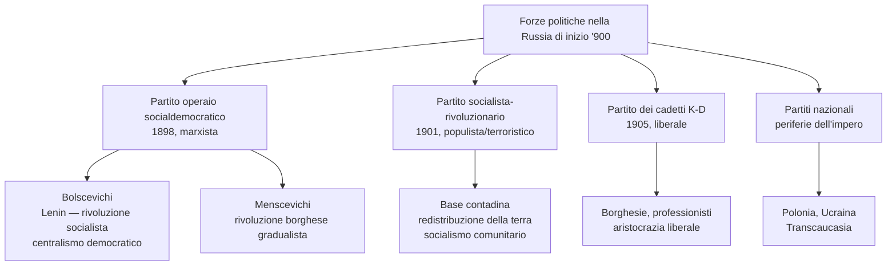
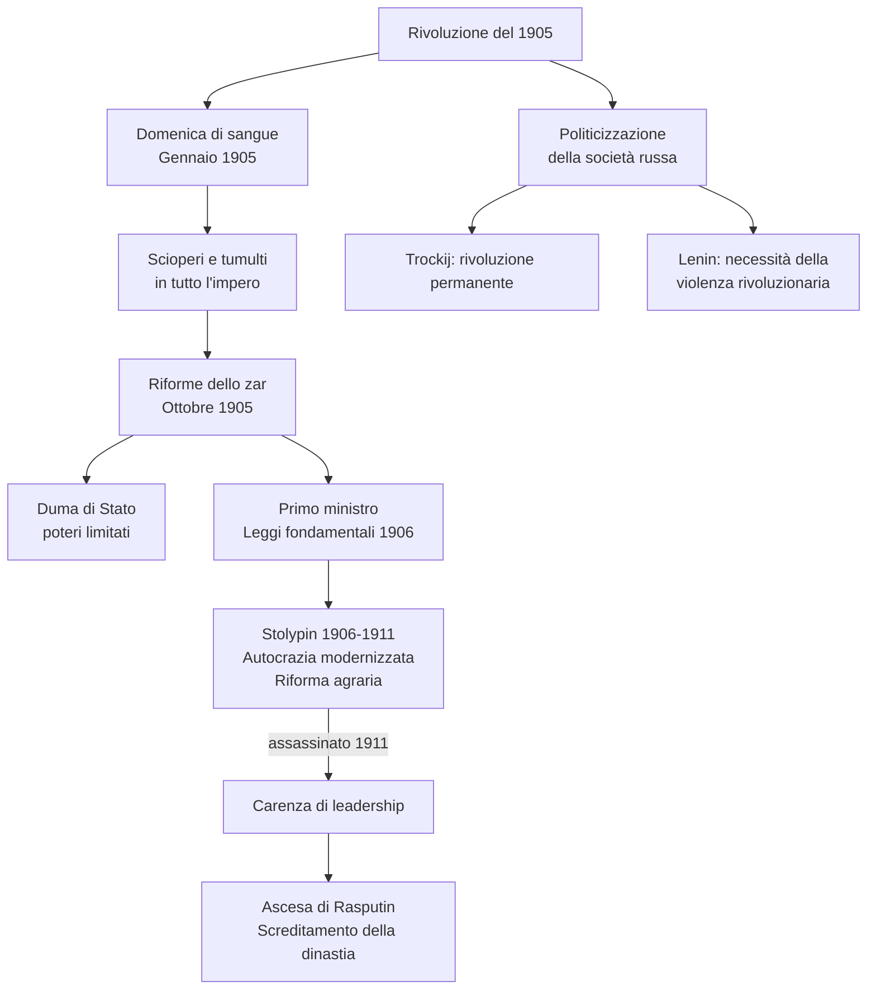
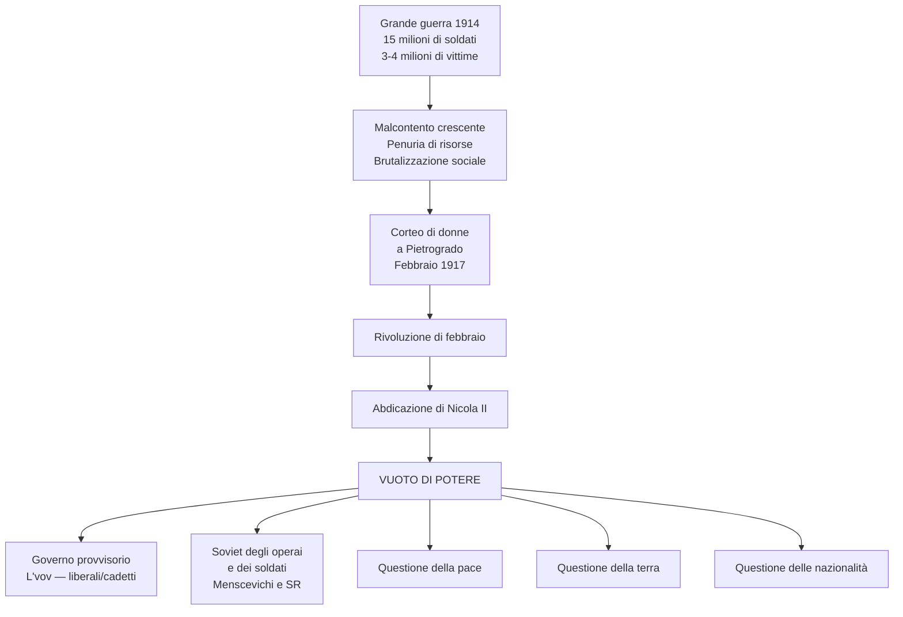
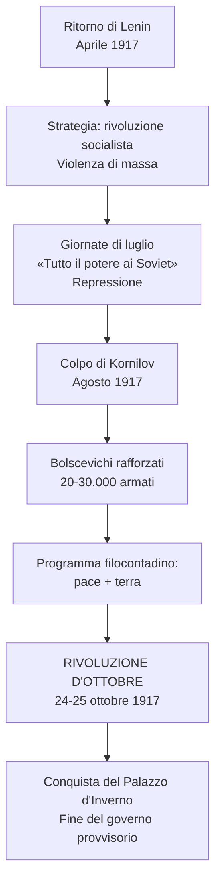
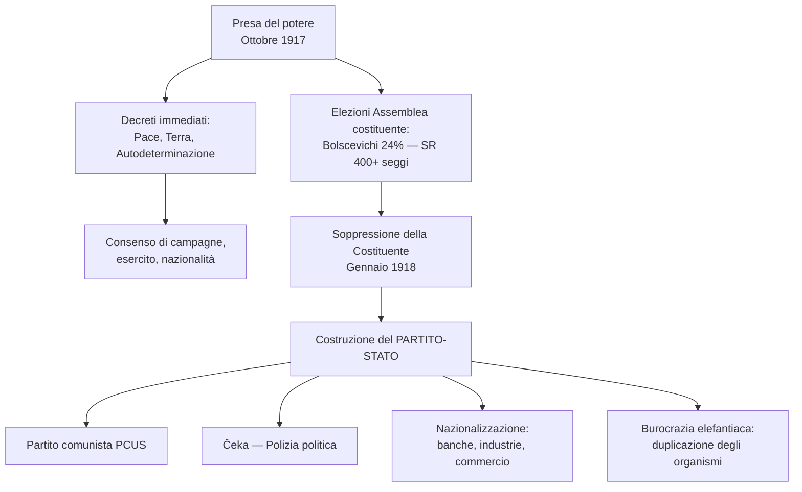
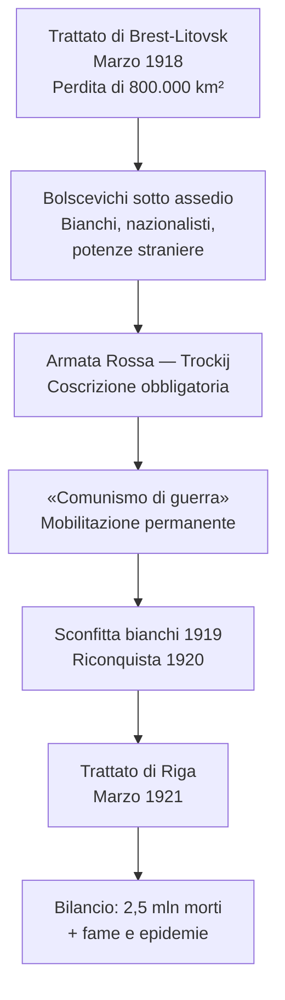
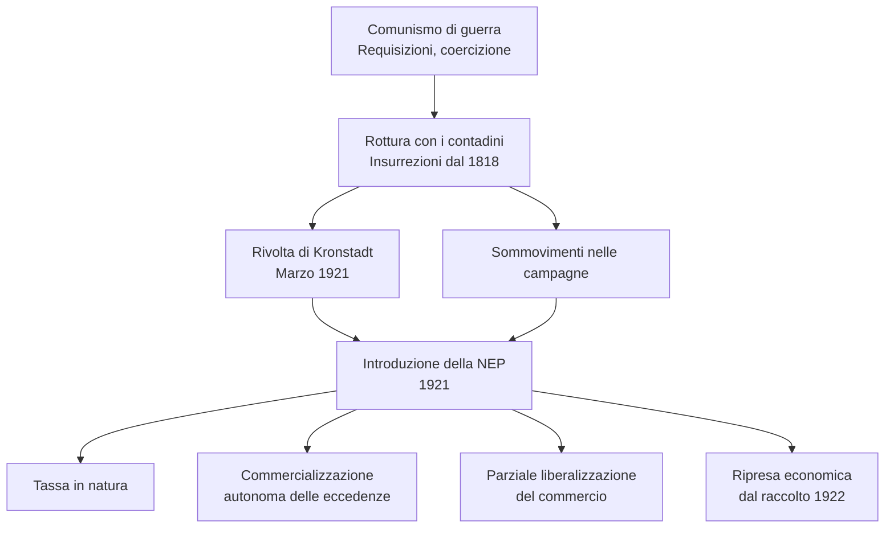
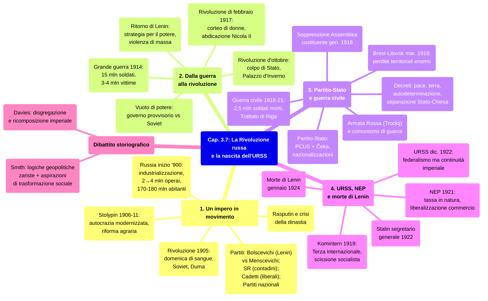

# Schema di Studio - Capitolo 3.7: La Rivoluzione russa e la nascita dell'Unione Sovietica (Riassunto)

---

## 1. Un impero in movimento

### La Russia all'inizio del XX secolo e le forze politiche

Alla vigilia della Grande guerra, l'Impero russo combinava **dinamismo e fragilità**. L'**industrializzazione** aveva fatto nascere una **classe operaia** passata da circa **2 milioni (1900)** a **4 milioni (1913)**, su 170-180 milioni di abitanti per tre quarti contadini. L'**industria** era **fortemente concentrata**: oltre metà delle fabbriche avevano più di 500 operai, e i lavoratori si addensavano nei centri nevralgici dell'impero, a partire dalla capitale **San Pietroburgo**.

> [!note] Dalla lezione
> Il professore insiste su perché la concentrazione operaia sia fondamentale per capire Lenin: quegli operai non erano sparsi nelle campagne, erano tutti insieme nelle fabbriche giganti di Mosca e Pietroburgo — quattro milioni su centottanta, ma nei posti che contano. Nota anche che la Russia oggi ha 130-140 milioni di abitanti (meno di allora, perché non ci sono più Ucraina, repubbliche centroasiatiche, Polonia), e che la grande differenza è che oggi i russi vivono nelle città: quella trasformazione è il frutto diretto dell'industrializzazione forzata comunista — il regime che voleva liberare il contadino lo ha urbanizzato in un secolo. E vale la pena ricordare la geografia: il «grande corridoio eurasiatico» dalla Russia europea si allarga verso la Persia, l'Asia centrale, la Cina, fino a Vladivostok e il Mar del Giappone — un impero tenuto insieme più dalla Transiberiana che dalla politica.

Nel **1898** era nato il **Partito operaio socialdemocratico russo** (marxista), scisso nel **1903** in due correnti: i **bolscevichi** di **Lenin** (ala massimalista: partito di rivoluzionari di professione, **centralismo democratico**, rivoluzione socialista immediata) e i **menscevichi** (ala riformista: prima rivoluzione borghese, poi socialismo graduale). Nel **1901** nacque il **Partito socialista-rivoluzionario** (base contadina, terrorismo, **redistribuzione della terra**, socialismo comunitario-villaggio). Dalle correnti liberali emerse nel **1905** il **partito dei cadetti** (K-D). Nelle periferie non russe (Polonia, Ucraina, Transcaucasia) sorsero **partiti nazionali**.

> **Parola della storia — «Centralismo democratico»:** Principio leninista per cui le decisioni prese al vertice del partito attraverso libera discussione sono vincolanti per tutti i membri.

> **Parola della storia — «Populismo»:** Movimento di fine Ottocento che individuava nella comunità rurale (*mir*) la via per il socialismo. Animato da intellettuali che «andavano al popolo» facendo proselitismo tra i contadini.

### La rivoluzione del 1905 e le sue conseguenze

Tutti questi partiti agivano **clandestinamente**. Il fermento esplose nel **1905** dopo la **sconfitta contro il Giappone**, manifestando le fragilità dell'impero: inadeguatezza dell'**autocrazia** (senza Costituzione né Parlamento), questione delle **nazionalità**, questione **contadina**, questione **operaia**.

> **Parola della storia — «Autocrazia»:** Potere assoluto senza limiti né legittimazione esterna. In senso generico: potere dispotico.

Lo **zar Nicola II** concesse il **17 ottobre 1905** un manifesto con diritti civili e un Parlamento elettivo, la **Duma di Stato** (poteri limitati). Seguirono la nomina di un Primo ministro e le **Leggi fondamentali** (1906), ma lo zar restava perno di una **monarchia assoluta semi-costituzionale**. L'esito principale fu la **politicizzazione della società russa**: abolizione della censura, nuovi partiti, dibattiti pubblici. Trockij elaborò la teoria della **«rivoluzione permanente»**; Lenin scrisse che serviva una «guerra accanita, sanguinosa, distruttiva». Il **nazionalismo russo** si radicalizzò (xenofobia, **antisemitismo**, circa **600 pogrom** in Ucraina nell'autunno 1905).

### Da Stolypin a Rasputin

Il Primo ministro **Stolypin** (1906) tentò un'**«autocrazia modernizzata»**: rinnovamento della classe dirigente (antinobiliare), **riforma agraria** per creare contadini proprietari, sviluppo del **mercato interno**. Fu assassinato a Kiev nel **1911**, lasciando una grave **carenza di leadership**. **Rasputin**, mistico influente a corte per la fama di taumaturgo, screditò ulteriormente la dinastia, alienando simpatie tra élite e **Chiesa ortodossa**. Alla vigilia della guerra, la Russia era il Paese più dinamico d'Europa per industrializzazione (in crescita dal 1908 al 1914), ma indebolito dalla classe dirigente e dal sovrano.

---

## 2. Dalla guerra alla rivoluzione

### La Grande guerra e la rivoluzione di febbraio

L'entrata in guerra (agosto **1914**) segnò l'inizio di uno stato di guerra ininterrotto fino al marzo 1921. **15 milioni di soldati** mobilitati, **3-4 milioni di vittime** (il più alto numero tra i belligeranti). Il conflitto fu una **scuola di violenza** per milioni di contadini, che maturarono ostilità verso ufficiali e classe dirigente. L'economia di guerra si scontrò con i **limiti della modernizzazione**: base industriale ristretta, rete ferroviaria inadeguata, **penuria di risorse** come punto debole. Malcontento, brutalizzazione sociale, e nelle regioni di frontiera **mobilitazione delle nazionalità**.

Nel **settembre 1915** Nicola II assunse il **comando delle forze armate**, trasferendosi a Mogilev e abbandonando il controllo sulla capitale **Pietrogrado** (ex San Pietroburgo). Legò il suo prestigio alle sorti del conflitto: scommessa perdente. **Rasputin** fu ucciso in un complotto nel **dicembre 1916**.

Un **corteo di donne** stanche di fare la fila per il pane innescò la **rivoluzione del febbraio 1917** (23-27 feb. giuliano = 8-12 mar. gregoriano). La dinastia, abbandonata da tutti (anche esercito e monarchici), crollò: **Nicola II abdicò**, nessuno gli chiese di ritirare l'atto. Venne meno l'asse di un secolare universo politico, generando **spaesamento** e **effervescenza rivoluzionaria**. Partì spontaneamente una triplice rivoluzione sociale: delle **nazionalità** (georgiani, ucraini, polacchi, baltici vogliono l'indipendenza), dei **contadini** (occupano e spartiscono le terre dei possidenti), degli **operai** (creano i soviet nelle fabbriche). [Lezione]

> [!note] Dalla lezione
> Il professore ricorda che «abdicazione» non significa automaticamente «repubblica»: il governo provvisorio non sapeva ancora cosa sarebbe diventata la Russia — avrebbe dovuto deciderlo l'Assemblea Costituente in autunno. «Impero o Repubblica» era ancora una questione aperta. Quanto ai motivi del crollo militare, il prof è tagliente: alla Russia mancava il «carattere di Stato moderno e industriale» che avevano Germania, Francia, Gran Bretagna. Mancavano le ferrovie per portare i soldati al fronte, mancavano gli ufficiali formati per gestire le truppe, mancava l'industria per produrre armi a sufficienza. E poi la frase del principe L'vov alla Duma che il professore cita a memoria: «Ma quello che sta succedendo è **idiozia**, incapacità totale, o tradimento?» — riferendosi alla conduzione della guerra da parte di Nicola II, con la zarina tedesca che aveva ulteriormente aggravato i sospetti di tradimento. Era questa l'atmosfera a poche settimane dall'abdicazione.

> **Parola della storia — «Calendario giuliano e gregoriano»:** Nel XX secolo la differenza tra i due era di **13 giorni**. La Russia adottò il gregoriano nel febbraio 1918.

### Il vuoto di potere e il ritorno di Lenin

Si confrontarono un **governo provvisorio** (principe **L'vov**, liberali/cadetti, collegato alla Duma) e il **Soviet degli operai e dei soldati** (menscevichi, socialisti-rivoluzionari, sindacati). La realtà fu un **vuoto di potere**: governo dalle basi deboli, Soviet paralizzato dalle divisioni e dall'attendismo. Tre questioni irrisolte: **pace**, **terra** ai contadini, **nazionalità** (moti indipendentisti in Ucraina e Transcaucasia).

In **aprile**, **Lenin** tornò dall'esilio (viaggio favorito dalla **Germania**, convinta di destabilizzare la Russia). Si distinse per strategia e lucidità: sostenne che era il momento della **rivoluzione socialista**, superando la rivoluzione borghese. Trovò un alleato in **Trockij**. L'obiettivo: **conquistare il potere** attraverso la **violenza di massa**, sfruttando la penetrazione dei bolscevichi tra soldati e operai di Pietrogrado.

> [!note] Dalla lezione
> Il professore chiarisce il meccanismo del tacticismo leniniano meglio di qualsiasi manuale: Lenin torna a Pietrogrado e dice ai russi tre cose — pace subito, terra ai contadini, libertà alle nazionalità non russe. Sono esattamente le tre cose che ognuno vuole sentirsi dire. Ma è **tutta tattica**. Pace subito in realtà significa accettare le durissime condizioni tedesche, poi riprendersi i territori appena possibile. Terra ai contadini? L'obiettivo comunista è la collettivizzazione, non la redistribuzione — ma nel 1917 dirlo è suicida. Libertà alle nazionalità? L'Ucraina vale il suo grano, il Caucaso vale il suo petrolio: non se ne parla di lasciarli andare. Il vero obiettivo è uno solo — la conquista del potere — e tutto il resto è manovra verso quello.

### Dalle giornate di luglio alla Rivoluzione d'ottobre

Ai primi di **luglio 1917**, manifestazioni operaie e soldati ostili all'offensiva bellica di **Kerenskij** (ministro della Guerra, poi Primo ministro dal 20 luglio) sfociarono nel **4 luglio** in un corteo armato che assediò il Soviet con la formula **«tutto il potere ai Soviet»**. Il governo represse; Trockij fu arrestato, Lenin fuggì in **Finlandia**, convinto che la rivoluzione dovesse passare per il **partito bolscevico**, non per i Soviet in mano a menscevichi e SR.

> [!note] Dalla lezione
> Perché San Pietroburgo divenne Pietrogrado nel 1914? Perché «Burg» è tedesco per «città», e in piena guerra contro la Germania tenerlo era politicamente insostenibile: si traduce in russo («Grad» = città) e nasce Pietrogrado. Il cambio di nome era il segnale di qualcosa di più profondo: tra russi e tedeschi nel Sette-Ottocento c'erano stati legami strettissimi (Caterina II era tedesca, molti generali e ministri zaristi erano tedeschi, nobili balto-tedeschi avevano grandi proprietà nell'impero). La furia nazionalista della guerra cancellò tutto questo in pochi mesi.

A fine **agosto**, il **colpo di Stato del generale Kornilov** fu sventato dalle **milizie bolsceviche**, che ne uscirono rafforzate: Trockij, presidente del Soviet di Pietrogrado (con i bolscevichi in maggioranza), aveva **20-30.000 armati**. Nelle campagne i contadini assaltavano le proprietà. Lenin fece suo il programma del Congresso dei deputati contadini: **pace e distribuzione egualitaria della terra**.

La notte del **24 ottobre** (giuliano = 6 novembre gregoriano) bolscevichi armati presero i centri strategici di Pietrogrado; la notte successiva **conquistarono il Palazzo d'Inverno**. La Rivoluzione d'ottobre fu un **colpo di Stato** preparato da Lenin, che non ne ridimensiona l'importanza storica né il significativo sostegno popolare ricevuto.

> [!note] Dalla lezione
> Perché «ottobre rosso» se per noi è novembre? Il professore spiega il calendario: la Russia ortodossa non aveva mai accettato la riforma gregoriana di papa Gregorio XIII (1582) — gli ortodossi erano «antipapisti, quasi peggio degli inglesi». Quindi nel 1917 il calendario russo era indietro di 13 giorni. La riforma la fece Lenin subito dopo aver preso il potere. Risultato: quella che i russi chiamano «rivoluzione d'ottobre» per noi è già la prima settimana di novembre. Vale lo stesso per febbraio: l'abdicazione dello zar avviene in «febbraio» giuliano ma è già «marzo» per il resto d'Europa.

**La rivoluzione in Russia nel 1917:**

| | Rivoluzione di febbraio | Rivoluzione d'ottobre |
|---|---|---|
| **Causa** | Corteo di donne per il pane | Colpo di Stato pianificato da Lenin |
| **Esito** | Abdicazione di Nicola II, fine zarismo | Presa del potere dei bolscevichi |
| **Risultato** | Governo provvisorio + Soviet → vuoto di potere | Conquista del Palazzo d'Inverno → società comunista |

---

## 3. Il partito-Stato dei bolscevichi e la guerra civile

### I primi provvedimenti e la costruzione del partito-Stato

Le prime mosse di Lenin furono fulminee: **decreto sulla pace** (due ore dopo la presa del potere), **decreto sulla terra** (il giorno dopo), decreto sull'**autodeterminazione dei popoli** (elaborato con **Stalin**). Impatto enorme: appoggio di campagne, esercito, minoranze nazionali. Seguì l'**assalto alla Chiesa ortodossa** (gennaio 1918: **separazione Stato-Chiesa**, Chiesa estromessa dalle scuole, privata della personalità giuridica e della proprietà; uccisioni di vescovi, preti, monaci; chiusura dei monasteri).

Alle **elezioni per l'Assemblea costituente**, i bolscevichi ottennero solo il **24%** (170 seggi su 700), mentre il **Partito SR** ne conquistò oltre 400. Lenin rispose **sopprimendo la Costituente** nel **gennaio 1918**: il secondo colpo di mano.

> [!note] Dalla lezione
> Il professore sottolinea quanto sia illuminante questo momento: Lenin aveva promesso «tutto il potere ai soviet», ma appena i russi si esprimono liberamente e scelgono il partito contadino, l'assemblea viene sciolta d'autorità dopo appena una seduta. È il secondo colpo di Stato in tre mesi. «Tutto il potere ai soviet» si rivela per quello che era sempre stato: tutto il potere a noi. E il comunismo si struttura come ideologia quasi-religiosa — il professore lo nota: Marx è il profeta, *Il Capitale* è il libro sacro, la società comunista è la terra promessa. Non si può essere fedeli al tempo stesso a questa fede e al Dio cristiano.

Iniziò la costruzione del **«partito-Stato»**: Partito bolscevico (dal 1919 **Partito comunista**, PCUS dal 1952) + **Čeka** (polizia politica, dicembre 1917). Doppio legame: causa dello Stato = causa del partito; partito = fondamento dello Stato. Al vertice: **Politbjuro** e segreteria del Comitato centrale. Duplicazione degli organismi (ogni apparato statale aveva un corrispettivo nel partito) → **burocrazia elefantiaca**. **Nazionalizzazione** di banche, industrie e commercio.

> [!note] Dalla lezione
> Lenin sulla Čeka è nudo e crudo: serviva «gente per cui non è un grosso problema sparare in testa alla gente» — cioè criminali, arruolati di peso. La polizia politica arriverà a 200.000 effettivi. Sul piano politico più generale, il prof spiega cosa significhi davvero «militarizzazione dell'azione politica»: vincere significa sparare all'avversario, non batterlo alle urne. Questo schema — la violenza come strumento normale di governo — vale sia per la rivoluzione rossa che per quella nera del fascismo. La Grande Guerra aveva brutalizzato milioni di persone, e la vita politica postbellica ne porta i segni ovunque in Europa.

> **Parola della storia — «Nazionalizzazione»:** Acquisizione da parte dello Stato della proprietà o del controllo di beni e attività economiche fino a quel momento in mani private.

### Brest-Litovsk, guerra civile e Armata Rossa

Già nel **dicembre 1917** i bolscevichi contrastarono le spinte disgregatrici: invasione dell'**Ucraina** (che aveva proclamato l'indipendenza), prima manifestazione della **propensione imperiale** del potere bolscevico. Il **3 marzo 1918** fu firmato il **Trattato di Brest-Litovsk** con la Germania: clausole durissime, perdita di **800.000 km²** (Ucraina, Polonia, Finlandia, Paesi baltici), circa un terzo della popolazione, quasi tutta la produzione di carbone, metà degli impianti industriali. Due giorni dopo Lenin spostò la capitale a **Mosca**: da qui doveva partire la riconquista dello spazio imperiale.

Il potere bolscevico nel 1918 era limitato a un **territorio ristretto**. Intorno: nuove formazioni nazionali (Ucraina, Transcaucasia), forze antibolsceviche (Siberia/SR), eserciti «**bianchi**» (ex zaristi), eserciti contadini, e **potenze straniere** (tedeschi in Crimea/Georgia, Romania in Bessarabia, britannici a Murmansk, giapponesi/americani a Vladivostok).

> [!note] Dalla lezione
> Gli eserciti contadini erano formidabili, spiega il professore, perché quei contadini erano **reduci**: erano tornati dal fronte con le armi in mano, addestrati a combattere. Arrivarono a contare anche 50.000 uomini. Per questo Lenin in un primo momento disse sì alla redistribuzione delle terre — non poteva aprire un terzo fronte contro di loro mentre combatteva i bianchi e le potenze straniere. La tattica pagò: prima vinci la guerra civile, poi ti occupi dei contadini. E quando arriva il momento, lo fa con la carestia: nel 1921-22 le regioni cerealicole vengono colpite dalla fame e i bolscevichi la usano deliberatamente per «piegare la resistenza dei contadini». «Iniziava una lunghissima guerra attraverso la fame», dice il professore. Il bilancio finale è pesantissimo: 2,5 milioni di soldati morti, mezzo milione di vittime delle repressioni, e tra i due e i cinque milioni di morti di fame.

L'**Armata Rossa**, guidata da **Trockij** (coscrizione obbligatoria, disciplina ferrea, ex ufficiali zaristi controllati da commissari politici), fu lo strumento della riscossa. Si affermò il **«comunismo di guerra»**: mobilitazione permanente, militarizzazione della politica e dell'economia, violenza e coercizione, lavoro forzato.

> [!note] Dalla lezione
> Il communismo di guerra aveva effetti concretissimi: gli operai lavoravano in turni massacranti senza domenica, con la fucilazione come pena per l'assenza. Ai contadini la Čeka requisiva tutto — non solo il raccolto, ma anche il bestiame da riproduzione e il grano per la semina dell'anno seguente. Un sistema pensato per vincere la guerra civile ma che portava diritto alla carestia.

La guerra civile si concluse con la sconfitta dei «bianchi» (**1919**), la riconquista di Transcaucasia e Ucraina (**1920**), il **Trattato di Riga** con la Polonia (**marzo 1921**). Bilancio: **2,5 milioni** di soldati morti + centinaia di migliaia di vittime delle repressioni + milioni per fame e «spagnola». Il centro bolscevico recuperò buona parte dei territori imperiali, con un **arretramento a ovest** (perdita di Polonia, Finlandia, Baltici, Bessarabia).

> [!note] Dalla lezione
> Il professore insiste su un punto che il libro di testo tende a oscurare: per i bolscevichi di quella generazione, **è la guerra civile — non la Rivoluzione d'Ottobre — il vero evento fondante dell'URSS**. È lì che hanno dimostrato di poter reggere, di saper usare la violenza necessaria, di poter riconquistare lo spazio imperiale. La Rivoluzione d'Ottobre è un colpo di Stato; la guerra civile è la prova che il nuovo Stato sa sopravvivere. E il prezzo, sommando Grande Guerra, guerra civile, repressioni della Čeka e carestia, è di molte milioni di morti tra il 1914 e il 1922.

---

## 4. L'Unione Sovietica, la NEP e la morte di Lenin

### Nascita dell'URSS e Terza Internazionale

Alla fine del **1922**, lo spazio multietnico fu riorganizzato nell'**URSS** (Unione delle Repubbliche Socialiste Sovietiche), Stato plurinazionale federale. Per volere di Lenin, il nome **non conteneva «russo»**; il criterio delle repubbliche era un **principio nazionale su base linguistica** (Russia, Ucraina, Bielorussia, Transcaucasia). Il carattere federale divergeva dalla tradizione imperiale, ma il partito era strutturato in modo **verticistico**. Continuità con la dimensione imperiale: **forte potere centrale**, ruolo collante della lingua e cultura russe, **espansionismo**, Mosca come capitale imperiale, **proiezione universale** del comunismo.

> [!note] Dalla lezione
> La «proiezione universale» non era una novità del comunismo: era la stessa struttura messianica dello zarismo. Il professore la chiama «Mosca terza Roma». Dopo la caduta di Costantinopoli (1453), gli zar si proclamarono Cesari e guide del vero cristianesimo ortodosso, protettori dei popoli slavi e di quelli dell'Asia centrale. Lenin non fa che rimpiazzare il contenuto: non più la fede ortodossa, ma la rivoluzione proletaria. La continuità con la tradizione imperiale è perciò anche profondamente culturale e ideologica.

Lo sforzo nella guerra civile fu animato dall'**aspettativa di una rivoluzione mondiale**. Per promuoverla fu istituito il **Komintern** (Terza Internazionale, Mosca, **marzo 1919**), singolare per la sua **connessione organica con uno Stato**. Mosca ebbe un doppio strumento: diplomazia (interessi statali) e Komintern (rivoluzione internazionale, ma subordinata agli interessi sovietici). Al **II congresso** (estate **1920**, 200 delegati, 35 Paesi), Lenin e Trockij imposero condizioni drastiche, provocando la **rottura con la socialdemocrazia** e la **scissione** dei partiti socialisti europei. Nacquero partiti comunisti nazionali (anche in Italia), un **movimento comunista internazionale** di portata globale, e una **duratura divisione del socialismo**.

| Internazionale | Fondazione | Fine | Singolarità |
|---|---|---|---|
| **Prima** | 1864 | 1871 | Internazionalismo operaio |
| **Seconda** | 1889 | 1914 | Socialdemocrazia riformista |
| **Terza (Komintern)** | 1919 | — | Connessa organicamente all'URSS |

> [!note] Dalla lezione
> Il professore spiega le implicazioni pratiche della scissione che generò il PCI. I comunisti italiani — come tedeschi, francesi e degli altri Paesi — furono accusati di **«doppiezza»**: a chi erano fedeli, all'Italia o all'URSS? Non era una calunnia: la Terza Internazionale aveva letteralmente chiesto ai comunisti europei di cospirare contro i propri governi. L'accusa rimase appiccicata a Togliatti per tutta la sua carriera repubblicana. Lenin e Trockij avevano preteso la scissione dai partiti socialisti «anche al costo di profonde spaccature nella sinistra» — e quelle spaccature ebbero conseguenze enormi in tutta Europa nei decenni successivi.

### La NEP e la fine dell'era leniniana

Durante la guerra civile si consumò la **rottura con i contadini**: le requisizioni dei raccolti con coercizione e tortura provocarono insurrezioni dal 1918 (la **«grande guerra contadina»** — Graziosi). La **rivolta di Kronstadt** (marzo 1921) criticò centralizzazione e comunismo di guerra, reclamando il primato dei soviet e le libertà. Ma furono soprattutto i sommovimenti rurali a spingere Lenin alla **NEP** (1921): **tassa in natura** al posto delle requisizioni, **commercializzazione autonoma** delle eccedenze, **parziale liberalizzazione** del commercio.

> [!note] Dalla lezione
> Il professore risale alla **riforma agraria di Stolypin** (1907) per spiegare il contesto: Stolypin aveva tentato di creare piccoli proprietari terrieri vendendo pezzi di latifondi, ma la riforma era andata a metà — aveva prodotto qualche proprietario e molti contadini indebitati sul lastrico. Quando nel 1917 il paese collassa, questi contadini delusi vedono finalmente l'occasione. Lenin lascia fare, anche se l'obiettivo comunista non è la redistribuzione (più proprietà) ma la **collettivizzazione** (abolire la proprietà). Tatticismo: non puoi dirlo nel 1917, perché perdi i contadini. Con il comunismo di guerra li perdi comunque. La NEP è il tentativo di ricucire. Ma il professore avverte: «nel 1922 nessuno ha ancora la forza di togliere ai contadini quelle terre». Qualche anno dopo Stalin ce l'avrà, e userà la carestia del **1931-33** — **6 milioni di morti** — per spezzare ogni residua resistenza.

Nel 1921-22 una **carestia** colpì le regioni del Volga, Caucaso e Ucraina orientale: circa **1,5 milioni di vittime**. Lo scontro potere/contadini poteva essere deciso dalla fame. La NEP favorì una **ripresa economica** dal raccolto 1922, affiancata dalla politica di **«indigenizzazione»** (valorizzazione delle nazionalità) e da una vivace **attività culturale**.

Contraltare alle aperture: **irrigidimento del partito**. **X congresso (1921)**: divieto di **«frazioni»**. **XI congresso (1922)**: **Stalin** eletto **segretario generale**. La Čeka riformata in **GPU** (1922). Nel **maggio 1922** Lenin fu colpito da un ictus; le condizioni peggiorarono e nel **gennaio 1924** morì a 53 anni. La **lotta per la successione** sarebbe durata fino alla fine degli anni Venti.

> [!note] Dalla lezione
> Lenin era nato nel 1870: aveva poco più di cinquant'anni. La lotta di successione vide contrapposti **Trockij** (numero due, creatore dell'Armata Rossa) e **Stalin** — la vinse Stalin nel 1927 «con ogni mezzo». Trockij, espulso dall'URSS, trovò rifugio in Messico, ma Stalin lo raggiunse anche lì: nel **1940** un sicario di nome **Ramón Mercader** lo uccise a picconate. Mercader era il fratellastro di Maria Mercader, moglie spagnola di Vittorio De Sica — cioè lo ziastro di Christian De Sica. Un dettaglio bizzarro ma vero, e molto utile per ricordarselo.

---

## Il dibattito storiografico: Russia 1917 — una rivoluzione o un altro impero?

La Rivoluzione bolscevica si presentò come un rovesciamento fondato su **socialismo** e **internazionalismo**, ma con forti **continuità** con la storia zarista nel rapporto con lo spazio e il potere.

| Storico | Opera | Tesi |
|---|---|---|
| **Norman Davies** | *Storia d'Europa* (1996) | Le rivoluzioni del 1917 **disgregarono** l'impero; i bolscevichi poi ricostituirono un **forte centro** per ricompattare lo spazio imperiale |
| **Stephen A. Smith** | *Storia della rivoluzione russa* (2017) | La ricomposizione seguì **logiche geopolitiche zariste**, ma internazionalismo e federalismo erano idee vive; le aspirazioni di trasformazione sociale erano forti; la rivoluzione diede risposta anche ai sentimenti nazionalisti difendendo i confini |

---

## Date fondamentali — Riepilogo cronologico

| Data               | Evento                                                                                                                 |
| ------------------ | ---------------------------------------------------------------------------------------------------------------------- |
| **1898**           | Fondazione del Partito operaio socialdemocratico russo                                                                 |
| **1901**           | Fondazione del Partito socialista-rivoluzionario                                                                       |
| **1903**           | Scissione bolscevichi/menscevichi                                                                                      |
| **1905**           | Sconfitta con il Giappone; «domenica di sangue»; rivoluzione; Soviet; Duma; partito dei cadetti; 600 pogrom in Ucraina |
| **1906**           | Stolypin Primo ministro; Leggi fondamentali                                                                            |
| **1911**           | Assassinio di Stolypin                                                                                                 |
| **Agosto 1914**    | Russia in guerra (15 mln soldati)                                                                                      |
| **Settembre 1915** | Nicola II assume il comando delle forze armate                                                                         |
| **Dicembre 1916**  | Uccisione di Rasputin                                                                                                  |
| **Febbraio 1917**  | Rivoluzione di febbraio; abdicazione Nicola II                                                                         |
| **Aprile 1917**    | Ritorno di Lenin                                                                                                       |
| **Luglio 1917**    | «Tutto il potere ai Soviet»; Kerenskij Primo ministro                                                                  |
| **Agosto 1917**    | Colpo di Kornilov sventato dai bolscevichi                                                                             |
| **Ottobre 1917**   | Rivoluzione d'ottobre; conquista del Palazzo d'Inverno                                                                 |
| **Dicembre 1917**  | Čeka; guerra civile in Ucraina                                                                                         |
| **Gennaio 1918**   | Soppressione Assemblea costituente; separazione Stato-Chiesa                                                           |
| **Marzo 1918**     | Trattato di Brest-Litovsk; capitale a Mosca                                                                            |
| **1918-21**        | Guerra civile                                                                                                          |
| **Marzo 1919**     | Fondazione del Komintern                                                                                               |
| **1919**           | Sconfitta dei bianchi; Partito comunista                                                                               |
| **Estate 1920**    | II congresso Komintern: rottura con la socialdemocrazia                                                                |
| **1920**           | Riconquista Transcaucasia e Ucraina                                                                                    |
| **Marzo 1921**     | Kronstadt; Trattato di Riga; NEP; X congresso                                                                          |
| **1922**           | Stalin segretario generale; GPU; ictus di Lenin                                                                        |
| **Dicembre 1922**  | Nascita dell'URSS                                                                                                      |
| **Gennaio 1924**   | Morte di Lenin                                                                                                         |

---

## Mappa concettuale — Visione d'insieme del capitolo

