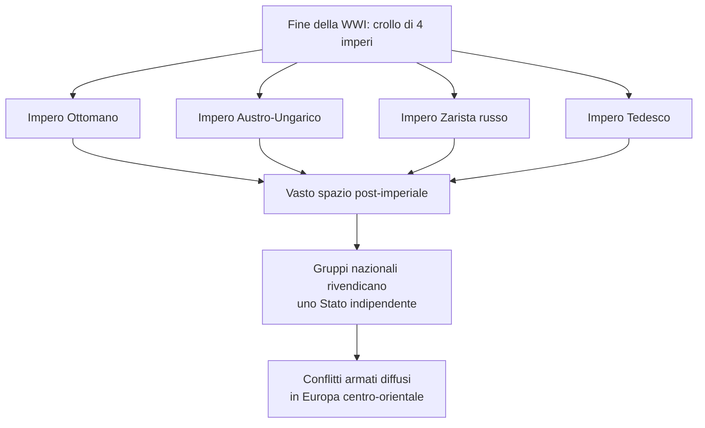
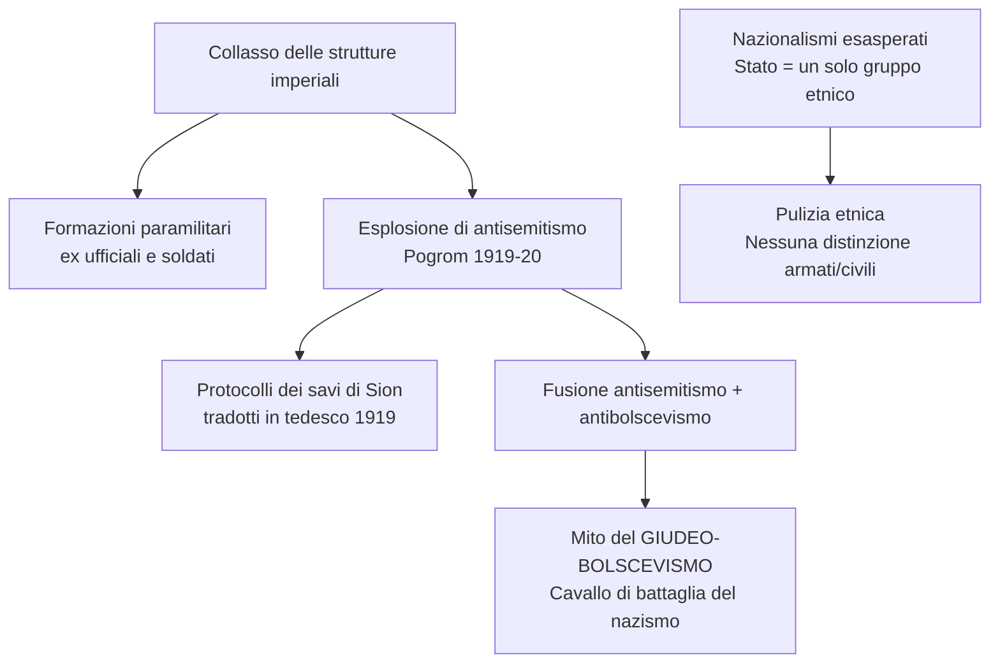
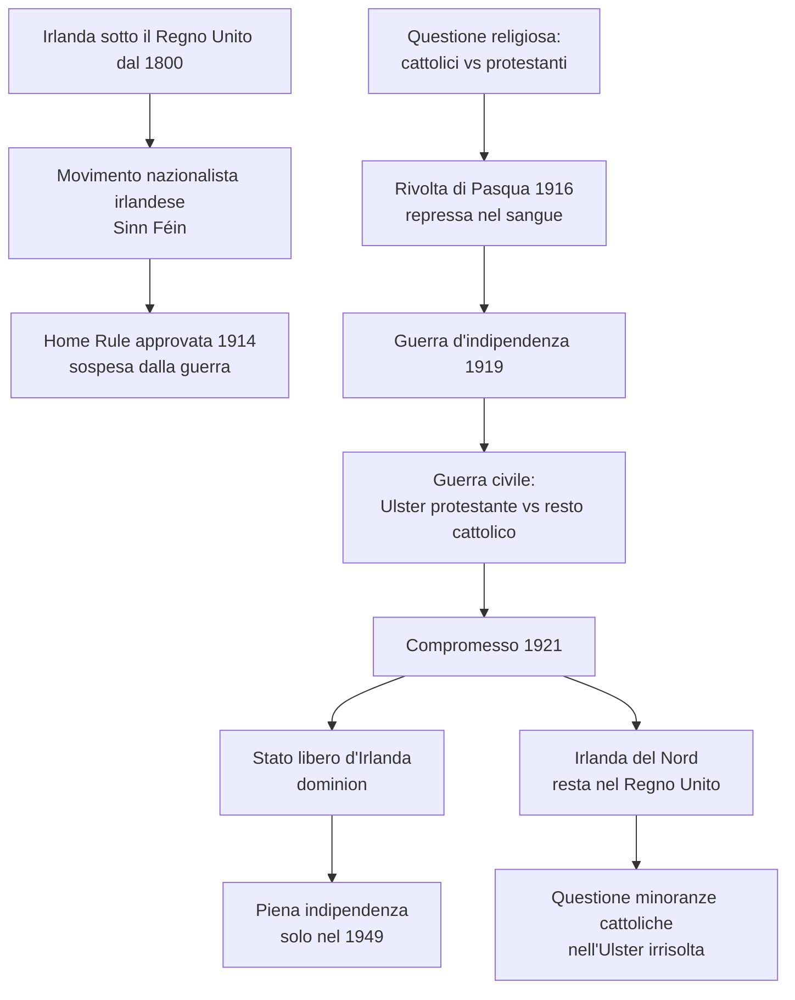
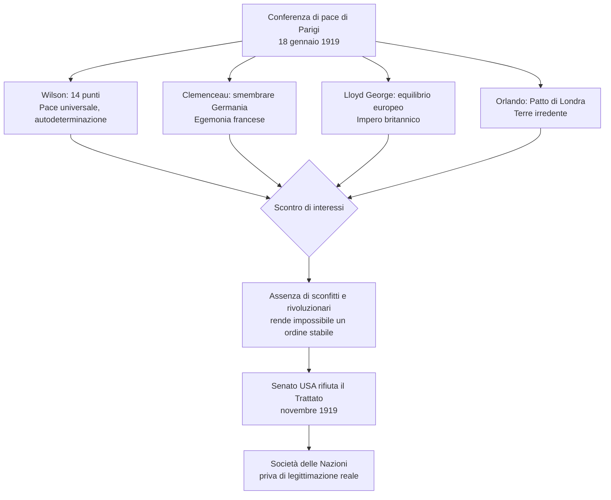
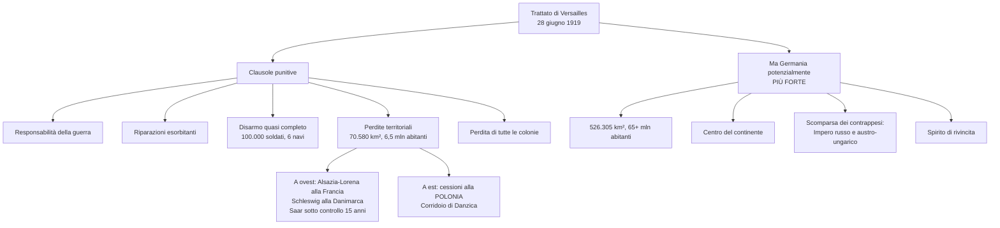
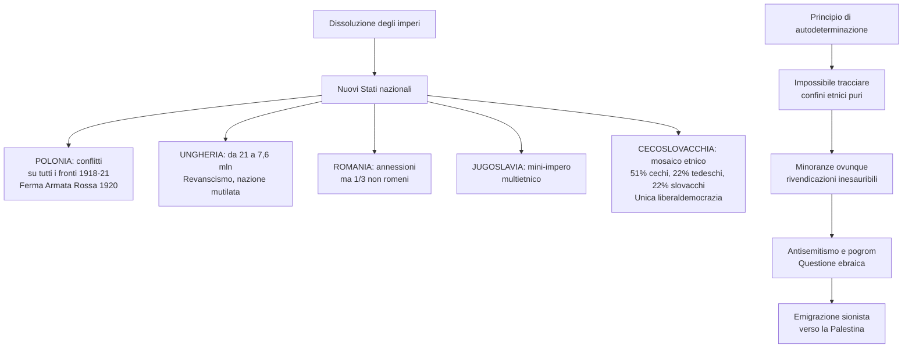
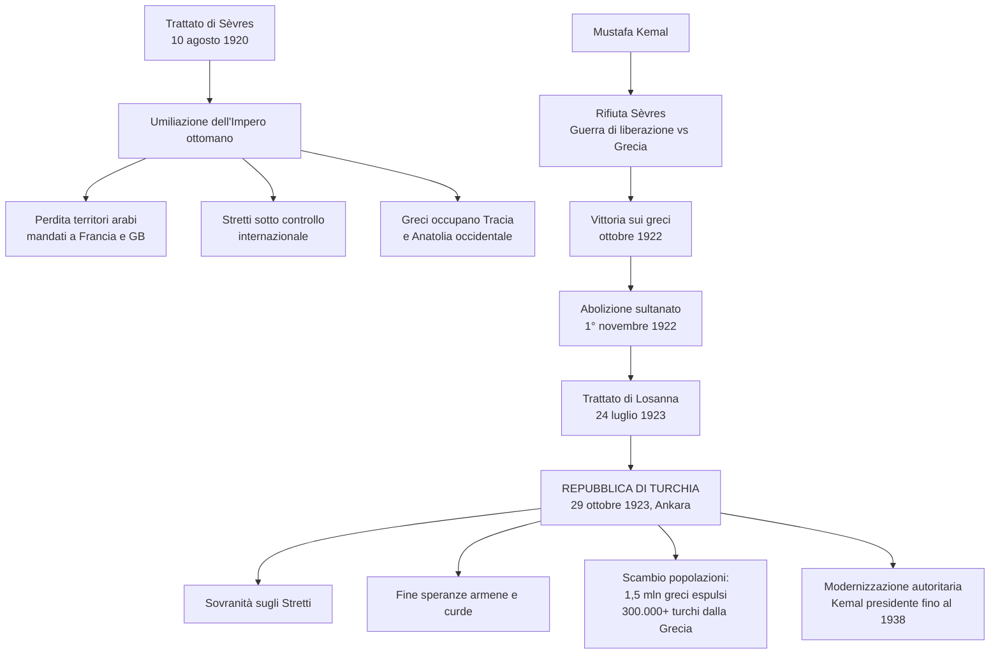
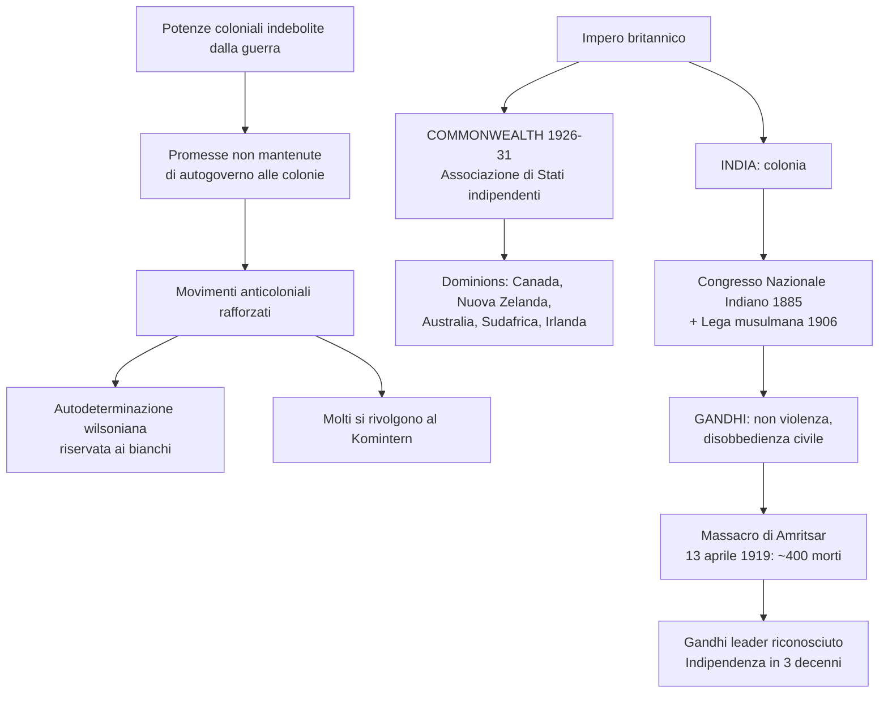
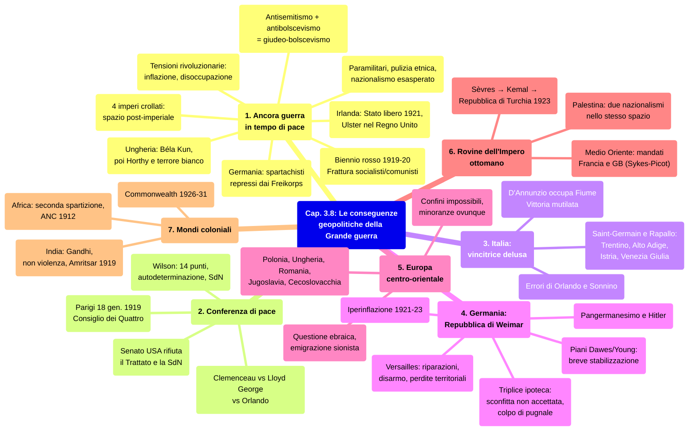

# Ripasso Veloce - Cap. 3.8: Le conseguenze geopolitiche della Grande guerra

---

## 1. Ancora guerra in tempo di pace

### Da una Grande guerra a tante piccole guerre

- Fine della WWI: crollo di **4 imperi** (ottomano, asburgico, zarista, tedesco)
- Sul fronte occidentale il massacro cessò, ma **continuò in Europa centro-orientale**
- Nello spazio **«post-imperiale»**: gruppi nazionali rivendicano con le armi il **diritto a uno Stato indipendente**

### Nazionalismo e antisemitismo

- **Formazioni paramilitari** (ex ufficiali/soldati + giovani radicalizzati) agiscono al di fuori del diritto
- Nazionalismi esasperati: Stato = **un solo gruppo etnico** → operazioni di **pulizia etnica**
- Nuova esplosione di **antisemitismo**: pogrom 1919-20, *Protocolli dei savi di Sion* tradotti in tedesco (1919)
- Fusione antisemitismo + antibolscevismo = **giudeo-bolscevismo** → cavallo di battaglia del nazismo

### Tensioni rivoluzionarie

- **Fantasma della rivoluzione**: tra 1919-20 sembra che la rivoluzione russa possa ripetersi in Europa
- Fine economia di guerra → Stati stampano cartamoneta → **inflazione** e **instabilità monetaria**
- Crisi dell'industria (senza commesse militari) → **disoccupazione di massa**
- **«Pescecani»**: industriali arricchitisi dalla guerra → rancori di classe

### La situazione in Germania

- **Partito socialdemocratico** al governo, ma Paese in preda all'agitazione
- Sinistra: **Consigli di operai e soldati** (modello sovietico)
- Destra: ***Freikorps*** (Corpi franchi, paramilitari controrivoluzionari)
- **Lega di Spartaco** (**Rosa Luxemburg** + **Karl Liebknecht**): insurrezione nel **gennaio 1919** → **repressa nel sangue** con i Freikorps; Luxemburg e Liebknecht uccisi il **15 gennaio**
- Effimera **repubblica sovietica bavarese**, altri moti → tutti repressi
- Ciclo chiuso con ultimo moto a Berlino, **gennaio 1920**

### Austria e Ungheria

- **Austria**: tentativo comunista a Vienna (1920) represso
- **Ungheria**: regime comunista di **Béla Kun** (marzo 1919) → programma rivoluzionario → rovesciato da **Miklós Horthy** → **regime autoritario** + **«terrore bianco»**

| Paese | Evento rivoluzionario | Esito |
|---|---|---|
| **Germania** | Spartachisti (gen. 1919), moti, repubblica sovietica bavarese | Repressi con i *Freikorps*; Luxemburg e Liebknecht uccisi |
| **Austria** | Tentativo comunista a Vienna (1920) | Represso |
| **Ungheria** | Regime di Béla Kun (marzo 1919) | Rovesciato da Horthy; terrore bianco |

### Il «biennio rosso»

- **1919-20**: agitazioni e scioperi in Francia, Gran Bretagna, Italia (salari, 8 ore)
- Dopo 1920: rivoluzione europea non scoppia; URSS ripega sulla «rivoluzione in un solo Paese»
- **Classi medie** si sentono minacciate (impoverite + insidiate dagli operai)
- **Frattura insanabile**: socialisti/socialdemocratici vs **nuovi partiti comunisti** (Komintern)
- Sinistre lacerate → vulnerabili alla sfida dell'estrema destra

### La questione irlandese

- **1800**: Irlanda annessa al Regno Unito, perdita dell'autonomia
- **Sinn Féin**: partito nazionalista; ***Home Rule*** (autonomia) approvata 1914, sospesa dalla guerra
- Questione **religiosa**: britannici protestanti vs irlandesi cattolici
- **1916**: **rivolta di Pasqua**, repressa nel sangue
- **1919**: **guerra d'indipendenza** → **guerra civile** (cattolici indipendentisti/**IRA** vs protestanti unionisti/**Ulster**)
- **1921**: **Stato libero d'Irlanda** (*dominion*; indipendenza piena nel 1949); **Irlanda del Nord** resta nel Regno Unito
- Questione minoranze cattoliche nell'Ulster → nuova guerra civile nel XX secolo

### Nodi irrisolti

- Fino al 1923: rivoluzioni, controrivoluzioni, scontri etnici, pogrom, guerre civili
- **Gruppi radicali** con milizie paramilitari sfidano i sistemi parlamentari
- Donne: **diritto di voto** (1918 GB e Germania, 1920 USA)
- Anni Venti: **cinema e radio** rivoluzionano la politica

---

## 2. La Conferenza di pace

### I «quattordici punti» di Wilson

- **18 gennaio 1919**: Conferenza di pace di Parigi, **senza i Paesi vinti**
- **Consiglio dei Quattro**: Regno Unito, Francia, Italia, Stati Uniti
- **Wilson**: 14 punti → **pace universale**, **Società delle Nazioni**, **autodeterminazione dei popoli**
- Autodeterminazione = **enunciazione vaga** → fonte di **destabilizzazione permanente**

### Vincitori europei e scontro di interessi

| Leader | Paese | Obiettivi |
|---|---|---|
| **Clemenceau** | Francia | Smembrare la Germania, egemonia continentale |
| **Lloyd George** | Regno Unito | Equilibrio europeo, mantenere l'impero |
| **Orlando** | Italia | Patto di Londra, terre irredente |
| **Wilson** | USA | Pace universale, autodeterminazione, SdN |

- Pacifismo di Wilson vs imperialismo britannico vs idea di potenza francese
- **Assenza di sconfitti e rivoluzionari** → impossibile stabilizzare l'Europa

### Fine dell'alleanza

- **Novembre 1919**: Senato USA **rifiuta** il Trattato e la Società delle Nazioni
- SdN formalmente in vita fino al 1946, ma **mai legittimata** per incidere sulle crisi

---

## 3. L'Italia: una vincitrice delusa

### Errori diplomatici

- Delegazione italiana: **Orlando** (pres. Consiglio) + **Sonnino** (min. Esteri), fanalino di coda dei vincitori
- Obiettivi: **«Patto di Londra più Fiume»** (Trentino, Alto Adige, Trieste, Istria, Dalmazia, Fiume)
- Francia respinge Fiume (appoggia il Regno dei serbi, croati e sloveni); USA rilevano che italiani = minoranza in molte terre irredente
- Orlando e Sonnino **lasciano Parigi** (26 aprile 1919), rientrano il 7 maggio ma trovano gli alleati sprezzanti
- Insuccesso → **dimissioni di Orlando**

### La «vittoria mutilata»

- **Trattato di Saint-Germain-en-Laye** (10 set. 1919, firmato da **Nitti**): **Trentino, Alto-Adige, Cortina** fino al Brennero
- **Trattato di Rapallo** (nov. 1920): **Istria, Venezia Giulia**
- **D'Annunzio occupa Fiume** (12 set. 1919 – dic. 1920) → mito della **«vittoria mutilata»**
- Il clima nazionalista forgia le avanguardie del **movimento fascista**

---

## 4. La Germania: una repubblica nata dalla sconfitta

### Trattato di Versailles (28 giugno 1919)

- Germania accetta la **responsabilità della guerra** (esclusa dai negoziati e dalla SdN)
- **Riparazioni esorbitanti**
- **Disarmo**: 100.000 soldati, 6 navi, nessun sottomarino/aereo/carro armato
- Perdita di **tutte le colonie**
- **70.580 km²** e **6,5 milioni** di abitanti persi
  - Ovest: Alsazia-Lorena (Francia), Schleswig (Danimarca), **Saar** (controllo franco-britannico 15 anni)
  - Est: cessioni alla **Polonia**, **corridoio di Danzica**
- Ma Germania **potenzialmente più forte**: 526.305 km², 65+ mln abitanti, centro del continente, scomparsa dei contrappesi (Imperi russo e austro-ungarico), **spirito di rivincita**

### La Repubblica di Weimar: triplice ipoteca

**1. Sconfitta non accettata:**
- Maggioranza dei tedeschi non la considera definitiva (frontiere occidentali mai violate)
- **Mito del «colpo di pugnale»**: complotto ebraico-bolscevico avrebbe tradito l'impero
- Baviera: putsch di **Kapp** (1920) e di **Adolf Hitler** (1923, «birreria» a Monaco)
- Weimar vista come imposizione per **umiliare la Germania**

**2. Repubblica senza repubblicani:**
- Schieramento fondatore perde la **maggioranza già nel 1920**
- Governi = instabili compromessi
- Stretta tra **destre revansciste** (milizie paramilitari) e **comunisti**

**3. Crisi economica:**
- **Iperinflazione 1921-23**: ritorno al baratto; nel **nov. 1923** marco = **trilionesimo** del valore anteguerra
- **Disoccupazione**: 3 mln (feb. 1919), raddoppiata in 4 anni
- **Gennaio 1923**: truppe franco-belghe occupano la **Ruhr** per le riparazioni
- **Piano Dawes** (1924) e **Piano Young** (1929): riduzione debiti, investimenti USA → breve ripresa
- **Berlino** fiorisce come centro culturale (metà anni Venti)
- **Crollo di Wall Street** (1929) → ritorno alla crisi

| Fase | Periodo | Caratteristiche |
|---|---|---|
| **Crisi** | 1919–23 | Inflazione, disoccupazione, moti rivoluzionari |
| **Iperinflazione** | 1921–23 | Baratto, marco = trilionesimo (picco nov. 1923) |
| **Ruhr** | Gen. 1923 | Occupazione franco-belga |
| **Stabilizzazione** | 1924–28 | Piani Dawes/Young, investimenti USA |
| **Nuova crisi** | Dal 1928–29 | Wall Street, ritorno all'instabilità |

### Pangermanesimo

- **10 milioni** di tedeschi come minoranze nell'Europa centro-orientale (su 36 mln)
- 575.000 tedeschi emigrano dalla Polonia (1918-26); 200.000 espulsi dall'Alsazia-Lorena
- Ideologia **pangermanista**: uno Stato per tutti i tedeschi
- **Adolf Hitler** (trentenne austriaco): putsch di Monaco 1923 → riemerge dopo la crisi 1929

---

## 5. La questione nazionale nell'Europa centro-orientale

### Autodeterminazione e nuovi Stati

- Principio di autodeterminazione = **strumento di conflitti inesauribili**, non di pacificazione
- Trattati: **Saint-Germain** (Austria), **Neuilly** (Bulgaria), **Trianon** (Ungheria)
- **Impossibile** confini etnici puri → minoranze ovunque → rivendicazioni permanenti

### I nuovi Stati

- **Polonia**: conflitti su tutti i fronti (1918-21); **Piłsudski** ferma l'**Armata Rossa** alle porte di Varsavia (**agosto 1920**)
- **Ungheria**: Trianon → da **21 mln** a **7,6 mln** abitanti, da 325.411 a **93.073 km²**, senza sbocco al mare → **revanscismo**, **«nazione mutilata»**
- **Romania**: annette Transilvania, Bessarabia, Bucovina, Dobrugia; ma **1/3 non romeni** (8% magiari)
- **Regno dei serbi, croati e sloveni**: **mini-impero multietnico** (serbi, croati, sloveni, bosniaci, albanesi, turchi, tedeschi, italiani, ebrei, macedoni, romeni, ungheresi...)
- **Cecoslovacchia** (28 ott. 1918): mosaico etnico — **51% cechi**, **22% tedeschi** (Sudeti), **22% slovacchi**, **5% ungheresi** — unica **solida liberaldemocrazia** della regione

### Questione ebraica

- Ebrei = bersaglio dei nazionalisti (specie in Polonia): pogrom, boicottaggi, spedizioni punitive
- Identificati come **«quinta colonna»** o avanguardia comunista
- **Emigrazione sionista** verso la **Palestina**

---

## 6. Sulle rovine dell'Impero ottomano

### Da Sèvres alla Repubblica di Turchia

- **Trattato di Sèvres** (10 agosto 1920): **umiliazione** dell'Impero ottomano
  - Territori arabi → **mandati** a Francia e GB
  - **Stretti** (Bosforo e Dardanelli) → controllo internazionale
  - Italia: Dodecaneso + zona d'influenza in Anatolia
  - Greci: Tracia + Anatolia occidentale (Smirne)
  - Autodeterminazione per **armeni** e **curdi**
- **Mustafa Kemal**: rifiuta Sèvres, guerra di liberazione vs Grecia → vittoria (**ottobre 1922**)
- **1° novembre 1922**: abolito il sultanato
- **Trattato di Losanna** (24 luglio 1923): sostituisce Sèvres
- **29 ottobre 1923**: **Repubblica di Turchia**, capitale **Ankara**
  - Sovranità sugli Stretti recuperata
  - **Stato armeno scompare** (1921, spartito tra Turchia e URSS)
  - **Curdi** → minoranza controllata
  - **Scambio popolazioni**: ~1,5 mln greci espulsi, 300.000+ turchi dalla Grecia
  - **Modernizzazione autoritaria** (Kemal presidente fino al 1938)

### Medio Oriente: mandati

- **Accordi Sykes-Picot** (1916): spartizione dei territori ottomani
- **Francia**: mandati in **Siria** e **Libano** (controllo rigido; rivolta siriana 1925-27)
- **Regno Unito**: mandato in **Palestina** e **Iraq** (più conciliante)
  - **Regno dell'Iraq** (1921), **Transgiordania** (1923)
  - **Regno d'Egitto** (1922, ma GB controlla Suez)
  - **Ibn Saud** riconosciuto (1922) → **Arabia Saudita** (1932)
  - **Kuwait** (1922): cuscinetto tra Arabia Saudita e Iraq
  - **Persia/Iran**: **Reza Khan** *shah* (1921), modernizzazione autoritaria

### La Palestina contesa

- **Dichiarazione Balfour** (1917): «national home» ebraico in Palestina
- **Due progetti nazionalisti** (ebraico e palestinese) nello **stesso spazio**
- Popolazione ebraica: **8%** (1917) → **11%** (1922) → **31%** (1946)

---

## 7. Il sommovimento dei «mondi coloniali»

### Potenze coloniali e movimenti anticoloniali

- Potenze coloniali **indebolite** dalla guerra
- **Promesse di autogoverno** non mantenute
- Movimenti anticoloniali legittimati da **antimperialismo sovietico** + **autodeterminazione wilsoniana**
- Ma alla Conferenza: autodeterminazione **riservata ai bianchi**

### Commonwealth e India

- **British Commonwealth** (1926-31): libera associazione di Stati fedeli alla Corona (Canada, Nuova Zelanda, Australia, Sudafrica, Irlanda)
- **India**: ~1 milione di indiani aveva combattuto nella guerra
  - **Congresso Nazionale Indiano** (1885): movimento di massa della maggioranza indù
  - **Lega musulmana** (1906): organizzazione della minoranza islamica
  - **Gandhi** (1869-1948): non violenza, **disobbedienza civile**, **resistenza passiva**
  - Legò indipendenza a **trasformazione sociale** (superamento delle **caste**, accordo con i musulmani)
  - **13 aprile 1919**: massacro di **Amritsar** (~400 morti) → Gandhi leader riconosciuto
  - Indipendenza conquistata tre decenni dopo

### «Seconda spartizione» dell'Africa

- Colonie tedesche spartite come **mandati**: Togo/Camerun (Francia+GB), Tanganica (GB), Ruanda/Burundi (Belgio), Namibia (Sudafrica)
- **Sudafrica**: discriminazione razziale → **apartheid** (formalizzato 1948)
- **African National Congress** (1912): primo partito politico moderno africano
- Costruzione di **infrastrutture** tra le due guerre → crescita economica e demografica
- Movimenti **panafricani** e **nazionalisti** si organizzano

---

## Mappa concettuale d'insieme

