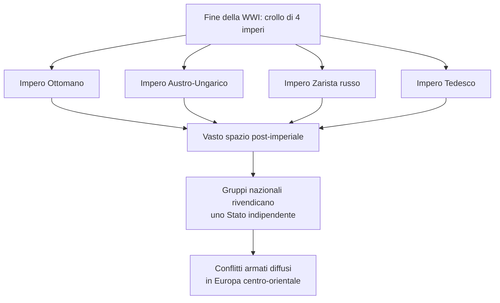
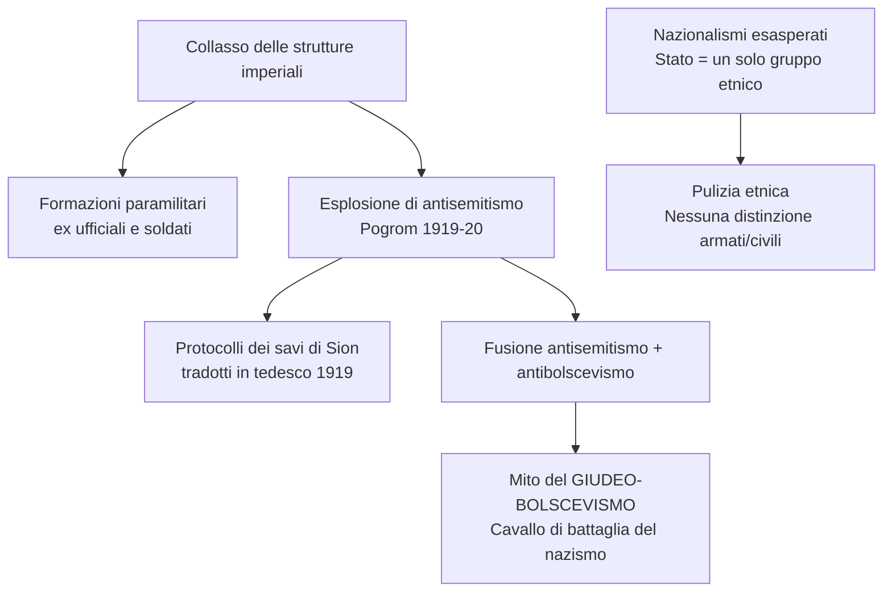
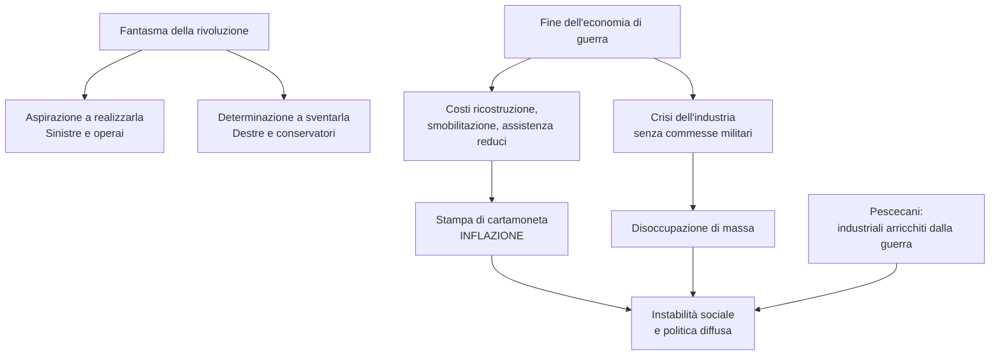
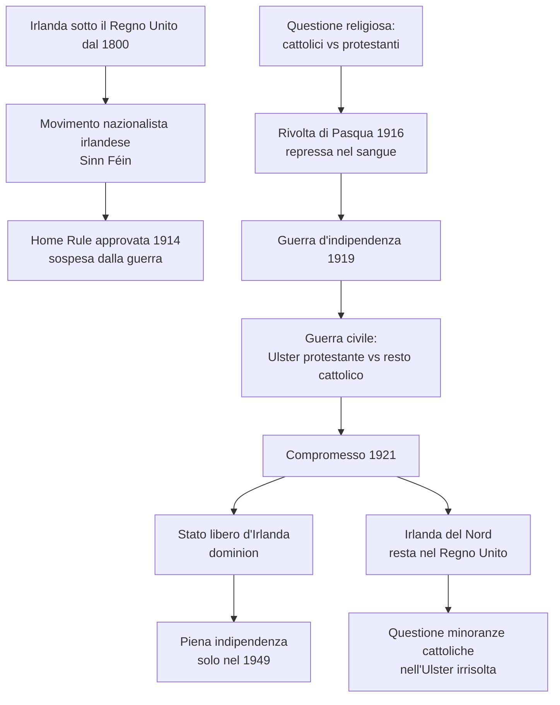
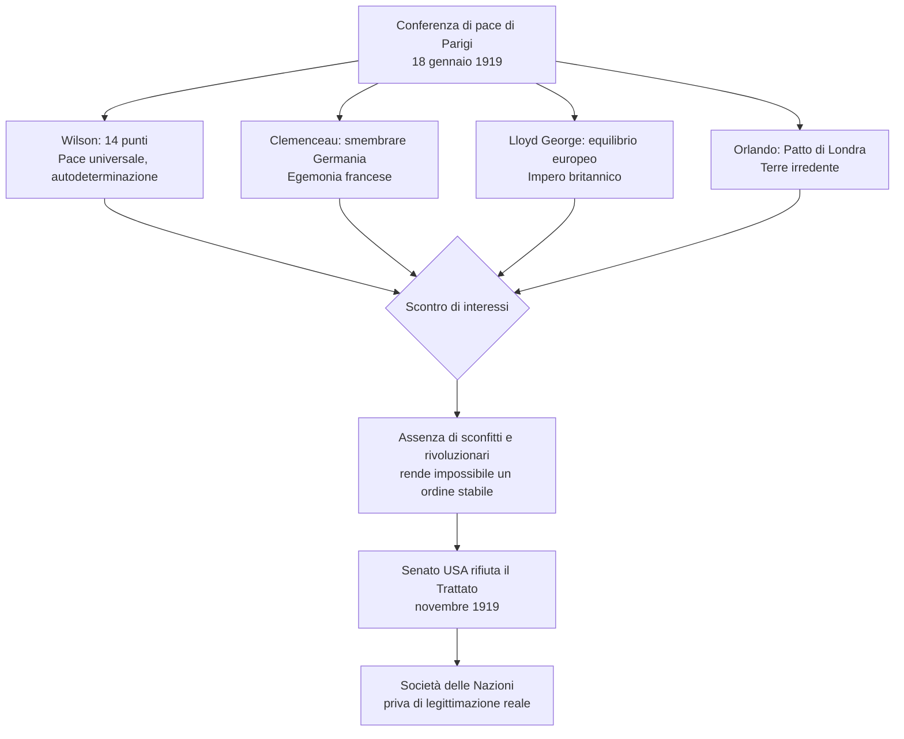
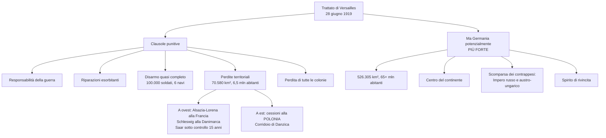
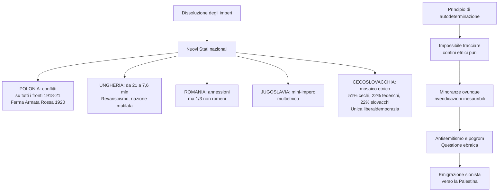
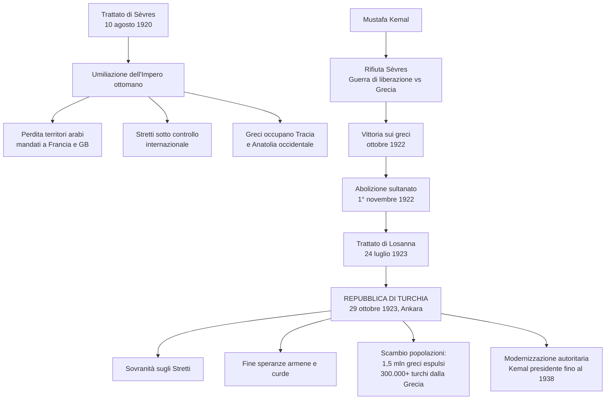
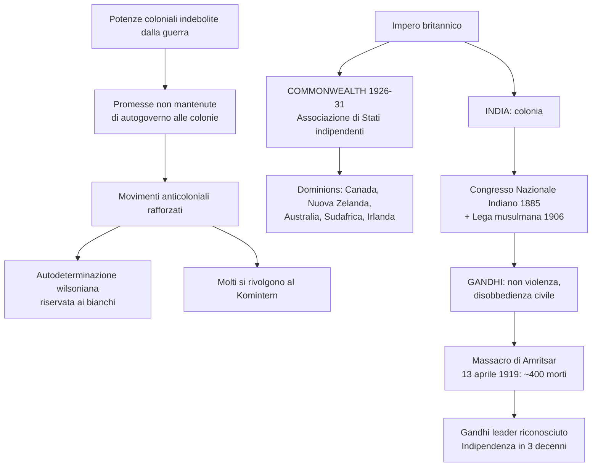
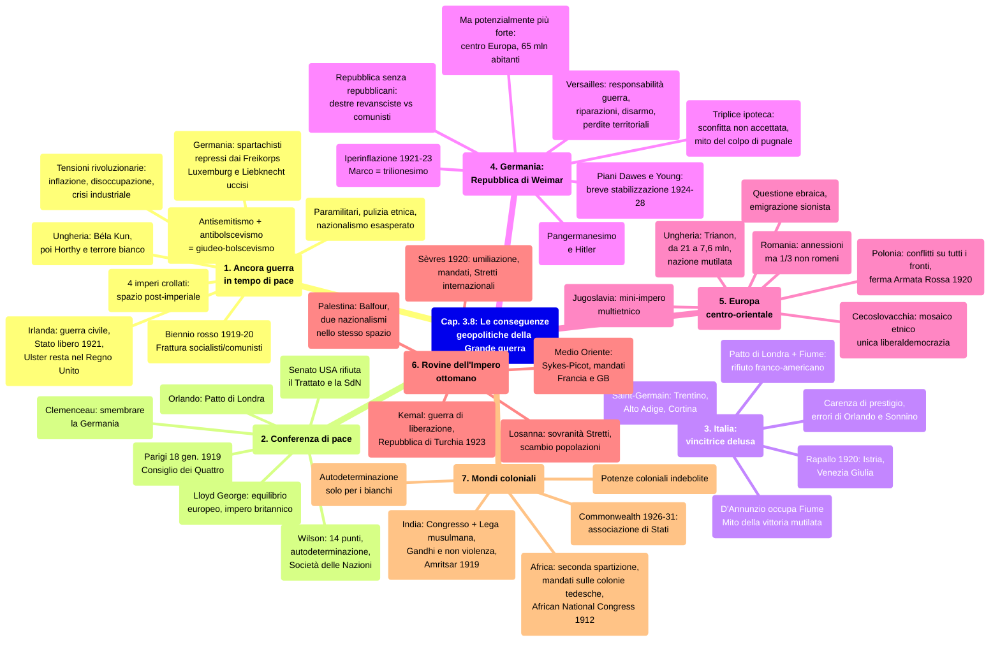

# Schema di Studio - Capitolo 3.8: Le conseguenze geopolitiche della Grande guerra

---

## 1. Ancora guerra in tempo di pace

### 1.1 Da una Grande guerra a tante piccole guerre

Le date delle capitolazioni accettate dai tre imperi sconfitti -- il 30 ottobre quello ottomano, il 4 novembre quello austro-ungarico e l'11 novembre quello tedesco -- sono passate alla storia come quelle in cui si chiuse la Prima guerra mondiale. In realtà, alla fine del 1918 il massacro cessò sul fronte occidentale, ma **continuò nell'Europa centro-orientale e sud-orientale**, dove la Grande guerra prese la forma di una serie di **conflitti minori** ma ampiamente diffusi.

Ciò fu il risultato del cataclisma geopolitico che, in una dozzina di mesi, aveva abbattuto **quattro imperi**: quelli multietnici -- **ottomano, asburgico e zarista** --, le cui strutture risalivano agli albori dell'età moderna, e quello **tedesco**, che senza nemmeno mezzo secolo di storia alle spalle aveva visto l'abdicazione del Kaiser Guglielmo II.

Nel vasto spazio **«post-imperiale»** che si era creato, i **gruppi nazionali** fino ad allora inclusi negli imperi multietnici cercarono di affermare sul campo, armi alla mano, il loro **diritto a uno Stato indipendente**.

### 1.2 Nazionalismo e antisemitismo

Nella situazione caotica seguita al collasso delle strutture imperiali, ad agire sul campo non furono eserciti regolari, ma **formazioni paramilitari**: milizie armate strutturate come un esercito (con gerarchie, divise, insegne) che però si muovevano in proprio, al di fuori di ogni diritto costituito. Esse erano composte perlopiù da **ex ufficiali ed ex soldati** che avevano combattuto la Grande guerra nelle fila degli eserciti sconfitti, a cui si unirono uomini più giovani animati da un **radicalismo ideologico** maturato negli anni del conflitto.

La guerra aveva inasprito i nazionalismi affermatisi dalla fine del XIX secolo, per i quali lo **Stato nazionale** doveva essere costituito da **un solo gruppo etnico**. Questa idea fu all'origine della ferocia degli scontri: nel corso delle operazioni di **pulizia etnica** cadde ogni distinzione tra armati e civili e fu superata la soglia di brutalità raggiunta nel 1914-18.

> **Parola della storia — «Pulizia etnica»:** Progetto di eliminazione violenta di gruppi o minoranze (soppressi o forzati ad allontanarsi) per stabilire una «omogeneità etnica» in un territorio o in uno Stato. La parola è entrata in uso con le guerre civili scoppiate a partire dal 1991 nella ex Jugoslavia.

Si verificò anche una nuova esplosione di **antisemitismo**: nel 1919-20 l'Europa centro-orientale fu teatro di nuovi **pogrom** (violenze di massa perpetrate contro la popolazione ebraica, spesso incoraggiate dalle autorità). L'ondata giunse sino in Germania, dove si verificarono assalti e distruzioni di sinagoghe e beni di ebrei. Nel 1919 furono tradotti in tedesco *I protocolli dei savi di Sion*.

In questo momento l'antisemitismo si fuse con l'**antibolscevismo**: la perturbante fantasia del **«complotto ebraico»** si saldò al terrore della rivoluzione sociale dando vita al tema del **giudeo-bolscevismo**, che di lì a poco sarebbe diventato uno dei cavalli di battaglia del nazismo.

### 1.3 Tra guerra e tensioni rivoluzionarie

Oltre al nazionalismo, fu il **fantasma della rivoluzione** -- l'aspirazione a realizzarla o, al contrario, la determinazione a sventarla -- ad alimentare l'agitazione post-bellica. Tra il 1919 e il 1920 sembrò che quanto accaduto in Russia potesse ripetersi in buona parte del Vecchio Continente.

Le **tensioni sociali** erano state aggravate dagli sconquassi legati alla fine dell'economia di guerra e al ritorno al tempo di pace. Quasi tutti gli Stati, già alle prese con un enorme debito pubblico, fecero fronte ai **costi della ricostruzione**, della **smobilitazione** degli eserciti, dell'**assistenza ai reduci** e ai parenti delle vittime stampando ulteriore cartamoneta. Finiva il mondo della stabilità finanziaria ottocentesca e si entrava in quello dell'**inflazione** e dell'**instabilità monetaria**.

Alle turbolenze finanziarie si aggiunse la **crisi dell'industria**, che per quattro-cinque anni aveva potuto contare sulle commesse militari. Ne derivò una massiccia **disoccupazione**, proprio nel momento in cui la smobilitazione riportava alla vita civile milioni di uomini in piena età lavorativa. I rancori di classe erano inaspriti perché per i grandi industriali -- i cosiddetti **«pescecani»** -- la guerra era stato un ottimo affare.

> **Parola della storia — «Inflazione»:** Aumento generalizzato dei prezzi delle merci, con conseguente e prolungata diminuzione del potere d'acquisto della moneta.

### 1.4 La situazione in Germania

La combinazione di **crisi sociale** e **vuoto di potere** si verificò con forza nello spazio «post-imperiale» tedesco. In Germania, dopo la fuga dell'imperatore lo Stato era allo sbando. Il **Partito socialdemocratico** teneva le redini del governo, ma il Paese era in preda all'agitazione:

- da un lato, **Consigli di operai e soldati**, sul modello sovietico, controllavano molte città;
- dall'altro, **bande paramilitari di estrema destra** (in tedesco *Freikorps*, «Corpi franchi») agivano come forza controrivoluzionaria, contrastando le sollevazioni di stampo bolscevico.

A Berlino, la **Lega di Spartaco**, l'organizzazione di estrema sinistra guidata da **Rosa Luxemburg** e **Karl Liebknecht**, tentò la via dell'insurrezione una prima volta all'indomani dell'abdicazione del Kaiser, poi una seconda nel **gennaio 1919**, dopo essersi costituita in Partito comunista. Quest'ultimo moto rivoluzionario fu **represso nel sangue** dal governo socialdemocratico che si servì anche dei *Freikorps* nazionalisti. Il **15 gennaio** Rosa Luxemburg e Liebknecht furono rapiti, torturati e uccisi da membri dei Corpi franchi.

Nel corso del 1919 altri tentativi insurrezionali si verificarono in molte città tedesche e in particolare in Baviera, dove ci fu l'effimera esperienza di una **repubblica sovietica bavarese**. Il governo a guida socialdemocratica intervenne con durezza, contando sull'esercito e sullo zelo dei *Freikorps*. Questo ciclo si chiuse con la repressione dell'ultimo moto rivoluzionario scoppiato a Berlino nel **gennaio 1920**.

### 1.5 La situazione in Austria e in Ungheria

Anche in **Austria** fu un governo socialdemocratico a reprimere un tentativo insurrezionale di matrice comunista, sorto a Vienna nel 1920. Invece in **Ungheria**, nel marzo 1919, i socialisti si erano uniti ai comunisti per dare vita a un regime ispirato a quello russo. Capo del governo era **Béla Kun**, un giornalista socialista che aveva partecipato alla rivoluzione bolscevica.

Questi avviò un **programma rivoluzionario** (riforma agraria, nazionalizzazione di banche e industrie, separazione tra Stato e Chiesa) accompagnato dalla repressione contro la borghesia e l'aristocrazia agraria. Il regime comunista fu però sopraffatto dalle forze controrivoluzionarie dell'ammiraglio **Miklós Horthy**, ex comandante della flotta austro-ungarica, che si impose con l'appoggio delle truppe romene. Alla repressione del movimento seguì l'instaurazione di un **regime autoritario** di segno opposto, che scatenò un'ondata di **«terrore bianco»**.

| Paese | Evento rivoluzionario | Esito |
|---|---|---|
| **Germania** | Insurrezione spartachista (gen. 1919), moti nelle città, repubblica sovietica bavarese | Repressi dal governo socialdemocratico con i *Freikorps*; Luxemburg e Liebknecht uccisi |
| **Austria** | Tentativo insurrezionale comunista a Vienna (1920) | Represso dal governo socialdemocratico |
| **Ungheria** | Regime comunista di Béla Kun (marzo 1919) | Rovesciato da Horthy; regime autoritario e «terrore bianco» |

### 1.6 Il «biennio rosso»

Negli stessi anni, nei principali Paesi europei -- Francia, Gran Bretagna, Italia -- si verificarono **agitazioni e scioperi imponenti**: per ottenere l'aumento dei salari (di fronte a un'inflazione che erodeva i redditi) o per rivendicare la **giornata lavorativa di otto ore**. L'espressione **«biennio rosso»** adottata dalla storiografia per il periodo **1919-20** rende l'idea dell'ampiezza di questa agitazione e spiega perché i bolscevichi coltivassero la prospettiva di una **rivoluzione mondiale**.

Dopo il 1920 le acque si calmarono: la rivoluzione europea non scoppiò; l'Unione Sovietica avrebbe ripiegato sull'idea della «rivoluzione in un solo Paese». Le **classi medie** continuarono a **sentirsi minacciate**, impoverite di fronte alla grande borghesia industriale arricchitasi con la guerra e insidiate dal protagonismo della classe operaia.

Dal canto suo, il movimento operaio uscì indebolito dal biennio rosso: si creò una **frattura insanabile** tra i **vecchi partiti socialisti o socialdemocratici** e i **nuovi partiti comunisti** che guardavano all'URSS e aderivano al Komintern. Le forze di sinistra si sarebbero presentate lacerate alla sfida lanciata dai movimenti di estrema destra.

### 1.7 La questione irlandese

Nel Regno Unito, all'agitazione sociale del dopoguerra si affiancò la **rivolta irlandese**, frutto di secolari tensioni dovute al controllo che Londra esercitava sull'isola. La storia più recente del conflitto partiva dal **1800**, quando l'Irlanda fu annessa al **Regno Unito di Gran Bretagna e Irlanda**, perdendo ogni forma di governo autonomo.

Nel corso del XIX secolo, un **movimento nazionalista irlandese** aveva lottato per l'indipendenza e ai primi del Novecento si organizzò in un vero e proprio partito, il ***Sinn Féin***. I governi di Londra cercarono un compromesso con una ***Home Rule*** (autonomia locale), approvata nel maggio 1914 ma sospesa dalla guerra.

Alla questione politica se ne sovrapponeva una **religiosa**: i britannici erano anglicani o protestanti, la grande maggioranza degli irlandesi era cattolica e relegata in posizione subordinata.

Le tensioni esplosero nel **1916** con la **rivolta di Pasqua**, repressa nel sangue dall'esercito inglese. Nel **1919** divampò la **guerra d'indipendenza** irlandese, trasformatasi in una violenta **guerra civile**: sei province settentrionali d'Irlanda (l'**Ulster**) erano a maggioranza protestante e non intendevano separarsi da Londra. I **cattolici indipendentisti** diedero vita all'**Irish Republican Army** (IRA), mentre le forze **unioniste** protestanti contavano sull'esercito britannico.

Nel **1921** si giunse a un compromesso: Londra riconobbe lo **Stato libero d'Irlanda**, che assumeva lo status di ***dominion*** (la piena indipendenza fu riconosciuta solo nel 1949). Da questa compagine si staccarono le province protestanti, rimaste nel Regno Unito come **Irlanda del Nord**. Restava aperta la questione delle **minoranze cattoliche** dell'Ulster, che avrebbe generato una nuova guerra civile nella seconda metà del XX secolo.

> **Parola della storia — «Dominion»:** Nell'Impero britannico, territorio dotato di autogoverno locale, che manteneva legami e vincoli con la Corona. Lo status di *dominion* non esiste più dal 1947.

### 1.8 I nodi irrisolti della società di massa

In buona sostanza, gli anni fino al 1923 furono segnati da rivoluzioni, controrivoluzioni, scontri etnici, pogrom, guerre civili. Al termine della guerra restavano aperte le questioni sollevate dall'avvento della società di massa e della modernità.

In tutti gli Stati europei, il **rientro dei soldati dal fronte** aveva contribuito all'affermarsi di nuovi movimenti politici, animati da capi giovani e ambiziosi. **Gruppi radicali** di destra, di sinistra, nazionalisti, anarcoidi -- alcuni dotati di strutture paramilitari -- **sfidavano i sistemi parlamentari liberali classici**.

Il protagonismo vissuto dalle **donne** durante la guerra cominciò a intaccare le barriere di genere: le donne britanniche e tedesche ottennero il **diritto di voto** nel 1918, quelle statunitensi nel 1920.

Infine, la diffusione del **cinema e della radio** negli anni Venti contribuì a rivoluzionare i meccanismi della politica e della creazione del consenso. È in questo turbolento contesto che la diplomazia internazionale agì per stabilire le condizioni della pace.

---

## 2. La Conferenza di pace: strategie e obiettivi dei vincitori

### 2.1 Quale pace per un mondo nuovo?

La Grande guerra non segnò una svolta geopolitica solo per l'Europa. Sul piano globale, nel 1918 erano evidenti:

- la **crisi dell'egemonia mondiale dell'Impero britannico**, ormai sovradimensionato rispetto alle risorse disponibili;
- il drastico **indebolimento di tutte le potenze coloniali europee**;
- la definitiva affermazione degli **Stati Uniti**, che non si pretendevano impero ma cominciavano a essere percepiti come tale.

In questo scenario, il **18 gennaio 1919** si aprì la **Conferenza di pace di Parigi**, in **assenza dei Paesi vinti**: Regno Unito, Francia, Italia e Stati Uniti -- membri del **Consiglio dei Quattro**, il massimo organo deliberativo -- decisero che sarebbe spettato unicamente a loro stabilire le clausole di pace. Tra il giugno 1919 e l'agosto 1920 furono preparati i trattati che gli Stati sconfitti dovevano firmare.

### 2.2 I «quattordici punti» di Wilson

Nel 1919 il presidente degli USA **Woodrow Wilson** sbarcò in Europa tra accoglienze trionfali. Con sé recava un pesante bagaglio: il programma annunciato un anno prima al Congresso, i cosiddetti **«quattordici punti»**, su cui fondare la **pace universale**. I principi generali erano definiti «obbligatori», i progetti geopolitici solo «auspicabili».

La proposta di Wilson -- che replicava al decreto bolscevico sulla pace «senza annessioni e senza indennità» -- guardava alla nascita e alla **convivenza pacifica di governi liberaldemocratici** al posto delle autocrazie degli imperi multietnici. A vigilare su questo scenario sarebbe stata la **Società delle Nazioni**, un nuovo organismo internazionale, sorta di «governo mondiale» abilitato a dirimere i contenziosi fra gli Stati.

Tuttavia questa costruzione era minata alla base dal principio dell'**autodeterminazione dei popoli**: ogni nazionalità doveva avere facoltà di decidere da sé le proprie istituzioni e il proprio Stato. Era un'**enunciazione ideale vaga**, dagli effetti imprevedibili. Chi aveva titolo di dichiararsi popolo o nazione e di creare le proprie istituzioni? E come proteggere le minoranze? Il principio di autodeterminazione divenne una fonte di **destabilizzazione permanente** e un propellente per i conflitti del dopoguerra.

> [!note] Dalla lezione
> Il professore ha sottolineato con forza l'importanza dei **14 punti di Wilson**, invitando a ricordarli perché ebbero una vera e propria "riedizione" vent'anni dopo. Nell'**agosto 1941**, il presidente americano **Franklin Delano Roosevelt** (non Teddy, ma Franklin Delano) e il primo ministro britannico **Churchill**, impegnato nel conflitto contro Germania e Italia, si incontrarono su una **nave da guerra inglese al largo dell'isola di Terranova** (Canada) e sottoscrissero la **Carta Atlantica**, organizzata su **otto punti** che ricalcavano molti dei 14 punti di Wilson. Quell'incontro avvenne a pochi mesi dall'attacco giapponese alle Hawaii e dall'ingresso in guerra degli Stati Uniti. La Carta Atlantica a sua volta preannunciava l'**Alleanza Atlantica** (NATO), firmata a **Washington nell'aprile 1949** tra USA, Gran Bretagna e l'Europa occidentale. Quindi — ha detto il docente — «non dimenticate questi 14 punti di Wilson: in fondo l'ordine post-bellico organizzato attorno agli Stati Uniti e all'Alleanza Atlantica dipende da molti di questi punti».
>
> Ha inoltre richiamato un parallelo con l'attualità: il cancelliere tedesco **Scholz** aveva appena dichiarato che «l'ordine post-bellico è finito», ma — ha commentato il professore — «come al solito la storia è molto più complessa di quelle che possono essere le dichiarazioni o gli slogan dei politici».
>
> Sul **punto numero 5** dei 14 punti (quello sulle colonie), il docente ha spiegato che non ci fu convergenza: Francia e Gran Bretagna, una volta che gli USA decisero di non entrare nella Società delle Nazioni, continuarono con un po' di *maquillage* — cioè trucco, make-up — facendo qualche concessione di facciata al punto 5 ma mantenendo in piedi il vecchio ordine coloniale di cui erano le potenze più rappresentative.

### 2.3 I vincitori «europei» e i limiti della conferenza

Le ambizioni di Wilson collidevano con quelle dei «grandi» vincitori europei, che ragionavano a partire dai propri **interessi nazionali**.

| Leader | Paese | Obiettivi |
|---|---|---|
| **Georges Clemenceau** | Francia (Terza Repubblica) | Smembrare il Reich tedesco, riconquistare l'**egemonia continentale** |
| **David Lloyd George** | Regno Unito | Impedire che una grande potenza dominasse l'Europa; mantenere l'**equilibrio continentale** |
| **Vittorio Emanuele Orlando** | Italia | Portare a casa il Patto di Londra; affermarsi tra i «grandi» |
| **Woodrow Wilson** | Stati Uniti | Pace universale, autodeterminazione, Società delle Nazioni |

Il **pacifismo idealista** di Wilson cozzava contro l'**imperialismo britannico** imperniato sull'equilibrio di potere e contro l'**idea di potenza** della Francia. L'intesa fra le tre potenze vincitrici naufragò durante i negoziati. A rendere impossibile un nuovo ordine fu anche l'**assenza degli sconfitti** (i tedeschi) **e dei rivoluzionari** (i russi) dalla Conferenza. Stabilizzare l'Europa senza di loro si rivelò presto impossibile.

### 2.4 La fine dell'alleanza

L'alleanza nata nel 1917 fu rotta nel **novembre 1919**, quando il **Senato americano** rifiutò di ratificare il Trattato di Versailles con la Germania e di **aderire alla Società delle Nazioni**. Wilson era fuori gioco per problemi di salute.

La decisione era dovuta alla volontà di non accettare la **limitazione della sovranità nazionale** implicita nei meccanismi di un'organizzazione internazionale. Washington non intendeva chiudersi in sé stessa, ma proteggersi dalle influenze geopolitiche altrui, nel momento in cui erano la sua finanza e la sua industria a proiettarsi sul mondo.

La **Società delle Nazioni**, il cui statuto era stato approvato nell'aprile 1919, rimase formalmente in vita fino al 1946, ma **non ebbe mai la legittimazione** sufficiente per incidere sulle grandi crisi internazionali.

---

## 3. L'Italia: una vincitrice delusa

### 3.1 Errori e miopia della diplomazia italiana

Alla Conferenza di Parigi i rappresentanti dell'Italia, fanalino di coda dei Paesi vincitori, sprecarono l'occasione di incidere sul suo esito e di qualificarsi come soci effettivi dell'élite internazionale. Ciò avvenne per due ragioni:

- la **carenza di prestigio internazionale** e gli errori dei capi della delegazione, ovvero il presidente del Consiglio **Vittorio Emanuele Orlando** e il ministro degli Esteri **Sidney Sonnino**;
- l'incapacità di comprendere fino a che punto il **contesto fosse cambiato**: entrando in guerra l'Italia non intendeva distruggere l'Impero austro-ungarico, ma riconquistare le **terre irredente** ed **espandere la propria influenza** nel Mediterraneo e nei Balcani. Il crollo di Vienna lasciava però l'Italia a fronteggiare le turbolenze alla sua mobile **frontiera orientale**.

Gli obiettivi della delegazione italiana erano il **Trentino**, l'**Alto Adige-Sudtirolo**, **Trieste**, l'**Istria** e **parti della Dalmazia**, incluse le città di Fiume e Spalato, Valona, le isole del Dodecaneso e altri avamposti nei Balcani. In sintesi: il **«Patto di Londra più Fiume»** -- alle rivendicazioni stabilite nel patto segreto con gli alleati si associava una nuova pretesa basata sul principio di autodeterminazione e nazionalità.

La **Francia** -- che aveva sostenuto la nascita del **Regno dei serbi, croati e sloveni** come bastione contro ingerenze tedesche e italiane nei Balcani -- respinse l'annessione di Fiume. Gli **americani** rilevarono che, eccetto Trento e Trieste, in molte delle «terre irredente» **gli italiani erano una minoranza**: se invocavano il principio di nazionalità per Fiume, non potevano ignorarlo negli altri casi.

Orlando e Sonnino ritennero inaccettabile il compromesso e quando Wilson si rivolse direttamente all'opinione pubblica italiana, i due, offesi e sdegnati, **lasciarono Parigi** il 26 aprile 1919.

> [!note] Dalla lezione
> Il professore ha chiarito con un dettaglio storico cruciale **perché Fiume non fosse nel Patto di Londra** del 1915: all'epoca nessuno poteva immaginare il crollo e la scomparsa dell'Impero Austro-ungarico. Se l'Italia avesse ottenuto Trieste, all'Impero bisognava comunque lasciare una città portuale abbastanza grande — e se non Trieste (che era la seconda città dell'Impero per importanza), almeno Fiume. Ecco perché non fu inserita tra le promesse. Ma alla fine della guerra, l'opinione pubblica italiana cominciò a «voler tutto: i tedeschi dell'Alto Adige, i croati della Dalmazia e anche Fiume. Alla fine ne uscì fuori un pasticcio».
>
> Ha ricordato che la **Dalmazia** non fu concessa all'Italia, e che rimasero all'Italia solo **Zara** (oggi Zadar). Ha citato l'esempio del calciatore **Luka Modrić**, «uno dei più grandi centrocampisti degli ultimi vent'anni», che è proprio di Zara — ma è croato, non italiano. «Pensate che Zara fino a non troppo tempo fa era una città italiana, abitata da italiani.» Ha poi elencato i nomi italiani delle città dalmate: Spalato (Split), Ragusa (Dubrovnik), Parenzo (Poreč), Pola (Pula), Fiume (Rijeka) — tutte «erano città abitate in maggioranza da italiani». Non potendo ottenere la Dalmazia, le mire italiane si concentrarono su Fiume.
>
> Il docente ha anche precisato i ruoli: **Salandra** entrò in guerra come Presidente del Consiglio, **Sonnino** la vinse nel '18 come ministro degli Esteri.

### 3.2 Il Trattato di Saint-Germain-en-Laye e la «vittoria mutilata»

In Italia rimontò un clima di ardente **nazionalismo**, centrato sulla **rivendicazione di Fiume**, nel quale si foggiarono le avanguardie del **movimento fascista**. Orlando sperò di esibire l'unità di intenti tra governo e opinione pubblica per far pressione a Parigi. Già il 7 maggio Orlando e Sonnino rientrarono alla conferenza, temendo di restare tagliati fuori. Ma gli alleati si erano già spartiti le **colonie africane del Reich tedesco** e il loro sprezzo verso la delegazione italiana era ancora più evidente. L'insuccesso diplomatico costrinse Orlando alle **dimissioni** in giugno.

La firma sul **Trattato di Saint-Germain-en-Laye** -- che regolava la dissoluzione dell'Impero austro-ungarico e poneva le basi per la nascita di una Repubblica d'Austria -- fu apposta il **10 settembre 1919** dal liberale riformista **Francesco Saverio Nitti**.

Sulla **frontiera settentrionale**, il Regno d'Italia otteneva **Trentino, Alto-Adige e Cortina d'Ampezzo**, imponendo il tricolore fino al **Brennero** e alla val Pusteria (San Candido). Sulla **frontiera orientale**, la questione fu risolta nel **novembre 1920** con il **Trattato di Rapallo**, che assegnava all'Italia l'**Istria**, la **Venezia Giulia** e buona parte dei territori inscritti nel Patto di Londra.

Intanto, subito dopo il Trattato di Saint-Germain, il poeta **Gabriele D'Annunzio** si lanciò con reparti militari ribelli e una milizia di volontari nell'**occupazione di Fiume** (12 settembre 1919), proclamandone l'annessione all'Italia. L'«impresa» durò fino al dicembre 1920, e con essa si impose il mito della **«vittoria mutilata»**, espressione coniata da D'Annunzio per indicare la sproporzione tra i sacrifici italiani e quanto ottenuto alla fine della guerra.

> [!note] Dalla lezione
> Il professore ha inquadrato la crisi del dopoguerra italiano in un **paradosso**: la crisi che portò alla fine dello Stato liberale e all'avvento del fascismo fu aperta non dalla sconfitta, ma dalla **vittoria**. La vittoria del 1918 sull'Austria-Ungheria rappresentava il **coronamento dell'opera risorgimentale**: la prima volta che l'Italia sconfiggeva da sola il nemico storico. Le unificazioni precedenti erano state in realtà doni di altri: nel 1859 a vincere fu **Napoleone III**, nel 1866 fu **Bismarck**. «Erano state la Francia e la Prussia a regalare in qualche modo l'unità della penisola.» Eppure proprio quel trionfo fu «l'anticamera della fine dello Stato liberale e di quella classe dirigente».
>
> Ha descritto in dettaglio la **marcia su Fiume** di D'Annunzio (settembre 1919): circa **2.000 "legionari"** (ex combattenti smobilitati) partirono da **Monfalcone** e raggiunsero Fiume a piedi — «non dimenticate mai questa espressione: marcia su Fiume» — perché fu il **modello** della successiva **marcia su Roma** dell'ottobre 1922. L'**esercito fu connivente**: lasciò passare i legionari, e il contingente italiano già presente a Fiume si ritirò. Il regime d'annunziano durò **15 mesi** (settembre 1919 – dicembre 1920), finché **Giolitti**, tornato al governo, «sbaraccò i legionari».

| Trattato | Data | Acquisizioni italiane |
|---|---|---|
| **Saint-Germain-en-Laye** | 10 settembre 1919 | Trentino, Alto-Adige, Cortina d'Ampezzo (fino al Brennero) |
| **Rapallo** | novembre 1920 | Istria, Venezia Giulia, buona parte del Patto di Londra |
| **Fiume** | 12 set. 1919 – dic. 1920 | Occupata da D'Annunzio; indipendente fino al 1924, poi in parte annessa |

---

## 4. La Germania: una repubblica nata dalla sconfitta

### 4.1 Un Paese colpevole e bastonato ma potente

Firmando il **Trattato di Versailles il 28 giugno 1919**, il governo a guida socialdemocratica della Repubblica accettò la **responsabilità della guerra** in quanto aggressore. Per questo la Germania era stata esclusa dai negoziati e dalla Società delle Nazioni.

> [!note] Dalla lezione
> Il professore ha enfatizzato il peso simbolico del luogo della firma: il trattato fu firmato nella **Galleria degli Specchi di Versailles**, la stessa sala dove il **18 gennaio 1871**, sulla Francia sconfitta del Secondo Impero, era stato proclamato il **Secondo Reich tedesco**. In quella stessa sala, i politici tedeschi sconfitti e umiliati dovettero firmare il trattato «non avendo partecipato alle trattative». Sembravano riecheggiare le parole dei romani: **«Guai ai vinti»** (*Vae victis*).
>
> Ha collegato la questione alla scheda del libro sulla responsabilità dello scoppio della guerra (pagina 122): «Lo scoppio della Prima guerra mondiale ha un responsabile? Ovviamente no, sono tanti i responsabili»: il *revanchismo* francese (l'ossessione per una rivincita), l'imperialismo britannico (la paura di essere sopravanzati), la rivalità austro-russa, austro-serba, austro-italiana. Ma i vincitori «poterono decidere chi aveva la colpa: la Germania».
>
> Il docente ha evidenziato l'**Articolo 231** del trattato, che proclamava l'**unica responsabilità tedesca** per lo scoppio del conflitto. Questa clausola diventava fondamentale per pretendere le **riparazioni di guerra**: «È colpevole la Germania? Ebbene, paghi lei i danni». I danni non significavano solo la devastazione dei territori (la Francia settentrionale e il Belgio «sembravano un paesaggio lunare»), ma anche le enormi pensioni per milioni di **vedove, orfani e invalidi di guerra** nei paesi vincitori.

Le clausole imposte alla Germania:

- esorbitanti **riparazioni di guerra**;
- **disarmo quasi completo**: restavano 100.000 soldati e sei navi da guerra, nessun sottomarino né aereo né carro armato;
- rinuncia a **tutte le colonie**;
- dolorose amputazioni del territorio metropolitano: **70.580 km²** e **6.475.000 abitanti** persi.

Sul versante occidentale e settentrionale le perdite principali andarono a vantaggio della **Francia** (Alsazia-Lorena) e della **Danimarca** (Schleswig del Nord). Sul versante orientale le pesanti cessioni andarono soprattutto alla **Polonia**, che rinasceva come Stato indipendente dopo essere scomparsa alla fine del XVIII secolo. Inoltre la **Saar**, regione mineraria altamente industrializzata, fu posta sotto controllo franco-britannico per quindici anni, al termine dei quali un referendum ne stabilì il ritorno alla Germania.

> [!note] Dalla lezione
> Il professore ha fornito un confronto storico illuminante sulle **riparazioni**: la commissione interalleata nel **1921** presentò il conto finale di **132 miliardi di marchi oro** — in marchi oro che di fatto non esistevano più, poiché la guerra aveva bruciato la stragrande maggioranza delle riserve auree europee. Per dare un'idea della sproporzione, alla fine della **guerra franco-prussiana del 1870** (una guerra molto più breve), i prussiani avevano chiesto alla Francia sconfitta **5 miliardi di franchi oro**. «Da poche settimane a quattro anni e mezzo: 132 miliardi di marchi oro.»
>
> Sul **corridoio di Danzica**: il docente ha spiegato che dal 1919 la **Prussia orientale** risultava separata dalla madrepatria tedesca. Ha invitato a ricordare il corridoio di Danzica perché «nel settembre 1939 fu la rivendicazione scelta da Hitler per agitare la diplomazia europea e poi dopo attaccare».
>
> Sull'**Alsazia e Lorena**: «l'amputazione territoriale forse più dolorosa era il pegno della vittoria contro la Francia del 1870», che tornava alla Francia con la città di **Strasburgo**.
>
> Sulla **Renania**: venne «totalmente smilitarizzata — cioè lì i tedeschi non ci potevano tenere nemmeno un soldato, tutto il confine con la Francia e il Belgio». All'interno della Renania la **Saar**, ricchissima regione mineraria, «veniva affidata per quindici anni al controllo e allo sfruttamento franco-britannico, le miniere di carbone».

Malgrado queste perdite, diversi fattori rendevano la Germania **potenzialmente più forte** di prima: le dimensioni spaziali e demografiche (**526.305 km²** e **oltre 65 milioni** di abitanti), la **collocazione al centro del continente**, e soprattutto la **scomparsa dell'Impero russo e di quello austro-ungarico** come contrappesi geopolitici. Per di più, la Germania era animata da un formidabile **spirito di rivincita** per una sconfitta che molti tedeschi non accettavano.

> [!note] Dalla lezione
> Il professore ha spiegato perché la Germania fosse **potenzialmente più forte di prima**: al posto dei due imperi scomparsi (russo e austro-ungarico) c'era ora «una fascia di nuovi paesi piccoli e deboli, certamente più piccoli della Germania, molto meno popolosi, molto più deboli anche da un punto di vista economico-industriale e anche caratterizzati al loro interno da forti tensioni». Ha anticipato la Seconda guerra mondiale: «in quell'area la Germania dilagò: corridore di Danzica, Polonia, i tedeschi dei Sudeti, l'annessione dell'Austria nel '38, il protettorato sulla Slovacchia... non c'erano più quei due imperi che fungevano da tampone, da contrappeso».

### 4.2 L'esperimento Weimar gravato dalla sconfitta

La repubblica tedesca battezzata nel **febbraio 1919** a Weimar -- la **Repubblica di Weimar** -- avrebbe dovuto radicare la pianta di una **pacifica liberaldemocrazia parlamentare** nella voragine scavata dalla sconfitta del Reich. Ma questo esperimento **non ebbe il consenso della maggioranza** della popolazione e nacque sotto una **triplice, soffocante ipoteca**.

> [!note] Dalla lezione
> Il professore ha spiegato perché la Costituente si tenne a **Weimar**: era una località dove negli anni del Romanticismo si era concentrato uno dei più famosi circoli culturali tedeschi. «Quando si trattò di scegliere una città simbolo della storia e della cultura tedesca dove far nascere l'erede del Secondo Reich e dove scrivere la nuova Costituzione, si scelse Weimar.» Ha fatto un paragone con l'Italia: «È un po' come se alla fine della Seconda guerra mondiale, per far nascere la Repubblica e scrivere la nuova Costituzione, si fosse deciso di riunirsi a **Firenze**, come città simbolo della cultura italiana, della letteratura italiana, della lingua italiana: Dante, eccetera.»
>
> Ha spiegato anche il concetto di **ipoteca** con un esempio concreto: «L'ipoteca è una possibilità di prestito: tu dai come garanzia una parte della tua proprietà immobiliare. Se la mia casa vale 500.000 euro, la ipoteco per 250.000. Però se quei 250.000 poi non li restituisco, la banca si prende metà della mia casa.» L'ipoteca, dunque, è qualcosa che «ti vincola, non ti permette più di gestire in maniera libera quello che è tuo» — e la Repubblica di Weimar era vincolata, «incatenata», a tre questioni.

**Prima ipoteca: la sconfitta non accettata.** Lo Stato nato dalla sconfitta era il prodotto di una **sconfitta che la maggioranza dei tedeschi non considerava tale** o ammetteva come provvisoria. Nell'autunno 1918 il nemico non aveva ancora violato le frontiere tedesche occidentali, mentre quelle orientali si erano estese verso l'ex Impero zarista. La vittoria sulla Russia era stata suggellata a Brest-Litovsk dai capi delle Forze armate del Reich, mentre l'armistizio «della vergogna» fu firmato da un governo civile (il socialdemocratico **Friedrich Ebert**).

Vertici militari ed élite nazionaliste ebbero buon gioco a diffondere il **mito del «colpo di pugnale» alla schiena**: l'impero sarebbe stato vittima di un **complotto ebraico-bolscevico**, d'intesa con il capitalismo internazionale. Diserzioni e tentativi rivoluzionari furono dipinti come **cause e non conseguenze della sconfitta**.

> [!note] Dalla lezione
> Il professore ha ricostruito la logica del mito dal punto di vista dei tedeschi che non accettavano la sconfitta: «Contro la Russia abbiamo vinto, la Russia è collassata a Oriente. Mentre contro la Francia, la Gran Bretagna e gli Stati Uniti, quando fu firmato l'armistizio, i tedeschi erano ancora in Francia. Stavano ritirandosi, ma il territorio tedesco non era ancora stato invaso dall'Intesa.» Dunque: «In Russia abbiamo vinto. Di là abbiamo firmato l'armistizio che il nostro territorio era ancora così lontano, i nostri confini nazionali. I nostri soldati erano ancora di là. Allora sono stati pugnalati alle spalle dai politici che hanno firmato l'armistizio.»
>
> Insieme al mito della pugnalata alle spalle si diffuse l'altra parola d'ordine del **complotto ebraico-bolscevico**, e nei primi anni '20 gruppi ultra-nazionalisti, nostalgici del Kaiser, risposero con colpi di stato e assassinii politici. Il docente ha citato l'assassinio del ministro degli Esteri **Walther Rathenau**, «un grande imprenditore di famiglia ebraica, assassinato proprio perché ebreo», e l'assassinio di uno dei politici tedeschi che aveva firmato l'armistizio del novembre 1918.

Nei primi anni Venti, la **Baviera** fu una delle regioni più calde: dopo la breve repubblica sovietica, fu teatro dei tentativi di colpo di Stato falliti di Wolfgang **Kapp** nel 1920 e di **Adolf Hitler** nel 1923 (il «putsch della birreria» a Monaco, sedato dalla polizia -- 16 morti tra i ribelli e Hitler condannato a cinque anni di carcere).

Per buona parte dell'opinione pubblica tedesca, Weimar era un'**imposizione** dovuta al tradimento interno e alla volontà esterna -- soprattutto francese -- di **umiliare la Germania**.

### 4.3 Una repubblica senza repubblicani

**Seconda ipoteca: assenza di cultura politica repubblicana.** Lo schieramento che aveva battezzato la repubblica -- socialdemocratici, centristi cattolici e liberali -- **perse la maggioranza assoluta** già alle elezioni del **1920** e non l'avrebbe più recuperata nella breve parabola di Weimar (fino al 1933).

I governi che si succedettero a ritmo vorticoso non furono espressione di una cultura liberaldemocratica-repubblicana, ma frutto di **instabili compromessi**. Gli avversari esprimevano una **cultura antiliberale, antidemocratica, antiparlamentare e antirepubblicana** che voleva distruggere Weimar. Erano gruppi e partiti dotati di **milizie paramilitari** che parlavano il linguaggio della forza.

Il progetto di costruzione di uno Stato di diritto era stretto tra due fuochi:

- le **destre conservatrici, reazionarie e revansciste**, preoccupate solo di apparecchiare la rivincita;
- i **comunisti**, decisi soprattutto a contendere ai socialdemocratici l'egemonia sulle classi lavoratrici.

> [!note] Dalla lezione
> Il professore ha introdotto il concetto di **opposizioni sleali**: gli avversari della Repubblica di Weimar «non erano semplici oppositori politici all'interno di un sistema istituzionale condiviso», ma esprimevano una cultura antiliberale, antidemocratica, antiparlamentare e antirepubblicana. La destra nazionalista voleva il ritorno del Reich e dell'imperatore; la sinistra comunista voleva la Repubblica dei Soviet, «facciamo come in Russia». Sleali perché «non è che stanno all'opposizione per pensare di arrivare al governo con la vittoria alle elezioni. No, vogliono la fine di quella Repubblica». Delegittimavano l'esistenza stessa dello Stato.
>
> Ha precisato chi tenesse in piedi la Repubblica: il **Partito Socialdemocratico** (macchiatosi però di «orrendi crimini nella repressione dell'insurrezione comunista») e il **Partito Cattolico dello Zentrum**, «in una sorta di fortino, perché le opposizioni sono entrambe antirepubblicane, anticostituzionali, sleali».
>
> In queste destre nazionaliste cominciava ad essere presente un «partitino minuscolo, un gruppuscolo»: il **Partito Nazionalsocialista dei Lavoratori Tedeschi** (NSDAP — *Nationalsozialistische Deutsche Arbeiterpartei*). «Però non è ancora questo partitino quello che poi sarebbe diventato negli anni '30.»

### 4.4 La crisi economica e sociale

**Terza ipoteca: emergenza economica di proporzioni inaudite.** Il suo simbolo fu l'**iperinflazione**, che raggiunse tassi iperbolici: il denaro non valeva più nulla e fra il 1921 e il 1923 si tornò a forme di **baratto**, anche nelle città.

| Bene / Servizio | Equivalente in baratto |
|---|---|
| Taglio di capelli | 4 uova |
| Sepoltura (con preghiera) | 40 uova |
| Visita medica | Una bottiglia di vino |

Nell'**ottobre-novembre 1923**, quando la perdita di valore della moneta toccò il picco, le banche venivano rifornite con carriole colme di banconote senza valore. Nel **novembre 1923** il marco valeva un **trilionesimo** della sua quotazione d'anteguerra.

> [!note] Dalla lezione
> Il professore ha spiegato la **causa** dell'inflazione: lo sforzo bellico aveva fatto perdere ogni valore al marco, e ne erano stati stampati in quantità esorbitanti. Dopo la guerra, per garantire una circolazione monetaria (i 132 miliardi di marchi oro non c'erano), «si cominciò a stampare carta moneta che davvero non valeva più nulla, neanche il valore della carta su cui era stampata».
>
> Ha chiarito che l'inflazione raggiunse il suo picco quando, nel **1923**, la Germania non pagò la rata annuale ai vincitori. La prima rata era stata pagata nel '22 (il conto era stato presentato nel '21), ma nel '23 la rata non fu pagata. **Francia e Belgio** occuparono allora la **Ruhr**: «Non ci pagate e noi occupiamo le fabbriche della Ruhr e ci prendiamo i prodotti industriali come controvalore della rata non pagata.»
>
> Ha anche precisato il terminologia: «Ad essere galoppante è l'inflazione, la disoccupazione invece dilaga» — e ha illustrato il baratto con aneddoti: «Un taglio di capelli, quattro uova. Una sepoltura, quaranta uova. Una visita medica, una bottiglia di vino — ma non aceto, di quello buono.» Il denaro non valeva più niente, e il mondo agricolo poteva almeno contare sugli alimenti.

Il Paese era chiamato a sanare la **disoccupazione** galoppante (3 milioni nel febbraio 1919, raddoppiati quattro anni dopo) e a rispondere alle rivendicazioni operaie e contadine. Inoltre, il nuovo Stato non fu in grado di far fronte alle **riparazioni di guerra** imposte a Versailles. Nel **gennaio 1923** truppe franco-belghe **occuparono la Ruhr**, regione mineraria e industriale, per ricavarvi i risarcimenti dovuti, contribuendo a far precipitare l'inflazione.

Sulle velleità punitive francesi prevalsero l'approccio realistico degli inglesi e le **mediazioni americane**: il **piano Dawes** (1924) e il **piano Young** (1929) ridussero e dilazionarono il peso dei debiti di guerra, permettendo alla Germania di ristabilizzare la moneta. Affluirono investimenti stranieri, soprattutto americani, che **rilanciarono l'economia**. Per un breve periodo, intorno alla metà degli anni Venti, la Germania sembrò avviarsi verso una ripresa e **Berlino** fioriva come grande **centro culturale e artistico** europeo.

> [!note] Dalla lezione
> Il professore ha spiegato il **meccanismo dei debiti incrociati** che rese necessario l'intervento americano. Il sistema di pagamento si era bloccato: Francia e Gran Bretagna erano indebitate con le **banche americane** (in particolare la **Banca Morgan**) e pensavano di liberarsi di questi debiti scaricando tutto sulla Germania: «La Germania deve dei soldi a noi, la Germania paga le banche americane — più facile di così.» Ma gli Stati Uniti rifiutarono: «No, non funziona così» — le due cose dovevano essere **separate e indipendenti**. La Germania paga i vincitori, poi i vincitori pagano la Banca Morgan. «Ecco perché dovette entrare in funzione questa diplomazia statunitense» con il **Piano Dawes** (1924) e il **Piano Young** (1929), dal nome di due banchieri e finanzieri americani. Tra il '24 e il '28 «affluirono investimenti americani che rilanciarono l'economia tedesca. Un po' di respiro dopo quei difficilissimi primi anni venti».

Fu una parentesi fugace: già nel 1928 si coglievano segni di recessione, accentuati dal **crollo di Wall Street** dell'ottobre 1929. A partire dal 1930 la Germania ripiombò nella situazione dell'immediato dopoguerra.

| Fase | Periodo | Caratteristiche |
|---|---|---|
| **Crisi post-bellica** | 1919–1923 | Inflazione crescente, disoccupazione, moti rivoluzionari, pulizia etnica |
| **Iperinflazione** | 1921–1923 | Baratto diffuso, marco = trilionesimo del valore anteguerra (picco nov. 1923) |
| **Occupazione della Ruhr** | Gennaio 1923 | Truppe franco-belghe per recuperare riparazioni |
| **Stabilizzazione** | 1924–1928 | Piani Dawes e Young, investimenti USA, ripresa economica, Berlino centro culturale |
| **Nuova crisi** | Dal 1928–29 | Recessione, crollo di Wall Street, ritorno all'instabilità |

### 4.5 Una «grande Germania»?

La **questione territoriale** era la terza grande ipoteca su Weimar. Per aspirare alla legittimazione interna, la Repubblica doveva riportare la Germania al rango di **grande potenza**, recuperando i territori di Versailles.

I nazionalisti più accesi cullavano un obiettivo più ambizioso: costruire **uno Stato per tutti i tedeschi** (pangermanesimo). Dopo Versailles, un quarto delle **popolazioni minoritarie** nell'Europa centro-orientale era formato da tedeschi (circa **10 milioni su 36**). In Cecoslovacchia e in Polonia le cospicue **comunità germaniche** erano oggetto di vessazioni. Tra il 1918 e il 1926, **575.000 tedeschi** abbandonarono la Polonia; **200.000** furono espulsi dall'Alsazia-Lorena riannessa da Parigi.

Vi era poi il **caso austriaco**: i trattati avevano stabilito una Repubblica d'Austria indipendente, di ceppo tedesco. Ma larghi settori dell'opinione pubblica sia in Austria sia in Germania abbracciavano l'ideologia **pangermanista**. Fra i più decisi militanti della causa grande-tedesca c'era un trentenne austriaco di nome **Adolf Hitler**, che si era distinto nel putsch di Monaco del 1923 e sarebbe riemerso dopo la crisi del 1929.

> [!note] Dalla lezione
> Il professore ha riletto le **tre ipoteche** di Weimar attraverso l'ottica della **propaganda hitleriana**, mostrando come Hitler sfruttò ciascuna di esse:
> 1. **Sconfitta non accettata** → «Non abbiamo perso la guerra: è stato un complotto ebraico-bolscevico, una pugnalata alle spalle.»
> 2. **Repubblica senza repubblicani** → «La Repubblica è debole, corrotta, imbelle, va abbattuta.»
> 3. **Crisi economica e riparazioni** → «Non dobbiamo pagare più niente a nessuno.» Infatti nel 1933, quando Hitler divenne cancelliere, «uno dei primissimi provvedimenti è: noi non pagheremo più nulla, non vedrete più un marco».
> 4. **Grande Germania** → È quello che Hitler cominciò a fare dal **1938**: «Ricordatevi questa data: 1938, annessione dell'Austria. Primo tassello della Grande Germania. E poi i 3 milioni di tedeschi della Cecoslovacchia lo stesso anno. E poi nel '39: vogliamo i tedeschi che stanno in Polonia, il corridoio polacco, Danzica — e poi scoppia la guerra.»
>
> Ha descritto il **pan-germanesimo** con un'espressione efficace: «Ovunque ci sono tedeschi, lì è Germania» — includendo austriaci, tedeschi della Cecoslovacchia, dell'Ungheria, della Polonia, della Romania, della Slovenia e della Croazia.

---

## 5. La questione nazionale nell'Europa centro-orientale

### 5.1 La fine degli imperi e le ambiguità dell'autodeterminazione

Nello spazio «post-imperiale», fra ciò che restava della Germania e della Russia, il dopoguerra tardò a cominciare. Il **principio di autodeterminazione** non era un fattore di giustizia e pacificazione, ma uno **strumento di rivendicazioni e di conflitti** inesauribili che lasciavano ogni nazione perennemente insoddisfatta.

I vincitori firmarono i trattati di **Saint-Germain-en-Laye** con l'Austria (10 settembre 1919), di **Neuilly** con la Bulgaria (27 novembre 1919) e di **Trianon** con l'Ungheria (4 giugno 1920). Ma i nuovi Stati confermavano che era **impossibile tracciare confini** che delimitassero entità etnicamente «pure», e l'esistenza di **minoranze** lasciava aperta la porta a rivendicazioni analoghe a quelle che avevano presieduto la prima risistemazione.

### 5.2 La Polonia

Il più importante degli Stati che emergevano a est di Berlino era la **Polonia**. Gli accordi diplomatici trovarono applicazione tardiva e tra il 1918 e il 1921 i polacchi si impegnarono in **conflitti** per rafforzare ed estendere il proprio Stato, dove risiedevano cospicue minoranze tedesche, ebraiche, baltiche, russe, ucraine.

La Polonia si scontrò in particolare con la **Russia bolscevica**. Nell'**agosto 1920** l'esercito polacco -- sostenuto dalle potenze dell'Intesa e guidato dal generale **Józef Piłsudski** -- fermò l'**Armata Rossa** alle porte di Varsavia.

### 5.3 L'Ungheria

Il caso forse più traumatico fu la **spartizione dell'Ungheria**. Il **Trattato del Trianon** distrusse il sogno della «grande Ungheria»:

| | **Anteguerra** | **Dopo il Trianon** |
|---|---|---|
| **Abitanti** | ~21 milioni | 7,6 milioni |
| **Superficie** | 325.411 km² | 93.073 km² |
| **Sbocco al mare** | Sì | No |

Tutto ciò alimentò il **revanscismo nazionale**, fondato come in Germania sul mito della punizione immeritata. L'Ungheria si concepiva come **«nazione mutilata»**.

### 5.4 La Romania e il Regno jugoslavo

Ad avvantaggiarsi della decomposizione dell'Impero asburgico furono soprattutto romeni e jugoslavi.

La **Romania** annetteva la **Transilvania** (terra di forte impronta magiara e germanica), la **Bessarabia** (dalla Russia), la **Bucovina** (dall'Austria), la **Dobrugia meridionale** (dalla Bulgaria). Inglobava un terzo di cittadini non romeni, di cui almeno l'**8%** di etnia magiara.

Il **Regno dei serbi, croati e sloveni** era esso stesso un **mini-impero multietnico**: oltre ai tre popoli eponimi, confluivano bosniaci (musulmani), albanesi, turchi, tedeschi, italiani, ebrei, macedoni, romeni, montenegrini e ungheresi.

### 5.5 La Cecoslovacchia

Proclamata il **28 ottobre 1918**, la Cecoslovacchia fu il frutto delle aspirazioni all'indipendenza di **cechi** (da Vienna) e di **slovacchi** (da Budapest). I suoi confini vennero ritoccati a scapito dell'Ungheria con il Trattato del Trianon, determinando un accentuato **mosaico etnico**:

| Componente etnica | Percentuale |
|---|---|
| **Cechi** (boemi e moravi) | 51% |
| **Tedeschi** (concentrati nei **Sudeti**) | 22% |
| **Slovacchi** | 22% |
| **Ungheresi** | 5% |

Peraltro la Cecoslovacchia restò largamente immune dai conflitti della regione e divenne l'unica **solida liberaldemocrazia** dell'Europa centrale.

### 5.6 La questione ebraica

A rendere instabile l'assetto dell'Europa centro-orientale contribuì la **questione ebraica**. Gli ebrei erano il bersaglio favorito dei nazionalisti, specie in **Polonia**. Boicottaggi, spedizioni punitive e pogrom erano all'ordine del giorno. L'elemento ebraico -- sparso negli *shtetl* e visibile nelle grandi città come Praga e Varsavia -- era identificato come **quinta colonna** di nemici o addirittura avanguardia della rivoluzione comunista.

Da queste persecuzioni prese le mosse un'**emigrazione di matrice sionista** verso la **Palestina**, la «Terra promessa» biblica, investita dalle trasformazioni geopolitiche del dopoguerra.

> [!note] Dalla lezione
> Il professore ha richiamato le origini del **Sionismo** già trattate nel capitolo 1: nel **1897** un giornalista ungherese di lingua tedesca, suddito dell'Impero austro-ungarico ed ebreo, **Theodor Herzl**, diede vita a un movimento per la fondazione di una comunità ebraica **fuori dall'Europa** — «purché sia, ma fuori dall'Europa» — perché l'antisemitismo si stava sviluppando in maniera sempre più aggressiva. Dalla nascita del Sionismo, furono numerosissimi gli ebrei d'Europa che emigrarono **in Palestina o negli Stati Uniti**.

> **Parola della storia — «Quinta colonna»:** Persona o gruppo che, all'interno di un territorio, agisce a favore di un nemico esterno. Nel linguaggio corrente è sinonimo di «infiltrato».

---

## 6. Sulle rovine dell'Impero ottomano

### 6.1 Il Trattato di Sèvres

La decomposizione dell'Impero ottomano terminò il **10 agosto 1920** con il **Trattato di Sèvres**, imposto dagli alleati all'ultimo sultano. Era una vera e propria **umiliazione**:

- l'impero era amputato dei possedimenti fuori dalla Penisola Anatolica, assegnati a Parigi e Londra sotto la forma del **mandato**;
- **francesi e britannici** ottenevano aree di controllo in Anatolia;
- gli **Stretti** (Bosforo e Dardanelli) venivano sottoposti a **controllo internazionale**;
- l'**Italia** conservava il Dodecaneso e si vedeva attribuire una zona di influenza nell'Anatolia sud-occidentale;
- i **greci** si impadronivano di buona parte della Tracia e di una porzione dell'Anatolia occidentale, occupando Smirne.

Il trattato prevedeva anche l'autodeterminazione per le **minoranze armena e curda**: gli armeni ottenevano una repubblica indipendente; per i curdi restava la prospettiva di uno Stato. Erano inoltre imposte **riparazioni di guerra** e il controllo estero sulle leve economiche e finanziarie dello Stato.

> **Parola della storia — «Mandato»:** Strumento del diritto internazionale sulla base del quale la Società delle Nazioni «affidava» temporaneamente a una potenza esterna l'amministrazione di una regione destinata in seguito ad autodeterminarsi.

### 6.2 Il movimento nazionalista turco e la Repubblica di Turchia

Il movimento nazionalista turco, guidato dal generale **Mustafa Kemal**, reagì esautorando il sultano, respingendo le clausole di Sèvres e continuando a combattere quella che era diventata una **«guerra di liberazione nazionale» contro l'occupazione greca**. L'obiettivo era riprendere il controllo dell'Anatolia e della Tracia orientale (con Istanbul).

La guerra si concluse nell'**ottobre 1922** con l'ingresso a Istanbul dei turchi vittoriosi. Il **1° novembre** il sultanato fu abolito, aprendo la via al **Trattato di Losanna** (24 luglio 1923), che sostituiva quello di Sèvres. La **Repubblica di Turchia** fu proclamata il **29 ottobre 1923**, con capitale **Ankara**.

Il nuovo Stato emergeva come **geograficamente anatolico, religiosamente musulmano ed etnicamente turco** (con una robusta minoranza curda). La Repubblica recuperava la **sovranità sugli Stretti**, riconoscendo la perdita di tutti gli altri territori.

La vittoria di Kemal vanificò le speranze armene e curde: l'**effimero Stato armeno scomparve** nel 1921 (Turchia e URSS si accordarono per spartirselo); i **curdi** ripiombarono nella condizione di minoranza rigidamente controllata. La **minoranza greca** fu espulsa con uno **scambio di popolazioni** sancito dal Trattato di Losanna: circa **1,5 milioni di greci** lasciarono l'Anatolia, mentre oltre **300.000 turchi** passarono dalla Grecia alla nuova patria. Il **profugo** diventava una **figura tipica del XX secolo**.

Kemal avviò una **modernizzazione** del Paese con piglio autoritario come Presidente della Repubblica, carica mantenuta fino alla morte nel 1938.

> [!note] Dalla lezione
> Il professore ha approfondito la figura di **Mustafa Kemal Atatürk** e la nascita della **Turchia moderna**. Atatürk guidò un movimento rivoluzionario indipendentista, rifiutando il Trattato di Sèvres e muovendo guerra agli **armeni** e ai **greci** per riconquistare i territori perduti e il controllo economico sugli **Stretti**.
>
> In particolare, è stata richiamata la questione di **Smirne** (nella costa ionica), città greca da tempo immemorabile dove nacque la filosofia (Mileto, Efeso); con la nascita della Turchia moderna nel 1923, i greci furono cacciati e la regione fu "turchizzata". Il docente ha inoltre sottolineato l'occasione persa nel 1920 riguardo a **Costantinopoli**: gli eredi di chi l'aveva fondata (i greci) avrebbero potuto riprendersela, ma rimase in mano turca. «È l'unica grande capitale antica — a differenza di Roma, Teheran, Londra o Pechino — che non è in mano agli eredi di chi l'ha fondata.»

### 6.3 Francesi e britannici in Medio Oriente

Tra il 1919 e il 1925 la **configurazione geopolitica del Medio Oriente** mutò volto. Il nuovo assetto derivava dagli **accordi segreti Sykes-Picot** del 1916, che spartivano i territori ottomani tra le due potenze europee.

| Potenza | Territori | Politica adottata |
|---|---|---|
| **Francia** | Mandati in **Siria** e **Libano** | Controllo rigido, di tipo coloniale; confine Siria-Libano disegnato arbitrariamente; rivolta armata in Siria (1925-27) repressa con la forza |
| **Regno Unito** | Mandato in **Palestina** e **Iraq** | Più conciliante; nascono il **Regno dell'Iraq** (1921) e la **Transgiordania** (1923); contratto petrolifero in Iraq (1925, primi pozzi nel 1927) |
| **Regno Unito** | **Egitto** | Riconosce il Regno d'Egitto (1922) ma controlla Canale di Suez, politica estera e forze armate |
| **Regno Unito** | **Arabia Saudita** | Riconosce conquiste di Abul Aziz Ibn Saud (1922); Regno d'Arabia Saudita proclamato nel 1932; custodia dei luoghi santi (Medina e La Mecca) |
| **Regno Unito** | **Kuwait** | Creato nel 1922 come cuscinetto costiero tra Arabia Saudita e Iraq |
| **Regno Unito** | **Persia → Iran** | Controllo dei pozzi petroliferi; nel 1921 il generale **Reza Khan** si impone come *shah* (dinastia dei Pahlavi); **modernizzazione autoritaria** sul modello di Kemal; impone il nome **Iran** |

Londra mirava a garantirsi la libertà di movimento in Medio Oriente e il **controllo delle rotte verso l'India**.

> [!note] Dalla lezione
> Il professore ha dedicato un approfondimento alla **Persia** e alla presenza britannica nella regione, collegandosi al capitolo 2 sul "grande gioco" tra Russia e Gran Bretagna in Asia centrale. Gli **accordi del 1907** tra Russia e GB — che coronavano l'alleanza dell'Intesa — prevedevano che le ostilità in quella zona venissero «accomodate», e la **Persia fu divisa in due zone d'influenza**. Negli anni successivi furono scoperti giacimenti di **petrolio** sul Golfo Persico, e la Persia divenne uno dei primi produttori mondiali insieme agli USA. Nacque la **Anglo-Persian Oil Company**, che poi cambiò nome in Anglo-Iranian Oil Company: la sua evoluzione è l'attuale **British Petroleum** (BP).
>
> Ha poi aggiunto un dettaglio importante: nel **1925** la vecchia dinastia regnante persiana (che regnava da circa due secoli) fu sostituita dalla dinastia **Pahlavi**, di origine militare. Questa dinastia ebbe solo due esponenti, e l'ultimo, lo **Scià Reza Pahlavi**, fu deposto nella **rivoluzione del 1979** che portò al potere gli **Ayatollah**. Il docente ha suggerito di ricordare questo passaggio per eventuali esami: «Se vi capita l'occasione, potrebbero anche impressionare positivamente un insegnante di storia.»
>
> Ha evidenziato che l'obiettivo della **Gran Bretagna** era controllare **tutti i mari**: il Mediterraneo orientale, il **Mar Rosso** da entrambi i lati (Egitto e Arabia), la Mesopotamia e il Golfo Persico. Oltre il Golfo Persico ci sono gli **Emirati Arabi Uniti** (Abu Dhabi, Dubai), che «fino al 1971 — poco più di cinquant'anni fa — furono un possedimento britannico e solo dal '71 hanno avuto l'indipendenza». Più oltre, attraverso lo stretto di **Hormuz**, c'è l'**Oman**, anch'esso un possedimento britannico. Il docente ha invitato a «cogliere questi aspetti degli spazi geografici e del passare del tempo, per capire meglio quello che succede in giro per il mondo, che non è che salta fuori improvvisamente».

### 6.4 La Palestina contesa

Con la **«dichiarazione Balfour»** del 1917, i britannici avevano patrocinato la nascita in Palestina di un «national home for the Jewish people». Dopo il 1919 cominciò un'importante **immigrazione ebraica** dall'Europa orientale.

Si delinearono **due progetti nazionalisti** in competizione: quello **ebraico** e quello **palestinese**. Gli scontri del 1920-21 rivelarono un conflitto tra due popolazioni che perseguivano il **medesimo obiettivo** -- costruire uno Stato nazionale -- **all'interno del medesimo spazio**. La popolazione ebraica cresceva costantemente grazie all'immigrazione:

| Anno | % di popolazione ebraica in Palestina |
|---|---|
| **1917** | 8% |
| **1922** | 11% |
| **1946** | 31% |

---

## 7. Il sommovimento dei «mondi coloniali»

### 7.1 Le conseguenze globali della Grande guerra

Le **potenze coloniali** erano uscite **indebolite** dal conflitto. Durante la guerra, in cambio del consistente aiuto fornito dalle colonie (risorse e uomini), Londra e Parigi avevano fatto **promesse di autogoverno e autonomia**. I **movimenti anticoloniali**, sorti a fine Ottocento, si erano rafforzati, arrivando a rivendicare la piena **indipendenza**. Questo obiettivo trovava una duplice legittimazione:

- la **posizione antimperialista** dell'URSS e del movimento comunista internazionale;
- il principio dell'**autodeterminazione dei popoli** di Wilson.

Alla Conferenza di Parigi i delegati dei movimenti nazionalisti non occidentali scoprirono che il principio di autodeterminazione era **riservato solo ai «bianchi»** europei o di origine europea: i colonizzati non contavano. Anche per questo, molti si rivolsero al Komintern.

### 7.2 La ristrutturazione dell'Impero britannico

Londra si trovò alle prese con la guerra irlandese, paragonabile a una guerra anticoloniale. L'esito di quella vicenda ebbe un peso nella decisione di ristrutturare l'Impero, che tra il 1926 e il 1931 fu organizzato come ***British Commonwealth***, una **libera associazione di Stati indipendenti** che riconosceva la **fedeltà alla corona**. Le ex colonie «bianche» con status di *dominion*: **Canada, Nuova Zelanda, Australia, Sudafrica, Stato libero d'Irlanda**.

Diversa fu la sorte dell'**India**. Durante la guerra circa **un milione di indiani** aveva combattuto, soprattutto su fronti non europei. Le autorità inglesi avevano imposto una legislazione che impediva ogni manifestazione antigovernativa. Mentre nascevano i movimenti nazionalisti, nel **1885** le élite indiane avevano fondato il **Congresso Nazionale Indiano** per rivendicare maggiore autonomia. Con il tempo esso divenne un **movimento di massa**, punto di riferimento della **maggioranza indù**. Nel **1906** anche la minoranza islamica si diede la **Lega musulmana**.

### 7.3 Gandhi: il leader della non violenza

**Mohandas Karamchand Gandhi** (1869-1948), nato in una famiglia induista benestante, studiò Legge a **Londra** e cominciò a esercitare la professione in **Sudafrica**, dove conobbe il duro regime di **discriminazione razziale** britannico. L'esperienza di scoprirsi suddito di seconda classe lo portò alla **teoria della non violenza**: la lotta politica doveva essere condotta abbracciando la **disobbedienza civile** (rifiuto di leggi ingiuste) e la **resistenza passiva** (resistere all'aggressione senza violenza).

Rientrato in India nel 1915, Gandhi legò la questione dell'indipendenza alla **trasformazione della società indiana**: migliorare le condizioni delle masse contadine e superare il tradizionale **sistema delle caste**. Questa scelta accrebbe la sua popolarità e, toccando il sistema delle caste in senso laico e aconfessionale, aprì la strada all'**accordo con i musulmani**. Nel **1916** Congresso e Lega musulmana si accordarono per creare un **fronte unico dei movimenti nazionalisti**.

> **Parola della storia — «Casta»:** Gruppi sociali chiusi, a cui si appartiene per nascita e che prevedono di non mescolarsi con altri gruppi sociali, come nell'India induista. In senso ampio e spregiativo, denota un gruppo di persone che gode di speciali privilegi.

L'azione di massa per l'indipendenza prese il largo nel **1919**, quando fu chiaro che Londra non avrebbe mantenuto le promesse di guerra. Gandhi promosse una **protesta di massa non violenta**, con grande successo. Ma il **13 aprile 1919** le truppe inglesi spararono sulla folla ad **Amritsar** (Punjab): circa **400 morti** e oltre 1.000 feriti.

L'episodio fu decisivo per screditare le autorità britanniche e rafforzare il prestigio di Gandhi come **leader riconosciuto** della lotta per l'indipendenza. Ci sarebbero voluti ancora tre decenni per conquistarla.

### 7.4 Una «seconda spartizione» dell'Africa

A dispetto di ogni principio di autodeterminazione, le **colonie africane della Germania** furono oggetto di una **nuova spartizione** tra le potenze vincitrici, in forma di mandati:

| Territorio | Assegnato a |
|---|---|
| **Togo** e **Camerun** | Divisi tra Francia e Regno Unito |
| **Tanganica** (Tanzania continentale) | Regno Unito |
| **Ruanda** e **Burundi** | Belgio |
| **Africa del Sud-Ovest** (Namibia) | Sudafrica |

L'affidamento al **Sudafrica** era particolarmente ipocrita: l'élite bianca (boeri e inglesi) stava mettendo in piedi un sistema di **discriminazione razziale** che limitava ogni diritto politico e civile degli africani o dei meticci (oltre l'80% della popolazione). Tale sistema sarebbe stato formalizzato nell'**apartheid** nel 1948 (letteralmente «separazione» in lingua afrikaans): i neri separati dai bianchi in ogni ambito della vita pubblica.

In **Sudafrica**, nel **1912**, la comunità nera diede vita all'**African National Congress**, ritenuto il primo partito politico moderno africano.

Nei decenni tra le due guerre fu intrapresa la costruzione di **infrastrutture** (strade, ospedali), innescando una certa crescita economica legata allo **sfruttamento delle risorse naturali**. Anche piccoli miglioramenti furono alla base della **crescita demografica** del continente. I movimenti anticoloniali -- **«panafricani» o nazionalisti** -- cominciarono a organizzarsi; i frutti si sarebbero visti dopo il secondo conflitto mondiale.

---

## Date fondamentali — Riepilogo cronologico

| Data | Evento |
|---|---|
| **1800** | Irlanda annessa al Regno Unito |
| **1885** | Fondazione del Congresso Nazionale Indiano |
| **1906** | Fondazione della Lega musulmana in India |
| **1912** | Fondazione dell'African National Congress in Sudafrica |
| **Maggio 1914** | Home Rule irlandese approvata; sospesa dalla guerra |
| **1916** | Rivolta di Pasqua in Irlanda, repressa dall'esercito inglese |
| **1917** | Dichiarazione Balfour: «national home» ebraico in Palestina |
| **Gennaio 1919** | Insurrezione spartachista a Berlino; uccisione di Luxemburg e Liebknecht (15 gen.) |
| **18 gennaio 1919** | Apertura della Conferenza di pace di Parigi |
| **Febbraio 1919** | Nasce la Repubblica di Weimar |
| **Marzo 1919** | Regime comunista di Béla Kun in Ungheria |
| **13 aprile 1919** | Massacro di Amritsar (India): ~400 morti |
| **28 giugno 1919** | Trattato di Versailles: pace punitiva imposta alla Germania |
| **10 settembre 1919** | Trattato di Saint-Germain-en-Laye (Austria); D'Annunzio occupa Fiume (12 set.) |
| **Novembre 1919** | Senato USA rifiuta il Trattato e la Società delle Nazioni |
| **27 novembre 1919** | Trattato di Neuilly (Bulgaria) |
| **1919-20** | **«Biennio rosso»**: agitazioni e scioperi in tutta Europa |
| **1920** | Donne britanniche e tedesche ottengono il voto (1918); donne USA nel 1920 |
| **4 giugno 1920** | Trattato del Trianon: spartizione dell'Ungheria |
| **Agosto 1920** | Trattato di Sèvres: dissoluzione Impero ottomano; Polonia ferma l'Armata Rossa |
| **Novembre 1920** | Trattato di Rapallo: Italia ottiene Istria e Venezia Giulia |
| **1921** | Stato libero d'Irlanda (*dominion*); Regno dell'Iraq; Stato armeno scompare |
| **1922** | Regno d'Egitto riconosciuto; Ibn Saud riconosciuto; Kemal vince i greci |
| **Gennaio 1923** | Truppe franco-belghe occupano la Ruhr |
| **24 luglio 1923** | Trattato di Losanna |
| **29 ottobre 1923** | Nasce la Repubblica di Turchia (Ankara), guidata da Mustafa Kemal |
| **Novembre 1923** | Marco tedesco = un trilionesimo del valore anteguerra; putsch di Hitler a Monaco |
| **1924** | Piano Dawes: riduzione e dilazione debiti tedeschi |
| **1929** | Piano Young; crollo di Wall Street |
| **1926-31** | Istituzione del British Commonwealth |
| **1932** | Proclamazione del Regno d'Arabia Saudita |

---

## Mappa concettuale — Visione d'insieme del capitolo

