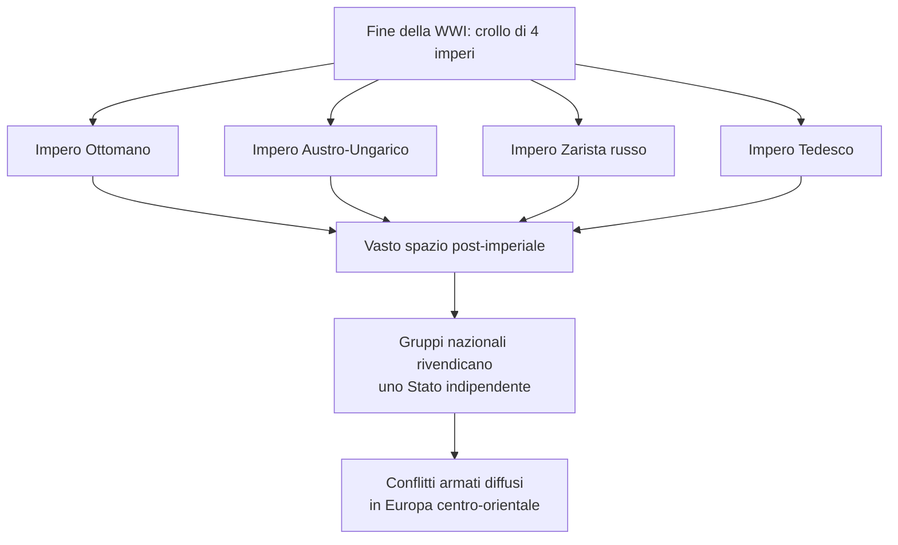
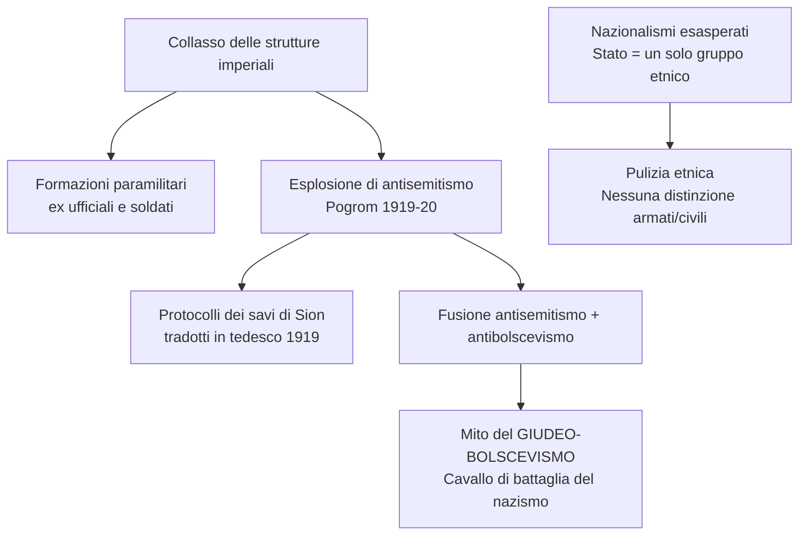
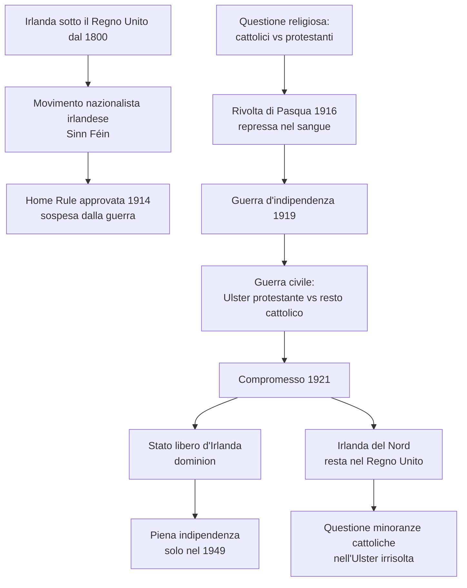
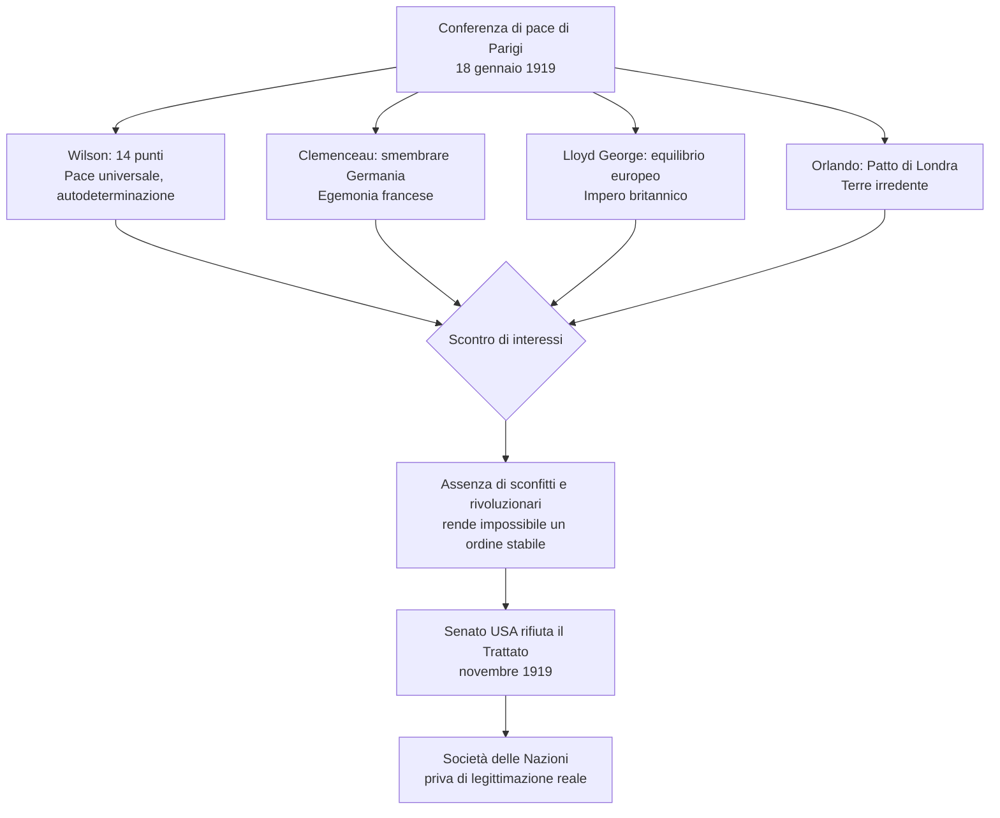
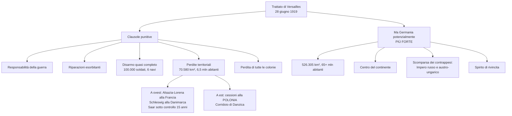
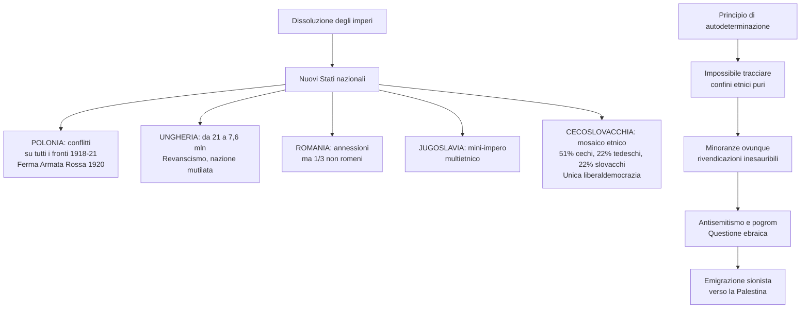
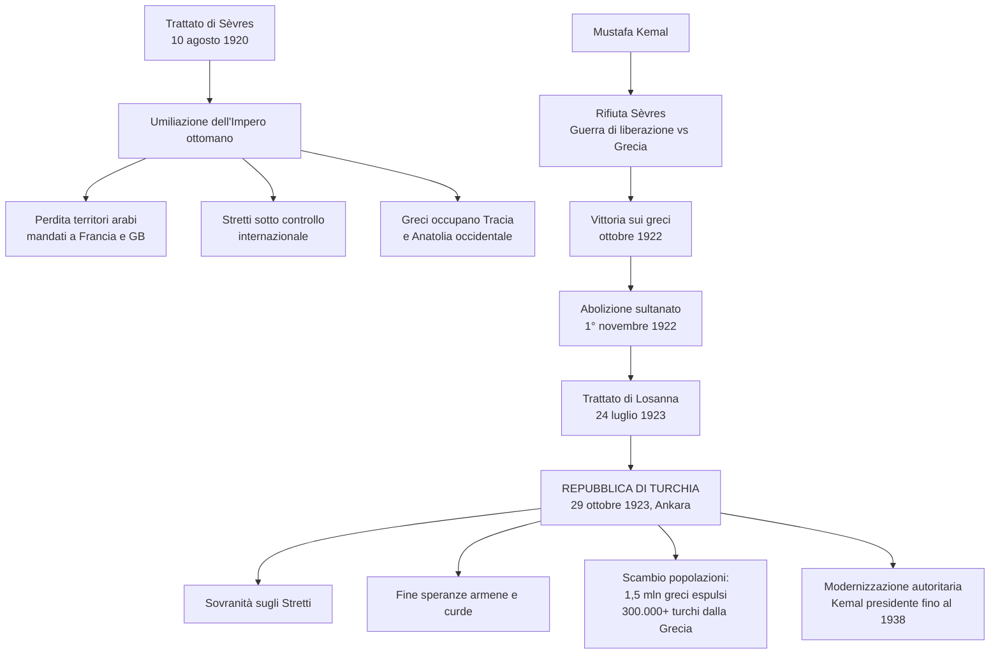
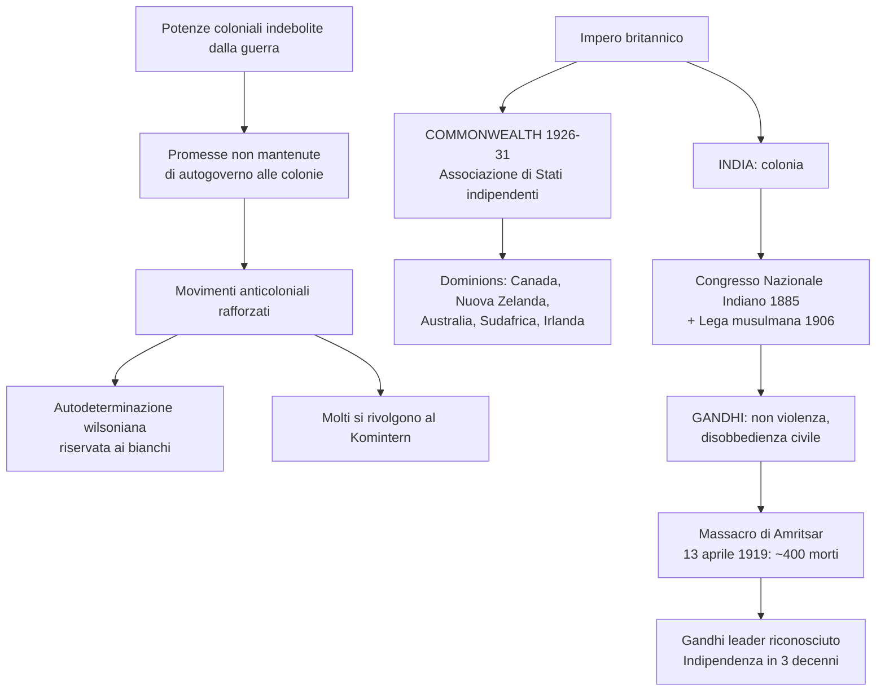
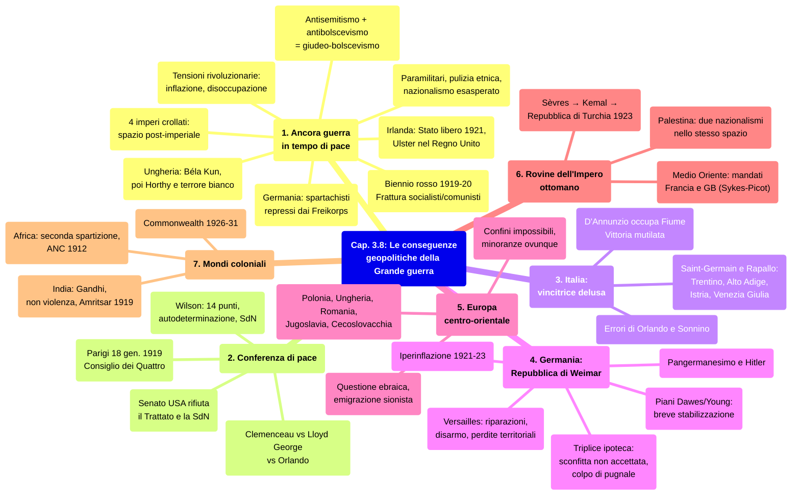

# Schema di Studio - Capitolo 3.8: Le conseguenze geopolitiche della Grande guerra (Riassunto)

---

## 1. Ancora guerra in tempo di pace

### Da una Grande guerra a tante piccole guerre

Le capitolazioni del 1918 chiusero la Prima guerra mondiale sul fronte occidentale, ma il massacro **continuò nell'Europa centro-orientale e sud-orientale**, prendendo la forma di **conflitti minori** diffusi. Il cataclisma geopolitico aveva abbattuto **quattro imperi** (ottomano, asburgico, zarista e tedesco) e nel vasto spazio **«post-imperiale»** i **gruppi nazionali** cercarono di affermare con le armi il loro **diritto a uno Stato indipendente**.

### Nazionalismo e antisemitismo

Nella situazione caotica post-imperiale, ad agire furono **formazioni paramilitari** composte da ex ufficiali e soldati degli eserciti sconfitti, unite a giovani animati da **radicalismo ideologico**. La guerra aveva inasprito i nazionalismi per cui lo **Stato nazionale** doveva essere di **un solo gruppo etnico**: ne derivarono operazioni di **pulizia etnica** dove cadde ogni distinzione tra armati e civili.

> **Parola della storia — «Pulizia etnica»:** Eliminazione violenta di gruppi o minoranze per stabilire «omogeneità etnica» in un territorio. Termine entrato in uso con le guerre nella ex Jugoslavia (dal 1991).

Si verificò una nuova esplosione di **antisemitismo**: pogrom nel 1919-20, assalti a sinagoghe in Germania, traduzione tedesca dei *Protocolli dei savi di Sion* (1919). L'antisemitismo si fuse con l'**antibolscevismo** nel mito del **giudeo-bolscevismo**, destinato a diventare cavallo di battaglia del nazismo.

### Tra guerra e tensioni rivoluzionarie

Il **fantasma della rivoluzione** alimentò l'agitazione post-bellica: tra il 1919 e il 1920 sembrava che la rivoluzione russa potesse ripetersi in Europa. Le **tensioni sociali** erano aggravate dalla fine dell'economia di guerra: gli Stati stamparono cartamoneta per far fronte a ricostruzione, smobilitazione e assistenza ai reduci, entrando nel mondo dell'**inflazione** e dell'**instabilità monetaria**. La **crisi dell'industria** (priva delle commesse militari) generò massiccia **disoccupazione**, mentre i **«pescecani»** — grandi industriali arricchitisi con la guerra — inasprirono i rancori di classe.

> **Parola della storia — «Inflazione»:** Aumento generalizzato dei prezzi con conseguente diminuzione del potere d'acquisto della moneta.

### La situazione in Germania, Austria e Ungheria

In **Germania**, il Partito socialdemocratico governava tra **Consigli di operai e soldati** (sinistra) e ***Freikorps*** paramilitari (destra). La **Lega di Spartaco** di **Rosa Luxemburg** e **Karl Liebknecht** tentò l'insurrezione nel **gennaio 1919**, repressa nel sangue con l'aiuto dei *Freikorps*; il 15 gennaio i due leader furono rapiti e uccisi. Seguirono moti in molte città e l'effimera **repubblica sovietica bavarese**, tutti repressi.

In **Austria** un tentativo comunista a Vienna (1920) fu represso. In **Ungheria** il regime comunista di **Béla Kun** (marzo 1919) fu rovesciato dall'ammiraglio **Miklós Horthy**, che instaurò un **regime autoritario** con ondata di **«terrore bianco»**.

| Paese | Evento rivoluzionario | Esito |
|---|---|---|
| **Germania** | Insurrezione spartachista (gen. 1919), moti, repubblica sovietica bavarese | Repressi con i *Freikorps*; Luxemburg e Liebknecht uccisi |
| **Austria** | Tentativo comunista a Vienna (1920) | Represso dal governo socialdemocratico |
| **Ungheria** | Regime di Béla Kun (marzo 1919) | Rovesciato da Horthy; regime autoritario e «terrore bianco» |

### Il «biennio rosso» e la questione irlandese

Nei principali Paesi europei (Francia, Gran Bretagna, Italia) si verificarono **agitazioni e scioperi imponenti** nel **1919-20** (il «biennio rosso»). Dopo il 1920 la rivoluzione non scoppiò, ma il movimento operaio uscì indebolito: si creò una **frattura insanabile** tra **socialisti/socialdemocratici** e **nuovi partiti comunisti** aderenti al Komintern.

In **Irlanda**, la **rivolta di Pasqua** (1916) e poi la **guerra d'indipendenza** (1919) sfociarono in una violenta **guerra civile** tra cattolici indipendentisti (**IRA**) e protestanti unionisti (**Ulster**). Nel **1921** Londra riconobbe lo **Stato libero d'Irlanda** (*dominion*; indipendenza piena nel 1949), mentre le province protestanti rimasero nel Regno Unito come **Irlanda del Nord**.

### I nodi irrisolti della società di massa

Gli anni fino al 1923 furono segnati da rivoluzioni, scontri etnici, pogrom e guerre civili. Il rientro dei soldati favorì nuovi movimenti politici; **gruppi radicali** (destra, sinistra, nazionalisti) con strutture paramilitari **sfidavano i sistemi parlamentari**. Le donne ottennero il **diritto di voto** (1918 in Gran Bretagna e Germania, 1920 negli USA). La diffusione del **cinema e della radio** rivoluzionò i meccanismi della politica.

---

## 2. La Conferenza di pace: strategie e obiettivi dei vincitori

### I «quattordici punti» di Wilson e il Consiglio dei Quattro

Nel 1918 erano evidenti la **crisi dell'egemonia britannica**, l'indebolimento delle potenze coloniali europee e l'affermazione degli **Stati Uniti**. Il **18 gennaio 1919** si aprì la **Conferenza di pace di Parigi**, in assenza dei Paesi vinti: il **Consiglio dei Quattro** (Regno Unito, Francia, Italia, USA) stabiliva le clausole.

Il presidente **Woodrow Wilson** portava i **«quattordici punti»** per la **pace universale**: convivenza di governi liberaldemocratici, **Società delle Nazioni** come «governo mondiale», e il principio dell'**autodeterminazione dei popoli**. Ma quest'ultimo era un'**enunciazione vaga** che divenne fonte di **destabilizzazione permanente**: chi aveva titolo di dichiararsi nazione? Come proteggere le minoranze?

| Leader | Paese | Obiettivi |
|---|---|---|
| **Georges Clemenceau** | Francia | Smembrare il Reich, riconquistare l'**egemonia continentale** |
| **David Lloyd George** | Regno Unito | **Equilibrio continentale**, mantenere l'impero |
| **Vittorio Emanuele Orlando** | Italia | Patto di Londra, terre irredente |
| **Woodrow Wilson** | Stati Uniti | Pace universale, autodeterminazione, Società delle Nazioni |

### La fine dell'alleanza

Il **pacifismo wilsoniano** cozzò contro l'imperialismo britannico e l'idea di potenza francese. L'**assenza di sconfitti e rivoluzionari** rese impossibile stabilizzare l'Europa. Nel **novembre 1919** il **Senato americano** rifiutò di ratificare il Trattato di Versailles e di aderire alla Società delle Nazioni, che **non ebbe mai la legittimazione** per incidere sulle crisi internazionali (formalmente in vita fino al 1946).

---

## 3. L'Italia: una vincitrice delusa

### Errori della diplomazia italiana

Alla Conferenza, la delegazione italiana (presidente del Consiglio **Orlando** e ministro degli Esteri **Sonnino**) sprecò l'occasione di incidere, per **carenza di prestigio** e incapacità di comprendere il **contesto cambiato**. L'obiettivo era il **«Patto di Londra più Fiume»**: Trentino, Alto Adige, Trieste, Istria, parti della Dalmazia e Fiume. Ma la **Francia** (che aveva sostenuto il Regno dei serbi, croati e sloveni) respinse Fiume, e gli **americani** rilevarono che gli italiani erano minoranza in molte «terre irredente». Orlando e Sonnino, offesi, **lasciarono Parigi** il 26 aprile 1919, ma rientrarono già il 7 maggio, trovando gli alleati ancora più sprezzanti.

### La «vittoria mutilata»

L'insuccesso diplomatico costrinse Orlando alle **dimissioni**. Il **Trattato di Saint-Germain-en-Laye** (10 settembre 1919, firmato da **Nitti**) assegnava all'Italia **Trentino, Alto-Adige e Cortina d'Ampezzo** fino al Brennero. Il **Trattato di Rapallo** (novembre 1920) completava le acquisizioni con **Istria e Venezia Giulia**. Intanto **D'Annunzio** aveva occupato **Fiume** (12 settembre 1919 – dicembre 1920), imponendo il mito della **«vittoria mutilata»**.

| Trattato | Data | Acquisizioni italiane |
|---|---|---|
| **Saint-Germain-en-Laye** | 10 settembre 1919 | Trentino, Alto-Adige, Cortina d'Ampezzo |
| **Rapallo** | novembre 1920 | Istria, Venezia Giulia |
| **Fiume** | 12 set. 1919 – dic. 1920 | Occupata da D'Annunzio; indipendente fino al 1924 |

---

## 4. La Germania: una repubblica nata dalla sconfitta

### Il Trattato di Versailles

Firmando il **Trattato di Versailles** (28 giugno 1919), la Germania accettava la **responsabilità della guerra**. Le clausole: **riparazioni esorbitanti**, **disarmo quasi completo** (100.000 soldati, 6 navi, nessun sottomarino/aereo/carro), rinuncia alle **colonie**, perdita di **70.580 km²** e 6,5 milioni di abitanti (cessioni a Francia, Danimarca, Polonia; **Saar** sotto controllo franco-britannico per 15 anni).

Malgrado ciò, la Germania restava **potenzialmente più forte**: 526.305 km², oltre 65 milioni di abitanti, posizione centrale, e soprattutto la **scomparsa dei contrappesi geopolitici** (Imperi russo e austro-ungarico). Era animata da un formidabile **spirito di rivincita**.

### La Repubblica di Weimar e la triplice ipoteca

La **Repubblica di Weimar** (febbraio 1919) avrebbe dovuto fondare una liberaldemocrazia parlamentare, ma nacque sotto una **triplice ipoteca**:

**1. Sconfitta non accettata.** La maggioranza dei tedeschi non la considerava definitiva: il nemico non aveva violato le frontiere occidentali, mentre la vittoria sulla Russia era stata dei militari. Si diffuse il **mito del «colpo di pugnale»**: un **complotto ebraico-bolscevico** avrebbe tradito l'impero. La Baviera fu teatro dei putsch di **Kapp** (1920) e di **Adolf Hitler** (1923). Per l'opinione pubblica, Weimar era un'imposizione per **umiliare la Germania**.

**2. Repubblica senza repubblicani.** Lo schieramento fondatore perse la **maggioranza già nel 1920**. I governi erano **instabili compromessi**, stretti tra **destre revansciste** e **comunisti**, entrambi dotati di milizie paramilitari e con cultura **antiliberale e antidemocratica**.

**3. Crisi economica.** L'**iperinflazione** 1921-23 riportò al **baratto**; nel novembre 1923 il marco valeva un **trilionesimo** dell'anteguerra. La **disoccupazione** toccava 6 milioni (1923). Nel **gennaio 1923** truppe franco-belghe occuparono la **Ruhr** per ricavare le riparazioni. I **piani Dawes** (1924) e **Young** (1929) stabilizzarono brevemente l'economia; **Berlino** fiorì come centro culturale. Ma il **crollo di Wall Street** (1929) riportò la crisi.

| Fase | Periodo | Caratteristiche |
|---|---|---|
| **Crisi post-bellica** | 1919–1923 | Inflazione, disoccupazione, moti rivoluzionari |
| **Iperinflazione** | 1921–1923 | Baratto, marco = trilionesimo (picco nov. 1923) |
| **Occupazione della Ruhr** | Gennaio 1923 | Truppe franco-belghe |
| **Stabilizzazione** | 1924–1928 | Piani Dawes/Young, investimenti USA, Berlino culturale |
| **Nuova crisi** | Dal 1928–29 | Crollo di Wall Street, ritorno all'instabilità |

### Una «grande Germania»?

La **questione territoriale** alimentava la terza ipoteca: **10 milioni** di tedeschi erano minoranze nell'Europa centro-orientale (su 36 milioni totali di minoranze). La **575.000 tedeschi** emigrarono dalla Polonia (1918-26), **200.000** espulsi dall'Alsazia-Lorena. L'ideologia **pangermanista** — uno Stato per tutti i tedeschi — trovava in **Adolf Hitler** (trentenne austriaco, putsch di Monaco 1923) il suo più deciso militante.

---

## 5. La questione nazionale nell'Europa centro-orientale

### La fine degli imperi e i nuovi Stati

Il principio di autodeterminazione fu uno **strumento di rivendicazioni e conflitti** inesauribili. I trattati di **Saint-Germain** (Austria), **Neuilly** (Bulgaria) e **Trianon** (Ungheria) confermarono l'**impossibilità di confini etnici puri**: le minoranze lasciavano aperte rivendicazioni permanenti.

La **Polonia** rinata si impegnò in conflitti su tutti i fronti (1918-21); nell'**agosto 1920** il generale **Piłsudski** fermò l'**Armata Rossa** alle porte di Varsavia. L'**Ungheria** fu il caso più traumatico: il Trianon la ridusse da 21 a **7,6 milioni** di abitanti e da 325.411 a **93.073 km²**, senza sbocco al mare — alimentando un **revanscismo** da **«nazione mutilata»**.

La **Romania** annetteva Transilvania, Bessarabia, Bucovina e Dobrugia, ma inglobava un terzo di non romeni. Il **Regno jugoslavo** era un **mini-impero multietnico**. La **Cecoslovacchia** (mosaico etnico: 51% cechi, 22% tedeschi nei Sudeti, 22% slovacchi, 5% ungheresi) fu l'unica **solida liberaldemocrazia** della regione.

La **questione ebraica** restava esplosiva: pogrom e boicottaggi, ebrei identificati come **«quinta colonna»**. Da queste persecuzioni nacque l'**emigrazione sionista** verso la **Palestina**.

---

## 6. Sulle rovine dell'Impero ottomano

### Dal Trattato di Sèvres alla Repubblica di Turchia

Il **Trattato di Sèvres** (10 agosto 1920) umiliò l'Impero ottomano: amputazione dei territori arabi (assegnati come **mandati** a Francia e GB), Stretti sotto **controllo internazionale**, occupazione greca della Tracia e Anatolia occidentale, autodeterminazione per **armeni e curdi**.

> **Parola della storia — «Mandato»:** Strumento per cui la Società delle Nazioni affidava temporaneamente a una potenza l'amministrazione di una regione destinata all'autodeterminazione.

Il generale **Mustafa Kemal** guidò la **guerra di liberazione** contro i greci, vincendola nell'**ottobre 1922**. Il **1° novembre** fu abolito il sultanato. Il **Trattato di Losanna** (24 luglio 1923) consacrò la **Repubblica di Turchia** (29 ottobre 1923, capitale **Ankara**): sovranità sugli Stretti, ma fine delle speranze armene (Stato scomparso nel 1921) e curde. Uno **scambio di popolazioni** coinvolse 1,5 milioni di greci e 300.000+ turchi. Kemal avviò una **modernizzazione autoritaria** fino alla morte (1938).

> [!note] Dalla lezione
> Il professore ha approfondito la figura di **Mustafa Kemal Atatürk** e la nascita della **Turchia moderna**. Atatürk guidò un movimento rivoluzionario indipendentista, rifiutando il Trattato di Sèvres e muovendo guerra agli **armeni** e ai **greci** per riconquistare i territori perduti e il controllo economico sugli **Stretti**.
>
> In particolare, è stata richiamata la questione di **Smirne** (nella costa ionica), città greca da tempo immemorabile dove nacque la filosofia (Mileto, Efeso); con la nascita della Turchia moderna nel 1923, i greci furono cacciati e la regione fu "turchizzata". Il docente ha inoltre sottolineato l'occasione persa nel 1920 riguardo a **Costantinopoli**: gli eredi di chi l'aveva fondata (i greci) avrebbero potuto riprendersela, ma rimase in mano turca. «È l'unica grande capitale antica — a differenza di Roma, Teheran, Londra o Pechino — che non è in mano agli eredi di chi l'ha fondata.»

### Francesi e britannici in Medio Oriente

Gli **accordi Sykes-Picot** (1916) spartirono i territori ottomani. La **Francia** ottenne mandati in **Siria e Libano** (controllo rigido tipo coloniale; rivolta siriana 1925-27). Il **Regno Unito** ottenne **Palestina e Iraq** (più conciliante; nascono il Regno dell'Iraq nel 1921 e la Transgiordania nel 1923). Londra riconobbe anche il **Regno d'Egitto** (1922, controllando il Canale di Suez), le conquiste di **Ibn Saud** (poi Arabia Saudita, 1932) e controllò i pozzi petroliferi in **Persia** (dove **Reza Khan** si impose come *shah* nel 1921, rinominando il Paese **Iran**).

> [!note] Dalla lezione
> È stata ricordata la spartizione della **Persia** (attuale Iran) in zone d'influenza tra Russia e Gran Bretagna (accordi del 1907) che pose fine al **"Grande Gioco"** in Asia Centrale. Con la scoperta del **petrolio** sul Golfo Persico, nacque la Anglo-Persian Oil Company (oggi **British Petroleum - BP**). Nel **1925** si impose la dinastia militare dei **Pahlavi**, che regnò fino alla **rivoluzione del 1979**, quando lo Scià Reza Pahlavi fu deposto e salirono al potere gli **Ayatollah**.

### La Palestina contesa

La **dichiarazione Balfour** (1917) aveva patrocinato un «national home» ebraico in Palestina. Si delinearono **due progetti nazionalisti** nello **stesso spazio**: ebraico e palestinese. La popolazione ebraica passò dall'**8%** (1917) all'**11%** (1922) al **31%** (1946).

---

## 7. Il sommovimento dei «mondi coloniali»

### Potenze coloniali indebolite e movimenti anticoloniali

Le potenze coloniali, indebolite dalla guerra, non mantennero le **promesse di autogoverno**. I movimenti anticoloniali si legittimavano con l'**antimperialismo sovietico** e l'**autodeterminazione wilsoniana** — ma alla Conferenza di Parigi scoprirono che l'autodeterminazione era **riservata ai bianchi**. Molti si rivolsero al Komintern.

### Il Commonwealth e l'India

Tra il 1926 e il 1931 l'Impero britannico fu riorganizzato come ***British Commonwealth*** (libera associazione di Stati fedeli alla Corona: Canada, Nuova Zelanda, Australia, Sudafrica, Irlanda). L'**India** restava colonia: qui il **Congresso Nazionale Indiano** (1885) e la **Lega musulmana** (1906) guidavano il movimento indipendentista.

**Gandhi** (1869-1948), dopo aver sperimentato la discriminazione razziale in Sudafrica, sviluppò la **teoria della non violenza**: **disobbedienza civile** e **resistenza passiva**. Rientrò in India nel 1915, legando l'indipendenza alla **trasformazione sociale** (superamento delle **caste**) e all'**accordo con i musulmani** (fronte unico dal 1916). Il **massacro di Amritsar** (13 aprile 1919, ~400 morti) screditò le autorità britanniche e consacrò Gandhi come leader. L'indipendenza sarebbe arrivata tre decenni dopo.

### La «seconda spartizione» dell'Africa

Le colonie tedesche furono spartite come mandati (Togo e Camerun a Francia/GB, Tanganica a GB, Ruanda e Burundi al Belgio, Namibia al Sudafrica). Il **Sudafrica** stava costruendo un sistema di discriminazione razziale poi formalizzato nell'**apartheid** (1948). Nel **1912** la comunità nera aveva fondato l'**African National Congress**. Nei decenni tra le guerre, la costruzione di **infrastrutture** innescò crescita economica e demografica; i movimenti anticoloniali **panafricani** cominciarono a organizzarsi.

---

## Date fondamentali — Riepilogo cronologico

| Data | Evento |
|---|---|
| **1800** | Irlanda annessa al Regno Unito |
| **1885** | Fondazione del Congresso Nazionale Indiano |
| **1906** | Fondazione della Lega musulmana in India |
| **1912** | Fondazione dell'African National Congress in Sudafrica |
| **Maggio 1914** | Home Rule irlandese approvata; sospesa dalla guerra |
| **1916** | Rivolta di Pasqua in Irlanda, repressa |
| **1917** | Dichiarazione Balfour |
| **Gennaio 1919** | Insurrezione spartachista a Berlino; Luxemburg e Liebknecht uccisi (15 gen.) |
| **18 gennaio 1919** | Apertura della Conferenza di pace di Parigi |
| **Febbraio 1919** | Nasce la Repubblica di Weimar |
| **Marzo 1919** | Regime comunista di Béla Kun in Ungheria |
| **13 aprile 1919** | Massacro di Amritsar (~400 morti) |
| **28 giugno 1919** | Trattato di Versailles |
| **10 settembre 1919** | Trattato di Saint-Germain-en-Laye; D'Annunzio occupa Fiume (12 set.) |
| **Novembre 1919** | Senato USA rifiuta il Trattato e la SdN |
| **1919-20** | **«Biennio rosso»** |
| **4 giugno 1920** | Trattato del Trianon (Ungheria) |
| **Agosto 1920** | Trattato di Sèvres; Polonia ferma l'Armata Rossa |
| **Novembre 1920** | Trattato di Rapallo |
| **1921** | Stato libero d'Irlanda; Regno dell'Iraq; Stato armeno scompare |
| **1922** | Regno d'Egitto; Kemal vince i greci |
| **Gennaio 1923** | Occupazione franco-belga della Ruhr |
| **24 luglio 1923** | Trattato di Losanna |
| **29 ottobre 1923** | Repubblica di Turchia (Ankara) |
| **Novembre 1923** | Marco = trilionesimo; putsch di Hitler a Monaco |
| **1924** | Piano Dawes |
| **1929** | Piano Young; crollo di Wall Street |
| **1926-31** | British Commonwealth |
| **1932** | Regno d'Arabia Saudita |

---

## Mappa concettuale — Visione d'insieme del capitolo

