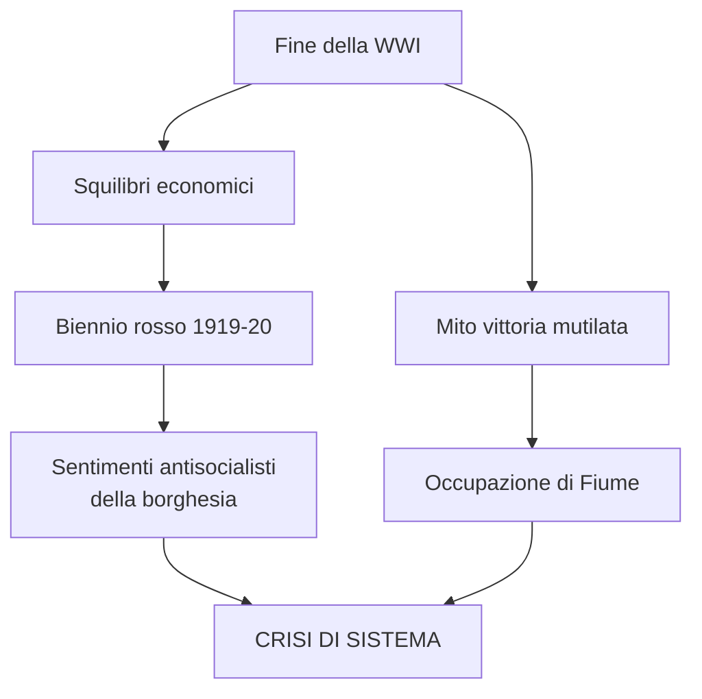
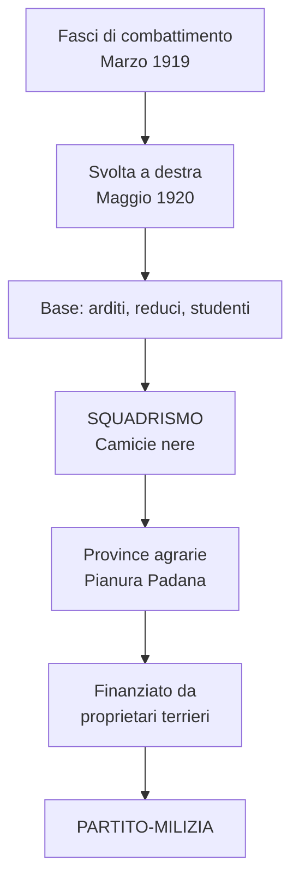
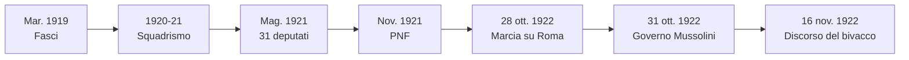
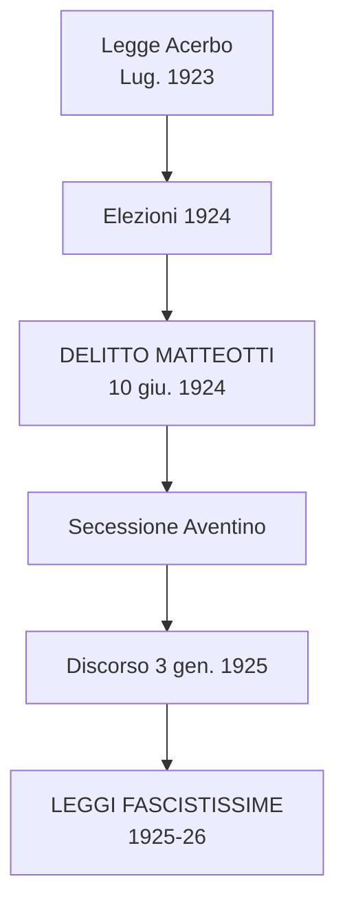
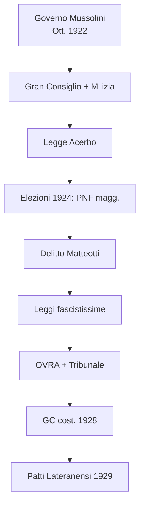
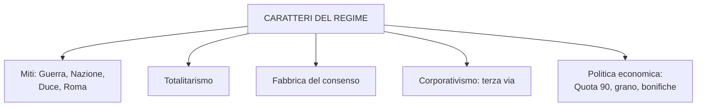
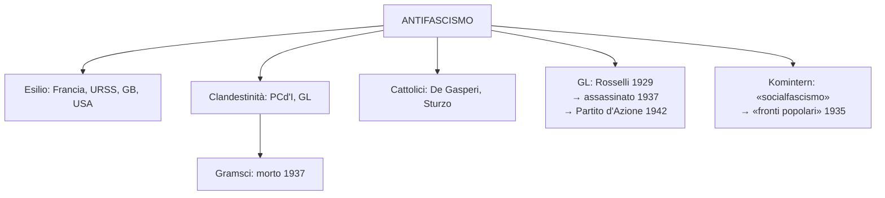
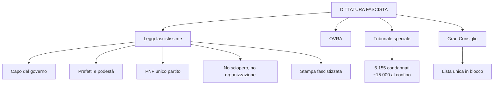

# Ripasso Veloce - Cap. 3.9: Il fascismo in Italia

---

## Date fondamentali

| Anno | Evento |
|------|--------|
| **Mar. 1919** | **Fasci di combattimento** fondati da Mussolini a Milano |
| **Set. 1919** | D'Annunzio occupa **Fiume** |
| **Nov. 1919** | Elezioni proporzionali: socialisti 156, popolari 100; sconfitta liberali (67,6% → 38,9%) |
| **Dic. 1920** | Sgombero di Fiume; **Trattato di Rapallo** |
| **Gen. 1921** | **PCd'I** fondato a Livorno (scissione PSI): Bordiga, Gramsci, Togliatti |
| **Mag. 1921** | Elezioni: **31 deputati fascisti** nelle liste di «blocco nazionale»; Giolitti si dimette |
| **Nov. 1921** | Fondazione del **PNF** a Roma; 200.000 iscritti nel 1922 |
| **28 ott. 1922** | **Marcia su Roma** → governo Mussolini (31 ottobre) |
| **16 nov. 1922** | **«Discorso del bivacco»**: fiducia (306-116) + pieni poteri per un anno |
| **Dic. 1922** | **Gran Consiglio del fascismo** |
| **Gen. 1923** | **Milizia volontaria**; fusione **PNF-ANI** (Rocco, Federzoni) |
| **Lug. 1923** | **Legge Acerbo** (25% → 2/3 dei seggi) |
| **Apr. 1924** | Elezioni: PNF = **275 seggi**, maggioranza assoluta |
| **10 giu. 1924** | **Delitto Matteotti** → **secessione dell'Aventino** |
| **3 gen. 1925** | Discorso di Mussolini: svolta dittatoriale |
| **1925-26** | **Leggi fascistissime**: regime a partito unico |
| **1926** | **OVRA**, **Tribunale speciale**, **pena di morte**; Gramsci arrestato |
| **1928** | Gran Consiglio = **organo costituzionale** |
| **11 feb. 1929** | **Patti Lateranensi** (Mussolini e card. Gasparri) |
| **1929** | **Giustizia e Libertà** (Rosselli, Parigi) |
| **1937** | Assassinio **Carlo e Nello Rosselli** |
| **1939** | Annessione dell'**Albania** |

---

## 1. La crisi del dopoguerra

### Squilibri economici e protesta sociale

- Italia esce dalla guerra in **condizioni critiche**: crescita abnorme di siderurgia/metallurgia, forte indebitamento verso GB e USA
- **Inflazione e Bilancia dei Pagamenti**: inflazione (20%) colpisce redditi fissi; calo rimesse emigrati. Esempi moderni: **TIM, Eni, Enel** (attivi) vs **Amazon** (passivi).
- Necessità di **riconvertire l'apparato produttivo** in **recessione internazionale**
- **Turbolenze sociali** primavera-estate 1919: proteste per il **caroviveri**, **occupazioni di terre**, **scioperi** → **«biennio rosso»**
- Protesta **spontanea**, non organizzata politicamente, ma la borghesia paventò il bolscevismo → **sentimenti antisocialisti**

### Reduci, «vittoria mutilata» e Fiume

- **Reduci**: associazioni di ex combattenti e mutilati con proprie rivendicazioni
- **Mito della «vittoria mutilata»** (D'Annunzio): richiama la **Nike di Samotracia** (Louvre) — statua della vittoria alata ma **senza testa né braccia**: vittoria incompleta e ferita, proprio come la situazione italiana a Parigi.
- **Marcia su Fiume** (12 settembre 1919): D'Annunzio e 2000 legionari; **modello** per la marcia su Roma.
- Saldatura tra **lotta al bolscevismo** e **difesa della guerra**
- **Stato liberale inadeguato** ai tempi → **crisi di sistema**
- Giolitti sgombera Fiume (dic. 1920); **Trattato di Rapallo**: Italia ottiene litorale austriaco, Zara, isole; Fiume entità indipendente

### Partiti di massa e elezioni 1919

- **PSI**: 100.000 iscritti; **PPI** (Sturzo, gen. 1919): **aconfessionale** («partito di cattolici, non cattolico»), **interclassista**; **250.000 iscritti** (metà 1920)
- Entrambi chiedono il **sistema proporzionale** per superare i collegi uninominali dei liberali
- Elezioni nov. 1919: **PSI 156 seggi**, **PPI 100**; liberali frammentati in 25+ liste; sconfitta netta

### Biennio rosso italiano

- Speranze rivoluzionarie ispirate dalla Russia, ma dirigenza socialista → **massimalismo generico** senza sbocchi concreti
- **Esempi pratici lotta di classe**: se braccianti scioperano, il **grano marcisce** e le **vacche muoiono** (infezioni mammelle).
- **Sciopero agrario** nel bolognese (tutta l'estate, capitolazione dei proprietari)
- **Occupazione delle fabbriche** (settembre 1920): «**triangolo industriale**» Torino-Milano-Genova
- **Mediazione di Giolitti** risolve la crisi; ondata rossa rifluisce
- Ma l'**età giolittiana è finita** con la guerra
- **PSI e la "patata bollente"**: vincono le elezioni del '19 ma rifiutano di governare ("aspettiamo la rivoluzione") + politica antipatriottica = autogol in un paese appena uscito da una guerra vittoriosa
- **"Nottola di Minerva"**: noi *a posteriori* vediamo che il biennio rosso stava rifluendo; chi viveva quei mesi *percepiva* l'Italia sull'orlo della rivoluzione → da questa distanza nasce il consenso al fascismo

---

## 2. La violenta ascesa del fascismo (1919-22)

### Il primo fascismo

- **Fasci di combattimento** (Milano, mar. 1919): programma di sinistra, anticlericale, repubblicano, antiparlamentare
- Esordio elettorale **fallimentare** (1919): poche migliaia di voti
- **Svolta a destra** (congresso maggio 1920): difesa delle borghesie produttive e dei ceti medi
- **Radici nel socialismo**: quasi tutti i fascisti della prima ora erano socialisti interventisti espulsi dal PSI nel '14. Il 1919-20 è un **regolamento di conti**: i neutralisti (rimasti nel partito) vogliono la rivincita sulla guerra; gli interventisti espulsi si ritrovano dall'altra parte con la camicia nera. Una famiglia che si spezza.
- **1919-20**: il vero leader del nazionalismo italiano è **D'Annunzio** (impresa di Fiume), non Mussolini
- **Repubblica Sociale Italiana (1943)**: quando Mussolini fonderà lo stato fantoccio nel nord occupato dai tedeschi, si appellerà a un «ritorno al fascismo delle origini» — repubblicano e socialista

### Squadrismo: prodotto della guerra

- Base: ex **arditi**, reduci giovani, studenti → **squadre paramilitari** (**«camicie nere»**)
- **Uso sistematico della violenza**: il fascismo come **partito-milizia** (la violenza era un tratto qualificante, non accidentale)
- Azione soprattutto nelle province agrarie della **Pianura Padana**, finanziata da **grandi e medi proprietari terrieri**
- **«Fascismo agrario»** ≠ fascismo dei contadini: è il fascismo degli **agrari** (grandi proprietari). I **braccianti** (lavoratori delle terre altrui) erano i protagonisti delle occupazioni. Se scioperavano durante la mietitura o la vendemmia → il proprietario perdeva il raccolto → si rivolgeva alle squadre fasciste per reprimere con manganello e olio di ricino
- Conflitto tra movimento socialista (leghe, cooperative, amministrazioni) e proprietari

### Violenza dilagante (1920-21)

- Squadrismo a macchia d'olio: Emilia, Puglia, Lombardia, Toscana, Polesine, Marche, Umbria
- Capi locali detti **Ras** (termine etiope per "capo tribù", dalla tradizione coloniale italiana): Balbo a Ferrara, Grandi a Bologna, Farinacci a Cremona
- **Marcia su Ravenna (1921)**: per il 6° centenario della morte di Dante (corona fusa con **cannoni austriaci** di Vittorio Veneto); sosta a **Lugo** per omaggio a **Francesco Baracca** (asso dell'aviazione, 34 abbattimenti).
- 1° semestre 1921: distrutte **119 Camere del lavoro**, 107 cooperative, 83 leghe, ~200 sedi associative
- Mar.-mag. 1921: **340 morti** (195 socialisti/comunisti, 64 fascisti, 24 forze dell'ordine, 57 estranei), ~1400 feriti
- Roccaforti: Bologna, Ferrara, Cremona, Firenze, Siena
- **Consenso come "diga"**: la gente comune, spaventata dai "rossi" e dallo Stato impotente, vede le squadre fasciste come gli unici capaci di fare ordine → fonte di consenso sociale trasformato poi in consenso politico

### Scissione socialista: nasce il PCd'I (Livorno, gen. 1921)

- Scissione PSI sulla questione dell'**adesione al Komintern**
- Confluiscono: sostenitori di **Bordiga**, giovani di **«Ordine Nuovo»** (**Gramsci**, **Togliatti**)
- Indebolimento del fronte antifascista

### Connivenza dello Stato e legittimazione

- Polizia, esercito, magistratura **conniventi** con lo squadrismo
- Giolitti include i fascisti nelle liste di **«blocco nazionale»** (elezioni mag. 1921)
- Risultato: **31 deputati fascisti** eletti (tra cui Mussolini); **legittimazione politica**
- PSI primo partito (123 seggi), PPI secondo (108); Giolitti si dimette

### Sottovalutazione e paralisi

- Governi **Bonomi** e **Facta**: privi di autorevolezza
- PSI diviso (ott. 1922: nasce il **PSU** di Turati e Matteotti); PPI diviso; liberali sottovalutano
- **Paralisi del sistema politico**: nessuna alleanza anti-fascista possibile

### Dal PNF alla marcia su Roma

- **Patto di pacificazione** con i socialisti (ago. 1921): di fatto disatteso; tensioni Mussolini vs. **ras** (Grandi a Bologna, Balbo a Ferrara, Farinacci a Cremona)
- Gobetti definì Mussolini **"domatore nella gabbia delle tigri"**: riuscì a domare ras, socialisti, liberali — riconosciuto persino dagli avversari con riluttante ammirazione
- **PNF** fondato a Roma (nov. 1921): **partito di massa** attorno al Duce; milizie inquadrate; **200.000 iscritti** nel 1922
- **28 ottobre 1922**: dopo insurrezione in città del centro-nord, **marcia su Roma**
- Re **rifiuta lo stato d'assedio** (proposto da Facta); Mussolini riceve incarico
- **31 ottobre**: governo di coalizione (liberali, popolari, nazionalisti); compimento di un'**eversione** che dal 1919 causò circa **3000 morti**
- **"Rivoluzione ibrida"**: per Balbo era rivoluzione vera; per Mussolini un bluff gestito con abilità. Mussolini stava a Milano pronto a scappare in Svizzera, poi arrivò a Roma in treno in doppiopetto — non in camicia nera
- **Discorso del bivacco** (16 nov. 1922): "Potevo fare di quest'aula sorda e grigia un **bivacco di manipoli**; potevo sprangare il Parlamento. **Potevo: ma non ho almeno in questo primo tempo voluto**."

---

## 3. La nascita di un nuovo regime (1922-29)

### Consolidamento del potere

- Violenze continuano: rappresaglia Torino (dic. 1922, 20+ morti); omicidio **don Minzoni** (Argenta, ago. 1923)
- **Fusione PNF-ANI** (mar. 1923): ~1500 sezioni, ~25.000 camicie azzurre; personalità: **Rocco** e **Federzoni**
- **Gran Consiglio** (dic. 1922): organo supremo del partito, funzioni di indirizzo governativo
- **Milizia volontaria** (gen. 1923): squadre inquadrate come corpo di polizia dipendente dal PdC
- PNF era un **amalgama di realtà locali**: centralizzazione necessaria contro le **spinte centrifughe** dei ras

### Legge Acerbo e elezioni 1924

- **Legge Acerbo** (lug. 1923): **unico collegio nazionale**, lista che supera il 25% prende i 2/3 dei seggi; approvata dai liberali = loro **capitolazione**
- Duplice strategia vs. PPI: violenza + aperture alla Santa Sede (Banco di Roma, riforma Gentile); **Mussolini promette di chiudere la Questione Romana** → il Vaticano allontana Sturzo dalla guida del PPI → a De Gasperi
- **Elezioni apr. 1924**: Lista nazionale = 374 seggi su 535; PNF = **275 seggi** = **maggioranza assoluta** (il meccanismo Acerbo non scatta nemmeno: prendono già il 65% da soli)
- Progetto giolittiano **capovolto**: liberali inglobati nel fascismo

### Delitto Matteotti e svolta dittatoriale

- **Matteotti** (segretario PSU) denuncia violenze e manipolazioni → **sequestrato e ucciso** (10 giu. 1924) da squadristi legati ai collaboratori di Mussolini
- Dinamica: rapito fuori casa, **pestato a morte in macchina** perché non si quietava; per due mesi solo "rapimento"; a metà agosto trovato nella **pineta di Ostia** grazie a informatore della polizia
- **Secessione dell'Aventino**: opposizione abbandona i lavori parlamentari (tranne comunisti) → grave crisi; Mussolini quasi travolto
- **Discorso 3 gennaio 1925**: Mussolini assume piena «responsabilità politica, morale, storica»
- Ondata di violenza con cooperazione della polizia: **Amendola** e **Gobetti** aggrediti (muoiono nel 1926 in esilio)

- **Manifesto intellettuali antifascisti** (Croce, mag. 1925) vs. *Manifesto* fascista (Gentile, apr. 1925)
- **Salvemini**: rivista clandestina «Non mollare»

### Leggi fascistissime (1925-26)

- Elaborate da **Rocco** (Grazia e Giustizia) e **Federzoni** (Interno): **regime a partito unico**
- **Capo del governo** (sostituisce PdC): nomina ministri, propone leggi, risponde solo al re
- **Prefetti** con poteri accresciuti; **podestà** (nomina governativa) al posto dei sindaci
- **Abolita** libertà di organizzazione: PNF unico partito legale
- **Abolito** diritto di sciopero; monopolio sindacale fascista
  - Ricordare la parabola: **Codice Zanardelli (1889)** abolisce il *reato* di sciopero → **1926** lo reintroduce (passo indietro di ~40 anni)
- **Stampa fascistizzata**: solo giornalisti PNF; deputati opposizione **decaduti** (Gramsci arrestato 1926)
  - Caso emblematico: **Luigi Albertini** costretto ad abbandonare direzione e proprietà del **Corriere della Sera** (1876, il più importante quotidiano italiano) nel 1925

### Repressione

- **OVRA** (polizia politica): controlla antifascisti e fascisti
- **Tribunale speciale**: 9 condanne a morte eseguite; 5.155 detenuti
- **Confino** (1926-43): ~**15.000** italiani in residenza obbligata (Lussu: «capolavoro del regime»)

### Gran Consiglio e compenetrazione Stato-partito

- **1928**: Gran Consiglio = **organo costituzionale**; nuovo sistema elettorale: **lista unica** scelta dal GC, elettori approvano **in blocco**
- **1929**: PNF alle **dipendenze del capo del governo** → densa compenetrazione Stato-partito

### Patti Lateranensi (11 feb. 1929)

- Cattolici divisi: clerico-fascisti vs. antifascisti vs. prudenti; **Azione Cattolica** diffidava del fascismo
- **Pio XI** sceglie di non opporsi per risolvere la «**questione romana**»; per Mussolini = **legittimazione**
- **Nota**: già nel 1919 Orlando voleva chiuderla — il re Vittorio Emanuele III rifiutò. Dieci anni dopo cedette a Mussolini (altra prova dei comportamenti del re favorevoli al fascismo)
- **Patti Lateranensi** (Mussolini e card. **Gasparri**): **Trattato** (riconoscimento reciproco, Stato Vaticano = 0,44 km²), **Concordato**, **Convenzione finanziaria**
- **Dualismo conflittuale**: crisi 1931 (offensiva vs. Azione Cattolica, 1 milione di iscritti); enciclica *Non abbiamo bisogno*; compromesso a settembre
- **Scout**: Pio XI li sciolse autonomamente prima che lo facesse il regime → concessione tattica per mantenere libertà di tutte le altre organizzazioni cattoliche → da lì verranno fuori molti antifascisti degli anni '40

---

## 4. I caratteri del regime: l'ambizione totalitaria

### Miti fondativi

- **Guerra**: codice genetico del fascismo; partito-milizia di massa; violenza e spirito guerresco = connotati **costitutivi**
- **Nazione**: costruzione identitaria per mobilitazione delle masse; "non l'Italia di Giolitti — l'Italia del Piave, del Carso, di Vittorio Veneto"
- **Duce**: capo carismatico (Weber: autorità da poteri straordinari riconosciuti)
- **Romanità**: potenza dello Stato; **fascio littorio** = simbolo principe (insieme di bastoni+scure del littore romano); non nostalgia ma programma di futuro
  - Curiosità: il fascio littorio è **ancora oggi un simbolo della Repubblica Francese** (adottato dalla Rivoluzione del 1789, prima del fascismo)

### Totalitarismo

- «Tutto è nello Stato»: **dominio politico assoluto** dello Stato
- Voce "Fascismo" dell'*Enciclopedia Italiana* (1932): firmata da Mussolini ma scritta da **Gentile** → applicazione dello **Stato etico hegeliano**
- La **Treccani** nasce in questi anni: impresa culturale fascista diretta da Gentile, finanziata dal conte Giovanni Treccani
- Termine coniato in ambiente **antifascista**; riconducibile alla «cultura di guerra» (mobilitazione totale della società)
- Elementi: partito unico, mobilitazione organizzata, propaganda (radio + cinema), repressione pianificata, violenza sistematica, trasformazione antropologica «dall'alto»
- Fascismo univa **modernizzazione e tradizionalismo** (**ruralismo**)

### Fabbrica del consenso e culto del Duce

- Inquadramento, educazione, manipolazione tramite partito e organizzazioni collaterali
- **Minculpop** (Ministero della Cultura popolare, 1937): regia della propaganda
- **Radio** (anni '30, edifici pubblici, osterie): discorsi di Mussolini
  - 1926-27: **EIAR** (Ente Italiano Audizioni Radiofoniche), antenata della RAI; prima: Unione Radiofonica Italiana
- **Cinema**: cinegiornali **LUCE** (L'Unione Cinematografica Educativa) obbligatori prima di ogni proiezione
- **Stampa** controllata; pubblicazioni settoriali (donne, bambini, fasce d'età)
- **Organizzazioni giovanili** (prima Opera Nazionale Balilla, poi **GIL** - Gioventù Italiana del Littorio):
  - **Figli della Lupa** (6-8 anni) → **Balilla** (8-14; dal ragazzo genovese della rivolta anti-austriaca del 1748) → **Avanguardisti** (14-17)
  - Dopo i 18: **Opera Nazionale Dopolavoro** (lavoratori) / **GUF** (universitari)

- **«Religione politica»**: fascismo, comunismo, nazismo come religioni secolarizzate — al centro non una divinità ma la **nazione**; Mussolini = **«demiurgo politico»**; riti: adunanze, culto bandiera, giuramenti, martiri. Differenza con Germania/URSS: in Italia Mussolini **cedette sull'educazione giovanile** (condivisa con la Chiesa)
- Riti: **adunanze di massa**, culto bandiera, «**presente!**» ai martiri fascisti
- Duce: rapporto diretto con le masse (primo a visitare tutte le regioni); abilità oratoria (eredità D'Annunzio); motto «**credere, obbedire, combattere**»

### Partito e Stato

- PNF: da **299.876** iscritti (1922) a **1.057.118** (1930); epurazione 1926 (~150.000 colpiti)
- **Struttura gerarchica**: **gerarchi** nominati da Mussolini; ultimo congresso: 1925
- **Non totale sovrapposizione** Stato-partito: l'esercito restò sempre autonomo
- Gen. 1927: Mussolini ribadisce **preminenza dello Stato** (prefetti > federali)
- **Compromesso** con monarchia, esercito, burocrazia (non fascistizzate del tutto)
- Mussolini = **arbitro del regime**: regolatore dei conflitti Stato/partito, centro/periferia

### Corporativismo

- Lavoratori e imprenditori nello stesso sindacato → eliminare lotta di classe (gerarchie immutate)
- Basi: corporazioni medievali + **interclassismo** cattolico → «**terza via**» tra capitalismo e socialismo
- **Patto di Palazzo Vidoni** (1925) → divieto sciopero + monopolio sindacale fascista (1926) → **Ministero Corporazioni** (1926) → **Carta del lavoro** (1927) → corporazioni solo nel **1934**
- Esperimento **incompleto e fallimentare**, ma architrave ideologico

### Politica economica

- **«Quota 90»** (1926): lira rivalutata a 90 lire/sterlina (da 153); sfavorisce export tessile, attrae **capitali esteri** → saldatura con grandi gruppi (Fiat, Montecatini, Ansaldo, Breda) → **chimica, metalmeccanica, elettricità**
  - Meccanismo: **stretta creditizia** → Banca d'Italia alza tassi → banche creano meno moneta (le banche creano moneta tramite i prestiti, non prestano moneta preesistente) → meno circolazione = lira più preziosa
  - Fragilità bancaria preesistente: **1921** fallisce la **Banca Italiana di Sconto** (aveva finanziato troppo l'**Ansaldo** di Genova) → banche già fragili → crisi del **1929** sarà devastante
- **«Battaglia del grano»**: autosufficienza cerealicola
- **Bonifiche**: impresa simbolo = **Agro Pontino** (Lazio); ma anche **pianura ferrarese** e nord provincia di **Ravenna** (Vezzola, Longastrino, Argenta) → opera simbolo: **canale di bonifica in Destra Reno** (ancora oggi funzionante)

---

## 5. L'antifascismo

### Forme di resistenza

- Dissenso diffuso: salvaguardia di spazi di **indipendenza culturale/etica**
- Antifascismo politico = resistenza + alternativa al regime + **cantiere di rinnovamento**
- Presupposto della **Resistenza** (post 8 settembre 1943)

### In esilio e in clandestinità

- Dopo legge **6 nov. 1926** (tutti i partiti sciolti): esilio o clandestinità
- **Francia** principale rifugio; anche URSS (dove non pochi vittime di repressioni staliniane), GB, USA
- Esuli principali: Togliatti, Di Vittorio, Longo (comunisti); Nenni (socialista max.); Turati, Saragat (riformisti); Buozzi (sindacalista); Salvemini, Nitti (liberal-democratici, dal 1924)
- **PCd'I**: attività clandestina più efficace in Italia (~**10.000 militanti** fino al 1932, poi smantellato)
- **Gramsci**: condannato a 20 anni (1928), **morto 1937** per conseguenze del carcere

### Giustizia e Libertà

- Riferimento ideale: **Gobetti** e **Salvemini** (critica dell'Italia liberale, Paese da rigenerare)
- **GL** fondata da **Carlo Rosselli** a Parigi (**1929**), evaso dal confino
- Gruppi clandestini in Italia (torinese: **Ginzburg**, **Foa**)
- Retate 1934-35 → attività in Italia cessa; Rosselli organizza brigata nella **guerra civile spagnola** (1936)
- **Giugno 1937**: Mussolini ordina assassinio di **Carlo e Nello Rosselli** (Normandia)
- Eredità → **Partito d'Azione** (1942)

### Antifascismo cattolico

- Margini limitati dalla conciliazione 1929
- **De Gasperi**: Biblioteca Vaticana dopo carcere (1927-28)
- **Sturzo**: esilio a Londra dal 1924, attività pubblicistica antifascista

### Ipoteca di Mosca

- **Komintern** condiziona l'antifascismo: Togliatti a Mosca, linea dettata da interessi URSS
- Fino ai primi '30: no collaborazione con «borghesi» → riformisti = **«socialfascisti»** → indebolimento fatale
- **1935** (VII congresso): svolta verso i **«fronti popolari»** dopo l'avvento di Hitler

---

## 6. L'Italia fascista nel mondo

### Modello per le dittature europee

- Fascismo = **modello** per destre rivoluzionarie e reazionarie: **Spagna** (Primo de Rivera 1923-30, Franco dal 1939), **Portogallo** (Salazar dal 1932), **Germania** (Hitler), **Balcani** e Europa centro-orientale
- **Fascistizzazione delle comunità italiane all'estero** (Fasci italiani all'estero): propaganda

### Politica estera

- Ambiti: **Mediterraneo** (*«mare nostrum»*) + **Europa danubiano-balcanica**
- Mussolini principale artefice; ministri: **Grandi** (1929-32), **Ciano** (1936-43)
- **Trattato di Roma** (1924): Fiume all'Italia
- Penetrazione nei **Balcani** (1926-27); protettorato sull'**Albania** (con appoggio GB) → **annessa 1939**
- Fino a metà anni '30: linea **non eversiva** degli equilibri europei; alveo della politica liberale con maggiore protagonismo e pretesa revisionista (mito «vittoria mutilata»)

---

## Schema riepilogativo: i pilastri della dittatura

---

## Cronologia sintetica dell'ascesa

```mermaid
flowchart LR
    A["Mar. 1919<br/>Fasci"] --> B["1920-21<br/>Squadrismo"]
    B --> C["Mag. 1921<br/>31 deputati"]
    C --> D["Nov. 1921<br/>PNF"]
    D --> E["28 ott. 1922<br/>Marcia su Roma"]
    E --> E2["16 nov. 1922<br/>Disc. bivacco"]
    E2 --> F["1923<br/>Legge Acerbo"]
    F --> G["Giu. 1924<br/>Delitto Matteotti"]
    G --> H["3 gen. 1925<br/>Svolta dittatoriale"]
    H --> I["1925-26<br/>Leggi fascistissime"]
    I --> J["1928<br/>GC cost."]
    J --> K["1929<br/>Patti Lateranensi"]
```

