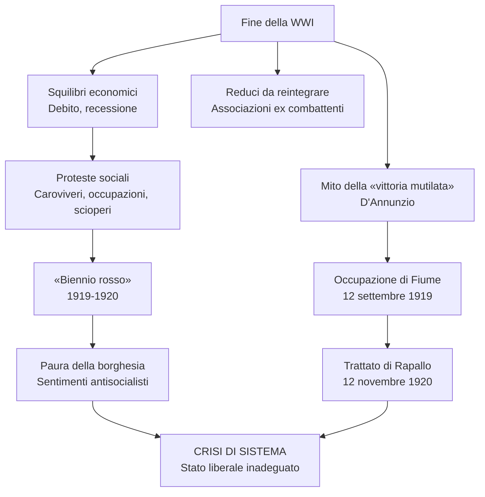
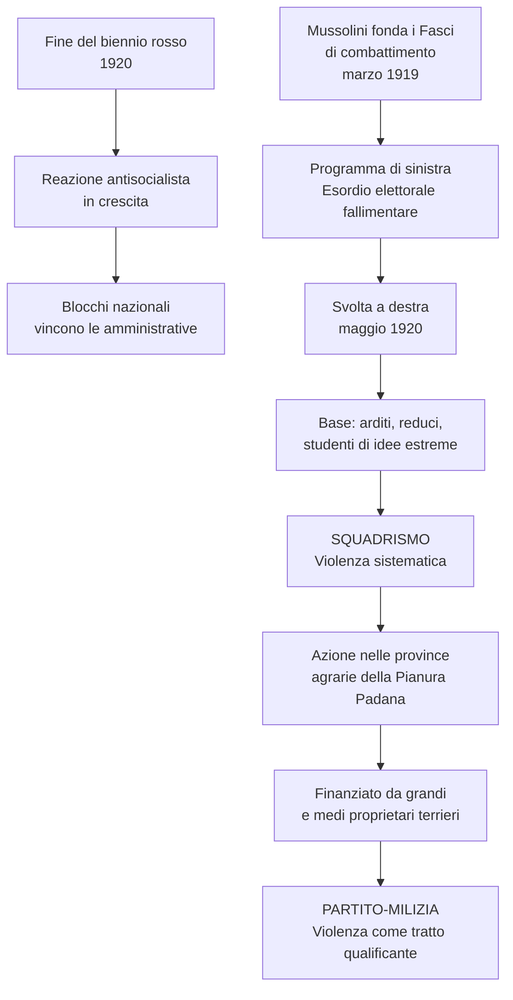
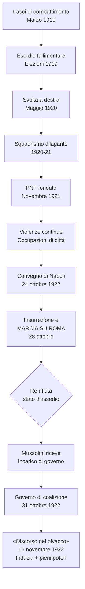
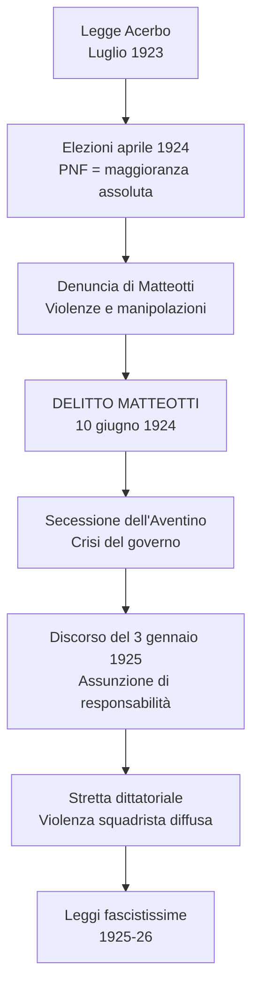
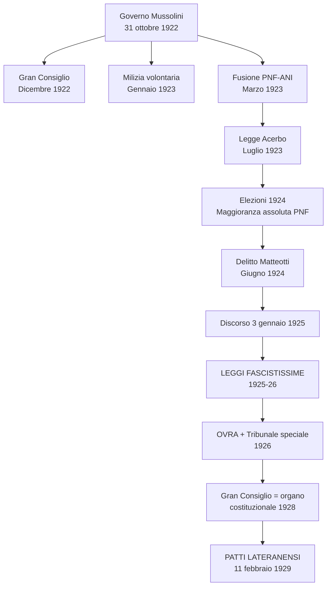
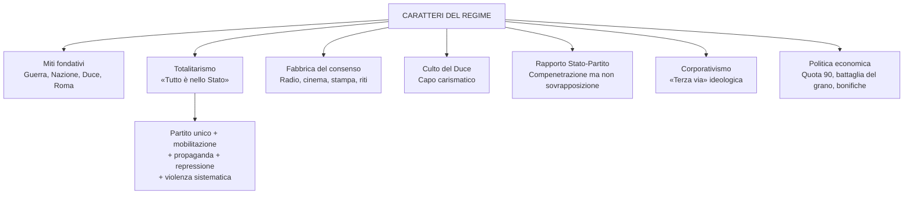
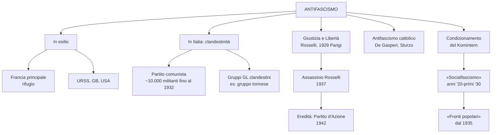
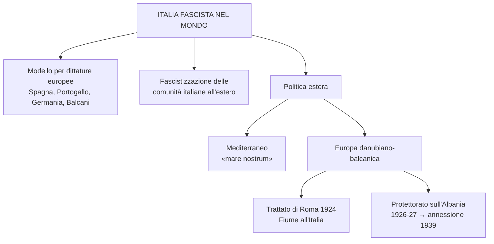
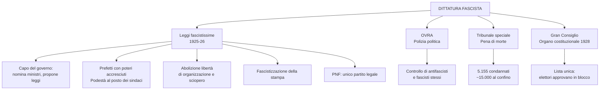

# Schema di Studio - Capitolo 3.9: Il fascismo in Italia

---

## Date fondamentali del capitolo

| Anno / Data | Evento |
|-------------|--------|
| **Marzo 1919** | Mussolini fonda a Milano i **Fasci di combattimento** (programma «di San Sepolcro») |
| **Settembre 1919** | D'Annunzio occupa **Fiume** e ne proclama l'annessione |
| **Novembre 1919** | Elezioni con sistema proporzionale: vittoria di **socialisti** (156 seggi) e **popolari** (100 seggi); sconfitta della classe dirigente liberale |
| **Dicembre 1920** | Giolitti fa sgomberare Fiume con la forza; **Trattato di Rapallo** (12 novembre 1920) |
| **Gennaio 1921** | Fondazione del **Partito comunista d'Italia** a Livorno (scissione dal PSI) |
| **Maggio 1921** | Elezioni: fascisti eletti nelle liste di «blocco nazionale» (**31 deputati**, tra cui Mussolini) |
| **Novembre 1921** | Fondazione del **Partito nazionale fascista (PNF)** al congresso di Roma |
| **Ottobre 1922** | Nascita del **Partito socialista unitario** (Turati, Matteotti); **Marcia su Roma** (28 ottobre); governo di coalizione presieduto da **Mussolini** (31 ottobre) |
| **16 novembre 1922** | **«Discorso del bivacco»** di Mussolini alla Camera: «potevo fare di quest'aula sorda e grigia un bivacco di manipoli»; fiducia con 306 voti a favore e pieni poteri per un anno |
| **Dicembre 1922** | Istituzione del **Gran Consiglio del fascismo** |
| **Gennaio 1923** | Creazione della **Milizia volontaria per la sicurezza nazionale**; fusione PNF-ANI |
| **Luglio 1923** | Approvazione della **legge Acerbo** (premio di maggioranza) |
| **Aprile 1924** | Elezioni: la Lista nazionale di Mussolini ottiene ~2/3 dei voti; PNF conquista **275 seggi** (maggioranza assoluta) |
| **10 giugno 1924** | Sequestro e assassinio di **Giacomo Matteotti**; **secessione dell'Aventino** |
| **3 gennaio 1925** | Discorso di Mussolini alla Camera: piena assunzione di responsabilità, svolta dittatoriale |
| **1925-26** | Promulgazione delle **«leggi fascistissime»**: regime a partito unico, abolizione delle libertà |
| **1926** | Istituzione dell'**OVRA** (polizia politica) e del **Tribunale speciale**; reintroduzione della **pena di morte** |
| **1928** | Nuovo sistema elettorale: lista unica scelta dal Gran Consiglio; il Gran Consiglio diventa **organo costituzionale** |
| **11 febbraio 1929** | Firma dei **Patti Lateranensi**: conciliazione tra Stato e Chiesa |
| **1929** | Carlo Rosselli fonda **Giustizia e Libertà** a Parigi; PNF messo alle dipendenze del capo del governo |
| **1931** | Crisi tra regime e Azione Cattolica; enciclica *Non abbiamo bisogno* di Pio XI |
| **1934** | Istituzione delle **corporazioni** |
| **1937** | Assassinio di **Carlo e Nello Rosselli** in Normandia per ordine di Mussolini |
| **1939** | Annessione dell'**Albania** al Regno d'Italia |

---

## 1. La crisi del dopoguerra

### 1.1 Gli squilibri economici e la protesta sociale

L'Italia uscì dalla Prima guerra mondiale in **condizioni critiche**. L'economia presentava notevoli squilibri dovuti alla crescita abnorme di alcuni settori industriali — soprattutto **siderurgico e metallurgico** — sviluppatisi per le necessità belliche. Lo Stato si era fortemente indebitato, in particolare nei confronti di **Gran Bretagna e Stati Uniti**, per far fronte ai costi di materie prime e forniture. La **dipendenza dall'estero** e la **debolezza finanziaria** del Paese erano tanto più gravi in quanto si doveva **riconvertire l'apparato produttivo** in un momento di **recessione internazionale**.

Da questa situazione derivarono **forti turbolenze sociali**. Nella primavera-estate del 1919 si registrò in tutta Italia una serie di **agitazioni**, espressione di un diffuso malcontento delle classi popolari:

- Proteste per il **caroviveri** (aumento dei prezzi dei prodotti di prima necessità dovuto all'inflazione)
- **Scarsità generale di approvvigionamenti**
- Nelle aree rurali, numerose **occupazioni di terre** (promesse dal governo durante il conflitto ma mai ridistribuite)
- **Scioperi** diffusi in tutto il Paese

L'Italia entrava nel suo **«biennio rosso»**. Sebbene la protesta fosse **spontanea** e nata da bisogni immediati — non da una mobilitazione politica organizzata — la borghesia italiana, già colpita dall'inflazione e vicina al declassamento, paventò un'affermazione bolscevica e accrebbe i propri **sentimenti antisocialisti**.

### 1.2 I lasciti della guerra: reduci e «vittoria mutilata»

Ai disagi economici si aggiungevano quelli della reintegrazione di un gran numero di **reduci**, che si organizzarono come gruppo sociale autonomo creando **associazioni di ex combattenti e di mutilati** per portare avanti le proprie rivendicazioni (riconoscimenti pubblici, risarcimenti).

L'esito della **Conferenza di Parigi** fu ritenuto uno smacco diplomatico: gli ambienti nazionalisti fomentarono nell'opinione pubblica il sentimento di un'umiliazione subita, nonostante la vittoria in guerra. Su questo terreno sorse il **mito della «vittoria mutilata»**, espressione coniata da **Gabriele D'Annunzio**: fu una delle armi più efficaci della **destra nazionalista** per radicalizzare lo scontro politico in un persistente clima di mobilitazione. I socialisti, gli interventisti democratici e la classe dirigente liberale venivano additati come responsabili della politica delle «rinunzie».

> [!note] Dalla lezione
> D'Annunzio non scelse l'espressione "vittoria mutilata" a caso: stava richiamando la **Nike di Samotracia**, la celebre statua alata conservata al Louvre che non ha né la testa né le braccia. Una "vittoria" dunque — proprio come la Nike, dea della vittoria — ma mutilata, incompleta. È una di quelle immagini in cui si vede bene la grandezza retorica di D'Annunzio: in due parole fonde arte classica, umiliazione nazionale e indignazione. L'immagine funzionò alla perfezione sulla piazza italiana.

Soprattutto, gli ambienti conservatori e della destra radicale saldarono **lotta al bolscevismo e difesa della guerra**: due temi che si rinforzarono reciprocamente.

### 1.3 Una crisi di sistema: la marcia su Fiume

La classe dirigente liberale alla Conferenza di Parigi aveva mostrato di **non sapersi misurare** con i nuovi equilibri internazionali. Era un altro elemento di una **crisi di sistema**: lo **Stato liberale** era ormai **inadeguato ai tempi**.

Le forze armate sostennero l'**occupazione di Fiume** promossa da D'Annunzio, che proclamò l'**annessione il 12 settembre 1919**. Il governo Nitti si oppose al colpo di mano. Nel **dicembre 1920**, il governo Giolitti fece sgomberare Fiume con la forza, dopo aver raggiunto un'intesa con il Regno dei serbi, croati e sloveni sulla demarcazione delle frontiere: il **Trattato di Rapallo** (12 novembre 1920).

Con il Trattato, l'Italia otteneva:
- Quasi l'intero **litorale austriaco** e parti di **Carinzia** (Tarvisio) e **Carniola** (Postumia)
- **Zara** e le isole di Lagosta, Pelagosa, Lussino e Cherso
- **Fiume** diventava **entità indipendente**

L'impresa fiumana, pur essendo una sedizione militare limitata, rappresentò una **rottura del monopolio dell'uso legittimo della forza** detenuto dallo Stato. Fiume divenne il simbolo di una nazione «nuova» — l'Italia rigenerata dalla guerra — e della lotta del nuovo contro il vecchio.

> Il futurista Mario Carli, partecipante all'occupazione di Fiume, restituisce il clima di esaltazione collettiva dell'esperienza: cortei tra il soldatesco, il goliardico e il carnevalesco, guidati da futuristi e arditi. Secondo la storica dell'arte Claudia Salaris, l'esperienza fiumana fu un «gesto artistico rivoluzionario» destinato a destabilizzare ogni norma e convenzione, politica e di costume.

### 1.4 La crescita dei partiti di massa e le sue conseguenze

L'accelerazione impressa dalla guerra ai processi di modernizzazione ebbe ricadute sul **sistema politico liberale**. L'inasprimento della conflittualità sociale, la nuova vitalità del movimento contadino e l'aumento della classe operaia rafforzavano il ruolo del **Partito socialista**, che aveva raggiunto i **100.000 iscritti**.

Nel **gennaio 1919** sorse un nuovo partito di massa: il **Partito popolare italiano (PPI)**, fondato da **Luigi Sturzo**, un prete siciliano che sosteneva la partecipazione attiva dei cattolici nella vita politica. Il partito portava a compimento il travagliato itinerario di **partecipazione dei cattolici alla vita politica nazionale**, favorito dalla guerra che aveva generato un sentimento di lealismo verso lo Stato.

Caratteristiche del PPI:
- **Aconfessionale**: partito di cattolici ma non partito cattolico
- Fondazione **autonoma dalla gerarchia ecclesiastica**
- Profilo **solidarista e interclassista**, con ispirazione sociale e democratica
- Radicamento capillare: sindacati bianchi, leghe contadine, circoli, cooperative, casse rurali
- A metà del 1920 raggiunse più di **250.000 iscritti**

Come forza politica autonoma, il mondo cattolico non costituiva più un bacino di voti per i liberali. Socialisti e popolari chiedevano con forza l'introduzione del **sistema proporzionale a scrutinio di lista**: l'obiettivo era **superare il sistema elettorale basato sui collegi uninominali**, dove i meccanismi clientelari dei liberali potevano prevalere.

> [!note] Dalla lezione
> Il Partito Popolare era una novità radicale proprio perché era **interclassista**. Il partito liberale era il partito della classe dirigente borghese — nei circoli liberali non si trovavano operai. Il PSI era il partito dei lavoratori, fondato sulla lotta di classe. Il PPI aveva invece l'ambizione di stare al di sopra di queste divisioni: poteva votarlo sia il proprietario terriero che il bracciante. Sturzo poi aveva insistito molto sull'essere un partito **aconfessionale**: non occorreva dichiararsi cattolici per iscriversi, bisognava semplicemente condividere quel programma. Era un "partito di cattolici", non un "partito cattolico".

### 1.5 Il sistema proporzionale e le elezioni del 1919

Il Parlamento approvò una nuova legge elettorale proporzionale per le **elezioni del novembre 1919**. I risultati furono un **terremoto politico**:

| Forza politica | Seggi |
|----------------|-------|
| **Partito Socialista Italiano** | **156** |
| **Partito Popolare Italiano** | **100** |
| Liberali, Democratici, Radicali | 96 |
| Partito Democratico | 60 |
| Partito Liberale | 41 |
| Partito dei Combattenti | 20 |
| Partito Radicale | 12 |
| Altri | 23 |

La **sconfitta della classe dirigente liberale** fu inequivocabile: dal 1913 i consensi erano calati dal **67,6% al 38,9%**. I gruppi liberali, frammentati in più di venticinque liste, ottennero circa 200 seggi, ma i veri vincitori furono i **due partiti di massa**: socialisti e popolari.

### 1.6 Il «biennio rosso» italiano

Alla fine del 1919 l'Italia entrò nella fase più acuta del «biennio rosso». Le vicende della Russia bolscevica avevano suscitato **speranze rivoluzionarie** nelle masse popolari. Tuttavia la dirigenza socialista si limitava a un **massimalismo generico**, senza prospettive concrete.

> [!note] Dalla lezione
> Il PSI era primo partito nelle elezioni del '19 ma non voleva governare. Lo spiegava chiaramente la leadership massimalista: "noi partecipiamo alle elezioni così, per sport, ma vogliamo la rivoluzione". A questo però si aggiungeva un secondo elemento, più prosaico: **la patata era bollente**. Governare l'Italia nel 1919 era un casino — la marcia su Fiume, l'umiliazione del trattato di pace, le turbolenze sociali, la crisi economica. Quindi i socialisti si chiamavano fuori: "tanto arriverà la rivoluzione che spazza tutti". Era insieme radicalismo rivoluzionario e deresponsabilizzazione. E in un paese appena uscito da una guerra vittoriosa, si misero anche a sputare sulla bandiera, ad attaccare fisicamente reduci che passavano per strada con le medaglie. Un autogol clamoroso.

I momenti culminanti furono:
- Lo **sciopero agrario** nel bolognese (durò tutta l'estate, si concluse con la capitolazione dei proprietari)
- L'**occupazione delle fabbriche** nel **settembre 1920**, con epicentro nel **«triangolo industriale»** Torino-Milano-Genova

Le occupazioni delle fabbriche furono il risultato di una prova di forza tra organizzazioni operaie e associazioni industriali. La situazione si risolse grazie alla **mediazione di Giolitti** (che aveva adottato una linea di neutralità): gli industriali riconobbero le richieste sindacali, mentre l'«ondata rossa» cominciò a rifluire in modo quasi «naturale».

Quando a novembre Giolitti risolse anche la crisi di Fiume, parve che la situazione si stabilizzasse. In realtà, le circostanze erano profondamente mutate: l'**età giolittiana era finita con la guerra**.

---

## 2. La violenta ascesa del fascismo: da Milano a Roma (1919-22)

### 2.1 La reazione antisocialista e il primo fascismo

Alla fine del 1920, mentre si esauriva la spinta rivoluzionaria, cresceva la **reazione antisocialista**. Segnale significativo: alle elezioni amministrative avevano prevalso i «blocchi nazionali» (centro-destra) tranne che a Milano e Bologna.

In questo quadro si collocò l'ascesa di un nuovo gruppo politico: i **Fasci di combattimento**, fondati da **Benito Mussolini** a Milano nel **marzo 1919**.

| Aspetto | Caratteristica |
|---------|---------------|
| **Fondatore** | Benito Mussolini, ex leader socialista passato all'interventismo |
| **Programma** | Detto «di San Sepolcro»: parole d'ordine di sinistra, anticlericale e repubblicano |
| **Riforme proposte** | Istituzionali, sociali, economiche radicali |
| **Metodo** | Antiparlamentare, incline all'**azione di piazza** e alla violenza |
| **Esordio elettorale (1919)** | Fallimentare: unica lista a Milano, poche migliaia di voti |
| **Svolta (maggio 1920)** | Congresso milanese: linea politica **orientata verso destra**, difesa degli interessi delle borghesie produttive e dei ceti medi |

> [!note] Dalla lezione
> Tra il 1919 e il 1920 il vero leader del nazionalismo italiano non era Mussolini, ma **D'Annunzio**. Mussolini nel 1919 aveva fondato un minuscolo partitino e alle elezioni di quell'anno non ottenne alcun risultato. Era D'Annunzio, con l'impresa di Fiume, a incarnare il nazionalismo radicale. Mussolini avrebbe fatto la sua scalata solo a partire dal 1920-21 con lo squadrismo.

> [!note] Dalla lezione — Il fascismo delle origini e la RSI
> Il fascismo delle origini era composto in larga parte da **ex socialisti interventisti** — socialisti rivoluzionari che avevano voluto la guerra e per questo erano stati espulsi dal PSI nel 1914-15. Mussolini stesso era stato socialista, direttore dell'*Avanti!*. Quando nel 1919 fondò i Fasci di combattimento, volle radunare questi ex socialisti interventisti «dal dente avvelenato» verso i compagni che li avevano cacciati. Ecco perché il primo fascismo aveva un programma repubblicano e con forti venature sociali — non era ancora il fascismo conservatore e reazionario che diventò poi. Significativo: nel **1943**, quando Mussolini fondò la **Repubblica Sociale Italiana** (lo Stato fantoccio nel nord occupato dai tedeschi), si appellò esplicitamente a un «ritorno al fascismo delle origini» — repubblicano e socialista.

### 2.2 Una nuova esperienza politica, figlia della guerra

Il fascismo era un'esperienza politica innovativa — un **nuovo modo di fare politica** — e soprattutto un **prodotto della guerra**.

> [!note] Dalla lezione
> C'è una chiave interpretativa fondamentale che aiuta a capire l'odio feroce tra fascisti e socialisti: è un **regolamento di conti**. Nel 1914-15, all'interno del grande movimento socialista, avevano vinto gli interventisti e i neutralisti avevano perso. Nel 1919-20 è come se quelli che avevano perso nel '15 — i socialisti rimasti nel partito — volessero prendersi la rivincita: sputando sulla guerra, sulla vittoria, attaccando chi aveva combattuto. E allora gli ex socialisti interventisti che nel '14 erano stati espulsi si trovano nel '19 dall'altra parte, con la camicia nera. "Nel 1914 ci avete buttato fuori perché eravamo interventisti; adesso siamo qui e ve la facciamo vedere noi." Quasi tutta la prima generazione fascista veniva dal socialismo. Non è un caso.

La base del movimento era costituita da:
- Ex **«arditi»** (truppe d'assalto, reparti d'élite della Grande guerra)
- **Reduci** perlopiù giovani
- **Studenti** di idee estreme, non in trincea ma pervasi dai miti dell'azione, della forza e della virilità

I militanti erano organizzati in **squadre paramilitari** (da cui il termine **squadrismo**), che recuperavano simboli e rituali della guerra e promuovevano un **uso sistematico della violenza**.

Dalla seconda metà del 1920 le aggressioni si intensificarono: assalti a organizzazioni socialiste e in parte cattoliche. L'azione antisocialista delle **«camicie nere»** si svolse soprattutto nelle province agrarie della **Pianura Padana**, dove la contrapposizione tra il movimento socialista (leghe, cooperative, amministrazioni comunali) e i **grandi e medi proprietari** — finanziatori del fascismo padano — era più aspra.

> [!note] Dalla lezione — Fascismo «agrario» vs fascismo «contadino»
> È importante distinguere i termini: **«fascismo agrario»** non vuol dire fascismo dei contadini (i lavoratori della terra, i braccianti), bensì fascismo degli **agrari**, cioè dei grandi proprietari terrieri e delle grandi aziende casearie, cerealicole, zootecniche. Gli agrari finanziavano le squadre fasciste perché la polizia di Stato non riusciva a gestire le rivolte del Biennio Rosso — i contadini che occupavano le terre, le Leghe Rosse che organizzavano scioperi durante la mietitura del grano o la vendemmia. I **braccianti** (coloro che lavoravano le terre altrui, andavano a mietere il grano, raccogliere l'uva, mungere le vacche) erano i protagonisti delle occupazioni. Per un grande proprietario di terreni coltivati a grano, se i braccianti rifiutavano di lavorare in giugno, si perdeva l'intero raccolto. Ecco perché la lotta di classe era così feroce nelle campagne, e perché gli agrari pagarono i fascisti per reprimerla con la violenza (manganello e olio di ricino).

Il fascismo si profilava come un **partito-milizia**: la violenza non era un mezzo provvisorio ma un **tratto qualificante** del movimento.

### 2.3 La violenza politica e le spaccature nel movimento operaio

Tra l'autunno del 1920 e la primavera del 1921 lo **squadrismo** si allargò a macchia d'olio:
- Dall'Emilia-Romagna alle province di Bari e Foggia
- Dalla Bassa lombarda e piemontese alla Toscana
- Dal Polesine alle Marche e all'Umbria

**Bilancio della violenza nel primo semestre 1921**:

| Obiettivo distrutto | Numero |
|---------------------|--------|
| Sedi di giornali o tipografie | 17 |
| Case del popolo | 59 |
| Camere del lavoro | 119 |
| Cooperative | 107 |
| Leghe contadine | 83 |
| Sedi di associazioni culturali e ricreative | ~200 |

Dal 1921 alcune città — Bologna, Ferrara, Cremona, Firenze, Siena — divennero **roccaforti** da cui lo squadrismo colpiva il territorio circostante. Le violenze causarono, tra il 1° marzo e il 31 maggio 1921, **340 morti** (195 socialisti e comunisti, 64 fascisti, 24 forze dell'ordine, 57 estranei) e quasi **1400 feriti**.

> [!note] Dalla lezione
> I capi locali del fascismo si chiamavano **Ras** — una parola etiope che indicava il capo di una tribù o di una banda. L'uso di questo termine derivava direttamente dall'esperienza coloniale italiana in Africa Orientale: un termine che parlava di capi selvaggi, di autorità fondata sulla forza bruta. Se Mussolini veniva chiamato Duce, i caporioni locali — Balbo a Ferrara, Grandi a Bologna, Farinacci a Cremona — erano i Ras. Il termine la dice lunga sul tipo di politica che si stava facendo.

> [!note] Dalla lezione: Celebrazioni Dantesche e Marcia su Ravenna
> Nel 1921 si celebrò il sesto centenario della morte di **Dante**, esaltato come "padre della patria".
> - **Simbolismo**: Nella tomba di Dante a Ravenna fu deposta una corona d'alloro in bronzo, fusa con il metallo dei **cannoni austriaci** catturati a Vittorio Veneto (1918).
> - **Marcia su Ravenna (1921)**: Le squadre fasciste organizzarono una marcia verso la città dantesca; durante il tragitto si fermarono a **Lugo** per omaggiare la tomba di **Francesco Baracca** (eroe dell'aviazione, 34 abbattimenti). La spedizione fu segnata da violenze contro i circoli repubblicani e socialisti della zona.

Nel frattempo, nel **gennaio 1921** a **Livorno** venne fondato il **Partito comunista d'Italia**, a seguito di una scissione nel PSI:

- La scissione scaturì dall'iniziativa di un gruppo critico sia verso l'ala riformista sia verso quella massimalista
- Decisiva fu la questione dell'**adesione al Komintern**, che prevedeva un cambio di denominazione
- Nel nuovo partito confluirono:
  - Parte dei massimalisti
  - I sostenitori di **Amedeo Bordiga** (1889-1970), primo fautore del modello bolscevico
  - I giovani della rivista torinese **«Ordine Nuovo»**, legata ai Consigli di fabbrica: **Antonio Gramsci** (1891-1937) e **Palmiro Togliatti** (1893-1964)

> Lo squadrista fiorentino che partecipò all'assalto a Grosseto nel giugno 1921 descrive l'operazione come un'invasione militare di una «città tabù» completamente rossa. Centinaia di squadristi da tutta la Toscana circondarono e devastarono la città, distruggendo sistematicamente ogni struttura del movimento operaio: Camera del Lavoro, riviste, librerie, circoli, sedi di leghe. Il brano testimonia il carattere militare e la pianificazione delle spedizioni punitive fasciste.

### 2.4 La connivenza della classe dirigente e degli organi dello Stato

L'espansione del fascismo fu favorita dalla **connivenza degli organi dello Stato**: forze di polizia, esercito e magistratura vedevano nelle squadre fasciste un utile appoggio alla lotta contro i «sovversivi».

Anche la **classe dirigente liberale** ritenne opportuno sfruttare il fascismo. In vista delle **elezioni politiche anticipate** del **15 maggio 1921**, Giolitti propose ai fascisti di entrare nelle liste di **«blocco nazionale»**. La campagna elettorale fu estremamente violenta.

I risultati non furono quelli auspicati da Giolitti: sancirono la **legittimazione politica dei fascisti**, che ebbero **31 deputati** eletti (tra cui Mussolini), e provocarono una **frammentazione del Parlamento** con spostamento a destra dell'asse politico. Il PSI si confermava primo partito.

**Risultati delle elezioni del maggio 1921**:

| Forza politica | Seggi |
|----------------|-------|
| **Partito Socialista Italiano** | **123** (primo partito) |
| **Partito Popolare Italiano** | **108** |
| Blocchi Nazionali (di cui fascisti ~35) | 105 |
| Liberali Democratici | 68 |
| Liberali | 43 |
| Democrazia Sociale | 29 |
| Partito Comunista d'Italia | 15 |
| Partito Democratico Riformista | 11 |
| Partito dei Combattenti | 10 |
| Partito Repubblicano Italiano | 6 |
| Altri | 17 |

Di fronte a questa situazione, Giolitti rassegnò le **dimissioni**.

### 2.5 La sottovalutazione del pericolo fascista

Il re affidò il governo al socialriformista **Ivanoe Bonomi**, poi al giolittiano **Luigi Facta**: entrambi privi dell'autorevolezza necessaria a governare la crisi.

> [!note] Dalla lezione
> C'è un'immagine molto utile per capire come mai tanta gente desse il proprio consenso al fascismo, pur essendo gente perbene. Pensate alla situazione in alcune zone oggi: ladri che imperversano nelle ville, spacciatori che dominano certi quartieri, lo Stato che sembra impotente o assente. E allora si comincia a sentire dire: "Se lo Stato non riesce, i cittadini si devono organizzare da soli". Trasferite questo modo di pensare all'Italia del 1920: intere province della Pianura Padana "in mano ai rossi", fabbriche occupate, terre occupate, autorità pubblica che abdica. Chi ci pensa? Le squadre fasciste. "Loro sì che ci riescono, mentre lo Stato no." Da questo nasceva il consenso sociale. Un consenso che poi Mussolini avrebbe trasformato in consenso politico.

Le forze che avrebbero potuto opporsi al fascismo erano **divise e paralizzate**:

| Forza politica | Problema |
|----------------|----------|
| **PSI** | Scontro tra massimalisti e riformisti; nuova scissione nell'ottobre 1922 → nasce il **Partito socialista unitario** (Turati, Matteotti) |
| **PPI** | Diviso: non tutti inclini ad allearsi con i socialisti contro il fascismo |
| **Liberali** | **Sottovalutavano** il fenomeno fascista, convinti di poterlo riassorbire; ostilità reciproca con i cattolici impediva un'alleanza stabilizzatrice |

Il risultato fu la **paralisi del sistema politico** e una **debole risposta al fascismo**, che ne approfittò per consolidarsi come forza alternativa al sistema, anche grazie all'abilità di Mussolini nel riconfermare la propria leadership.

### 2.6 La nascita del Partito nazionale fascista: tra legalità e violenza

Nell'**agosto 1921** Mussolini firmò un **patto di pacificazione** con PSI e Confederazione del lavoro — iniziativa promossa da Bonomi che di fatto attestava l'abdicazione dello Stato dal suo ruolo di tutore della legalità. Il patto venne sostanzialmente disatteso.

Si manifestò un contrasto tra **centro e periferia** dell'organizzazione fascista. La decisione di Mussolini fu contrastata dai **ras** delle squadre locali:

| Ras | Sede di potere |
|-----|---------------|
| **Dino Grandi** | Bologna |
| **Italo Balbo** | Ferrara |
| **Roberto Farinacci** | Cremona |

Mussolini non poteva rinunciare alle squadre (fondamento del peso politico fascista), ma i ras non potevano fare a meno della sua leadership nazionale. Le due vie d'uscita furono:
1. Continuare con la **violenza politica** nonostante il patto
2. La fondazione del **Partito nazionale fascista (PNF)** al congresso di Roma nel **novembre 1921**

Il fascismo si trasformava in un **partito di massa** attorno al capo carismatico Mussolini, **Duce** del fascismo, inquadrando al suo interno le milizie armate. Nel **1922** il partito superò i **200.000 iscritti**.

> [!note] Dalla lezione
> Piero Gobetti, giovane intellettuale liberale torinese — che sarebbe stato pestato dai fascisti e morto in esilio per le conseguenze delle percosse — definì Mussolini un **"domatore nella gabbia delle tigri"**: un uomo capace, almeno in quegli anni, di tenere a bada una serie di forze potenzialmente incontrollabili — i Ras, i socialisti, i liberali. È significativo che persino i suoi nemici più feroci riconoscessero a Mussolini questa abilità, quasi con riluttante ammirazione. La metafora di Gobetti coglieva il nucleo della strategia mussoliniana: mantenere un equilibrio precario tra legalitarismo e violenza, tra partito e istituzioni, tra centro e periferia.

Le violenze continuarono: nella primavera e nel luglio 1922, un'offensiva delle camicie nere portò all'occupazione di interi capoluoghi di provincia.

### 2.7 La marcia su Roma e l'incarico di governo a Mussolini (ottobre 1922)

> [!note] Dalla lezione
> C'è anche la **nottola di Minerva** da tenere a mente quando si studia questo periodo. È l'immagine hegeliana: la civetta di Minerva che si alza in volo solo sul far della sera, cioè la razionalità ci permette di capire le cose solo dopo che sono accadute. Noi oggi, a posteriori, possiamo dire che il biennio rosso stava rifluendo, che Giolitti stava faticosamente rimettendo in piedi l'autorità dello Stato, che la rivoluzione non era davvero alle porte. Ma chi viveva quei mesi con la passionalità, la paura, le emozioni — percepiva l'opposto: "Stanno vincendo loro. Bisogna fare qualcosa." Questa distanza tra **realtà storica** e **percezione della realtà** è cruciale per capire perché così tanti italiani accolsero o tollerarono il fascismo.

L'assalto fascista al potere maturò in autunno:
1. **Primi giorni di ottobre**: le squadre occupano Trento e Bolzano
2. **24 ottobre** (convegno di Napoli): Mussolini dichiara di riconoscere monarchia ed esercito, rispettare la religione cattolica, favorire capitalismo e liberismo, mirare a **restaurare ordine e disciplina**
3. **Fine ottobre**: insurrezione nelle città dell'Italia centrale e settentrionale (occupazione di palazzi governativi, uffici postali, stazioni) e concentrazione di squadristi verso Roma
4. **28 ottobre**: la **marcia su Roma**

> **Parola della storia — «Stato d'assedio»:** Provvedimento giuridico che permette all'autorità pubblica, in casi eccezionali, di sospendere le ordinarie garanzie costituzionali. I poteri civili passano all'esercito, codici militari e legge marziale sostituiscono la legislazione ordinaria, tribunali militari subentrano a quelli civili.

Facta propose lo **stato d'assedio**, ma il **re rifiutò**, mirando a risolvere la crisi con un governo Salandra e la partecipazione dei fascisti. Senza la minaccia militare, Mussolini fece cadere questa ipotesi: il re gli affidò il compito di formare il **nuovo governo**.

> [!note] Dalla lezione
> La marcia su Roma fu in realtà interpretata in modo molto diverso dai suoi protagonisti. Per Italo Balbo era la **rivoluzione fascista** vera e propria: bisognava prepararsi a combattere davvero le istituzioni dello Stato. Per Mussolini era più probabilmente un bluff da giocare con abilità. Tant'è che Mussolini da Napoli se ne tornò prudentemente a Milano, a dirigere il suo giornale *Il Popolo d'Italia*, con la Svizzera non troppo lontana in caso di necessità. Il 30 ottobre, sapendo di aver vinto, arrivò in treno da Milano al Quirinale — rasato, elegantissimo, in abito doppiopetto. Altro che camicia nera. Era il Mussolini "in doppiopetto", quello che meditava la conquista legale del potere, non il rivoluzionario in armi.

Il **31 ottobre** si insediò il governo Mussolini: era il compimento di un itinerario di **eversione dell'ordine politico** mediante l'uso sistematico della violenza, che dal 1919 aveva provocato circa **3000 morti**. Era al contempo un **governo di coalizione** con esponenti liberali, popolari, nazionalisti.

### 2.8 Il «discorso del bivacco» (16 novembre 1922)

Il **16 novembre 1922**, appena sedici giorni dopo l'insediamento, Mussolini si presentò alla Camera dei deputati per chiedere la **fiducia** al suo governo. Il discorso — passato alla storia come il **«discorso del bivacco»** — fu un atto di **intimidazione aperta** nei confronti del Parlamento e una dichiarazione esplicita del disprezzo mussoliniano per le istituzioni liberali.

Mussolini esordì affermando di poter trasformare l'aula parlamentare in un accampamento militare:

> «Con trecentomila giovani armati di tutto punto, decisi a tutto e quasi misticamente pronti a un mio ordine [...] potevo fare di quest'aula sorda e grigia un bivacco di manipoli; potevo sprangare il Parlamento e costituire un Governo esclusivamente di fascisti. Potevo: ma non ho almeno in questo primo tempo voluto».

Il discorso conteneva diversi elementi chiave:

| Elemento | Significato |
|----------|-------------|
| **«Aula sorda e grigia»** | Disprezzo per il Parlamento e la democrazia rappresentativa |
| **«Bivacco di manipoli»** | Minaccia esplicita di trasformare la Camera in un quartier generale militare; il «manipolo» era l'unità base dell'esercito romano — ennesimo richiamo alla romanità |
| **«Potevo: ma non ho voluto»** | Presentazione del rispetto delle istituzioni come **concessione magnánima**, non come obbligo — rovesciamento del rapporto tra governo e Parlamento |
| **«In questo primo tempo»** | Riserva esplicita: la pazienza verso il Parlamento era **provvisoria** |

Il Parlamento, anziché reagire all'intimidazione, concesse a Mussolini la fiducia con un'ampia maggioranza (**306 voti a favore, 116 contrari**) e i **pieni poteri** per un anno in materia fiscale e amministrativa. Fu un atto di **subalternità** che sanciva la rinuncia del Parlamento alla propria funzione di controllo.

> [!note] Dalla lezione
> Il discorso del bivacco è il momento in cui Mussolini mostra le carte. Non è un discorso programmatico normale: è una serie di smargiassate calcolate. "Potevo fare di quest'aula sorda e grigia un bivacco di manipoli" — e i deputati, invece di indignarsi, gli votano la fiducia. Mussolini era arrivato a Roma in treno da Milano il 30 ottobre, rasato, in abito doppiopetto — non in camicia nera. Aveva avuto fortuna: il re non aveva firmato lo stato d'assedio. Ma lui presentò la cosa come magnanimità del vincitore: "potevo, ma non ho voluto". Il «primo tempo» era un avvertimento: se il Parlamento non collabora, ci sarà un secondo tempo. Ed effettivamente ci fu — il 3 gennaio 1925.

Il discorso del bivacco va letto come il **prologo della dittatura**: Mussolini poneva fin dall'inizio le premesse per la soppressione delle libertà parlamentari, presentando la violenza come risorsa sempre disponibile e il rispetto delle forme istituzionali come una scelta revocabile.

> **Le domande degli storici — Quando nacque il fascismo?** Il 28 ottobre 1922 (marcia su Roma) è la data ufficiale di nascita del regime. Ma le origini sono più remote: secondo **Emilio Gentile**, risalgono alla **fine dell'Ottocento**, quando le masse si affacciarono sulla scena politica, e si intrecciano a movimenti radicali come il nazionalismo, il sindacalismo rivoluzionario e il futurismo. Fu però la **Prima guerra mondiale** a creare le condizioni per la nascita del fascismo. Anche **Roberto Vivarelli** pone l'accento sulla **difesa dello Stato nazionale** da parte di Mussolini: fu il solo leader capace di interpretare quel «moto degli animi» originato dalla guerra e di incanalarlo in un progetto politico.

---

## 3. La nascita di un nuovo regime (1922-29)

### 3.1 Violenza e accordi politici per il controllo sul Paese

Il governo Mussolini mantenne un'**ambiguità genetica**: governo di coalizione insediatosi secondo lo Statuto albertino, ma anche governo presieduto dal Duce del fascismo. Le azioni violente degli squadristi continuarono contro gli altri partiti e le amministrazioni locali, combinate con gli strumenti repressivi e amministrativi dello Stato.

Episodi di violenza:
- **Dicembre 1922**: oltre 20 militanti di sinistra uccisi durante una rappresaglia fascista a Torino
- **Agosto 1923**: assassinio del parroco **don Giovanni Minzoni** ad Argenta, oppositore della violenza fascista

Nel **marzo 1923** il **PNF si fuse con l'Associazione nazionalista italiana (ANI)**, assorbendone le strutture: circa 1500 sezioni, ~25.000 camicie azzurre, ~30.000 iscritti. I nazionalisti portavano in dote agganci a corte, negli ambienti militari e nei circoli conservatori, nonché personalità come **Alfredo Rocco** e **Luigi Federzoni**, che avrebbero contribuito a **ristrutturare lo Stato in senso gerarchico**.

Nel **dicembre 1922** fu costituito il **Gran Consiglio del fascismo** (organo supremo del partito con funzioni di indirizzo dell'azione governativa). Nel **gennaio 1923** le squadre fasciste furono inquadrate nella **Milizia volontaria per la sicurezza nazionale**, un nuovo corpo di polizia alle dipendenze dirette del Presidente del Consiglio.

La centralizzazione era necessaria perché il PNF era in larga misura un **amalgama di realtà locali**: le squadre rispondevano prima ai ras provinciali, generando **spinte centrifughe**, competizioni interne e visioni diverse.

### 3.2 La legge elettorale Acerbo e le elezioni del 1924

Per rafforzare la posizione in Parlamento (i deputati fascisti erano una piccola minoranza), Mussolini fece approvare nel **luglio 1923** la legge elettorale proposta dal sottosegretario **Giacomo Acerbo**: un **premio di maggioranza** per la lista vincente (un quorum minimo del **25%** avrebbe garantito automaticamente **due terzi dei seggi**).

> [!note] Dalla lezione
> Vale la pena capire bene come funzionavano le leggi elettorali italiane, perché cambiano più volte in questi anni. Prima del 1919 c'era il sistema **maggioritario uninominale**: 508 deputati, 508 collegi, ognuno elegge il suo deputato con la maggioranza semplice. Era la legge dei notabili, dei circoli, dei "soliti noti": bastava qualche centinaio di voti ai tempi di Cavour. Nel 1919 si passa al **proporzionale** su base regionale — e lì c'è il terremoto del '19, perché i partiti di massa ottengono quello che meritano in voti. Con la legge Acerbo del '23 si crea invece un **unico collegio nazionale**: la lista che arriva prima e supera il 25% si prende automaticamente i due terzi dei seggi. Il paradosso? Alle elezioni del '24 il meccanismo non scatta nemmeno: la Lista Nazionale Fascista prese da sola il 65% dei voti. Non c'era bisogno del premio di maggioranza.

La legge Acerbo aprì la strada a un **nuovo regime politico**, ponendo i presupposti per il controllo del Parlamento. La sua approvazione da parte dei deputati liberali rappresentò la loro **definitiva capitolazione** al fascismo.

Mussolini disinnescò l'**opposizione dei popolari** con una duplice strategia:
1. **Violenza squadrista** contro militanti e sedi del PPI
2. **Apertura verso la Santa Sede**: salvataggio del Banco di Roma (legato alla finanza cattolica), insegnamento religioso obbligatorio nelle scuole elementari (riforma Gentile, 1924)

Sturzo fu costretto alle dimissioni dalla segreteria del PPI.

> [!note] Dalla lezione
> Il meccanismo con cui Mussolini silenziò Don Sturzo è un esempio di politica molto abile. Mussolini, che personalmente era un ateo convinto e bestemmiatore, cominciò a tastare il terreno con le gerarchie vaticane: "Sono disposto a chiudere la Questione Romana". Ma in cambio voleva la testa di Sturzo — metaforicamente: "Levatemi di torno quel prete". E il Vaticano cedette: Don Sturzo fu allontanato dalla guida del PPI, che passò a un giovane segretario chiamato Alcide De Gasperi — lo stesso che avrebbe ricostruito la democrazia italiana dopo il 1945. Sturzo andò in esilio a Londra nel 1924. Una storia che dice molto sui rapporti complicati tra il fascismo e la Santa Sede.

Alle **elezioni dell'aprile 1924** la **Lista nazionale** promossa da Mussolini ottenne circa **due terzi dei voti** (374 seggi su 535), rendendo superflua la legge Acerbo. Il **PNF** contava **275 seggi**: **maggioranza assoluta del Parlamento**. Il progetto giolittiano di assorbire il fascismo si era **capovolto**: i liberali venivano inglobati nel fascismo.

### 3.3 Il delitto Matteotti (10 giugno 1924)

Le elezioni si erano svolte in un clima di violenza delle squadre fasciste. Al momento dell'insediamento della nuova Camera, **Giacomo Matteotti**, segretario del Partito socialista unitario, **denunciò** con veemenza le violenze e le manipolazioni. Il **10 giugno 1924** Matteotti fu **sequestrato e ucciso** da un gruppo di squadristi alle dipendenze dirette di due stretti collaboratori di Mussolini.

> [!note] Dalla lezione
> Sulla dinamica del delitto Matteotti si conobbe qualcosa in più solo mesi dopo. Matteotti fu rapito mentre usciva dal suo alloggio a Roma e caricato su una macchina. Lo pestarono a morte direttamente sull'autovettura perché non voleva stare calmo, non voleva quietarsi. Per due mesi rimase un semplice "rapimento" — la stampa, l'opinione pubblica, lo sgomento. A metà agosto, grazie alla soffiata di un informatore della polizia, fu trovato il cadavere nella pineta di Ostia. Solo allora si capì che era un delitto. Mussolini superò la crisi più grave di tutto il ventennio — una crisi che quasi lo travolse — fino al discorso del 3 gennaio 1925.

Le conseguenze:
- Grande **emozione nell'opinione pubblica**
- **Secessione dell'Aventino**: i gruppi parlamentari di opposizione (eccetto i comunisti) proclamarono per protesta la secessione dai lavori parlamentari — con allusione all'antica storia romana
- Una **grave crisi per il governo**

### 3.4 Verso la dittatura: il discorso del 3 gennaio 1925

Dopo mesi di incertezza, Mussolini reagì con una **stretta dittatoriale**, con la **connivenza della monarchia** e dei leader liberali. Il discorso alla Camera del **3 gennaio 1925** segnò un progresso decisivo nel processo di costruzione del regime:

- Denunciò la secessione dell'Aventino come «secessione anticostituzionale, nettamente rivoluzionaria»
- Assunse piena **«responsabilità politica, morale, storica di tutto quanto è avvenuto»**
- Dichiarò: «Se il fascismo è stato un'associazione a delinquere, io sono il capo di questa associazione a delinquere!»

All'indomani, un'ondata di **violenza squadrista** attraversò il Paese con la collaborazione degli apparati di polizia: assalti a sedi di partiti, giornali, associazioni, e bersagli individuali. **Giovanni Amendola** e **Piero Gobetti**, esponenti dell'opposizione liberale, furono aggrediti e percossi: entrambi morirono nei primi mesi del 1926, in esilio, per le conseguenze dei pestaggi.

Il filosofo **Benedetto Croce** promosse un **Manifesto degli intellettuali antifascisti** (1° maggio 1925), in risposta al *Manifesto degli intellettuali fascisti* voluto da Giovanni Gentile (21 aprile 1925). **Gaetano Salvemini** pubblicò la prima rivista clandestina antifascista, «Non mollare» (gennaio-ottobre 1925).

### 3.5 Le «leggi fascistissime» per uno Stato nuovo

I nazionalisti **Luigi Federzoni** (ministro dell'Interno, giugno 1924-novembre 1926) e **Alfredo Rocco** (ministro di Grazia e Giustizia) collaborarono alla costruzione di una nuova architettura dello Stato. Rocco configurò un **regime a partito unico**, salvaguardando il quadro istituzionale della monarchia ma modificando di fatto il regime politico.

Le **«leggi fascistissime»** (introdotte tra fine 1925 e fine 1926) stabilirono:

| Ambito | Provvedimento |
|--------|---------------|
| **Potere esecutivo** | Primato dell'esecutivo; il **«capo del governo»** (sostituiva il Presidente del Consiglio, rispondeva solo al re) con potere di nomina dei ministri e proposta delle leggi |
| **Amministrazione locale** | Poteri accresciuti dei **prefetti**; **podestà** di nomina governativa al posto dei sindaci eletti |
| **Libertà di organizzazione** | **Abolita**: fuori legge tutti i partiti tranne il PNF |
| **Diritto di sciopero** | **Abolito**: monopolio fascista della rappresentanza dei lavoratori; Magistratura del lavoro per le vertenze |
| **Stampa** | **Fascistizzata**: testate allineate o chiuse; solo giornalisti iscritti al PNF potevano lavorare |
| **Deputati dell'opposizione** | Dichiarati **decaduti**; alcuni arrestati (Gramsci, 1926), altri in esilio |

> [!note] Dalla lezione — Lo sciopero: dal Codice Zanardelli alle leggi fascistissime
> Vale la pena ricordare la parabola storica del diritto di sciopero in Italia. Nel **1889** il **Codice Penale Zanardelli** aveva abolito il **reato di sciopero**: fino ad allora scioperare era un crimine perseguibile penalmente. Il Codice Zanardelli fu un passo fondamentale nella storia dei diritti dei lavoratori italiani. Con le leggi fascistissime del **1926**, lo sciopero tornò ad essere un reato — un passo indietro di quasi quarant'anni.

> [!note] Dalla lezione — Luigi Albertini e il Corriere della Sera
> Un caso emblematico della fascistizzazione della stampa fu quello di **Luigi Albertini**, direttore e comproprietario del **Corriere della Sera** — il più importante quotidiano italiano, fondato nel 1876 (nel 2026 ne ricorrono i 150 anni). In seguito alle leggi fascistissime del 1925, Albertini fu costretto ad abbandonare sia la direzione sia la proprietà del giornale. Il suo editoriale di commiato fu un atto di resistenza culturale. Il Corriere, che aveva tenuto una posizione autonoma e critica, venne fascistizzato.

### 3.6 La polizia politica (OVRA) e il Tribunale speciale

Il regime si dotò di una **polizia politica, l'OVRA**, che controllava la vita di molti italiani — non solo antifascisti ma anche gli stessi fascisti.

Fu istituito il **Tribunale speciale per i delitti contro lo Stato** e fu reintrodotta la **pena di morte** per reati contro la sicurezza dello Stato e del regime.

| Istituzione | Dati |
|-------------|------|
| **Tribunale speciale** (1928-1943) | 9 condanne a morte eseguite; 5.155 persone condannate a pene detentive |
| **Confino** (1926-1943) | Circa **15.000 italiani** inviati a residenza obbligata in località isolate |

> Emilio Lussu, in *La catena* (1930), descrive il confino come il «capolavoro del regime»: un meccanismo che rendeva più per la sua minaccia diffusa che per la pena in sé. Bastava un dissidio con il capo del fascio locale per legittimare il confino; una commissione composta da prefetto, questore e ufficiale della milizia decideva in modo arbitrario. Lussu fu protagonista nel 1929 di una spettacolare evasione via mare da Lipari, insieme a Carlo Rosselli e Francesco Fausto Nitti.

### 3.7 Il Gran Consiglio: da organo del PNF a organo dello Stato

Nel **1928** fu adottato un **nuovo sistema elettorale**: il Gran Consiglio sceglieva i componenti di una lista unica tra i nominativi proposti dai sindacati e associazioni fascisti; agli elettori restava solo **approvare in blocco** la lista.

Nello stesso anno il Gran Consiglio divenne un **organo costituzionale**, con importanti prerogative istituzionali (compresa quella di intervenire nella successione al trono). Nel **1929** il partito fu messo alle dirette dipendenze del capo del governo: ne risultava una sempre più densa **compenetrazione tra Stato e partito**.

### 3.8 Gli ambivalenti rapporti con il mondo cattolico

I cattolici mostravano atteggiamenti diversificati:
- Alcuni esponenti del PPI seguivano una linea **clerico-fascista**
- La maggioranza dei dirigenti popolari rimaneva su posizioni **antifasciste** o non si comprometteva
- L'**Azione Cattolica** (ristrutturata nel 1922 da Pio XI) **diffidava del fascismo** per le sue ambizioni di monopolio sull'educazione dei giovani
- Non mancavano ecclesiastici che ritenevano il fascismo contrario al cristianesimo, ma neppure chi gli attribuiva il merito di aver arginato il bolscevismo

### 3.9 La condotta politica della Santa Sede e i Patti Lateranensi (febbraio 1929)

Papa **Pio XI** (eletto nel febbraio 1922) scelse di **non opporsi al regime**, pur non ignorando l'inconciliabilità tra fascismo e cristianesimo. L'obiettivo della Santa Sede era risanare la frattura con il Regno d'Italia: la «questione romana». Per Mussolini, la conciliazione avrebbe contribuito a **legittimare il regime** a livello nazionale e internazionale.

I negoziati iniziarono nel gennaio 1923 e si conclusero l'**11 febbraio 1929** con i **Patti Lateranensi**, firmati nel Palazzo Lateranense da Mussolini e il cardinale **Pietro Gasparri**:

> [!note] Dalla lezione
> C'è un dettaglio significativo che si dimentica spesso: già nel 1919, Orlando — il "Presidente della Vittoria" — voleva chiudere la Questione Romana. Il Vaticano chiedeva la sovranità su quello che sarebbe diventato lo Stato della Città del Vaticano: 0,44 chilometri quadrati. Ma Vittorio Emanuele III rifiutò: "Quegli 0,44 chilometri quadrati non glieli lascerò mai". Dieci anni dopo arrivò Mussolini: "Sì, va bene". Il re che aveva negato a Orlando cedette a Mussolini. È l'ennesimo caso in cui Vittorio Emanuele III — già con il rifiuto dello stato d'assedio nel '22, già col silenzio dopo il delitto Matteotti — avallò il regime fascista.

| Accordo | Contenuto |
|---------|-----------|
| **Trattato** | La Santa Sede riconosceva il Regno d'Italia; lo Stato riconosceva la sovranità papale sullo **Stato della Città del Vaticano** |
| **Concordato** | Regolava i rapporti tra Stato e Chiesa in Italia |
| **Convenzione finanziaria** | Risarcimento alla Santa Sede per la perdita dei territori dello Stato pontificio |

**Regime fascista e Chiesa: un dualismo conflittuale.** I Patti furono un grande successo per il regime, ma non risolsero i rapporti. La Chiesa era **concorrenziale nel campo della formazione delle coscienze**. La crisi del **1931** fu emblematica: offensiva fascista contro le organizzazioni dell'Azione Cattolica (che dopo il 1929 aveva raggiunto **un milione di iscritti**, di cui 100.000 nella Gioventù cattolica). Il 29 maggio Mussolini ordinò lo scioglimento di tutti i circoli. Pio XI reagì vietando le processioni e promulgando l'enciclica *Non abbiamo bisogno*, che condannava la concezione totalitaria del fascismo. Un **compromesso** a settembre risolse la crisi.

> [!note] Dalla lezione
> C'è un caso curioso che illustra bene questo dualismo conflittuale: gli **Scout**. Mussolini non li poteva vedere, perché gli assomigliavano troppo a un'organizzazione paramilitare — la divisa, le bandiere, la vita cameratesca, le attività sportive. Ma invece di aspettare che il regime li sciogliesse con la forza, **Pio XI** decise di anticipare e li sciolse autonomamente. Una concessione volontaria per proteggere tutto il resto. Il risultato fu che la Chiesa rimase l'unica istituzione in Italia che poteva occuparsi liberamente dell'educazione dei giovani al di fuori del controllo fascista — e da quegli ambienti cattolici sarebbero venuti fuori molti degli antifascisti degli anni Quaranta.

---

## 4. I caratteri del regime: l'ambizione totalitaria

### 4.1 La guerra e il mito di Roma

Il fascismo fu un **prodotto della Grande guerra** e dei processi di brutalizzazione della politica da essa generati. Si configurò come un **partito-milizia di massa** di cui violenza e spirito guerresco erano connotati **costitutivi**, non accidenti.

> [!note] Dalla lezione
> Il fascismo viene spesso usato come insulto generico — "sei un fascista" si sente dire per qualunque cosa. Ma il fascismo è un'esperienza politica ben precisa, delimitata nello spazio e nel tempo. Non esiste un "fascismo eterno". È nato in Italia, dalla guerra, in questi gruppi di giovani reduci, studenti, ex socialisti. È figlio di una fucina precisa: le trincee del Carso, del Piave, dell'Isonzo. Da lì nasce l'idea del partito-milizia: se l'avversario politico si combatte come si combatteva in trincea, con la violenza, non nelle aule parlamentari. Capire questo è fondamentale per non usare la parola "fascismo" a vanvera.

Nella voce *Fascismo (dottrina)* dell'*Enciclopedia italiana* (1932), firmata da Mussolini con l'ausilio di Giovanni Gentile, si affermava: «soltanto la guerra porta tutte le energie umane alla loro più alta tensione e imprime il marchio di nobiltà a quei popoli che hanno il coraggio di affrontarla».

I **miti fondativi** del fascismo:

| Mito | Funzione |
|------|----------|
| **La guerra** | L'esperienza bellica come codice genetico del fascismo |
| **La nazione** | Costruzione identitaria per la mobilitazione delle masse |
| **Il Duce** | Capo carismatico, interprete autentico della nazione |
| **La romanità** | Riferimento al dominio e alla gloria militare; arsenale di riti, lessico, simboli (a partire dal **fascio littorio**) |

Il riferimento a Roma non era nostalgico, bensì un programma di costruzione del futuro a partire da un archetipo della **potenza dello Stato** che l'Impero romano aveva incarnato. I miti rispondevano all'esigenza di **mobilitazione** e **costruzione identitaria** propria della politica nella **società di massa**.

> **Parola della storia — «Fascio littorio»:** Insieme di bastoni legati intorno a una scure. Nell'antica Roma era l'arma del magistrato (il littore) portata sul campo di battaglia. Perse la funzione di arsenale e divenne simbolo di potere e forza attraverso l'unione. Ripreso dalla Rivoluzione francese e dal movimento operaio, durante la Grande guerra passò nel campo interventista e nazionalista, generando infine il nome stesso del movimento di Mussolini.

> [!note] Dalla lezione
> Una curiosità: il fascio littorio è ancora oggi uno dei simboli ufficiali della **Repubblica Francese**, insieme al berretto frigio. Non perché la Francia sia fascista, ovviamente — questo simbolo era stato adottato già dai rivoluzionari francesi nel 1789, molto prima che Mussolini ci si appropriasse. E il berretto frigio? Era il copricapo che nell'antica Roma veniva dato agli schiavi liberati come simbolo di libertà. I francesi lo ripresero per la loro rivoluzione. Avete presente il Grande Puffo? Quel berretto rosso appuntito è un berretto frigio.

### 4.2 «Tutto è nello Stato»: il totalitarismo fascista

Il fascismo fu un'ideologia dello Stato, e di uno **Stato totalitario**. Dalla voce *Fascismo*: «per il fascista, tutto è nello Stato, e nulla di umano e spirituale esiste, e tanto meno ha valore, fuori dello Stato. In tal senso il fascismo è totalitario, e lo Stato fascista, sintesi e unità di ogni valore, interpreta, sviluppa e potenzia tutta la vita del popolo».

> [!note] Dalla lezione
> La voce "Fascismo" dell'Enciclopedia Italiana è firmata da Mussolini ma fu scritta in realtà da **Giovanni Gentile**. L'Enciclopedia Italiana — quella che oggi chiamiamo Treccani, dal nome del mecenate conte Giovanni Treccani che la finanziò — nacque proprio in quegli anni fascisti, diretta da Gentile. L'Italia non aveva ancora una sua enciclopedia nazionale mentre tedeschi, francesi e britannici ne avevano da decenni. La fondazione dell'Enciclopedia fu considerata un'impresa culturale del regime. La voce "Fascismo" è quindi il testo in cui il fascismo definisce se stesso — attraverso la penna del filosofo neoidealista Gentile, che applicò la sua interpretazione hegeliana dello Stato etico.

Il termine «totalitario» era stato coniato in ambiente **antifascista** per denunciare il carattere del fascismo. Il concetto è riconducibile alla **«cultura di guerra»**: l'esperienza della guerra totale — mobilitazione dell'intera società sotto un potere fortemente autoritario — fu presente nella costruzione di un regime che perseguiva gli stessi obiettivi in tempo di pace.

Elementi del progetto totalitario:

| Elemento | Descrizione |
|----------|-------------|
| **Partito unico** | Centralità del PNF |
| **Mobilitazione organizzata** | Masse sotto il controllo del centro |
| **Propaganda** | Comunicazione politica con tecnologie d'avanguardia (radio, cinema) |
| **Politiche repressive** | Pianificate e sistematiche |
| **Trasformazione antropologica** | Progetti di trasformazione «dall'alto» della società e delle persone |
| **Violenza politica** | Uso sistematico |
| **Ruralismo** | Il regime esaltava il mondo delle campagne accanto alla modernizzazione |

### 4.3 Organizzare le masse: la conquista del consenso

La risposta fascista alle esigenze della società di massa fu l'**organizzazione delle masse nello Stato**. L'apparato di polizia e repressione era fondamentale, ma da solo non bastava: anche il potere autoritario doveva **conquistare un consenso**.

Gli strumenti per la conquista del consenso:
- **Inquadramento** dei cittadini nello Stato come soldati disciplinati
- **Educazione** e **manipolazione** da parte del partito e organizzazioni collaterali
- **Fascistizzazione** di ogni ambito della società

La **«fabbrica del consenso»** fu orchestrata da un ufficio stampa presso la Presidenza del Consiglio, che nel 1935 divenne un ministero e nel 1937 assunse il nome di **Ministero della Cultura popolare (Minculpop)**.

| Strumento | Funzione |
|-----------|----------|
| **Radio** (anni '30) | Nel 1926-27 nacque l'**Unione Radiofonica Italiana**, poi rinominata **EIAR** (Ente Italiano Audizioni Radiofoniche) — antenata della RAI (Radio Televisione Italiana). Diffusa in edifici pubblici, caffè, osterie; trasmetteva discorsi di Mussolini e manifestazioni del regime |
| **Cinema** | Cinegiornali dell'Istituto **LUCE** (L'Unione Cinematografica Educativa) obbligatori prima di ogni proiezione |
| **Stampa** | Controllo totale delle testate e della diffusione delle informazioni |
| **Pubblicazioni settoriali** | Per donne, bambini, diverse fasce d'età |

Un pilastro fondamentale della fabbrica del consenso era l'**inquadramento della gioventù**. Il regime creò un sistema capillare di organizzazioni giovanili, inizialmente chiamato **Opera Nazionale Balilla**, poi rinominato **Gioventù Italiana del Littorio (GIL)**:

> [!note] Dalla lezione
> Il nome "Balilla" non era casuale: derivava da un ragazzo genovese che nel **1748** fu tra i protagonisti della rivolta della città contro l'occupazione austriaca — una figura da eroe risorgimentale. I Balilla avevano uniformi, moschetti finti e un **catechismo fascista** da imparare a memoria.

| Fascia d'età | Organizzazione |
|--------------|---------------|
| **6-8 anni** | **Figli della Lupa** |
| **8-14 anni** | **Balilla** (uniformi, moschetti finti, catechismo fascista) |
| **14-17 anni** | **Avanguardisti** |
| **Dopo i 18 anni (lavoratori)** | **Opera Nazionale Dopolavoro** |
| **Dopo i 18 anni (universitari)** | **Gruppi Universitari Fascisti (GUF)** |

### 4.4 I riti di una religione politica e il culto del Duce

Il regime si legittimava attraverso celebrazioni e riti: **adunanze di massa**, culto della bandiera, giuramenti, venerazione dei «martiri fascisti» (al cui nome si rispondeva collettivamente «presente!»).

> [!note] Dalla lezione
> Le dittature ideologiche del Novecento — fascismo, comunismo, nazismo — funzionano come **"religioni politiche"**. Al centro non c'è una divinità, ma la **nazione**. C'è un **"sommo sacerdote"** o **"demiurgo politico"** — Mussolini. I riti sono quelli di un culto laico: adunanze di massa, culto della bandiera, giuramenti, venerazione dei martiri fascisti. L'educazione della gioventù ha un ruolo fondamentale in questa religione politica — ed è proprio qui che nasce il **"dualismo conflittuale"** con la Chiesa. In Italia, Mussolini cedette sulla questione dell'educazione giovanile, condividendola con le istituzioni cattoliche (Azione Cattolica, parrocchie). In Germania e in Unione Sovietica, Hitler e Stalin non avrebbero mai rinunciato al controllo esclusivo del partito sull'educazione dei giovani. Fu una delle differenze strutturali tra il totalitarismo fascista e quelli nazista e sovietico.

Il **Duce** divenne uno dei miti fondamentali: il **capo carismatico**, interprete della nazione e dei suoi destini imperiali, archetipo dell'«uomo nuovo».

> **Parola della storia — «Capo carismatico»:** Il sociologo Max Weber introdusse il concetto di «carisma» (dal greco «grazia») nelle scienze sociali, collegandolo all'autorità: un capo carismatico esercita la sua autorità perché gli viene riconosciuto il possesso di poteri straordinari non concessi agli uomini comuni.

Caratteristiche del culto del Duce:
- Propaganda sia in Italia sia all'estero
- **Rapporto diretto con le masse**: primo capo del governo a visitare tutte le regioni italiane
- Abilità oratoria con suggestioni teatrali (eredità di D'Annunzio)
- Il partito alimentò il motto «**credere, obbedire, combattere**» in nome del Duce

> L'anarchico Camillo Berneri, in esilio dal 1926, pubblicò nel 1934 *Mussolini grande attore*, in cui sosteneva che il successo del Duce derivava dalle sue capacità scenografiche e incantatorie più che da un programma di sostanza. Berneri denunciava anche la responsabilità collettiva degli italiani: il «grande attore» aveva avuto successo perché il Paese non era «né sano né maturo».

### 4.5 Tra «mussolinismo» e partito

Il fascismo non può essere ridotto a «mussolinismo»: il **partito** era un **elemento costitutivo del regime**, benché sottomesso a Mussolini. Il rapporto con le masse era qualificante: il mito del Duce non avrebbe avuto fondamento senza l'**organizzazione della società realizzata dal PNF**.

| Data | Iscritti al PNF |
|------|----------------|
| 31 dicembre 1922 | 299.876 |
| 28 ottobre 1930 | 1.057.118 |

Nel **1926** il PNF subì un'epurazione interna (quasi 150.000 iscritti colpiti in tre anni). Il partito fu organizzato in ferrea **struttura gerarchica**: i dirigenti (**gerarchi**) erano nominati da Mussolini su proposta del segretario. Il congresso del 1925 fu l'ultimo convocato.

### 4.6 Il rapporto tra partito e Stato

Nonostante la compenetrazione crescente, non vi fu mai una **totale sovrapposizione** tra partito e Stato (l'esercito restò sempre autonomo dal PNF). Nel **gennaio 1927** Mussolini ribadì la **preminenza dello Stato sul partito**: i prefetti (rappresentanti del governo) avevano la suprema autorità nelle province, e i **federali** fascisti dovevano loro «obbedienza».

Il fascismo realizzò un **compromesso con le istituzioni dello Stato liberale** (monarchia, esercito, burocrazia), che non furono fascistizzate del tutto. Ma il perno politico fu il PNF e le redini del potere in mano al Duce. Mussolini fu l'**arbitro del regime**: regolatore dei conflitti tra Stato e partito, centro e periferia, segretario nazionale e federali.

### 4.7 Il corporativismo, perno ideologico del regime

Il **corporativismo** aspirava a costituire sindacati in cui lavoratori e imprenditori dello stesso comparto appartenessero a un'unica organizzazione, sulla base di **interessi comuni**. L'idea era una nuova **coesione** che eliminasse la lotta di classe, pur mantenendo immutate le gerarchie del sistema produttivo.

Basi ideologiche:
- Mito delle **corporazioni medievali**
- Tema cattolico dell'**interclassismo** (collaborazione tra classi nei rispettivi ruoli)
- **Alternativa a capitalismo e socialismo**: il fascismo come «terza via»

Cronologia del corporativismo:

| Data | Evento |
|------|--------|
| Ottobre 1925 | **Patto di Palazzo Vidoni**: sindacati fascisti e organizzazioni padronali si riconoscono come interlocutori unici delle vertenze |
| 1926 | Legge sui rapporti collettivi di lavoro: divieto di sciopero e serrata; **monopolio dei sindacati fascisti** (la Confederazione del Lavoro fu sciolta nel 1927) |
| 1926 | Istituzione del **Ministero delle Corporazioni** |
| 1927 | **Carta del lavoro** (promulgata dal Gran Consiglio): fissa i principi del corporativismo |
| **1934** | Istituzione effettiva delle **corporazioni** |

Il corporativismo fu un esperimento **incompleto e per molti versi fallimentare**, ma costituì un architrave ideologico fondamentale e il tentativo più capillare di inserimento della società nello Stato.

### 4.8 Le scelte economiche degli anni Venti

La politica economica fascista consolidò il rapporto con finanza e industria.

> [!note] Dalla lezione — La fragilità bancaria e il caso Ansaldo-Banca di Sconto
> L'Italia degli anni '20 portava con sé una fragilità strutturale: i colossi industriali nati durante la guerra (in particolare in ambito siderurgico e meccanico, come la **FIAT** che era passata da 4.000 a 20.000 operai) non potevano semplicemente essere smantellati. Le banche iniziarono a finanziarli con prestiti sempre più rischiosi, trasformandosi piano piano in proprietarie di fatto di questi colossi (i prestiti non venuti restituiti diventavano partecipazioni azionarie). Un caso emblematico: nel 1921 fu fatta fallire la **Banca Italiana di Sconto** perché si era esposta troppo nel tentativo di sostenere la grande azienda meccanica e navale **Ansaldo** di Genova. Questa fragilità bancaria già presente negli anni '20 si sarebbe rivelata devastante quando nel **1929** arrivò la crisi di Wall Street, rischiando di far fallire le banche e di trascinare con sé le industrie di cui erano diventate proprietarie.

**«Quota 90»** (1926): Mussolini stabilì di **rivalutare la lira** fissando il cambio a **90 lire per una sterlina** (dalle 153 del dopoguerra).

| Effetto | Descrizione |
|---------|-------------|
| **Contro** i settori orientati all'export | Soprattutto tessili, sfavoriti dalla lira forte |
| **A favore** dei settori dipendenti dalle importazioni | L'apprezzamento diminuiva il costo di materie prime e macchinari, e **attraeva capitali dall'estero** |
| **Risultato** | Inserimento nel mercato finanziario internazionale; afflusso di capitali americani; operazioni di fusione e concentrazione di grandi aziende (Montecatini, Fiat, Ansaldo, Breda) |

Si realizzò una forte saldatura tra governo e maggiori gruppi industriali, spostando il potere economico verso **chimica**, **metalmeccanica**, **elettricità**.

> [!note] Dalla lezione — Come si rivaluta una moneta: la stretta creditizia
> Come fece concretamente Mussolini a rivalutare la lira? La chiave è capire che **le banche creano moneta**. Ogni volta che una banca concede un prestito, non sta prestando moneta fisica che ha in cassaforte, ma sta *creando* moneta su base fiduciaria (le banche si chiamano istituti di *credito* non a caso). Per rivalutare la lira, la Banca d'Italia dovette costringere il sistema bancario a *creare meno moneta*: si alzarono i **tassi di interesse**, rendendo i prestiti più onerosi sia per i privati sia per le aziende. Meno prestiti = meno moneta in circolazione. Quando diminuisce la quantità di una merce in circolazione, il suo valore sale. Questa manovra si chiama **stretta creditizia**. La rivalutazione riuscì — con le conseguenze già viste per i settori export.

**Settore agricolo:**

| Iniziativa | Descrizione |
|-----------|-------------|
| **«Battaglia del grano»** | Raggiungere l'autosufficienza cerealicola incrementando produttività e terreni coltivati |
| **Bonifiche** | Bonifica di zone paludose e malariche; impresa simbolo: bonifica dell'**Agro Pontino** (Lazio) |

> [!note] Dalla lezione — Le bonifiche nel ravennate e ferrarese
> Le bonifiche non furono solo l'Agro Pontino. Proprio negli anni '30 fu portato a termine il lungo processo di bonifica della pianura ferrarese e della parte settentrionale della provincia di **Ravenna** (zona di Vezzola, Longastrino, Argenta). Opera simbolo di questa bonifica locale: il **canale di bonifica in Destra Reno**, il grande collettore idraulico che ancora oggi permette alla pianura settentrionale ravennate di rimanere asciutta. Le nuove città di bonifica — come **Littoria** (oggi Latina) nell'Agro Pontino — erano vetrine del regime, dimostrazione concreta della capacità dello Stato fascista di trasformare il territorio.

---

## 5. L'antifascismo

### 5.1 Forme di resistenza

Nella popolazione sottoposta alla mobilitazione totalitaria si riscontrarono varie espressioni di **dissenso**, perlopiù sotto forma di salvaguardia personale di uno **spazio di indipendenza** culturale, etica e spirituale dal fascismo. L'**antifascismo politico** si organizzò sia come resistenza alla dittatura sia come **alternativa al regime** e, in molti casi, allo Stato liberale che aveva ceduto al fascismo.

La consapevolezza di un **antagonismo irriducibile** maturò negli anni della conquista del potere: fu il presupposto perché quasi vent'anni dopo, dopo l'8 settembre 1943, nascesse la **Resistenza**. L'antifascismo non fu solo reazione, bensì un **cantiere di rinnovamento** delle maggiori culture politiche italiane.

### 5.2 In esilio e in Italia

Dopo la legge del **6 novembre 1926** (scioglimento di tutti i partiti, regime a partito unico), gli antifascisti operarono **clandestinamente o in esilio**.

**Principali figure in esilio:**

| Nome | Orientamento |
|------|-------------|
| Palmiro Togliatti, Giuseppe Di Vittorio, Luigi Longo | Comunisti |
| Pietro Nenni | Socialista massimalista |
| Filippo Turati, Giuseppe Saragat | Socialisti riformisti |
| Bruno Buozzi | Sindacalista |
| Giovanni Amendola, Piero Gobetti, Gaetano Salvemini, Francesco Saverio Nitti | Liberali/democratici (in esilio dal 1924) |

La **Francia** fu il principale Paese d'accoglienza; altri si recarono in **Gran Bretagna**, **Stati Uniti** e **Unione Sovietica** (dove non pochi negli anni '30 sarebbero stati vittime delle repressioni staliniane).

In Italia, la forza politica con la più efficace **attività clandestina organizzata** fu il **Partito comunista**, che mantenne circa **10.000 militanti** attivi fino al **1932**, quando la polizia ne smantellò gli organi direttivi. Tra i dirigenti arrestati, **Antonio Gramsci** fu condannato a vent'anni nel 1928 e **morì nel 1937** per le conseguenze del regime carcerario.

### 5.3 L'esperienza di Giustizia e Libertà

Il riferimento ideale degli antifascisti di orientamento liberal-democratico e socialista era nel pensiero di **Piero Gobetti** e **Gaetano Salvemini**: con la loro **critica dell'Italia liberale** avevano lanciato l'antifascismo sulla proposta di un Paese da rigenerare.

**Giustizia e Libertà (GL)** fu fondata a Parigi nel **1929** da **Carlo Rosselli**, evaso dal confino per aver favorito la fuga di Turati e altri socialisti. GL organizzò in Italia **gruppi clandestini**, il più attivo dei quali fu quello torinese, con **Leone Ginzburg** (morto in carcere nel febbraio 1944) e **Vittorio Foa**.

Dopo due grandi retate (**1934 e 1935**) con pesanti condanne, l'attività in Italia cessò. Rosselli continuò all'estero, organizzando una brigata internazionale nella **guerra civile spagnola** (1936).

Nel **giugno 1937**, Mussolini in persona ordinò l'assassinio di **Carlo e Nello Rosselli** a Bagnoles-de-l'Orne (Normandia), per mano di estremisti di destra francesi. Con la morte del suo leader, GL cessò di esistere. La sua eredità confluì nel **Partito d'Azione** (1942).

### 5.4 L'antifascismo cattolico

I margini di iniziativa degli antifascisti cattolici furono limitati dalla conciliazione del 1929. Alcune personalità andarono in esilio, altre si inserirono nell'Azione Cattolica o si ritirarono dalla vita pubblica:

- **Alcide De Gasperi**, ultimo segretario del PPI, dopo il carcere (1927-28) lavorò presso la Biblioteca Vaticana
- **Luigi Sturzo**, convinto dell'incompatibilità tra cristianesimo e fascismo, si trasferì a Londra nel 1924 continuando un'intensa attività pubblicistica antifascista

### 5.5 I rapporti interni all'antifascismo e l'ipoteca di Mosca

La vicenda dell'antifascismo fu condizionata dal rapporto travagliato tra i **comunisti** (la forza più organizzata e numerosa) e le altre anime del movimento.

Il **Partito comunista d'Italia**, con Togliatti in esilio a Mosca, seguiva la linea del **Komintern**, orientata dagli interessi geopolitici dell'URSS:

| Periodo | Linea del Komintern |
|---------|-------------------|
| Metà anni '20 - primi '30 | **Nessuna collaborazione** con partiti «borghesi»; riformisti e socialdemocratici bollati come **«socialfascisti»** → indebolimento fatale dell'antifascismo |
| **1935** (VII congresso) | Svolta: alleanza antifascista tra comunisti e «borghesi» nei **«fronti popolari»** (dopo l'avvento di Hitler in Germania) |

---

## 6. L'Italia fascista nel mondo

### 6.1 Una «guida» per un movimento internazionale

La politica estera era un campo d'azione privilegiato per il regime: la capacità di **favorire l'espansione e l'influenza internazionale** dell'Italia era una delle ragioni dell'esistenza stessa del fascismo e uno dei fondamenti della sua legittimità.

Mussolini ambiva a un **ruolo di protagonista nel mondo**, appropriandosi delle aspirazioni nazionaliste e aggiungendo la convinzione di rappresentare un modello di società **alternativo a capitalismo e socialismo**.

Il fascismo fu un **modello** per le destre rivoluzionarie e reazionarie europee, influenzando in misura diversa:

| Paese | Dittatura/regime influenzato |
|-------|----------------------------|
| **Spagna** | Dittatura di Primo de Rivera (1923-30); poi regime di Francisco Franco (dal 1939) |
| **Portogallo** | Regime di Salazar (dal 1932) |
| **Germania** | Nazionalsocialismo di Hitler, ammiratore del Duce |
| **Europa centro-orientale e Balcani** | Serie di movimenti e regimi autoritari imitatori del fascismo |

Il regime svolse un'ampia opera di **fascistizzazione delle comunità italiane all'estero** (sorte dalla «grande migrazione»), creando i **Fasci italiani all'estero** come cassa di risonanza della propaganda.

### 6.2 La politica estera

Mussolini fu il principale artefice della politica internazionale, coadiuvato da **Dino Grandi** (ministro degli Esteri 1929-32) e **Galeazzo Ciano** (1936-43).

La politica estera si articolò attorno a:
- **Mediterraneo**: il *«mare nostrum»* su cui la romanità proiettava ambizioni egemoniche
- **Europa danubiano-balcanica**: area di tradizionale interesse italiano

Principali iniziative:

| Anno | Evento |
|------|--------|
| **1924** | **Trattato di Roma**: patto italo-jugoslavo; centro storico e porto di **Fiume** assegnati all'Italia |
| **1926-27** | **Penetrazione economica e diplomatica nei Balcani**; la Gran Bretagna sostiene il protettorato di fatto sull'**Albania** |
| **1939** | **Annessione dell'Albania** al Regno d'Italia |

La linea di Mussolini non fu eversiva degli equilibri europei almeno fino alla metà degli anni '30: si inserì nell'alveo tradizionale della politica estera liberale, con un più accentuato protagonismo e la pretesa revisionista alimentata dal mito della «vittoria mutilata».

---

## I pilastri della dittatura fascista (schema riepilogativo)

---

## L'ascesa del fascismo: cronologia sintetica

```mermaid
flowchart LR
    A["Marzo 1919<br/>Fasci di combattimento"] --> B["1920-21<br/>Squadrismo dilagante"]
    B --> C["Maggio 1921<br/>31 deputati fascisti"]
    C --> D["Novembre 1921<br/>Nasce il PNF"]
    D --> E["28 ott. 1922<br/>Marcia su Roma"]
    E --> F["31 ott. 1922<br/>Governo Mussolini"]
    F --> F2["16 nov. 1922<br/>«Discorso del bivacco»"]
    F2 --> G["1923<br/>Legge Acerbo"]
    G --> H["Giugno 1924<br/>Delitto Matteotti"]
    H --> I["3 gen. 1925<br/>Svolta dittatoriale"]
    I --> J["1925-26<br/>Leggi fascistissime"]
    J --> K["1928<br/>Gran Consiglio<br/>= organo cost."]
    K --> L["1929<br/>Patti Lateranensi"]
```

