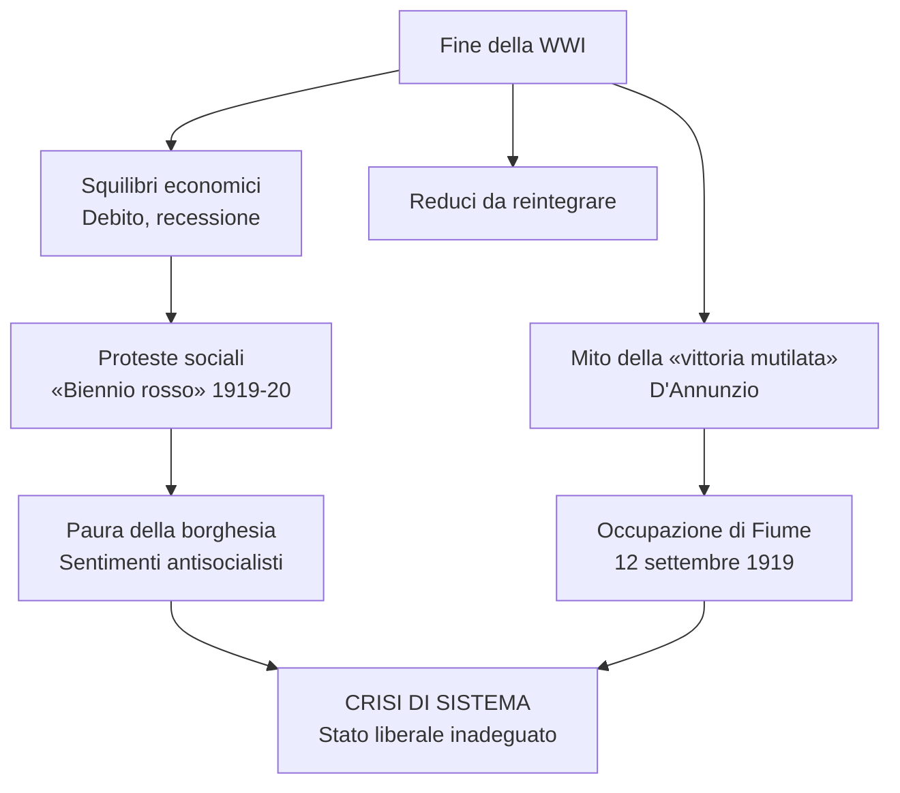
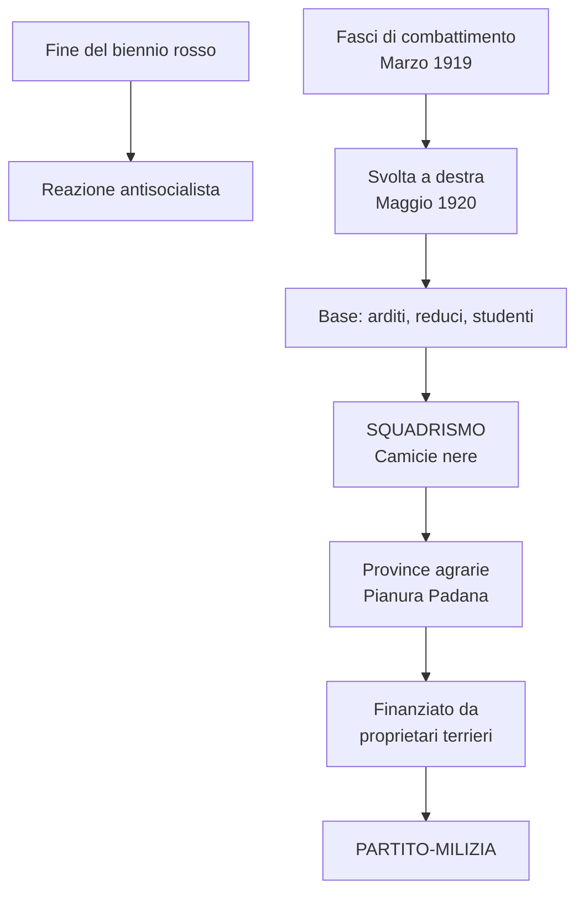
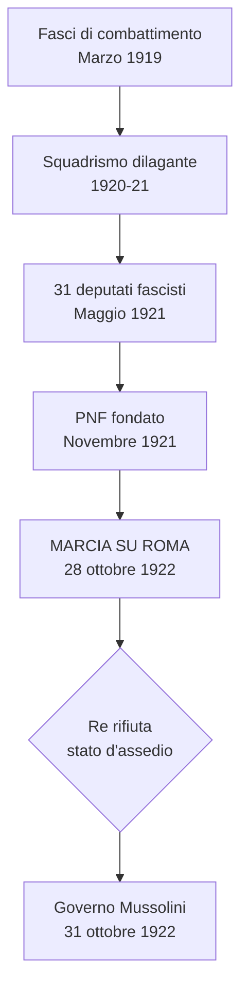
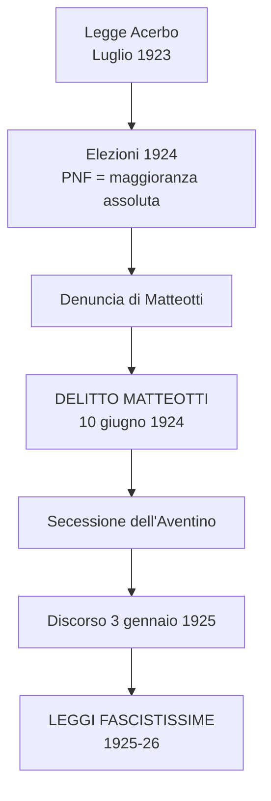
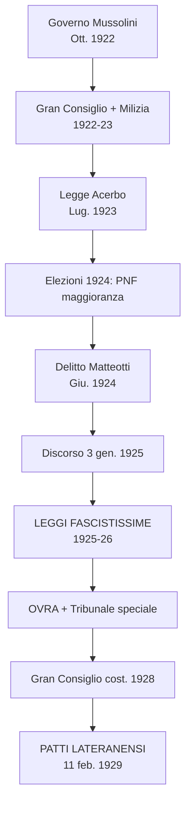
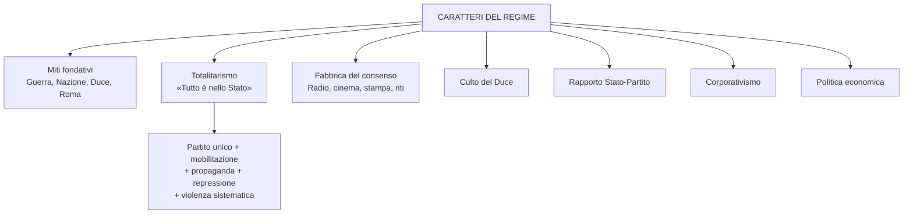
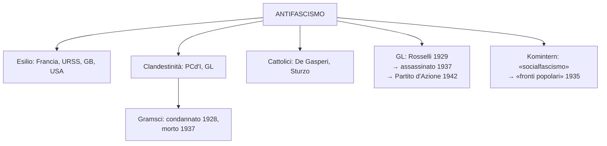
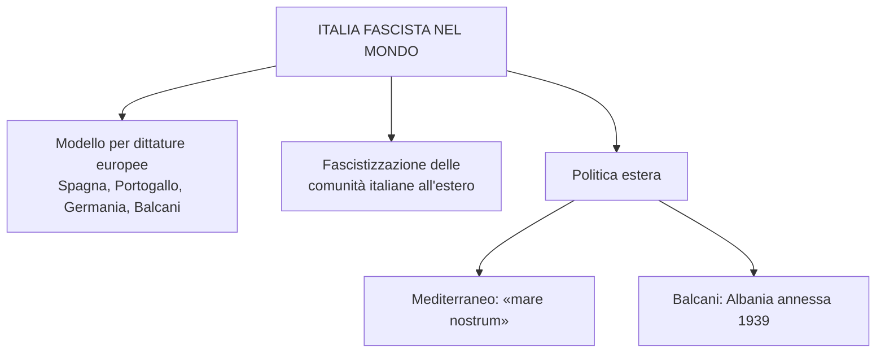

# Schema di Studio - Capitolo 3.9: Il fascismo in Italia (Riassunto)

---

## Date fondamentali del capitolo

| Anno / Data | Evento |
|-------------|--------|
| **Marzo 1919** | Mussolini fonda a Milano i **Fasci di combattimento** (programma «di San Sepolcro») |
| **Settembre 1919** | D'Annunzio occupa **Fiume** e ne proclama l'annessione |
| **Novembre 1919** | Elezioni proporzionali: vittoria di **socialisti** (156 seggi) e **popolari** (100 seggi) |
| **Dicembre 1920** | Giolitti sgombera Fiume; **Trattato di Rapallo** (12 novembre 1920) |
| **Gennaio 1921** | Fondazione del **Partito comunista d'Italia** a Livorno |
| **Maggio 1921** | Elezioni: **31 deputati** fascisti nelle liste di «blocco nazionale» |
| **Novembre 1921** | Fondazione del **Partito nazionale fascista (PNF)** al congresso di Roma |
| **28 ottobre 1922** | **Marcia su Roma**; governo Mussolini (31 ottobre) |
| **Dicembre 1922** | Istituzione del **Gran Consiglio del fascismo** |
| **Gennaio 1923** | **Milizia volontaria per la sicurezza nazionale**; fusione PNF-ANI |
| **Luglio 1923** | **Legge Acerbo** (premio di maggioranza) |
| **Aprile 1924** | Elezioni: PNF conquista **275 seggi** (maggioranza assoluta) |
| **10 giugno 1924** | Assassinio di **Giacomo Matteotti**; secessione dell'Aventino |
| **3 gennaio 1925** | Discorso di Mussolini alla Camera: svolta dittatoriale |
| **1925-26** | **«Leggi fascistissime»**: regime a partito unico |
| **1926** | **OVRA** (polizia politica), **Tribunale speciale**, **pena di morte** |
| **1928** | Gran Consiglio diventa **organo costituzionale**; nuovo sistema elettorale |
| **11 febbraio 1929** | **Patti Lateranensi**: conciliazione Stato-Chiesa |
| **1929** | **Giustizia e Libertà** fondata da Carlo Rosselli a Parigi |
| **1931** | Crisi regime-Azione Cattolica; enciclica *Non abbiamo bisogno* |
| **1934** | Istituzione effettiva delle **corporazioni** |
| **1937** | Assassinio di **Carlo e Nello Rosselli** in Normandia |
| **1939** | Annessione dell'**Albania** al Regno d'Italia |

---

## 1. La crisi del dopoguerra

### Gli squilibri economici, la protesta sociale e i lasciti della guerra

L'Italia uscì dalla guerra in **condizioni critiche**: l'economia era squilibrata a causa della crescita abnorme dei settori **siderurgico e metallurgico**, lo Stato era fortemente indebitato verso **Gran Bretagna e Stati Uniti**, e si doveva **riconvertire l'apparato produttivo** in un momento di **recessione internazionale**. La **dipendenza dall'estero** e la **debolezza finanziaria** rendevano la situazione particolarmente grave.

Ne derivarono **forti turbolenze sociali**: nella primavera-estate del 1919 si registrarono proteste per il **caroviveri**, **occupazioni di terre** (promesse durante il conflitto ma mai redistribuite) e **scioperi** diffusi. L'Italia entrava nel suo **«biennio rosso»**. La protesta era **spontanea** e non organizzata politicamente, ma la borghesia — colpita dall'inflazione e vicina al declassamento — paventò un'affermazione bolscevica e accrebbe i propri **sentimenti antisocialisti**.

A complicare il quadro, la reintegrazione dei **reduci** (che si organizzarono in **associazioni di ex combattenti e mutilati**) e il **mito della «vittoria mutilata»**, espressione coniata da **Gabriele D'Annunzio**. Questo mito fu l'arma più efficace della **destra nazionalista** per radicalizzare lo scontro: socialisti, interventisti democratici e classe dirigente liberale venivano indicati come responsabili della politica delle «rinunzie». La destra conservatrice saldò **lotta al bolscevismo e difesa della guerra**.

> [!note] Dalla lezione
> D'Annunzio aveva scelto l'immagine con precisione retorica: la **Nike di Samotracia** del Louvre — la statua della Vittoria alata, priva della testa e delle braccia, appunto "mutilata". Una vittoria incompleta, ferita. In due parole riusciva a collegare l'umiliazione diplomatica del 1919 a un'immagine dell'arte classica che tutti conoscevano. Un esempio perfetto di come la grande retorica funziona sulla piazza politica.

### La crisi di sistema e l'occupazione di Fiume

Lo **Stato liberale** era ormai **inadeguato ai tempi**: la classe dirigente non sapeva misurarsi con i nuovi equilibri internazionali. D'Annunzio promosse l'**occupazione di Fiume** (12 settembre 1919), con l'appoggio delle forze armate. Il governo Nitti si oppose. Quindici mesi dopo, il governo Giolitti sgomberò Fiume con la forza, dopo il **Trattato di Rapallo** (12 novembre 1920): l'Italia otteneva il litorale austriaco, Zara, diverse isole; **Fiume** diventava **entità indipendente**.

L'impresa fiumana rappresentò una **rottura del monopolio dell'uso legittimo della forza** da parte dello Stato e il culmine della mobilitazione dell'esercito contro il governo. Fiume divenne il simbolo di una nazione «nuova», l'Italia rigenerata dalla guerra.

### La crescita dei partiti di massa e le elezioni del 1919

La guerra rafforzò il **Partito socialista** (100.000 iscritti) e portò alla nascita del **Partito popolare italiano (PPI)** nel **gennaio 1919**, fondato da **Luigi Sturzo**: un partito **aconfessionale** (di cattolici ma non cattolico), **solidarista e interclassista**, con oltre **250.000 iscritti** a metà 1920. Il mondo cattolico, come forza politica autonoma, non era più un bacino di voti per i liberali. Socialisti e popolari chiesero il **sistema proporzionale a scrutinio di lista** per superare i collegi uninominali favorevoli ai liberali.

Le **elezioni del novembre 1919** furono un terremoto: i socialisti ottennero **156 seggi**, i popolari **100**, mentre i liberali (frammentati in 25+ liste) videro i consensi calare dal **67,6% al 38,9%** rispetto al 1913.

### Il «biennio rosso» italiano

L'Italia entrò nella fase più acuta del biennio rosso: le speranze rivoluzionarie ispirate dalla Russia si scontrarono con il **massimalismo generico** della dirigenza socialista. I momenti culminanti furono lo **sciopero agrario** nel bolognese (tutta l'estate, concluso con la capitolazione dei proprietari) e l'**occupazione delle fabbriche** nel **settembre 1920**, con epicentro nel **«triangolo industriale»** Torino-Milano-Genova.

La **mediazione di Giolitti** (che adottò una linea di neutralità) portò alla conclusione della vertenza con il riconoscimento delle richieste sindacali da parte degli industriali, mentre l'ondata rossa rifluì quasi «naturalmente». Ma le circostanze erano profondamente mutate: l'**età giolittiana era finita con la guerra**.

> [!note] Dalla lezione
> Il PSI vinceva le elezioni del '19 ma si rifiutava di governare: "la patata è bollente, governino altri, tanto arriverà la rivoluzione". E nel frattempo portava avanti una politica antipatriottica in un paese che aveva appena vinto la guerra — attaccando fisicamente i reduci per strada, vilipendendo la bandiera. Un autogol clamoroso. Noi oggi, con la razionalità dello storico che interviene *dopo* (la "nottola di Minerva" di Hegel: la civetta si alza in volo solo sul far della sera), possiamo vedere che l'ondata rossa stava già rifluendo. Ma chi viveva quei mesi *percepiva* l'Italia sull'orlo di una rivoluzione. Questa distanza tra realtà e percezione è la chiave per capire il fascismo.

---

## 2. La violenta ascesa del fascismo: da Milano a Roma (1919-22)

### La reazione antisocialista e il primo fascismo

Alla fine del 1920, mentre la spinta rivoluzionaria si esauriva, cresceva la **reazione antisocialista**: alle elezioni amministrative avevano prevalso i «blocchi nazionali» (centro-destra) tranne che a Milano e Bologna. In questo quadro, **Benito Mussolini** — ex leader socialista passato all'interventismo — aveva fondato a Milano nel **marzo 1919** i **Fasci di combattimento** con un programma di sinistra (anticlericale, repubblicano, antiparlamentare). L'esordio elettorale del 1919 fu **fallimentare** (poche migliaia di voti). Al congresso del **maggio 1920** la linea si **spostò a destra**, verso la difesa delle borghesie produttive e dei ceti medi.

### Lo squadrismo: una nuova esperienza politica, figlia della guerra

Il fascismo era un **prodotto della guerra**: la base comprendeva ex **«arditi»** (truppe d'assalto), reduci giovani e studenti pervasi dai miti dell'azione, della forza e della virilità.

> [!note] Dalla lezione
> Quasi tutti i fascisti della prima ora venivano dal socialismo — erano socialisti interventisti espulsi dal PSI nel 1914-15. Il 1919-20 va letto come un **regolamento di conti**: quelli che nel '15 avevano perso il dibattito interno (i neutralisti rimasti nel partito) vogliono prendersi la rivincita sulla guerra e sulla vittoria, attaccando chi aveva combattuto. E quelli espulsi nel '14 per l'interventismo si ritrovano dall'altra parte con la camicia nera, ferocemente antisocialisti. Era come un'unica grande famiglia di sinistra che si stava spaccando e consumando la propria vendetta. Organizzati in **squadre paramilitari** («**camicie nere**»), promuovevano un **uso sistematico della violenza** soprattutto nelle province agrarie della **Pianura Padana**, dove la contrapposizione tra il movimento socialista (leghe, cooperative, amministrazioni comunali) e i **grandi e medi proprietari** — finanziatori del fascismo padano — era più aspra. Il fascismo si profilava come un **partito-milizia**: la violenza era un tratto qualificante, non accidentale.

### La violenza dilagante e le spaccature nel movimento operaio

Lo **squadrismo** si estese a macchia d'olio tra autunno 1920 e primavera 1921: dall'Emilia-Romagna alla Puglia, dalla Lombardia alla Toscana, dal Polesine a Marche e Umbria. Nel primo semestre del 1921 furono distrutte **119 Camere del lavoro**, 107 cooperative, 83 leghe contadine, ~200 sedi associative. Tra marzo e maggio 1921: **340 morti** (195 socialisti e comunisti, 64 fascisti, 24 forze dell'ordine, 57 estranei) e quasi **1400 feriti**. Città come Bologna, Ferrara, Cremona, Firenze e Siena divennero **roccaforti** dello squadrismo.

Nel frattempo, nel **gennaio 1921** a **Livorno** nacque il **Partito comunista d'Italia** da una scissione nel PSI, scaturita dalla questione dell'**adesione al Komintern**. Vi confluirono i sostenitori di **Amedeo Bordiga** e i giovani della rivista **«Ordine Nuovo»**: **Antonio Gramsci** e **Palmiro Togliatti**. La scissione indebolì ulteriormente il fronte antifascista.

### Connivenza dello Stato e legittimazione elettorale

> [!note] Dalla lezione
> I capi locali dello squadrismo si chiamavano **Ras** — termine etiope che indicava il capo di una tribù. L'uso di questa parola veniva direttamente dalle guerre coloniali italiane in Africa Orientale. Mussolini era il Duce; i caporioni di provincia — Balbo a Ferrara, Grandi a Bologna, Farinacci a Cremona — erano i Ras: capi di bande che comandavano con la forza bruta, difficili da tenere a bada anche per lo stesso Mussolini.

L'espansione fascista fu favorita dalla **connivenza degli organi dello Stato** (polizia, esercito, magistratura) che vedevano nelle squadre un appoggio contro i «sovversivi». Giolitti propose ai fascisti di entrare nelle liste di **«blocco nazionale»** per le elezioni del **maggio 1921**: i fascisti ottennero **31 deputati** (tra cui Mussolini), legittimandosi politicamente. Il PSI restava primo partito (123 seggi), il PPI secondo (108). Giolitti, deluso dai risultati, si dimise.

### La sottovalutazione del pericolo fascista

I governi **Bonomi** e **Facta** mancavano dell'autorevolezza necessaria. Le forze di opposizione al fascismo erano **divise e paralizzate**: il PSI si spaccò ulteriormente (ottobre 1922: nasce il **Partito socialista unitario** di Turati e Matteotti); il PPI non era unito; i liberali **sottovalutavano** il fenomeno fascista, convinti di poterlo riassorbire, e l'ostilità reciproca con i cattolici impediva alleanze. Risultato: **paralisi del sistema politico**.

### Dal PNF alla marcia su Roma

Un tentativo di **patto di pacificazione** con i socialisti (agosto 1921), promosso da Bonomi, fu disatteso. Si manifestarono tensioni tra Mussolini e i **ras** locali (**Grandi** a Bologna, **Balbo** a Ferrara, **Farinacci** a Cremona): le squadre provinciali erano il fondamento del potere fascista, ma i ras avevano bisogno della leadership nazionale di Mussolini. Le due vie d'uscita: continuare la violenza e fondare il **Partito nazionale fascista (PNF)** al congresso di Roma nel **novembre 1921** — partito di massa attorno al Duce, con milizie armate inquadrate. Nel 1922 superò i **200.000 iscritti**.

L'assalto al potere maturò nell'autunno 1922: occupazione di Trento e Bolzano, dichiarazioni rassicuranti al convegno di Napoli (24 ottobre), insurrezione nelle città del centro-nord e la **marcia su Roma** il **28 ottobre**. Facta propose lo **stato d'assedio**, ma il **re rifiutò**. Mussolini ricevette l'incarico di formare il governo. Il **31 ottobre** si insediò un **governo di coalizione**: compimento di un itinerario di **eversione** che dal 1919 aveva provocato circa **3000 morti**.

> [!note] Dalla lezione
> La marcia su Roma fu interpretata in modo diverso dai protagonisti. Per Balbo era la vera **rivoluzione fascista** — bisognava combattere le istituzioni. Per Mussolini era più probabilmente un bluff. Lui da Napoli tornò prudentemente a Milano, a dirigere il suo giornale, con la Svizzera non lontana. Il 30 ottobre, sapendo di aver vinto, arrivò in treno a Roma — rasato, elegantissimo, in abito doppiopetto. Era il Mussolini "in doppiopetto", quello della strategia legale, non il rivoluzionario in camicia nera. Il discorso alla Camera fu una serie di smargiassate: "Potevo fare di quest'aula sorda e grigia un bivacco di manipoli; potevo sprangare il Parlamento. **Potevo: ma non ho almeno in questo primo tempo voluto**." Ovviamente aveva avuto fortuna — il re non aveva firmato lo stato d'assedio — ma lui la presentò come magnanimità. (discorso del bivacco, 16 novembre 1922)

> **Le domande degli storici — Quando nacque il fascismo?** Le origini risalgono alla fine dell'Ottocento (Emilio Gentile: masse sulla scena politica, nazionalismo, sindacalismo rivoluzionario, futurismo). Ma fu la **Prima guerra mondiale** a creare le condizioni decisive. Roberto Vivarelli pone l'accento sulla **difesa dello Stato nazionale** in nome dell'eredità della guerra: Mussolini fu il solo leader capace di incanalare quel «moto degli animi» in un progetto politico.

---

## 3. La nascita di un nuovo regime (1922-29)

### Violenza e accordi politici per il controllo sul Paese

Il governo mantenne un'**ambiguità genetica**: coalizione secondo lo Statuto albertino, ma guidato dal Duce. Le violenze squadriste continuarono (rappresaglia a Torino, dic. 1922 con oltre 20 morti; assassinio di **don Giovanni Minzoni** ad Argenta, ago. 1923). Nel **marzo 1923** il PNF si fuse con l'**Associazione nazionalista italiana (ANI)**, acquisendo ~1500 sezioni, ~25.000 camicie azzurre, e personalità come **Alfredo Rocco** e **Luigi Federzoni** — decisive per **ristrutturare lo Stato in senso gerarchico**.

Il **Gran Consiglio del fascismo** (dicembre 1922) divenne l'organo supremo del partito con funzioni di indirizzo governativo. La **Milizia volontaria per la sicurezza nazionale** (gennaio 1923) inquadrò le squadre in un corpo di polizia alle dipendenze del Presidente del Consiglio, contrastando le **spinte centrifughe** dei ras provinciali.

### La legge Acerbo e le elezioni del 1924

La **legge Acerbo** (luglio 1923) introdusse un **premio di maggioranza**: un minimo del **25%** dei voti avrebbe garantito **due terzi dei seggi**. La sua approvazione da parte dei deputati liberali rappresentò la loro **definitiva capitolazione**. Mussolini neutralizzò l'opposizione del PPI con una duplice strategia: **violenza squadrista** e **aperture alla Santa Sede** (salvataggio del Banco di Roma, insegnamento religioso obbligatorio con la riforma Gentile). Sturzo fu costretto alle dimissioni.

Le **elezioni dell'aprile 1924**: la Lista nazionale ottenne ~2/3 dei voti (374 seggi su 535). Il **PNF** contava **275 seggi**: **maggioranza assoluta**. Il progetto giolittiano di assorbire il fascismo si era **capovolto**: i liberali venivano inglobati nel fascismo.

> [!note] Dalla lezione
> Il paradosso della legge Acerbo: fu costruita appositamente per far scattare un premio di maggioranza al 25% dei voti, e poi alle elezioni del '24 il meccanismo non servì nemmeno — la Lista Nazionale Fascista prese da sola il 65%. Fu proprio questa schiacciante vittoria (ottenuta con intimidazioni davanti ai seggi) che spinse Matteotti a denunciare tutto in parlamento. Lo pagò con la vita.

### Il delitto Matteotti e la svolta dittatoriale

Le elezioni si svolsero in un clima di violenza. **Giacomo Matteotti**, segretario del PSU, denunciò violenze e manipolazioni. Il **10 giugno 1924** fu **sequestrato e ucciso** da squadristi legati ai collaboratori di Mussolini. L'opposizione proclamò la **secessione dell'Aventino** (con eccezione dei comunisti), provocando una **grave crisi** per il governo.

Dopo mesi di incertezza, Mussolini reagì con il discorso del **3 gennaio 1925**: assunse piena «responsabilità politica, morale, storica» di tutto l'accaduto.

Seguì un'ondata di violenza con la collaborazione della polizia. **Giovanni Amendola** e **Piero Gobetti**, aggrediti, morirono nei primi mesi del 1926 in esilio. **Benedetto Croce** promosse il **Manifesto degli intellettuali antifascisti** (1° maggio 1925), in risposta al *Manifesto* fascista di Giovanni Gentile. **Salvemini** pubblicò la rivista clandestina «Non mollare».

### Le «leggi fascistissime» e la stretta repressiva

Le **«leggi fascistissime»** (1925-26), elaborate dai nazionalisti **Rocco** e **Federzoni**, configurarono un **regime a partito unico** che formalmente salvaguardava la monarchia ma modificava di fatto il regime politico:

| Ambito | Provvedimento |
|--------|---------------|
| **Potere esecutivo** | Il **«capo del governo»** (sostituisce il Presidente del Consiglio, risponde solo al re) nomina i ministri e propone le leggi |
| **Amministrazione locale** | Poteri accresciuti ai **prefetti**; **podestà** di nomina governativa al posto dei sindaci eletti |
| **Libertà di organizzazione** | **Abolita**: fuori legge tutti i partiti tranne il PNF |
| **Diritto di sciopero** | **Abolito**: monopolio fascista della rappresentanza dei lavoratori; Magistratura del lavoro |
| **Stampa** | **Fascistizzata**: testate allineate o chiuse; solo giornalisti iscritti al PNF |
| **Opposizione parlamentare** | Deputati dichiarati **decaduti**; alcuni arrestati (Gramsci, 1926), altri in esilio |

La stretta repressiva comprendeva l'**OVRA** (polizia politica, controllava antifascisti e fascisti stessi), il **Tribunale speciale per i delitti contro lo Stato** (9 condanne a morte eseguite, 5.155 condannati a pene detentive) e il **confino** (circa **15.000 italiani** tra 1926 e 1943 inviati a residenza obbligata in località isolate). Emilio Lussu lo definì il «capolavoro del regime»: un meccanismo che rendeva più per la minaccia che per la pena.

### Il Gran Consiglio come organo costituzionale

Nel **1928** il Gran Consiglio divenne **organo costituzionale** con un nuovo sistema elettorale: la lista unica veniva scelta dal Gran Consiglio tra i nominativi proposti da sindacati e associazioni fascisti; gli elettori potevano solo **approvare in blocco**. Nel **1929** il PNF fu messo alle dipendenze del capo del governo: densa **compenetrazione tra Stato e partito**.

### I Patti Lateranensi e il dualismo con la Chiesa

I cattolici mostravano atteggiamenti diversificati verso il fascismo: una minoranza clerico-fascista, una maggioranza antifascista o prudente, e un'**Azione Cattolica** (ristrutturata nel 1922 da Pio XI) che **diffidava** delle ambizioni totalitarie sull'educazione.

Papa **Pio XI** (eletto febbraio 1922) scelse di **non opporsi** al regime per risolvere la «questione romana». I negoziati (dal gennaio 1923) si conclusero l'**11 febbraio 1929** con i **Patti Lateranensi** (firmati da Mussolini e il card. **Pietro Gasparri**):

| Accordo | Contenuto |
|---------|-----------|
| **Trattato** | Riconoscimento reciproco; sovranità papale sullo **Stato della Città del Vaticano** |
| **Concordato** | Regolava i rapporti tra Stato e Chiesa in Italia |
| **Convenzione finanziaria** | Risarcimento per la perdita dei territori pontifici |

Grande successo per il regime, ma la Chiesa restava **concorrenziale nella formazione delle coscienze**. La crisi del **1931** vide l'offensiva fascista contro l'Azione Cattolica (1 milione di iscritti, di cui 100.000 nella Gioventù cattolica). Mussolini ordinò lo scioglimento dei circoli. Pio XI reagì con l'enciclica *Non abbiamo bisogno* (condanna del totalitarismo fascista). Un **compromesso** a settembre risolse la crisi.

> [!note] Dalla lezione
> Due dettagli che aiutano a capire i Patti. Primo: già nel 1919 Orlando voleva chiuderla la Questione Romana, ma Vittorio Emanuele III rifiutò — non voleva cedere quegli 0,44 km² al Vaticano. Dieci anni dopo cedette a Mussolini. Secondo: la questione degli **Scout**. Mussolini non li sopportava perché assomigliavano troppo a una piccola milizia. Pio XI, per evitare che il regime li sciogliesse con la violenza, li sciolse lui stesso di propria iniziativa. Una concessione tattica per mantenere tutto il resto: le organizzazioni cattoliche rimasero libere, e da lì sarebbero venuti fuori molti antifascisti degli anni Quaranta.

---

## 4. I caratteri del regime: l'ambizione totalitaria
	
### I miti fondativi e lo Stato totalitario

Il fascismo, **prodotto della Grande guerra** e della brutalizzazione della politica, si configurò come un **partito-milizia di massa** con violenza e spirito guerresco come connotati **costitutivi**. I miti fondativi erano: la **guerra** (codice genetico), la **nazione** (costruzione identitaria), il **Duce** (capo carismatico) e la **romanità** (potenza dello Stato; il **fascio littorio** come simbolo principe; arsenale di riti, lessico e canoni estetici). Roma non era nostalgia ma programma di futuro.

Lo **Stato totalitario** era il principio cardine: «per il fascista, tutto è nello Stato, e nulla di umano e spirituale esiste fuori dello Stato». Il termine «totalitario», coniato in ambiente **antifascista**, indicava un progetto con **elementi di modernità** (partito unico, mobilitazione di massa, propaganda con radio e cinema, repressione pianificata, violenza sistematica, trasformazione antropologica «dall'alto») al servizio della dittatura. Il fascismo univa modernizzazione e tradizionalismo (**ruralismo**).

> [!note] Dalla lezione
> La voce "Fascismo" dell'Enciclopedia Italiana (1932), firmata da Mussolini ma scritta da **Giovanni Gentile**, è il documento in cui il fascismo definisce se stesso. Gentile era un neohegeliano e applicò la sua filosofia: lo Stato fascista come incarnazione dello **Stato etico** hegeliano — l'entità che armonizza tutto, realizza il bene comune, è "la famiglia in grande". Questa è l'origine filosofica di "tutto è nello Stato". Curiosità: quella Enciclopedia Italiana è la Treccani che usiamo ancora oggi. L'Italia non ne aveva una propria; fu un'impresa culturale fascista, finanziata dal conte Giovanni Treccani, diretta da Gentile. Centodue anni dopo è ancora lì.

### La «fabbrica del consenso» e il culto del Duce

Anche il potere autoritario doveva **conquistare un consenso**: gli strumenti furono l'**inquadramento**, l'**educazione** e la **manipolazione**. La **«fabbrica del consenso»** fu gestita dall'ufficio stampa della Presidenza del Consiglio, poi dal **Ministero della Cultura popolare (Minculpop)** dal 1937. La **radio** (anni '30, diffusa in edifici pubblici e osterie) trasmetteva i discorsi di Mussolini; il **cinema** (cinegiornali dell'Istituto **LUCE** obbligatori prima di ogni proiezione) e la **stampa** controllata completavano il quadro.

Il regime si legittimava con **riti** di una «religione politica»: **adunanze di massa**, culto della bandiera, venerazione dei «martiri fascisti» (collettivo «presente!»). Il **Duce** era il capo carismatico (concetto di Max Weber: autorità riconosciuta per poteri straordinari), interprete della nazione, primo capo del governo a visitare tutte le regioni, oratore teatrale (eredità D'Annunzio). Motto: «**credere, obbedire, combattere**».

> L'anarchico Camillo Berneri (*Mussolini grande attore*, 1934) sosteneva che il successo del Duce derivava dalle capacità scenografiche più che dal programma: «arrivare al potere è più facile che essere un uomo di stato». Ma denunciava anche la responsabilità collettiva: il «grande attore» aveva vinto perché il Paese non era «né sano né maturo».

### Partito e Stato: compenetrazione e compromesso

Il fascismo non è riducibile a «mussolinismo»: il **PNF** era un **elemento costitutivo** del regime. Da 299.876 iscritti (1922) passò a **1.057.118** (1930), con un'epurazione nel 1926 (~150.000 colpiti). Il partito aveva una ferrea **struttura gerarchica**: i **gerarchi** erano nominati da Mussolini; il congresso del 1925 fu l'ultimo.

Non vi fu mai **totale sovrapposizione** Stato-partito (l'esercito restò autonomo). Nel **gennaio 1927** Mussolini ribadì la **preminenza dello Stato**: i prefetti avevano suprema autorità provinciale, i **federali** fascisti dovevano «obbedienza». Il fascismo realizzò un **compromesso** con monarchia, esercito e burocrazia. Mussolini fu l'**arbitro** del regime, regolatore di tutti i conflitti interni.

### Il corporativismo, perno ideologico

Il **corporativismo** mirava a riunire lavoratori e imprenditori in un'unica organizzazione per settore, eliminando la lotta di classe (pur mantenendo immutate le gerarchie produttive). Si fondava sulle **corporazioni medievali**, sull'**interclassismo** cattolico e sulla pretesa di essere una «**terza via**» tra capitalismo e socialismo.

Tappe: **Patto di Palazzo Vidoni** (1925, sindacati fascisti e padronali come interlocutori unici) → legge sul divieto di sciopero e serrata e **monopolio sindacale fascista** (1926; Confederazione del Lavoro sciolta nel 1927) → **Ministero delle Corporazioni** (1926) → **Carta del lavoro** (1927) → corporazioni istituite solo nel **1934**. Esperimento **incompleto e fallimentare**, ma architrave ideologico del regime.

### Politica economica: «Quota 90», grano e bonifiche

**«Quota 90»** (1926): rivalutazione della lira a **90 lire per una sterlina** (dalle 153 del dopoguerra). Sfavoriva i settori orientati all'export (tessili), ma attraeva **capitali dall'estero** e favoriva le importazioni di materie prime e macchinari. Risultato: saldatura con i grandi gruppi industriali (Montecatini, Fiat, Ansaldo, Breda), potere economico verso **chimica, metalmeccanica, elettricità**.

Nel settore agricolo: la **«battaglia del grano»** (autosufficienza cerealicola) e le **bonifiche** di zone paludose e malariche (impresa simbolo: **Agro Pontino** nel Lazio).

---

## 5. L'antifascismo

### Forme di resistenza e attività clandestina

L'antifascismo fu resistenza alla dittatura, **alternativa al regime** e **cantiere di rinnovamento** delle culture politiche italiane — presupposto della **Resistenza** (post 8 settembre 1943). Nella popolazione la forma più diffusa di dissenso fu la salvaguardia personale di uno **spazio di indipendenza** culturale, etica e spirituale.

Dopo la legge del **6 novembre 1926** (scioglimento di tutti i partiti), gli antifascisti operarono **in esilio** (soprattutto in **Francia**, ma anche URSS, GB, USA) o **in clandestinità**. All'estero si ricostituirono i partiti italiani. Principali esuli: comunisti **Togliatti**, **Di Vittorio**, **Longo**; socialisti **Nenni**, **Turati**, **Saragat**; sindacalista **Buozzi**; liberali/democratici **Amendola**, **Gobetti**, **Salvemini**, **Nitti** (dal 1924).

In Italia, il **Partito comunista** mantenne la più efficace attività clandestina organizzata (~**10.000 militanti** fino al **1932**, quando la polizia ne smantellò gli organi direttivi). **Antonio Gramsci**, leader del partito, fu condannato a 20 anni nel 1928 e **morì nel 1937** per le conseguenze del regime carcerario.

### Giustizia e Libertà

Il riferimento ideale degli antifascisti liberal-democratici e socialisti era nel pensiero di **Piero Gobetti** e **Gaetano Salvemini**: la critica dell'Italia liberale come proposta di un Paese da rigenerare. **Giustizia e Libertà (GL)** fu fondata a Parigi nel **1929** da **Carlo Rosselli** (evaso dal confino dopo aver favorito la fuga di Turati). GL organizzò in Italia **gruppi clandestini** — il più attivo quello torinese con **Leone Ginzburg** (morto in carcere nel 1944) e **Vittorio Foa**. Dopo le retate del **1934-35**, l'attività proseguì all'estero: Rosselli organizzò una brigata nella **guerra civile spagnola** (1936).

Nel **giugno 1937** Mussolini ordinò l'assassinio di **Carlo e Nello Rosselli** a Bagnoles-de-l'Orne (Normandia). L'eredità confluì nel **Partito d'Azione** (1942).

### Antifascismo cattolico e ipoteca di Mosca

Gli antifascisti cattolici ebbero margini limitati dalla conciliazione del 1929: **Alcide De Gasperi** lavorò alla Biblioteca Vaticana dopo il carcere (1927-28); **Luigi Sturzo** si trasferì a Londra nel 1924.

Il **Komintern** condizionò pesantemente l'antifascismo: fino ai primi anni '30 vietò la collaborazione con partiti «borghesi» (riformisti = **«socialfascisti»**), indebolendo fatalmente il fronte antifascista. Solo nel **1935** (VII congresso), dopo l'avvento di Hitler, fu approvata la svolta verso i **«fronti popolari»**: alleanza antifascista tra comunisti e «borghesi».

---

## 6. L'Italia fascista nel mondo

### Modello per le dittature europee

La politica estera era fondamentale per la legittimità del regime: Mussolini ambiva a un **ruolo di protagonista mondiale**, rappresentando un'**alternativa a capitalismo e socialismo**. Il fascismo fu **modello** per le destre rivoluzionarie e reazionarie, influenzando le dittature di **Spagna** (Primo de Rivera 1923-30, poi Franco dal 1939), **Portogallo** (Salazar dal 1932), **Germania** (Hitler, ammiratore del Duce) e vari regimi autoritari nei **Balcani** e nell'Europa centro-orientale. Il regime fascistizzò le **comunità italiane all'estero** tramite i Fasci italiani all'estero.

### Politica estera

Mussolini fu il principale artefice, coadiuvato da **Dino Grandi** (1929-32) e **Galeazzo Ciano** (1936-43). Ambiti prioritari: il **Mediterraneo** (*«mare nostrum»*, ambizioni egemoniche) e l'**Europa danubiano-balcanica**. Il **Trattato di Roma** (1924) assegnò centro storico e porto di **Fiume** all'Italia. Tra 1926 e 1927 penetrazione nei **Balcani** e protettorato sull'**Albania** (con appoggio britannico), annessa nel **1939**.
Fino alla metà degli anni '30 la linea non fu eversiva degli equilibri europei: si inserì nell'alveo tradizionale della politica estera liberale, con un più accentuato protagonismo e la pretesa revisionista alimentata dal mito della «vittoria mutilata».

